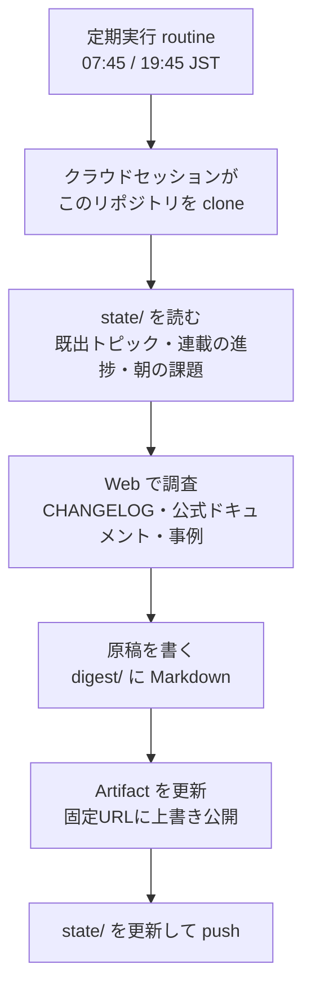

# Claude Daily

Claude / Claude Code の使い方を毎日学ぶための、**自動生成される日刊ニュースレター**です。

| | 配信 | 内容 | 読了 |
|---|---|---|---|
| 🌅 **朝刊** | 毎朝 8:00（07:45 生成） | きょうの3行／① 今日の型／② すぐ効くTIPS×3／③ 最新事例／④ 速報／⑤ きょうのミニ課題 | 5〜7分 |
| 🌙 **夕刊** | 毎晩 20:00（19:45 生成） | ① 朝の課題 答え合わせ／② 深掘り連載／③ ケーススタディ／④ チートシート／⑤ あすの予告 | 12〜15分 |

朝で「知る」、夜で「理解する」。1日で1周するように組んであります。

## 読む場所

- **Artifact（推奨）** — 朝刊・夕刊それぞれ**URLが固定**なので、ブックマークすれば毎日そこが最新号になります。URL は `state/artifact-urls.json` に記録されます。一覧は https://claude.ai/code/artifacts
- **GitHub アーカイブ** — `digest/YYYY/MM/YYYY-MM-DD-{am,pm}.md`。過去号の全文検索はこちらで。図（Mermaid）はそのまま描画されます。

## 仕組み

生成はすべて Anthropic のクラウド上で動きます。**PC の電源が入っていなくても配信されます。**

## ファイルの役割

| パス | 役割 |
|---|---|
| `prompts/morning.md` / `prompts/evening.md` | 各エージェントの実行手順。**記事の中身を変えたいときはここを編集して push する** |
| `prompts/style-guide.md` | 文体・図の作法・品質ガードレール（出典必須、推測禁止など） |
| `template/digest.html` | Artifact のデザインテンプレート。`data-edition="am"/"pm"` でアクセント色が切り替わる |
| `template/COMPONENTS.md` | テンプレートのクラス早見表 |
| `state/curriculum.md` | 深掘り連載のロードマップ（全43回）。上から順に消化する |
| `state/covered-topics.md` | 既出トピック台帳。**ネタの重複を防ぐ要** |
| `state/sources.md` | 巡回する情報源と、前回チェックした CHANGELOG バージョン |
| `state/today.md` | 朝→夕の引き継ぎ（ミニ課題と模範解答） |
| `state/artifact-urls.json` | 朝刊・夕刊の Artifact 固定URL |

## 運用

- **停止・再開・削除**: https://claude.ai/code/routines （削除は Web UI からのみ）
- **記事の内容を変えたい**: `prompts/*.md` を編集して push。routine 側の再設定は不要
- **連載テーマを足したい**: `state/curriculum.md` に追記
- **今すぐ1号出したい**: routine の「今すぐ実行」
- routine は**失効しません**（セッション内 cron と違い永続）

## カスタマイズの例

- 分量を変える → `prompts/*.md` の「分量の目安」
- 難易度を上げ下げする → `prompts/style-guide.md` の「読者プロフィール」
- 重点領域を変える → 同上（現在は **Claude Code での開発** と **チーム／業務への展開**）
- デザインを変える → `template/digest.html` の `:root` トークン
