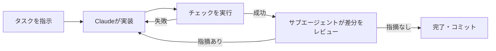

# Claude Daily 朝刊 — 2026-08-28（第001号）

## きょうの3行
- Claude Daily 朝刊、本日創刊です。まずは「検証つきで任せる」という型から始めます。
- Claude Code 公式ベストプラクティスに、実装を任せきりにせず検証を組み込む具体的な手順が整理されていました。
- Stripe は署名済みバイナリで1,370名にClaude Codeを配布し、Scala→Java移行を10週間相当から4日に短縮したと報告しています。

## ① 今日の型 — 検証つきで任せる
Claude は「終わったように見える」ところで手を止めます。合否を返すチェック（テスト・ビルド・スクリーンショット比較など）を渡さないと、間違いに気づくのは常に人間の役目になってしまいます。チェックを渡せば、実装→チェック実行→結果を読む→直す、というループを Claude 自身が回せます。


図1: 「検証チェック」と「サブエージェントによる二次レビュー」の2段構えで、任せきりでも間違いに気づける流れにする。

<div class="card">
そのまま使えるプロンプト:
</div>

```
foo.py に対して、ユーザーがログアウトしている場合のエッジケースをカバーするテストを書いてください。
モックは使わないでください。書いたら実行して、通ることを確認してください。

実装が終わったら、サブエージェントを使ってこの差分を要件と照らし合わせてください。
要件の抜け漏れと、リストにあるエッジケースがテストされているか、タスクの範囲外の変更が
紛れ込んでいないかだけを報告してください。スタイルの好みは無視してください。
```

出典: [Best practices for Claude Code](https://code.claude.com/docs/en/best-practices)

## ② すぐ効くTIPS

<div class="item">
<h3>1. CLAUDE.md は「索引」として保つ</h3>
CLAUDE.md は毎セッションの冒頭で読み込まれるため、長くなるほど個々の指示が埋もれて無視されやすくなります。ドメイン知識やときどきしか要らない手順は skill に切り出し、CLAUDE.md には「Claude が読み取れば分かること」を書かない、を徹底します。
</div>

<div class="item">
<h3>2. 訂正は2回まで。3回目は /clear</h3>
同じ点を2回訂正してもまだ的外れなら、会話には失敗した試行錯誤が積み重なっています。3回目に入る前に `/clear` して、学んだことを盛り込んだ具体的な指示で仕切り直したほうが速いです。
</div>

<div class="item">
<h3>3. 調査はサブエージェントに逃がす</h3>
「認証周りのトークンリフレッシュの仕組みを調べて」のような調査は、メインの会話でやると大量のファイル読み込みでコンテキストを消費します。「サブエージェントを使って〜を調査して」と頼めば、別コンテキストで調べて要約だけ返してくれるので、実装用の会話はきれいなまま保てます。
</div>

出典: [Best practices for Claude Code](https://code.claude.com/docs/en/best-practices)

## ③ 最新事例

<div class="item">
<h3>Stripe: 署名済みバイナリで1,370名に配布</h3>
Stripe は npm 経由のインストールが持つサプライチェーンリスクを避けるため、Anthropic と2〜3ヶ月かけて署名済みのエンタープライズ版バイナリを作り、認証やルールを設定済みの状態で全社の開発マシンに事前インストールしました。結果として、通常なら10エンジニア週かかる見積もりだった Scala から Java への1万行移行を4日で終えたと報告しています。
<p class="src"><a href="https://claude.com/customers/stripe">Stripe Claude Code case study（Anthropic公式）</a></p>
</div>

<div class="item">
<h3>30名規模のプロダクト組織: 1クオーターで基盤を整備</h3>
インストールしただけの状態から、1クオーターかけて共有スキル22個・フック11個を整備し、4ヶ月目まで持続する35%の生産性向上があったという報告があります。全社一斉導入ではなく、まず小さいチームで試してから広げるフェーズドロールアウトの一例です。
<p class="unverified">数値は一次情報での裏取りができていません（企業ブログ経由の報告）。</p>
<p class="src"><a href="https://www.digitalapplied.com/blog/case-study-claude-code-team-adoption-30-dev-shop-2026">Case Study: Claude Code Adoption at a 30-Dev Shop 2026</a></p>
</div>

## ④ 速報 — 新機能・変更点
Claude Daily は創刊号のため、直近3バージョン分をまとめて紹介します（次号以降は前回チェック以降の差分のみ）。

<div class="table-wrap">
<table>
<thead><tr><th>いつ</th><th>何が</th><th>どう効くか</th></tr></thead>
<tbody>
<tr><td>v2.1.250</td><td>不具合修正・安定性向上</td><td>機能追加なし。定期アップデートの一環。</td></tr>
<tr><td>v2.1.248</td><td><code>--restricted</code> フラグ追加、agent frontmatter に <code>experimental.cacheTtl</code>、<code>/doctor</code> での設定診断</td><td>コマンド実行やWebFetchを外した制限モードでセッションを起動できるようになり、権限が厳しい環境でも使いやすくなった。</td></tr>
<tr><td>v2.1.247</td><td><code>SendFeedback</code> ツール追加、<code>/claude-api cost-optimize</code> 強化</td><td>フィードバック送信やAPIコスト分析をセッション内から直接行えるようになった。</td></tr>
</tbody>
</table>
</div>
<p class="src"><a href="https://github.com/anthropics/claude-code/blob/main/CHANGELOG.md">Claude Code CHANGELOG</a></p>

## ⑤ きょうのミニ課題
<div class="card task">
所要 15分

いま取り組んでいる Next.js のコンポーネントか API route を1つ選び、「検証つきで任せる」型を実際に試します。

1. 小さめの機能追加かバグ修正を1つ選ぶ。
2. Claude Code に「まず失敗するテストを書いてから実装し、テストを実行して通ることを確認して」と指示する。
3. 実装が終わったら「サブエージェントを使って、この差分を要件と照らし合わせて確認して。抜け漏れだけ報告して」と続けて指示する。
4. サブエージェントの指摘のうち、直すべきものと無視してよいものを自分で判断してメモする。
5. 「テストが green になったか」「サブエージェントが何を指摘したか」を記録しておく。

答え合わせは今夜の夕刊で。
</div>
</content>
