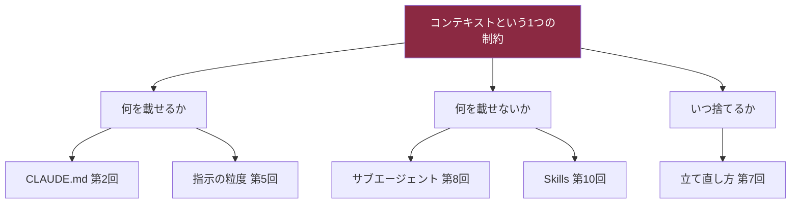
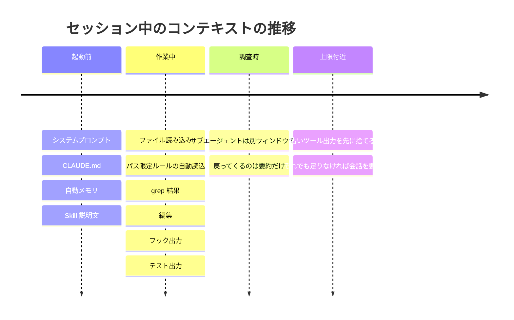

# Claude Daily 夕刊 — 2026-08-28（第002号）

## 今夜の3行
- 朝の課題「検証つきで任せる」の答え合わせと、指摘を取捨選択する基準をはっきりさせます。
- 深掘り連載を今日から始めます。第1回は**コンテキスト**。Claude Code のベストプラクティスがほぼすべて、この一つの制約から導かれています。
- ケーススタディはモノレポ。コンテキストを「チームで配分する予算」として設計する方法を、公式ドキュメントの構成例から読み解きます。

## ① 朝の課題 答え合わせ

### 課題の再掲

Next.js のコンポーネントか API route を1つ選び、(1) Claude Code に「まず失敗するテストを書いてから実装し、テストを実行して通す」よう指示する、(2) 実装完了後に「サブエージェントを使ってこの差分を要件と照らし合わせ、抜け漏れだけ報告して」と続ける、(3) サブエージェントの指摘のうち直すべきものと無視してよいものを自分で判断する。所要15分。

### 模範解答

**(1) テストの指示は「何を確認すれば十分か」まで書く。** 公式ドキュメントは、悪い例と良い例をこう対比しています。

| 悪い例 | 良い例 |
|---|---|
| `add tests for foo.py` | `write a test for foo.py covering the edge case where the user is logged out. avoid mocks.` |
| `implement a function that validates email addresses` | `write a validateEmail function. example test cases: user@example.com is true, invalid is false, user@.com is false. run the tests after implementing` |

違いは「対象のエッジケース」と「終わったら実行して確認する」が指示に含まれているかどうかです。これがないと、Claude は自分で「十分なテスト」を定義してしまいます。

**(2) レビューの指示は範囲を3点に絞る。** 「要件との照合」「列挙したエッジケースがテストされているか」「タスク範囲外の変更が混ざっていないか」。公式の例文は最後を `Report gaps, not style preferences.`（スタイルの好みではなく抜け漏れを報告して）で締めています。

**(3) 指摘は correctness に関わるものだけ拾う。** これは自分で判断するというより、ドキュメントに明記された方針です。

> 抜け漏れを探すよう指示されたレビュアーは、仕事が健全であっても普通は何かしら報告してきます。そう指示されたからです。すべての指摘を追いかけると過剰設計につながります — 余計な抽象化の層、防御的なコード、起こり得ないケースのためのテスト。

（出典ページの Callout より要約）

### なぜそうなるのか

Claude は「終わったように見える」ところで手を止めます。合否を返すチェックがなければ、「終わったように見える」が唯一の停止シグナルになり、検証ループを回すのは常に人間の役目になります。逆にチェックを渡せば、実装 → 実行 → 結果を読む → 直す、のループを Claude 自身が閉じられます。

そしてレビュアーを**サブエージェント**（親とは別のコンテキストで動く子セッション）にするのが効くのは、そのレビュアーが「その変更を生んだ思考過程」を見ていないからです。差分と評価基準だけを見て、結果そのものを評価します。書いた本人が採点者にならない、という構図がここで作れます。

### よくある詰まりどころ

- **テストの実行環境が整っていない。** Next.js の API route はサーバー／クライアント境界が絡むため、jest / vitest の設定が未整備だとテスト自体が動きません。着手前に `npm test` が通る状態か確認しておくと、つまずきが1つ減ります。
- **レビュー指示が広すぎる。** 「レビューして」だけだと、スタイルの好みまで返ってきて、直すべき指摘が埋もれます。
- **「口約束」で満足してしまう。** 「テストを書いて実行して」と頼んでも、それは指示であって強制ではありません。もっと強く縛りたい場合、公式には段階が用意されています。

| 縛りの強さ | 方法 | 何が起きるか |
|---|---|---|
| 弱（今日の課題） | 同じプロンプト内で「実行して確認して」と頼む | Claude の判断で実行される |
| 中 | `/goal` に合否条件を設定する | 毎ターン後に別の評価器が条件を再チェックし、解消するまで作業が続く |
| 強 | `Stop` フックでチェックをスクリプト実行する | 通るまでターンの終了自体がブロックされる（8回連続でブロックすると Claude Code 側が打ち切る） |
| 別軸 | `/code-review` スキル | 現在の差分をサブエージェントがバグ観点でレビューし、結果をセッションに返す |

見張っていられない時間が長いほど、下の段が効いてきます。

出典: [Best practices for Claude Code](https://code.claude.com/docs/en/best-practices)

## ② 深掘り連載 第1回 — コンテキストという概念

### なぜ重要か

公式のベストプラクティス集は、本文の冒頭でこう宣言しています。

> ほとんどのベストプラクティスは、たった1つの制約から導かれます: Claude のコンテキストウィンドウはすぐ埋まり、埋まるにつれて性能が落ちる。

そして「コンテキストウィンドウは**最も重要な管理対象リソース**」と書いています。これは比喩ではありません。Claude Code でうまくいかないときの原因は、モデルの賢さ不足よりも「見せているものが多すぎる／間違っている」であることが圧倒的に多い、という前提でツール全体が設計されています。

ここを掴むと、以降の連載（CLAUDE.md、プランモード、サブエージェント、Skills、Hooks……）が全部「コンテキストをどう配分するか」の各論として読めるようになります。だから第1回にこれを置きます。



図1: 連載全体マップ。今日は最上段の「制約そのもの」を扱います。以降の回はすべてこの3方向のどれかに属します。

### 仕組み — セッション中に何が積まれるのか

コンテキストウィンドウには、会話のすべてが入ります。あなたのメッセージ、Claude が読んだファイルの中身、コマンドの出力、そして**ターミナルには一度も表示されないもの**。

まず、あなたが最初の一文字を打つ前に、もう中身は入っています。公式の可視化ページが示す代表値は次のとおりです（実測ではなく、典型的なセッションを表す代表値）。

| 起動時に載るもの | 代表値（トークン） | 見えるか |
|---|---|---|
| システムプロンプト | 4,200 | 見えない |
| 自動メモリ（MEMORY.md） | 680 | 見えない |
| 環境情報（作業ディレクトリ・OS・git 状態） | 280 | 見えない |
| MCP ツール名（スキーマは遅延読み込み） | 120 | 見えない |
| Skill の説明文 | 450 | 見えない |
| `~/.claude/CLAUDE.md` | 320 | 見えない |
| プロジェクトの `CLAUDE.md` | 1,800 | 見えない |
| **合計** | **約 7,850** | |

プロンプトを打つ前に約 7,850 トークン。ここに `Read` が1回 1,000〜2,400 トークン、`npm test` の出力が 1,200 トークン、といった単位で積み上がっていきます。デバッグ1回、コードベース探索1回で数万トークンが飛ぶ、というのはこういう計算です。



図2: 起動 → 作業 → 調査 → コンパクションの流れ。注目すべきは「上限付近」の2段階です。Claude Code はいきなり要約するのではなく、**まず古いツール出力を捨て、それでも足りなければ会話を要約します**。

### コンパクションで何が残り、何が消えるか

自動コンパクション（会話履歴の要約）が走ったとき、何が生き残るかは「どう読み込まれたか」で決まります。ここは知らないとハマる部分です。

| 読み込まれ方 | コンパクション後 |
|---|---|
| システムプロンプト | そのまま（そもそも会話履歴ではない） |
| プロジェクトルートの CLAUDE.md、`paths:` なしのルール | ディスクから再注入される |
| 自動メモリ、プランモードで書いた計画 | ディスクから再注入される |
| `paths:` 付きルール、サブディレクトリの CLAUDE.md | 該当ファイルを再び読んだときに再読込 |
| Claude が読んだ／編集したファイル | 直近更新の**5件まで**再読込。5,000トークン超のものは中身なしのパス参照になる |
| 起動した Skill の本文 | 再注入。ただし1スキル5,000トークン、合計25,000トークンが上限で、古いものから落ちる |
| 会話の中だけで伝えた指示 | 要約される（＝失われうる） |

最後の行が実務上いちばん重要です。**会話でしか言っていない指示は、コンパクションを越えられません。** 「毎回守ってほしいこと」は CLAUDE.md に書く、という定石はここから来ています（Skill 本文は先頭が優先的に残るので、`SKILL.md` の重要な指示は上に置く、というのも同じ理屈です）。

### 具体的な使い方

**まず測る。** `/context` を実行すると、いま何がどれだけ使っているかがカテゴリ別に出て、最適化の提案まで付きます。読み込まれた CLAUDE.md と自動メモリのファイル一覧も **Memory files** の項に出るので、「CLAUDE.md が効いていない気がする」ときの一次診断はまずこれです（そもそも読み込まれていない、というのが答えのことがあります）。MCP ツールごとの内訳を見たいときは `/context all`。

**減らす手は5つ。** 用途が違うので、使い分けます。

| やりたいこと | 手 | 補足 |
|---|---|---|
| 無関係なタスクに移る | `/clear` | 会話を捨てて起動直後の状態に戻す。コストはゼロ |
| 文脈は残したいが軽くしたい | `/compact focus on the auth bug fix` | 何を残すか指定できる。要約対象を読むので、それ自体は大きなリクエストになる |
| 自動コンパクションを早めに走らせる | `/autocompact 500k` | どこまで埋まったら自動要約するかの閾値を設定する |
| 大量のファイルを読む調査 | サブエージェントに投げる | 読み込みは向こうのウィンドウで起き、戻るのは要約だけ |
| 本筋に残したくない小さな疑問 | `/btw` | 回答が会話履歴に入らない |

`/btw` は地味ですが効きます。「このフラグ何だっけ」を本筋の会話に混ぜずに済みます。

**そもそも載せない設計にする。** ここが本丸です。機能ごとのコンテキストコストは公式に整理されています。

| 機能 | いつ載るか | コンテキストコスト |
|---|---|---|
| CLAUDE.md | セッション開始時、全文 | 毎リクエスト |
| Skills | 開始時に説明文、使用時に本文 | 低（説明文のみ毎回） |
| MCP サーバー | 開始時にツール名のみ、スキーマは遅延 | ツールを使うまで低 |
| サブエージェント | 起動時に別ウィンドウ | メインからは隔離 |
| Hooks | イベント発火時、外部で実行 | **ゼロ**（出力を返さない限り） |

フックのコストがゼロという点は覚えておく価値があります。たとえば「10,000行のログから ERROR 行だけ抜く」処理をフックにすれば、数万トークンが数百トークンになります。Claude に読ませずに済ませる、が最も強いコンテキスト削減です。

なお、コンテキストを広げる方向の手もあります。Fable 5 / Sonnet 5 / Opus 4.6 以降 / Sonnet 4.6 は 100万トークンのコンテキストウィンドウに対応しています（Sonnet 5 は `[1m]` バリアントの選択不要）。ただし「埋まるほど性能が落ちる」性質自体は変わらないので、広い窓は雑に使ってよい理由にはなりません。

### 使うべき時／使うべきでない時

コンテキストを積極的に切る（`/clear` する）べきなのは、次の場合です。

- 無関係なタスクに移るとき。前タスクの残骸は、次に必要なファイルを押しのけるだけです。
- 同じ点を2回訂正しても直らないとき。会話が失敗した試行錯誤で汚れています（詳しくは今朝の朝刊のTIPS 2）。
- 巨大なファイルやツール出力を1回読んでしまい、コンパクション直後にまた埋まるとき。この状態が続くと Claude Code は数回で自動コンパクションを諦めてエラーを出します。

逆に、**溜めたままでよい場合もあります**。1つの複雑な問題を深く追っていて、これまでの履歴そのものが価値を持っているときです。公式も「文脈を溜めるべきときもある」と明記しています。機械的に `/clear` するのではなく、「いま残っている情報は、次の一手に効くか」を基準にしてください。

出典: [Explore the context window](https://code.claude.com/docs/en/context-window) / [How Claude Code works](https://code.claude.com/docs/en/how-claude-code-works) / [Extend Claude Code](https://code.claude.com/docs/en/features-overview) / [Manage costs effectively](https://code.claude.com/docs/en/costs) / [How Claude remembers your project](https://code.claude.com/docs/en/memory)

## ③ ケーススタディ — モノレポでコンテキストを「チームの予算」として設計する

個人の `/clear` 習慣は個人の生産性で止まります。チームに広げるとき、コンテキストは**設定ファイルで配分する共有資源**になります。公式ドキュメントの大規模コードベース向けガイドは、まさにその設計例を載せています。

### 問題

パッケージが3つあるモノレポで、ルートに1枚だけ `CLAUDE.md` を置くと、必ずどちらかに転びます。全サブシステムの規約を書いて肥大化するか、当たり障りのない一般論になって役に立たなくなるか。前者では、API を触っているセッションがフロントエンドの規約を毎リクエスト運ぶことになります。

### 打ち手

ガイドが示す構成は、責任の所在とコンテキストの境界を一致させるものです。

```
monorepo/
  CLAUDE.md                     # 全パッケージ共通の規約だけ
  .claude/settings.json         # worktree セッション用の deny ルール
  packages/
    api/
      CLAUDE.md                 # API 固有の規約（このディレクトリのオーナーが保守）
      .claude/settings.json
      .claude/skills/api-testing/SKILL.md
    web/
      CLAUDE.md
      .claude/skills/component-patterns/SKILL.md
    shared/
      CLAUDE.md
```

`packages/api/` から Claude を起動すると、ルートと `packages/api/` の CLAUDE.md だけが載り、`packages/web/` の規約はコンテキストに入りません。読ませたくないものは設定で塞ぎます。

```json
{
  "permissions": {
    "deny": [
      "Read(./**/dist/**)",
      "Read(./**/build/**)",
      "Read(./**/*.generated.*)",
      "Read(./vendor/**)"
    ]
  }
}
```

リポジトリのルートから起動する運用が残っている場合は、他チームのパッケージの CLAUDE.md を個人設定で除外できます。こちらは `.claude/settings.local.json` に置いて、自分のマシンだけに効かせるのが基本です。

```json
{
  "claudeMdExcludes": [
    "**/packages/web/**"
  ]
}
```

### チーム・業務展開の観点

ここからが、個人技と組織運用の分かれ目です。

**1. 所有者を決める。** ガイドは「各ディレクトリのオーナーがそのディレクトリの CLAUDE.md を保守する」ことを前提にしています。そして CLAUDE.md の編集を**プルリクエストでレビューする**、つまり通常のドキュメント変更と同じ扱いにすることを勧めています。規約がコードと一緒に動くのはこの運用の効果です。

**2. モデルが新しくなったら棚卸しする。** 「古いモデルの制約を回避するために書いたルールは、新しいモデルでは単なるオーバーヘッドになりうる」という指摘があります。例として「リファクタは1ファイルずつ」といったルールが挙げられています。ルールは足すだけでなく、消す会が要ります。

**3. 使われていない Skill を実測で見つける。** ここが業務展開でいちばん効きます。OpenTelemetry のログエクスポータを有効にし、`OTEL_LOG_TOOL_DETAILS=1` を設定すると、`skill_activated` イベントに Skill 名がそのまま記録されます。`invocation_trigger` にはコマンド起動か Claude の自動判断かも入るので、「作ったが誰も使っていない Skill」を統廃合の候補として名指しできます。感覚ではなくログで整理できる、というのがチーム運用では決定的です。

**4. 増えすぎたら中央に寄せる。** ディレクトリごとの分割は、いずれ「規約がドリフトし、ルートの持ち主が誰もいない」状態に行き着きます。ガイドはその段階で、規約を Skill / プラグインに移し、プラットフォームチームがバージョン管理する形を提案しています。プラグインの Skill は `plugin-name:skill-name` の名前空間を持つので、ディレクトリごとの Skill と衝突しません。

なお、コンテキスト設定の棚卸しで実際にどれだけ削れるかについては、設定ファイル群を監査して1ターンあたりのオーバーヘッドを約10,500トークンから約4,100トークン（61%減）に落としたという個人の報告や、CLI 出力の扱いを見直して44%削減したという報告があります。いずれも個人ブログの記事で、数値は一次情報での裏取りができていません。桁感の参考としてのみ扱ってください。

> **未確認**: 上記2件の削減率は個人ブログ経由の報告であり、検証していません。

出典: [Set up Claude Code in a monorepo or large codebase](https://code.claude.com/docs/en/large-codebases) / [Manage costs effectively](https://code.claude.com/docs/en/costs)
出典（未確認・伝聞）: [Claude Code Slim: Self-Auditing Skill](https://ai-muninn.com/en/blog/claude-code-slim-self-audit-skill) / [How I cut Claude Code's token overhead by 44%](https://dev.to/harivenkatakrishnakotha/how-i-cut-claude-codes-token-overhead-by-44-and-stopped-hitting-usage-limits-mid-session-3fkf)

## ④ チートシート

今日出てきたコマンド・設定・用語です。

| 種別 | 書き方 | 何をするか |
|---|---|---|
| コマンド | `/context` | いま何がコンテキストを使っているかをカテゴリ別に表示。読み込まれた CLAUDE.md も確認できる |
| コマンド | `/context all` | MCP ツールごとのトークン内訳まで表示 |
| コマンド | `/clear` | 会話履歴を捨てて起動直後の状態に戻す。コストはゼロ |
| コマンド | `/compact focus on the auth bug fix` | 何を残すか指定して要約する |
| コマンド | `/autocompact 500k` | 自動コンパクションが走る閾値を設定する |
| コマンド | `/btw` | 会話履歴に残さずに質問する |
| コマンド | `/memory` | CLAUDE.md と自動メモリのファイルを一覧・編集する |
| コマンド | `/doctor` | チェックイン済み CLAUDE.md の削減案を提案させる |
| コマンド | `/goal` | 毎ターン後に再評価される合否条件を設定する |
| 設定 | `claudeMdExcludes` | 特定の CLAUDE.md をパス／glob で読み込み対象から外す |
| 設定 | `permissions.deny` の `Read(...)` | 生成物やベンダーコードの読み込みをブロックする |
| 設定 | `worktree.sparsePaths` | worktree に必要なディレクトリだけをチェックアウトする |
| 設定 | `.claude/rules/` の `paths:` | 該当ファイルを触ったときだけルールを読み込ませる |
| 設定 | `disable-model-invocation: true` | Skill の説明文すらコンテキストに載せない（手動起動専用にする） |
| 環境変数 | `OTEL_LOG_TOOL_DETAILS=1` | `skill_activated` に Skill 名をそのまま記録する |
| 用語 | コンパクション | 上限に近づいたとき、古いツール出力を捨て、次に会話を要約する自動処理 |
| 用語 | サブエージェント | 親とは別のコンテキストで動く子セッション。戻るのは要約だけ |
| 数値 | CLAUDE.md は200行以下が目安 | 超えると指示の遵守率が落ちる。4MiB 超はそもそも読み込まれない |
| 数値 | MEMORY.md は先頭200行または25KB | それを超えた部分は起動時に読み込まれない |

## ⑤ あすの予告

深掘り連載 第2回は「CLAUDE.md の書き方 — 効くもの・効かないもの」。今日「毎回コンテキストに載る唯一の自前ファイル」として位置づけた CLAUDE.md を、中身の粒度から見ていきます。
