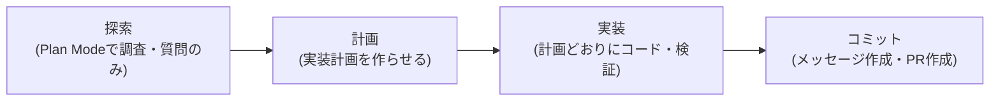

# Claude Daily 朝刊 — 2026-08-29（第003号）

## きょうの3行
- Claude Code公式の「ベストプラクティス」ガイドが、行き当たりばったりの実装を防ぐ型として「探索→計画→実装→コミット」の4段階を明確に整理していました。今日はこれを型として紹介します。
- Claude Code CHANGELOGは前回チェック（2026-08-28）からバージョン更新なし。速報は薄い日です。
- Anthropic公式の事例集に、法務テックのSpellbook・EvenUp、家計管理アプリのRocket Moneyが2026-08-26〜27付けで追加されていました。3本とも実践例として紹介します。

## ① 今日の型 — 探索→計画→実装→コミット（Plan Mode）

いきなり実装を頼むと、Claudeは「それらしく見える」コードを書いてしまい、前提を取り違えたまま進んでしまうことがあります。公式ベストプラクティスは、実装の前に「探索」と「計画」を分離することを勧めています。



- **探索**: `Shift+Tab` を何度か押して「⏸ plan mode on」を表示させるか、`claude --permission-mode plan` で起動します。Plan Modeでは Claude がファイルを読んで質問に答えるだけで、変更は一切行いません。
- **計画**: 具体的な実装計画を作らせます。`Ctrl+G` を押すと計画をテキストエディタで直接開けるので、実装に進む前に自分で1行でも手を入れる価値があります。
- **実装**: Plan Modeを解除（計画の承認 or 再度 `Shift+Tab`）してから、計画に沿って実装させ、テストやビルドで検証させます。
- **コミット**: コミットメッセージの作成とPR作成まで一気に頼みます。

そのまま使えるプロンプト例（探索フェーズ）:

```
read /src/auth and understand how we handle sessions and login.
also look at how we manage environment variables for secrets.
```

計画フェーズ:

```
I want to add Google OAuth. What files need to change?
What's the session flow? Create a plan.
```

公式ガイドは「変更内容を一文で説明できるくらい小さいタスク（typo修正、ログ追加など）」ではPlan Modeを使わず直接実装させるよう勧めています。Plan Mode自体にもオーバーヘッドがあるため、複数ファイルにまたがる変更や、触るコードに不慣れなときに使うのが効果的です。

出典: [Claude Code Best practices](https://code.claude.com/docs/en/best-practices)

## ② すぐ効くTIPS

1. **使うCLIツールを教えて使わせる。** `gh` や `aws`、`gcloud`、`sentry-cli` のようなCLIは、外部サービスとやり取りする上で最もコンテキスト効率がよい手段です。Claudeが知らないCLIでも「`foo-cli-tool --help` で使い方を学んでからA・B・Cを解決して」と頼めば、`--help` の出力から使い方を学習して使いこなします。GitHubなら `gh` を入れておくと、未認証状態でのAPIレート制限を避けられます。
2. **許可リストとサンドボックスでプロンプトを減らす。** `/permissions` で `npm run lint` や `git commit` のような安全なコマンドを許可リストに登録し、`/sandbox` でOSレベルの隔離を有効にすると、承認を都度求められる手動モードのままでも中断が大きく減ります。承認を全部自動化するのではなく、「安全とわかっている操作だけ」を対象にするのがポイントです。
3. **フックで「毎回必ず」を保証する。** CLAUDE.mdの指示はあくまで助言（advisory）で、Claudeが読み落とすことがあります。一方フック（`.claude/settings.json` の `hooks`）は決定的（deterministic）に実行されるスクリプトです。「編集のたびに毎回ESLintを走らせるフックを書いて」「migrationsフォルダへの書き込みをブロックするフックを書いて」のように頼めば、Claude自身にフックを書かせられます。

出典: [Claude Code Best practices](https://code.claude.com/docs/en/best-practices)

## ③ 最新事例

**Spellbook（法務テック、契約レビューAI）** — エンジニアリングチーム全体でClaude Codeを採用し、Fableが実装計画を作り、Sonnetなど比較的小さいモデルが実行し、最後にFableが結果をレビューするという段階的な体制を組んでいます。月間53万件の契約レビューを処理し、契約完了までの時間を10時間から約1時間に短縮（10倍）。顧客数5,000社、従業員250名まで成長したとしています。

出典: [Spellbook Claude Code case study](https://claude.com/customers/spellbook)

**EvenUp（法務テック、人身傷害案件の書類作成支援）** — 従業員200名以上にClaude EnterpriseとClaude Codeを展開し、エンジニアリングチーム内での利用が広がっています。AI費用予測システムやデバッグ用エージェントの構築にも活用。文書作成時間を8〜15時間から約30分に短縮（99%減）したほか、小規模事件での医療費見積もり精度が14ポイント向上したとしています。

出典: [EvenUp Claude Code case study](https://claude.com/customers/evenup)

**Rocket Money（個人向け家計管理アプリ）** — 自社のAI金融エージェント「Rowan」の開発にClaude Code（主にOpus、Fableも併用）を活用。月間コミット数が11件から128件へと11倍に増加し、あるプロダクトマネージャーは初コミットから3ヶ月でリポジトリ全体（76名中）のPR著者数9位に入ったとしています。

出典: [Rocket Money Claude Code case study](https://claude.com/customers/rocket-money)

## ④ 速報 — 新機能・変更点

本日はCHANGELOG・Anthropic公式ニュースのいずれにも、前回チェック（2026-08-28）以降のClaude Code関連の新しい発表はありませんでした。Claude Platform（API/SDK）の方では2026-08-27付けでファイル・スキルAPIのベータヘッダー廃止や個人／サービスアカウント向けAPIキーの追加がありましたが、いずれもAPI/SDK利用者向けの変更で、Claude Codeでの開発や業務展開に直接効くものではないため見送ります。

出典: [Claude Code CHANGELOG](https://github.com/anthropics/claude-code/blob/main/CHANGELOG.md) / [Claude Platform release notes](https://platform.claude.com/docs/en/release-notes/overview)

## ⑤ きょうのミニ課題

**課題**: 手元のNext.jsプロジェクトで、小さめの機能（例: 一覧ページに検索フィルタのUIを1つ追加する、既存フォームにバリデーションを1件追加する、など）を選び、①の型（探索→計画→実装→コミット）をそのまま体験してください。

**手順**:
1. `claude --permission-mode plan` で起動するか、通常起動後に `Shift+Tab` を数回押してPlan Modeに入る。
2. 対象機能に関わるファイルを読ませ、既存の実装パターン（似たコンポーネントやフォーム）を調べさせる。
3. 「〇〇を追加したい。どのファイルを変更する必要があるか、実装計画を作って」と頼む。
4. `Ctrl+G` で計画をエディタで開き、抜けている考慮点（エラー時の表示、空文字列の扱いなど）がないか自分の目で確認し、気づいた点を1行でも書き足す。
5. Plan Modeを解除し、計画どおりに実装させたあと `npm run build`（または `npm run lint`）を実行させて結果を確認する。

**確認方法**: 手順4で編集した計画と、実際にできあがったコードを見比べ、自分が足した考慮点がちゃんと反映されているかを確認してください。反映されていなければ、その差分こそが「計画を人間が読む価値」の実例です。

答え合わせは今日の夕刊で。
