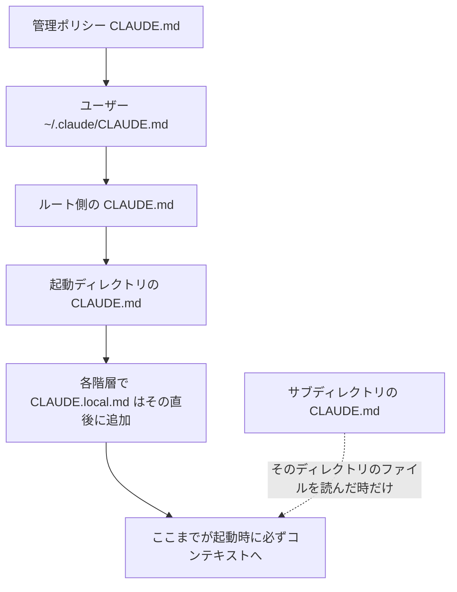
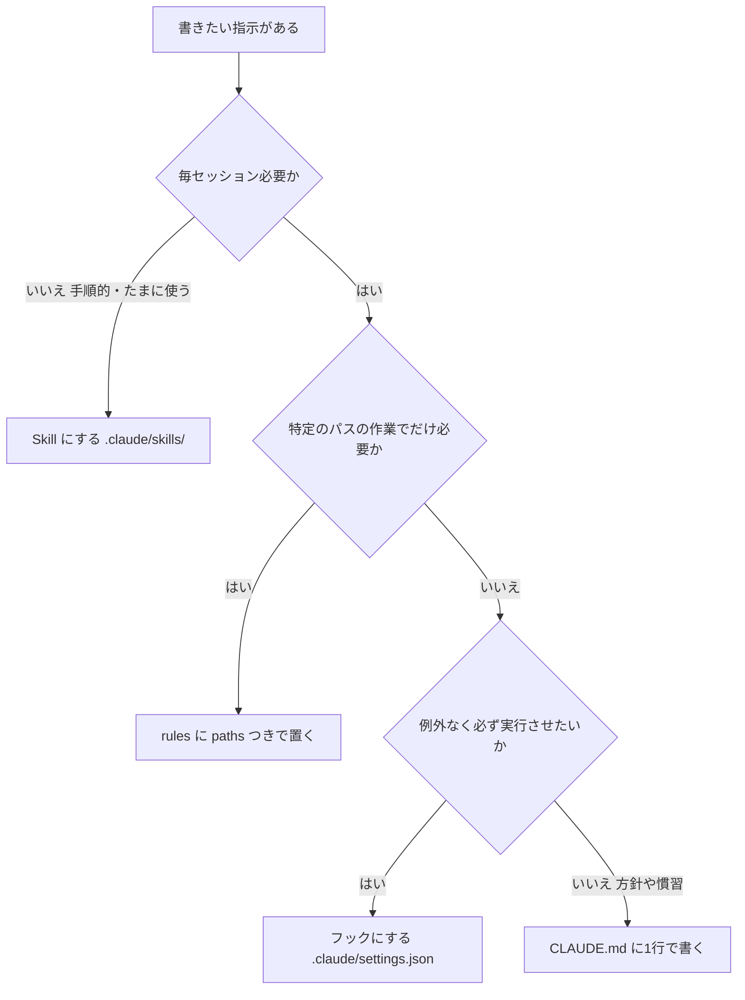

# Claude Daily 夕刊 — 2026-08-29（第004号）

## 今夜の3行
- 今朝の課題（Plan Mode で探索→計画→実装）の答え合わせをします。計画に自分で1行足せていれば合格です。落ちやすいのは「Plan Mode に入ったつもりで入っていない」パターンです。
- 深掘り連載 第2回は **CLAUDE.md の書き方**。「どこに置くと、どの順で、いつ読まれるか」を先に押さえると、「効かない指示」の原因がほぼ機械的に特定できます。
- ケーススタディは、PRレビューの指摘を週次で自動集計して `.claude/rules/` に反映し続けるという運用の報告です。CLAUDE.md を「書いて終わり」にしない仕組みの一例です。

## ① 朝の課題 答え合わせ

### 課題の再掲

手元の Next.js プロジェクトで小さめの機能（一覧ページに検索フィルタを1つ追加する、既存フォームにバリデーションを1件追加する、など）を選び、「探索→計画→実装→コミット」の型を実際に体験する、というものでした。

手順は、①`claude --permission-mode plan` で起動するか `Shift+Tab` で Plan Mode に入る ②対象ファイルと既存の実装パターンを調べさせる ③実装計画を作らせる ④`Ctrl+G` で計画をエディタで開き、抜けている考慮点を自分で1行書き足す ⑤Plan Mode を解除して実装させ、`npm run build` / `npm run lint` で確認する、の5段階です。

### 模範解答

**「Ctrl+G で開いた計画に、自分の言葉で考慮点を1行足せていれば合格」** です。何を足したかは人によって違って構いません。

Plan Mode で作られた計画は、典型的には**ハッピーパスの実装手順しか書かれていません**。実際に漏れやすいのは次の3種類です。

- **エラー時の UI 表示**: 検索が失敗したとき、バリデーションが落ちたときに画面に何を出すのか。
- **空値・未入力時の挙動**: 検索文字列が空のとき全件を返すのか、何も返さないのか。
- **既存コンポーネントとの整合性**: 命名規則、スタイルの当て方、既存のフォームが使っているバリデーションライブラリと揃っているか。

実装が終わったら、**自分が足した1行が実際のコードに現れているか**を確認してください。たとえば「検索が0件のときは空状態を表示する」と足したなら、その分岐がコードに存在するか。存在しなければ、その差分こそが「計画を人間が読む価値」の実物です。あわせて `npm run build` と `npm run lint` が通っていることも確認ポイントでした。

### なぜそうなるのか

Claude は「動くコード」を書くことは得意ですが、**書かれていない要求は要求として存在しません**。探索と計画を分離する意味は、コードが書かれる前の、まだ修正が1行で済む段階で、人間が要求の抜けを埋められる点にあります。実装が終わってからレビューで気づくと、修正はコード全体に散らばります。

計画をエディタで開ける `Ctrl+G` があるのは、そのためです。チャット欄で「あ、エラー処理も入れて」と追記するのと、計画そのものに書き込むのとでは、実装フェーズで Claude が参照する対象が変わります。

### よくある詰まりどころ

**1. Plan Mode に入ったつもりで入っていない。** これが一番多いはずです。`Shift+Tab` は権限モードの巡回切り替えなので、押した回数によっては別のモードに行きます。ステータス行に `⏸ plan mode on` が出ているかを毎回目で確認してください。確実なのは `claude --permission-mode plan` で起動する方法です。

**2. `Ctrl+G` が効かない。** ターミナルエミュレータや OS のショートカットと衝突していると開きません。また、開く先のエディタは環境変数で決まるので、`echo $EDITOR` が空なら設定してから試してください。

```bash
echo $EDITOR          # 空なら未設定
export EDITOR=vim     # 例。code -w / nano なども可
```

**3. 対象タスクが小さすぎた。** 「一文で差分を説明できる」レベルの変更（typo 修正、ログ1行追加、変数のリネーム）だと、Plan Mode のオーバーヘッドのほうが目立ちます。公式ベストプラクティスも、そうしたタスクでは計画を飛ばして直接実装させることを勧めています。効くのは、**複数ファイルにまたがる変更**か、**触るコードに不慣れなとき**です。うまみを感じられなかった人は、もう一段大きいタスクで試し直してください。

出典: [Claude Code Best practices](https://code.claude.com/docs/en/best-practices)

## ② 深掘り連載 第2回 — CLAUDE.md の書き方：効くもの・効かないもの

### 今日の位置


図1: 連載全体マップ。第1回で「コンテキストは有限で、埋まるほど性能が落ちる」ことを扱いました。今日はその有限な枠に**毎回必ず載るテキスト**の話です。

### なぜ重要か

CLAUDE.md は、Claude Code が**すべてのセッションの開始時に読み込む**唯一の常設テキストです。裏を返すと、**書いた分だけ毎回コンテキストを消費します**。第1回で見たとおり、コンテキストが埋まるほど指示の遵守率は下がります。つまり CLAUDE.md は「常に効く」代わりに「常にコストを払う」ファイルで、行を1本増やす判断は毎回トレードオフです。

そしてもう一つ、多くの人が誤解している事実があります。公式ドキュメントは、CLAUDE.md の内容が**システムプロンプトの一部としてではなく、システムプロンプトの後にユーザーメッセージとして渡される**と明記しています。だから厳密な遵守は保証されません。CLAUDE.md は設定ファイルではなく、**セッション冒頭で毎回渡される申し送りメモ**です。「絶対に守らせたいこと」をここに書くのは、そもそも設計としてずれています。

> 「CLAUDE.md の指示は助言的（advisory）、フックは決定的（deterministic）」——この対比は今朝のTIPSでも触れました。CLAUDE.md に書いても守られないなら、書き方の問題ではなく置き場所の問題かもしれません。

### 仕組み：どこに置くと、どの順で読まれるか

まず配置場所です。公式ドキュメントは4つのスコープを定義しています。

| スコープ | 置き場所 | 共有範囲 |
|---|---|---|
| 管理ポリシー | macOS: `/Library/Application Support/ClaudeCode/CLAUDE.md` ／ Linux・WSL: `/etc/claude-code/CLAUDE.md` ／ Windows: `C:\Program Files\ClaudeCode\CLAUDE.md` | 組織の全ユーザー（個人設定で除外できない） |
| ユーザー | `~/.claude/CLAUDE.md` | 自分だけ・全プロジェクト |
| プロジェクト | `./CLAUDE.md` または `./.claude/CLAUDE.md` | チーム全員（Git で共有） |
| ローカル | `./CLAUDE.local.md` | 自分だけ・そのプロジェクトのみ（`.gitignore` に入れる） |

読み込みの順序には、知っておくと効く規則があります。



図2: CLAUDE.md の読み込み順序。上から下へ「広いスコープ → 狭いスコープ」で**連結**されます（上書きではありません）。

押さえるべき点は3つです。

1. **すべて連結される。上書きではない。** 起動ディレクトリと、その上位すべてのディレクトリの `CLAUDE.md` と `CLAUDE.local.md` が読まれます。`foo/bar/` で起動すれば `foo/CLAUDE.md` と `foo/bar/CLAUDE.md` の両方が載ります。
2. **順序はファイルシステムのルート側から起動ディレクトリへ。** つまり**起動した場所に近いものが最後に読まれます**。同一ディレクトリ内では `CLAUDE.md` の後に `CLAUDE.local.md` が付きます。
3. **サブディレクトリのものは起動時には載らない。** Claude がそのディレクトリのファイルを読んだ時点で初めてコンテキストに入ります。だから「サブディレクトリに書いたのに効かない」ときは、単にまだ読まれていないだけのことがあります。

### 仕組み：インポートと、コンテキストを本当に減らす方法

CLAUDE.md は `@path/to/import` 記法で他のファイルを取り込めます。相対パスは**インポート元のファイルからの相対**で、再帰的なインポートは**最大4ホップ**です。パーサーはコードスパンとコードブロックを飛ばすので、バッククォートで囲めばただの文字列として書けます。

```markdown
See @README for project overview and @package.json for available npm commands.

# Additional Instructions
- git workflow @docs/git-instructions.md
```

ここで大事な注意があります。**インポートで分割してもコンテキストは減りません。** 公式ドキュメントは「インポートされたファイルは起動時に展開されてコンテキストに入る」「分割は整理には役立つがコンテキストの削減にはならない」と明記しています。整理のための分割と、削減のための分割は別物です。

削減できるのは、**パススコープつきルール**です。`.claude/rules/` にトピック別の Markdown を置き、フロントマターで `paths` を指定すると、**そのパターンにマッチするファイルを Claude が読んだときだけ**ロードされます。

```markdown
---
paths:
  - "src/api/**/*.ts"
---

# API Development Rules

- All API endpoints must include input validation
- Use the standard error response format
```

`paths` を書かないルールファイルは、`.claude/CLAUDE.md` と同じ優先度で起動時に無条件ロードされます。つまり `.claude/rules/` に置くこと自体が削減なのではなく、**`paths` を付けて初めて削減になります**。

そして、そもそも毎回載せる必要がないもの——手順的な作業、たまにしか使わないドメイン知識——は Skill にします。判断の流れはこうなります。



図3: 指示の置き場所を決める判断フロー。CLAUDE.md は「毎回必要で、かつ守れなくても致命的でない方針」だけが残る場所です。

### 具体的な使い方：効くもの・効かないもの

公式ドキュメントは、入れるべきものと外すべきものを表で示しています。日本語にすると次のとおりです。

| ✅ 入れる | ❌ 入れない |
|---|---|
| Claude が推測できない bash コマンド | コードを読めば分かること |
| デフォルトと異なるコードスタイル規則 | Claude が既に知っている言語の標準的な慣習 |
| テストの実行方法・使うテストランナー | 詳細な API ドキュメント（リンクで足りる） |
| リポジトリの作法（ブランチ命名、PR規約） | 頻繁に変わる情報 |
| そのプロジェクト固有のアーキテクチャ上の決定 | 長い説明やチュートリアル |
| 開発環境の癖（必須の環境変数など） | ファイル単位のコードベース説明 |
| よくある落とし穴・直感に反する挙動 | 「きれいなコードを書く」のような自明な心得 |

書き方については、公式は3点を挙げています。

- **サイズ**: 1ファイルあたり **200行未満**を目標に。長いほどコンテキストを食い、遵守率が下がります。なお Claude Code は **4MiB まで**の CLAUDE.md を全文読み込み、それを超えるファイルはスキップします（＝大きすぎると「読まれない」のではなく「無かったこと」になります）。
- **具体性**: 検証できる粒度で書く。「コードを適切にフォーマットする」ではなく「インデントは2スペース」。「変更をテストする」ではなく「コミット前に `npm test` を実行する」。「ファイルを整理する」ではなく「API ハンドラは `src/api/handlers/` に置く」。
- **一貫性**: 矛盾する規則が2つあると、Claude はどちらかを恣意的に選びます。ネストした CLAUDE.md や `.claude/rules/` も含めて定期的に見直し、古い指示を消してください。

強調の使い方にも公式の指針があります。**特定の1行だけ守られないなら、その行にだけ `IMPORTANT` を付ける。多くの行を強調すると、どれも目立たなくなります。**

そして削り方の基準として、公式は各行に対してこう問えと書いています——**「この行を消したら Claude はミスをするか？」しないなら消す。** 肥大した CLAUDE.md は、本当に守らせたい指示を埋もれさせます。

もう一つ、地味に効く仕様があります。**ブロックレベルの HTML コメント（`<!-- メンテナ向けメモ -->`）は、コンテキストに注入される前に取り除かれます。** つまり「なぜこの規則があるのか」という人間向けの補足を、トークンを1つも使わずに残せます（コードブロック内のコメントは保持されます）。

### 症状から原因を切り分ける

CLAUDE.md のデバッグは、症状からほぼ機械的に絞り込めます。

| 症状 | 疑うべき原因 | 打ち手 |
|---|---|---|
| そもそも指示が効いていない気がする | ファイルが読み込まれていない | `/context` の **Memory files** に出ているか確認 |
| ずっと同じことを守らない | ファイルが長すぎて規則が埋もれている | 削る。または `IMPORTANT` をその1行だけに付ける |
| CLAUDE.md に書いてあることを質問してくる | 表現が曖昧 | 検証できる具体的な書き方に直す |
| ファイルによって挙動が違う | 上位ディレクトリの CLAUDE.md と矛盾 | 階層をたどって矛盾を消す |
| `/compact` の後に指示が消えた気がする | 会話でしか言っていなかった | CLAUDE.md に書く（プロジェクトルートの CLAUDE.md はコンパクション後に再読み込みされます） |

診断コマンドとしては、`/context` で実際に読まれたファイルを確認し、`/memory` で編集し、`/init` で叩き台を作ります。`/init` は既存の CLAUDE.md があれば**上書きせず改善提案を返します**。さらに `/doctor` は、チェックイン済みの CLAUDE.md に対して「コードベースから導出できる内容（ディレクトリ構成、依存一覧、アーキテクチャ概要）を削り、落とし穴・理由・ツール標準と異なる慣習は残す」という方針で削減案を出します（Claude Code v2.1.206 以降）。

より踏み込んだ調査には `InstructionsLoaded` フックがあり、どの指示ファイルが・いつ・なぜ読まれたかをログに出せます。パススコープつきルールやサブディレクトリの遅延ロードを追うときに使えます。

### 使うべき時／使うべきでない時

**書き足すべきタイミング**として、公式は4つ挙げています。①Claude が同じミスを2回目にしたとき ②コードレビューで「Claude が知っておくべきだった」ことが見つかったとき ③前のセッションと同じ訂正をチャットに打ったとき ④新しいチームメンバーが同じ説明を必要とするであろうとき。逆に言えば、**まだ2回起きていないことは書かなくてよい**わけです。

**書くべきでないもの**は上の表のとおりですが、実務で判断に迷うのは「守らせたいが助言では不安」なケースです。ここは置き場所の問題として処理してください。コミット前に必ず lint を通したいなら CLAUDE.md ではなくフックです。特定ディレクトリでだけ必要な規約なら `paths` つきルールです。

チームで運用するなら、CLAUDE.md は Git にチェックインします。公式は「チームが貢献できるようにチェックインせよ。このファイルは時間とともに価値が複利で増える」と書いています。CLAUDE.md をコードと同じように扱う——おかしいときにレビューし、定期的に剪定し、変更したら Claude の挙動が実際に変わったかで検証する——のが公式の勧める姿勢です。

なお、リポジトリが既に `AGENTS.md` を使っている場合、**Claude Code は `AGENTS.md` を読みません**。`CLAUDE.md` を作って `@AGENTS.md` でインポートするか、シンボリックリンクを張ります。Windows ではシンボリックリンクに管理者権限か開発者モードが要るので、インポート記法を使ってください。

出典: [CLAUDE.md / メモリ（公式ドキュメント）](https://code.claude.com/docs/en/memory) / [Claude Code Best practices](https://code.claude.com/docs/en/best-practices)

## ③ ケーススタディ — レビュー指摘を週次で `.claude/rules/` に還元する

CLAUDE.md やルールの最大の失敗パターンは、書き方が悪いことではなく、**書いたあと更新されないこと**です。プロジェクトが変わればルールは陳腐化し、レビューでは毎回同じ指摘が繰り返されます。

株式会社 ZOZO のエンジニアチームが、この問題に対して「PRレビューの指摘を週次で自動分析し、`.claude/rules/` に反映する」仕組みを組んだという報告があります。Claude の Routines（スケジュール実行機能）を使い、**毎週月曜の朝9時に無人で走らせている**とのことです。

報告されている手順は次の6段階です。

1. `gh pr list` で直近1週間の PR を、特定のディレクトリ範囲に絞って抽出する
2. 1 PR = 1 サブエージェントで並列にレビューコメントを収集する
3. `.claude/rules/` の全ファイルを読み込んで現状を把握する
4. 「繰り返し指摘されているパターンが、ルールに未記載か」というギャップ分析を行う
5. 変更が必要なときだけ PR を作り、編集は最小限にとどめる
6. インラインコメントで、根拠となった元のレビューコメントの URL を記録する

**チーム・業務展開の観点で効いているのは、5番と6番だと思います。** 5番の「必要なときだけ PR を作る」は、更新不要と判定されれば何も作らずに終了するロジックで、これがないと毎週ノイズのような PR が積まれてチームが自動化を無視するようになります。6番の「元のレビューコメント URL を紐づける」は、後から「この規則はなぜあるのか」を辿れるようにするもので、ルールの剪定（消してよいかの判断）を可能にします。ルールは足すのは簡単で、消すのが難しい——根拠が残っていれば消せます。

運用面では、**自動生成された PR は人間のレビューを挟んでからマージする**体制が推奨されている、と報告されています。効果について具体的な数値は挙げられておらず、「同じ指摘を繰り返すコストの削減」と「チーム知識の継続的な蓄積」が期待効果として述べられています。数値の裏付けはない点は割り引いて読んでください。

自分のチームで真似るなら、まず手動で1回やってみるのが早いはずです。以下をそのまま貼って動きます。

```
直近1週間にマージされた PR のレビューコメントを gh コマンドで集めて、
2回以上繰り返されている指摘パターンを列挙してください。
そのうえで .claude/rules/ の既存ファイルを全部読み、
「繰り返されているのにルールに書かれていないもの」だけを表にしてください。
まだファイルは編集しないでください。
```

これで挙がってきた表が短ければ、ルールは足りています。長ければ、そこが自動化する価値のある場所です。

出典: [Claude Code のルールを育て続ける——Routines でレビュー指摘を .claude/rules に自動反映する（ZOZO TECH BLOG / Zenn）](https://zenn.dev/zozotech/articles/20260423_pr_review_claude_rules)

## ④ チートシート

今日出てきたものだけをまとめます。

| 項目 | 内容 |
|---|---|
| `~/.claude/CLAUDE.md` | ユーザースコープ。全プロジェクトに効く個人設定 |
| `./CLAUDE.md` / `./.claude/CLAUDE.md` | プロジェクトスコープ。Git で共有する |
| `./CLAUDE.local.md` | 自分だけの個人設定。`.gitignore` に入れる |
| `/etc/claude-code/CLAUDE.md` | 管理ポリシー（Linux・WSL）。個人設定で除外不可 |
| `@path/to/import` | 他ファイルの取り込み。最大4ホップ、相対パスはインポート元基準 |
| `` `@README` `` | バッククォートで囲むとインポートされず文字列のまま |
| `.claude/rules/*.md` | トピック別ルール。`paths` なしは起動時に無条件ロード |
| `paths:` フロントマター | マッチするファイルを読んだときだけロード。**コンテキスト削減はここ** |
| `claudeMdExcludes` | 特定の CLAUDE.md をグロブで読み込み除外（2026-08-28 夕刊で既出） |
| 200行 | 1ファイルの目安。超えると遵守率が下がる |
| 4MiB | これを超える CLAUDE.md は読み込まれない |
| `IMPORTANT` | 守られない1行にだけ付ける。多用すると効かなくなる |
| `<!-- コメント -->` | ブロックレベルの HTML コメントは注入前に除去。トークンを使わない |
| `/context` | 読み込まれたファイルを **Memory files** で確認 |
| `/memory` | メモリファイル一覧と編集。auto memory の ON/OFF も |
| `/init` | CLAUDE.md の叩き台生成。既存があれば上書きせず改善提案 |
| `/doctor` | チェックイン済み CLAUDE.md の削減案（v2.1.206 以降） |
| `InstructionsLoaded` フック | どの指示ファイルがいつ・なぜ読まれたかをログ出力 |
| `@AGENTS.md` | Claude Code は AGENTS.md を直接は読まない。インポートかシンボリックリンクで橋渡し |
| `echo $EDITOR` | `Ctrl+G` が開かないときの確認（Plan Mode の計画編集） |

## ⑤ あすの予告

深掘り連載 第3回は **「計画 → 実装 のループ」**。今日の答え合わせで触れた Plan Mode を、権限モードの仕組み・計画の受け渡し方・実装フェーズでの検証の閉じ方まで踏み込んで扱います。
