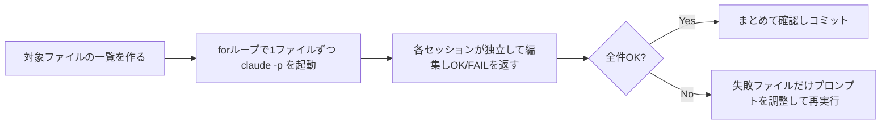

# Claude Daily 朝刊 — 2026-08-30（第005号）

## きょうの3行
- v2.1.251で「PreModelSwitch / PostModelSwitch」フックが追加され、セッション中のモデル切り替えを確認・記録・ブロックできるようになりました。
- 今日の型は「ファンアウト移行」——大量の似たファイルを1つの巨大セッションに任せず、`claude -p` のループや `/batch` で並列処理する型です。
- Deepgramの事例では、Claude Codeで「書いて→検証させる」ループを回しているチームほど、非利用者比で4〜10倍堅牢なコードを生み出しているという報告がありました。

## ① 今日の型 — ファンアウト移行

似たような変更を何十、何百というファイルに機械的に加えたいことがあります（相対importをエイリアスに揃える、古いAPI呼び出しを新しいものに置き換える、など）。これを1つのセッションに「全部やって」と頼むと、読み込んだファイルの分だけコンテキストが膨らみ、後半のファイルほど雑な変更になりがちです。

そこで、対象ファイルの一覧を作り、**ファイル1つにつき1つの独立したセッション**を起動して並列に処理します。各セッションは常に軽量なままなので精度が落ちず、失敗したファイルだけをピンポイントで再実行できます。



そのまま使えるプロンプト例（Next.jsプロジェクトでの相対importのエイリアス統一）:

```bash
# 1. 対象ファイルの一覧を作る
ls src/components/**/*.tsx > files.txt

# 2. 1ファイルずつ独立したセッションで移行する
for file in $(cat files.txt); do
  claude -p "Update the relative imports in $file to use the '@/' path alias defined in tsconfig.json. Return OK or FAIL." \
    --allowedTools "Edit"
done

# 3. 2,000ファイル級の大規模移行なら、分割自体もClaudeに任せられる
claude "/batch src/components 以下の相対importをすべて @/ エイリアスに統一して"
```

`/batch` はリポジトリ内で使うと、変更を5〜30体のサブエージェントに分割し、それぞれ専用のworktreeで作業させ、プルリクエストの作成まで一気に任せられます。最初の2〜3ファイルで結果を見てプロンプトを調整してから、残り全部に流すのがコツです。

出典: [Claude Code Best practices — Fan out across files](https://code.claude.com/docs/en/best-practices)

## ② すぐ効くTIPS

1. **auto modeの分類器に「安全な自動運転」を任せる。** auto modeは、コマンドを実行する前に別の分類器モデルが内容を確認し、スコープ逸脱や未知のインフラ操作、敵対的コンテンツ由来の操作など「危なそうなもの」だけを止めます。それ以外は確認なしで進むため、許可リストを個別に登録しなくても中断が大きく減ります。Pro/Max/Teamプランの対話セッションやVS Code拡張では既定の起動モードになっており、非対話実行でも `claude --permission-mode auto -p "fix all lint errors"` のように明示できます。
2. **Writer/Reviewerパターンで、実装セッションとは別の目でレビューする。** 実装したセッションは自分が書いたコードに引っ張られ、抜けに気づきにくくなります。別セッション（Reviewer）に差分だけを渡し、「`@src/middleware/rateLimiter.ts` をレビューして。エッジケース・競合状態・既存ミドルウェアとの一貫性を確認して」のように基準を絞って頼むと、実装の経緯を知らない分だけ結果に対して率直な指摘が返ってきます。指摘を実装セッションに戻して直す、という往復がそのままレビューフローになります。
3. **PostModelSwitchフックでモデル切り替えを記録する（v2.1.251の新機能）。** セッション再開時の復元やフォールバックでモデルが裏で切り替わっても、今までは気づきにくい状態でした。`PostModelSwitch` フックは `from_model` と `to_model` を受け取れる（切り替え後なのでブロックはできません)ため、切り替わりをログに残しておけます。逆に `PreModelSwitch` は exit code 2 で切り替えそのものをブロックできるので、「Opus 5への切り替えだけは事前に確認したい」といった運用にも使えます。

出典: [Claude Code Best practices](https://code.claude.com/docs/en/best-practices) / [Claude Code hooks リファレンス](https://code.claude.com/docs/en/hooks) / [Claude Code CHANGELOG](https://github.com/anthropics/claude-code/blob/main/CHANGELOG.md)

## ③ 最新事例

**Deepgram（音声認識API）** — Claude Codeで「まず書いて反復し、その後Claudeに実行・検証させる」というループを開発ワークフローに組み込んでいます。通常ユーザーおよび活発なユーザーは、非利用者比で「4〜10倍堅牢なコード」（＝置き換えられずコードベースに残り続けるコード）を生み出しており、最も生産性の高いチームでは実行するコードの約95%がClaude生成という報告です。顧客インシデント対応もSlack・GitHub・Grafanaなどをまたいで数日がかりだったものが数分に短縮され、新入社員が入社6週間で40件以上の大規模プルリクエストを送っているとのことです。

出典: [Deepgram Claude Code case study](https://claude.com/customers/deepgram)

**Classmethod（日本のクラウドインテグレーター）** — 技術人材不足への対応として、Ruby on Rails・Next.js・Terraformなど複数の技術スタックの開発ワークフローにClaude Codeを統合。詳細設計からのコード生成、既存コードベースの理解、テストスイートの自動生成、GitHub Issue対応、DRY原則違反やセキュリティリスクの自動レビューまで組み込んでいます。特定タスクで開発時間を最大90%、コードレビューにかかる時間を80%削減し、あるGoogle Apps Scriptの処理は24時間から1時間（96%減）に短縮。月間プルリクエスト数も1月の108件から5〜6月には165件に増えたとしています。

出典: [Classmethod Claude Code case study](https://claude.com/customers/classmethod)

## ④ 速報 — 新機能・変更点

| いつ | 何が | どう効くか |
|---|---|---|
| v2.1.251 | `PreModelSwitch` / `PostModelSwitch` フックを追加 | モデル切り替えの確認・記録（Post）やブロック（Pre）ができるように |
| v2.1.251 | フォアグラウンドのサブエージェントのツール呼び出しと結果をRemote Controlクライアントへライブストリーミング | リモートから実行中のサブエージェントの動きをリアルタイムに追跡できる |
| v2.1.251 | `/cost` にセッションごとのプロンプトキャッシュ行を追加 | キャッシュのヒット率・再ロード状況を見てコストを調整しやすく |
| v2.1.251 | ファイルツール・プラグインコマンド・ワークフローツールの複数のパストラバーサル脆弱性を修正 | セキュリティ修正。早めのアップデートを推奨 |
| v2.1.251 | 思考のみを生成した場合に「テキストコンテンツブロックは空でない必要がある」エラーで会話が固まる不具合を修正 | 思考だけを出力したときのフリーズが解消 |
| v2.1.251 | Opus 5で思考無効時にeffort `xhigh`/`max` のリクエストが失敗する不具合を修正 | Opus 5を高effortで使う運用の安定性が向上 |

出典: [Claude Code CHANGELOG](https://github.com/anthropics/claude-code/blob/main/CHANGELOG.md)

## ⑤ きょうのミニ課題

**課題**: ①の型「ファンアウト移行」を、小さなスコープで実際に体験してください。

**前提**: 手元のNext.jsプロジェクトの `tsconfig.json` に `@/*` のようなパスエイリアスが設定済みであること（未設定なら `paths` に追加してから始めてください）。

**手順**:
1. `src` 配下から、相対importで `../` を2階層以上使っているファイルを3〜5個選び、`files.txt` に書き出す（`grep -rl "\.\./\.\./" src --include="*.tsx" | head -5 > files.txt` など）。
2. 1ファイルずつ独立したセッションで移行する。
   ```bash
   for file in $(cat files.txt); do
     claude -p "Update the relative imports in $file to use the '@/' path alias defined in tsconfig.json. Return OK or FAIL." \
       --allowedTools "Edit"
   done
   ```
3. 全ファイルの処理が終わったら `grep -rn "\.\./\.\./" $(cat files.txt)` を実行し、置き換え残しがないか確認する。あわせて `npx tsc --noEmit` を実行し、パス解決エラーが出ていないか確認する。

**確認方法**: 手順3のgrepとtscがどちらもエラーなしで通れば成功です。1ファイルだけ意図通りにならなかった場合は、そのファイルだけプロンプトを少し具体的にして再実行してみてください（どこがうまくいかなかったかが、ファンアウト移行の限界を知る手がかりになります）。

答え合わせは今日の夕刊で。
