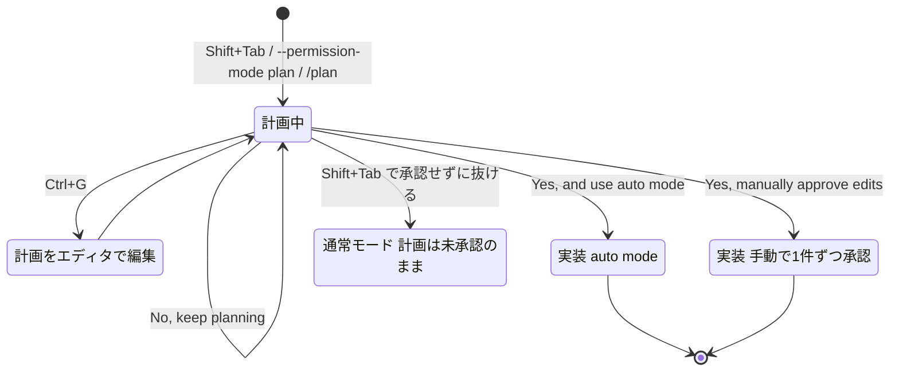
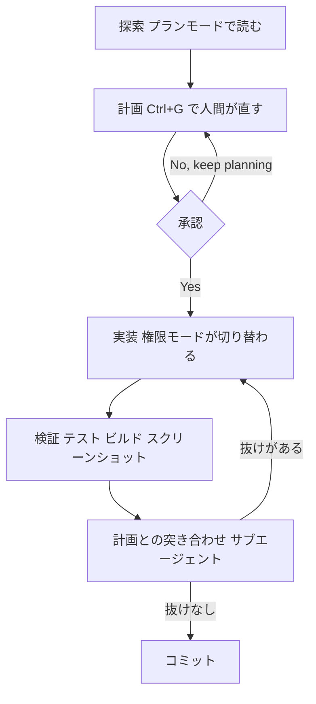

# Claude Daily 夕刊 — 2026-08-30（第006号）

## 今夜の3行
- 今朝の課題（ファンアウト移行）の答え合わせをします。`grep` と `tsc` が通っていれば合格ですが、あの `for` ループは実は**並列ではなく逐次**です。そこが今日一番の学びどころです。
- 深掘り連載 第3回は **「計画 → 実装 のループ」**。プランモードが何をブロックして何をブロックしないのか、承認の3択でセッションがどう変わるのか、そして計画をどう「実装に渡す」のかを仕様レベルで扱います。
- ケーススタディは、計画を会話に置きっぱなしにせず **`plan.md` としてコミットする**組織運用です。レビューと監査の起点を、コードではなく計画に移す考え方です。

## ① 朝の課題 答え合わせ

### 課題の再掲

Next.js プロジェクトの `src` 配下から、相対 import で `../` を2階層以上使っているファイルを3〜5個選んで `files.txt` に書き出し、次のループで1ファイル=1セッションの移行を行う、というものでした。

```bash
for file in $(cat files.txt); do
  claude -p "Update the relative imports in $file to use the '@/' path alias defined in tsconfig.json. Return OK or FAIL." \
    --allowedTools "Edit"
done
```

前提は、`tsconfig.json` に `@/*` のパスエイリアスが設定済みであることでした。

### 模範解答

各ファイルの import が `../../utils/foo` のような相対パスから `@/utils/foo` に書き換わっていること。仕上げに次の2つが両方エラーなしで通れば成功です。

```bash
grep -rn "\.\./\.\./" $(cat files.txt)   # 何も出なければOK
npx tsc --noEmit                          # パス解決エラーが出なければOK
```

`--allowedTools "Edit"` を指定しているので、各セッションは編集以外の操作（コミット、lint の自動修正など）を行いません。「OK」とだけ返ってきて、リポジトリの状態は編集ぶんしか動いていない——これが期待される挙動です。

### なぜそうなるのか

この型が効く理由は、コンテキストの使われ方にあります。1つのセッションに20ファイル分の移行を頼むと、読んだファイルの中身がすべて同じコンテキストに積み上がり、後半になるほど残り容量が減って指示の遵守率が落ちます（連載第1回で扱いました）。1ファイル=1セッションなら、どのセッションも常に「CLAUDE.md ＋ 1ファイル」ぶんの軽さで走ります。**精度が落ちない理由は賢さではなく、単に毎回コンテキストが空だからです。**

そしてもうひとつ、失敗の粒度が揃うという利点があります。20ファイルを一括で頼んで3ファイル失敗したときは、どこまでが正しいのかを人間が確かめ直す必要があります。1ファイル=1セッションなら、失敗したファイル名がそのまま再実行の単位になります。

### よくある詰まりどころ

**1. `tsconfig.json` に `paths` がない。** エイリアスが定義されていなければ、書き換えたところで解決できず `tsc` がエラーになります。始める前に `compilerOptions.paths` に `"@/*": ["./src/*"]` があるか確認してください。ここが抜けていると、Claude 側は指示どおり書き換えるので「成功したのに壊れる」という一番わかりにくい失敗をします。

**2. 「OK」を信じて grep を省略した。** ファイルによっては相対 import の深さや対象が混在していて、一部だけ置き換わっているのに `OK` が返ることがあります。**`-p` の戻り値は自己申告です。** 検証はこちらの手元で回すこと。これは今朝の型に限らず、非対話実行すべてに当てはまります。

**3. `--allowedTools` を絞らずに実行した。** 絞らないと、個別セッションが lint の自動修正やコミットまで走ることがあります。無人で何十回も回るループでは、1回あたりの副作用が全体に掛け算されます。

**4. ループが並列ではなく逐次だった。** これが今回いちばん気づいてほしい点です。今朝のループはシェルの `for` なので、**1つ終わってから次が始まります**。ファイル数が増えると単純に時間が線形に伸びます。本当に同時に走らせたいなら `xargs -P` を使います。

```bash
# 4並列で走らせる。ファイル名に空白が混じっても壊れない書き方
xargs -P 4 -I{} claude -p "Update the relative imports in {} to use the '@/' path alias defined in tsconfig.json. Return OK or FAIL." --allowedTools "Edit" < files.txt
```

ついでに `for file in $(cat files.txt)` は、ファイル名に空白が入ると分割されて壊れます。逐次のままでよいなら `while IFS= read -r file; do ... done < files.txt` が安全です。

**5. 課題が小さすぎて、ありがたみがなかった。** 3〜5ファイルではセッション起動のオーバーヘッドのほうが目立ちます。この型の損益分岐は、体感では数十ファイルからです。手応えがなかった人は、規模の問題だと思ってください。

出典: [Claude Code Best practices — Fan out across files](https://code.claude.com/docs/en/best-practices)

## ② 深掘り連載 第3回 — 計画 → 実装 のループ

### 今日の位置


図1: 連載全体マップ。第2回は「毎回必ず載るテキスト」の話でした。今日はその上で、**1つのタスクをどう始めてどう終わらせるか**という時間軸の話に移ります。第4回の権限モードは今日の内容の土台なので、今日は必要な範囲だけ先取りします。

### なぜ重要か

Claude Code の失敗のうち、かなりの割合が「実装が下手だった」ではなく「**正しく実装された、違うもの**」です。動くコードが出てきてしまうので、レビューまで気づきません。そして気づいたときには、修正すべき箇所が複数ファイルに散らばっています。

計画フェーズを分ける目的はただ一つ、**修正コストがまだ「文書を1行直す」で済む時点に、人間の判断を差し込むこと**です。公式のベストプラクティスは、この分離を「探索 → 計画 → 実装 → コミット」の4フェーズとして推奨しています。

逆に言えば、**分離のうまみがないタスクではやらないほうがよい**ということでもあります。公式はこう書いています——「差分を一文で説明できるなら、計画は飛ばす」。

### 仕組み：プランモードは何を止め、何を止めないか

プランモードは、Claude に「調べて提案はするが、変更はしない」と指示する権限モードです。ファイルを読み、探索用のシェルコマンドを実行し、計画を書きますが、**ソースは編集しません**。編集は、あなたが計画を承認するまでブロックされ続けます。

入り方は3つあります。用途が違うので使い分けてください。

| 入り方 | 効く範囲 | 向いている場面 |
|---|---|---|
| `Shift+Tab` でモードを巡回 | 切り替えて以降ずっと | 会話の途中で「一旦止めて設計したい」とき |
| `claude --permission-mode plan` | そのセッション全体 | 最初から計画のつもりで起動するとき |
| プロンプトの先頭に `/plan` | **その1プロンプトだけ** | 普通に作業しながら、1回だけ計画させたいとき |

`/plan` 接頭辞は地味ですが実用的です。モードを切り替えて戻す手間なしに、1回分だけ計画フェーズを差し込めます。

プロジェクト全体の既定にするなら、`.claude/settings.json` に次を書きます。本番リポジトリで「まず計画から」を強制したいときの定番です。

```json
{
  "permissions": {
    "defaultMode": "plan"
  }
}
```

VS Code 拡張が開始する会話は、開始時の権限モードについてプロジェクト設定を読みません。VS Code では代わりに、ユーザー設定の `claudeCode.initialPermissionMode` に `plan` を指定します。

ここからが仕様の要点です。**プランモードは「読み取り専用モード」ではありません。**

- auto mode が使える環境では、`useAutoModeDuringPlan` 設定（既定でオン）により、**計画中のシェルコマンドは分類器モデルが審査します**。承認されたコマンドは実行され、却下されたものはブロックされます。あなたには確認が出ません。
- auto mode が使えない環境では、組み込みの読み取り専用コマンドセットの外にあるコマンドは、都度確認が出ます。
- そして最も重要な点——**bypass permissions が使える状態で起動したセッションでは、プランモードのブロックそのものが強制されません。** Claude は「編集せずに計画せよ」と指示されてはいますが、計画中に試みた編集やコマンドは確認なしで実行されます。

つまり **プランモードはセキュリティ境界ではなく、作業の進め方の枠**です。「プランモードだから何をしても安全」という前提でコンテナ外の危険なリポジトリを触らせるのは、設計としてずれています。安全境界の話は次回（第4回）で扱います。

### 仕組み：承認の3択が、セッションの権限モードを決める

計画ができると、Claude は計画を提示して進め方を尋ねます。ここで選ぶ選択肢は、**単なる Yes/No ではなく、実装フェーズの権限モードの選択**です。

| 選択肢 | 承認後のセッション |
|---|---|
| **Yes, and use auto mode** | auto mode で実装（auto mode が使えない環境では **Yes, auto-accept edits** と表示。bypass permissions 有効で起動していた場合は bypass permissions に切り替える選択肢になる） |
| **Yes, manually approve edits** | 編集を1件ずつ自分で承認しながら実装 |
| **No, keep planning** | プランモードのまま。何を直すか伝える |



図2: プランモードの入り方・直し方・抜け方。`Shift+Tab` で抜けた場合は**計画を承認していない**ので、実装フェーズに計画が「渡って」いません。ここが混同されやすい分岐です。

覚えておくと効くのが3点あります。

1. **`Ctrl+G` で計画をエディタで開いて直せる。** 承認前に、計画そのものに書き込めます。チャット欄に「エラー処理も入れて」と追記するのとは、実装時に Claude が参照する対象が変わります。
2. **`showClearContextOnPlanAccept` を有効にすると、選択肢の先頭に「承認して計画時のコンテキストを消す」が増えます。** これは実務上かなり大きい設定です。探索フェーズで読み込んだ大量のファイル内容は、実装フェーズにはもう要りません。計画だけを残して探索の残骸を捨てられるので、実装フェーズを空に近いコンテキストで始められます。
3. **計画を承認すると、セッションに計画由来のタイトルが自動生成されます**（すでに名前を付けている場合を除く）。並行セッションを何本も走らせるとき、後から `claude --resume` で探す手がかりになります。

### 仕組み：計画を「どこに置くか」で運用が変わる

計画の置き場所は3通りあり、寿命が違います。

| 置き場所 | 寿命 | 向いている規模 |
|---|---|---|
| 会話の中（承認するだけ） | そのセッション限り。コンパクションで要約される | 数ファイルの変更 |
| ファイル（`SPEC.md` / `plan.md`） | セッションを跨ぐ。Git に載る | 複数日・複数人にまたがる変更 |
| Skill / `.claude/rules/` | 恒久。毎回効く | 「計画」ではなく「手順」になったもの |

大きめの機能では、公式は**先に Claude にこちらを取材させる**やり方を勧めています。そのまま使えます。

```text
I want to build [ここに機能の概要]. Interview me in detail using the AskUserQuestion tool.

Ask about technical implementation, UI/UX, edge cases, concerns, and tradeoffs. Don't ask obvious questions, dig into the hard parts I might not have considered.

Keep interviewing until we've covered everything, then write a complete spec to SPEC.md.
```

公式が付けている条件が的確です。**良い仕様書は自己完結している**——関係するファイルとインターフェースの名前が書いてあり、何がスコープ外かが書いてあり、最後に「機能が動くことを証明する end-to-end の検証手順」で終わっている。そして「仕様を精密にする時間のほうが、実装を見張る時間より報われる」と書かれています。

仕様が書けたら、**新しいセッションを立てて実行させます**。実装セッションは仕様書だけを見て動くので、取材のやりとりがコンテキストに残りません。

### ループを閉じる：実装のあと

計画を立てて実装させただけでは、ループは閉じていません。**「計画どおりに実装されたか」を、実装したのとは別の目で確かめる**ところまでが1周です。



図3: 1周の全体像。**E と F は別物です。** E は「動くか」、F は「頼んだものか」を見ています。テストが全部通っていても、計画に書いた要件が実装されていないことは普通に起こります。

F の突き合わせは、サブエージェント（親とは別のコンテキストで動く子セッション）に頼むのが公式の勧めです。実装した本人ではなく、差分と基準だけを見る第三者に採点させる、という発想です。

```text
Use a subagent to review the rate limiter diff against PLAN.md. Check that
every requirement is implemented, the listed edge cases have tests, and
nothing outside the task's scope changed. Report gaps, not style preferences.
```

ここで公式が添えている注意が実務的です。**「ギャップを探せ」と言われたレビュアーは、健全な実装に対してもたいてい何かを報告します。**それが依頼された仕事だからです。すべての指摘を潰しにいくと、余計な抽象化・防御的なコード・起こりえないケースのテストが増えます。**正しさか、明示した要件に影響するギャップだけを挙げさせ、それ以外は任意扱いにしてください。**

セッションを跨いで条件が満たされるまで回したいときは `/goal` を使います（4段階の締め方は [2026-08-28 夕刊](https://github.com/y-horie517/claude-news/blob/main/digest/2026/08/2026-08-28-pm.md) で扱いました）。仕組みだけ補足すると、`/goal` はセッションスコープの**プロンプト型 Stop フックのラッパー**で、毎ターン終了時に条件と会話を小型高速モデルに渡し、**「未達 / 達成 / 不可能」の3つの評決**を返させます。評価役はツールを呼ばないので、**会話に現れていないことは判定できません**。だから条件は「Claude 自身の出力が証明できる形」で書きます。条件は4,000文字まで、`or stop after 20 turns` のような打ち切り節も条件に含められます。

### 使うべき時／使うべきでない時

公式の基準は明快です。**計画が効くのは、①アプローチに確信がないとき ②複数ファイルにまたがる変更のとき ③触るコードに不慣れなとき**。逆に、スコープが明確で修正が小さいとき（typo、ログ1行、リネーム）は、計画のオーバーヘッドのほうが大きくなります。

実務で追加するなら、次の2つを目安にしてください。

- **他人がレビューする変更なら計画する。** 計画は差分の説明文としてそのまま使えます。レビュアーが「なぜこの設計か」を推測しなくて済みます。
- **自分ひとりで完結し、失敗しても `/rewind` で戻せる変更なら計画しない。** 巻き戻せるなら、試すほうが速いことがあります。

出典: [プランモード（公式ドキュメント）](https://code.claude.com/docs/en/permission-modes#analyze-before-you-edit-with-plan-mode) / [Claude Code Best practices](https://code.claude.com/docs/en/best-practices) / [/goal（公式ドキュメント）](https://code.claude.com/docs/en/goal)

## ③ ケーススタディ — 計画を `plan.md` としてコミットする組織運用

個人で使うぶんには、計画は会話の中にあれば足ります。しかしチームで運用し始めると、**「その変更は誰がいつ承認したのか」が会話ログの中にしか無い**という状態が問題になります。レビュアーは差分しか見えず、設計判断の記録は当人のターミナルの中です。

Anthropic が公開している「AI-Native SDLC playbook」は、これに対して**成果物の連鎖**という設計で答えています。各ステージが、次のステージが読むファイルをコミットする、という組み立てです。


図4: 成果物の連鎖。intent・spec・plan・差分・レビュー所見のすべてがバージョン管理され、そのコミット履歴がそのまま監査証跡になります。

計画フェーズにあたる「Plan Mode play」の手順は次のとおりです。

1. 承認済みの `intent.md` と `spec.md` を渡して、プランモードでセッションを開始する
2. **触るファイル・作業順・テスト**を名指しした実装計画を作らせる
3. リスクと代替案について計画を問い詰める
4. **「この会話を一度も見ていないエンジニアが、計画だけを読んで実装できる」** 水準になるまで直す
5. 承認した計画を `plan.md` としてコミットし、実装させる
6. 実装が計画から外れたら、**同じコミットの中で `plan.md` を更新する**

**チーム・業務展開の観点で効いているのは、4番と6番だと思います。** 4番の「会話を見ていない人が実装できる水準」は、計画の完成度を測る基準として珍しく検証可能です。会話の文脈に寄りかかった計画は、この基準で必ず落ちます。6番の「実装が外れたら同じコミットで計画も直す」は、計画をドキュメントではなく**コードと同じ寿命の成果物**として扱う宣言です。これがないと `plan.md` は初日で腐ります。

同プレイブックは、この運用の効果を「変更が最初の実装パスでマージされる割合」という先行指標と、「1変更あたりの手戻り回数」「マージされた差分がコミット済みの `plan.md` とどれだけ一致するか」という遅行指標で測ることを勧めています。**手戻りの回数を数えている**のがポイントで、これは第2回で扱った「レビュー指摘をルールに還元する」運用と同じ考え方です。

レビュー段階では、テックリードがリポジトリのルートに `REVIEW.md` を置き、レビューの観点（バグと論理エラー／セキュリティ／`spec.md`・`plan.md` との適合）を明文化します。ここで重要なのは、**Claude のレビューは所見を出すだけで、承認はできない**とブランチ保護で線を引いている点です。人間のコードオーナー承認を必須にしたうえで、人間の注意力を「最初から読む」ではなく「フラグの立った箇所を判断する」に集中させる、という配分になっています。

明日から真似るなら、`intent.md` から始める必要はありません。**次の中規模タスクで `plan.md` を1つコミットしてみる**だけで、レビューでの会話がどう変わるかは分かります。

出典: [The AI-Native SDLC playbook（Anthropic）](https://claude.com/blog/the-ai-native-sdlc-playbook)

## ④ チートシート

今日出てきたものだけをまとめます。

| 項目 | 内容 |
|---|---|
| `Shift+Tab` | 権限モードを巡回。`⏸ plan mode on` の表示で確認する |
| `claude --permission-mode plan` | セッション全体をプランモードで開始 |
| `/plan <プロンプト>` | **その1プロンプトだけ**プランモードで実行 |
| `permissions.defaultMode: "plan"` | `.claude/settings.json` でプロジェクトの既定を計画に |
| `claudeCode.initialPermissionMode` | VS Code 拡張側の設定。拡張はプロジェクト設定の開始モードを読まない |
| `useAutoModeDuringPlan` | 既定オン。計画中のシェルコマンドを分類器が審査する |
| `showClearContextOnPlanAccept` | 承認時に「計画のコンテキストを消す」選択肢を追加 |
| `Ctrl+G` | 提示された計画をエディタで開いて直接編集 |
| Yes, and use auto mode | 承認して auto mode で実装（auto 不可なら auto-accept edits） |
| Yes, manually approve edits | 承認して1件ずつ編集を確認しながら実装 |
| No, keep planning | プランモードのまま計画を直す |
| bypass permissions 有効時 | **プランモードのブロックは強制されない**。安全境界ではない |
| `/goal <条件>` | 条件が満たされるまで自動でターンを継続。条件は4,000文字まで |
| `/goal` / `/goal clear` | 状態確認 / 解除（`stop` `off` `reset` `none` `cancel` も同義） |
| `xargs -P 4 -I{}` | ファンアウトを本当に並列にする。`for` ループは逐次 |
| `while IFS= read -r file` | ファイル名に空白が入っても壊れない読み取り |
| `SPEC.md` / `plan.md` | 計画をセッションの外に出す。Git に載せて共有・監査する |
| `REVIEW.md` | レビュー観点をリポジトリルートに明文化（チーム運用） |

## ⑤ あすの予告

深掘り連載 第4回は **「権限モードと安全性 — どこまで自動で走らせるか」**。今日「プランモードは安全境界ではない」と書いた、その境界のほうを扱います。auto mode の分類器・サンドボックス・`dontAsk` / `bypassPermissions` の使い分けまで踏み込みます。
