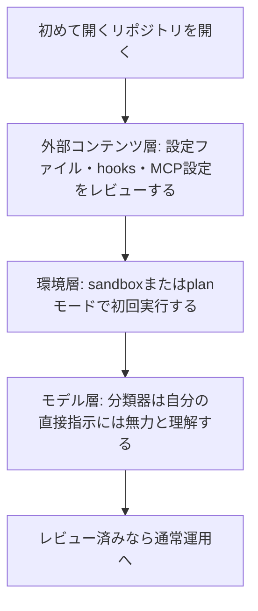

# Claude Daily 朝刊 — 2026-08-31（第007号）

## きょうの3行
- 初めて開くリポジトリは「外部コンテンツ」として扱う。Anthropicのコンテナ設計記事から、環境層・モデル層・外部コンテンツ層という3層防御の考え方を紹介します。
- Vega（サイバーセキュリティ）とLeague（ヘルスケア）の事例は、どちらも「モデルの使い分け」と「短期間での全社展開」が共通点でした。
- Claude Codeの新バージョンは前回チェック以降ありませんでしたが、Claude Enterprise向けにInference hooksがベータ提供を開始しています。

## ① 今日の型 — 初見のリポジトリを3層防御で開く

Claude Codeの安全設計を解説したAnthropicの記事「How we contain Claude across products」によると、防御は3層構造です。**環境層**（macOSの「Seatbelt」、Linuxの「bubblewrap」によるOS隔離。書き込みはワークスペース内のみ、ネットワークはデフォルト遮断）、**モデル層**（auto modeの分類器が過度な操作の約83%を実行前に検出、残り約17%は通過する想定）、**外部コンテンツ層**（MCP応答やツール出力の検査）です。

重要なのは、**モデル層はユーザー自身が直接指示した操作には無力**という点です。分類器はプロンプトインジェクションのような「Claudeが自発的に判断した危険操作」は止められますが、あなたが「これをやって」と直接頼んだ操作は素通りします。最後の砦は環境層（サンドボックス）です。

これを踏まえると、初めて開くリポジトリでの実務手順はこうなります。



`.claude/settings.json` やフックは、クローンしてきた時点では「インターネットからのリクエスト」と同じ警戒度で見るべきだ、というのがこの記事の指摘です。実行前にそのまま貼り付けて確認できるプロンプト例:

```
このリポジトリは初めて開きます。まず .claude/settings.json、.claude/hooks、
MCPサーバー設定を読んで、どんな権限・自動実行が定義されているか要約してください。
まだ変更は加えないでください。
```

レビューが終わったら `claude --permission-mode plan` か `/sandbox` で初回実行するとよいでしょう（`/permissions` での許可リスト運用や `/sandbox` の詳細は 2026-08-29 朝刊、auto modeの分類器は 2026-08-30 朝刊 を参照）。

出典: [How we contain Claude across products](https://www.anthropic.com/engineering/how-we-contain-claude)

## ② すぐ効くTIPS

### 1. Stop hookは8回連続ブロックで強制的に上書きされる
検証ゲート（Stop hook）を「絶対に破られない壁」だと思っていると、ループが止まらなくなったときに気づけません。Claude Codeは同じ場面でhookが8回連続してブロックすると、hookを上書きしてターンを終了させる仕様です。検証ロジック側にも「n回失敗したら人に戻す」という前提を持っておくと安心です。
実行例: `/hooks` で現在のStop hookの中身を確認し、失敗が続いたときに何回で打ち切られるかを意識しておく。

### 2. `/rewind` で会話の一部だけを圧縮する
長いセッションで調査部分だけ不要になったとき、`/clear` で全部消すと必要な文脈も失われます。`Esc` を2回押すか `/rewind` でチェックポイントを選ぶと、「Summarize from here」（そこから先だけ要約）と「Summarize up to here」（そこまでを要約し、直近はそのまま残す）を選べます。
実行例: `/rewind` → 不要になった調査の直後のメッセージを選択 → Summarize up to here。

### 3. サンドボックスの実装はOSSで監査できる
Claude Codeの環境層サンドボックス（Seatbelt / bubblewrap）は `anthropic-experimental/sandbox-runtime` としてオープンソース公開されています。「許可疲れ」対策として84%のプロンプト削減を実現した設計の中身を、自分の目で確認できます。
実行例: `git clone https://github.com/anthropic-experimental/sandbox-runtime` して、対象OSの許可プロファイル定義を読む。

出典: [How we contain Claude across products](https://www.anthropic.com/engineering/how-we-contain-claude)

## ③ 最新事例

### Vega（サイバーセキュリティ）— モデルを階層的に使い分けて調査を44倍高速化
Vegaは、最高リスクの確認済みアラートにOpus、中程度の分析にSonnet、大量ログの要約にHaikuと使い分けています。成果は、調査速度が従来のSIEMより44倍、データコストが82%減、分析チームの時間の67%回復、あるFortune 500企業ではトリアージ時間が25分から3分未満に短縮です。
出典: [Vega | Claude](https://claude.com/customers/vega)

### League（ヘルスケア）— 契約から全社展開まで実質1営業日
医療保険プランを扱うLeagueは、独自の並列オーケストレーションツール「Swarm」（リーダーエージェントが作業を分解し複数エージェントが並列実行）で夜間の自動コーディングセッションも運用します。新モデル発表後、金曜に契約し月曜に全社展開したといいます。Claude採用率は80%から98%へ、AI作成コードの比率は約70%から98%へ、開発サイクル（アイデアからPRまで）は半減しました。
出典: [League | Claude](https://claude.com/customers/league)

### Microsoft社内ロールアウトの学術研究 — マージPRは約24%増、ただし配るだけでは効果なし
Microsoft Researchが2026年7月1日に発表した論文は、社内でのClaude CodeとGitHub Copilot CLIの早期ロールアウトを分析しています。採用したエンジニアは、そうしなかった場合と比べマージPR数が約24%多く、効果は4か月の観測期間を通じて持続しました。一方でCopilot CLI利用者はClaude Code利用者より約2.2倍大きいリフトを示したとも報告されています。効果は継続利用と強く結びつき、単にツールを配布しただけでは出なかったと指摘されています（マージPR数は成果の代理指標であり、価値そのものではないという留保つき）。
出典: [Adoption and Impact of Command-Line AI Coding Agents（arXiv:2607.01418）](https://arxiv.org/abs/2607.01418)

## ④ 速報 — 新機能・変更点

CHANGELOG（Claude Code本体）は前回チェック（v2.1.251）以降、新しいバージョンはありませんでした。Claude Platformのリリースノートには、Enterprise向けの機能追加がありました。

| いつ | 何が | どう効くか |
|---|---|---|
| 2026-08-05 | Inference hooksがClaude Enterprise組織向けにベータ提供開始。chat・Cowork・Claude Codeに共通の1設定で、プロンプトとツール呼び出しを組織側のセキュリティサーバーに送りallow/deny判定を受けてから推論する | DLP要件のあるチーム展開で、出力側だけでなく入力側も統制できる。判定はallow/denyの二値で書き換えはできない点、Bedrock/Vertex経由の利用には適用されない点に注意 |

出典: [Claude Platform release notes](https://platform.claude.com/docs/en/release-notes/overview)

## ⑤ きょうのミニ課題

**Stop hookで検証を強制してみる**

前提: Next.jsプロジェクトで `npm run lint`（または `npm test`）が通る状態になっていること。

1. Claude Codeに次のように依頼する: 「lintが通るまでターンを終了しないStop hookを `.claude/settings.json` に書いて、`/hooks` で内容を確認して」
2. 生成されたhookの中身を確認し、どのコマンドが走り、どんな終了コードでブロック判定されているかを理解する。
3. Claudeに「意図的にlintエラーになる小さな変更をして」と頼み、Stop hookがブロックしてClaudeが自己修正するループを観察する。

確認方法: 会話の中でStop hookに阻まれてClaudeが修正を繰り返し、最終的にlintが通って正常終了することを確認する。hookの中身から、失敗時の挙動を自分の言葉で説明できれば合格です。答え合わせは今日の夕刊で。
