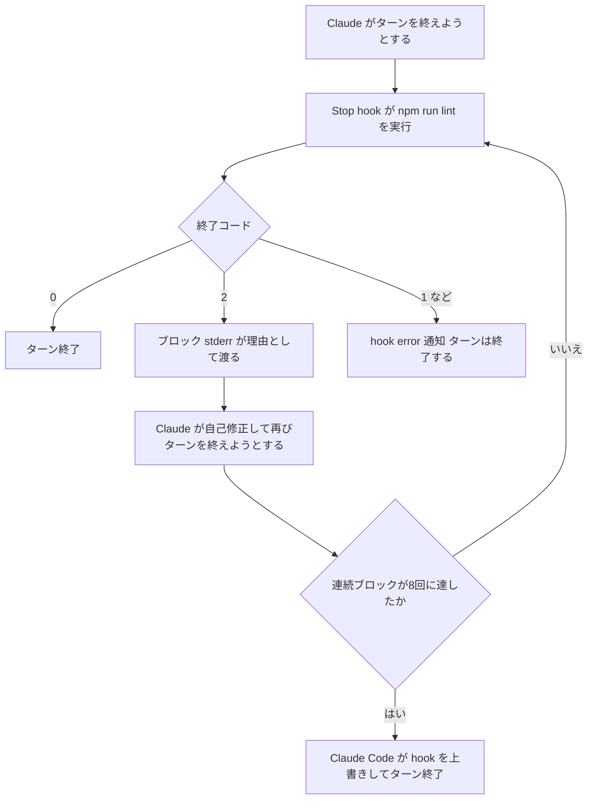
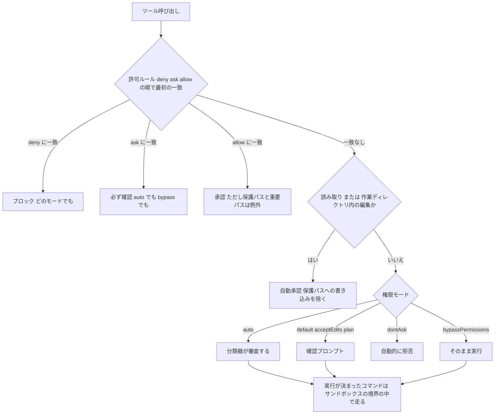

# Claude Daily 夕刊 — 2026-08-31（第008号）

## 今夜の3行
- 今朝の課題（Stop hook で lint を強制する）の答え合わせをします。鍵は**終了コード2だけがブロックを意味する**ことと、`stop_hook_active` という入力フィールドです。
- 深掘り連載 第4回は **「権限モードと安全性」**。6つのモードが何を自動承認して何を承認しないのか、auto mode の分類器がどこで呼ばれるのか、そして**どのモードでも自動承認されない領域**を仕様で押さえます。
- ケーススタディは、権限ポリシーを**組織として配る**話です。`managed-settings.json` と、開発者が上書きできなくする鍵（ロック）の使い方を扱います。

## ① 朝の課題 答え合わせ

### 課題の再掲

Next.js プロジェクトで `npm run lint` が通る状態から、Claude Code に「lint が通るまでターンを終了しない Stop hook を `.claude/settings.json` に書いて、`/hooks` で内容を確認して」と依頼し、わざと lint エラーを作らせて、ブロックと自己修正のループを観察する——というものでした。

### 模範解答

生成される設定は、`hooks` → イベント名 → マッチャーグループ → ハンドラ、という**3段のネスト**になります。Stop はツール名でのフィルタが要らないので、マッチャーは省略した形が素直です。

```json
{
  "hooks": {
    "Stop": [
      {
        "hooks": [
          {
            "type": "command",
            "command": "npm run lint",
            "timeout": 60
          }
        ]
      }
    ]
  }
}
```

これだけで「lint が失敗したらターンを終わらせない」が成立します。理由は次のとおりです。

### なぜそうなるのか

Stop hook では、**終了コード2だけがブロックを意味します**。

| 終了コード | 何が起きるか |
|---|---|
| `0` | 成功。stdout の JSON が読まれ、ブロックはしない |
| `2` | ブロック。ターンが終わらず会話が続く。stderr の内容が「なぜ続けるべきか」として Claude に渡る |
| それ以外 | 非ブロックのエラー。ターンは終わり、`<hook name> hook error` の通知が出るだけ |

`npm run lint` は ESLint がエラーを検出すると終了コード1で終わります。**1はブロックではありません**。つまり素の `npm run lint` をそのまま書いた場合、hook は「エラー扱い」になってターンは終わってしまいます。ここが今日いちばん引っかかる点です。確実にブロックさせたいなら、失敗を2に変換します。

```json
{
  "hooks": {
    "Stop": [
      {
        "hooks": [
          {
            "type": "command",
            "command": "npm run lint || exit 2",
            "timeout": 60
          }
        ]
      }
    ]
  }
}
```

JSON で明示的に伝えることもできます。`decision: "block"` と、必須の `reason`（なぜ続けるべきか）を stdout に出す形です。

```json
{
  "decision": "block",
  "reason": "lint が失敗しています。エラーを修正してから終了してください"
}
```

エラーではなく**助言として**続けさせたいときは、`hookSpecificOutput.additionalContext` を使います。ループ保護の扱いは `decision: "block"` と同じですが、トランスクリプトには `Stop hook feedback` と表示され、hook エラーの通知が出ません。「テストを流してから終わって」のように、hook が設計どおり働いているときはこちらが適切です。

そしてループの止め方です。Stop hook の入力には `stop_hook_active` が入っており、**Claude Code が既に stop hook の結果として継続している最中は `true`** になります。永久に解決しない条件でブロックし続けないために、この値を見るか、トランスクリプトを処理して判断する、というのが公式の指示です。さらに保険として、**Claude Code は8回連続でブロックされると hook を上書きしてターンを終了させます**。今朝の TIPS で触れた「8回」はこれです。



図1: Stop hook のループ。**F の枝があること**と、**H の打ち切りがあること**の2つが、体感しておくべき仕様です。

### よくある詰まりどころ

**1. lint が失敗しているのにターンが終わる。** ほぼ確実に終了コードの問題です。上の `|| exit 2` を足してください。「hook を書いたのに一度も止まらない」ときは、まず終了コードを疑います。

**2. warning しか出ておらず、そもそも失敗していない。** Next.js の lint は warning では非ゼロ終了しないことがあります。「意図的に壊す」変更は、未使用変数のような error 相当のものにしてください。

**3. 8回で打ち切られた。** 仕様どおりの挙動であって、バグではありません。ただし lint エラー1〜2件で8回に達したなら、hook のコマンド自体が壊れている可能性が高いです（実行ディレクトリが違う、コマンドが存在しない等）。Claude は「lint を直した」と思っているのに hook 側は毎回同じ失敗を返す、という噛み合わない状態になります。

**4. `/hooks` に出てこない。** 生成された JSON の構文ミスで読み込まれていません。ユーザー・プロジェクト・ローカルの設定ファイルは**厳格**で、トップレベルの形が壊れたファイルは丸ごと拒否されます（寛容なのは managed settings だけです。後述）。

**5. hook 設定を書きたくない場合。** `/goal` は、セッションスコープのプロンプト型 Stop hook の組み込みショートカットです（[2026-08-30 夕刊](https://github.com/y-horie517/claude-news/blob/main/digest/2026/08/2026-08-30-pm.md)）。使い捨ての条件なら、設定ファイルを触らずこちらで足ります。

出典: [Hooks reference（公式ドキュメント）](https://code.claude.com/docs/en/hooks)

## ② 深掘り連載 第4回 — 権限モードと安全性

### 今日の位置


図2: 連載全体マップ。第3回で「プランモードは安全境界ではない」と書きました。今日は**その境界のほう**を扱います。

### なぜ重要か

Anthropic のエンジニアリング記事は、auto mode を作った動機を身も蓋もなく書いています。ユーザーは**権限プロンプトの93%を承認している**——つまり確認ダイアログは、すでに「読まずに Yes を押す儀式」になりかけている、という認識です。全部確認すれば判断疲れが起き、`--dangerously-skip-permissions` で全部飛ばせば安全装置がゼロになる。その間を埋めるのが権限モードの設計です。

だから権限モードの選択は「面倒くさいかどうか」の話ではありません。**あなたの注意力をどこに集中させるかの配分**です。

### 仕組み：6つのモードと、その差

まず一覧です。「確認なしで実行されるもの」が各モードの本質です。

| モード | 確認なしで動くもの | 向いている場面 |
|---|---|---|
| `default`（CLI 表示は Manual） | 読み取りのみ | 一つずつ自分で見たいとき、慎重な作業 |
| `acceptEdits` | 読み取り＋ファイル編集＋`mkdir` `touch` `mv` `cp` `rm` `rmdir` `sed` | 手元で回して後から `git diff` で見るとき |
| `plan` | 読み取り＋（auto mode が使えるとき）分類器が承認したコマンド | 変更前の調査 |
| `auto` | ほぼ全部。裏で分類器が審査する | 長時間タスク、確認疲れの解消 |
| `dontAsk` | 事前承認したツールだけ。他は**自動的に拒否** | CI やスクリプト |
| `bypassPermissions` | 全部 | 隔離されたコンテナ・VM 専用 |

CLI では `manual` が `default` の別名として使えます（v2.1.200 以降）。`acceptEdits` の自動承認は**作業ディレクトリと `additionalDirectories` の中のパスだけ**で、外は確認が出ます。

`dontAsk` の性格は覚えておく価値があります。**「聞かない」ではなく「聞くくらいなら拒否する」**です。セッションは入力を待たないので、CI で確実に終わらせたいときに効きます。逆に `AskUserQuestion` は許可ルールがあっても拒否されるので、対話を含む手順は動きません。

起動時のモードは、次の順で決まります。

1. `--permission-mode` フラグ、または `--dangerously-skip-permissions`
2. 設定ファイルの `permissions.defaultMode`
3. 組み込みの既定値

ここに落とし穴が1つあります。**`"auto"` は `.claude/settings.json` と `.claude/settings.local.json` からは効きません。** プロジェクト設定に書いても無視され、しかもその場合 `~/.claude/settings.json` の `defaultMode` も使われず、組み込みの既定値が採用されます。auto を既定にしたいならユーザー設定か managed settings に置いてください。

組み込みの既定値は環境で変わります。Pro / Max / Team のプランをターミナルか VS Code 拡張で使っている場合は `auto`、Enterprise プランや Claude Console の API キー、そして `claude -p` と Agent SDK は `default` です。「同じ設定なのに同僚と挙動が違う」ときは、たいていここです。

### 仕組み：1回のツール呼び出しが通る関門

モードの違いを正確に理解するには、1回のツール呼び出しが何を順に通るかを見るのが早いです。



図3: 判定の順序。**上から順に、最初に一致したものが勝ちます。ルールの「具体性」は順序を変えません。** `Bash(aws *)` という広い deny があると、`Bash(aws s3 ls)` という狭い allow があっても通りません。deny ルールに例外を持たせることはできない、と覚えてください。

図の一番下、K が重要です。権限モードは「**実行してよいか**」を決め、サンドボックスは「**実行されたものがどこまで届くか**」を決めます。前者はコマンド文字列とモデルの判断にもとづく実行前の判定、後者は OS（macOS は Seatbelt、Linux と WSL2 は bubblewrap）が走っているプロセスに対して強制する境界です。**だからサンドボックスは、モデルが何を選んだかに関係なく効きます。** `/sandbox` は権限モードではありません。両者は独立して働き、組み合わせられます。

### 仕組み：auto mode の分類器は何を見ているか

auto mode では、確認の代わりに別のモデル（既定で Claude Sonnet 5）が行動を審査します。設計上の要点は**「推論を見ない」**ことです。分類器が受け取るのは、ユーザーのメッセージ、（読み取り系を除く）ツール呼び出し、そして CLAUDE.md の内容だけで、**ツールの実行結果は取り除かれます**。ファイルや Web ページに仕込まれた敵対的なテキストが、分類器を直接操作できないようにするためです。

性能は公開されています。実トラフィック（n=10,000）で偽陽性 **0.4%**、実際に行き過ぎた行動（n=52）に対する見逃し **17%**、合成したデータ持ち出し（n=1,000）で見逃し **5.7%**。記事自身が「危険な行き過ぎのおよそ6分の1を通してしまう」と書き、**「`--dangerously-skip-permissions` と比べれば17%は許容できる、というだけであって、重要インフラでの人間のレビューを置き換えるものではない」**と釘を刺しています。

実務で効く挙動を3つ。

1. **auto mode に入ると、広い allow ルールは一時的に落とされます。** `Bash(*)`、`Bash(python*)` のようなワイルドカード付きインタプリタ、パッケージマネージャの run コマンド、`Agent` と `Monitor` の allow ルールが対象です。`Bash(npm test)` のような狭いルールは残ります。auto mode を抜けると復元されます。
2. **会話で述べた境界は、ブロック信号として扱われます。** 「push しないで」と言えば、既定では許可される push も止まります。ただしこれはルールとして保存されず、分類器が毎回トランスクリプトから読み直すので、**コンパクションでその発言が消えると失われます**。確実にしたいなら deny ルールにしてください。
3. **ブロックが続くと auto mode は一時停止します。** 3回連続、または通算20回で確認プロンプトに戻ります。承認すると auto mode が再開します。この閾値は設定変更できません。

### 仕組み：どのモードでも自動承認されない領域

「bypassPermissions なら全部通る」は正確ではありません。次のものは、`bypassPermissions` を含むどのモードでも自動承認されません。

- 明示的な `ask` ルールに一致したツール
- ユーザーの操作を要求するツール（`AskUserQuestion`、`requiresUserInteraction` の MCP ツール）
- **重要パス（critical path）を対象とする `rm` / `rmdir`**

3つ目が実質的な安全装置です。ファイルシステムのルート、その直下のディレクトリ（`/usr` `/etc` など）、ホームディレクトリ、**作業ディレクトリとその親**を対象とする削除は、allow ルールでも `PreToolUse` hook の `"allow"` でも承認できません。`$(...)` の中に隠しても検出されます。`rm -rf "$DIR"/*` のように変数直下のグロブも、変数が空なら root からの削除になるため同じ扱いです。

これとは別に**保護パス（protected path）**があります。`.git` `.claude` `.vscode` `.idea` `.devcontainer` などのディレクトリと、`.bashrc` `.zshrc` `.gitconfig` `.npmrc` `.mcp.json` `.claude.json` などのファイルです。ここへの書き込みは `bypassPermissions` 以外では自動承認されません。**設定ファイルの `permissions.allow` に `Edit(.claude/**)` を書いても効きません**——保護パスの検査は allow ルールの評価より前に走るためです。Claude が自分の権限設定を書き換えて権限を広げる、という経路を塞ぐ設計です。

### 使うべき時／使うべきでない時

公式が挙げている組み合わせを、必要な隔離とセットで整理します。

| やりたいこと | 起動の仕方 | 必要な隔離 |
|---|---|---|
| 全部自分で見る | `claude --permission-mode default` | なし |
| 分類器なしでプロンプトを減らす | `default` ＋ `/sandbox` で auto-allow | Bash サンドボックス（macOS / Linux / WSL2） |
| 変更前に調べる | `claude --permission-mode plan` | なし |
| 手放しで進める | `claude --permission-mode auto` | なし（サンドボックスやコンテナは多層防御として有効） |
| CI で厳密な許可リストで回す | `claude -p "..." --permission-mode dontAsk --allowedTools "Bash(npm test)" "Read"` | CI ランナーが提供する範囲 |
| 完全に無人で回す | `claude -p "..." --dangerously-skip-permissions` | **必須**: コンテナ / VM / sandbox runtime。Linux と macOS では非 root ユーザーで |

最後の行の「必須」は文字どおりです。Claude Code は Linux と macOS で **root や `sudo` 下ではこのモードでの起動を拒否します**（認識済みサンドボックス内では検査が省かれます）。また、`--restricted` で起動したセッションでは `bypassPermissions` そのものが拒否されます。加えて、Claude Code on the web のクラウドセッションは、設定ファイルからの `bypassPermissions` と `dontAsk` を**黙って無視します**。リポジトリにチェックインされた設定でクラウドセッションを危険なモードで起動させられない、という設計です。

判断の目安を1つだけ挙げるなら、**「そのセッションが最悪の挙動をしたとき、何が壊れうるか」を先に決めてから、モードを選ぶ**ことです。壊れうる範囲が「このリポジトリの未コミットの変更」なら auto mode で十分ですし、「本番の認証情報」ならモードをどう選んでも足りません。隔離のほうを先に用意します。

出典: [権限モードを選ぶ（公式ドキュメント）](https://code.claude.com/docs/en/permission-modes) / [権限を設定する（公式ドキュメント）](https://code.claude.com/docs/en/permissions) / [サンドボックス化された Bash ツール（公式ドキュメント）](https://code.claude.com/docs/en/sandboxing) / [Claude Code auto mode（Anthropic Engineering）](https://www.anthropic.com/engineering/claude-code-auto-mode)

## ③ ケーススタディ — 権限ポリシーを「配る」

個人で使うぶんには、権限は `/permissions` で足ります。チームに広げた瞬間に問題になるのは、**その設定が守られている保証がどこにもない**ことです。`.claude/settings.json` はリポジトリにコミットできますが、開発者は自分の `~/.claude/settings.json` や `--allowedTools` で上書きできます。「`.env` を読ませない」をチームの約束にしても、約束のままです。

これに対する仕組みが managed settings です。配置場所は OS ごとに決まっています。

| OS | パス |
|---|---|
| macOS | `/Library/Application Support/ClaudeCode/managed-settings.json` |
| Linux / WSL | `/etc/claude-code/managed-settings.json` |
| Windows | `C:\Program Files\ClaudeCode\managed-settings.json` |

中身は `settings.json` と同じ形です。公式が最小構成として挙げているのが次の4行です。

```json
{
  "permissions": {
    "deny": [
      "Read(./.env)",
      "Read(./secrets/**)"
    ],
    "disableBypassPermissionsMode": "disable"
  },
  "allowManagedPermissionRulesOnly": true
}
```

**この設定の要は3行目の `allowManagedPermissionRulesOnly` です。** これがないと、deny ルールは開発者のルールと**マージ**されるだけで、開発者は自分の allow を足せます。`true` にすると、ユーザー・プロジェクト・ローカルの設定ファイルと `--allowedTools` からの権限ルールを Claude Code が**まるごと無視**します。「配る」と「効かせる」の差がここにあります。

同じ考え方のロックが他にもあります。サンドボックスの読み取りパスを管理側の値だけにする `sandbox.filesystem.allowManagedReadPathsOnly`、ネットワークの許可ドメインを同様に固定する `sandbox.network.allowManagedDomainsOnly`、hook を管理側のものだけにする `allowManagedHooksOnly`。いずれも**管理ソースからしか設定できません**。配列キー（`excludedCommands` など）は全スコープからマージされるので、ロックのないキーは開発者が広げられる、と理解しておく必要があります。

**チーム展開の観点でいちばん効くのは、ポリシーの「壊れ方」が違うことだと思います。** ユーザーやプロジェクトの設定ファイルは厳格で、壊れていれば読み込まれません——つまり**制限が消える方向に壊れます**。管理設定は逆で、修復できるエントリは修復し、それでも駄目なキーだけを落として残りを効かせ続けます。さらに一部のキーは**フェイルクローズ**です。`allowManagedHooksOnly` は値が不正なら `true` として扱われ、`allowedMcpServers` は不正なら空の許可リスト（＝MCP サーバーを一切通さない）として扱われます。**設定ミスが安全側に倒れる**よう作られています。

配ったあとの確認も1コマンドです。開発者のマシンで `/status` を実行し、`Setting sources` の行に `Enterprise managed settings (file)` が出ていればポリシーが効いています。この行が無ければ、そもそも届いていません。行はあるが別のソース名が出ているなら、優先度の高い別の管理ソースに負けています（`Skipped sources` の行がそれを名指しします。v2.1.242 以降）。`claude doctor` は、落とされたエントリを出所とフィールド付きで一覧します。**フリート全体に配る前に、1台でこの2つを見る**というのが公式の手順です。

展開の進め方については、50名以上の組織向けのロールアウト手引きが、パイロット（3〜5名・1〜2週）→ 部門（10〜20名）→ 複数部門（30〜60名）→ 全社、という4段階を推奨している**という報告があります**。同記事は最初のポリシーを厳しくしすぎると生産性を落とし、緩すぎるとガバナンスの問題が残るため、段階ごとにデータを取って調整すべきだとしています。これは二次情報なので、段階の区切り方や人数はそのまま真似る前提の数字ではありません。ただ「最初から全社に配らない」という骨格は、上で見た**ロックの強さ**と相性が良い考え方です。`allowManagedPermissionRulesOnly` は開発者側の逃げ道を消す設定なので、許可リストが十分育つ前に配ると、単に全員が止まります。

明日から始めるなら、`Read(./.env)` の deny 1行と `disableBypassPermissionsMode` だけを配って、`/status` で効いていることを確かめるところまでで十分です。ロックは、許可リストが落ち着いてからで構いません。

出典: [managed settings をデプロイする（公式ドキュメント）](https://code.claude.com/docs/en/managed-settings) / [Claude Code Enterprise Rollout Playbook for 50+ Developers（systemprompt.io）](https://systemprompt.io/guides/claude-code-organisation-rollout)

## ④ チートシート

今日出てきたものだけをまとめます。

| 項目 | 内容 |
|---|---|
| Stop hook 終了コード `2` | ブロック。**これだけがブロックを意味する**。stderr が理由として Claude に渡る |
| Stop hook 終了コード `1` など | 非ブロックのエラー。ターンは終わる。`npm run lint \|\| exit 2` で2に変換する |
| `stop_hook_active` | Stop hook の入力。既に hook 起因で継続中なら `true` |
| 8回連続ブロック | Claude Code が hook を上書きしてターンを終了させる上限 |
| `hookSpecificOutput.additionalContext` | エラーではなく助言として継続させる。ループ保護は `decision: "block"` と同じ |
| `default` / `manual` | Manual モード。読み取りのみ自動承認（別名は v2.1.200 以降） |
| `acceptEdits` | 編集＋`mkdir` `touch` `mv` `cp` `rm` `rmdir` `sed`。作業ディレクトリ内のみ |
| `dontAsk` | 事前承認以外は**自動拒否**。`AskUserQuestion` も拒否される |
| `auto` | 分類器が審査。`.claude/settings.json` からは効かない（ユーザー設定か managed settings に置く） |
| `bypassPermissions` | 起動時にしか入れない。root / sudo では拒否。`--restricted` でも拒否 |
| ルールの評価順 | `deny` → `ask` → `allow`。最初の一致が勝ち、**具体性は順序を変えない** |
| `Bash`（裸のツール名）の deny | ツールごとコンテキストから消える。`Bash(rm *)` はツールを残して該当呼び出しだけ止める |
| 保護パス | `.git` `.claude` `.vscode` `.bashrc` `.mcp.json` など。`permissions.allow` では開けられない |
| 重要パス | root・その直下・ホーム・作業ディレクトリとその親への `rm`。allow ルールでも hook でも承認不可 |
| 分類器の停止条件 | 3回連続、または通算20回のブロックで auto mode が一時停止（変更不可） |
| `/sandbox` の auto-allow | 権限モードではない。OS が境界を強制する。auto mode とは別物で併用できる |
| `permissions.disableAutoMode` | `"disable"` で auto mode を組織的に無効化 |
| `permissions.disableBypassPermissionsMode` | `"disable"` で bypass を無効化 |
| `allowManagedPermissionRulesOnly` | 管理側の権限ルールだけを適用。開発者のルールと `--allowedTools` を無視 |
| `/status` の `Setting sources` | `Enterprise managed settings (file)` でポリシーが効いていることを確認 |
| `claude doctor` | 落とされた設定エントリを出所とフィールド付きで一覧 |

## ⑤ あすの予告

深掘り連載 第5回は **「指示の粒度 — タスクの渡し方で結果がどう変わるか」**。同じ依頼を1文で渡すか、手順に割るか、仕様書にするかで何が変わるのかを、今日までの3回（コンテキスト・計画・権限）を踏まえて整理します。
