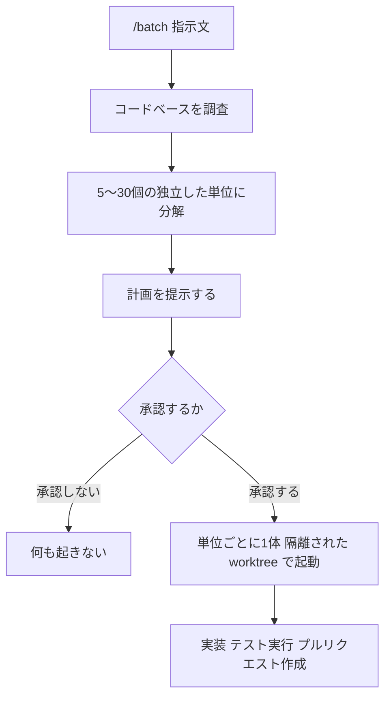
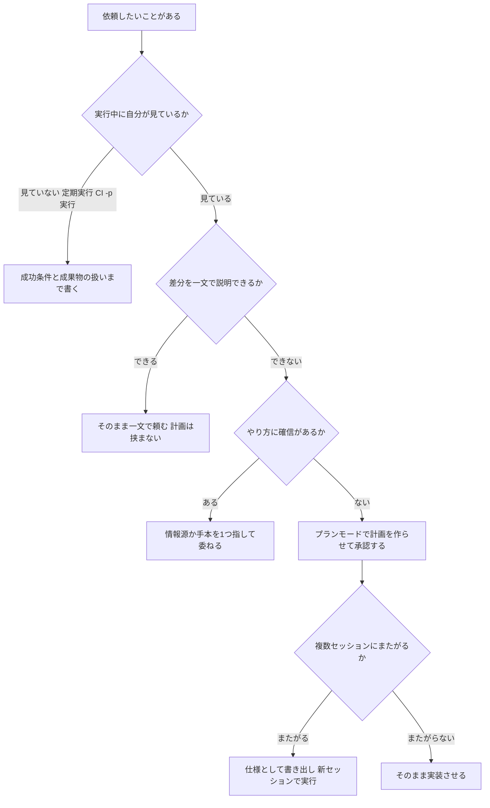
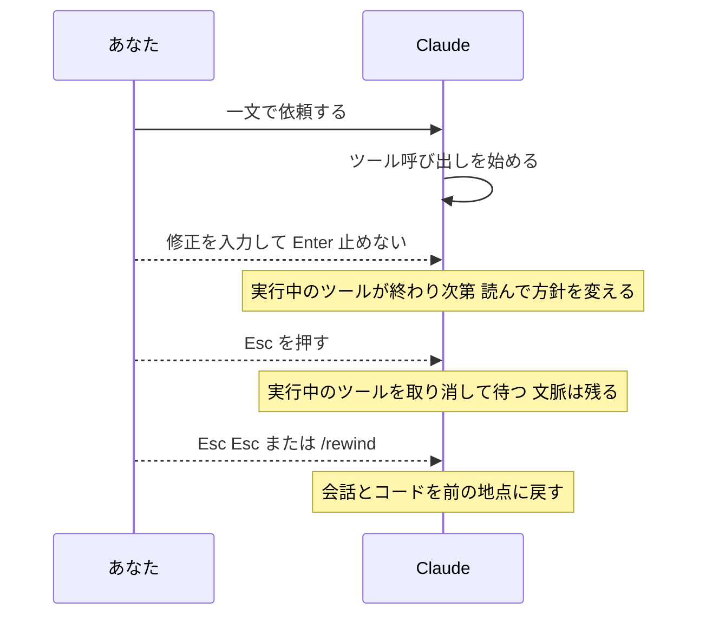

# Claude Daily 夕刊 — 2026-09-01（第010号）

## 今夜の3行
- 今朝の課題（`/batch` で一括置換）の答え合わせをします。鍵は、**サブエージェントを起動する前に「計画の承認」が1回挟まる**ことと、`/batch` が数えている「単位」がファイル数ではないことです。
- 深掘り連載 第5回は **「指示の粒度」**。同じ依頼を一文で渡すか、制約つきで渡すか、仕様にして渡すか。公式が挙げている before / after を軸に、粒度を決める基準を1つに絞って整理します。
- ケーススタディは Anthropic 社内チームの使い分けです。**同じ道具を、チームごとに違う粒度で握っている**という話で、非エンジニア部門への展開の見取り図にもなります。

## ① 朝の課題 答え合わせ

### 課題の再掲

Next.js プロジェクトの git リポジトリで、同じパターンの重複が3〜5ファイル程度ある状態を作り、`/batch "〇〇を△△に置き換えて"` を実行する。何体のサブエージェントが起動し、worktree（同じリポジトリを別ディレクトリにチェックアウトした作業コピー）がいくつ作られたかを観察し、前日の `xargs -P` ループと比べて自動化された部分・自分で判断が必要だった部分をメモする——というものでした。

### 模範解答

`/batch` は、公式ドキュメントの定義では次の順に動きます。

1. コードベースを**調査する**
2. 作業を**5〜30個の独立した単位に分解する**
3. **計画を提示する**
4. **承認されたら**、単位ごとに1体のバックグラウンドサブエージェントを、隔離された git worktree の中に起動する
5. 各サブエージェントが自分の単位を実装し、**テストを走らせ**、プルリクエストを開く

git リポジトリであることが必須です。

図1: `/batch` の流れ。**D と E があること**が、今朝の説明でいちばん補いたかった点です。

### なぜそうなるのか

今朝の朝刊では「実行すると5〜30体に自動分割される」と書きましたが、実際には**分割案を見てから承認する**ステップが入ります。ここが `xargs -P` ループとの本質的な差です。手書きのループでは、対象ファイル一覧を作った時点で分割は確定していて、あとは流すだけでした。`/batch` は分割そのものを Claude が提案し、**あなたはその分割に対して一度だけ判断を下します**。

分割の単位が「ファイル」ではなく「独立した単位（independent units）」である点も効いてきます。3〜5ファイルで試したとき、思ったより少ない数のサブエージェントしか立たなかったはずです。5〜30という幅は**作業量の分解の粒度**であって、ファイル数の写像ではありません。同じ置換が3ファイルに散っていて、しかも互いに独立でないなら、1単位にまとめるのが正しい分解です。

そして、各サブエージェントは**テストを走らせてから PR を開きます**。ここが手書きループとの2つ目の差です。昨日のループでは、`claude -p "Migrate $file ... Return OK or FAIL."` の戻り値が「OK」でも、それはモデルの自己申告でした。`/batch` は検証をワークフローに組み込んでいます。

自動化された部分と、自分の判断が残る部分を並べると次のようになります。

| 工程 | 手書きの `xargs -P` ループ | `/batch` |
|---|---|---|
| 対象の洗い出し | 自分（`files.txt` を作る） | Claude が調査する |
| 分割の決定 | 自分（1行=1タスク） | Claude が提案 → **自分が承認** |
| 隔離 | 自分（worktree を作るなら手動） | 自動（単位ごとに worktree） |
| 権限の制限 | 自分（`--allowedTools` を書く） | セッションの権限モードに従う |
| 検証 | 自分（後でまとめて） | 各サブエージェントがテストを実行 |
| PR 作成 | 自分 | 自動（単位ごとに1本） |
| 差分のレビュー | 自分 | 自分 |

いちばん下の行は、どちらでも自分に残ります。**PR を1本ずつレビューしたいなら `/batch`、まとめて1つの差分として見たいなら手書きのループ**、というのが使い分けの基準になります。

### よくある詰まりどころ

**1. サブエージェントが1〜2体しか立たなかった。** 分解の結果としてそれが正しいことがあります。上に書いたとおり単位は作業量で決まるので、少ないこと自体は失敗ではありません。ただし「分割を体感したい」のが目的なら、**互いに独立したファイル群**（依存のない別コンポーネント同士など）を対象にしてください。

**2. 計画の提示で止まっていることに気づかなかった。** 承認待ちです。`/batch` は投げっぱなしのコマンドではありません。逆に言えば、**分割案が気に入らなければここで止められます**。

**3. PR 作成で失敗した。** GitHub 側に push / PR 作成の権限がない環境ではここで落ちます。worktree での実装まで進んでいるので、作業自体は残っています。

**4. 置換対象のファイル同士に依存があった。** 各サブエージェントは独立した worktree で作業するため、片方の PR だけをマージすると壊れる、という状態が起こり得ます。`/batch` の分解は「独立した単位」を前提にしているので、依存があるものは `/batch` に向きません。

**5. `git status` が汚れていた。** worktree は既存のコミットから作られます。未コミットの変更は各 worktree には持ち込まれないため、「手元では動くのに worktree では動かない」が起きます。

出典: [スラッシュコマンド一覧（公式ドキュメント）](https://code.claude.com/docs/en/commands) / [Best practices for Claude Code（公式ドキュメント）](https://code.claude.com/docs/en/best-practices)

## ② 深掘り連載 第5回 — 指示の粒度

### 今日の位置

図2: 連載全体マップ。第1回から第4回までは「**環境を整える**」話でした。今日から「**1回の依頼をどう書くか**」に入ります。

### なぜ重要か

公式ドキュメントは、姿勢をはっきり一言で書いています。**「Delegate, don't dictate（命令するな、委任せよ）」**。有能な同僚に仕事を渡すつもりで、文脈と方向を与えたら、細部は任せる。読ませるべきファイルや叩くべきコマンドを指定する必要はない、というのが基本線です。

ただしこれは「雑に投げてよい」という意味ではありません。同じページの別の箇所で、**「Claude は意図を推測できますが、心は読めません」**とも書いています。委任と丸投げの差は、**何を決めてから渡したか**にあります。

粒度の話が実務で効くのは、それが**あなたの注意力をどこで使うかの前払い/後払いの選択**だからです。細かく指示すれば書く時点で時間を使い、雑に投げれば差分を見る時点で時間を使う。どちらが安いかは、**間違っていたと分かるまでのコスト**で決まります。

### 仕組み：1つのプロンプトが決めている4つのこと

1回の依頼文は、実は4つのことを同時に決めています。ここを分けて意識できると、粒度の調整が「長く書くか短く書くか」から「どの1つを足すか」に変わります。

| 依頼文が決めるもの | 決めないとどうなるか |
|---|---|
| **探索の範囲** | Claude が自分で範囲を決める。広すぎるとコンテキストが埋まる |
| **手段の選択** | Claude が既存の慣習を推測する。慣習が読み取れないと一般解になる |
| **完了の条件** | 「それらしく見えたら」終わる |
| **検証の方法** | あなたが検証ループそのものになる |

公式が挙げている失敗パターンの1つ **「The infinite exploration（無限の探索）」** は、1番目だけが抜けた状態です。スコープを切らずに「調べて」と言うと、Claude は数百ファイルを読んでコンテキストを埋め尽くします。処方箋は「調査を狭く区切るか、サブエージェントに逃がす」。

3番目と4番目の話は、この連載の第1回・第4回や [2026-08-28 朝刊](https://github.com/y-horie517/claude-news/blob/main/digest/2026/08/2026-08-28-am.md) で扱った「検証つきで任せる」に対応します。今日は1番目と2番目——**探索の範囲と手段**——を中心に見ます。

### 仕組み：公式の before / after を読む

ドキュメントには4つの戦略が before / after 付きで載っています。**4つとも「長くする」ではなく「一点を固定する」変換**であることに注目してください。

| 戦略 | before | after | 何を固定したか |
|---|---|---|---|
| タスクを絞る | `add tests for foo.py` | `write a test for foo.py covering the edge case where the user is logged out. avoid mocks.` | 対象・シナリオ・作法 |
| 情報源を指す | `why does ExecutionFactory have such a weird api?` | `look through ExecutionFactory's git history and summarize how its api came to be` | **どこを読めば答えが出るか** |
| 既存パターンを指す | `add a calendar widget` | `look at how existing widgets are implemented on the home page ... HotDogWidget.php is a good example. follow the pattern ...` | 手段（真似すべき実例） |
| 症状で言う | `fix the login bug` | `users report that login fails after session timeout. check the auth flow in src/auth/, especially token refresh. write a failing test that reproduces the issue, then fix it` | 症状・当たりをつける場所・「直った」の定義 |

2つ目の変換がいちばん見落とされがちです。**「なぜこうなっているのか」を聞かれた Claude は、コードを読んで推測します。git の履歴を読めとは言われていないからです。** 答えが履歴にあるなら、そう言うだけで質問の精度が変わります。同じ理屈で、答えが Slack にあるなら MCP を、CI のログにあるならそのコマンドを指せばよい。**「どこを見れば分かるか」を知っているのはあなただけ**で、これは長さではなく情報量の追加です。

3つ目は「手段を委ねつつ、手本を渡す」形です。実装方法は指示していません。指示しているのは `HotDogWidget.php` を見ろ、という1点だけです。これが `dictate` にならない `delegate` の書き方です。

### 仕組み：雑に投げるのが正しいとき

公式は、曖昧なプロンプトを一律に否定していません。**「探索していて、方向修正の余裕があるときには曖昧なプロンプトが有用なことがあります」**として、`what would you improve in this file?` を例に挙げています。理由は明快で、**自分が聞こうと思いつかなかったことが出てくる**からです。

同じ発想は計画にも適用されます。プランモードの節には、覚えやすい判断基準が1行あります。

> **その差分を一文で説明できるなら、計画は飛ばしてよい。**

タイポの修正、ログ1行の追加、変数のリネーム。これらに計画を挟むのは純粋なオーバーヘッドです。逆に計画が効くのは、**やり方に確信がないとき / 複数ファイルにまたがるとき / そのコードに不慣れなとき**の3つだと明記されています。

### 仕組み：粒度を決める1つの基準

いろいろ書きましたが、実際に迷ったときに効く基準は1つに絞れます。**Claude が後から聞き返せるか**です。

公式ドキュメントの、定期実行タスク（Routines など）の節にその根拠があります。**「スケジュールされたタスクのプロンプトでは、成功が何を意味するのか、結果をどうするのかを明示してください。タスクは自律的に走るので、確認の質問ができません」**。

対話セッションでは、粒度が足りなければ Claude が聞いてくるか、あなたが差分を見て直せます。**聞き返せない場面ほど、前払いの粒度が要る**——これが判断の軸です。

図3: 粒度の判断フロー。**分岐が「タスクの難しさ」ではなく「自分がその場にいるか」から始まっている**のが要点です。難しいタスクでも、隣で見ているなら一文で始めて構いません。

なお、図の J（仕様として書き出す）については、`AskUserQuestion` で Claude に取材させて `SPEC.md` を書かせるやり方を [2026-08-30 夕刊](https://github.com/y-horie517/claude-news/blob/main/digest/2026/08/2026-08-30-pm.md) で扱っています。今日は繰り返しません。

### 仕組み：粒度は後から足せる

「最初に完璧なプロンプトを書く」必要はありません。公式は **「It's a conversation（これは会話です）」** という節を立てて、完璧なプロンプトは不要だと明言しています。走り出してから粒度を足す経路が3つあります。

図4: ターンの途中で粒度を足す3つの経路。強さの順に「止めない修正 → 停止 → 巻き戻し」です。

1つ目が特に使えます。**Claude が作業している最中に文字を打って Enter を押すと、実行中のツール呼び出しは止まりません。** メッセージはキューに入り、そのツール呼び出しが終わった時点で Claude に渡され、**同じターンの中で**次の判断に反映されます。「そのファイルじゃない」「テストも書いて」のような軽い方向修正は、これで足ります。キューに入れたものは、入力欄の上に一覧表示されます。取り消したくなったら、入力欄の1行目で `Up` を押せば入力欄に戻ってきます。

`Esc` は実行中のツール呼び出しを取り消して待機させます。文脈は残るので、そこから方向を変えられます。キューに入れたものがあれば、`Esc` の直後にそれが送られます。

なお、同じ点を2回訂正しても直らないときは粒度の問題ではなくコンテキストの問題です。`/clear` して書き直すほうが速い、という話は [2026-08-28 朝刊](https://github.com/y-horie517/claude-news/blob/main/digest/2026/08/2026-08-28-am.md) で扱いました。

### 仕組み：「じっくり考えて」は指示になるか

粒度の話でよく出る誤解を1つ潰しておきます。**プロンプトに `ultrathink` と書くと、そのターンだけより深い推論が要求されます。** Claude Code がキーワードとして認識し、コンテキストに指示を追加します。セッションの設定は変わりません。

一方で、公式ドキュメントははっきりこう書いています。**`think`、`think hard`、`think more` といった他の語句は、通常のプロンプト文として素通りし、キーワードとしては認識されません。** 「よく考えて」と日本語で書いた場合も同じで、それは普通の文章です（効果がゼロという意味ではなく、**仕組みとしての効き目はない**という意味です）。

セッション全体で調整したいなら `/effort` です。

| レベル | 公式の説明 |
|---|---|
| `low` | 短くスコープの狭い、知性を要さない低レイテンシ向けの作業に限る |
| `medium` | 知性をいくらか犠牲にしてよいコスト重視の作業でトークンを減らす |
| `high` | トークンと知性の釣り合い。Opus 4.7 以外の全モデルの既定値 |
| `xhigh` | トークンを多く使ってより深く推論する。Opus 4.7 の既定値 |
| `max` | 要求の厳しいタスクで性能が上がることがあるが、収穫逓減があり**考えすぎに陥りやすい**。広く採用する前に試すこと |
| `ultracode` | モデルの努力レベルではなく Claude Code の設定。`xhigh` を送り、かつ実質的なタスクごとに動的ワークフローを組ませる |

`/effort` は Claude が応答している最中にも実行でき、キャッシュ警告を承認すればそのターンの次のリクエストから適用されます。現在のレベルはセッションヘッダーのモデル名の隣に出ます。

### 使うべき時／使うべきでない時

| 場面 | 渡し方 | 理由 |
|---|---|---|
| 差分を一文で言える修正 | 一文で頼む。計画なし | 計画のオーバーヘッドが成果を上回る |
| 何が良くなるか自分でも分からない | `このファイルで改善できる点は？` と曖昧に投げる | 思いつかなかった論点が出る |
| 「なぜこうなっているのか」を知りたい | **答えのある場所**（git 履歴・PR・ログ）を指す | 指さないとコードから推測される |
| 既存の慣習に合わせたい | 手本のファイルを1つ名指しする | 手段を委ねたまま方向を固定できる |
| バグ修正 | 症状・当たりをつける場所・「直った」の定義の3点 | 対症療法を防ぐ |
| 複数ファイルにまたがる / 不慣れなコード | プランモードで計画を作らせて承認する | 間違った問題を解くのを防ぐ |
| 見ていない実行（定期実行・CI・`-p`） | 成功条件と結果の扱いまで書き切る | **聞き返せない** |
| 探索を頼む | 範囲を切る。またはサブエージェントに逃がす | 無限の探索でコンテキストが埋まる |

逆に、**やらなくてよいこと**も明確です。読むべきファイルを全部列挙する、実行するコマンドを1つずつ書く、当たり前の作法を毎回書き添える——これらは `dictate` であって、`delegate` の妨げになります。毎回必要な作法は CLAUDE.md へ、必ず実行させたいことはフック（[第2回](https://github.com/y-horie517/claude-news/blob/main/digest/2026/08/2026-08-29-pm.md)）へ。**依頼文に残すのは、今日のこのタスクにだけ効くこと**です。

出典: [How Claude Code works（公式ドキュメント）](https://code.claude.com/docs/en/how-claude-code-works) / [Best practices for Claude Code（公式ドキュメント）](https://code.claude.com/docs/en/best-practices) / [Common workflows（公式ドキュメント）](https://code.claude.com/docs/en/common-workflows) / [Interactive mode（公式ドキュメント）](https://code.claude.com/docs/en/interactive-mode) / [モデルの設定（公式ドキュメント）](https://code.claude.com/docs/en/model-config)

## ③ ケーススタディ — Anthropic 社内チームは、同じ道具を違う粒度で握っている

Anthropic は社内の各チームがどう Claude Code を使っているかを公開しています。読みどころは機能の話ではなく、**チームによって渡し方の粒度がはっきり違う**ことです。

**セキュリティエンジニアリングチーム**は、テスト駆動開発を軸に、**定期的なチェックポイントを挟みながら**進めています。記事は以前のやり方を「設計ドキュメント → 雑なコード → リファクタ → テストを諦める」と表現しており、そこから構造化された TDD へ移った、としています。**粒度は細かく、頻繁に手綱を引く**側です。

**プロダクトデザインチーム**は逆側にいます。Figma のデザインファイルを渡し、**「Claude Code が新機能のコードを書き、テストを走らせ、継続的に反復する自律ループ」**を回します。**抽象的な問題を与え、自律的に動かし、あとから解を review する**という進め方です。**粒度は粗く、後払い**です。

**データサイエンス／インフラ側**はさらに極端で、**サンドボックス環境でのワンショットのプロンプト**から React アプリケーションを丸ごと作らせ、**コード自体は理解しないまま**強化学習モデルの性能を可視化する、という使い方が紹介されています。インフラチームは Kubernetes の障害調査でダッシュボードのスクリーンショットを渡し、新しい IP プールを作るための正確なコマンドを受け取って、対応時間を20分短縮したとしています。

この3つを並べると、粒度を分けている変数が見えます。**間違っていた場合に何を失うか**です。

| チーム | 渡し方 | 間違ったときのコスト |
|---|---|---|
| セキュリティエンジニアリング | TDD ＋ 頻繁なチェックポイント | 本番の安全性。**やり直しが効かない** |
| プロダクトデザイン | 抽象的な問題 ＋ 自律ループ | 作り直せばよい |
| データサイエンス | サンドボックスでワンショット | 捨てればよい |

**チーム展開の観点でいちばん重要なのは、この表の右列を先に決めることだと思います。** 「うちのチームでは細かく指示すべきか、任せるべきか」という問いには一般解がありません。決まるのは**やり直しのコスト**であり、それはチームではなく**タスクの性質**に属します。同じチームの中に、両方の粒度が並存していて構いません。

もう一点、展開のヒントになるのが**非エンジニア部門の例**です。法務チームは電話応答ツリーのプロトタイプを作り、グロースマーケティングチームは文字数制限内で広告バリエーションを生成する仕組みを組んで、**数時間かかっていた作業を数分にした**としています。記事はこれを「各部門が従来の開発リソースなしで独自ツールを作れることを示している」とまとめています。

ここで粒度の話が効いてきます。非エンジニアが最初に詰まるのは、**「どこを見れば答えが出るか」を指す語彙がない**ことです。エンジニアなら「`src/auth/` を見て」と言えるところを、業務側の人は「経費精算のルール」としか言えない。だからこそ、業務部門への展開では**情報源を先に置く**——ルールを1つの Markdown にまとめてリポジトリに置く、参照すべきスプレッドシートを MCP で繋ぐ——ほうが、プロンプトの書き方を教えるより効きます。今朝の朝刊で紹介した「非エンジニアが `CONTEXT.md` / `SPEC.md` / ADR を先に言語化した」という報告も、同じことを別の言葉で言っています。

明日から1つだけ試すなら、**チームの誰かが次に投げる依頼に「答えのある場所」を1行足す**ところからで十分です。

出典: [How Anthropic teams use Claude Code](https://claude.com/blog/how-anthropic-teams-use-claude-code)

## ④ チートシート

今日出てきたものだけをまとめます。

| 項目 | 内容 |
|---|---|
| `/batch <指示>` | コードベースを調査し **5〜30の独立した単位**に分解 → **計画を提示** → 承認後に単位ごとのサブエージェントを worktree で起動 → 実装・テスト・PR。git リポジトリ必須 |
| `/batch` の「単位」 | ファイル数ではなく**独立した作業量**。3〜5ファイルで1単位になることもある |
| `--allowedTools` | 手書きの `claude -p` ループで権限を絞るフラグ。`/batch` では不要 |
| Delegate, don't dictate | 文脈と方向を与え、読むファイルや叩くコマンドは指定しない（公式の姿勢） |
| タスクを絞る | 対象ファイル・シナリオ・作法（`avoid mocks` など）を1点ずつ固定する |
| 情報源を指す | 「なぜこうなっているか」は git 履歴・PR・ログを名指しする。指さないとコードから推測される |
| 既存パターンを指す | 手本のファイルを1つ名指しする。手段を委ねたまま方向を固定できる |
| 症状で言う | 症状 ＋ 当たりをつける場所 ＋「直った」の定義。対症療法を防ぐ |
| 計画を飛ばす基準 | **差分を一文で説明できるなら計画は不要** |
| 計画が効く3条件 | やり方に確信がない / 複数ファイルにまたがる / そのコードに不慣れ |
| 曖昧なプロンプトが効く場面 | 探索中で方向修正の余裕があるとき（`このファイルで改善できる点は？`） |
| The infinite exploration | スコープを切らない「調査して」でコンテキストが埋まる失敗パターン。狭く区切るかサブエージェントへ |
| 見ていない実行の粒度 | 定期実行・CI・`-p` は**聞き返せない**。成功条件と結果の扱いまで書き切る |
| 実行中に Enter | ツール呼び出しは止まらない。キューに入り、そのツールが終わり次第**同じターンで**読まれる |
| キューの取り消し | 入力欄の1行目で `Up`。キューの内容が入力欄に戻る |
| `Esc` | 実行中のツール呼び出しを取り消して待機。文脈は残る。キューがあれば直後に送られる |
| `Esc` `Esc` / `/rewind` | 会話とコードを前の地点に戻す |
| `ultrathink` | プロンプトのどこかに書くと**そのターンだけ**深い推論を要求。セッション設定は変わらない |
| `think` / `think hard` / `think more` | **キーワードとして認識されない**。通常のプロンプト文として素通りする |
| `/effort` | `low` / `medium` / `high` / `xhigh` / `max` / `ultracode` / `auto`。既定は `high`（Opus 4.7 は `xhigh`） |
| `/effort max` | 収穫逓減があり**考えすぎに陥りやすい**。広く採用する前に試す |
| `/effort` を応答中に実行 | キャッシュ警告を承認すれば、そのターンの次のリクエストから適用される |
| 粒度を分ける変数 | タスクの難しさではなく、**間違っていた場合に何を失うか** |

## ⑤ あすの予告

深掘り連載 第6回は **「差分の見せ方・レビューのさせ方」**。今日は「渡し方」を扱いました。明日は返ってきたものをどう受け取るか——差分をどの単位で出させ、何を根拠にレビューさせるかを整理します。
