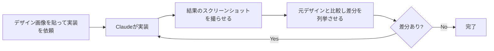

# Claude Daily 朝刊 — 2026-09-02（第011号）

## きょうの3行
- Claude Code v2.1.257で、次世代モデル「Claude Fable 5.1」（1Mコンテキスト、Fableの新デフォルト）が使えるようになりました。auto modeにはクラウド認証情報の窃取などを止める新ルールも入っています。
- 今日の型は「UI変更はスクリーンショット比較で検証させる」——見た目の良し悪しは自動テストで判定できないため、画像を渡して比較・修正までさせる型です。
- 事例は、市場投入までの時間を79%短縮した楽天と、3週間で1.8万体のエージェントが動いたNotionの2本です。

## ① 今日の型 — UI変更はスクリーンショット比較で検証させる

Claudeは「動作しているように見える」時点で作業を止めます。テストやビルドが通ることは確認できても、見た目のズレ（余白、配色、レイアウト崩れ）を自分では判定できません。判定できる材料を渡さない限り、見た目の確認は結局あなたの仕事のままです。

そこで、実装前にデザイン案の画像を渡し、実装後には**結果のスクリーンショットを撮らせて元のデザインと比較**させます。差分を言葉で列挙させてから直させると、「良くなった気がする」ではなく、具体的な指摘に基づいた修正が返ってきます。



そのまま使えるプロンプト例（Next.jsのコンポーネントを対象に、画像を貼り付けた上で）:

```
[このデザインのスクリーンショットを貼り付け]
このデザインどおりにダッシュボードのヘッダーコンポーネントを実装してください。
実装が終わったら、ブラウザで結果のスクリーンショットを撮り、貼り付けた元のデザインと
比較して、違いを箇条書きでリストアップしてください。そのうえで差分を直してください。
```

ブラウザでのスクリーンショット取得にはブラウザ操作ツールを使います。手元で使える状態になっているか確認してから試してください。

出典: [Best practices for Claude Code](https://code.claude.com/docs/en/best-practices)

## ② すぐ効くTIPS

### 1. 実装前に検証条件（テストケース）を渡す
「メールアドレスを検証する関数を実装して」だけでは、Claudeが想定するエッジケースと、あなたが想定するエッジケースがずれることがあります。「`user@example.com`はtrue、`invalid`はfalse、`user@.com`はfalseになるようにして、実装後にテストを実行して」のように、判定基準を先に渡すと確認の往復が減ります。

### 2. エラーメッセージはそのまま貼り、根本原因を直させる
「ビルドが失敗する」とだけ伝えると、Claudeはエラーを黙らせる（try/catchで握りつぶす、テストをスキップするなど）対応で「直った」ことにしがちです。実際に出たエラーメッセージをそのまま貼り、「原因を直して。エラーを抑制するのではなく」と明示すると、対症療法を避けやすくなります。

### 3. `CLAUDE_CODE_SUBAGENT_MODEL_FORCE`でサブエージェントのモデルを一括固定する（v2.1.257の新機能）
サブエージェント定義（`.claude/agents/*.md`）の`model`指定や、呼び出し時の個別指定があっても、この環境変数を立てるとすべてのサブエージェントが`CLAUDE_CODE_SUBAGENT_MODEL`（未設定ならメインモデル）で動くようになります。新モデルの挙動をサブエージェント全体で一括検証したいときなどに、定義を書き換えずに試せます。

出典: [Best practices for Claude Code](https://code.claude.com/docs/en/best-practices) / [CHANGELOG.md](https://github.com/anthropics/claude-code/blob/main/CHANGELOG.md)

## ③ 最新事例

### 楽天 — 市場投入までの時間を79%短縮
数千人の開発者が数百万人のユーザー向けにサービスを提供する楽天は、複雑な多言語コードベースを扱いきれない既存のAIコーディングツールに代えてClaude Codeを採用しました。ユニットテスト作成・APIモック・コンポーネント構築・バグ修正・ドキュメント生成・新メンバーのコードベース理解まで開発ライフサイクル全体で使い、複数のClaude Codeセッションを並行実行してボトルネックを解消しています。Claude Managed Agentsも1週間以内に製品・営業・マーケティング・財務部門へ展開し、エンジニア以外もターミナル経由で貢献できるようにしました。結果として市場投入までの期間が24日から5日（79%減）に短縮し、複雑なリファクタリングで7時間の自律コーディングを達成、コード修正の精度は99.9%だとしています。
出典: [Rakuten | Claude](https://claude.com/customers/rakuten)

### Notion — Claude Managed Agentsで「External Agents」機能を開発
Notionは、ユーザーが他のツールに移動せずNotion内でClaudeエージェントを使えるようにする「External Agents」機能を、Claude Managed Agents（Anthropicが提供するエージェント基盤のAPI群）で開発しました。プロダクトマネージャーによると、Claudeが接続されたページやデザインシステムから文脈を取得する「タスクボード」を構築し、人間とエージェントが協調して作業するモデルを実現したといいます。公開から最初の3週間で1.8万体のエージェントが作成され、14万ステップが実行、そのうち9割は人が直接チャットで呼び出したのではなく自動化トリガー経由だったとのことです。
出典: [Notion | Claude](https://claude.com/customers/notion-qa)

## ④ 速報 — 新機能・変更点

CHANGELOG（Claude Code本体）は前回チェック（v2.1.252）以降、v2.1.257・v2.1.258が出ています（中間のバージョン番号は欠番）。

| いつ | 何が | どう効くか |
|---|---|---|
| v2.1.257 | 次世代モデル「Claude Fable 5.1」を追加、Fableの新デフォルトに（1Mコンテキスト、$10/$50 per Mtok、キャッシュ読み取り$0.25/Mtok） | `/model`で選べば従来のFable 5より高性能なモデルをすぐ使える |
| v2.1.257 | auto modeに「Containment Escape」ルールを追加 | クラウドのメタデータ認証情報の取得・通信の迂回・テナント越境アクセスが、環境側で想定済みと示さない限り自動承認されなくなる |
| v2.1.257 | `CLAUDE_CODE_SUBAGENT_MODEL_FORCE`を追加 | 個別のサブエージェント定義やスポーン時指定を無視して、全サブエージェントのモデルを一括で強制できる |
| v2.1.257 | auto modeで作業ディレクトリ外への初回ファイル読み取り前に確認を追加（`permissions.blockReadsOutsideWorkingDirectories`で読み取り自体をブロックも可能） | 意図しないディレクトリ外読み取りに気づきやすくなる |
| v2.1.258 | macOS 12（Monterey）で起動できなくなっていた不具合（2.1.255で混入）を修正 | 対象OSのユーザーは再びClaude Codeを起動できる |
| v2.1.258 | リモート・予約実行セッションで、再送された権限承認が反映できず失敗する不具合を修正 | Remote Controlや`/schedule`経由のセッションが安定する |

出典: [CHANGELOG.md](https://github.com/anthropics/claude-code/blob/main/CHANGELOG.md) / [Claude Fable and Mythos 5.1](https://www.anthropic.com/claude-fable-and-mythos-5-1)

## ⑤ きょうのミニ課題

**手元のNext.jsコンポーネントで「スクリーンショット比較検証」を体験する**

前提: `git status`がクリーンな状態。見た目を変えたいコンポーネントが1つあり、目標とする見た目（別サイトのキャプチャ・手描きのラフ・既存デザインの改善案など、画像なら何でも可）が用意できること。ブラウザでスクリーンショットが撮れる状態（ブラウザ操作ツールが使えるか、`npm run dev`でローカル起動できるか）を確認しておく。

1. 目標の見た目の画像を貼り付け、「このデザインどおりに実装して」と対象コンポーネントを指定して依頼する。
2. 実装が終わったら、「結果のスクリーンショットを撮って、貼り付けた元の画像と比較し、違いを箇条書きでリストアップして」と依頼する。
3. 出てきた差分リストを見て、直すべきものと「これは元々このままでよい」というものを自分で仕分けし、直す指示を出す。

確認方法: 手順3で仕分けた「直すべき差分」がすべて解消されていれば合格です。差分リストが空振り（実際には問題ない指摘ばかり）だった場合も、それ自体が観察結果です。プロンプトの書き方（比較の基準をどれだけ具体的に渡したか）を振り返ってメモしておいてください。答え合わせは今夜の夕刊で。
