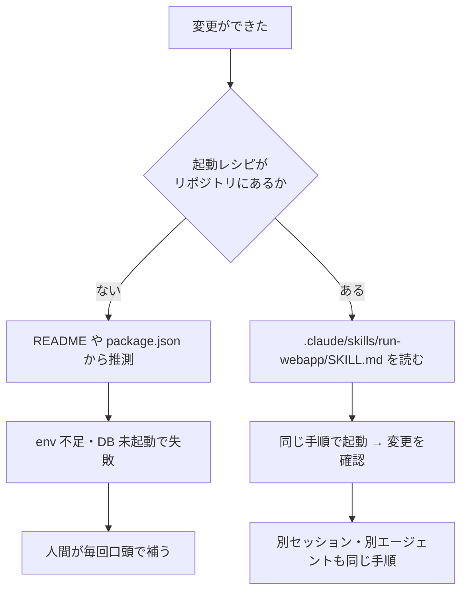
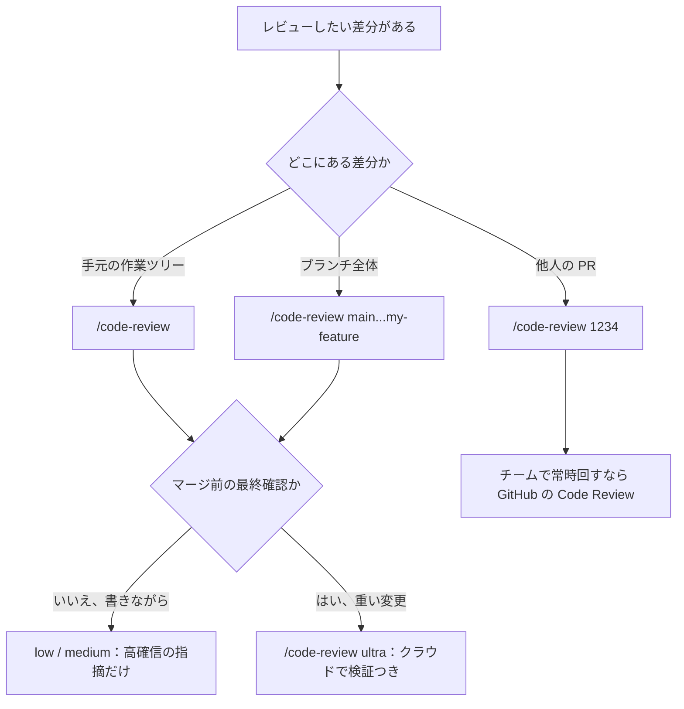
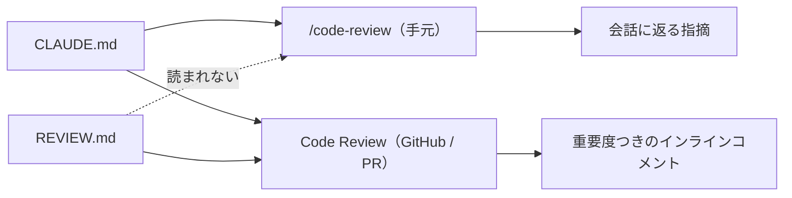

# Claude Daily — 2026-09-02（第012号）

## きょうの3行

- テストが緑でも、アプリが起動するとは限りません。`/run-skill-generator` で起動レシピをリポジトリに記録すると、`/verify` 以降は誰が動かしても同じ手順で「動くところまで」確認できます。
- 連載第6回はレビュー。`/code-review` は **対象・effort・フラグ** の3つを指定して初めて狙ったレビューになります。既定の対象は「upstream より先のコミット＋未コミットの変更」です。
- Claude Code CLI は v2.1.258 より新しい版が出ていません。Platform 側は 9/1 に Fable 5.1 / Mythos 5.1 のリリースノートが出ています。

---

## ① ベストプラクティス — 起動レシピをリポジトリに記録して「動くところまで」検証させる

Claude は「done に見えたところ」で止まります。テストとビルドが通れば止まるので、`npm run build` は通るのに開発サーバーが env 不足で落ちる、という差分はすり抜けます。公式ガイドは「Claude が自分で回せるチェックを渡せ」と繰り返し書いていますが、そのチェックの最上位が **実際にアプリを起動して確かめること** です。

Claude Code にはこれ専用のバンドルスキル（最初から入っているスキル）が3つあります。

| スキル | 何をするか |
|---|---|
| `/run` | アプリを起動して操作し、変更が動いているところを見る |
| `/verify` | ビルドして起動し、変更が意図どおりかを確認する。テストや型チェックに逃げない |
| `/run-skill-generator` | `/run` と `/verify` に、このプロジェクトのビルド方法・起動方法を教え込む |

`/run` と `/verify` は設定なしで動きます。プロジェクトの種類と README・`package.json`・`Makefile` から起動方法を推測するからです。ただしドキュメントは、**この推測が当てにならなくなる条件**をはっきり挙げています。標準的な起動を超えるもの、つまり「データベースが要る」「env ファイルが要る」「グラフィカルなセッションが要る」「多段ビルドが要る」プロジェクトです。Next.js の実務プロジェクトはたいてい2つ以上あてはまります。

そこで `/run-skill-generator` です。これはクリーンな環境からアプリを起動しきり、うまくいった手順（インストールコマンド・環境変数・起動スクリプト）を捕まえて、`.claude/skills/run-<name>/` にプロジェクト専用スキルとしてコミットします。以後は `/run` も `/verify` も、リポジトリで動く他のエージェントも、毎回推測し直すのではなく**記録されたレシピに従います**。



図1: 起動レシピを記録するかどうかで、検証が「毎回の説明」になるか「一度きりの投資」になるかが変わります。

まず1回だけ、プロジェクトのルートでこれを打ちます。

```bash
claude
```

セッションの中で:

```text
/run-skill-generator
```

生成されるのは次の形のファイルです。手で書くならこうなります（`run-webapp` の部分がコマンド名になります。`/run-webapp` として呼べます）。

**`.claude/skills/run-webapp/SKILL.md`**

```markdown
---
name: run-webapp
description: このリポジトリの Next.js アプリをローカルで起動して動作を確認する手順。アプリを起動する、画面を確認する、変更が効いているか見る、と言われたときに使う。
allowed-tools: Bash Read
---

## 前提

- Node.js 22 系。`node --version` で確認する
- 依存は `npm ci` で入れる（`npm install` は lock を書き換えるので使わない）
- `.env.local` が必要。無ければ `cp .env.example .env.local` で作る
- DB は Docker で起動する。起動していなければ `docker compose up -d db`

## 起動

1. `npm ci`
2. `docker compose up -d db`
3. `npm run dev -- --port 3000` をバックグラウンドで起動する
4. `curl -sS -o /dev/null -w "%{http_code}" http://localhost:3000/` が 200 を返すまで待つ

## 確認

- 変更したページの URL を開き、期待する表示になっているかを見る
- 終わったら開発サーバーを止め、`docker compose down` する

## うまくいかないとき

- ポート 3000 が埋まっているときは `--port 3001` に変える
- `.env.local` の `DATABASE_URL` が docker compose の設定と一致しているか確認する
```

`/verify` は自分でもレシピを書き残します。記録がない状態でビルドして動かす必要が生じると、うまくいった手順をリポジトリ直下の `.claude/skills/verify/SKILL.md`（モノレポなら触ったパッケージのディレクトリ）に書き出し、以後の実行と他のエージェントが同じ手順をたどるようにします（Claude Code v2.1.200 以降）。ルート直下に置かれた場合、この記録がバンドルの `/verify` を置き換えます。v2.1.205 以降は「実行を誤らせたとき（コマンドが失敗した、手順が抜けていた）だけ」書き換える仕様になったので、セッションごとに差分が出ることはなく、そのままコミットできます。

### やりがちな失敗

**失敗1: 起動手順を CLAUDE.md に書いて済ませる。** CLAUDE.md は毎セッション必ず読み込まれるので、20行の起動手順は「今日ぜんぜんアプリを起動しない日」のコンテキストまで毎回削ります。しかも CLAUDE.md の指示は助言的で、必ず実行される保証はありません。手順（procedure）はスキルに置くのが正解です。スキルの本文は呼ばれたときだけ読み込まれるので、長い参照情報を書いても使うまではほぼ無料です。

```markdown
# ❌ CLAUDE.md にこう書いてしまう
# アプリの起動方法
1. npm ci する
2. docker compose up -d db する
3. .env.local を作る（.env.example をコピー）
4. npm run dev -- --port 3000
5. localhost:3000 を開いて確認する
...（毎セッション、この20行が常に載る）
```

**失敗2: テストが緑だから完了とみなす。** テストは「書いたテストが通ったこと」しか保証しません。`/verify` がテストや型チェックに逃げないスキルとして分けて用意されているのは、この差が実際に事故になるからです。手元でやるなら、Claude のチェックが通ったあとに自分で `/verify` を打って、動いているアプリに対して確かめるのが最短です。

出典: [Extend Claude with skills — Run and verify your app](https://code.claude.com/docs/en/skills) ／ [Best practices for Claude Code](https://code.claude.com/docs/en/best-practices)

---

## ② 深掘り連載 第6回 — 差分の見せ方・レビューのさせ方

前回（第5回）は指示の粒度でした。今回はその出口、**書けたものをどうレビューさせるか**です。ポイントは1つで、レビューの質は「何を渡したか」でほぼ決まります。渡し方を決めるのは、対象・effort・フラグの3つです。



図2: 対象・深さ・実行場所の3つで、使うレビューが決まります。

### 対象を明示する

`/code-review` を引数なしで打つと、対象は「ブランチの upstream より先にあるコミット＋未コミットの変更」です。裏を返すと、**ブランチにも作業ツリーにも変更がなければ報告するものがありません**。それ以外を見せたいときは対象を渡します。渡せるのは、ファイルパス・PR番号・ブランチ名・`main...my-feature` のような ref の範囲です。他人の PR をレビューして承認前に確認する、という使い方はこの形です。

`/review` は `/code-review` の別名です（v2.1.223 より前は、GitHub の PR を1パスで読むだけの別コマンドでした）。

### 深さ（effort）を指定する

effort は網羅性と確信度のトレードオフです。`low` と `medium` は自信のある指摘だけを出すので誤検知が減り、`high` から `max` は範囲が広がる代わりに確信の低い指摘も混ざります。

ここに1つ落とし穴があります。**レベルを打たないと、前回打ったレベルが再利用されます**。別のセッションで打った値でも引き継がれ、`Reusing high effort, the level you typed last time` のような通知が出ます。変えたいときは `/code-review high` のように明示的に打ちます（`-p` の非対話実行で渡した値は記憶を更新しません）。`ultra` はこの記憶を使いも更新もしません。

### フラグで「読むだけ / 直す / 投稿する」を分ける

| フラグ | 何をするか |
|---|---|
| （なし） | 指摘を会話に返すだけ |
| `--fix` | レビュー後、指摘を作業ツリーに適用する |
| `--comment` | 指摘を PR のインラインコメントとして投稿する |
| `--post` | `ultra` で github.com の PR を見るとき、起動ダイアログで「投稿する」を先に選んでおく |

レビューは既定でバックグラウンドのサブエージェント（親とは別のコンテキストで動く子セッション）として走るので、会話のコンテキストを汚しません。フォアグラウンドに落ちるのは、前のレビューが走っているうちにもう一度打ったとき、`-p` や Agent SDK の非対話実行のとき、環境変数 `CLAUDE_CODE_DISABLE_BACKGROUND_TASKS` を `1` にしているときです。

**ここは覚えておく価値があります。** バックグラウンドのレビューが `--fix` で入れた編集はチェックポイントの外側で行われるため、`/rewind` では戻せません。戻すときは git を使います。フォアグラウンドで走ったレビューは自分のターン内で編集するので、`/rewind` で戻せます。

### レビュー基準の置き場所は2つあり、効き方が違う

GitHub 側の Code Review（Team / Enterprise 向けのリサーチプレビュー。PR に複数エージェントを並列で走らせ、インラインコメントを投稿する仕組み）は、リポジトリの2つのファイルを読みます。

| ファイル | 誰が読むか | 効き方 |
|---|---|---|
| `CLAUDE.md` | Claude Code のすべての作業＋Code Review | 新たに違反した箇所を **nit（軽微）** として指摘する |
| `REVIEW.md` | Code Review のみ | 指摘を見つける／検証する／順位づけするエージェントに、レビュー専用の指示として直接届く |

`REVIEW.md` はリポジトリ直下に置くフリーフォームの Markdown で、`@` によるインポートは展開されません（参照先ファイルも読まれません）。効くのは、重要度の再定義、nit の本数上限、除外パス、リポジトリ固有の必須チェック、指摘を出す前の根拠のハードルなどです。長く書くほど大事なルールが薄まるので、レビューの挙動を変える指示だけを置き、一般的な文脈は `CLAUDE.md` に残します。

そして**非対称なところが1つあります。手元の `/code-review` は `CLAUDE.md` は読みますが、`REVIEW.md` は読みません。** 「REVIEW.md に書いたのにローカルのレビューが拾わない」はここです。



図3: レビュー基準の2ファイルは、届く先が違います。ローカルに効かせたい基準は `CLAUDE.md` 側に書きます。

### 使うべき時／使うべきでない時

| | `/code-review` | `/code-review ultra` |
|---|---|---|
| 対象 | 作業差分・PR・ブランチ・パス | 作業差分または PR |
| 実行場所 | 手元のセッション | クラウドのサンドボックス |
| 深さ | effort 引数しだい | 多数のエージェント＋独立した再現・検証 |
| 所要 | 数秒〜数分 | おおむね5〜10分 |
| 費用 | 通常の利用量 | Pro / Max は3回無料、以後は1回およそ $5〜25 の usage credits |
| 向く場面 | 書きながらの素早い確認 | 重い変更をマージする前の確信 |

`ultra` の対象は「現在のブランチ対リポジトリの既定ブランチ＋未コミット・ステージ済みの変更」で、差分の上限は既定で 500 ファイル・8,000 行です。走っているレビューは `/tasks` で見られます。CI から使うなら、findings が届くまでブロックする `claude ultrareview` サブコマンドを使います（`claude -p '/code-review ultra'` は起動してリンクを出すだけで待ちません）。

逆に **使わないほうがよい場面**もはっきりしています。差分が一文で説明できる規模なら、`ultra` の5〜10分と費用は釣り合いません。またレビュアーは「探せ」と言われれば何かしら出すので、指摘を全部潰しにいくと過剰な抽象化と防御的コードが増えます。公式ガイド自身が、正しさと明示した要件に関わるものだけを指摘させ、残りは任意扱いにしろと書いています。

出典: [Code Review](https://code.claude.com/docs/en/code-review) ／ [Find bugs with ultrareview](https://code.claude.com/docs/en/ultrareview)

---

## ③ すぐ効くTIPS

### 1. `/code-review` を「自分が打ったときだけ」に限定する

Claude は自分の判断で `/code-review` を起動できますし、定期タスクのプロンプトにしてもレビューが走ります。意図しない実行を止めたいが、自分では打ちたい。そのための設定が `skillOverrides` です。`user-invocable-only` は Claude への提示を隠しつつ、`/` メニューには残します。

**`~/.claude/settings.json`**

```json
{
  "skillOverrides": {
    "code-review": "user-invocable-only"
  }
}
```

### 2. 差分をスキルに埋め込んで、探させずに渡す

スキル本文の `` !`コマンド` `` は、内容が Claude に渡る前にシェルで実行され、出力に置き換わります。つまり「差分を探して」ではなく「これが差分です」と確定した状態から始められます。置換は元のファイルに対して1回だけ走り、出力の中の `` !`...` `` は再展開されません。

```markdown
## いまの変更
- 差分: !`git diff HEAD`
- 変更ファイル: !`git diff HEAD --name-only`
```

複数行のコマンドを流したいときは、インライン形式ではなく ` ```! ` で開くコードブロックを使います。

### 3. 走っているレビューは `/tasks` で見る・止める

`ultra` は5〜10分かかり、その間セッションは自由に使えます。`/tasks` で実行中と完了したレビューの一覧、詳細、途中停止ができます。途中で止めた場合、クラウドのセッションはアーカイブされ、**部分的な指摘は返りません**（無料枠は消費されます）。止めるかどうかは、その前提で決めてください。

---

## ④ 事例

### Anthropic 社内：レビューの「コメントが付く率」が 16% から 54% に

Anthropic は自社のほぼすべての PR で Code Review を走らせています。公開されている社内データでは、実質的なレビューコメントが付く PR の割合が導入前の 16% から 54% に増えました。1,000行以上変わった大きな PR では 84% に指摘が付き、平均 7.5 件。50行未満の小さな PR では 31%・平均 0.5 件です。誤りだと評価された指摘は全体の 1% 未満、1回のレビューは平均およそ20分、費用は PR あたり $15〜25 とされています。認証を壊す1行の本番変更を検出した例も挙げられています。

チームで考えるべきは、この費用が「レビュー待ちの時間」と釣り合うかです。トリガーは「PR作成時に1回」「push のたび」「手動（`@claude review`）」から選べ、push のたびが最も高くつきます。組織の月次上限は管理設定で決められ、上限に達すると PR にその旨のコメントが1件付いてレビューはスキップされます。

出典: [Code Review for Claude Code（2026-03-09）](https://claude.com/blog/code-review)

### 「AI のレビューだけでマージする」までの設計（二次情報）

GitHub Actions 上で Claude Code を走らせ、AI レビューだけでマージできる状態を目指した設計と実装の記事が公開されています。バックエンド品質・セキュリティ・インフラという3つのペルソナのジョブを並列に走らせ、結果を集約した信頼スコアが 0.8 以上なら自動マージ、という構成だという報告です。ツールは `Read` `Grep` `Glob` と GitHub 操作に限定し、自動マージ後は15分の巻き戻し猶予と Slack 通知を置いたとしています。巨大な PR は指摘が浅くなるため、3〜5ファイル単位に分割して回したとのことです。

参考にした事例では全 PR の 83% を人のレビューなしで自動マージしており、逆に DB スキーマ・認証・決済・インフラの17%は人間必須として残す、という線引きが紹介されています。導入は2週間のシャドーモード（投稿せずに観測し、ノイズ率20%未満・見逃し率10%未満を確認する）から段階的に広げる、という進め方も書かれています。いずれも筆者の設計と報告であり、公式の仕様ではありません。

出典: [Claude CodeでPRレビューを自動化する設計と実装（Qiita、2026-04-13）](https://qiita.com/nogataka/items/ceae4e70fc4cca2e2c9e)

---

## ⑤ 速報 — 新機能・変更点

| いつ | 何が | どう効くか |
|---|---|---|
| 2026-09-02 時点 | Claude Code CLI に v2.1.258 より新しい版なし | 追いかける差分はありません。前回チェック以降、CHANGELOG に追加はありません |
| 2026-09-01 | Platform リリースノートに Claude Fable 5.1 / Mythos 5.1 | 既定で1Mコンテキスト、最大出力128k。キャッシュ読み取りが $0.25/MTok（他モデルの基本入力比 0.1x に対し 0.025x）。`tool_choice` の `any` と `tool` は非対応で 400 になるため、`auto` か `none` を使います |

Fable 5.1 が Claude Code の既定になった件（v2.1.257）は本日の朝の号で扱いました。ここでは Platform 側のリリースノートで補える差分だけを載せています。

出典: [Claude Code CHANGELOG](https://github.com/anthropics/claude-code/blob/main/CHANGELOG.md) ／ [Platform リリースノート](https://platform.claude.com/docs/en/release-notes/overview)

---

## ⑥ コマンド早見

| コマンド | 何をするか |
|---|---|
| `/run` | アプリを起動して操作し、変更が動いているところを見る |
| `/verify` | ビルドして起動し、変更が意図どおりかを確認する |
| `/run-skill-generator` | 起動レシピを `.claude/skills/run-<name>/` に記録する |
| `/code-review` | 手元の差分をレビューする（対象・effort・フラグを渡せる） |
| `/code-review high` | effort を high にしてレビューする（以後の既定として記憶される） |
| `/code-review main...my-feature` | ref の範囲を指定してレビューする |
| `/code-review ultra` | クラウドで検証つきの深いレビューを走らせる |
| `claude ultrareview` | 非対話で ultra を走らせ、結果が出るまで待つ |
| `/tasks` | 走っているレビューなどのタスクを見る・止める |
| `/rewind` | 会話とコードを以前の状態に戻す |
| `git diff HEAD` | 未コミットの変更を出力する |

---

## ⑦ きょうの課題 — 差分を固定してレビューさせるスキルを作る（10分）

**前提**: git 管理下の Next.js プロジェクト。未コミットの変更が少しあること（なければ適当な1ファイルを編集してください）。

**手順**

1. `.claude/skills/review-diff/SKILL.md` を作る。差分を `` !`git diff HEAD` `` で本文に埋め込み、レビュー観点を3つだけ書く。
2. `claude` を起動し、`/review-diff` を実行する。
3. 続けて `/code-review low` を実行する。
4. 2つの出力を比べる。**どちらが「何をレビュー対象にするか」を自分で決めたか**を見る。

**確認方法**: `/review-diff` の応答が、あなたが書いた3観点の順に、いま `git diff HEAD` で出る内容だけに触れていれば成功です。

── 模範解答 ──

**`.claude/skills/review-diff/SKILL.md`**

```markdown
---
name: review-diff
description: 未コミットの差分を、このプロジェクトの3観点でレビューする。変更を見てほしい、コミット前に確認したいと言われたときに使う。
allowed-tools: Read Grep
---

## いまの差分

!`git diff HEAD`

## 変更ファイル

!`git diff HEAD --name-only`

## レビュー観点（この順で、この3つだけ）

1. Server Component と Client Component の境界。`use client` を足した場合、それが本当に必要か
2. データ取得の失敗系。fetch の失敗・空配列・undefined のときに画面が壊れないか
3. 差分の中で、既存の書き方から外れている箇所。手本になるファイルを1つ挙げて対比する

観点に当てはまらない指摘は書かない。スタイルの好みは書かない。
```

**なぜそうなるのか**: `` !`コマンド` `` はスキル本文が Claude に渡る前に実行され、出力に置き換わります。だから Claude は「差分を探す」ところから始めず、確定した差分を最初から持っています。`/code-review` は自分で対象を決めて広く探すぶん、観点は固定されません。**探索させたいときは `/code-review`、観点を固定したいときは自作スキル**、という使い分けになります。

**よくある詰まりどころ**

- 先頭の `---` がファイルの1行目でないと frontmatter として読まれず、`---` ごと本文扱いになります。
- `!` が行頭か空白の直後にないと展開されません。別の文字の直後（たとえば `KEY=` に続けて書いた場合）は、ただの文字列として残ります。
- 置換は1回だけ走ります。コマンドの出力に含まれる `` !`...` `` は再実行されません。
- スキル名をバンドルのものと同じ（例: `code-review`）にすると、そのバンドルスキルを置き換えてしまいます。別名にしてください。
- スキル本文は一度読み込まれるとターンをまたいでコンテキストに残ります。観点は絞って短く書くほうが効きます。

あすは連載第7回「うまくいかないときの立て直し方（コンテキストのリセット判断）」を扱います。
