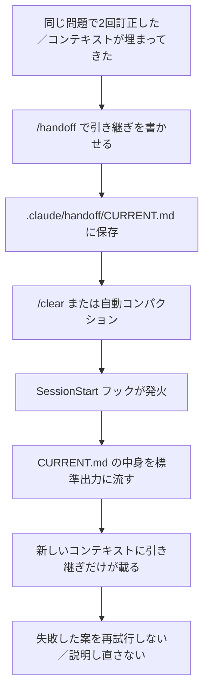
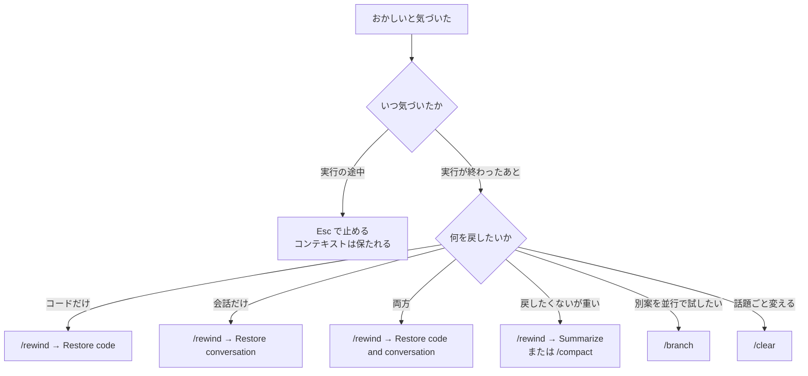
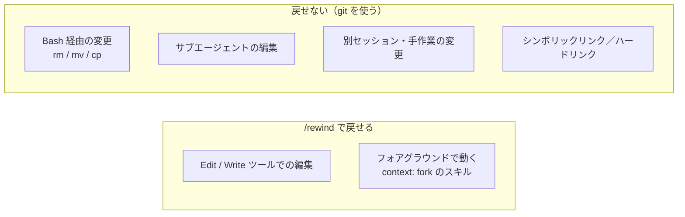

# Claude Daily — 2026-09-03（第013号）

## きょうの3行

- 公式の目安は「同じ問題で2回訂正したら `/clear`」です。ただし捨てるだけでは学んだことまで消えます。**捨てる前に引き継ぎファイルを書かせ、`SessionStart` フックで自動的に読み直させる**型を①で作ります。
- 連載第7回は立て直し。`Esc` / `/rewind` / Summarize / `/branch` / `/clear` / `/compact` は**戻す対象がそれぞれ違います**。どれを選ぶかは「会話を戻したいのか、コードを戻したいのか、両方か」で決まります。
- Claude Code v2.1.259 が出ました。組織が全ユーザーに MCP サーバーを配れる `managedMcpServers`、無人ホスト向けの `--permission-prompts none` が入っています。

---

## ① ベストプラクティス — 捨てる前に書き出す（引き継ぎファイルと SessionStart フック）

### 何を解決するのか

Claude Code のベストプラクティスは、はっきりこう書いています。「同じ問題で2回以上訂正したなら、コンテキストは失敗した試行で汚れている。`/clear` して、学んだことを踏まえたより具体的なプロンプトで始め直せ」。長いセッションを引きずるより、きれいなセッションのほうがほぼ常に勝つ、というのが公式の立場です。

ここに落とし穴があります。**「学んだこと」はあなたの頭の中にしかありません。** リセットしたあと、それを毎回口で説明し直すことになります。3回目に同じ地雷を踏むのは、たいていこの説明が抜けたときです。

コンパクション（自動要約）でも同じことが起きます。要約は Claude が書くので、**何を残して何を落とすかをこちらで選べません**。圧縮後にファイルとして読み直されるのは「直近で変更されたファイル最大5つ」だけです。「試したがダメだった案」のような、コードに痕跡が残らない情報は、まさにここで消えます。

対処は単純です。**消えては困るものを、コンテキストではなくファイルに置く。** そして、リセットの直後にそのファイルが自動で読み込まれるようにします。



図1: リセットを「捨てる」から「引き継ぐ」に変える経路。フックが入るのは、人間が読ませ忘れる工程を消すためです。

### 仕組み — `SessionStart` フックは `compact` でも発火する

鍵になるのは、`SessionStart` フックが受け取るマッチャです。取れる値は `startup` / `resume` / `clear` / `compact` / `fork` の5つで、**`compact` は自動コンパクションの直後にも発火します**。そして `SessionStart` は、コマンドが標準出力に書いた平文をそのまま Claude のコンテキストに足します。公式ドキュメントもこの用途を明示していて、「コンパクションで重要な詳細が失われることがある。`compact` マッチャの `SessionStart` フックで、毎回のコンパクション後に重要なコンテキストを注入し直せ」と書いています。

つまり `/clear` した直後も、コンテキストが溢れて勝手に要約された直後も、同じファイルが読み直されます。人間が「あ、引き継ぎ読ませるの忘れた」と気づく必要がありません。

### 書き出す側 — 引き継ぎスキル

**`.claude/skills/handoff/SKILL.md`**

```markdown
---
name: handoff
description: いまのセッションの引き継ぎを .claude/handoff/CURRENT.md に書き出す。コンテキストをリセットする前、作業を中断する前、/clear する前に使う。
disable-model-invocation: true
allowed-tools: Read Write Bash
---

いまのセッションの引き継ぎを `.claude/handoff/CURRENT.md` に**上書き保存**してください。

既存の `CURRENT.md` があれば、先に `.claude/handoff/archive/` へ
`YYYY-MM-DD_HHmm.md` の名前で移動してから書きます。

## 書式（この6見出しを必ずこの順で）

### いま何をしているか
1〜2文。次のセッションが最初に読む行なので、目的を書く。

### 決まったこと
採用した方針を、理由つきで箇条書き。

### 試してダメだったこと
**この節を省略しない。** 何を試し、どう失敗したかを1行ずつ書く。
ここが抜けると次のセッションが同じ失敗を繰り返す。

### 触ったファイル
パスと、そのファイルで何を変えたかを1行ずつ。

### 次にやること
次のセッションが最初に打つべきプロンプトを、そのまま貼れる形で1つ書く。

### 検証コマンド
このプロジェクトで「動いた」と判断するためのコマンドを実際の形で書く。

## 制約

- 全体で60行以内。長い引き継ぎは読まれない。
- コードの断片は貼らない。ファイルパスと行番号で指す。
- 推測を書かない。確認していないことは「未確認」と明記する。
```

`disable-model-invocation: true` を付けているのは、これが副作用（ファイルの上書き）を持つワークフローだからです。Claude が気を利かせて勝手に走らせるのではなく、**自分が `/handoff` と打ったときだけ**動いてほしい。公式ドキュメントも、副作用のあるワークフローにはこの指定を勧めています。

### 読み込む側 — フック

**`.claude/settings.json`**

```json
{
  "hooks": {
    "SessionStart": [
      {
        "matcher": "startup",
        "hooks": [
          {
            "type": "command",
            "command": "cat .claude/handoff/CURRENT.md 2>/dev/null"
          }
        ]
      },
      {
        "matcher": "clear",
        "hooks": [
          {
            "type": "command",
            "command": "cat .claude/handoff/CURRENT.md 2>/dev/null"
          }
        ]
      },
      {
        "matcher": "compact",
        "hooks": [
          {
            "type": "command",
            "command": "cat .claude/handoff/CURRENT.md 2>/dev/null"
          }
        ]
      }
    ]
  }
}
```

`2>/dev/null` を付けているのは、引き継ぎファイルがまだ無い状態でもエラーを出さずに空を返させるためです。ファイルが無ければ標準出力は空になり、何も注入されません。

これで運用は3手になります。

```bash
# 1. 手詰まりを感じたら（同じ問題で2回訂正した、など）
#    セッションの中で /handoff と打つ

# 2. 書き出されたものを自分の目で確認する
cat .claude/handoff/CURRENT.md

# 3. セッションの中で /clear と打つ。フックが CURRENT.md を読み直す
```

引き継ぎは git に載せます。`.claude/handoff/CURRENT.md` をコミットしておくと、別のマシンからでも、チームの別の人が拾うときも同じ状態から始められます。

### アンチパターン

**失敗1: 引き継ぎを CLAUDE.md に書き足す。** これが一番やりがちです。CLAUDE.md は毎セッション必ず読み込まれるので、たしかに確実に届きます。しかし壊れる理由が2つあります。

ひとつは寿命です。CLAUDE.md に書くべきは「半年後も変わらない規約」で、引き継ぎは1週間後にはただのゴミです。寿命の違うものを同じファイルに混ぜると、古い記述が残り続けて必ず腐ります。もうひとつは長さです。公式ドキュメントは「CLAUDE.md が長いと、大事なルールがノイズに埋もれて Claude が半分を無視する」と明言しています。引き継ぎを足し続ける先として、これは最悪の場所です。

```markdown
# ❌ CLAUDE.md にこう書き足してしまう
## 作業メモ（2026-08-20）
- 認証まわりを触っている。middleware.ts の matcher を直した
## 作業メモ（2026-08-27）
- こっちは中断。今は請求画面をやっている
## 作業メモ（2026-09-03）
- SWR をやめて Server Component にした。前のメモは無視してよい
（↑ 全部が毎セッション読み込まれ、最新がどれかは Claude には分からない）
```

**失敗2: `/compact` だけで乗り切ろうとする。** コンパクションは会話を要約に置き換えます。要約に何を残すかを決めるのは Claude で、こちらではありません。試してダメだった案のように、**コードにもテストにも痕跡が残らない情報ほど落ちやすい**という性質があります。圧縮後にファイルとして読み直されるのは直近5ファイルまでなので、「読んだけれど変更していないファイル」の内容も基本的には残りません。`/compact 認証まわりの変更に集中して` のように指示を添えれば方向づけはできますが、それでも「落ちなかったこと」の保証にはなりません。ファイルに書いたものだけが確実に残ります。

出典: [Best practices for Claude Code](https://code.claude.com/docs/en/best-practices) ／ [Automate actions with hooks — Re-inject context after compaction](https://code.claude.com/docs/en/hooks-guide) ／ [Explore the context window — What survives compaction](https://code.claude.com/docs/en/context-window) ／ [Hooks reference](https://code.claude.com/docs/en/hooks)

---

## ② 深掘り連載 第7回 — うまくいかないときの立て直し方

前回（第6回）は差分の見せ方とレビューでした。今回は、その前段で起きる「そもそも噛み合っていない」状態の畳み方です。

### なぜ重要か

Claude Code のベストプラクティスは、ほぼすべての助言をひとつの制約から導いています。**コンテキストウィンドウは速く埋まり、埋まるほど性能が落ちる。** 埋まってくると、Claude は前の指示を「忘れ」始め、ミスが増えます。公式が挙げる代表的な失敗パターン5つのうち2つ（「なんでも詰め込むセッション」と「訂正の繰り返し」）は、どちらも**リセットしなかったこと**が原因です。

裏を返すと、立て直しの技術とは「どのコマンドを打つか」ではなく、**いま戻したいのは会話か、コードか、両方か**を見分ける技術です。

### 6つの戻し方は、戻す対象が違う



図2: 戻す対象で経路が決まります。`Esc` だけがターンの途中で使え、コンテキストを保ったまま方向転換できます。

| 手段 | 戻るもの | 残るもの | 向く場面 |
|---|---|---|---|
| `Esc` | 実行中の動作を中断 | 会話もコードもそのまま | 明らかに違う方向へ走り出したとき |
| `Esc` `Esc` / `/rewind` | 選んだ地点の会話・コード（選択式） | 選ばなかったほう | 変更を入れたあとで気が変わったとき |
| Summarize from / up to here | 何も戻らない（圧縮のみ） | 圧縮対象外の会話は完全な形で | 冗長なデバッグ区間だけを畳みたいとき |
| `/compact [指示]` | 何も戻らない（全体を要約） | 要約と直近のやりとり | 同じ作業を続けたいが重い |
| `/branch <名前>` | 何も戻らない（分岐） | 元セッションが無傷で残る | 別案を試すが元も捨てたくない |
| `/clear` | 全部（新しい会話） | ディスク上のファイルは無傷 | 話題が変わるとき、訂正が2回失敗したとき |

**`/clear` は不可逆ではありません。** ここは覚えておく価値があります。同じ Claude Code のプロセスの中で `/clear` したあと `/rewind` を開くと、リストの先頭に `/resume <session-id> (previous session)` という項目が出ます。選べば `/clear` 前の会話に戻れます（v2.1.191 以降。それ以前は `/resume` から選びます）。この項目は Claude Code を終了するか別のセッションを再開するまで有効です。

### チェックポイントの守備範囲は狭い

`/rewind` の「コードを戻す」は git の代わりにはなりません。**Claude のファイル編集ツールを通した変更しか記録されていない**からです。



図3: チェックポイントが押さえているのは左側だけです。右側は git で戻します。

具体的に効いてくるのは次の点です。`rm file.txt` や `mv` のような Bash 経由の変更は記録されません。サブエージェントの編集も原則として戻せず、これにはバックグラウンドで走る `/code-review --fix` が含まれます（フォアグラウンドで動く `context: fork` のスキルだけは例外で、自分のターン内で編集するため戻せます）。シンボリックリンクやハードリンクになっているパスはスキップされ、`Restored the code, but skipped N files` という警告が出ます。pnpm がハードリンクで配置したファイルや、dotfile マネージャがリンクしている設定ファイルがこれに当たります。どのパスがスキップされたかは、復元前に `/debug` を有効にしておけば `~/.claude/debug/<session-id>.txt` に記録されます。

保持されるのは1セッションあたり直近100チェックポイントで、セッションごと30日で消えます（`cleanupPeriodDays` で変更可能）。**セッション内の一時的な巻き戻しのための仕組みであって、バージョン管理ではありません。**

### 分岐と巻き戻しは別物

`/branch` は会話のコピーを作ってそちらに移ります。元のセッションはディスク上でそのまま残り、セッションピッカーにも別行として出ます。`/rewind` が「1本の線を巻き戻す」のに対し、`/branch` は「線を増やす」操作です。危ない案を試すなら、巻き戻して消すより分岐したほうが元に戻る手間がありません。

### 使うべき時／使うべきでない時

**リセットすべき時**は明確です。話題が変わったとき、同じ問題で2回訂正して直らなかったとき、そして `/context` を見てコンテキストの大半が「いまの作業に関係ないファイル」で埋まっているときです。

**リセットすべきでない時**もあります。公式ガイドは最後にこう書いています。「ときにはコンテキストを溜めるべきだ。ひとつの複雑な問題に深く入っていて、その履歴自体に価値があるときは」。長い調査の途中で `/clear` すると、積み上げた理解ごと消えます。この場合は `/clear` ではなく、冗長になった区間だけを Summarize で畳むか、`/compact` に指示を添えて方向づけるほうが正しい選択です。判断の材料は `/context` の実測です。

出典: [Checkpointing](https://code.claude.com/docs/en/checkpointing) ／ [Manage sessions](https://code.claude.com/docs/en/sessions) ／ [Best practices — Manage your session](https://code.claude.com/docs/en/best-practices)

---

## ③ すぐ効くTIPS

### 1. `/clear` に名前を渡すと、捨てる側の会話に名前が付く

`/clear` は引数の有無で名前の付き先が変わります。引数なしだと、`--name` や `/rename` で付けた名前を**新しい会話が引き継ぎます**（AI が自動生成したタイトルは引き継ぎません）。一方 `/clear release-prep` のように名前を渡すと、その名前は**これから離れる会話**に付き、新しい会話は無名で始まります。あとで `/resume release-prep` として拾い直したいのはたいてい捨てる側なので、こちらを使う場面のほうが多いはずです。

```text
/clear release-prep
```

### 2. `/branch` と `--fork-session` は許可の引き継ぎが違う

どちらも会話を分岐させますが、プロセスが違います。`/branch` は同じプロセスのまま書き込み先を切り替えるので、「このセッションでは許可」で与えた権限がそのまま効きます。バックグラウンドで走っているサブエージェントや Bash も動き続け、その出力は**移った先の分岐に出ます**。対して `claude --continue --fork-session` は別プロセスなので、許可はゼロから承認し直しになります。作業を止めたくないなら `/branch`、権限をきれいにしたいなら `--fork-session` です。

```bash
claude --continue --fork-session
```

### 3. 終わったセッションに、あとから質問する

セッションを開き直さなくても、`claude -p --resume` にセッション ID を渡せば、そのセッションの文脈のまま質問を1つ投げて構造化された答えを受け取れます。「先週のあの作業、結局どう決めたんだっけ」を、いまのコンテキストを汚さずに確認できます。

```bash
claude -p --resume <session-id> --output-format json "summarize what we changed" | jq -r '.result'
```

`<session-id>` はセッションピッカー（`claude --resume`）で確認できます。

---

## ④ 事例

### Pictet — 221年の歴史を持つプライベートバンクで、700人が Claude Code を使う

スイスのプライベートバンク Pictet（約8,000億スイスフランを運用、テクノロジー部門1,500人）の事例が公開されています。現在、エンジニアリング・プロダクト・ビジネスの各チームで**700人**が Claude Code と Claude Cowork を利用しています。

展開の順序が参考になります。まず Claude Code のハッカソンから始め、パートナーの Artefact と共同で**25回のハンズオンワークショップ**を実施し、1回あたり20人程度・のべ500人以上を訓練しました。対象は**データ所在の制約がいちばん緩いエンジニアから**始め、そのあとプロダクトとビジネスのチームに広げています。GitHub・Jira・Figma・社内 wiki への MCP 接続を早い段階で用意した点も挙げられています。

成果として、50本以上の社内規程を規制要件と突き合わせるコンプライアンスのギャップ分析が**3人で2週間から数時間**に、プロダクトのプロトタイピングが**1〜2週間から数分**に短縮されたとしています。インフラのアラート基盤は数週間かかるはずのものが数時間で構築され、週次の AI 動向ニュースレターは完全自動化して週3時間の手作業がなくなりました。同社の Steve Blanchet 氏は「対応できる問題の幅の広さに驚いた。コードを書いてアプリを作ることだけではなく、難しい問題を解きほぐすことにも使える」と述べています。

**チームで見るべき点は訓練の density です。** 700人に配って終わりではなく、20人単位で25回に分けています。8月31日の号で扱った Microsoft の研究（配布だけでは効果が出ず、継続利用が鍵）と同じ結論を、別の形でなぞっています。

出典: [Pictet turns weeks of work into hours with Claude Code（2026-09-02）](https://claude.com/customers/pictet)

### `/handover` コマンドで引き継ぎを仕組み化した実践（二次情報）

①で扱った引き継ぎの型を、カスタムスラッシュコマンドとして実装した記事が公開されています。`~/.claude/commands/handover.md` にコマンドを定義し、プロジェクト直下の `.claude/handovers/` に `YYYY-MM-DD_HHmm.md` の形式でタイムスタンプ付きの引き継ぎを出力する構成だという報告です。CLAUDE.md 側には「セッション開始時に `.claude/handovers/` を確認し、最新のファイルがあれば読む」という1行だけを置いています。

引き継ぎの項目は、達成したこと・決定事項・**却下した案とその理由**・詰まった点・学び・次のステップ・影響ファイル、とされています。筆者は効果として、「却下した選択肢と理由」の節があることで過去の設計議論を繰り返さずに済む点を挙げ、あわせてセッションの区切りを意識するようになった、引き継ぎ前に情報を整理する動機ができた、と書いています。個人の実践であり公式の仕様ではありませんが、①の型と同じ結論に別経路で到達している例として読めます。

出典: [【Claude Code】スラッシュコマンドでセッション引き継ぎを仕組み化する（DevelopersIO、2026-02-18）](https://dev.classmethod.jp/articles/claude-code-session-handover/)

---

## ⑤ 速報 — 新機能・変更点

前回チェック時点は v2.1.258 でした。以降の差分です。

| いつ | 何が | どう効くか |
|---|---|---|
| v2.1.259 | 組織が HTTP/SSE の MCP サーバーを全ユーザーに配れる `managedMcpServers` | 各自が `claude mcp add` する運用をやめ、管理設定で一括配布できます |
| v2.1.259 | 無人ホスト向けの `--permission-prompts none` | 権限の確認を自動的に拒否します。誰も見ていない実行で、承認待ちのまま止まる事故を防げます |
| v2.1.259 | 同時実行セッションが互いの変更を巻き戻す不具合の修正 | ワークスペースの信頼状態と MCP の状態も失われなくなりました。並行セッションを常用しているなら効きます |
| v2.1.259 | Bash の `Read()` 拒否ルールが、より多くのファイル参照方法を対象に | 読ませたくないファイルを Bash 経由で読まれる抜け道が塞がれました |
| v2.1.259 | `allowedMcpServers` の適用範囲がユーザー追加のサーバーのみに変更 | 管理側が配ったサーバーはこのリストの影響を受けなくなります |
| v2.1.259 | `claude plugin validate` に `--json` | CI でプラグインの検証結果を機械的に読めます |
| v2.1.259 | GitLab のマージリクエストがツール要約で `MR !N` と表示 | GitHub の PR 表記と揃いました |

このほか、カスタムコマンドの frontmatter の `model:` 指定の修正、`--resume` / `--continue` と添付ファイルの扱いの修正、フルスクリーン表示の修正など多数のバグ修正が入っています。Platform 側は 9/1 のリリースノート以降に新しい項目はありません（9/1 分は前号で扱いました）。

出典: [Claude Code CHANGELOG](https://github.com/anthropics/claude-code/blob/main/CHANGELOG.md) ／ [Platform リリースノート](https://platform.claude.com/docs/en/release-notes/overview)

---

## ⑥ コマンド早見

| コマンド | 何をするか |
|---|---|
| `/handoff` | （①で作る）引き継ぎを `.claude/handoff/CURRENT.md` に書き出す |
| `/clear` | 会話を捨てて新しいコンテキストで始める |
| `/clear release-prep` | 離れる側の会話に名前を付けてから捨てる |
| `/rewind` | 巻き戻しメニューを開く（`Esc` 2回でも開く） |
| `/compact` | 会話を要約に置き換える |
| `/compact 認証まわりの変更に集中して` | 要約の焦点を指定する |
| `/context` | いま何がコンテキストを消費しているかを見る |
| `/branch try-streaming-approach` | 会話を分岐させ、元のセッションを残す |
| `/resume` | 別の会話に切り替える |
| `/debug` | デバッグログを有効にする |
| `claude --continue --fork-session` | 直前の会話を別セッションとして再開する |
| `claude -p --resume <session-id> --output-format json "..."` | 既存セッションに質問して構造化された答えを得る |
| `cat .claude/handoff/CURRENT.md` | 書き出された引き継ぎを自分の目で確認する |

---

## ⑦ きょうの課題 — 引き継ぎがリセットをまたぐことを確かめる（10分）

**前提**: git 管理下の Next.js プロジェクト。`.claude/` がある（なければ作ります）。

**手順**

1. ①の `.claude/skills/handoff/SKILL.md` と `.claude/settings.json` を作る。
2. `claude` を起動し、何でもよいので1つ作業をさせる（例: 「`app/page.tsx` に現在時刻を表示するコンポーネントを足して」）。続けて1回わざと違う指示を出し、訂正する。
3. `/handoff` を実行する。
4. セッションを抜けずに `cat .claude/handoff/CURRENT.md` の中身を確認する。「試してダメだったこと」に、2 で訂正した内容が入っているか見る。
5. `/clear` を実行する。
6. 新しい会話で `いま何をしているところですか` と聞く。

**確認方法**: 6 の答えが、`CURRENT.md` に書かれた「いま何をしているか」と「次にやること」に沿っていれば成功です。フックが動いていないと、Claude は「新しい会話なので分かりません」と答えます。

── 模範解答 ──

**期待される動き**: `/clear` は `SessionStart` フックを `clear` マッチャで発火させます。`cat .claude/handoff/CURRENT.md` の標準出力は平文としてそのまま新しいコンテキストに足されるので、Claude は最初のプロンプトを受け取る前から引き継ぎを読んでいる状態になります。

**なぜそうなるのか**: `SessionStart` は、`UserPromptSubmit` などと並んで「標準出力の平文をコンテキストに足す」数少ないイベントのひとつです。ほかの多くのフックは終了コードで許可・拒否を返すだけで、Claude に文章を渡せません。だからこの用途には `SessionStart` を使います。同じフックを `compact` マッチャにも登録しておくと、自動コンパクションで会話が要約されたあとにも同じ引き継ぎが読み直されます。

**よくある詰まりどころ**

- **フックの設定を変えたあと、セッションを開き直していない。** `settings.json` は起動時に読まれます。設定を書いたセッションではまだ効きません。
- **`matcher` を `startup` だけにしている。** それだと `/clear` では発火しません。`clear` と `compact` を別エントリで登録します。
- **`cat` の相対パスがずれている。** フックの作業ディレクトリはセッションのカレントディレクトリです。モノレポでサブディレクトリから起動する場合は `"$CLAUDE_PROJECT_DIR"/.claude/handoff/CURRENT.md` のように書きます。
- **引き継ぎが長すぎる。** 60行の制約には意味があります。引き継ぎ自体がコンテキストを食い始めたら本末転倒です。書かせたあと自分で削ってください。
- **`/handoff` を Claude に自発的に走らせたくなる。** `disable-model-invocation: true` を外すと、Claude が良かれと思って `CURRENT.md` を上書きすることがあります。副作用のあるスキルは手動起動のままにしておくのが安全です。

あすは連載第8回「サブエージェント — いつ使い、いつ使わないか」を扱います。
