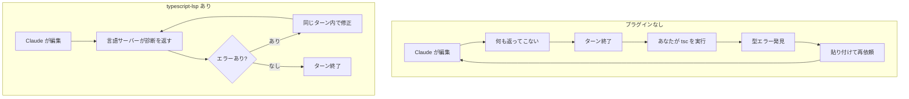
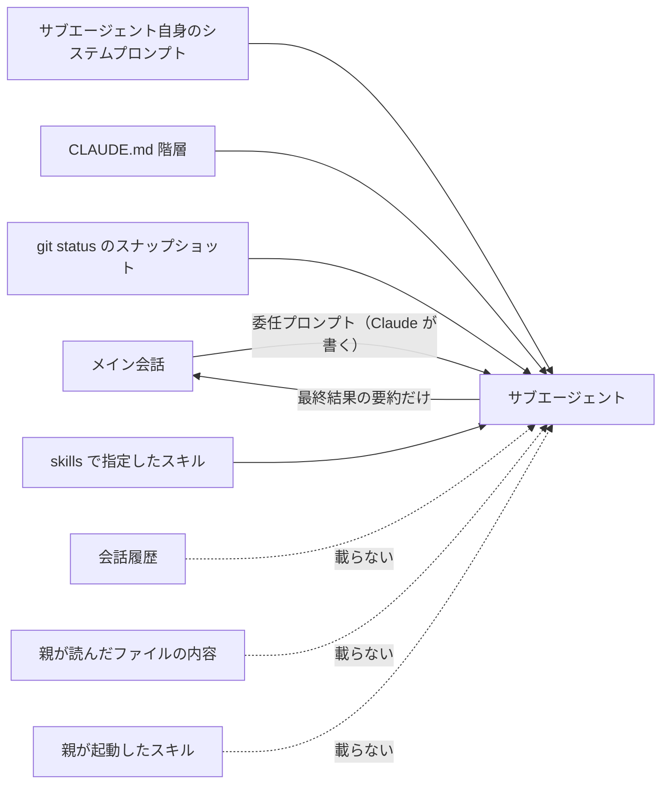
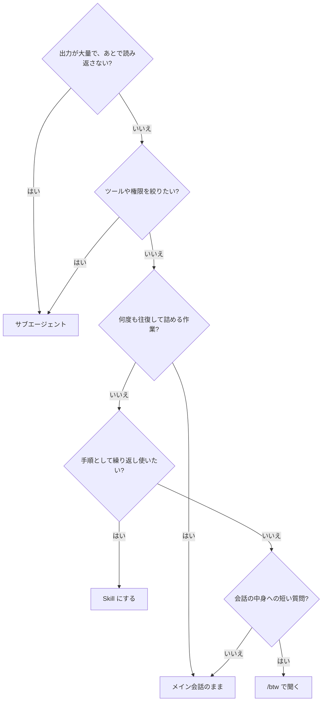

# Claude Daily — 2026-09-04（第014号）

## きょうの3行

- TypeScript のプロジェクトなら、`typescript-lsp` プラグインを入れるだけで Claude が**編集直後に型エラーを自分で受け取る**ようになります。検証をあなたが回す必要が減ります。
- 深掘り連載は第8回「サブエージェント」。サブエージェントの正体は「別のコンテキストウィンドウ」であり、会話履歴を**一切引き継がない**ことがすべての判断基準になります。
- 本日、Claude Code CLI の CHANGELOG に新しいバージョンはありませんでした（v2.1.259 のまま）。Platform リリースノートも 9/1 から更新なしです。

---

## ① ベストプラクティス — 言語サーバーを繋いで「編集直後に型エラーを Claude へ返す」

### 何を解決するのか

Claude Code は既定では grep と Read でコードを探します。この方法だと、Claude が書いた TypeScript に型エラーがあっても、**誰かが `tsc` を走らせるまで気づく人がいません**。多くの場合その「誰か」はあなたです。つまり検証ループの中にあなたが座り続けることになります。

Claude Code には LSP（Language Server Protocol、エディタが型情報や定義ジャンプを得るための共通プロトコル）を扱う組み込みツールがあり、**code intelligence プラグインを入れるとそれが有効になります**。公式ドキュメントは、これで Claude が得るものを2つだと書いています。

1. **自動診断** — Claude がファイルを編集するたび、言語サーバーがエラーと警告を返します。コンパイラや lint を走らせずに、型エラー・import 漏れ・構文エラーが見えます。Claude がエラーを入れてしまった場合、**同じターンの中で気づいて直します**。
2. **コードナビゲーション** — 定義ジャンプ、参照検索、hover の型情報、シンボル一覧、実装検索、呼び出し階層。grep ベースの検索より正確です。

### 仕組みの図



図1: 診断の受け手が「あなた」から「Claude」に移る。往復の回数がそのまま減る

### そのままコピペして動く手順

**手順1. 言語サーバーのバイナリを自分で入れる。** プラグインは LSP の**接続設定**であって、言語サーバー本体は同梱されません。ドキュメントの対応表では TypeScript に必要なバイナリは `typescript-language-server` です。

```bash
npm install -g typescript-language-server typescript
```

**手順2. プラグインを入れる。** 公式マーケットプレイス `claude-plugins-official` は、Claude Code を対話的に初回起動したときに自動で追加されています。

```bash
/plugin install typescript-lsp@claude-plugins-official
```

インストール結果に `Run /reload-plugins to activate.` と出たら、続けて実行します。

```bash
/reload-plugins
```

**手順3. チーム全員に効かせるなら `.claude/settings.json` に書く。** ファイル全体はこうなります（リポジトリにコミットして共有する想定）。

```json
{
  "enabledPlugins": {
    "typescript-lsp@claude-plugins-official": true
  },
  "permissions": {
    "allow": [
      "Bash(npm run lint)",
      "Bash(npm run typecheck)",
      "Bash(npx tsc --noEmit)"
    ]
  }
}
```

`enabledPlugins` のキーは `プラグイン名@マーケットプレイス名` という形式で、値は真偽値です。`permissions.allow` を併記しているのは、後述するとおり LSP が効かない環境が実在するためです。

診断を人間の目で読みたいときは、Claude Code が `Found 3 new diagnostic issues in 2 files` のような表示を出した状態で **Ctrl+O** を押します。

### アンチパターン

**（a）プラグインだけ入れてバイナリを入れない。** 一番起きやすい失敗です。インストール自体は成功し、Claude も普通に動くので、**「効いていないこと」に気づけません**。`/plugin` の Errors タブに `Executable not found in $PATH` が出ているのが唯一の手がかりです。プラグインが担うのは接続設定だけなので、バイナリが無ければ言語サーバーは起動せず、診断は永遠に返ってきません。

**（b）クラウドセッションでも同じ効果を期待する。** Claude Code on the web などのクラウドセッションでは、**Claude Code はプラグインの言語サーバーを起動しません**。したがって LSP ツールも付きません。手元では診断で守られていたのに、クラウド実行や CI では素通りする、という非対称が生まれます。上の設定例で `npx tsc --noEmit` を許可しているのはこのためで、環境をまたぐ保証は型チェックコマンド側で持たせます。

**（c）診断を無条件に信じさせる。** モノレポでは、ワークスペース設定が噛み合っていないと、内部パッケージの import が未解決だと誤検知されることがあります。公式ドキュメントもこれを既知の挙動として挙げており、編集能力自体には影響しないと書いています。「診断が赤いから直せ」と丸投げすると、存在しない問題を追いかけさせることになります。

なお `rust-analyzer` や `pyright` は大規模プロジェクトでメモリを大量に消費することがあり、その場合は `/plugin disable <plugin-name>` で切って組み込み検索に戻すのが公式の案内です。

出典: [Discover and install prebuilt plugins through marketplaces](https://code.claude.com/docs/en/discover-plugins) / [Best practices for Claude Code](https://code.claude.com/docs/en/best-practices) / [Settings reference](https://code.claude.com/docs/en/settings-reference)

---

## ② 深掘り連載 第8回 — サブエージェント：いつ使い、いつ使わないか

### なぜ重要か

Claude Code のベストプラクティスの大半は、たったひとつの制約から導かれています。**コンテキストウィンドウはすぐ埋まり、埋まるほど性能が落ちる**、という制約です。

サブエージェント（親とは別のコンテキストウィンドウで動く子セッション）は、この制約に対する最も直接的な道具です。調査で読んだ数十ファイル、テストの出力、ログの山——それらは全部**子のコンテキストの中で消え**、親の会話に返ってくるのは最終結果の要約だけです。

### 仕組みの図

重要なのは「何が載って、何が載らないか」です。ここを誤解したままだと、サブエージェントは高確率で的外れな仕事をして帰ってきます。



図2: 起動時に載るもの・載らないもの。Explore と Plan は CLAUDE.md と git status も読みません

つまり、**サブエージェントに渡る情報は「Claude が書いた委任プロンプト」がほぼすべて**です。「さっきの話の続きをやって」は成立しません。必要な前提は委任プロンプトに書かせる必要があります。

### 具体的な使い方

定義は `.claude/agents/` に Markdown ファイルとして置きます。プロジェクト固有のものはここに置いてコミットすれば、チーム全員が同じ子を使えます。

```markdown
---
name: migration-checker
description: 変更差分がNext.jsのApp Router移行方針に沿っているか点検する。実装のあとに使う。
tools: Read, Grep, Glob, Bash
disallowedTools: Write, Edit
model: sonnet
maxTurns: 10
---

あなたは移行方針の点検役です。渡された差分について次だけを報告してください。

1. `pages/` に新規ファイルが増えていないか
2. Server Component にできる箇所で `"use client"` が付いていないか
3. データ取得が `fetch` のキャッシュ設定なしで書かれていないか

指摘は「ファイル:行番号」と修正案の形で書き、スタイルの好みは報告しないこと。
```

主なフロントマターの意味は次のとおりです。

| キー | 効き方 |
|---|---|
| `tools` | 使えるツールの**許可リスト**。書いたものだけになる |
| `disallowedTools` | 継承したツールからの**引き算**。両方書いた場合はこちらが先に適用される |
| `model` | `sonnet` / `opus` / `haiku` / `fable`、完全なモデルID、または親と同じにする `inherit` |
| `maxTurns` | 打ち切りまでのターン数上限（v2.1.246 以降） |
| `skills` | 起動時にあらかじめ読み込ませるスキル名 |
| `permissionMode` | 子だけの権限モード。ただし親が `auto` か `bypassPermissions` のときは無視される |
| `isolation` | `worktree` にすると一時的な git worktree の中で動く |

呼び方は3通りあります。名前を書いて Claude の判断に任せる（`migration-checker サブエージェントで差分を点検して`）、`@agent-migration-checker` と打って確実に指名する、`claude --agent migration-checker` でセッションごとその設定にする。**確実に呼ばせたいときは `@agent-` 形式**を使ってください。

会話の文脈をまるごと引き継がせたい場合だけは、フォークという別枠があります。`/subtask <指示>`（v2.1.212 以降）で作ると、親のメッセージ履歴・システムプロンプト・ツールをすべて受け継いだ子が背景で走り、返るのは結果だけです。「説明し直すコストのほうが高い」ときはこちらです。

入れ子と同時実行には上限があります。サブエージェントはさらにサブエージェントを呼べますが**既定は3層**（`CLAUDE_CODE_MAX_SUBAGENT_SPAWN_DEPTH`）、**同時実行は既定20体**（`CLAUDE_CODE_MAX_CONCURRENT_SUBAGENTS`）で、超えると `Concurrent subagent limit reached.` で失敗します。

### 使うべき時／使うべきでない時



図3: 迷ったときの判断フロー。「往復が必要か」が最初の分岐だと考えると外しにくい

使うべきなのは、調査・テスト実行・ログ解析のように**出力が大量で使い捨て**の作業、ツールを絞って走らせたい作業、安いモデルに寄せてコストを隔離したい作業、そして並列で独立に走らせられる調査です。

避けるべきなのは、フェーズ間で文脈を共有する作業（計画→実装→テストを通しでやるようなもの）、細かく方向修正しながら詰める作業、そして小さく確実な変更です。サブエージェントは**毎回まっさらから始まる**ので起動が遅く、往復のたびにその遅さを払うことになります。

出典: [Subagents](https://code.claude.com/docs/en/sub-agents) / [Best practices for Claude Code](https://code.claude.com/docs/en/best-practices)

---

## ③ すぐ効くTIPS

### 1. 使っていないプラグインを棚卸しする

プラグインは有効なだけで毎ターンのコンテキストと起動時間を消費します。`/plugin` の Installed タブには、**自分で入れたのに2週間以上・10セッション以上使っていない**プラグインが「Not used recently」の見出しでまとまり、詳細画面には「Last used」が出ます。ここが剪定の第一候補です。

```bash
/plugin list --enabled
```

有効なものだけを一覧できます。中身の内訳（コマンド・スキル・エージェント・フック・MCP/LSP サーバー）はシェルから `claude plugin details` でも読めます。テーマ・出力スタイル・モニター・ワークフローを提供するプラグインと、組織が管理しているものは、この「未使用」判定の対象外です。

### 2. `/reload-plugins` の警告は無視せず読む

プラグインの有効化・無効化はプロンプトキャッシュを無効にすることがあります。その場合 `/reload-plugins` は警告を出して**いったん止まり**、`--force` を付けて再実行するまで反映しません。

```bash
/reload-plugins --force
```

なぜ止まるのかというと、キャッシュが飛ぶと次のリクエストで会話全体を読み直すことになり、その分の課金と待ち時間が発生するからです。作業の切れ目で実行するのが安全です。

### 3. 子のツールは「許可リスト」より「引き算」で書く

サブエージェントの `tools` は許可リストなので、書き漏らしたツールは静かに使えなくなります。読み書き以外は普通に使わせたい、`Write` と `Edit` だけ止めたい——という場合は `disallowedTools` のほうが壊れにくいです。

```yaml
disallowedTools: Write, Edit, mcp__github
```

MCP サーバーはこのようにサーバー単位（`mcp__github`）でも、`mcp__*` のようにまとめても外せます。両方書いたときは `disallowedTools` が先に適用されます。

---

## ④ 事例

### DXC — 保険の基幹システムに Claude を入れ、1.4万人規模で使う

保険業界の基幹システムを運用する DXC Technology の事例です。同社の保険部門は従業員1.4万人、顧客1,100社を抱え、年間5〜7兆ドルの保険料に触れるシステムを扱っています。課題は書類の手作業レビューで、**請求業務では専門家の時間の40〜50%が書類の解析に消えていた**とされています。

同社は Claude を4つの層（書類の分類、ワークフローの調整、専用エージェント、コンプライアンス追跡）に組み込んだ「Assure」というオーケストレーション基盤を作りました。報告されている結果は、請求受付のバックログが数日から数分へ、規制ルールの組み込みが12〜18か月から数日へ、労災計算アプリを8時間で構築し初回で80%の精度、その計算における人間の判断が70%から20%へ、というものです。

チーム展開の観点で見どころなのは、**全社ツールを配るのではなく「業務の層ごとに役割を分けた」**点と、規制対応のためにすべての操作をログに残す設計を最初から入れている点です。現場の開発エンジニアは Claude Code で機能を作っています。

出典: [DXC brings Claude to the insurance backbone running billions of policies](https://claude.com/customers/dxc)

### サブエージェント定義は「部品」として孫にも再利用される

GENDA の開発エンジニアによる記事で、役割別にサブエージェントを定義していたところ、上位のサブエージェント（`heavy-implementer`）が、メインセッションからの明示的な指示なしに `code-explore` と `test-runner` を**孫エージェントとして自分で呼んだ**、という報告があります（二次情報）。

筆者はここから、サブエージェント定義は「一回きりの委任先」ではなく「入れ子の階層のどこからでも再利用される共有部品」だと結論づけ、役割をまたいで使える汎用的な能力は早めにサブエージェントとして定義しておくとよい、と書いています。

なお記事は 2026年6月時点のもので入れ子の深さを「5階層まで」と記述していますが、**現在の公式ドキュメントの既定値は3層**（`CLAUDE_CODE_MAX_SUBAGENT_SPAWN_DEPTH` で変更可）です。仕様は公式側を見てください。

出典: [Claude Code サブエージェントのネスト機能で .claude/agents/ の定義が効いた話（Zenn）](https://zenn.dev/genda_jp/articles/16d35ffa464d65)

---

## ⑤ 速報 — 新機能・変更点

前回チェック（2026-09-03 / v2.1.259）以降、**新しい発表はありませんでした**。

| いつ | 何が | どう効くか |
|---|---|---|
| — | Claude Code CLI の CHANGELOG は v2.1.259 のまま新バージョンなし | 追随すべき変更はありません |
| — | Platform リリースノートは 9/1（Fable 5.1 / Mythos 5.1）から更新なし | 既報。詳しくは 2026-09-02 の号を参照 |
| — | anthropic.com/news も 9/1 以降の新規なし | — |

---

## ⑥ コマンド早見

| コマンド | 何をするか |
|---|---|
| `npm install -g typescript-language-server typescript` | TypeScript の言語サーバーのバイナリを入れる |
| `/plugin install typescript-lsp@claude-plugins-official` | TypeScript の code intelligence プラグインを入れる |
| `/reload-plugins` | プラグインの変更を再起動なしで反映する |
| `/reload-plugins --force` | キャッシュ無効化の警告を承知のうえで反映する |
| `/plugin list --enabled` | 有効なプラグインだけを一覧する |
| `/plugin disable <plugin-name>` | プラグインをアンインストールせずに無効化する |
| `claude plugin details` | プラグインが提供する構成要素をシェルから確認する |
| `/subtask <指示>` | 会話の文脈をまるごと引き継いだ子（フォーク）を背景で走らせる |
| `npx tsc --noEmit` | 型チェックだけを実行する（LSP が効かない環境の保険） |

---

## ⑦ きょうの課題

**目標**: 手元の Next.js プロジェクトで、Claude が「自分の入れた型エラーに、同じターン内で気づく」状態を作り、実際にそうなることを確認する。所要 5〜15分。

**前提**: TypeScript を使っている Next.js プロジェクトと、Node.js が入っている環境。

**手順**

1. 言語サーバーのバイナリを入れる。

```bash
npm install -g typescript-language-server typescript
```

2. Claude Code を起動し、プラグインを入れる。`Run /reload-plugins to activate.` と出たら `/reload-plugins` も実行する。

```bash
/plugin install typescript-lsp@claude-plugins-official
```

3. Claude に、わざと型が合わない変更をさせる。たとえばこう頼みます。

```text
app/page.tsx に、引数に number を取る formatCount(count: number): string を追加して、
呼び出し側では文字列 "12" を渡してください。そのあと、いま自分が入れた診断を報告してください。
```

**確認方法**

- Claude が `tsc` も lint も実行していないのに型の不一致を指摘できていれば成功です。
- `Found N new diagnostic issues in M files` の表示が出たら **Ctrl+O** で中身を読みます。
- 何も指摘されないときは `/plugin` を開いて Errors タブを見てください。

── 模範解答 ──

**期待される挙動**: Claude は `formatCount("12")` の行について「`string` を `number` に代入できない」旨の診断を受け取り、多くの場合そのターンのうちに `formatCount(12)` へ直そうとします。直すところまで行かなくても、**`tsc` を一度も走らせずにエラーを言い当てられていれば LSP は効いています**。

**なぜそうなるのか**: code intelligence プラグインは Claude Code 組み込みの LSP ツールを有効にします。有効になると、Claude がファイルを編集するたびに言語サーバーが診断を返し、その結果が Claude の目に入ります。従来は「コンパイラを実行する」という明示的な行動が必要だった情報が、編集の副産物として自動的に届くようになる、という違いです。

**よくある詰まりどころ**

- **`Executable not found in $PATH`**: 手順1を飛ばしたか、グローバル install 先が PATH に入っていません。`which typescript-language-server` で確認します。
- **反映されない**: インストール直後は有効になっていないことがあります。`/reload-plugins`（警告が出たら `--force`）を実行してください。
- **クラウドセッションで試して効かない**: 仕様どおりです。クラウドセッションではプラグインの言語サーバーは起動しません。ローカルの CLI で試してください。
- **モノレポで身に覚えのない import エラーが出る**: 既知の誤検知です。診断を鵜呑みにさせず、`npx tsc --noEmit` の結果と突き合わせてください。

---

あすの予告: 深掘り連載 第9回「Explore / Plan エージェントの使い分け」。
