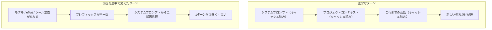
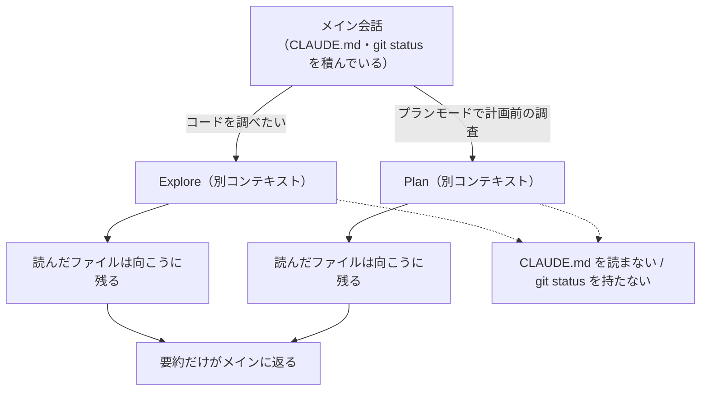
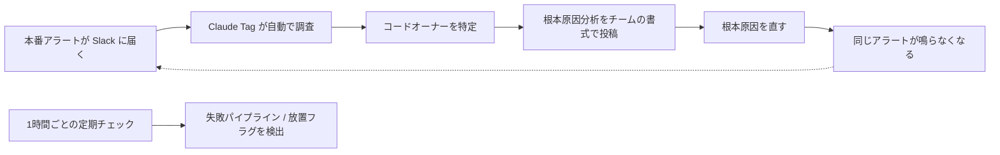

# Claude Daily — 2026-09-05（第015号）

## きょうの3行

- 会話の途中で `/model` や `/effort` を変えると、次の1ターンで**会話履歴の全部が読み直し**になります。前提はセッションの冒頭で固定してください。
- 深掘り連載は第9回「Explore / Plan エージェント」。この2つは組み込みのサブエージェントで、**あなたの CLAUDE.md を読みません**。ここが使い分けの分かれ目です。
- Claude Code CLI に v2.1.260 と v2.1.261 が出ました。`/cost` がキャッシュミスの原因を表示し、`/skill-doctor` が未使用スキルのコンテキスト費用を出します。

---

## ① ベストプラクティス — セッションの前提を先に固定する

### 何を解決するのか

「さっきまで速かったのに、急に1ターンだけ異常に遅くて高い」。この現象には決まった原因があります。**プロンプトキャッシュのプレフィックスが壊れた**ときです。

Claude Code はターンごとに新しい API リクエストを作り、毎回**会話の全部**を送り直しています。モデルはリクエスト間で何も覚えていないからです。そのままだと毎ターン全部を処理し直すことになるので、API は「リクエストの先頭（プレフィックス）が前回と一致する範囲」をキャッシュから読みます。読み出しは通常の入力単価のおよそ 10% で課金されます。

一致判定は**完全一致**です。プレフィックスのどこか1箇所が変わると、そこから後ろは全部処理し直しになります。ファイル単位・セグメント単位のキャッシュはありません。だから公式ドキュメントは、変わりにくいものから順に並べる設計になっていると説明しています。

| 層 | 中身 | 変わるとき |
|---|---|---|
| システムプロンプト | 中核の指示、ツール定義、出力スタイル | 読み込まれるツール定義の集合が変わる／Claude Code がアップグレードされる |
| プロジェクトコンテキスト | CLAUDE.md、自動メモリ、スコープなしのルール | セッション開始時、`/clear` や `/compact` の後 |
| 会話 | あなたのメッセージ、応答、ツール結果 | 毎ターン |

会話層が伸びるのは正常です。問題は**システムプロンプト層を触ってしまう操作**で、これをやると後ろが全部無効になります。

### 仕組みの図



図1: 壊れるのは「会話が伸びたから」ではなく「前に置いたものが変わったから」

### そのままコピペして使える設定

キャッシュには有効期間（TTL）があり、**5分**と**1時間**の2種類です。1時間のほうは離席をまたいでも生き残りますが、キャッシュ書き込みの単価が上がります。既定では、Claude サブスクリプションのプラン内利用のときだけメイン会話に1時間が要求され、それ以外（API キー・使用クレジット・クラウドプロバイダ経由）は5分です。サブエージェントなどメイン会話の外側は、原則すべて5分です。

自分で決めるには `.claude/settings.json` に次の2つを書きます。値は `5m` か `1h` のみで、他の値は無視されます。どちらも v2.1.242 以降が必要です。

```json
{
  "model": "claude-opus-5",
  "promptCacheTtl": "1h",
  "subagentPromptCacheTtl": "5m",
  "permissions": {
    "allow": [
      "Bash(npm run lint)",
      "Bash(npm run build)",
      "Bash(npx tsc --noEmit)"
    ]
  }
}
```

`promptCacheTtl` がメイン会話（対話ターン、`claude -p` の実行、Agent SDK のターン）、`subagentPromptCacheTtl` がそれ以外（サブエージェント、ワークフロー、コンパクション、セッションタイトルの生成など）です。1時間にすると書き込み単価が上がるので、**5分で切れるほど間が空く使い方をしているときだけ**上げてください。短時間で連続して打ち続ける使い方なら、5分のままのほうが安く済みます。

実際にどちらの TTL でキャッシュが書かれたかは、次の1行で確認できます。

```bash
claude -p "hello" --output-format json
```

返ってきた JSON の `usage.cache_creation` を見ます。1時間の書き込みは `ephemeral_1h_input_tokens`、5分の書き込みは `ephemeral_5m_input_tokens` に入ります。

セッション単位の成績は `/usage` で見ます。メイン会話の最初の応答のあと、Session ブロックに `Prompt cache (main)` の行が出て、そのセッションのヒット率・ミス回数・いまキャッシュが温かいかどうかが表示されます（v2.1.251 以降）。今日追加された v2.1.260 では `/cost` がキャッシュミスの推定原因まで出すようになりました。

### アンチパターン

**1. タスクの途中でモデルを切り替える。** モデルごとに別のキャッシュです。`/model` で切り替えると、内容がまったく同じでも次のリクエストは会話履歴の全部をキャッシュヒットなしで読みます。「軽い作業だから安いモデルに落とそう」という判断が、切り替えた直後の1ターンで元が取れなくなることがあります。

正しくは、**別の会話を開く**か、**サブエージェントとして呼ぶ**かです。サブエージェントは自分のシステムプロンプトで別のキャッシュを持つので、親のキャッシュは無傷のまま残ります。

`/effort` も同じです。多くのモデルでは effort レベルごとに別キャッシュになります（例外として、Fable 5.1 を API キーまたは Claude サブスクリプションで使っている場合は、v2.1.260 以降はキャッシュを維持したまま変更できます）。

**2. `opusplan` を使っていることを忘れる。** `opusplan` はプランモード中は Opus、実装中は Sonnet に解決される設定です。つまり**プランモードに入る／出るたびにモデル切り替えが起きて**、そのたびに新しいキャッシュを作り直します。プランモードを何度も出入りする使い方とは相性が悪い、ということです。

**3. セッション中に CLAUDE.md を編集して「効かない」と悩む。** プロジェクトルートとユーザーレベルの CLAUDE.md はセッション開始時に一度だけ読まれ、メモリ上に保持されます。途中の編集はキャッシュを壊しませんが、**その編集は今のセッションには適用されません**。次の `/clear`、`/compact`、または再起動で載ります。出力スタイル（`outputStyle`）も同じ扱いです。「書いたのに守らない」の何割かは、単にまだ読まれていないだけです。

**4. 失敗した探索を `/compact` で片づける。** `/compact` は履歴を要約で置き換えるので、会話層のプレフィックスが必ず変わります。**行きたくない方向に進んでしまっただけ**なら、`/rewind` のほうが安いです。rewind は会話を過去のターンまで切り詰めるだけなので、残る履歴はそのキャッシュがすでに作られた内容そのものであり、次のリクエストは以前のキャッシュエントリに当たります。`/compact` は「捨てたい文脈がある」ときの道具で、「やり直したい」ときの道具ではありません。

なお `/recap` は要約を履歴の置き換えではなくコマンド出力として末尾に足すだけなので、キャッシュは壊れません。

出典: [How Claude Code uses prompt caching](https://code.claude.com/docs/en/prompt-caching)
出典: [Lessons from building Claude Code: Prompt caching is everything](https://claude.com/blog/lessons-from-building-claude-code-prompt-caching-is-everything)

---

## ② 深掘り連載 第9回 — Explore / Plan エージェントの使い分け

### なぜ重要か

Claude Code には、あなたが定義しなくても最初から存在するサブエージェントがあります。そのうち日常で最もよく動くのが **Explore** と **Plan** の2つです。どちらも Claude が自動で呼ぶので、多くの人は「使う／使わない」を決めた覚えがないまま毎日使っています。

この2つを理解する価値は、片方が**あなたのプロジェクト規約を読まない**点にあります。ここを知らないと、「規約どおりに調べてほしかったのに一般論で返ってきた」という結果の理由が分かりません。

### 2つの正体

| | Explore | Plan |
|---|---|---|
| 役割 | コードベースの検索・解析に最適化された読み取り専用エージェント | プランモード中に計画を出す前の材料を集める調査エージェント |
| ツール | 読み取り専用。Write と Edit は拒否 | 読み取り専用。Write と Edit は拒否 |
| モデル | メイン会話から継承。Claude API では **Opus が上限** | メイン会話から継承 |
| 呼ばれ方 | 変更なしにコードを探す／理解する必要が出たとき、Claude が自動委譲 | プランモード中、Claude が調査を自動委譲 |

Explore のモデル継承は v2.1.198 で変わりました。それ以前は常に Haiku でしたが、現在はメイン会話のモデルを継承します。Claude API 上では上限が Opus なので、それより上位のモデルでメイン会話を回していても Explore は Opus で動き、メインが Sonnet や Haiku ならそれと同じモデルで動きます。Amazon Bedrock、Google Cloud の Agent Platform、Microsoft Foundry、Claude Platform on AWS では、上限なくメイン会話のモデルをそのまま継承します。

Explore を呼ぶとき、Claude は徹底度を指定します。**quick**（狙いを絞った参照）、**medium**（バランス）、**very thorough**（網羅的な解析）の3段階です。

### 仕組みの図



図2: メインに戻ってくるのは要約だけ。ただし持っていったものも「あなたの規約」ではない

### 何を積まないのか

公式ドキュメントは、**Explore と Plan はあなたの CLAUDE.md ファイルと親セッションの git status をスキップする**と明記しています。調査を速く・安く保つためです。他の組み込みサブエージェントとカスタムサブエージェントは、どちらも読み込みます。

これは実務上こういう意味になります。

- 「うちの規約に沿っているか調べて」はこの2つに向きません。規約が載っていないからです。
- 「いま変更中のファイルとの関係を調べて」も向きません。git status を持っていないからです。
- 逆に、「この関数はどこから呼ばれているか」「認証まわりのファイル構成はどうなっているか」のような**コードそのものに答えがある調査**には最適です。

規約を踏まえた調査をさせたいなら、`.claude/agents/` に自分のサブエージェントを作ってそちらを名指しするか、必要な規約を**プロンプトに直接書いて**渡してください。

### Explore を安くする

Explore がメイン会話のモデルを継承するということは、Opus で作業していれば探索も Opus で走るということです。探索は読んで要約するだけなので、ここを下げると効きます。**ユーザーまたはプロジェクトの `Explore` という名前のサブエージェントは組み込みを上書きし、自分の `model` フィールドを保ちます。**

`.claude/agents/Explore.md` にこのファイルを置きます。

```markdown
---
name: Explore
description: コードベースの検索と読解を行う読み取り専用エージェント。変更は行わない。
tools: Read, Grep, Glob, Bash
model: haiku
color: cyan
---

あなたはコードベースの調査担当です。ファイルの変更は一切しません。

- 依頼された範囲だけを調べ、関係のないディレクトリには広げないこと。
- 回答には必ず `path/to/file.ts:123` の形式で位置を添えること。
- 推測は「推測」と明記すること。読んで確認できたことと分けて書くこと。
- 最後に、読んだファイルの一覧を箇条書きで返すこと。
```

`model` に指定できるのは `sonnet` / `opus` / `haiku` / `fable` / `claude-opus-5` のような完全なモデル ID / `inherit` です。

### 止める・禁じる

そもそも委譲させたくない場合は、環境変数で組み込みの Explore と Plan だけを外せます（v2.1.198 以降）。外すと Claude は委譲せず、自分で直接ファイルを読んで探索します。

```bash
CLAUDE_CODE_DISABLE_EXPLORE_PLAN_AGENTS=1 claude
```

個別に禁止するなら権限ルールです。`Agent(<サブエージェント名>)` の形式で書きます（`<サブエージェント名>` はサブエージェントの `name` フィールドの値）。組み込みにもカスタムにも効きます。1回きりなら `claude --disallowedTools "Agent(Explore)"` でも同じことができます。

```json
{
  "permissions": {
    "deny": ["Agent(Explore)"]
  }
}
```

### 使うべき時 / 使うべきでない時

| 状況 | 判断 |
|---|---|
| 読むファイルが多く、結果の要約だけあればいい | 委譲させる（既定の挙動のまま） |
| プロジェクト規約や設計方針に照らした調査 | 委譲させない。カスタムサブエージェントか、メイン会話で直接読ませる |
| 変更中の差分を踏まえた調査 | 委譲させない。git status を持っていない |
| 探索の中身を後の実装でそのまま参照したい | 委譲させない。向こうのコンテキストは戻ってこない |
| 探索コストを下げたい | `.claude/agents/Explore.md` で `model: haiku` に固定する |

なお、①で触れたキャッシュの話はここにも繋がります。**サブエージェントは自分のシステムプロンプトで別のキャッシュを持つので、親のキャッシュは読みません。**そして TTL のバケットとしては「メイン会話の外側」に入るため、サブスクリプションでも既定は5分です。長く走る探索を繰り返すなら `subagentPromptCacheTtl` か、サブエージェント定義の `experimental` フィールドの `cacheTtl` キー（v2.1.248 以降）で調整します。

出典: [Create custom subagents](https://code.claude.com/docs/en/sub-agents)
出典: [Run agents in parallel](https://code.claude.com/docs/en/agents)

---

## ③ すぐ効くTIPS

### 1. `/usage` の `Prompt cache (main)` 行で自分の成績を見る

キャッシュが効いているかどうかは体感では分かりません。メイン会話の最初の応答のあと、Session ブロックにヒット率・ミス回数・いま温かいかが1行で出ます（v2.1.251 以降）。**ミス回数が作業内容に見合わず増えているなら、途中で何かを切り替えています。**

```
/usage
```

### 2. `/skill-doctor` で「載っているのに使われていないスキル」を洗い出す

スキルは読み込まれた時点でコンテキストを消費します。v2.1.261 で `/skill-doctor` が、**読み込まれたが使われていないスキルとそのコンテキスト費用**を出すようになりました。棚卸しの判断が体感ではなく数字でできます。

```
/skill-doctor
```

### 3. 出力が途中で切れて原因に辿り着けないときは上限を上げる

テストやビルドの出力が切り捨てられると、Claude は本当のエラー行を見ないまま推測を始めます。v2.1.261 で追加された `bashOutputMaxChars` と `taskOutputMaxChars` を `.claude/settings.json` に書くと、インラインに出せるコマンド出力を最大 128K 文字まで増やせます。ただし増えた分はそのままコンテキストを食うので、**常時上げるのではなく、詰まっているプロジェクトだけ**にしてください。

---

## ④ 事例

### Carvana — Slack のアラートを本番の修正まで運ぶ（チーム展開）

北米のオンライン中古車販売 Carvana は、本番アラートの調査を自動化する社内製の Slack ボットを2つ内製していましたが、その保守自体がエンジニアリング資源を食っていました。さらにアクセス制御の制約から横展開ができず、卸売プラットフォームチームは「長期サポートと将来の移行リスク」を理由に利用を断っていたと報告されています。

Claude Tag（Slack 上で Claude に作業を委譲する仕組み）が使えるようになったタイミングで、内製ボットからの移行を決めました。決め手になった機能として挙げられているのが **bundles**（指示・ツール・チーム単位のアクセスをまとめてパッケージにする仕組み）で、これによりチームごとに権限を分けたまま同じ基盤を配れるようになったとしています。データウェアハウスへの接続も、チームごとに別のアイデンティティを与えて分離しています。

実際の使われ方は3チームで異なります。リテールサイエンスチームでは、Slack のアラートチャンネルを監視して自動で調査し、コードオーナーを特定して、チームの好む書式で根本原因分析を投稿させています。カスタマー検証チームでは、リリースのたびに直前1時間のベースラインログと自動で突き合わせ、エラー・警告・量を比較させています（ログが不足していた場面では、ログを改善する Pull Request まで作ったとしています）。卸売プラットフォームチームでは、チケット・ビルド履歴・コードへの読み取り専用アクセスを与えて、報告から根本原因まで辿らせ、機能のスコープ決めと設計レビューも担当させています。さらに1時間ごとの定期チェックで、失敗しているパイプラインと放置されたフィーチャーフラグを検出しています。



図3: 「調査を速くする」のではなく「鳴る回数そのものを減らす」向きにループが閉じている

結果として報告されているのは、根本原因が解消された結果**リテールサイエンスのチャンネルでアラート量が 56% 減**、**卸売プラットフォームチームでは手動調査に比べて回答が 65% 高速化**という数字です。導入は上からの号令ではなく、うまくいっているチームを見た他チームが自発的に広げていった形だとしています。

チーム展開の観点で読むところは、内製ボットが技術的に動いていたにもかかわらず横に広がらなかった理由が「性能」ではなく**「運用の持続性への不信」**だった、という点です。

出典: [Carvana turns Slack alerts into production fixes with Claude Tag](https://claude.com/customers/carvana)

### セッションを細かく切る運用（二次情報）

個人の運用報告として、コストは「単価 × 量」であり、単価側にモデル・effort・thinking・プロンプトキャッシュの状態が、量側にセッション長とターン数が乗る、という整理があります。そのうえで、セッションを開いた直後に `/model` と `/effort` を固定し、タスクが1つ終わるごとにセッションを切り、直近の失敗は訂正を重ねずに `/rewind` で戻す、という運用に変えたと報告されています。また `/context` をセッション中に1回走らせて不要な MCP や冗長なドキュメントを外す、大きめの調査はサブエージェントに逃がす、といった具体も挙げられています。①で書いた仕様と方向は一致していますが、数値は測定されたものではなく個人の実感である点に注意してください。

出典: [Claude Code のコスト削減 セッションの単価と量を下げる運用（note、二次情報）](https://note.com/masa_wunder/n/nca3afb32f692)

---

## ⑤ 速報 — 新機能・変更点

| いつ | 何が | どう効くか |
|---|---|---|
| v2.1.261 | `bashOutputMaxChars` と `taskOutputMaxChars` を追加 | インラインに出せるコマンド出力を最大 128K 文字まで増やせる。切り捨てで原因行が見えない問題に効く |
| v2.1.261 | `--append-subagent-system-prompt-file` を追加 | 長いサブエージェント用システムプロンプトをファイルから読み込める |
| v2.1.261 | `/skill-doctor` が未使用の読み込み済みスキルとそのコンテキスト費用を表示 | スキルの棚卸しを数字で判断できる |
| v2.1.261 | 組織ポリシーの読み込み失敗が `/status` と `claude doctor` に説明つきで出る | 「管理設定が効いていない」の原因切り分けが早くなる |
| v2.1.260 | フルスクリーンモードに左右分割の差分パネル（`/diff` で切り替え） | 差分の確認をターミナル内で完結できる |
| v2.1.260 | `/cost` がプロンプトキャッシュミスの推定原因を表示 | ①の診断がコマンド1つで済む |
| v2.1.260 | `/reload-plugins` がヘッドレスセッションでも使える／テキスト版 `/advisor` をデスクトップとヘッドレスに追加 | 非対話環境での運用の穴が塞がる |
| v2.1.260 | 括弧を含む権限ルールが拒否・無視される不具合の修正、不正な正規表現ルール1つで全ファイル編集が壊れる不具合の修正、Bash サンドボックスとファイル権限のセキュリティ修正 | 権限設定が意図どおり効くようになる |
| 2026-09-03 | ant CLI v1.30.0 に `ant apply` を追加 | エージェント・環境・スキル・メモリストア・デプロイをリポジトリのファイルからコードとして管理できる。承認フローと `claude-lock.json` によるロックファイル追跡つき |

`anthropic.com/news` は 9/1 の「Claude Fable 5.1 と Claude Mythos 5.1」以降、新しい発表はありません。

出典: [Claude Code CHANGELOG](https://github.com/anthropics/claude-code/blob/main/CHANGELOG.md)
出典: [Claude Platform リリースノート](https://platform.claude.com/docs/en/release-notes/overview)

---

## ⑥ コマンド早見

| コマンド | 何をするか |
|---|---|
| `/usage` | セッションの利用状況を出す。キャッシュのヒット率・ミス回数・温かさもここ |
| `/cost` | かかったコストを出す。キャッシュミスの推定原因も表示される |
| `/model` | モデルを切り替える（切り替えるとキャッシュは作り直しになる） |
| `/effort` | effort レベルを変える（多くのモデルでキャッシュは作り直しになる） |
| `/compact` | 会話履歴を要約で置き換える |
| `/rewind` | 会話を過去のターンまで切り詰める |
| `/clear` | 会話をリセットする |
| `/recap` | 要約を表示する（履歴は置き換えない） |
| `/context` | いま何がコンテキストに載っているかを出す |
| `/skill-doctor` | 未使用の読み込み済みスキルとコンテキスト費用を出す |
| `/diff` | フルスクリーンモードで左右分割の差分パネルを切り替える |
| `/status` | 設定の読み込み状況を確認する |
| `claude -p "hello" --output-format json` | 1往復だけ実行して JSON を返す。`usage.cache_creation` で TTL を確認する |
| `claude --disallowedTools "Agent(Explore)"` | そのセッションだけ Explore への委譲を禁じる |
| `claude doctor` | 環境と設定を診断する |

---

## ⑦ きょうの課題

Next.js プロジェクトで、**Explore を安いモデルに固定し、モデル切り替えがキャッシュに与える影響を自分の目で確認します。**（所要 10〜15分）

**前提**

- Claude Code v2.1.251 以降（`/usage` にキャッシュの行が出るバージョン）
- 手元の Next.js プロジェクト。ファイルが数十個以上あるものが望ましい

**手順**

1. `.claude/agents/Explore.md` を作り、②のファイルをそのまま貼る。
2. プロジェクトのルートで新しいセッションを開く。
3. 最初の質問として、探索が走るものを投げる。例: `app/ の下でサーバー側のデータ取得をしている箇所を全部探して、ファイルと行番号で一覧にして`
4. 応答が返ったら `/usage` を実行し、`Prompt cache (main)` の行のミス回数を控える。
5. `/model` で別のモデルに切り替える。
6. 同じ調子の質問をもう1つ投げる。例: `そのうち fetch のキャッシュ設定を明示していないものはどれ？`
7. もう一度 `/usage` を実行し、ミス回数を比べる。

**確認方法**

手順4と手順7でミス回数の増え方を比べます。手順5のモデル切り替えを挟んだぶんが、余分なミスとして出ていれば再現できています。あわせて、手順3の応答が Explore に委譲されていたか（タスク表示に Explore が出ていたか）も見てください。

── 模範解答 ──

**起きること**

手順5でモデルを切り替えた直後のターンは、会話の内容が同じでもキャッシュヒットなしで全部読み直されます。`/usage` のミス回数はそのぶん増えます。切り替えなければ、会話が伸びてもミスは増えません。伸びた部分は末尾に足されるだけで、前のプレフィックスはそのまま一致するからです。

**なぜそうなるのか**

キャッシュのキーにはモデルが含まれています。モデルごとに別のキャッシュなので、切り替えは「別のキャッシュに引っ越す」ことであり、引っ越し先には何も入っていません。内容が1文字も変わっていなくても関係ありません。

Explore を `model: haiku` に固定したことは、この実験の結果自体には影響しません。Explore は自分のコンテキストで動くサブエージェントなので、メイン会話のキャッシュとは別勘定だからです。効くのは**探索そのものの単価**です。メイン会話が Opus のとき、上書きしなければ Explore も Opus で走ります。

**よくある詰まりどころ**

- **`Prompt cache (main)` の行が出ない** — v2.1.251 より前のバージョンです。`claude doctor` で確認してください。
- **`/model` を実行したら確認を求められた** — キャッシュがまだ温かいときだけ、Claude Code は切り替えの確認を出します。冷えていれば聞かずに切り替わります。この確認自体が「いま切り替えると高くつく」という合図です。
- **Explore に委譲されない** — 質問が狭すぎると Claude は自分で1〜2ファイル読んで終わります。委譲は「変更なしにコードベースを探す／理解する必要がある」と Claude が判断したときに起きます。範囲を広げた聞き方に変えてください。
- **CLAUDE.md に書いた規約どおりに探してくれない** — 仕様どおりです。Explore と Plan は CLAUDE.md を読みません。規約を踏まえさせたいなら、プロンプトに直接書くか、別名のカスタムサブエージェントを作って名指ししてください。

---

あすの予告: 深掘り連載 第10回「Skills — 繰り返す作業を手順として固定する」。
