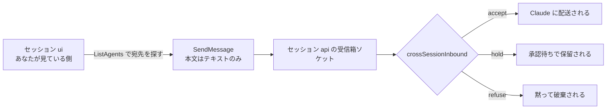
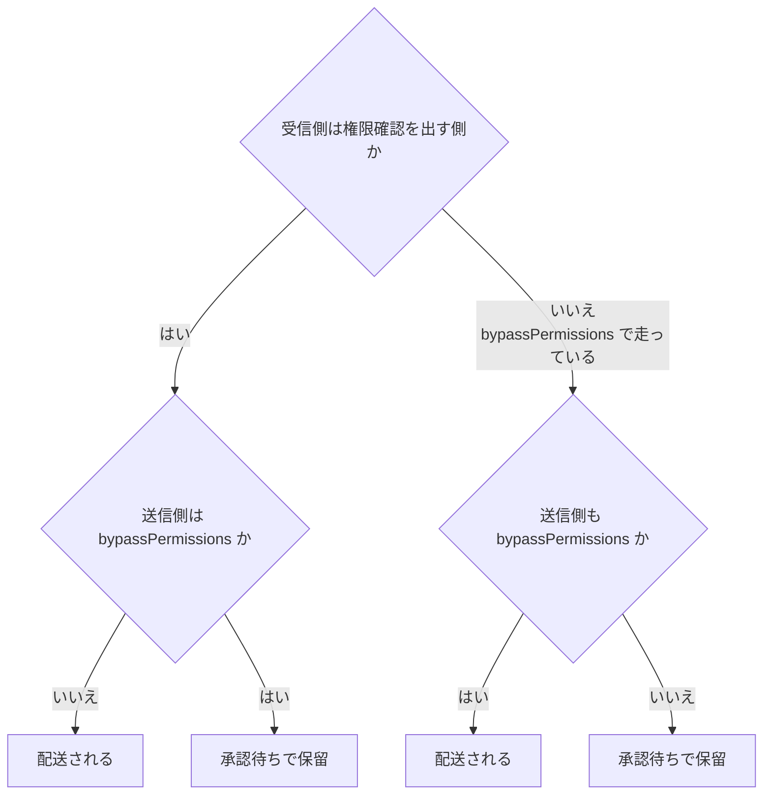
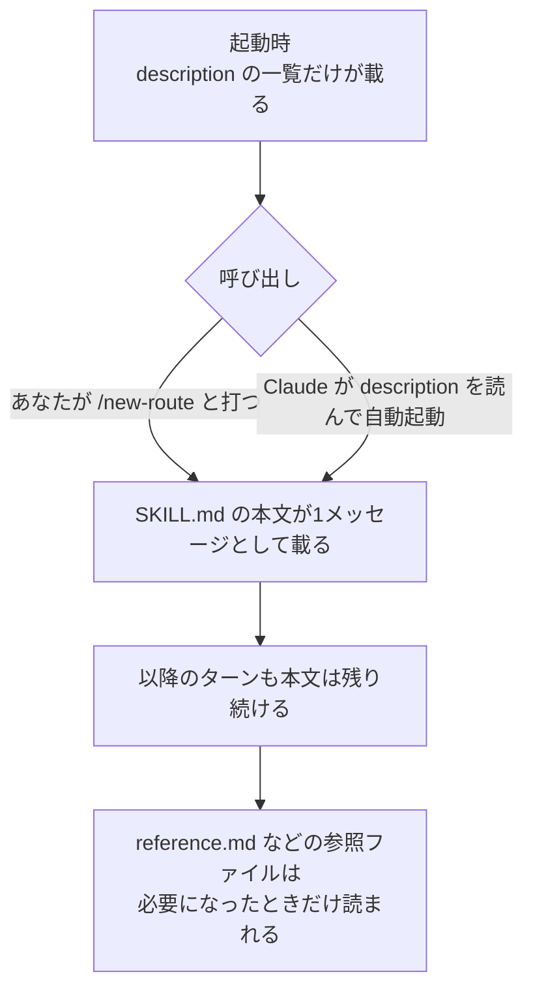

# Claude Daily — 2026-09-07（第016号）

## きょうの3行

並列で走らせたセッションは、起動時に名前を付けておくと互いに呼び合えます。「終わったら知らせて」と頼めるので、ターミナルを見に行く必要がなくなります。

深掘り連載は第10回、Skills です。SKILL.md の本文は呼ばれるまでコンテキストに載らない — この一点が CLAUDE.md との決定的な違いです。

Claude Code は v2.1.263 が出ましたが中身はバグ修正のみ。Platform リリースノートと anthropic.com/news は 9/1 から新しい発表がありません。

## ① ベストプラクティス — セッションに名前を付けてから並列で走らせる

worktree を分けて2つ3つとセッションを走らせると、状況を知るためにターミナルを行き来することになります。片方が API のレスポンス型を変えても、もう片方はビルドが落ちるまで気づきません。人間が伝書鳩になっている状態です。

Claude Code にはセッション間メッセージングが入っていて、**macOS / Linux / WSL 2 では v2.1.224 以降、native Windows では v2.1.234 以降なら有効化の操作なしで使えます**。Claude が `ListAgents` で宛先を探し、`SendMessage` で送る。あなたがこの2つのツールを直接呼ぶことはありません。

渡るのはテキストだけです。送信側の会話履歴もファイルも渡りません。ここを誤解すると「向こうのセッションに文脈を引き継がせる」用途で使ってしまい、期待した情報が届きません。文脈ごと移したいときはメッセージではなくセッションの再開（`claude --resume <name>`）を使います。



図1: メッセージが相手のセッションに届くまで。同じマシン上の配送は Anthropic のサーバを経由せず、セッションごとのソケット（native Windows では名前付きパイプ）を通ります。

### 型：名前を決めて起動し、受信の方針を設定に書いておく

セッション名は `--name`（短縮形 `-n`）で起動時に付けるか、走らせたあとに `/rename` で付けます。名前があると、もう一方のセッションで `@` に続けて頭文字を打てば typeahead から指名できます。名前を付けずに起動すると自動生成名になり、`@` で呼び出すたびに何という名前だったかを確認する羽目になります。

```bash
# UI 側と API 側を別々の worktree で、名前を付けて起動する
claude -n ui
claude -n api
```

受信の方針はリポジトリに置いた設定で決めます。次の内容をそのまま `.claude/settings.json` として置けます。

```json
{
  "crossSessionInbound": "accept",
  "isolatePeerMachines": true
}
```

`crossSessionInbound` は届いたメッセージの扱いで、`accept`（配送）/ `hold`（保留して通知だけ出す）/ `refuse`（破棄）の3つ。`isolatePeerMachines` を `true` にすると、このマシンの外にあるセッション宛のメッセージは送る前に必ずあなたの承認を求めます。同じマシン内のやりとりでは確認は出ません。どのスコープからでも `true` が効き、逆に `false` で打ち消すことはできない設計なので、チームで共有するリポジトリに書いておくと安全側に倒せます。

これで、待つ代わりに頼めるようになります。

```text
マイグレーションを走らせているセッションが終わったら教えて
```

Claude は `SendMessage` の `notify_when_idle` で購読し、相手のセッションが次に手が空いたときに一度だけ通知を返します。相手のセッションでターンは起きず、トークンも使いません。12時間で購読は自動的に切れます。

### やりがちな失敗：`--dangerously-skip-permissions` のワーカーに送って、届いたつもりになる

長時間タスクを `claude -p` のワーカーとして権限確認なしで走らせ、そこへ進捗を尋ねるメッセージを送る。よくやる構成ですが、**`crossSessionInbound` を明示していないと既定では保留されます。** 既定の判定は「送信側と受信側の権限クラスが揃っているか」で決まるからです。



図2: `crossSessionInbound` に値が効いていないときの既定判定。auto・acceptEdits・dontAsk はいずれも「確認を出す側」に数えられます。

そして `-p` のセッションは承認ダイアログを出せません。保留されたメッセージは `dialogExpiry` の期限（既定5分）を過ぎると破棄され、送信側には期限切れとして返ります。直し方は、ワーカー側の起動でだけ受信を許可することです。`--settings` は設定ファイルのパスに加えてインライン JSON も受け付けます。

```bash
claude -n migration -p "prisma のマイグレーションを本番相当のダンプに対して流し、失敗したらロールバックして原因を報告して" \
  --settings '{"crossSessionInbound":"accept","dialogExpiry":"never"}'
```

ユーザー設定に `accept` を書いても通りますが、それはあなたが動かす全セッションに効いてしまいます。ワーカーの起動行に閉じ込めるほうが影響範囲を読み切れます。

出典: [Message your other Claude Code sessions](https://code.claude.com/docs/en/cross-session-messaging) / [CLI reference](https://code.claude.com/docs/en/cli-reference)

## ② 深掘り連載 第10回 — Skills：繰り返す作業を手順として固定する

同じ指示を3回貼ったら、それは手順です。手順を CLAUDE.md に書くと、その手順を使わない日も含めて毎回全文がコンテキストに載ります。Skills はここを分けるための仕組みで、**常駐するのは `description` だけ、本文は呼ばれたときに初めて載ります**。



図3: スキルの段階的な読み込み。長い参照資料を抱えたスキルでも、使わない日のコストはほぼゼロです。

### 置き場所とコマンド名

| 置き場所 | パス | 効く範囲 |
|---|---|---|
| 個人 | `~/.claude/skills/<name>/SKILL.md` | 自分の全プロジェクト |
| プロジェクト | `.claude/skills/<name>/SKILL.md` | そのリポジトリ（git で共有できる） |
| プラグイン | `<plugin>/skills/<name>/SKILL.md` | プラグインを有効にした場所 |

打つコマンド名になるのは**ディレクトリ名**です。フロントマターの `name` は一覧に出る表示名にすぎません（プラグインスキルだけは `name` がコマンドの末尾になります）。`.claude/skills/new-route/` を作れば `/new-route` で呼べます。

### 具体的な使い方

Next.js の API ルート追加を手順として固定してみます。次の内容をそのまま `.claude/skills/new-route/SKILL.md` として置けます。

```markdown
---
name: new-route
description: Next.js App Router に API ルートを1本追加する。route.ts・zod スキーマ・テストの3点セットを既存の規約どおりに作る。エンドポイント追加、ルート追加のときに使う。
argument-hint: [route-name]
arguments: [route]
allowed-tools: Read Grep Glob Edit Write Bash(npm run test:*)
paths: src/app/api/**
---

# API ルートを1本追加する

対象: `src/app/api/$route/route.ts`

既存のルート一覧: !`ls src/app/api`

## 手順

1. `src/app/api/health/route.ts` を読み、エラー整形とレスポンス型の規約を確認する。
2. `src/app/api/$route/route.ts` を作る。必要な HTTP メソッドだけをエクスポートする。
3. リクエストボディの検証は zod で行い、スキーマは同じディレクトリの `schema.ts` に置く。
4. `src/app/api/$route/route.test.ts` に、正常系1件と検証エラー1件を書く。
5. `npm run test:unit -- src/app/api/$route` を実行し、通るまで直す。

## やらないこと

- 既存ルートの変更（別タスクとして切る）
- `middleware.ts` への追記
```

`/new-route reservations` と打つと `$route` が `reservations` に置き換わります。`arguments` に並べた名前が位置引数に順番で対応する仕組みです。`allowed-tools` に書いたツールはこのスキルを呼んだターンのあいだだけ確認なしで通り、あなたが次のメッセージを送ると権限は戻ります。`paths` は自動起動の範囲を絞るもので、`src/app/api/**` のファイルを扱っているときにだけ Claude が自分でこのスキルを選びます。

### description の書き方が効き目を決める

Claude がスキルを自動で選ぶ材料は `description` だけです。しかも**一覧上では 1,536 文字で切り詰められます**。使う場面を表す語を前半に置いてください。「API ルート追加のときに使う」を末尾に書くと、切り詰められて消えることがあります。

スキルの一覧全体にも予算があり、超えると使用頻度の低いものから説明文が落とされます。予算はモデルのコンテキスト長の 1% が既定で、`skillListingBudgetFraction` で割合を、`skillListingMaxDescChars` で1件あたりの上限を変えられます。

### 使うべき時 / 使うべきでない時

| 書く先 | 向くもの |
|---|---|
| CLAUDE.md | 常に効いてほしい事実・規約（毎回載る） |
| Skill | 手順・チェックリスト・長い参照資料（呼ばれたときだけ載る） |
| Hook | 例外なく必ず実行させたい処理（Claude の判断を挟まない） |

CLAUDE.md の一節が「事実」ではなく「手順」に育っていたら、それはスキルに切り出す合図です。逆に、副作用のある手順（デプロイ、コミット、外部への送信）を Claude に自動で選ばせたくないときは `disable-model-invocation: true` を付けて、自分で打つときだけ動くようにします。

SKILL.md 本文は 500 行以内に収め、詳細は同じディレクトリの `reference.md` などに逃がして本文からリンクします。参照ファイルは自動では読まれないので、必要になったときだけコストが発生します。

出典: [Extend Claude with skills](https://code.claude.com/docs/en/skills)

## ③ すぐ効くTIPS

**1. `/list-agents`（別名 `/peers`）で「自分の宛名」を先に確認する**

出力の1行目は、他のセッションがこのセッションを呼ぶときの名前です。ここを見ずに送ると、自動生成名や同名衝突で変形された名前を宛先にしてしまい届きません。`/status` の `Peer address` 行で受信箱が用意できているかも確認できます。

```text
/list-agents
```

**2. 持ち込んだスキルはシェル実行を止めてから読む**

SKILL.md には `` !`コマンド` `` でシェルの出力を差し込む記法があり、これは Claude が本文を読む前に実行されます。外部から持ち込んだスキルを監査せずに置くと、`/skills` の一覧を出しただけでは気づけません。次の設定で置き換え表示に変わります。

```json
{
  "disableSkillShellExecution": true
}
```

**3. 呼びすぎたスキルはコンパクションで落ちる**

自動コンパクションのあと、呼び出し済みのスキルは要約の後ろに再添付されますが、**各スキルの先頭 5,000 トークンまで、合計 25,000 トークンまで**です。新しく呼んだものから枠を埋めるので、1セッションで多く呼ぶと古いスキルは丸ごと消えます。長いセッションで序盤のスキルを効かせ続けたいなら、要約後にもう一度呼び直してください。

## ④ 事例

**スキルを「書いて終わり」にせず、セッションのログから育てる**

Pana 氏は、`SessionEnd` フックでスキルが発動したセッション ID をキューに貯め、headless の Claude にトランスクリプトを解析させて「エラーになった箇所」と「曖昧だった指示」を抽出し、`/skill-fix` スキルで SKILL.md への改善案を作らせる、という3段のループを組んだと報告しています。チームへ広げるときは、蒸留を個人のマシンで完結させて生ログを共有しない、改善は直接編集ではなく PR にする、週1回の定期ジョブで集めるが承認は人間に残す、という設計にしたとのことです。`review-reminder` スキルでは出力の形式を SKILL.md に明記したことで、毎回モデルが即興で足していた見出しのばらつきが消えたと書かれています（二次情報）。

出典: [チーム運用/展開を見据えた Claude Code のスキル運用（個人編）](https://zenn.dev/kkkxxx/articles/cd55956dffa373)

**PwC — 数十万人規模への展開と、測られている効果**

PwC は Claude の展開を数十万人規模の専門職へ広げ、米国では3万人にトレーニングと認定を行うと発表しています。Advisory Leadership Exchange では5,000人以上のリーダーが実地研修を受けたとされます。顧客側の成果としては、保険の引受業務が10週間から10日に、サイバーセキュリティのインシデント対応が数時間から数分に、人事変革のアプリケーションが1週間でプロトタイプ・2か月未満で本番稼働し日次数千トランザクションを処理している、といった例が挙げられています。全体では最大70%の提供速度改善が報告されています。

出典: [PwC is deploying Claude to build technology, execute deals, and reinvent enterprise functions for clients](https://www.anthropic.com/news/pwc-expanded-partnership)

## ⑤ 速報 — 新機能・変更点

前回チェック（v2.1.261）以降の差分は1件だけです。

| いつ | 何が | どう効くか |
|---|---|---|
| v2.1.263 | バグ修正と信頼性の改善のみ | CHANGELOG に個別項目の記載はありません。挙動の変わる新機能・新設定はなし |

Platform のリリースノートと anthropic.com/news は 9/1 の Claude Fable 5.1 / Mythos 5.1 発表から新規がありません。本日は特筆すべき発表はありませんでした。なお v2.1.262 は CHANGELOG に項目がなく、v2.1.261 の次が v2.1.263 です。

出典: [Claude Code CHANGELOG](https://github.com/anthropics/claude-code/blob/main/CHANGELOG.md)

## ⑥ コマンド早見

| コマンド | 何をするか |
|---|---|
| `claude -n ui` | セッションに名前を付けて起動する |
| `/rename` | 走っているセッションの名前を変える |
| `/list-agents` | 自分の宛名と、呼べる相手の一覧を出す（`/peers` でも同じ） |
| `/status` | 受信箱のアドレスなど、このセッションの状態を出す |
| `claude --resume ui` | 名前を指定してセッションを再開する |
| `/skills` | 使えるスキルの一覧を出す |
| `/skill-doctor` | 使われていないスキルとコンテキスト費用を出す |
| `claude plugin validate .claude/skills` | SKILL.md の YAML を検証する |

## ⑦ きょうの課題

**2つのセッションを名前で呼び合わせる（所要 10分）**

前提: Claude Code v2.1.224 以降（native Windows は v2.1.234 以降）。Next.js のリポジトリを1つ用意してください。

1. ターミナルを2枚開き、同じリポジトリでそれぞれ `claude -n ui` と `claude -n api` を起動する。
2. `api` 側で `/list-agents` を実行し、1行目に出る自分の名前と、`ui` が一覧に出ていることを確認する。
3. `ui` 側で次のように打つ。`@api` は typeahead から選ぶ。

```text
@api に、いま src/app/api の型定義を触っていると伝えて
```

4. `api` 側の画面に届いたか確認する。プレビュー1行しか出ないので、`Ctrl+O` で全文を開く。
5. `ui` 側で「`api` のセッションが手を空けたら教えて」と頼み、`api` 側で何か短いタスクを走らせて、終了後に通知が返るか確認する。

── 模範解答 ──

3 のメッセージは、`ui` 側の Claude が `ListAgents` で `api` を見つけ、`SendMessage` で送ります。あなたが打つのは日本語の依頼だけで、実際の本文は Claude が書きます。届く内容が毎回少しずつ違うのは仕様です。

4 で全文を見るのに `Ctrl+O` が要るのは、v2.1.247 以降は到着したメッセージが1行のプレビューとして表示されるようになったからです。プレビューが省略しているのは表示だけで、Claude は常に全文を読んでいます。`--verbose` で起動したセッションでは最初から全文が出ます。

5 の通知は、`SendMessage` の `notify_when_idle` による一度きりの購読です。相手のセッションでターンは起きず、トークンも消費しません。相手がすでに手を空けていれば即座に返ります。

よくある詰まりどころは3つです。**同じマシンでもコンテナの内と外は届きません**（セッションの登録ファイルが別のファイルシステムにあるため）。WSL 2 の中と native Windows のセッションも同じ理由で互いに見えません。次に、片方を `--dangerously-skip-permissions` で起動していると、既定では相手のメッセージが承認待ちで保留されます（図2）。最後に、`/list-agents` 自体が認識されない場合は、`claude --version` でバージョン要件を満たしているかを先に見てください。

あすは「第11回 Hooks — 『毎回必ずやること』を仕組みで担保する」を扱います。
