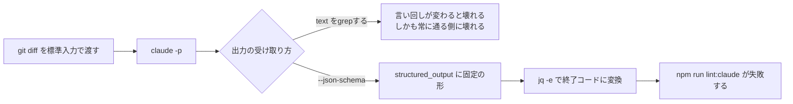
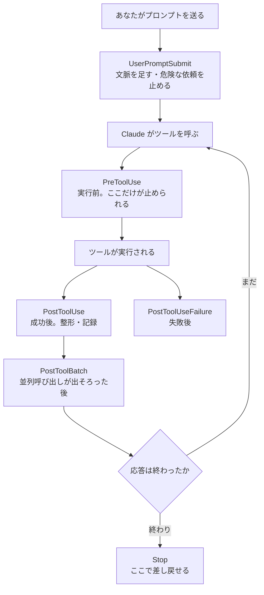
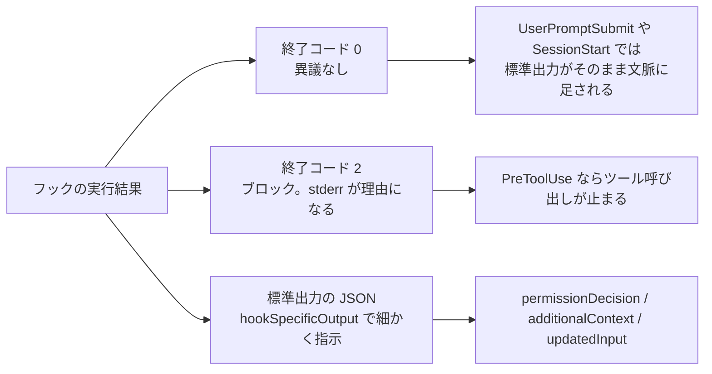

# Claude Daily — 2026-09-08（第017号）

## きょうの3行

Claude に「判定」をさせるなら、結果は文章ではなく JSON で受け取ります。`--json-schema` で形を固定し、`jq` で終了コードに変えると、そのまま `npm run` のゲートになります。

CI で `claude -p` を回すときは `--bare` を付けます。付けないと、そのリポジトリの `.claude/settings.json` のフックと `.mcp.json` のサーバーが、信頼していないフォルダでも動きます。

深掘り連載は第11回、Hooks です。イベントは30種類以上、ハンドラーの型は5種類。「毎回必ず」を仕組みにするための地図を1枚にまとめます。

## ① ベストプラクティス — 判定は JSON で返させる（`claude -p` を検査コマンドにする）

Claude にレビューやチェックをさせて、その結果でビルドを止めたい。ここまでは誰でも思いつきます。壊れるのはその次で、`claude -p "この差分に問題があれば教えて"` の出力を `grep -q "問題ありません"` で判定してしまうところです。Claude の言い回しは毎回違うので、この判定は静かに壊れます。しかも壊れ方が「常に通る」側なので、気づくのは事故のあとです。

解決策は単純で、**判定させるときは文章を読ませず、スキーマを渡して構造化データで返させる**ことです。`--output-format json` に `--json-schema` を足すと、結果は `structured_output` フィールドにスキーマ通りの JSON で入ります。あとは `jq` で配列の長さを見れば、シェルの終了コードになります。



図1: 判定を機械に返させる流れ。分岐の上側が今日のアンチパターン、下側が今日の型です。

### そのまま置けるゲート

Next.js のリポジトリのルートに、次の2ファイルを置きます。まず `scripts/claude-gate.sh`。

```bash
#!/usr/bin/env bash
# scripts/claude-gate.sh — 出してはいけない変更が差分に混ざっていないか機械に判定させる
set -euo pipefail

SCHEMA='{
  "type": "object",
  "properties": {
    "blocking": {
      "type": "array",
      "items": {
        "type": "object",
        "properties": {
          "file": { "type": "string" },
          "line": { "type": "integer" },
          "issue": { "type": "string" }
        },
        "required": ["file", "line", "issue"]
      }
    }
  },
  "required": ["blocking"]
}'

DIFF="$(git diff --merge-base origin/main)"
if [ -z "$DIFF" ]; then
  echo "origin/main との差分がありません"
  exit 0
fi

RESPONSE="$(printf '%s' "$DIFF" | claude -p \
  'You are a release gate. The diff is on stdin. Report only changes that must not ship: hardcoded secrets, skipped or disabled tests, and console.log left in application code. Report nothing else.' \
  --model sonnet \
  --output-format json \
  --json-schema "$SCHEMA" \
  --permission-mode dontAsk \
  --max-turns 3 \
  --max-budget-usd 0.50 \
  --no-session-persistence)"

echo "$RESPONSE" | jq -r '.structured_output.blocking[] | "\(.file):\(.line) \(.issue)"'
echo "$RESPONSE" | jq -e '.structured_output.blocking | length == 0' > /dev/null
```

`chmod +x` は不要です（`bash` 経由で起動します）。次に `package.json`。既存のファイルには `scripts` の1行を足すだけです。

```json
{
  "name": "my-next-app",
  "private": true,
  "scripts": {
    "dev": "next dev",
    "build": "next build",
    "lint:claude": "bash scripts/claude-gate.sh"
  }
}
```

`npm run lint:claude` で走ります。差分を標準入力で渡しているので、Claude に `git diff` を実行する権限は要りません。`--permission-mode dontAsk` は、`permissions.allow` と読み取り専用コマンド以外をすべて拒否するモードで、答える人がいない実行に向いています。`--max-turns` と `--max-budget-usd` は上限で、後者はサブエージェントの消費も合算されます。最後の `jq -e` は判定が偽のとき終了コード1で終わるので、`set -e` と組み合わせるとスクリプト全体が落ちます。

### CI に置くときは `--bare` を足す

上のスクリプトは手元で試す形です。CI に置くときは `claude -p` を `claude --bare -p` に変えてください。`--bare` はフック・スキル・カスタムコマンド・サブエージェント・プラグイン・MCP サーバー・自動メモリ・CLAUDE.md の自動探索をすべて飛ばすモードで、どのマシンで走らせても同じ結果になります。

ひとつだけ引き換えがあります。`--bare` では OAuth の認証情報もキーチェーンも読まないので、サブスクリプションのログインは使われません。`ANTHROPIC_API_KEY` を環境変数に用意してください。手元で気軽に試したいだけなら `--bare` は付けないほうが早いです。

### アンチパターン：`--bare` なしで CI に置く

```bash
# 壊れる側
git diff main | claude -p "レビューして" | grep -q "問題なし" && echo OK
```

この1行には2つの問題が同居しています。ひとつは前述の文字列判定。もうひとつが `--bare` の欠落です。ドキュメントは明記しています — `--bare` なしの `-p` セッションは、**信頼したことのないフォルダであっても**、そのプロジェクトの `.claude/settings.json` のフックを実行し、`.mcp.json` のサーバーに接続します。`-p` 実行ではワークスペースの信頼ダイアログもサーバーごとの承認プロンプトも出ません。フォークされた PR の内容をチェックさせるつもりが、そのブランチが持ち込んだフックを走らせることになります。

なぜこうなるかというと、`-p` は「人が見ていない実行」なのに、既定では対話セッションと同じ量の周辺設定を読み込む設計だからです。読み込みを止める意思表示が `--bare` です。ドキュメントには「`--bare` はスクリプトと SDK 呼び出しで推奨のモードで、将来的に `-p` の既定になる」とあります。先に付けておいて損はありません。

出典: [Run Claude Code programmatically](https://code.claude.com/docs/en/headless) / [CLI reference](https://code.claude.com/docs/en/cli-reference)

## ② 深掘り連載 第11回 — Hooks：「毎回必ず」を仕組みで担保する

CLAUDE.md に「編集したら prettier をかけて」と書いても、かかる日とかからない日があります。CLAUDE.md はユーザーメッセージとして渡される助言だからです（第2回）。フックはシェルコマンドで、Claude の判断を経由しません。**「毎回必ず」と書きたくなったら、それはフックの仕事です。**

### まず、1ターンのどこで何が発火するか

イベントは30種類以上ありますが、日常的に使うのは1ターンの中に並ぶ数個です。



図2: 1ターンの中でのフックの位置。取り消せるのは `PreToolUse` だけです。`PostToolUse` はツールがすでに走った後なので、検出はできても取り消しはできません。

このほか、セッションの境目（`SessionStart` / `SessionEnd` / `PreCompact` / `PostCompact`）、サブエージェント（`SubagentStart` / `SubagentStop`）、環境の変化（`CwdChanged` / `FileChanged` / `ConfigChange` / `DirectoryAdded`）といった系列があります。「いつ走ってほしいか」から探すと目的のイベントに行き当たります。

### ハンドラーは5種類ある

`type` にはシェル以外も指定できます。ここが2026年のフックで一番変わったところです。

| type | 何をするか | 既定のタイムアウト | 向いている用途 |
|---|---|---|---|
| `command` | シェルコマンドを実行する | 10分 | 整形・lint・ログ・パターン判定 |
| `http` | イベント JSON を URL に POST する | 10分 | チーム共通の監査サーバーに送る |
| `mcp_tool` | 接続済み MCP サーバーのツールを呼ぶ | 10分 | 既存の社内ツールに繋ぐ |
| `prompt` | 入力データだけで Claude に1回判定させる | 30秒 | 規約違反かどうかなど判断が要る条件 |
| `agent` | サブエージェントがツールを使って検証する | 60秒 | 実際にテストを走らせて確かめる（実験的） |

`prompt` と `agent` は「判断が要るのでフックにできない」と諦めていた条件を拾えます。返す JSON は `{"ok": true}` か `{"ok": false, "reason": "..."}` の2択です。`agent` フックは実験的な機能で、本番のワークフローには `command` を推奨する、とドキュメントに明記があります。

### 出力の3経路

フックが Claude Code に結果を伝える経路は3つです。ここを取り違えると「動いているのに効かない」状態になります。



図3: 3つの経路。終了コード1は「ブロックしないエラー」で、処理はそのまま進みます。止めたいのに `exit 1` を書いてしまうのが最も多い取り違えです。

### そのまま置ける設定

Next.js のリポジトリの `.claude/settings.json` です。整形・保護・完了判定の3つを入れてあります。

```json
{
  "hooks": {
    "PostToolUse": [
      {
        "matcher": "Edit|Write",
        "hooks": [
          {
            "type": "command",
            "command": "jq -r '.tool_input.file_path' | xargs npx prettier --write"
          }
        ]
      }
    ],
    "PreToolUse": [
      {
        "matcher": "Edit|Write",
        "hooks": [
          {
            "type": "command",
            "command": "\"$CLAUDE_PROJECT_DIR\"/.claude/hooks/protect-files.sh"
          }
        ]
      }
    ],
    "Stop": [
      {
        "hooks": [
          {
            "type": "prompt",
            "prompt": "Check whether every task the user asked for is finished. If something remains, respond with {\"ok\": false, \"reason\": \"what remains\"}. Otherwise respond with {\"ok\": true}."
          }
        ]
      }
    ]
  }
}
```

保護スクリプトは `.claude/hooks/protect-files.sh` に置き、`chmod +x` します。

```bash
#!/bin/bash
# .claude/hooks/protect-files.sh
INPUT=$(cat)
FILE_PATH=$(echo "$INPUT" | jq -r '.tool_input.file_path // empty')
FILE_PATH="${FILE_PATH//\\//}"

PROTECTED_PATTERNS=(".env" "package-lock.json" ".git/")

for pattern in "${PROTECTED_PATTERNS[@]}"; do
  if [[ "$FILE_PATH" == *"$pattern"* ]]; then
    echo "Blocked: $FILE_PATH matches protected pattern '$pattern'" >&2
    exit 2
  fi
done

exit 0
```

登録できたかは `/hooks` で確認します。このメニューは読み取り専用で、追加や変更は設定ファイルを直接編集します。

### 権限モードとの関係 — 締める方向にしか効かない

`PreToolUse` フックは**すべての権限モードで、権限判定より前に**発火します。`permissionDecision: "deny"` を返せば `bypassPermissions` でも `--dangerously-skip-permissions` でも止まります。ユーザーがモードを変えて回避できないポリシーを書ける、ということです。

逆は成り立ちません。フックが `allow` を返しても、設定の deny ルールは覆せません。**フックは締める方向にしか効かない**、と覚えておくと設計を間違えません。

### 使うべき時／使うべきでない時

| 状況 | 使うもの |
|---|---|
| 例外なく毎回起きてほしい（整形・保護・記録） | `command` フック |
| 判断が要るが、入力データだけで決まる | `prompt` フック |
| 実際にテストやビルドを走らせて確かめたい | `agent` フック、または `command` でスクリプトを呼ぶ |
| ときどき必要なだけの手順 | Skill（第10回） |
| 助言として伝わればよい | CLAUDE.md（第2回） |

使うべきでない場面もはっきりしています。`PostToolUse` で取り消しをしようとしないこと（すでに実行済みです）。複数の `PreToolUse` フックで同じツールの `updatedInput` を書き換えないこと（フックは並列に走り、最後に終わったものが勝つため順序が非決定的です）。`SessionEnd` に重い処理を置かないこと（全フック合計で1.5秒の予算しかありません）。

### 詰まったときの見どころ

フックの JSON が無視される、という現象には有名な原因があります。シェルフォームのフックは非対話シェルで起動されますが、`~/.bashrc` などに無条件の `echo` があると、その出力が JSON の前に混ざります。先頭が `{` でなくなるため、Claude Code は出力全体をただのテキストとして扱い、終了コード0のときは何も報告しません。プロファイルの `echo` は `if [[ $- == *i* ]]; then ... fi` で対話シェルに限定してください。

実行の詳細を見るには `claude --debug-file /tmp/claude.log` で起動し、別の端末で `tail -f /tmp/claude.log` を開きます。スクリプト単体の確認は標準入力に JSON を流すだけです。

出典: [Hooks reference](https://code.claude.com/docs/en/hooks) / [Automate actions with hooks](https://code.claude.com/docs/en/hooks-guide)

## ③ すぐ効くTIPS

**1. `-p` 実行のバックグラウンド待ちは連続10分で打ち切られる**

`claude -p` がバックグラウンドのサブエージェントやワークフローを起動した場合、その結果は最終出力の一部なので、Claude Code は完了まで待ちます。ただし待ち続けて CI が固まらないよう、連続10分のアイドルで打ち切り、走っているものを止めて部分結果を捨てます。長い解析を回すなら上限を上げます。

```bash
CLAUDE_CODE_PRINT_BG_WAIT_CEILING_MS=1800000 claude -p "リポジトリ全体を調査して" --output-format json
```

`0` を渡すと上限なしで待ちます。CI で使うときは、ジョブ側のタイムアウトを必ず併用してください。

**2. `session_id` を控えておくと、あとから別ディレクトリでも再開できる**

`--output-format json` のレスポンスには `session_id` が入っています。控えておけば、同じマシン上のどのプロジェクトからでもそのセッションを名指しで再開できます（v2.1.223 以降。それ以前は同じディレクトリからしか探せませんでした）。自動実行の結果に後から質問したいときに効きます。

```bash
session_id=$(claude -p "この PR の変更点を要約して" --output-format json | jq -r '.session_id')
claude -p "いま挙げた点のうち、テストが無いものはどれ" --resume "$session_id"
```

**3. `system/init` を見て「読み込めていない」を CI で落とす**

プラグインや MCP サーバーの読み込みに失敗しても、`-p` の実行はそのまま続いて正常終了します。気づかないまま「そのツールを使わない前提の答え」を受け取ることになります。ストリームの最初に出る `system/init` イベントには `plugin_errors` と `mcp_server_errors` が入り、エラーが無いときはキー自体が省かれます。配列が空でないときにジョブを落とせば検知できます（`mcp_server_errors` は v2.1.219 以降）。

```bash
claude -p "ping" --output-format stream-json --verbose | jq -e 'select(.type=="system" and .subtype=="init") | (.mcp_server_errors // []) | length == 0'
```

## ④ 事例

### Anthropic による約40万セッションの分析 — 効いているのはコーディング力ではなくドメイン知識

Anthropic は 2025年10月から2026年4月にかけての約23万5,000ユーザー・約40万セッションを、プライバシーを保った形で分析し、2026年6月16日に公開しています。熟練者と初心者で何が違うかを実測した内容です。

数字がはっきりしています。1プロンプトあたり、初心者のセッションでは Claude の動作が約5回・出力600語なのに対し、熟練者では約12回・3,200語。検証できた成功率は初心者15%に対し中級者・熟練者は28〜33%。つまずいた後の復帰率は熟練者約15%、初心者4%。セッションを途中で放棄する割合は、初心者らしきセッションで約19%、それ以外は5〜7%です。

チーム展開の観点で効くのは次の2点です。ひとつは分業の実測値で、**「何を作るか」の判断の約70%は人間が、「どう作るか」の判断の約80%は Claude が下しています**。もうひとつは、コードを生成するセッションにおいて、主要な職種の成功率がソフトウェアエンジニアと7ポイント以内に収まっていること。研究側は「コーディングの素養が以前ほど関係しなくなっている」と表現しています。中級者と熟練者の差が小さいことも合わせると、**投資すべきは「全員をエキスパートにする研修」ではなく、ドメイン知識のある人が最初の壁を越えるところ**だと読めます。

出典: [How Claude Code is used in practice（Anthropic Research）](https://www.anthropic.com/research/claude-code-expertise)

### 無人実行でつまずく6パターン（二次情報）

CI・スケジュール実行で `claude -p` を回す際の失敗パターンを6つに整理した記事があります（2026年6月公開・9月7日更新）。挙げられているのは、① 誰も答えられない実行に対話プロンプトが出る、② 本番リポジトリに対して権限が広すぎる、③ シークレットがトランスクリプトや差分に漏れる、④ 終了コードの解釈を誤る、⑤ ターン上限もタイムアウトも無いまま走らせる、⑥ 人間向けの出力を壊れやすい方法でパースする、の6つ。同記事は `--max-turns` を「最も重要なコスト制御」と位置づけ、無人実行が成立する条件を「べき等・有界・検証可能」の3つだと述べています、という報告です。

①の型（`--json-schema` と `dontAsk`）は、この6つのうち①④⑥への対処にそのまま対応します。②③については、読み取り専用のツールだけを許可し、差分は標準入力で渡す形が有効です。

出典: [Claude Code in CI/CD and Headless Automation（hidekazu-konishi.com、二次情報）](https://hidekazu-konishi.com/entry/claude_code_cicd_and_headless_automation.html)

## ⑤ 速報 — 新機能・変更点

**本日は前回チェック（2026-09-07）以降の新しい発表はありませんでした。**

確認した範囲は次のとおりです。Claude Code の CHANGELOG は v2.1.263 が最新のままで、新しいバージョンの追加はありません。Platform のリリースノートは 9月3日の `ant` CLI v1.30.0 が最新、anthropic.com/news も 9月1日の Claude Fable 5.1 / Mythos 5.1 が最新で、いずれも既報です。anthropic.com/engineering も 4月23日の記事から更新がありません。

## ⑥ コマンド早見

| コマンド | 何をするか |
|---|---|
| `npm run lint:claude` | ①で作ったゲートを走らせる |
| `claude --bare -p "..." --output-format json --json-schema '...'` | 周辺設定を読まずに実行し、スキーマ通りの JSON で受け取る |
| `git diff --merge-base origin/main` | ゲートに渡す差分を作る |
| `jq -e '.structured_output.blocking \| length == 0'` | 判定結果を終了コードに変える |
| `claude -p "..." --output-format json \| jq -r '.session_id'` | 実行したセッションの ID を控える |
| `claude -p "..." --resume "$session_id"` | 控えた ID でそのセッションを再開する |
| `claude -p "ping" --output-format stream-json --verbose` | `system/init` を含むイベント列を得る |
| `/hooks` | 設定済みのフックをイベント別に確認する（読み取り専用） |
| `claude --debug-file /tmp/claude.log` | フックの実行詳細をログファイルに書き出す |
| `chmod +x .claude/hooks/protect-files.sh` | フックスクリプトに実行権限を付ける |

## ⑦ きょうの課題

差分を機械に判定させるゲートを1本作り、**わざと落として**から通します。10分ほどです。

前提: Next.js のリポジトリと `jq`（`brew install jq` / `apt-get install jq`）。`origin/main` から切ったブランチで作業していること。

1. ①の `scripts/claude-gate.sh` をそのまま置く。
2. `package.json` の `scripts` に `"lint:claude": "bash scripts/claude-gate.sh"` を足す。
3. 適当なコンポーネントに `console.log("debug")` を1行足してコミットせずに置く。
4. `npm run lint:claude` を実行する。指摘が1行表示され、終了コードが 1 になることを確認する（`echo $?`）。
5. `console.log` を消して再実行し、何も表示されず終了コードが 0 になることを確認する。
6. 余力があれば、`.structured_output` の代わりに `.total_cost_usd` を表示させて、1回いくらかかったか見る。

── 模範解答 ──

4 で表示されるのは `app/page.tsx:12 console.log left in application code` のような1行です。これはスクリプトの `jq -r` が `structured_output.blocking` の各要素を整形したもので、**Claude の文章ではありません**。だから表示の揺れがなく、そのまま人にもツールにも渡せます。

終了コードが 1 になる仕組みは最後の行です。`jq -e` は最後に出力した値が `false` か `null` のとき終了コード 1 で終わります。`set -euo pipefail` があるのでスクリプト全体がそこで落ち、`npm run` も失敗します。判定を JSON に寄せた見返りがここに出ます。

6 のコストは次の1行で見られます。

```bash
git diff --merge-base origin/main | claude -p "この差分を1行で要約して" --output-format json | jq -r '.total_cost_usd'
```

これはクライアント側の見積もりで、実際の請求と一致するとは限りません。桁を把握する用途に使ってください。

よくある詰まりどころは3つです。**`--json-schema` が無効なスキーマだと `Error: --json-schema is not a valid JSON Schema` で即座に終わります**。上のスクリプトの `SCHEMA` を書き換えたときは、まず `echo "$SCHEMA" | jq .` で JSON として妥当かを見てください。次に、`--bare` を付けて `ANTHROPIC_API_KEY` が無いと認証エラーになります。手元での確認では `--bare` を外してサブスクリプションのログインを使うのが早道です。最後に、差分が空だとスクリプトは何もせず 0 で終わります。ステージしていない変更も含めたいときは `git diff --merge-base origin/main` を `git diff HEAD` に変えてください。

あすは「第12回 スラッシュコマンド自作」を扱います。
