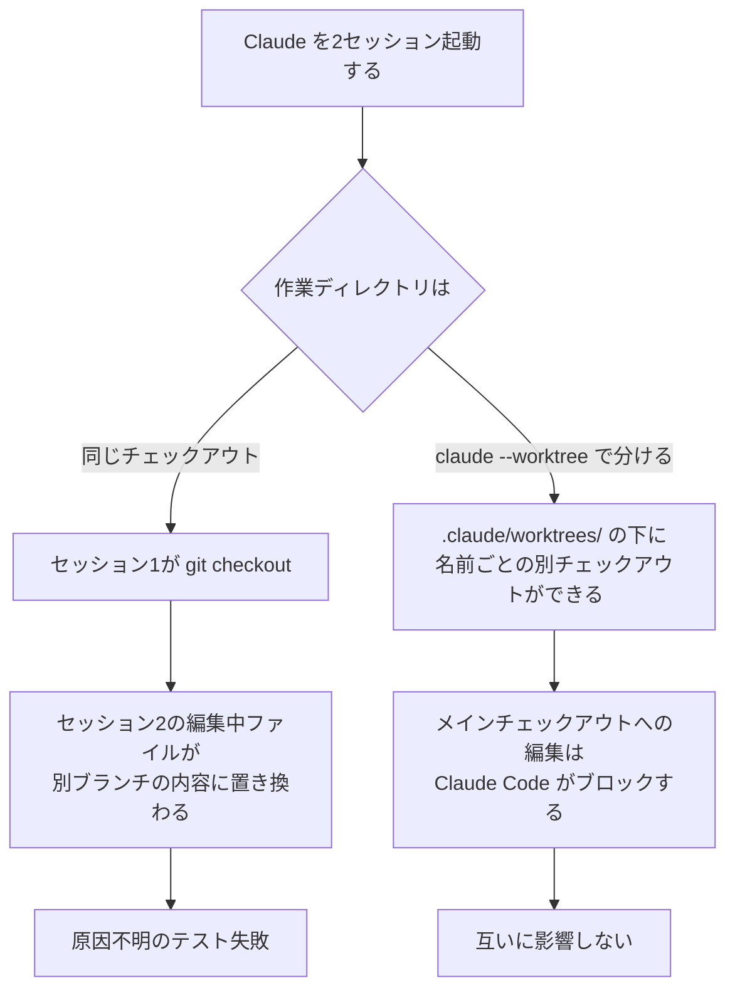
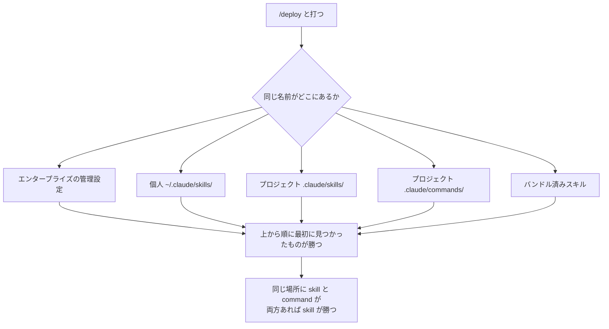
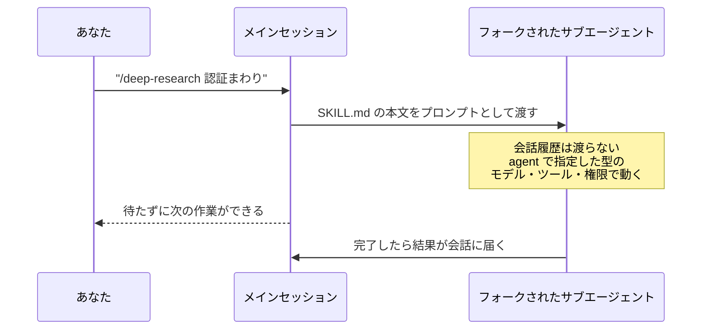

# Claude Daily — 2026-09-09（第018号）

## きょうの3行

Claude を2つ以上同時に走らせるなら、先に編集する場所を分けます。`claude --worktree <名前>` を使うと、セッションごとに別のチェックアウトが用意され、片方の `git checkout` がもう片方の作業を巻き戻す事故が起きなくなります。

CHANGELOG に v2.1.265 が入りました。`--plugin-dir` の追加のほか、サブエージェントやセッション再開でプロンプトキャッシュの再利用が壊れていた不具合が3件修正されています。

深掘り連載は第12回、スラッシュコマンド自作です。結論から言うと、カスタムコマンドは Skills に統合されました。`.claude/commands/` は今も動きますが、新しく書くなら SKILL.md です。

## ① ベストプラクティス — 編集する場所を分けてから並列で走らせる

Claude を2窓、3窓と開いて別々のタスクを任せると、ある時点で必ずこれが起きます。片方のセッションが `git checkout` や `git switch` をした瞬間、もう片方が編集中だったファイルが、別ブランチの内容に丸ごと書き換わる。ディレクトリは1つしかないので、ブランチを切り替えれば全員の足元が入れ替わります。Claude は自分が壊したことに気づかないまま作業を続け、あなたも気づくのはテストが不可解に落ちてからです。

解決策は、**セッションごとにチェックアウトを分ける**ことです。git worktree は、同じリポジトリの履歴とリモートを共有したまま、別ディレクトリ・別ブランチの作業場所を作る仕組みです。Claude Code はこれを起動オプションとして持っています。



図1: 同じチェックアウトを共有した場合と、worktree で分けた場合の分岐。事故は「気づけない」形で起きるので、起きてから対処するのではなく、最初から分けます。

### そのまま置ける3ファイルと2コマンド

まず、worktree の中身がメインチェックアウトで未追跡ファイルとして見えないように `.gitignore` に1行足します。

```text
# .gitignore
node_modules/
.next/
.claude/worktrees/
```

次に `.worktreeinclude` をリポジトリのルートに置きます。worktree は新しいチェックアウトなので、gitignore されている `.env.local` などは存在しません。このファイルに書いたパターンに一致し、**かつ gitignore されている**ファイルだけが、新しい worktree に自動でコピーされます。書式は `.gitignore` と同じです。

```text
# .worktreeinclude
.env
.env.local
```

そして `.claude/settings.json`。既定では worktree はリモートの既定ブランチ（多くは `main`）から切られます。手元の作業中のコミットを引き継ぎたいときだけ、`worktree.baseRef` を `"head"` にします。

```json
{
  "worktree": {
    "baseRef": "head"
  }
}
```

`baseRef` に取れる値は `"fresh"`（既定）と `"head"` の2つだけで、ブランチ名は書けません。特定のブランチから始めたいときは `git worktree add` で自分で作ります。

起動はこの1行です。`<名前>` は自分でつけるラベルで、`.claude/worktrees/<名前>/` に作られ、ブランチ名は `worktree-<名前>` になります。

```bash
claude --worktree feature-auth
```

レビュー用に、特定のプルリクエストのブランチを持ってくることもできます。`#` はシェルがコメント開始と解釈するので、必ずクォートで囲みます。

```bash
claude --worktree "#1234"
```

サブエージェントを分けたいときは、`.claude/agents/` の定義に `isolation: worktree` を1行足します。このエージェントは呼ばれるたびに自分専用の worktree で動きます。

```markdown
---
name: refactorer
description: 機械的なリファクタを複数ファイルにまとめて適用する
isolation: worktree
---

依頼されたリファクタを、影響する全ファイルに適用してください。
そのあとテストを実行し、結果を報告してください。
```

### 分けたあと、何がブロックされるのか

worktree に入ったセッションに対して、Claude Code は4つの検査をします。`Edit` / `Write` / `NotebookEdit` がメインチェックアウトのパスを指したら止める。Bash や Monitor のコマンドの作業ディレクトリがメインチェックアウトに解決されたら止める。`git -C` や `GIT_DIR` / `GIT_WORK_TREE`、あるいは事前の `cd` で git をメインチェックアウトに向け直そうとしたら止める。そして、コマンド文字列から「この git は worktree の中に留まる」と確認できない形（コマンド名が実行時に決まる、構文が解析できない）も止める。最後の1つは無効化できません。

このため、worktree で分けるという判断は「Claude に守ってもらう約束」ではなく、ツール呼び出しのレベルで強制されます。CLAUDE.md に「他のブランチに切り替えないでください」と書くのとは、確実性が違います。

### アンチパターン：worktree の中から `--resume` する

```bash
# 壊れる側
cd ../my-app-feature-a      # 自分で git worktree add した worktree
claude --resume
```

自分で `git worktree add` で作った worktree のサブディレクトリから起動したり、それ自体が独立したリポジトリになっている worktree から起動したりすると、Claude Code は `Refusing to use <path> as an isolation worktree` や `launch from the parent checkout` といったメッセージを出して、その worktree への再入を断ります。**そこから起動した場合、Claude Code にはその worktree がメインチェックアウトと本当に別物であることを保証する手立てがない**からです。断らずに入ってしまうと、`git reset --hard` のような普通のコマンドがメインチェックアウトに効いてしまう可能性があります。

再開はメインチェックアウトから行ってください。なお、Claude Code 自身が `.claude/worktrees/` に作った worktree は、その中から起動しても再入します。断られるのは「自分で作った worktree」のほうです。

もうひとつ、よくある取り違えがあります。`-p` を付けた非対話実行の worktree は掃除されません。対話セッションには終了時に「残すか消すか」の確認が出ますが、`-p` にはその確認がなく、作成時に取ったロックもそのまま残ります。手で消すときは `git worktree remove`、ロックで断られたら先に `git worktree unlock` です。

出典: [Run parallel sessions with worktrees](https://code.claude.com/docs/en/worktrees)

## ② 深掘り連載 第12回 — スラッシュコマンド自作

`/deploy` と打つだけで決まった手順が走る。これがスラッシュコマンドです。ただし2026年現在、この機能の実体を正しく言うとこうなります。**カスタムコマンドは Skills に統合されました。** `.claude/commands/deploy.md` というファイルと、`.claude/skills/deploy/SKILL.md` というディレクトリは、どちらも `/deploy` を作り、同じように動きます。

既存の `.claude/commands/` は今も動きます。ただし、この形式には `name` と `paths` のフロントマターが使えず、補助ファイルを同じディレクトリに置くこともできません。ドキュメントは「新しく書くものは skill にすること」を推奨しています。連載第10回では Skills を「知識と手順の置き場」として扱いましたが、今日は**コマンドとしての側面**、つまり名前の決まり方と引数の渡り方を見ます。

### 打った名前がどのファイルに解決されるか



図2: 同じ名前が複数の場所にあるときの解決順。エンタープライズ・個人・プロジェクトの順に強く、同じ場所なら skill がコマンドファイルに優先します。バンドル済みスキルは自分のスキルで上書きできます。

コマンド名そのものは、置き場所から決まります。

| 置き場所 | コマンド名の由来 | 例 |
|---|---|---|
| `.claude/skills/<名前>/SKILL.md` | ディレクトリ名 | `deploy-staging` → `/deploy-staging` |
| ネストした `.claude/skills/`（名前が衝突したとき） | 相対パス＋ディレクトリ名 | `apps/web/.claude/skills/deploy/` → `/apps/web:deploy` |
| `.claude/commands/<名前>.md` | 拡張子を除いたファイル名 | `deploy.md` → `/deploy` |
| プラグインの `skills/` 配下 | フロントマターの `name` かディレクトリ名、プラグイン名で名前空間化 | `/my-plugin:review` |

ここで注意すべきは、**個人・プロジェクトのスキルでは `name` を書いてもコマンド名は変わらない**ことです。`name` は一覧に出る表示名にすぎず、打つ名前はディレクトリ名です。`name` がコマンド名の最終セグメントを決めるのは、プラグインのスキルだけです。

### 引数はどう渡るか

スキル本文の中では、次の置換が使えます。ここが「コマンドとして使う」ときの中心です。

| 書き方 | 何に置き換わるか |
|---|---|
| `$ARGUMENTS` | 打った引数の全体。どのプレースホルダにも渡らなかった場合は `ARGUMENTS: <値>` として末尾に付く |
| `$ARGUMENTS[0]` / `$0` | 0始まりの位置指定。`$1` は2つめ |
| `$issue` | フロントマターの `arguments: [issue, branch]` で宣言した名前つき引数。宣言順に位置と対応する |
| `${CLAUDE_SESSION_ID}` | いまのセッションID。ログのファイル名に使える |
| `${CLAUDE_EFFORT}` | いまの effort（`low` 〜 `max`。ultracode は `xhigh` として報告される） |
| `${CLAUDE_SKILL_DIR}` | その SKILL.md があるディレクトリ |
| `${CLAUDE_PROJECT_DIR}` | プロジェクトのルート |

位置指定の引数はシェル式のクォートで区切られます。`/my-skill "hello world" second` なら `$0` は `hello world`、`$1` は `second` です。対応する引数が無い `$2` はそのまま文字として残り、名前つき引数のほうは空文字になります。この非対称は覚えておくと事故が減ります。

### そのまま置ける SKILL.md

Next.js のリポジトリで、変更のあったページのプレビュー確認手順を固定する例です。`.claude/skills/preview/SKILL.md` に置くと `/preview` で呼べます。

```markdown
---
description: 指定したパスの画面を開発サーバーで開き、変更前後を比較して差分を報告する
argument-hint: [パス] [比較するブランチ]
arguments: [route, base]
disable-model-invocation: true
allowed-tools: Bash(npm run dev:*), Bash(git diff:*)
---

## いまの差分

!`git diff --stat`

## 手順

1. `git diff $base -- app` で、$base ブランチからの変更点を確認する。
2. `npm run dev` を起動し、`http://localhost:3000$route` を開く。
3. スクリーンショットを撮り、変更が意図どおりか、崩れている箇所がないかを列挙する。
4. 崩れがあれば修正し、2 と 3 をやり直す。

セッションID ${CLAUDE_SESSION_ID} を、報告の先頭に書いてください。
```

`/preview /pricing main` のように呼びます。`disable-model-invocation: true` を付けているのは、副作用（開発サーバーの起動）があるので Claude に勝手に呼ばれたくないからです。逆に、Claude にだけ使わせて `/` メニューには出したくない背景知識なら `user-invocable: false` を使います。この2つは向きが逆で、混同しやすいところです。

### 別コンテキストで走らせる

`context: fork` を付けると、そのスキルはサブエージェントとして隔離されたコンテキストで動きます。会話履歴は渡らず、**SKILL.md の中身がそのままサブエージェントへのプロンプトになります**。



図3: `context: fork` の流れ。既定ではバックグラウンドで走るので、待たずに次の作業に移れます。同じターンの中で結果が欲しいときは `background: false` を書きます。

`agent` フィールドで実行環境を選べます。`Explore` を指定すると、読み取り専用のツール構成で、CLAUDE.md も git status も読み込まずに走ります（連載第9回）。省略時は `general-purpose` です。

ひとつ落とし穴があります。**バックグラウンドで走ったフォークの編集は、セッションのチェックポイントの外側で行われます。** `/rewind` では戻せないので、戻したいときは git を使ってください。

### 使うべき時／使うべきでない時

| 状況 | 使うもの |
|---|---|
| 手順が決まっていて、自分で打って起動したい | skill ＋ `disable-model-invocation: true` |
| Claude に状況を見て自動で使ってほしい | skill（`description` を丁寧に書く） |
| 既存の `.claude/commands/` がある | そのままでよい。書き換えるのは補助ファイルや `paths` が要るときだけ |
| メインの会話を汚さずに調査だけさせたい | skill ＋ `context: fork` ＋ `agent: Explore` |
| 例外なく毎回起きてほしい | Hooks（第11回）。スキルは呼ばれたときしか動かない |

出典: [Slash commands](https://code.claude.com/docs/en/slash-commands) / [Skills](https://code.claude.com/docs/en/skills)

## ③ すぐ効くTIPS

**1. `${CLAUDE_SKILL_DIR}` は本文と `allowed-tools` の両方で展開される**

スキルに同梱したスクリプトを、承認プロンプトなしで走らせるための書き方です。本文と `allowed-tools` の両方に同じ変数を書くと、双方が同じ絶対パスに展開されるので、許可ルールが実際に打たれるコマンドとぴったり一致します。インストール先がどこであっても効きます。

```yaml
---
name: render-chart
description: CSV からグラフを描画する
allowed-tools: Bash(${CLAUDE_SKILL_DIR}/scripts/render.sh *)
---

`${CLAUDE_SKILL_DIR}/scripts/render.sh <csv-file>` を実行してグラフを描画してください。
```

**2. スキル本文で金額を書くときはバックスラッシュでエスケープする**

`$1` や `$ARGUMENTS` は引数のプレースホルダなので、`$1.00` と書くと「1つめの引数 + `.00`」に化けます。直前にバックスラッシュを1つ置くと文字として残ります。

```markdown
基本料金は \$1.00 です。$0 の見積もりを作ってください。
```

二重のバックスラッシュ（`\\$1`）はエスケープになりません。両方のバックスラッシュが残ったうえで `$1` は展開されます。また、このエスケープが効くのは引数のプレースホルダだけで、`${CLAUDE_SKILL_DIR}` のような変数には効きません。

**3. `/skill-doctor` で、書いたスキルが呼ばれているかを確かめる**

スキルを増やすと、description が曖昧で一度も呼ばれていないものが溜まります。`/skill-doctor` は読み込み済みで未使用のスキルと、それが使っているコンテキスト量を出します（v2.1.261 以降）。作ったコマンドが自分でも忘れられているなら、消すか `disable-model-invocation: true` にして `/` メニュー専用にするのが妥当です。

```bash
/skill-doctor
```

## ④ 事例

### Pendo — 仮想デスクトップで全社に配り、社内スキルを同梱する

プロダクト分析の Pendo は、Claude Code を**仮想デスクトップ経由で全社に配布**し、財務や独自ツール向けの社内スキルパッケージを同梱した形で展開しています。エンジニアだけでなく、財務チームがデータの照会や取締役会向けメモの作成、ダッシュボード構築に使い、ピープルアナリティクスも日常業務で使っている、と紹介されています。社内共有用のウェブページやダッシュボードを従業員が自分で作る例も挙がっています。

配り方として見どころなのは2点です。ひとつは配布経路を仮想デスクトップに寄せたこと。端末ごとの環境構築を各人にやらせず、同じ環境をそのまま配れます。もうひとつは**社内スキルを最初から同梱した**こと。何もない Claude Code を配ると各自が使い道を探すところから始まりますが、財務や社内ツールのスキルが入っていれば、初日から自分の業務で試せます。連載第10回で見たとおり、スキルは常駐するのが description だけなので、使わない人のコンテキストを圧迫しません。配布物に入れておくコストが低いのです。

同社はこの並行で、ユーザーの利用パターンからユーザビリティの問題を検出して修正のプルリクエストまで作る製品「Novus」を Claude Managed Agents 上に構築しています。自前でエージェント基盤を3か月作ったあと Managed Agents に切り替え、移行は約3日だったと述べられています。PM がレビューした評価セットでの成功率は90%、エージェントが自律的に扱うツールは150以上とされています。

出典: [Pendo case study](https://claude.com/customers/pendo-qa)

### 並列セッションのブランチ切り替えを、フックで禁止した（二次情報）

①の型を、フックで補強した実例の報告があります。SIOS Technology の記事（2026年7月3日公開）は、まさに今日の冒頭で挙げた事故 — 並列で動かした Claude Code の片方が `git checkout` を実行し、もう片方の作業中のコードが書き換わった — に遭遇したところから始まっています。

対処は2段構えです。作業自体は `git worktree` で分ける。そのうえで `scripts/worktree-guard-hook.sh` を書き、`.claude/settings.json` の `PreToolUse` フックとして git コマンドに対して登録し、`git checkout` と `git switch` によるブランチ切り替えを実行前に拒否しています（ファイルの復元用途は通す）。CLAUDE.md にも同じ方針を明記したうえで、フックで機械的に止めた、という構成です。結果として Claude は拒否されると自分で `git worktree add` を使うようになり、「ガイドラインだけのときより Claude が実行をためらわなくなった」と報告されています。

第11回で見たとおり `PreToolUse` は権限判定より前に走り、締める方向にしか効きません。この用途にはぴったりの位置です。

出典: [並列 Claude Code の git checkout で作業中のコードが書き換わるので git worktree + hook で解決した（SIOS Tech Lab、二次情報）](https://tech-lab.sios.jp/archives/53270)

## ⑤ 速報 — 新機能・変更点

Claude Code の CHANGELOG に **v2.1.265** が追加されました（前回チェック時点は v2.1.263。v2.1.264 は CHANGELOG に項目がありません）。項目数が多いので、この号の読者に効くものだけを挙げます。

| いつ | 何が | どう効くか |
|---|---|---|
| v2.1.265 | `--plugin-dir` がプラグインを収めたフォルダを指せるようになり、動的に読み込まれる | プラグインを配布前にまとめて試せる。1つずつ入れ直す必要がない |
| v2.1.265 | フォアグラウンドで起動したサブエージェント、エージェントのチームメイト、再開したサブエージェントがプロンプトキャッシュの再利用を壊していた不具合を修正 | サブエージェントを多用するワークフローのコストと待ち時間が下がる。第9回・第10回で扱ったキャッシュの話に直接効く |
| v2.1.265 | `--worktree` の起動を、大きなリポジトリで並列チェックアウトにより高速化 | ①の型が大規模リポジトリでも現実的になる |
| v2.1.265 | `/model opus[1m]` が「Model not found」で拒否されていた不具合を修正 | 1Mコンテキストのモデル指定がまた通る |
| v2.1.265 | ディスクに保存されるツール結果に 1GB の上限を追加 | 長時間セッションでディスクを食い潰さない |
| v2.1.265 | プラグインのパスにバックスラッシュが含まれるとシンボリックリンクの封じ込め検査を回避できた不具合を修正 | 持ち込みプラグインを扱う環境のセキュリティ修正 |
| v2.1.265 | 非対話セッションが毎ターン、シェルの作業ディレクトリをリセットしていた不具合を修正 | `-p` の実行で `cd` が効かず混乱していた挙動が直る |
| v2.1.265 | プロンプトの途中で打ったスラッシュコマンドの候補が、1件だけでなく一覧で出るようになった | ②で作ったコマンドを探しやすくなる |

Platform のリリースノートは9月3日の `ant` CLI v1.30.0 が最新のままで、anthropic.com/news も9月1日の Claude Fable 5.1 / Mythos 5.1 が最新、anthropic.com/engineering も4月23日の記事から更新がありません。いずれも既報です。

出典: [Claude Code CHANGELOG](https://github.com/anthropics/claude-code/blob/main/CHANGELOG.md)

## ⑥ コマンド早見

| コマンド | 何をするか |
|---|---|
| `claude --worktree feature-auth` | 名前つきの worktree を作り、その中でセッションを開始する |
| `claude --worktree "#1234"` | 指定したプルリクエストの head から worktree を作る |
| `git worktree add ../project-feature-a -b feature-a` | 特定のブランチを指定して自分で worktree を作る |
| `git worktree list` | いまある worktree を一覧する |
| `git worktree remove ../project-feature-a` | 使い終わった worktree を消す |
| `git worktree unlock` | ロックで削除を断られた worktree のロックを外す |
| `git lfs pull` | worktree 内のポインタファイルを実体に置き換える |
| `/preview /pricing main` | ②で作ったスキルを、引数2つを付けて呼ぶ |
| `/skill-doctor` | 読み込み済みで未使用のスキルとコンテキスト費用を出す |

## ⑦ きょうの課題

worktree を1本立てて、**メインチェックアウトが本当に守られること**を自分の目で確認します。10分ほどです。

前提: Next.js のリポジトリ。git 管理下で、`.env.local` があること（無ければ空でよいので作る）。

1. `.gitignore` に `.claude/worktrees/` を足す。
2. リポジトリのルートに `.worktreeinclude` を作り、`.env.local` と1行だけ書く。
3. 別のターミナルで `claude --worktree exp-a` を実行する。初回は信頼ダイアログのため、そのディレクトリで一度 `claude` を起動しておく必要がある。
4. 起動した Claude に「`.env.local` はあるか、`pwd` はどこか」を聞く。
5. 続けて「メインチェックアウトの `app/page.tsx` を編集して」と頼み、何が起きるか見る。
6. `exit` して、終了時のプロンプトで worktree を消す。

── 模範解答 ──

4 で `pwd` は `.claude/worktrees/exp-a` を指し、`.env.local` は存在します。存在するのは2で書いた `.worktreeinclude` のおかげです。ここを書かずに始めると、worktree は新しいチェックアウトなので gitignore されたファイルが1つも無く、`npm run dev` が環境変数不足で落ちます。**「worktree だと動かない」の大半はこれです。** コピーされるのは「パターンに一致し、かつ gitignore されている」ファイルだけなので、追跡済みのファイルが二重になることはありません。

5 では、Claude は編集を試みてツールエラーを受け取ります。Claude Code が `Edit` / `Write` / `NotebookEdit` の対象パスを検査し、メインチェックアウトを指していたら止めるからです。エラーメッセージには worktree の名前と、どう進めればよいかが書かれています。同じ検査は Bash コマンドの作業ディレクトリにも、`git -C` や `GIT_DIR` による git の向け直しにも効きます。**この禁止はモデルの判断ではなくツール呼び出しの検査なので、Claude が忘れることはありません。**

6 で消せるのは、worktree に変更が残っていないときは自動、残っているときは確認のうえです。`--worktree` に名前を付けたセッションは、きれいな状態でも確認が出ます（あとで使うかもしれないため）。

よくある詰まりどころは3つです。ひとつめは信頼ダイアログで、初めてのディレクトリでは `--worktree` がエラーで終わります。3の手順どおり、先に一度 `claude` を起動してください。`-p` を付けた非対話実行では信頼の確認自体がスキップされます。ふたつめは Git LFS で、リポジトリ側に `git lfs install --local` でフィルタが入っている場合、worktree には実体ではなくポインタファイルが入ります（リポジトリ自身の設定にあるフィルタドライバはシェルコマンドなので、Claude Code は worktree 作成時にこれを実行しません）。`git lfs pull` を worktree の中で走らせれば実体が入ります。みっつめは、`.claude` や `.claude/worktrees` がシンボリックリンクだと worktree の作成自体が拒否されることです。エラーにパスが出るので、リンクを外してやり直してください。

あすは「第13回 MCP — 外部サービスと繋ぐ」を扱います。
