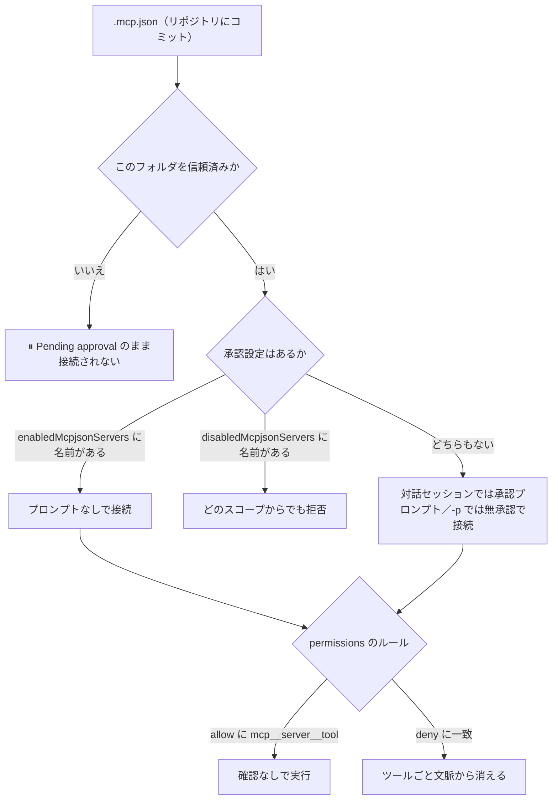
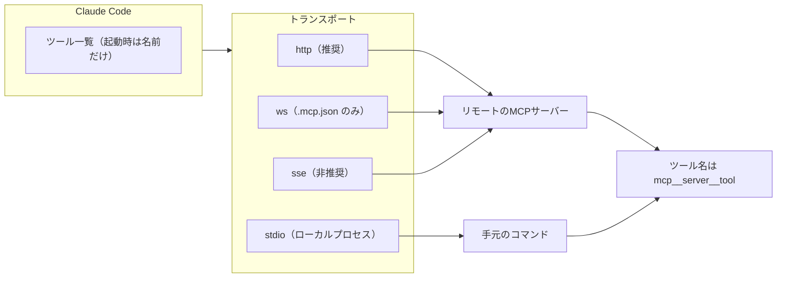
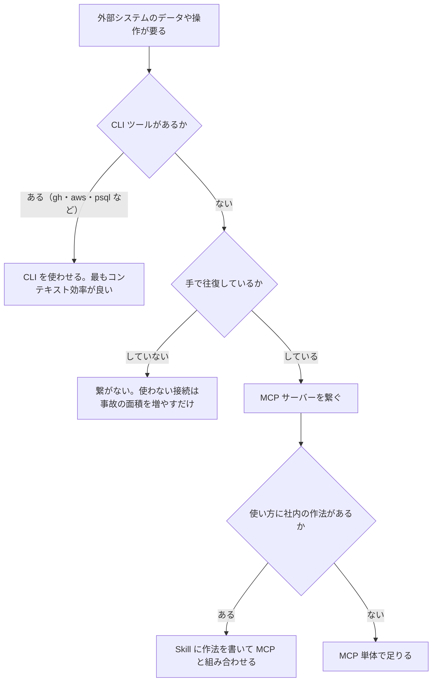

# Claude Daily — 2026-09-10（第019号）

## きょうの3行

- MCP は「入れる」より「配る・絞る」が本題です。`.mcp.json` をコミットし、承認と権限をリポジトリ側で決めると、チーム全員の外部接続が同じ形になります。
- MCP のツール定義は起動時に**名前だけ**が載り、JSON スキーマは使うまで遅延します（ツール検索が既定オン）。コンテキストを圧迫するのは定義よりも**出力**です。
- Claude Code v2.1.267 が出ました。`maxEffortLevel` の追加と、**MCP 由来のプロンプトキャッシュ破壊の修正が大量**に入っています。

---

## ① ベストプラクティス — 外部接続はリポジトリに宣言して配る

### 何を解決するのか

MCP（Model Context Protocol、外部サービスを Claude のツールとして繋ぐ仕組み）を各自が `claude mcp add` で入れると、設定は既定で**ローカルスコープ**、つまり `~/.claude.json` の自分のマシンの中だけに残ります。同じリポジトリを開いた同僚の Claude には、その接続は存在しません。結果として「自分の環境では動くプロンプト」がチームで再現しなくなります。

解決策は、外部接続を**リポジトリの成果物として宣言する**ことです。接続先（`.mcp.json`）・承認（`enabledMcpjsonServers`）・使ってよいツール（`permissions`）の3点をコミットすれば、`git clone` した時点で全員が同じ外部接続と同じ制限を持ちます。

### 仕組みの図



図1: `.mcp.json` が接続されるまでの3つの関門。信頼 → 承認 → 権限の順に効きます。

### そのままコピペして動く設定

リポジトリ直下に置く `.mcp.json`。これがチーム全員の接続先になります。

```json
{
  "mcpServers": {
    "docs": {
      "type": "http",
      "url": "https://mcp.example.com/mcp",
      "headers": {
        "Authorization": "Bearer ${DOCS_MCP_TOKEN}"
      },
      "timeout": 60000
    },
    "db": {
      "type": "stdio",
      "command": "${CLAUDE_PROJECT_DIR:-.}/scripts/db-mcp-server",
      "args": ["--readonly"],
      "env": {
        "DATABASE_URL": "${DATABASE_URL}"
      }
    }
  }
}
```

`${VAR}` と `${VAR:-デフォルト値}` は `command` / `args` / `env` / `url` / `headers` で展開されます。`${CLAUDE_PROJECT_DIR}` はリポジトリのルートに解決される特別な変数です。相対パスと組み合わせるときは上のように `:-.` を付けます。

続いて `.claude/settings.json`。承認と権限をここで決めます。ファイル全体です。

```json
{
  "enabledMcpjsonServers": ["docs", "db"],
  "disabledMcpjsonServers": [],
  "permissions": {
    "allow": [
      "mcp__docs__*",
      "mcp__db__get_schema"
    ],
    "deny": [
      "mcp__db__execute_write"
    ]
  }
}
```

MCP の権限ルールは3つの形しかありません。`mcp__db` はそのサーバーの全ツール、`mcp__db__*` も同じ意味、`mcp__db__get_schema` は単一のツールです。**allow 側のワイルドカードは `mcp__<server>__` という前置きの後ろにしか置けません。** `"*"` や `"mcp__*"` のような前置きなしの allow は警告つきで読み飛ばされ、何も自動承認しません。

登録をコマンドから行うなら、`--scope project` を付けると `.mcp.json` に書かれます。

```bash
claude mcp add --transport http --scope project docs https://mcp.example.com/mcp
```

stdio（ローカルプロセス）の場合は、Claude 側のオプションとサーバーのコマンドを `--` で区切ります。

```bash
claude mcp add --transport stdio --scope project db -- node scripts/db-mcp-server.js --readonly
```

着弾確認は `claude mcp list` です。`⏸ Pending approval` と出たらまだ接続されていません。

### アンチパターン

**1. 承認設定をコミットしたのに `⏸ Pending approval` が消えない。**
v2.1.196 以降、**リポジトリにチェックインされた `.claude/settings.json` は、そのフォルダを信頼するまで承認として読まれません**。クローンしたリポジトリが自分自身のサーバーを承認できてしまうと、悪意あるリポジトリが無断で外部接続を張れるからです。信頼ダイアログを通すまでは、ユーザー設定（`~/.claude/settings.json`）・管理設定・`--settings` で渡した承認だけが効きます。逆に `disabledMcpjsonServers` はどの設定ファイルからでも拒否します。**閉める方向は常に効き、開ける方向だけが信頼を要求される**、という非対称です。

**2. 引数で絞ろうとして括弧を書く。**
Bash ルールの感覚で `"mcp__db__execute_query(SELECT *)"` のように書くと、そのルールは**設定の読み込み時にスキップ**されます。`mcp__` で始まるルールに括弧が入っていると無効になり、起動時の invalid-settings ダイアログと `claude doctor` の出力に「読み飛ばした」と並びます。書いた本人は絞ったつもりで、実際には**何の制限もかかっていない**のが危険なところです。パラメータで絞りたいときは `--disallowedTools` に deny ルールとして渡します。

**3. `headersHelper` に環境変数からトークンを渡そうとする。**
プロジェクトの `.mcp.json` やプラグインから `headersHelper`（毎回の接続時にヘッダーを生成するコマンド）を走らせるとき、`TOKEN` / `SECRET` / `PASSWORD` / `KEY` / `AUTH` を名前に含む環境変数は**取り除かれてから**実行されます。リポジトリに置いたスクリプトが開発者の資格情報を吸い出せないための措置です。ヘルパーはファイルか資格情報ストアから読むように書きます。静的な `headers` の `${VAR}` 展開は従来どおり動きます。

出典: [Connect Claude Code to tools via MCP](https://code.claude.com/docs/en/mcp) / [Configure permissions](https://code.claude.com/docs/en/permissions) / [Best practices for Claude Code](https://code.claude.com/docs/en/best-practices)

---

## ② 深掘り連載 第13回 — MCP：外部サービスと繋ぐ

### なぜ重要か

公式の「拡張機能を足すきっかけ」の表に、MCP の行はこう書かれています — **「Claude に見えないブラウザのタブから、データをコピーし続けている」とき**。つまり MCP は「便利そうだから入れる」ものではなく、**あなたが手で運んでいる往復を消すため**のものです。逆に言えば、手で運んでいないものを繋ぐ理由はありません。

### 仕組みの図



図2: トランスポート4種と、ツール名の付き方。`sse` は非推奨で、リモートは `http` を使います。

### 具体的な使い方

登録は3つの形しかありません。

- HTTP: `claude mcp add --transport http notion https://mcp.notion.com/mcp`
- stdio: `claude mcp add --transport stdio airtable -- npx -y airtable-mcp-server`
- ws: `.mcp.json` に `"type": "ws"` で直接書く（コマンドからは登録できません）

スコープは3つで、重複したときの優先順位はローカル → プロジェクト → ユーザー → プラグイン → claude.ai コネクタ → 組織の `managedMcpServers` の順に解決されます（`managedMcpServers` が最優先、v2.1.259 以降）。

認証は、対話セッションなら `/mcp` を開いてサーバーを選び Authenticate、コマンドからなら `claude mcp login <name>`（ブラウザが開けない環境では `--no-browser`）、解除は `claude mcp logout <name>` です。

繋がったサーバーが提供するものは、ツールだけではありません。

| 種類 | 呼び出し方 | 例 |
|---|---|---|
| ツール | Claude が自分で呼ぶ | `mcp__stripe__create-invoice` |
| リソース | プロンプト内で `@` で参照 | `@resource mcp__stripe__customer-123` |
| プロンプト | スラッシュコマンドとして実行 | `/list-recent-invoices` |

### コンテキストの実際

「MCP を入れるとコンテキストが太る」は、いまは**半分だけ正しい**話です。公式の読み込みコスト表では、MCP サーバーは起動時に**ツール名とサーバーの説明だけ**が載り、完全な JSON スキーマは Claude がそのツールを必要とするまで遅延します（ツール検索が既定オン）。したがって「使っていないツールが常時トークンを食う」という状態は既定では起きません。

一方で、**出力**は素直にコンテキストに入ります。MCP ツール1回の出力上限は `MAX_MCP_OUTPUT_TOKENS` で既定 25,000 トークン、10,000 トークンを超えた時点で警告が出ます。太るのは定義ではなく結果のほう、と覚えておくと判断を間違えません。

なお、`ANTHROPIC_BASE_URL` を一次サービス以外のホスト（社内 LLM ゲートウェイなど）に向けている場合、ツール検索は既定で無効になります。プロキシが `tool_reference` ブロックを転送できるなら `ENABLE_TOOL_SEARCH=true` を設定します。

### 使うべき時／使うべきでない時



図3: CLI・MCP・Skill の使い分け。公式は「CLI ツールが外部サービスと関わる最もコンテキスト効率の良い方法」と明言しています。

公式の対比表では、MCP は「外部のデータやアクション」、Skill は「知識・ワークフロー・参照資料」と役割が分かれています。組み合わせが効くのは、**MCP が接続と認証を担い、Skill が「そのツールをどう使うか」を教える**形です。データベースに MCP で繋ぎ、スキーマとクエリの型は Skill に書く、という分担が典型例です。

セキュリティ上の注意も1点。公式ドキュメントは「接続する各サーバーを信頼できるか確認すること。外部コンテンツを取得するサーバーはプロンプトインジェクションのリスクに晒す」と明記しています。Anthropic はサードパーティ MCP サーバーの監査をしません。

出典: [Connect Claude Code to tools via MCP](https://code.claude.com/docs/en/mcp) / [Extend Claude Code](https://code.claude.com/docs/en/features-overview) / [Environment variables](https://code.claude.com/docs/en/env-vars)

---

## ③ すぐ効くTIPS

### 1. `/context all` で MCP ツール1つ1つのトークンを見る

「なんとなく重い」を数字にしないと削る判断ができません。`/context all` は読み込み済みの MCP ツールが**それぞれ何トークン使っているか**を出します。まず `/mcp` で接続状態を見て、`/context all` で費用を見る、の2手です。使っていないサーバーはその場で切断できます。

```bash
/mcp
/context all
```

### 2. 溢れるのは出力。`MAX_MCP_OUTPUT_TOKENS` で天井を意識する

MCP ツール1回の出力は既定 25,000 トークンが上限で、10,000 トークンを超えると警告が出ます。スキーマ取得やログ取得のツールは簡単にここに当たります。**上げるより先に、サーバー側で返す列や行を絞るほうが効きます**。どうしても必要なときだけ広げます。

```bash
export MAX_MCP_OUTPUT_TOKENS=50000
claude
```

### 3. 「毎回必ず人に聞く」ツールを MCP サーバー側で宣言する

同意やアクセス付与のように、**自動承認されたら意味がない**操作があります。自作の MCP サーバーなら `tools/list` の応答で `_meta["anthropic/requiresUserInteraction"]` に JSON の `true` を入れておくと、`acceptEdits` / `auto` / `bypassPermissions` のどのモードでも毎回プロンプトが出て、「次回から確認しない」も出ません。allow ルールでもスキップされません（v2.1.199 以降）。

```json
{
  "name": "grant_access",
  "description": "Requests access to a protected resource",
  "_meta": {
    "anthropic/requiresUserInteraction": true
  }
}
```

---

## ④ 事例

### 社内 PostgreSQL・Slack・Datadog に MCP で繋いだ（二次情報）

TypeScript で stdio の MCP サーバーを3本自作した記録が公開されています（2026-09-09）。PostgreSQL 用は `get_schema` と `execute_query`、Slack 用は `get_channel_messages` と `get_thread_replies`、Datadog 用は `get_active_alerts` と `get_recent_events` という構成だったとのことです。

安全側の作りとして、SQL は SELECT のみ・結果は100行まで・Slack のボットトークンは `channels:history` と `channels:read` に限定・stderr に JSON で監査ログ、を土台に置いたと報告されています。オーバーヘッドは3本同時接続で**起動が約1.3秒増、メモリが約170MB増、ツール呼び出しは初回300ms・以降150ms**という計測が示されています。接続プールの生成を初回のツール利用まで遅らせる遅延初期化と、返す列を絞る結果フィルタリングで削ったとのことです。

読者の側で真似しやすいのは「read-only + 行数上限 + 監査ログ」の3点セットです。**MCP はモデルに新しい能力を渡す行為なので、サーバー側で閉じておくのが一番確実**という点は、①のアンチパターン2とも一致します。

出典: [MCPサーバーを自作してClaude Codeの能力を拡張する実践レシピ3選 ── 社内DB・Slack・監視ツール編](https://qiita.com/hikariclaude01/items/bda022894a4749140acc)

### チーム開発での MCP スコープ設計（チーム展開の観点・二次情報）

5人規模のチーム開発を前提に、MCP のスコープをどう割り振るかを整理した記事があります（2026-01-06）。方針は明快で、**全員が使うものはプロジェクトスコープ、個人が使うものはローカルスコープ**。PM が使う Notion のような役割固有のものはローカルに置き、任意で入れる MCP は README に導入コマンドごと書いておく、という運用が報告されています。

同記事では、MCP のツール定義が全体コンテキストの **26.5k トークン（13.3%）** を占めた計測が示され、「人数分だけ無駄が掛け算になる」と述べられています。ツール定義が増えすぎると Claude が適切なツールを選びにくくなる、という指摘もあります。

ただし②で見たとおり、現在はツール検索が既定オンでスキーマは遅延読み込みになるため、この数字をそのまま今日の環境に当てはめることはできません。**それでも「チームで先に方針を決めてから配る」という結論は有効です。** 配ってしまえば全員のセッションに乗るので、後から剥がすほうがずっと高くつきます。

出典: [Claude Codeをチーム開発で使う際のMCPスコープ設計ガイド](https://zenn.dev/akino/articles/7a1fc7cc605cdb)

---

## ⑤ 速報 — 新機能・変更点

| いつ | 何が | どう効くか |
|---|---|---|
| v2.1.267 | `maxEffortLevel` 設定を追加（トップレベル、または `modelSettings` の各モデル配下） | Bedrock・Vertex・Foundry を含む全プロバイダで effort の上限を固定できる。ユーザーはより低い段階を選ぶことは可能。低い上限はどのスコープからでも尊重され、最も低い上限が勝つ |
| v2.1.267 | `--system-prompt-snapshot off` を追加 | 会話に記録済みのシステムプロンプトを再利用せず、毎リクエスト新しく描画する。プロンプト本文を書き換えながら試すとき用 |
| v2.1.267 | MCP 起因のプロンプトキャッシュ破壊を多数修正 | 切断された MCP サーバーのツールが会話途中で消えてツール一覧が書き換わる、セッション途中で MCP・プラグインのツールが追加される、`/model` の切り替えで全ツール定義が再送される、といったキャッシュミスがまとめて解消 |
| v2.1.267 | マーケットプレイスのパスに含まれるバックスラッシュで containment 検査を回避できた不具合を修正（macOS / Linux） | 取得したマーケットプレイスの隔離が効くようになる。セキュリティ修正 |
| v2.1.267 | 5MB 超のセッション再開で、並列ツール呼び出しとそのフック出力が落ちる不具合を修正 | 長いセッションの `--resume` が壊れにくくなる |
| v2.1.266 | v2.1.265 の回帰修正のみ（`CLAUDE_CODE_USE_GATEWAY` が単独で Cloud ゲートウェイのサインインを強制していた） | LLM ゲートウェイ／プロキシ構成で毎リクエスト失敗していたのが解消。設定変更は不要 |
| — | Platform リリースノート・anthropic.com/news | 前回チェック（9/9）以降の新規発表はありません |

出典: [Claude Code CHANGELOG](https://github.com/anthropics/claude-code/blob/main/CHANGELOG.md)

---

## ⑥ コマンド早見

| コマンド | 何をするか |
|---|---|
| `claude mcp add --transport http --scope project docs https://mcp.example.com/mcp` | HTTP の MCP サーバーを `.mcp.json` に登録する |
| `claude mcp add --transport stdio db -- node scripts/db-mcp-server.js --readonly` | ローカルプロセスの MCP サーバーを登録する（`--` 以降がサーバーのコマンド） |
| `claude mcp list` | 登録済みサーバーと接続状態を一覧する |
| `claude mcp get docs` | 1つのサーバーの設定内容を表示する |
| `claude mcp remove docs` | サーバーの登録を削除する |
| `claude mcp login docs` | サーバーの OAuth 認証を行う |
| `claude mcp logout docs` | サーバーの認証を解除する |
| `claude mcp reset-project-choices` | `.mcp.json` サーバーの承認・却下の記録をリセットする |
| `claude mcp serve` | Claude Code 自身を MCP サーバーとして動かす |
| `claude doctor` | 解決後の設定と、読み飛ばされた無効なルールを確認する |
| `/mcp` | セッション内で各サーバーの接続状態と認証を見る |
| `/context all` | 読み込み済み MCP ツールごとのトークン消費を見る |

---

## ⑦ きょうの課題

**お題:** Next.js のプロジェクトで `.mcp.json` を1本置き、「信頼 → 承認 → 権限」の3つの関門が実際にどう効くかを目で確かめてください。所要 10〜15分。外部アカウントは不要です。

**前提:** Claude Code v2.1.196 以降。作業対象の Next.js リポジトリのルートで作業します。

**手順:**

1. リポジトリのルートに `.mcp.json` を作る。中身は次のとおり（`claude mcp serve` は Claude Code 自身を MCP サーバーとして動かすコマンドなので、外部サービスなしで試せます）。

```json
{
  "mcpServers": {
    "selftest": {
      "type": "stdio",
      "command": "claude",
      "args": ["mcp", "serve"]
    }
  }
}
```

2. まだ Claude を起動していない状態で `claude mcp list` を実行し、`selftest` の状態を記録する。
3. `claude` を起動する。承認プロンプトが出たら承認し、`/mcp` で接続状態を見る。
4. `/context all` を実行し、`selftest` のツールが何トークン使っているか記録する。
5. `.claude/settings.json` に `{"disabledMcpjsonServers": ["selftest"]}` を書いて Claude を再起動し、`claude mcp list` と `/mcp` がどう変わるか見る。
6. `disabledMcpjsonServers` を消し、代わりに `{"permissions": {"deny": ["mcp__selftest"]}}` にして再起動し、`/mcp` とツール一覧の差を見る。
7. 最後に `claude mcp reset-project-choices` を実行し、`claude mcp list` の表示が手順2の状態に戻ることを確認する。

**確認方法:** 手順2・5・6・7で `claude mcp list` の表示が変わっていれば成功です。変わらない場合は模範解答の「詰まりどころ」を見てください。

── 模範解答 ──

**手順2で見えるもの:** `⏸ Pending approval`。`.mcp.json` に書いただけでは接続されません。対話セッションが承認を求めるからです。なお `claude -p`、Agent SDK、クラウドセッションでは**承認プロンプトなしで読み込まれます**。ここが対話と非対話の最大の違いで、CI に `.mcp.json` を持ち込むときは「誰も承認しないまま繋がる」前提で書く必要があります。

**手順5と手順6の違い:** どちらもツールは使えなくなりますが、止まる場所が違います。`disabledMcpjsonServers` は**サーバーを接続しない**（`claude mcp list` の状態が変わる）。`permissions.deny` の `mcp__selftest` は**接続はするがツールが Claude の文脈から取り除かれる**（`/mcp` では接続済みに見えるのにツールが出てこない）。「繋ぎたくない」のか「繋ぐが使わせたくない」のかで使い分けます。

**なぜそうなるのか:** ①の図1のとおり、`.mcp.json` は信頼・承認・権限の3段を順に通ります。`disabledMcpjsonServers` は2段目、`permissions.deny` は3段目に効きます。閉める方向（deny・disabled）はどの設定ファイルからでも効き、開ける方向（enabled・allow）だけがフォルダの信頼を要求される、という非対称を体で覚えるのがこの課題の目的です。

**よくある詰まりどころ:**

- **手順5・6が効かない**: そのフォルダをまだ信頼していない可能性があります。リポジトリにチェックインされた `.claude/settings.json` の**承認**は未信頼フォルダでは無視されますが、`disabledMcpjsonServers` は無視されません。何も変わらないときは、まず `claude` を対話で起動して信頼ダイアログを通してください。
- **deny ルールを書いたのに読まれない**: `mcp__` で始まるルールに括弧を入れていませんか。括弧つきの `mcp__` ルールは読み込み時にスキップされます。`claude doctor` の出力に読み飛ばされたルールが並びます。
- **`claude mcp list` の表示が期待と違う**: v2.1.196 以降、`claude mcp list` と `claude mcp get` は、リポジトリにチェックインされていない設定ファイルの承認を、フォルダを信頼するまで読みません。一度 `claude` を起動して信頼してから再実行してください。

---

あすの予告: 深掘り連載 第14回「プラグイン — チームに配布する単位」。今日作った `.mcp.json` と Skill と Hook を、1コマンドで配れる1つの単位にまとめます。
