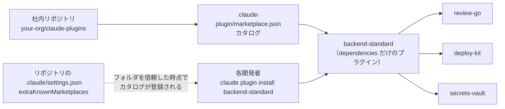
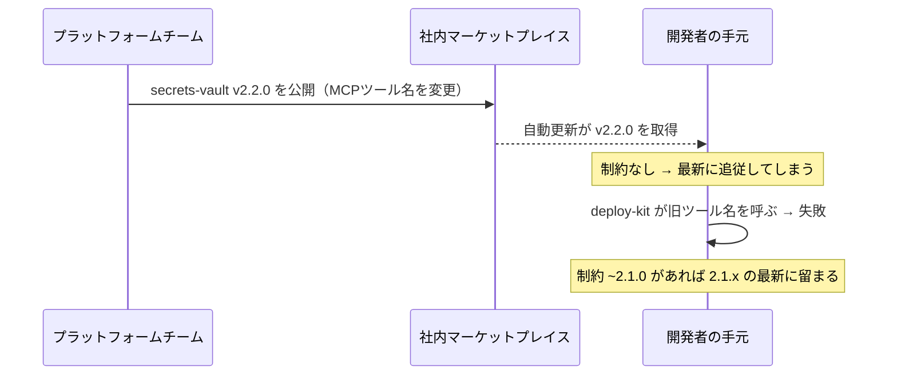
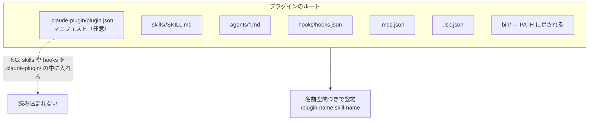

# Claude Daily — 2026-09-11（第020号）

## きょうの3行

- チームの標準セットは「依存だけを書いたプラグイン」1本にまとめると、各自のインストールが1コマンドで済みます。
- 深掘り連載 第14回はプラグイン。`.claude/` の設定と何が違い、どこに置くと誰に届くのかを整理します。
- Claude Code v2.1.268 が出ました。`/plugin` メニューを閉じるだけで変更が反映されるようになり、`/reload-plugins` を打つ場面が減ります。

---

## ① ベストプラクティス — チームの標準セットを「バンドルプラグイン」1本にまとめる

### 何を解決するのか

チームで Claude Code を揃えようとすると、たいてい配布物が増えていきます。コードレビュー用のスキル、デプロイ用のフック、社内 API の MCP サーバー。これらを個別に配ると、新しく入った人は「4つ入れてください」と言われ、1つ入れ忘れ、なぜか手元だけ挙動が違う、という事故が起きます。

プラグインの `dependencies` を使うと、これを1本に畳めます。**マニフェストに必須なのは `name` だけで、中身が `dependencies` の配列しかないプラグインを作れます。** それを入れると依存が芋づる式に入る。つまり「バックエンドの標準セット」という名前のプラグインを1つ作って配れば済みます。

出典: [Constrain plugin dependency versions — Claude Code Docs](https://code.claude.com/docs/en/plugin-dependencies)

### 仕組みの図



図1: カタログ1つ・入口1つ。依存の解決は Claude Code に任せる

### そのままコピペして動く形

社内リポジトリを1つ用意し、次の3つのファイルを置きます。プラグイン本体はこのリポジトリの中に相対パスで持つのが、いちばん詰まりません（理由はアンチパターンで説明します）。

まずカタログ。リポジトリのルートに `.claude-plugin/marketplace.json` を置きます。

```json
{
  "name": "acme-tools",
  "owner": {
    "name": "Platform Team",
    "email": "platform@example.com"
  },
  "description": "社内標準の Claude Code プラグイン",
  "metadata": {
    "pluginRoot": "./plugins"
  },
  "plugins": [
    { "name": "backend-standard", "source": "backend-standard" },
    { "name": "review-go", "source": "review-go" },
    { "name": "deploy-kit", "source": "deploy-kit" },
    { "name": "secrets-vault", "source": "secrets-vault" }
  ]
}
```

`metadata.pluginRoot` を書くと、`source` に裸の名前を書くだけで `./plugins/<名前>` に解決されます（Claude Code v2.1.239 以降）。

次にバンドル本体。`plugins/backend-standard/.claude-plugin/plugin.json` はこれだけです。

```json
{
  "name": "backend-standard",
  "version": "1.0.0",
  "description": "バックエンド開発者の標準プラグインセット",
  "dependencies": [
    "review-go",
    { "name": "deploy-kit", "version": "^1.2" },
    { "name": "secrets-vault", "version": "~2.1.0" }
  ]
}
```

最後に、配布したいリポジトリ側の `.claude/settings.json`。カタログの登録だけを設定に持たせます。

```json
{
  "extraKnownMarketplaces": {
    "acme-tools": {
      "source": {
        "source": "github",
        "repo": "your-org/claude-plugins"
      }
    }
  },
  "enabledPlugins": {
    "backend-standard@acme-tools": true
  }
}
```

各開発者がやることは、フォルダの信頼ダイアログに答えたあと、次の1行だけです。

```bash
claude plugin install backend-standard@acme-tools
```

依存の `review-go` / `deploy-kit` / `secrets-vault` は自動で入ります。あとから標準セットにツールを1つ足したいときは、`backend-standard` の `dependencies` に足して `version` を上げ、タグを打つだけです。

```bash
claude plugin tag --push
```

`claude plugin tag` はマニフェストとマーケットプレイスのエントリからタグ名（`backend-standard--v1.1.0` の形）を組み立て、両者のバージョンが食い違っていれば拒否します。手で `git tag` を打つのと等価ですが、食い違いを見つけてくれるぶんこちらが安全です。

### アンチパターン

**その1: `enabledPlugins` に書けば全員に配れる、と思う。**

`.claude/settings.json` の `enabledPlugins` は「入っていれば有効にする」設定であって、インストールではありません。Claude Code v2.1.195 以降、マーケットプレイスを追加しただけでは**外部ソース（GitHub リポジトリや npm パッケージ）のプラグインはインストールされません**。プロジェクト設定が有効化しているだけのプラグインは「未インストール」と表示され、打つべき `claude plugin install` コマンドが案内されます。だからプラグイン本体はマーケットプレイスのリポジトリの中に置き、相対パスで参照するほうが手数が減ります。

**その2: 依存にバージョン制約を付けない。**

```json
{ "dependencies": ["secrets-vault"] }
```

これは「そのマーケットプレイスが提供する最新版」に追従します。上流が MCP ツール名を変えたリリースを打つと、自動更新で全員の `secrets-vault` が動き、それを呼んでいた `deploy-kit` が壊れます。公式ドキュメントがまさにこの例を挙げています。



図2: 制約を書かない依存は、上流のリリースがそのまま手元に届く

テスト済みの範囲で止めるなら、こう書きます。

```json
{ "dependencies": [{ "name": "secrets-vault", "version": "~2.1.0" }] }
```

`~2.1.0` なら 2.1.x の最新に留まります。範囲を広げるのは、上流の変更を検証したあと、`deploy-kit` の新しいバージョンを出すときです。

**その3: 実行ファイルをトップレベルの `bin/` に置く。**

`bin/` はプラグイン有効時に Bash ツールの `PATH` に足される便利なディレクトリですが、claude.ai の組織設定経由で配るプラグインには**含められません**。組織同期がトップレベル `bin/` を持つプラグインを拒否します。社内配布を組織設定に載せる予定があるなら、最初から `scripts/` に置き、フックからは `${CLAUDE_PLUGIN_ROOT}/scripts/validate.sh` のように呼びます。あとから移すと、フックの `command` を全部書き換えることになります。

出典: [Create and distribute a plugin marketplace](https://code.claude.com/docs/en/plugin-marketplaces) ／ [Discover and install plugins](https://code.claude.com/docs/en/discover-plugins)

---

## ② 深掘り連載 第14回 — プラグイン: チームに配布する単位

### なぜ重要か

ここまでの連載で、スキル・フック・サブエージェント・MCP と道具を揃えてきました。プラグインはそれらを**梱包する箱**です。箱に入れる理由は3つあります。共有できること、バージョンを打てること、そして複数のプロジェクトで使い回せることです。

公式ドキュメントは使い分けをこう整理しています。個人のワークフローや、そのプロジェクト限りのカスタマイズ、素早い実験は `.claude/` に直接置く。共有・配布・バージョン付きリリース・プロジェクト横断での再利用はプラグインにする。まず `.claude/` で回して、配る段になって畳む、という順序です。

### 仕組みの図



図3: `.claude-plugin/` に入れてよいのは `plugin.json` だけ。他はすべてルート直下

この「`.claude-plugin/` の中に入れてしまう」は公式ドキュメントが "Common mistake" として名指ししている間違いです。プラグインのルートとは個々のプラグイン自身のディレクトリであって、`~/.claude/` ではありません。

### 具体的な使い方

**置き場所は4通りあり、届く相手が違います。**

| 置き方 | コマンド／設定 | 誰に届くか |
|---|---|---|
| スキルディレクトリ | `claude plugin init <name>` | 自分だけ（`~/.claude/skills/`）またはリポジトリの共同作業者（`.claude/skills/`） |
| ローカルフォルダ指定 | `claude --plugin-dir ./my-plugin` | そのセッションだけ。開発中の動作確認用 |
| マーケットプレイス | `/plugin marketplace add your-org/claude-plugins` | カタログを追加した人 |
| 組織設定 | claude.ai の Organization settings > Plugins | 組織のメンバー全員 |

いちばん軽いのが1番目です。`claude plugin init my-tool` を打つと `~/.claude/skills/my-tool/` に `.claude-plugin/plugin.json` と雛形の `SKILL.md` ができ、**次のセッションから `my-tool@skills-dir` として自動で読み込まれます。** マーケットプレイスもインストール手順も要りません。`--with skills hooks` のように渡せば、コンポーネントのフォルダも一緒に作られます。

ただしスキルディレクトリのプラグインには、置き場所によって制限があります。プロジェクトスコープ（`.claude/skills/`）の場合、MCP サーバーはプロジェクトの `.mcp.json` と同じくサーバーごとの承認を通り、LSP サーバーはワークスペースの信頼後にだけ起動し、**バックグラウンドモニターは読み込まれません**。個人スコープ（`~/.claude/skills/`）にはこの制限がありません。もうひとつ、プロジェクトスコープのプラグインは主作業ディレクトリの `.claude/skills/` からしか読まれず、普通のスキルのようにリポジトリのルートまで遡ってはくれません。リポジトリのルートから起動するか、`/cd` で移動してください。

**バージョンはどこから来るか。** 先に一致したものが勝ちます。(1) `plugin.json` の `version`、(2) マーケットプレイスのエントリの `version`、(3) プラグインのソースリポジトリの git タグ、(4) npm ソースなら `package.json` の `version`、(5) どこにも無ければマーケットプレイスの最新。両方に書くと `plugin.json` が勝つので、二重管理はやめて片方に寄せます。社内で活発に触っているプラグインは `version` を省いてコミットから自動判定させ、安定リリースを配るときだけ明示的に付ける、というのが公式の勧めです。

**依存の衝突はどう解決されるか。** 複数のプラグインが同じ依存に制約を付けている場合、Claude Code は範囲を積集合にして、すべてを満たす最高バージョンに解決します。`^2.0` と `>=2.1` なら 2.x の最新に1つだけ入りますが、`~2.1` と `~3.0` は両立しないので、あとから入れるほうのインストールが `range-conflict` で失敗します。このとき既存のプラグインと依存はそのまま残ります。

### 使うべき時／使うべきでない時

| 状況 | プラグインにする？ |
|---|---|
| 自分のプロジェクト限りの `/deploy` コマンド | しない。`.claude/skills/` のままでよい |
| 3人以上が同じスキルを使い始めた | する。名前空間が付き、更新が1か所で済む |
| チーム全員に同じ MCP サーバーを繋がせたい | 状況次第。`.mcp.json` で足りるなら不要（[2026-09-10 の号](https://github.com/y-horie517/claude-news/blob/main/digest/2026/09/2026-09-10.md)参照） |
| 社外にも配りたい | する。マーケットプレイスが配布経路になる |
| 試作段階で仕様が毎日変わる | しない。`claude --plugin-dir ./my-plugin` で回す |

判断の軸は「更新を1か所で回したいか」です。配る相手が1人なら、コピーのほうが速い。3人を超えたあたりから、コピーの同期コストがプラグイン化のコストを上回ります。

出典: [Create plugins](https://code.claude.com/docs/en/plugins) ／ [Plugins reference](https://code.claude.com/docs/en/plugins-reference)

---

## ③ すぐ効くTIPS

### 1. マーケットプレイスを作る前に `claude plugin init` で試す

配布経路を先に作ると、雛形を直すたびにカタログの更新が要ります。`claude plugin init` は `~/.claude/skills/<name>/` に足場を作るので、次のセッションから `<name>@skills-dir` としてそのまま動きます。形が固まってからマーケットプレイスに移せば十分です。

```bash
claude plugin init my-tool --with skills hooks
```

### 2. 更新をまたいで残したいものは `${CLAUDE_PLUGIN_DATA}` に置く

`${CLAUDE_PLUGIN_ROOT}` はプラグインの実体があるディレクトリですが、**更新するとパスが変わります**（旧バージョンのディレクトリは約14日の猶予のあと削除されます）。`node_modules` やキャッシュをここに作ると更新のたびに消えます。`${CLAUDE_PLUGIN_DATA}` は `~/.claude/plugins/data/{id}/` を指し、バージョンをまたいで残ります。消えるのは全スコープからアンインストールしたときだけです（`--keep-data` を付ければ残ります）。

### 3. `claude plugin validate --strict` を CI に置く

`validate` は認識できないフィールドを警告として報告し、1〜2文字違いなら正しい名前を提案します。警告だけなら実行時には読み込まれてしまうので、**誤字は気づかないまま配られます**。CI では `--strict` を付けて警告をエラーに変えます。

```bash
claude plugin validate ./plugins/backend-standard --strict
```

---

## ④ 事例

### ヤプリ — 社内マーケットプレイスを「AI が読める」形で設計し、部署横断でスキルを共有

ヤプリのサーバーサイドグループマネージャーが、個人環境に散らばっていた Claude Code のスキルを社内で共有する仕組みを作った、という報告があります。GitHub リポジトリに `.claude-plugin/marketplace.json` と各プラグインの `plugin.json` を置く、今日の①と同じ構成です。

特徴的なのは2点です。1つは、追加のハードルを下げるために **README.md（人向け）と CLAUDE.md（AI向け）を分けた**こと。Claude Code が CLAUDE.md を読んで追加作業を自動で進められる形にしています。もう1つは、ディレクトリを `services/` と `domains/` で分類し、末端を作成者単位にして、命名規則を `{scope}-{目的}-{author}` に統一したこと。セルフマージ運用で参入障壁を最小にした結果、複数チームから5つのプラグイン（Go のコードレビュー、PdM 向け仕様レビュー、CloudFormation 検証、Atlassian ワークフロー、QA の E2E テスト導出）が集まったとのことです。

配布の型そのものより、**「誰でも足せる」運用にしたことが集まった理由**として書かれている点が参考になります。

出典: [Claude Code の社内マーケットプレイスをAI friendlyに設計し、Skill を部署横断で共有する仕組みを作った — Yappli Tech Blog](https://tech.yappli.io/entry/claude-code-marketplace)（二次情報）

### プラグイン導入でつまずいた点の報告

導入手順と詰まり所をまとめた記事に、次の報告があります。**VS Code 拡張のチャット欄からは `/plugin` が実行できない** ——拡張機能は独自のバンドルバイナリを使っていて CLI とは別物のため、ターミナルから `claude` を起動する必要がある、という指摘です。また、`fnm` などの Node.js バージョンマネージャー環境では `npm install -g` で入れたバイナリが PATH に反映されず古いまま残ることがあり、`claude install` でネイティブバイナリを `~/.local/bin/claude` に置くほうが確実だとしています。

もう1点、粒度の話として「インストールはプラグイン単位で、その中の Skill / Agent / Hook / MCP を個別に選ぶことはできない」と書かれています。**プラグインを分ける単位＝入れる／入れないを分けたい単位**、と考えると設計しやすくなります。

出典: [Claude Code Plugin Marketplace 試してみたので導入手順と詰まり所をまとめてみた — Qiita](https://qiita.com/R-You/items/45c69a02b46d1e757001)（二次情報、2026年6月更新のため、`/reload-plugins` まわりの記述は現行版と異なります）

---

## ⑤ 速報 — 新機能・変更点

| いつ | 何が | どう効くか |
|---|---|---|
| v2.1.268 | `/plugin` でのインストール・有効化・無効化が、メニューを閉じた時点で反映される | `/reload-plugins` を後から打つ必要がなくなりました。メニュー外での変更（別ターミナルの `claude plugin`、`--plugin-dir` の編集）は従来どおり自分で reload します |
| v2.1.268 | `claude plugin install` / `uninstall` / `update` / `enable` / `disable` に `--json` を追加。`claude plugin list --json` の各行に `errorDetails` / `noteDetails` を追加 | CI からプラグインの状態を機械的に判定できます |
| v2.1.268 | WebFetch が応答を閉じないサーバーで無限に待つ問題を修正。300秒で失敗するようになり、`CLAUDE_CODE_WEBFETCH_DEADLINE_MS` で上書き可（`0` で無効） | 調査中にセッションが固まる事故が減ります |
| v2.1.268 | サードパーティの Anthropic 互換エンドポイント（`ANTHROPIC_BASE_URL`）で全ターンが HTTP 400 になる問題を修正。v2.1.265 以降の回帰で、原因は Artifact ツールの入力スキーマ内の正規表現 | 自前ゲートウェイ経由で使っている環境は上げる価値があります |
| v2.1.268 | シンボリックリンクされたディレクトリ（macOS の `/etc` `/tmp` `/var`、Linux の `/bin`）に対する deny / ask ルールが実体パス指定時に効かなかった問題、および `env -C` や `eval` が同じ行にあると Read / Edit の deny が効かなかった問題を修正 | 権限ルールのすり抜けが塞がれました |
| v2.1.268 | プラグイン／マーケットプレイスのエラーに git ソース URL のトークンが出ていた問題、`/mcp` `/plugin` の詳細や `claude mcp list` で `${VAR}` から解決したシークレットが表示されていた問題を修正 | ログや画面共有からの漏洩経路が1つ減ります |
| v2.1.268 | `CLAUDE_CODE_SESSIONEND_HOOKS_TIMEOUT_MS` が、個別 `timeout` を持たない SessionEnd フックに効いていなかった問題を修正（1.5秒で打ち切られていた） | 終了時の書き出し処理が途中で切れる問題が直ります |
| 2026-09-10 | Claude Managed Agents の権限ポリシーに `auto` が追加。サーバー側が各エージェント／MCP ツール呼び出しを評価し、実行・拒否・承認待ちを判断する。`agent.tool_use` と `agent.mcp_tool_use` イベントが `evaluation` フィールドで結果を返す | Managed Agents を無人で回す際の判断をサーバーに寄せられます |
| 2026-09-10 | `ant beta:sessions connect` を追加。ターミナルから Managed Agents のセッションに接続し、追跡・メッセージ送信・承認/拒否ができる。`--web` で Console のセッションビューアをローカルに立てられる | 走っているエージェントに後から入って介入できます |
| 2026-09-10 | Anthropic が「Detecting and countering misuse of AI: September 2026」を公開 | Threat Intelligence チームによる悪用パターンの事例集です |

出典: [Claude Code CHANGELOG](https://github.com/anthropics/claude-code/blob/main/CHANGELOG.md) ／ [Platform リリースノート](https://platform.claude.com/docs/en/release-notes/overview) ／ [Anthropic News](https://www.anthropic.com/news)

---

## ⑥ コマンド早見

| コマンド | 何をするか |
|---|---|
| `claude plugin init my-tool --with skills hooks` | `~/.claude/skills/my-tool/` に雛形を作る。次のセッションから自動で読み込まれる |
| `claude --plugin-dir ./my-plugin` | そのセッションだけプラグインを読み込む。開発中の確認用 |
| `claude plugin install backend-standard@acme-tools` | マーケットプレイスからプラグインを入れる。依存も一緒に入る |
| `claude plugin validate ./plugins/backend-standard --strict` | マニフェストと構造を検証する。警告をエラー扱いにする |
| `claude plugin tag --push` | マニフェストからリリースタグを組み立てて push する |
| `claude plugin list --json` | 入っているプラグインと、その状態・エラーを JSON で出す |
| `claude plugin prune --dry-run` | 自動で入った依存のうち、もう誰も必要としていないものを一覧する |
| `/plugin marketplace add your-org/claude-plugins` | カタログを追加する |
| `/reload-plugins` | メニュー外で起きたプラグインの変更をセッションに反映する |

---

## ⑦ きょうの課題

### 課題

Next.js プロジェクトの隣に、**ローカルフォルダのマーケットプレイスとバンドルプラグイン**を作り、1コマンドで2つのプラグインが入ることを確かめてください。所要 10〜15分。

前提: Claude Code v2.1.265 以降。作業用の空ディレクトリを1つ使えること。

手順:

1. `~/work/acme-plugins/` を作り、その中に `.claude-plugin/marketplace.json` を置く。`name` は `acme-tools`、`owner.name` は自分の名前、`metadata.pluginRoot` は `"./plugins"`。
2. `plugins/hello-lint/` と `plugins/frontend-standard/` を作る。前者には `.claude-plugin/plugin.json`（`name`・`version`）と `skills/lint/SKILL.md`（`description` と本文が1行あればよい）。後者は `.claude-plugin/plugin.json` に `name`・`version`・`dependencies: ["hello-lint"]` だけ。
3. `marketplace.json` の `plugins` に両方を、裸の名前で登録する。
4. `claude plugin validate ~/work/acme-plugins/plugins/frontend-standard --strict` が通ることを確認する。
5. Next.js プロジェクトのディレクトリで `claude` を起動し、`/plugin marketplace add ~/work/acme-plugins` を実行する。
6. `/plugin install frontend-standard@acme-tools` を実行する。

確認方法: `claude plugin list` に `frontend-standard` と `hello-lint` の**両方**が並んでいれば成功です。`/help` の Custom commands タブに `/hello-lint:lint` が出ることも確認してください。

── 模範解答 ──

`~/work/acme-plugins/.claude-plugin/marketplace.json`:

```json
{
  "name": "acme-tools",
  "owner": { "name": "Your Name" },
  "metadata": { "pluginRoot": "./plugins" },
  "plugins": [
    { "name": "hello-lint", "source": "hello-lint" },
    { "name": "frontend-standard", "source": "frontend-standard" }
  ]
}
```

`~/work/acme-plugins/plugins/hello-lint/.claude-plugin/plugin.json`:

```json
{
  "name": "hello-lint",
  "version": "1.0.0",
  "description": "Next.js 向けの lint 補助"
}
```

`~/work/acme-plugins/plugins/hello-lint/skills/lint/SKILL.md`:

```markdown
---
description: 変更したファイルだけに ESLint をかけて、指摘を要約する
---

`git diff --name-only HEAD` で変更ファイルを取り、`.ts` `.tsx` だけに `npx eslint` を実行してください。指摘は「ファイル / 行 / ルール名 / 直し方」の4列の表にまとめます。
```

`~/work/acme-plugins/plugins/frontend-standard/.claude-plugin/plugin.json`:

```json
{
  "name": "frontend-standard",
  "version": "1.0.0",
  "description": "フロントエンド開発者の標準セット",
  "dependencies": ["hello-lint"]
}
```

**なぜそうなるのか。** `frontend-standard` はコンポーネントを1つも持っていませんが、マニフェストに必須なのは `name` だけなので、これで妥当なプラグインです。インストール時に Claude Code が `dependencies` を解決し、同じスコープに `hello-lint` を入れます。自動で入った依存は `enabledPlugins` に `true` として書かれるので、依存側の `defaultEnabled` が `false` でも有効になります。

**よくある詰まりどころ。**

- **`skills/` を `.claude-plugin/` の中に入れてしまう。** マニフェスト以外はすべてプラグインのルート直下です。入れ子にするとスキルが現れません。
- **スキルが `/lint` で呼べない。** プラグインのスキルは必ず名前空間が付き、`/hello-lint:lint` になります。名前空間を変えたいときは `plugin.json` の `name` を変えます。
- **`/plugin install` が「見つからない」と言う。** ローカルフォルダのマーケットプレイスは、`marketplace.json` を直接指すのではなく、それを含むディレクトリ（`.claude-plugin/` の親）を渡します。
- **依存が入らない。** `dependencies` は宣言する側の `plugin.json` に書きます。マーケットプレイスのエントリに書く方法もありますが、まずはマニフェスト側で揃えるほうが追いやすいです。
- **`hello-lint` を単体で無効化できない。** `frontend-standard` が依存しているためです。エラーに、順番どおりに無効化する連結コマンドが出るのでそれを使います。

---

あすの予告: 深掘り連載 第15回「Artifacts — 成果物を共有可能な形で出す」。
