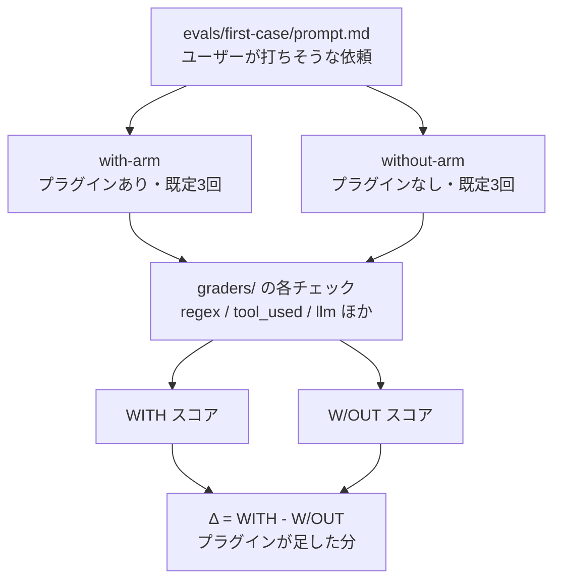
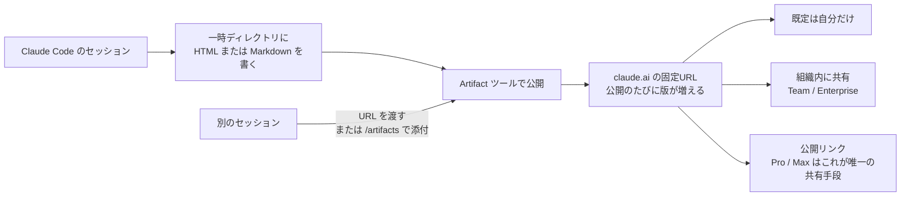
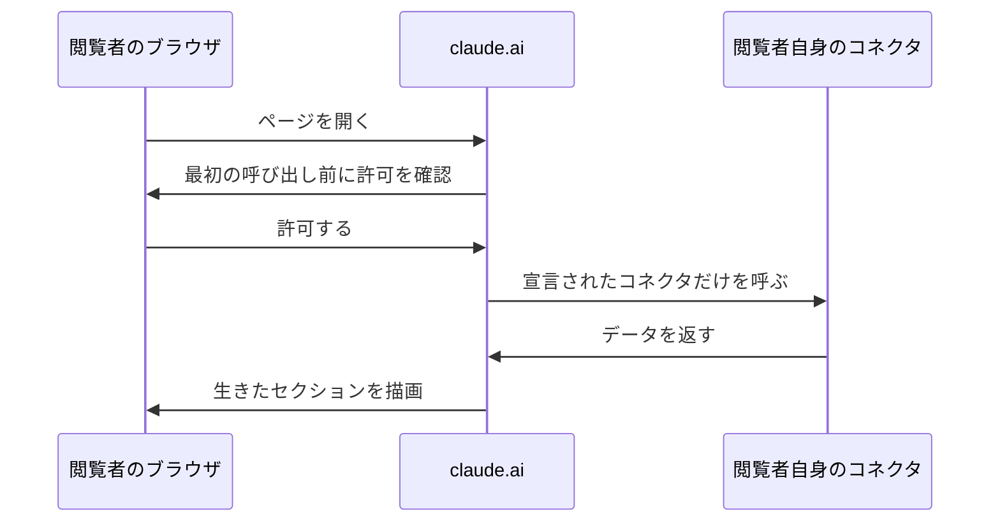

# Claude Daily — 2026-09-12（第021号）

## きょうの3行

- 配ったスキルが本当に効いているかは、`claude plugin eval` で「プラグインなしとの差」を測ると数字で分かります。
- 深掘り連載 第15回は Artifacts。セッションの成果物を1枚のページとして公開し、同じ URL のまま更新し続ける仕組みを整理します。
- Claude Code v2.1.269 が出ました。項目数が非常に多い回で、`claude plugin eval` の追加と `/output-style` の復活が目玉です。

---

## ① ベストプラクティス — 配るスキルに回帰テストを付ける

### 何を解決するのか

チームにスキルやプラグインを配ったあと、「効いているかどうか」を確かめる手段がないまま運用している人は多いはずです。手元で2〜3回試して良さそうだから配る。モデルが更新される。`description` を1行直す。そのたびに挙動は変わりますが、変わったことに気づく仕掛けがありません。

v2.1.269 で追加された `claude plugin eval` は、この穴を埋めるコマンドです。**ケース（ユーザーが打ちそうな依頼）とグレーダー（合否判定）を書いておくと、プラグインを読み込んだ状態と読み込まない状態の両方で実行し、スコアの差 `Δ` を出します。** ここが重要で、スコアが高いことと「プラグインのおかげで高い」ことは別物です。プラグインなしでも 1.0 なら、そのケースはプラグインの働きを測れていません。

出典: [Test plugins with evals — Claude Code Docs](https://code.claude.com/docs/en/plugin-evals)

### 仕組みの図



図1: 1ケースは既定で6回走る。見るのは絶対値ではなく Δ

### そのままコピペして動く形

プラグインのルート（`plugin.json` か `.claude-plugin/plugin.json` があるディレクトリ）で作業します。ケースは1件ずつディレクトリになり、次の形に収まります。

```text
my-plugin/
├── .claude-plugin/plugin.json
├── skills/
└── evals/
    ├── commit-message/
    │   ├── prompt.md
    │   └── graders/
    │       ├── criteria.md
    │       └── skill-fired.md
    └── results/
```

まず依頼文。`evals/commit-message/prompt.md` を次の内容にします。フロントマターが実行条件、本文がそのまま Claude に届くメッセージです。**スキル名を書かず、ユーザーが実際に打つ言い回しにする**のが肝心で、そうしないと「呼べば動く」ことしか測れません。

```markdown
---
max_turns: 10
timeout_seconds: 300
allowed_tools: [Read, Glob, Grep, Skill]
---

コミットメッセージを書いてください。getUser を fetchUser に改名して、呼び出し元3か所を直しました。
```

次に判定。`evals/commit-message/graders/criteria.md` は判定モデルに読ませるルーブリックです。PASS と FAIL を具体的な条件として書きます。

```markdown
---
type: llm
weight: 2
---

PASS if 1行目が50文字以内の要約で、本文に「getUser」「fetchUser」の両方が含まれ、改名であることが分かる。
FAIL if 1行目が長文である、または改名の対象名が書かれていない。
```

もう1本、経路を見るグレーダーを `evals/commit-message/graders/skill-fired.md` に置きます。`your-skill-name` は `SKILL.md` の `name` に置き換えてください。

```markdown
---
type: tool_used
tool: Skill
input_match: '"skill"\s*:\s*"(?:[\w-]+:)?your-skill-name"'
---
```

あとは走らせるだけです。プラグインのルートで次の1行を打ちます。初回は `Trust this plugin directory?` と聞かれるので `y` と答えます。

```bash
claude plugin eval .
```

CI に置くときは、承認待ちで止まらないよう `--trust-plugin` を渡し、モデルを固定し、上限費用を決めます。次はそのまま貼れる1コマンドです。

```bash
claude plugin eval . \
  --trust-plugin \
  --json results.json \
  --threshold 0.8 \
  --model claude-sonnet-5 \
  --judge-model claude-haiku-4-5 \
  --no-publish \
  --max-cost-usd 20
```

終了コードは 0 が全ケース合格、1 が閾値割れ・ケース読み込み失敗・信頼されていないディレクトリ、2 が費用上限などによる途中終了（`results.json` に `partial: true` が入る）です。ジョブの合否はこの終了コードだけ見れば足ります。

### アンチパターン

**スコアだけ見て Δ を見ない。** `WITH 1.00` に安心して配る。ところが `W/OUT` も 1.00 だと、そのケースはモデルが元々できることを測っているだけで、プラグインを削除しても誰も困りません。失敗の仕方はここで、**プラグインが壊れても数字が下がらないため、回帰テストとして機能しない**ことです。Δ が 0 付近のケースは、依頼の言い回しをもっと自分の領域に寄せるか、ケースごと捨てます。

**判定を全部 `llm` グレーダーにする。** 判定モデルは同じ出力でも回によって票が割れます。特に長いテキストほどぶれます。生成ファイルのような長い出力は `regex` グレーダーで `target: { source: file, path: ... }` を見るほうが安定し、しかも判定モデルを呼ばないので費用もかかりません。`llm` は短い出力のルーブリックに絞ります。

**`--threshold` を既定の 1.0 のまま CI に置く。** 既定は「3回全部が満点」で、非決定的なエージェントに対しては厳しすぎます。3回中1回のゆらぎでビルドが赤くなり、やがて誰も見なくなります。0.8 前後から始めて、赤くなったときに中身を読む運用にします。

**`tool_used: Skill` のグレーダーで Δ を稼げると思う。** 二腕実行では、`tool` が `Skill` のグレーダーと `arm: with-only` を付けたグレーダーは**両方の腕でスコアから除外**されます。プラグインなしでは絶対に通らない判定を数えると without 側が不当に 0 に寄り、Δ が水増しされるためです。レポート上は合否の表示だけ残ります。「スキルを呼んではいけない」ケースを作るときだけ、`min: 0` / `max: 0` に `arm: both` を添えます。

---

## ② 深掘り連載 第15回 — Artifacts：成果物を共有可能な形で出す

### なぜ重要か

ターミナルの出力は、書いた本人以外には読みにくいものです。調査の途中経過、PR の解説、ダッシュボード、移行チェックリスト。どれも「読む」より「見る」ほうが速いのに、共有手段がスクロールバックのコピペしかないと、結局あとで人が書き直すことになります。

Artifacts（アーティファクト、セッションから claude.ai 上に公開される1枚のウェブページ）は、この書き直しをなくすための機能です。ページは **同じ URL のまま更新され**、開いている人の画面もその場で変わります。長時間タスクの進捗を貼り出しておくような使い方ができます。

出典: [Share session output as artifacts — Claude Code Docs](https://code.claude.com/docs/en/artifacts)

### 仕組みの図



図2: 公開先は1つの URL。共有範囲はページ側の Share で決める

### 具体的な使い方

作るのは依頼するだけです。「この PR を注釈つきの差分で説明するページを作って」のように、**文章より見たほうが速いもの**を頼みます。場所を指定しなければ、Claude はプロジェクトの外の一時ディレクトリにファイルを書いてから公開します。

一度承認すると以後は無確認で再公開されますが、コネクタ呼び出しやファイルダウンロードといった実行時の能力を宣言したとき、公開リンクにしたあと、最新版を見せる形で共有したあとは、再び確認が入ります。

過去のアーティファクトは `/artifacts` で一覧できます。`o` でブラウザ、`c` でリンクのコピー、`Enter` で現在のセッションに添付です（v2.1.208 以降。`Enter` の挙動は v2.1.216 で添付に変わりました）。**別セッションから更新したいときは、URL を渡すか `/artifacts` で添付するかのどちらかが必須**です。どちらもしないと、新しいアーティファクトが別に作られます。読者がブックマークしている URL を増やしてしまう事故はここで起きます。

生きたデータを載せたいときは、claude.ai 側のコネクタを使います。ローカルの `.mcp.json` のサーバーはページを組み立てる材料にはなりますが、公開後のページからは呼べません。



図3: 呼び出しは公開者ではなく閲覧者のアカウントで走る

この経路には実務上の含みがあります。同じダッシュボードでも、見る人のアカウントが繋がっている範囲しか見えません。つまり**共有前提のページでは、コネクタ未接続の人に何を接続すればよいか示すフォールバックを各セクションに入れておく**必要があります。なお、コネクタを呼ぶアーティファクトはどのプランでも公開リンクにはできません。

### 使うべき時／使うべきでない時

| 向いている | 向いていない |
|---|---|
| 注釈つきの差分・レビュー導線 | ルーティングのある社内ツール（バックエンドを持てない） |
| 収集済みデータのダッシュボード | 大量の生データをそのまま載せる（16 MiB 上限・トークン費用） |
| 案を横並びで比較する | 閲覧者の認証が必要なもの（ページ自身は認証できない） |
| 長時間タスクの進捗ボード | 外部 API を直接叩きたいもの（CSP で遮断される） |

制約は仕様として押さえておきます。公開できるのは `.html` / `.htm` / `.md` のみ、UTF-8（または BOM つき UTF-16LE）でデコードできること、描画後 16 MiB 以内。外部リクエストは Google Fonts と4つの CDN ホストだけが通り、外部画像・その他のスクリプト・スタイルシートは CSP で遮断されます。相対リンクは解決されないので、複数節はページ内アンカーで繋ぎます。

見た目をプロダクトに揃えたいときは、`CLAUDE.md` にデザイントークンを書いておきます。Claude は自前の判断より**プロジェクトのデザインシステムを優先**します。

```markdown
## Design system

- Colors: primary #1a4d8f, accent #f59e0b, surface #f8fafc
- Typography: Inter for body, JetBrains Mono for code
- Spacing: 8px scale, 6px border radius
```

切りたいときは `/config` の Artifacts 行（`"enableArtifact": false` が書かれます）、`CLAUDE_CODE_DISABLE_ARTIFACT=1`、`permissions.deny` に `Artifact` の3通りです。なお、`domain:` の付かない `WebFetch` の deny ルールではアーティファクトは止まりません。

---

## ③ すぐ効くTIPS

### 1. `/output-style` が戻ってきた

出力スタイル（口調と既定の出力形式を毎ターン変える設定）は `/config` から選ぶ方式でしたが、v2.1.269 で `/output-style [name]` が追加され、Remote Control 経由やクラウド・ヘッドレスのセッションでも一覧と切り替えができるようになりました。**メニューを開けない実行形態でスタイルを変えられる**のが効きどころです。ドキュメントの Output styles ページには「v2.1.91 で削除」という注記が残ったままなので、CHANGELOG のほうが新しい状態です。

出典: [CHANGELOG v2.1.269](https://github.com/anthropics/claude-code/blob/main/CHANGELOG.md)

### 2. `bashEditDiffEnabled` で Bash 由来の編集を差分で受け取る

`sed` やフォーマッタのように Bash 経由でファイルが書き換わると、これまで Claude は結果を見るために読み直す必要がありました。v2.1.269 の `bashEditDiffEnabled` を有効にすると、**Bash ツールがファイルを編集した場合に、その差分がツール結果に付いて返ります**。読み直しの1往復が減り、意図しない書き換えにもその場で気づけます。

### 3. `OTEL_METRICS_INCLUDE_REPOSITORY` で計測をリポジトリ単位に割る

チーム展開の効果測定でいちばん困るのは「どのリポジトリの話か分からない」ことです。v2.1.269 で追加されたこの環境変数を立てると、OpenTelemetry のメトリクスとイベントに `vcs.*` のリポジトリ属性が付きます。`OTEL_LOG_TOOL_DETAILS` を併用すると、コミットイベントに `vcs.ref.head.*` も乗ります。

---

## ④ 事例

### Qonto — 承認ゲートを挟んだ業務エージェント（一次情報）

欧州8市場・60万社超の小規模事業者向け金融プラットフォーム Qonto は、給与計算や請求書処理を担う「オペレーターエージェント」と、財務の示唆を返す「アナリストエージェント」をアプリに組み込みました。15人の AI Lab が 2025年11月から6週間で構築し、複雑な処理に Opus 4.5 と Sonnet、単純な処理に Haiku と使い分けています。振込は2倍、請求書作成は3倍、給与処理は5倍の速さになり、最大10万ユーロの振込までエージェントに任せています。

肝は速度そのものではなく設計です。**金融的な動作にはすべて人間の承認ゲートを置き、エージェントは準備と提案までしかしない**という切り分けを最初に決めています。社内業務に Claude を入れるときも、「どこまでを下書きとするか」を先に決めておくと、権限設計とレビュー体制が一本の線で繋がります。

出典: [How Qonto delegates financial admin for small businesses with Claude on Amazon Bedrock](https://claude.com/customers/qonto)

### Artifacts を日次のまとめに使おうとした報告（二次情報）

AI 動向のまとめを毎日 Markdown で出していた方が、それを絞り込めるダッシュボードに変えようとして Artifacts を試した、という報告があります（Zenn、2026年6月19日）。試作までは進んだものの当時は公開できず、その原因を「Team / Enterprise 限定だったため」と書いています。記事では `claude -p` の非対話実行でも公開ツールが現れなかったことも報告されています。

ただし**現在の公式ドキュメントでは Pro・Max・Team・Enterprise が対象**で、Pro と Max では「公開リンクが唯一の共有手段」という形になっています。6月時点の観測としては正しく、いまは前提が変わっています。アーティファクトが出てこないときは、まずプランではなく [Availability の条件](https://code.claude.com/docs/en/artifacts)（`/login` 済みか、API キーやゲートウェイ経由でないか、Bedrock / Vertex / Foundry でないか）を上から確認するのが早道です。

出典: [Claude Code Artifactsを試したら、Team/Enterprise限定で自分には使えなかった話（Zenn）](https://zenn.dev/lnest_knowledge/articles/claude-code-artifacts-verification)

---

## ⑤ 速報 — 新機能・変更点

前回チェック（v2.1.268）以降の差分です。v2.1.269 は項目数が非常に多い回で、ここでは開発と業務展開に効くものに絞ります。

| いつ | 何が | どう効くか |
|---|---|---|
| v2.1.269 | `claude plugin eval` が追加 | プラグイン／スキルをケースとグレーダーで採点し、プラグインなしとの差 `Δ` を出せる。JSON と HTML レポート付き（本日の①） |
| v2.1.269 | `/output-style [name]` が追加 | 出力スタイルの一覧と切り替えが、Remote Control・クラウド・ヘッドレスからもできる |
| v2.1.269 | `bashEditDiffEnabled` | Bash ツールがファイルを編集したとき、差分がツール結果に付く |
| v2.1.269 | `OTEL_METRICS_INCLUDE_REPOSITORY` | メトリクスとイベントに `vcs.*` のリポジトリ属性が付く。`OTEL_LOG_TOOL_DETAILS` 併用でコミットイベントに `vcs.ref.head.*` |
| v2.1.269 | `CLAUDE_CODE_WORKFLOW_MAX_CONCURRENT_AGENTS`（1〜256） | Workflow ツールの1実行あたり同時エージェント数の上限を上げられる |
| v2.1.269 | `!` で始まる deny／ask ルールの適用範囲を修正 | そのルールを書いた設定ソース内にだけ効くようになり、裸の `!` 否定は無視される |
| v2.1.269 | コンパクション後に伝える git status を修正 | セッション開始時点ではなく現在の状態が渡る |
| v2.1.269 | プロンプトキャッシュの破壊を2件修正 | 出力上限で切れて自動再開した次のターン、および思考の途中で中断したセッションの再開時 |
| v2.1.269 | クラウドの定期実行まわりを修正 | 一度きりの定期実行が稀に二重に走る問題、サブエージェントを使う実行が早期に完了扱いされる問題 |
| v2.1.269 | `/ultrareview --post` の挙動を変更 | 所見が出た時点で直接 PR にコメントし、リンクを表示する（別のクラウドセッションを起こさない） |

Platform リリースノートと anthropic.com/news は 9/10 から新規なし（いずれも前号で既報）。anthropic.com/engineering も 4/23 から更新がありません。claude.com/customers は 9/4 の Carvana が最新です。

---

## ⑥ コマンド早見

| コマンド | 何をするか |
|---|---|
| `claude plugin eval init` | 対話でプラグインの eval ケースとグレーダーを作らせる |
| `claude plugin eval init --bare first-case` | 空のケース雛形だけを作る（対話なし） |
| `claude plugin eval .` | いま立っているプラグインの全ケースを実行する |
| `claude plugin eval . --case first-case --runs 1 --ablation none` | 1ケースを片腕1回だけ回す（反復用の安い実行） |
| `claude plugin eval --help` | オプションの全一覧を出す |
| `claude --version` | 入っている Claude Code のバージョンを見る |
| `claude update` | Claude Code を更新する |
| `/artifacts` | 自分のアーティファクトと共有されたものを一覧する |
| `/output-style` | 出力スタイルを一覧して切り替える |
| `/config` | 設定メニューを開く |
| `/design` | 指示からデザインキャンバスを下書きして公開する |

---

## ⑦ きょうの課題

**お題**: 自作スキルが「効いている」かどうかを、数字で1回だけ確かめる。

前提: Claude Code v2.1.269 以降（`claude --version` で確認、古ければ `claude update`）と、テストしたいスキルを1つ含むプラグインディレクトリ。プラグインをまだ持っていない場合は、Next.js プロジェクトの中で `claude plugin init nextjs-kit --with skills` を実行し、生成された `skills/` に「API ルートの雛形を作る」程度の小さなスキルを1つ置いてください。

手順:

1. プラグインのルートに移動し、`claude plugin eval init --bare route-handler` を実行する。`evals/route-handler/prompt.md` と `graders/criteria.md` ができる。
2. `prompt.md` の本文を、**スキル名を書かずに**「app ディレクトリに /api/health のルートハンドラを追加して」のような依頼文に置き換える。フロントマターは `max_turns: 10` と `allowed_tools: [Read, Glob, Grep, Skill]` にする。
3. `graders/criteria.md` の本文を、PASS と FAIL の条件が1行ずつ書かれたルーブリックに置き換える。
4. `graders/skill-fired.md` を新規に作り、`type: tool_used` / `tool: Skill` / `input_match` に自分のスキル名を書く。
5. まず安く回す: `claude plugin eval . --case route-handler --runs 1 --ablation none`。ここは動作確認だけ。
6. 次に本番: `claude plugin eval .`。表の `WITH` `W/OUT` `Δ` を読む。

確認方法: 表の `Δ` が正の値になっているか。レポート（`Report:` のパス、または `Published:` の URL）を開き、失敗したグレーダーの説明を読む。

── 模範解答 ──

手順5と手順6でスコアの出方が変わるのが正解です。`--ablation none` は片腕しか走らないので表は `SCORE` と `PASS%` になり、手順6の二腕実行では `WITH` / `W/OUT` / `Δ` になります。1ケース＝6回（3回×2腕）走るので、所要は1分前後、費用は数十セント規模です。

**なぜそうなるのか。** `Δ` は「プラグインを読み込んだ腕のスコア」から「何も読み込まない腕のスコア」を引いた値です。Next.js のルートハンドラ程度なら、モデルはスキルがなくても書けます。つまり `W/OUT` は高く出て、`Δ` は 0 付近になりがちです。これは失敗ではなく**測れているサイン**で、「このスキルは、その依頼文に対しては何も足していない」という事実が出ただけです。スキルの価値がプロジェクト固有の規約（レスポンス形式、エラーハンドリングの型）にあるなら、その規約を満たしているかどうかをルーブリックに書き足すと、初めて `Δ` が立ち上がります。

**よくある詰まりどころ。**

- `Trust this plugin directory?` で止まる。手元では `y` で進み、CI では `--trust-plugin` を渡します。`--json` を付けた実行は聞き返せないので、渡さないと終了コード1で拒否されます。
- `--json output path must end in .json` と言われる。ターゲット（`.`）を `--json` より**前**に置いていないためです。`claude plugin eval . --json` の順にします。
- `Δ` が負になり、`tool_used: Skill` は通っている。プラグインではなく判定モデルを疑います。`--judge-model sonnet` で回し直し、書式の違いで落ちないようルーブリックを締めます。
- 実行の途中でプランの利用上限に当たる。以後の実行はエラーのまま採点されて 0 点に寄りますが、`partial` は付きません。`NOTES` 列か JSON の `cases[].arms.with[].error` を先に見てから、スコアを信じてください。
- `@path` を書いてもファイルは添付されません。読ませたいものは `allowed_tools` でツールを渡すか、`case.yaml` の `context.add_dirs` に置きます。

---

あすの予告: 深掘り連載 第16回は「settings.json 全体像（permissions / env / model）」です。
