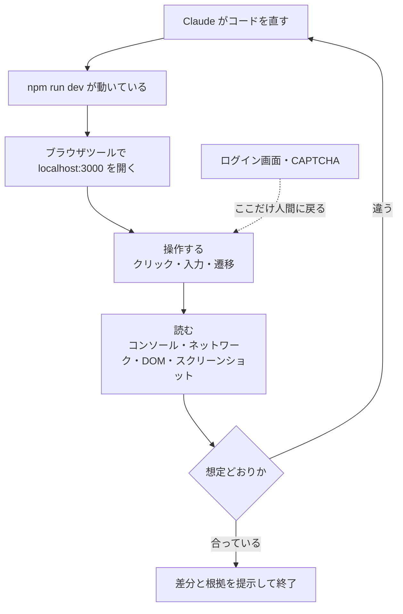
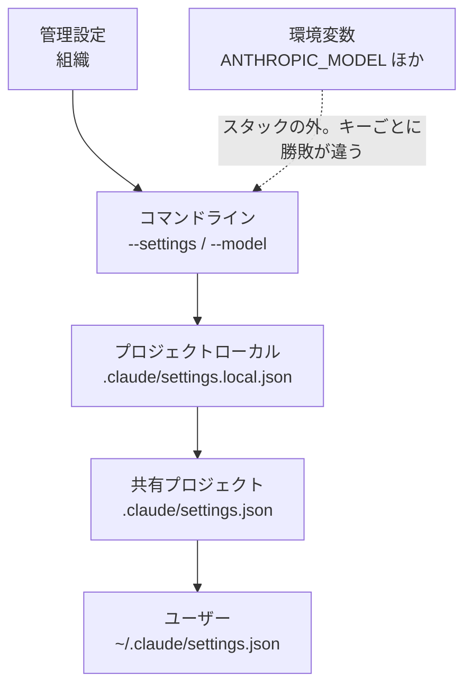
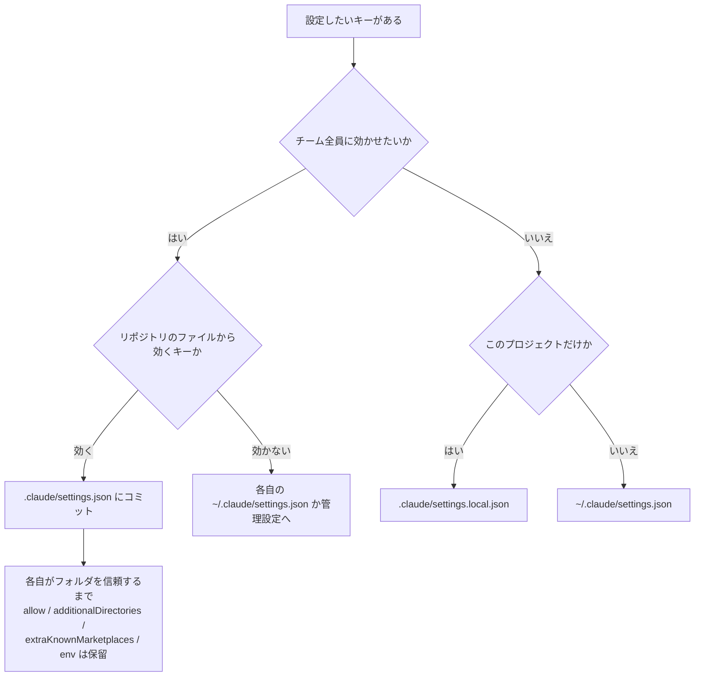

# Claude Daily — 2026-09-13（第022号）

## きょうの3行

- UI の確認を自分の目でやっている間は、Claude は「たぶん動いた」で止まります。ブラウザを繋いで、画面とコンソールを Claude 自身に読ませると検証ループが閉じます。
- 深掘り連載 第16回は settings.json の全体像。5段の優先順位・リストのマージ・環境変数がスタックの外にいること、この3つで「効かない設定」のほとんどが説明できます。
- Claude Code v2.1.270 が出ました。中身は v2.1.269 の回帰修正1件だけです。

---

## ① ベストプラクティス — 画面の確認までを Claude に閉じさせる（Chrome 連携）

### 何を解決するのか

Next.js の開発で、いちばん人間の手が残っているのは「ブラウザで見る」工程です。Claude がコンポーネントを直す、`npm run dev` が通る、ここまでは自動で進む。そのあと自分でブラウザを開き、フォームを送り、DevTools を見て、「ここが崩れている」と言葉にして戻す。この往復がある限り、Claude は毎回あなたを待ちます。

公式のベストプラクティスは、この問題を一般形でこう書いています。**Claude が自分で走らせられるチェックを渡すと、あなたが見ているセッションと、離席できるセッションの差になる。** テストやビルドの終了コードはその代表ですが、UI の見た目と挙動はテストにしづらい領域でした。

Chrome 連携は、ここに「ブラウザそのもの」をチェックとして差し込みます。Claude は新しいタブを開き、ページを読み、コンソールとネットワークを読み、クリックし、スクリーンショットを撮ります。ログイン画面や CAPTCHA に当たったら手を止めてあなたに渡します。ブラウザのログイン状態は共有されるので、認証済みの画面もそのまま触れます。

出典: [Give Claude a way to verify its work — Best practices](https://code.claude.com/docs/en/best-practices) ／ [Use Claude Code with Chrome](https://code.claude.com/docs/en/chrome)

### 仕組みの図



図1: 検証の主体がブラウザに移ると、ループは人間を経由せずに閉じる

### そのままコピペして動く形

前提は、Chrome（または Edge / Brave など Chromium 系）に [Claude in Chrome 拡張](https://chromewebstore.google.com/detail/claude/fcoeoabgfenejglbffodgkkbkcdhcgfn) の 1.0.36 以上を入れ、Claude Code で `/login` 済みであること。API キーや `claude setup-token` の長期トークンで認証しているセッションでは、`--chrome` を付けても連携は無効のままです。WSL も対象外です。

立ち上げはこの1行です。

```bash
claude --chrome
```

接続状態は `/chrome` で確認します。`Status: Enabled` と `Extension: Installed` が並べば通っています。

ここからが本題で、**確認の手順を毎回口で言うのをやめて、スキルに固定します。** 次のファイルをそのまま置いてください。

`.claude/skills/ui-check/SKILL.md`

```markdown
---
name: ui-check
description: 開発サーバー上の画面をブラウザで実際に操作して確認する。UIの変更後、コンソールエラーと表示崩れがないかを自分で検証したいときに使う。
disable-model-invocation: true
---

# 画面の動作確認

対象のパス: $ARGUMENTS （省略時は `/` を確認する）

次の順番で実行してください。各ステップの結果は、あなたの所感ではなく
「実際に読み取った値」を根拠として提示すること。

1. `npm run dev` が動いているか確認する。動いていなければバックグラウンドで起動し、
   起動ログに `Ready` が出るまで待つ。ポートは起動ログから読むこと（3000 と決め打ちしない）。
2. ブラウザで `http://localhost:<ポート>$ARGUMENTS` を開く。
3. ページのコンソールを読む。**全件を貼らず**、`error` と `warning` のレベルに絞り、
   同じ内容の繰り返しは1件にまとめて報告する。
4. 主要な操作を1つ実行する（フォームがあれば不正な値で送信し、
   バリデーションのメッセージが出るかを見る。なければ主要なリンクを1つ辿る）。
5. 操作後にもう一度コンソールを読み、3 で無かったエラーが増えていないか比べる。
6. スクリーンショットを撮り、レイアウトの崩れ（要素の重なり・はみ出し・
   意図しない空白）を列挙する。無ければ「無し」と書く。

## 報告の形式

- 開いた URL と最終的な HTTP ステータス
- コンソールのエラー / 警告（レベルと件数、代表メッセージ）
- 実行した操作と、その結果として画面がどう変わったか
- 崩れの一覧（ファイル名と行が特定できるものは併記）
- 総合判定: OK / 要修正（要修正なら、直すべき箇所を1つずつ）

判定が「要修正」のときは、報告だけで終わらせず、原因のコードを直してから
1 に戻ってやり直すこと。2周して直らない場合は、そこで止めて状況を報告する。
```

`disable-model-invocation: true` を入れているのは、この手順が開発サーバーを起動しブラウザを操作する副作用つきの作業だからです。Claude の判断で勝手に走ってほしくない。使うときは自分で `/ui-check /login` のように打ちます。

使えるブラウザツールの一覧を見たいときは、`/mcp` を開いて `claude-in-chrome` を選び、**View tools** を開きます。

### アンチパターン

**1. 「コンソールの中身を全部教えて」と頼む。** 公式ドキュメントが名指しで避けるよう書いている頼み方です。ログは冗長で、Next.js の開発サーバーは HMR の通知だけで何十行も出します。それが全部コンテキストに載ると、肝心のエラー1行が埋もれ、しかも後続のターンで参照されつづけます。上のスキルが「レベルで絞り、重複はまとめる」と指定しているのはこのためです。

**2. Chrome 連携を「既定で有効」にして常用する。** `/chrome` の **Enabled by default** を選ぶと `--chrome` は要らなくなりますが、ブラウザツールの定義が毎セッション常時読み込まれます。ブラウザを使わない日のほうが多いなら、これは払い続ける固定費です。公式も、コンテキスト消費が増えたと感じたらこの設定を切って `--chrome` に戻すよう書いています。UI を触る日だけフラグを付ける、が既定の姿勢として妥当です。

**3. 業務アカウントにログインしたままの普段使いのプロファイルで走らせる。** 連携はブラウザのログイン状態をそのまま共有します。つまり Claude は、あなたがいま入っている全サービスの画面に手が届く状態で動きます。GIF 録画機能も、画面に映っているアカウント情報ごと記録します。ブラウザ操作を AI に任せる場合、ページ内に隠された指示を読んでしまう危険があるため、本番環境・顧客データ・非可逆な操作では使わず、AI 専用の Chrome プロファイルを分けるのが安全、という報告があります（[ブラウザ操作を AI に任せたい話 — Zenn, 2026-04-27](https://zenn.dev/dress_code/articles/954e2108a17e22)、二次情報）。手元の開発サーバーに限って使う、というのがいちばん素直な線引きです。

---

## ② 深掘り連載 第16回 — settings.json 全体像

### なぜ重要か

「設定を書いたのに効かない」は、Claude Code でいちばん頻繁に起きる困りごとです。そして原因はほぼ4通りしかありません。**もっと上の段が同じキーを持っている／そのファイルではそのキーを設定できない／環境変数が別枠で勝っている／ファイルが壊れている。** この4つを切り分けられるようになるのが今日の目標です。

設定ファイルは4つ、それに組織が配る管理設定が加わります。

| スコープ | ファイル | 誰に効くか |
|---|---|---|
| ユーザー | `~/.claude/settings.json` | 自分・このマシンの全プロジェクト |
| 共有プロジェクト | `.claude/settings.json` | そのフォルダで作業する全員（git に入れればチーム全員） |
| プロジェクトローカル | `.claude/settings.local.json` | 自分・このプロジェクトだけ |
| 管理設定 | `managed-settings.json` ほか | 組織が配った全員 |

出典: [Settings files and precedence — Claude Code Docs](https://code.claude.com/docs/en/settings)

### 仕組みの図



図2: 同じキーが複数にあるときは、いちばん上の段の値が使われる

重要なのは、**この順位は「キー単位」で効くこと**です。ファイルごと上書きされるのではありません。さらに、`permissions.allow` のようなリスト型のキーは上書きではなく**合流**します。チームの `.claude/settings.json` が許可したコマンドと、自分の `settings.local.json` が許可したコマンドは、両方とも有効になります。

ただしモデル関連の4キーは合流しません。`fallbackModel`（順序に意味があるため丸ごと）、`modelPicker`（行の集合を混ぜない。プロジェクトとローカルでは無視される）、`availableModels`（管理設定が定義していればそれが絶対）、`modelSettings`（モデル1つずつ解決）です。

### 置き場所を決める



図3: コミットしたのに全員に効かない、は右下の2つが原因

図の右下がつまずきどころです。リポジトリの共有ファイルにも2つの穴があります。ひとつは**そもそもリポジトリのファイルからは読まれないキー**があること。設定リファレンスの索引で Scope 列が `User, local, or managed` `User or managed` `Managed` `Global config` と書かれたキーがそれにあたります。もうひとつは**信頼待ち**で、`permissions.allow`・`permissions.additionalDirectories`・`extraKnownMarketplaces`・大半の `env` は、各自がそのフォルダを信頼するまで効きません。`deny` と `ask` は即座に効きます。安全側に倒す設定は待たされない、と覚えると自然です。

### 環境変数はスタックの外

ここが図2で点線にした部分です。環境変数は優先順位の段ではなく、**キーと変数のペアごとに勝敗が決まります**。`ANTHROPIC_MODEL` をシェルで export すると、どのファイルの `model` よりも優先されます。一方 `ANTHROPIC_DEFAULT_MODEL` は、どのファイルも `model` を設定していないときだけ効きます。同じ「モデルを指定する変数」でも挙動が逆です。迷ったら設定リファレンスのそのキーの項を見る、が正解になります。なお、設定ファイルの中に書く `env` ブロックは普通のキーなので、図2の順位に素直に従います。

### 厳しい値が勝つ例外

管理設定は最上位ですが、**セッションを制限する方向の値は下の段からでも通ります**。管理設定が `false` にしていても、どこかのスコープの `true` が採用される、という向きです。

| キー | 通る値 |
|---|---|
| `disableClaudeAiConnectors` | どのスコープの `true` も |
| `enableArtifact` | どのスコープの `false`（`disableArtifact: true` も同様） |
| `isolatePeerMachines` | どのスコープの `true` も |
| `crossSessionInbound` | プロジェクト / ローカルの、より厳しい値 |
| `maxEffortLevel` | どのスコープの、より低い上限（v2.1.267 以降） |

### 確認する・直す

いま何が読み込まれたかは `/status` の `Setting sources` 行に出ます。ただしこの行は**「どのファイルを読んだか」までで、どのキーがどのファイル由来かは出ません**。弾かれたエントリを一覧したいときは `claude doctor` です。この2つは役割が違うので、順に使います。

保存後の反映も、キーによって分かれます。`permissions` や `hooks` は実行中のセッションに反映されますが、`model` と `effortLevel` / `modelSettings` はセッション開始時に一度だけ読まれます。途中で変えたいなら `/model` と `/effort` を使ってください。

### 使うべき時 / 使うべきでない時

クラウドセッション（Claude Code on the web、`claude --cloud`）は前提が変わります。読まれるのは**リポジトリにコミットされた `.claude/settings.json` とサーバー管理設定だけ**で、`~/.claude/settings.json` と `.claude/settings.local.json` は届きません。定期実行や web からのセッションでも効かせたい設定は、共有ファイルにコミットするしかない、ということです。逆に、手元でだけ有効にしたい実験は `.claude/settings.local.json` に置けばクラウドを汚しません。

出典: [Settings files and precedence](https://code.claude.com/docs/en/settings) ／ [All settings](https://code.claude.com/docs/en/settings-reference)

---

## ③ すぐ効くTIPS

### 1. `$schema` を1行足して、設定ファイルに補完と検証を効かせる

settings.json は厳格な JSON で、`//` コメントも末尾カンマも構文エラーになります。キー名のタイポは起動時まで気づけません。先頭に `$schema` を1行足すと、VS Code や Cursor など JSON スキーマに対応したエディタで補完と検証が効くようになり、書いている最中に気づけます。

```json
{
  "$schema": "https://json.schemastore.org/claude-code-settings.json",
  "permissions": {
    "allow": ["Bash(npm run lint)", "Bash(npm run test *)"],
    "deny": ["Read(./.env)", "Read(./.env.*)"]
  }
}
```

なお、スキーマは最新の CLI に遅れることがあります。**最近追加されたキーに警告が出ても、設定が間違っているとは限りません。**

出典: [Edit a settings file](https://code.claude.com/docs/en/settings)

### 2. プランモードでも、ブラウザの「読むだけ」は確認なしで走る

プランモードは編集を止めますが、ブラウザツールは読み取りと状態変更で扱いが分かれます。`read_page` / `get_page_text` / `find`、コンソールとネットワークの読み取り、スクリーンショットは確認なしで走り、クリック・入力・遷移・タブ操作・GIF 録画は承認を求めます。だから**調査だけならプランモードのまま画面を見に行かせられます**。

ただし、読み取り系でも状態を変えるフラグを立てると確認が出ます（スクリーンショットの `save_to_disk`、コンソール / ネットワーク読み取りの `clear`、`tabs_context_mcp` の `createIfEmpty`）。`browser_batch` は中身が全部読み取りのときだけ無確認です。

出典: [Browser tools in plan mode](https://code.claude.com/docs/en/chrome)

### 3. `~/.claude.json` が壊れたら、手で直す前にバックアップを見る

設定ファイルとは別に、Claude Code が自分用に書く `~/.claude.json` があります（サインイン状態、MCP サーバー設定、プロジェクトごとの信頼判断など）。これが壊れると Configuration error になり、終了して手で直すか既定値にリセットするかを聞かれます。ここでリセットを選ぶ前に見るべき場所があります。**Claude Code はこのファイルを書く前に毎回バックアップを取っており、直近5件が `~/.claude/backups/` に `.claude.json.backup.<timestamp>` として残っています。** 壊れた現物も `.claude.json.corrupted.<timestamp>` として同じ場所に退避されます。書き戻せば、信頼判断や MCP 設定をやり直さずに済みます。

出典: [Fix a broken settings file](https://code.claude.com/docs/en/settings)

---

## ④ 事例

一次情報側（`claude.com/customers`）は 9/4 の Carvana から追加がありません。今日は Chrome 連携に関する日本語の実践報告を2本、いずれも**二次情報**として扱います。

### 1. 非エンジニアが画面の動作確認を担当する（業務展開の観点）

PURPM MEDIA LAB の coa00 氏が、コードを書かずに Web アプリの動作確認を Claude に任せた手順を公開しています（[Claude Code の Chrome 拡張で Web アプリの動作確認を行う — Zenn, 2026-06-30](https://zenn.dev/purpom/articles/test-automation-for-non-engineers-claude-chrome)、二次情報）。手順は、拡張を入れる → `/chrome` で接続 → 日本語で「ログインしてトップ画面が表示されるか確認」と頼む、の3つだけです。**パスワード入力だけは自分でやり、残りは Claude が操作した**とのこと。所要時間はログイン確認が約5分、主要20画面の表示確認が約10〜15分、全体で約30分という報告です。詰まった点として「複数のツールを立ち上げていると対象が曖昧になった」が挙げられ、URL を明示し直して解決したとあります。

この事例が業務展開として効くのは、**リグレッション確認という、これまでエンジニアの時間を使っていた作業を、仕様を知っている非エンジニアに渡せる形にしている**点です。確認の手順を①のようなスキルに固定しておけば、頼む側は自然文で呼ぶだけで済みます。

### 2. 「どこまで任せるか」を先に決めた報告

dress_code 社の記事は、同じ機能をテストデータ投入と動作確認に使ったうえで、線引きを明示しています（[ブラウザ操作を AI に任せたい話 — Zenn, 2026-04-27](https://zenn.dev/dress_code/articles/954e2108a17e22)、二次情報）。管理画面へのダミーデータ投入では、電話番号の形式エラーを AI 自身が読み取って値を修正し再送信するところまで完走し、1項目あたり5〜10秒程度だったとのこと。一方で、**本番環境・顧客データや認証情報を含む業務・削除や外部送信のような非可逆な操作では使わない**と明記し、AI 専用の Chrome プロファイルを分けることを推奨しています。理由として、ページ内の非表示フィールドやコメントに指示を仕込まれる可能性（プロンプトインジェクション）と、UI・データ・命令の分離が失われて事故の原因特定が難しくなることを挙げています。

---

## ⑤ 速報 — 新機能・変更点

新しいバージョンは v2.1.270 の1本で、中身も1件です。あわせて、前号で扱いきれなかった v2.1.269 の項目から、読者に効くものを拾います。

| いつ | 何が | どう効くか |
|---|---|---|
| v2.1.270 | 読み取り専用の git コマンドが、セッションを長く走らせたあとに突然許可を求めてくる不具合の修正（v2.1.269 の回帰） | `git status` や `git diff` で確認が出るようになっていたセッションが元に戻る |
| v2.1.269 | 日本語・中国語・タイ語など、単語間に空白を置かない言語でプロンプト候補が落ちていた不具合の修正 | 日本語で打っているときの入力補助が機能する |
| v2.1.269 | `Edit()` の deny ルールと書き込みパス検査が、Bash の `tee` が書き込むファイルにも効くように | `Bash(tee:*)` の allow が、作業ディレクトリ外への書き込みまで許してしまう穴がふさがった |
| v2.1.269 | `--output-format stream-json` の `permission_denials` が、パス指定の deny で止めた Read / Edit / Write を落としていた不具合の修正 | ヘッドレス実行の結果から拒否を数えるゲートが正しく動く |
| v2.1.269 | claude.ai から同期されるスキルの名前が `anthropic-skills:<name>` に（他と衝突しなければ素の名前も有効） | クラウドセッションで自作スキルと名前が衝突しにくくなる |
| v2.1.269 | プラグインのアーカイブ展開が、同じマシンの他ユーザーから読めていた／world-writable ビットが残っていた問題の修正 | 共有マシンでプラグインを使う場合の前提が変わる |
| v2.1.269 | VS Code に Hooks ダイアログと Permission rules ダイアログを追加 | フックと権限ルールを、ユーザー / プロジェクト / ローカルのどこに書くか選んで編集できる（管理設定とプラグイン由来は読み取り専用） |

Platform リリースノートは 9/10 の Managed Agents の `auto` から、`anthropic.com/news` は 9/10 の脅威レポートから、`anthropic.com/engineering` は 4/23 から、それぞれ更新がありません。

出典: [Claude Code CHANGELOG](https://github.com/anthropics/claude-code/blob/main/CHANGELOG.md)

---

## ⑥ コマンド早見

| コマンド | 何をするか |
|---|---|
| `claude --chrome` | Chrome 連携を有効にしてセッションを起動する |
| `/chrome` | 接続状態の確認、拡張の再接続、使うブラウザの選択、既定で有効の切り替え |
| `/mcp` | 接続中の MCP サーバーを開く（`claude-in-chrome` → View tools でブラウザツール一覧） |
| `/status` | 読み込まれた設定ファイル（`Setting sources` 行）を確認する |
| `claude doctor` | 設定ファイルで弾かれたエントリを一覧する |
| `claude --settings '{"model": "claude-opus-4-8"}'` | 設定ファイルを書き換えずに、そのセッションだけキーを指定して起動する |
| `/config verbose=true` | メニューを開かずに1つだけ設定を変える |
| `/model` | セッション途中でモデルを切り替える（`model` キーは起動時にしか読まれないため） |

---

## ⑦ きょうの課題

Next.js のプロジェクトで、Claude に「壊れていることを自分で見つけさせる」ところまでやります。15分。

**前提**: Chrome に Claude in Chrome 拡張（1.0.36 以上）を入れ、Claude Code で `/login` 済みであること。手元に `npm run dev` が通る Next.js プロジェクトがあること。

**手順**:

1. ①の `.claude/skills/ui-check/SKILL.md` をプロジェクトに置く。
2. 適当なページのコンポーネントに、わざと実行時エラーを1つ仕込む。たとえば `undefined` になる値に対して `.map()` を呼ぶ、など。**ビルドは通るがブラウザで落ちる**種類の壊し方を選ぶのがポイントです。
3. `claude --chrome` で起動し、`/chrome` が `Status: Enabled` を出すことを確認する。
4. `/ui-check /` を実行する。

**確認方法**: Claude の報告に、あなたが仕込んだエラーのメッセージが**コンソールから読み取った文言として**含まれているか。「エラーがあるようです」ではなく、実際のスタックトレースやメッセージが根拠として出ていれば成功です。

── 模範解答 ──

**期待される動き**: Claude は `npm run dev` の起動ログからポートを読み、ブラウザで開き、コンソールのエラーを読み、該当のコンポーネントを特定して修正し、もう一度開いてエラーが消えたことを確認してから報告します。スキルの最後に「要修正なら 1 に戻る」と書いてあるため、報告だけで止まりません。

**なぜそうなるのか**: 従来、実行時エラーは「人間がブラウザを開いて初めて観測される情報」でした。Claude 側からは `npm run dev` が正常終了して見えるので、検証のしようがなかったわけです。ブラウザツールが入ると、この情報が Claude の読める場所に移ります。ベストプラクティスが「チェックを渡す」と呼んでいるのは、この**観測できる場所を移す**操作のことです。

**よくある詰まりどころ**:

- **拡張が検出されない**: 初回に native messaging host の設定ファイルが書かれ、Chrome はこれを起動時にしか読みません。**Chrome を再起動**してから `/chrome` → Reconnect extension を試してください。
- **長いセッションの途中で効かなくなる**: 拡張の service worker がアイドルで落ちます。`/chrome` の Reconnect extension で復帰します。
- **報告が「コンソールにエラーはありません」になる**: ページを開いた直後に読んでいる可能性があります。スキルの手順4（操作）を経てから手順5でもう一度読ませる構造にしているのはこのためです。エラーが操作後にしか出ない場合、1回だけの読み取りでは拾えません。
- **API キー認証のセッションで `--chrome` が無視される**: 仕様です。`/login` でサインインし直してください。

---

あすは連載 第17回「サブスクリプションと利用形態（CLI / IDE / Web / デスクトップ）の使い分け」を扱います。
