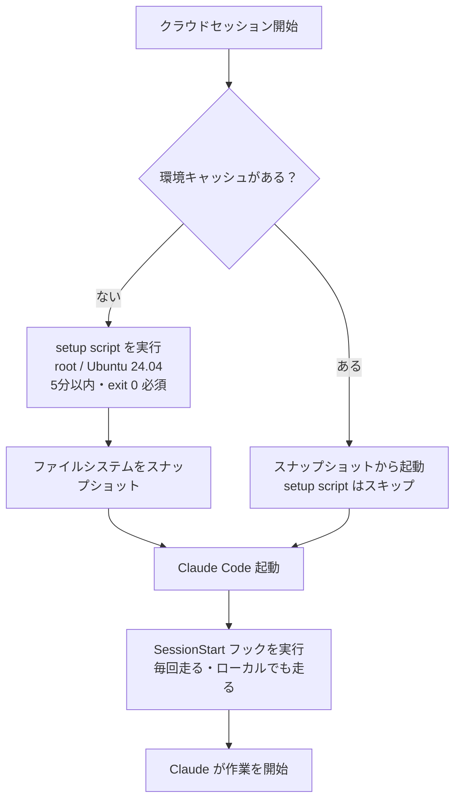
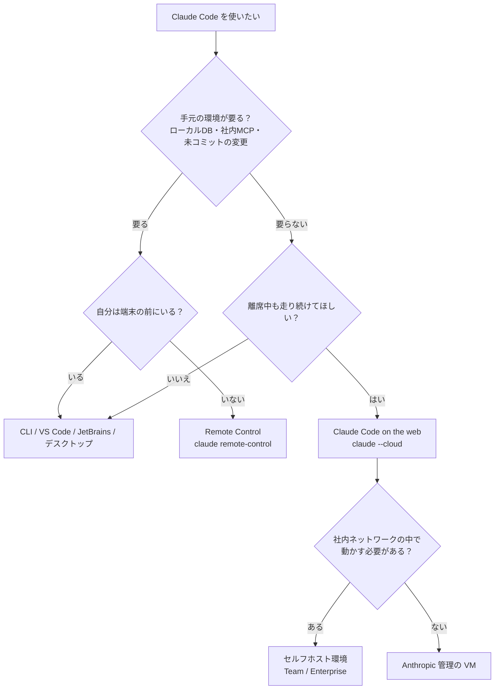
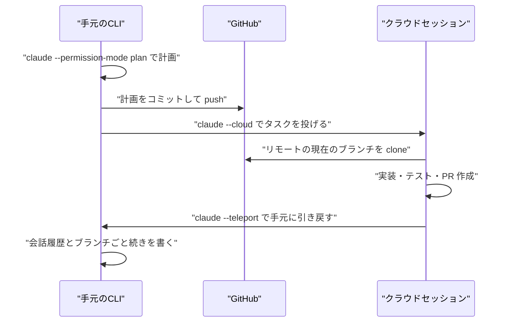

# Claude Daily — 2026-09-14（第023号）

## きょうの3行

- クラウドセッションはリポジトリの中身しか持っていきません。手元でだけ動く設定は全部消えるので、**動く状態そのものをリポジトリに入れて渡す**のが今日の型です。
- 深掘り連載 第17回は利用形態の使い分け。CLI・IDE・デスクトップ・Web・モバイルは同じエンジンですが、**「どこで Claude が動くか」**が違い、それが使える機能を決めます。
- 本日は CHANGELOG・Platform リリースノート・公式ニュースいずれも新規なし。速報は「該当なし」です。

---

## ① ベストプラクティス — クラウドで動く状態をリポジトリに入れて渡す

`claude --cloud`、claude.ai/code、Routines、モバイルアプリ、Claude Tag。これらはすべて同じ「クラウドセッション」で動きます。そしてクラウドセッションは、**あなたのリポジトリを clone しただけの、まっさらな Ubuntu 24.04 の VM** から始まります。

ここでいちばん多い失敗は、手元では動くのにクラウドでは動かない、というものです。原因はほぼ一つで、**ユーザーレベルの設定はクラウドに届かない**からです。

### 何が届いて、何が届かないのか

| 届く | 届かない |
|---|---|
| リポジトリの `CLAUDE.md` | ユーザーの `~/.claude/CLAUDE.md` |
| リポジトリの `.claude/settings.json`（フック含む） | ユーザーの `~/.claude/settings.json` |
| リポジトリの `.claude/skills/` `.claude/agents/` `.claude/commands/` | ユーザーの `~/.claude/skills/` など |
| リポジトリの `.mcp.json`（`claude mcp add --scope project` が書く） | `claude mcp add` をローカル／ユーザースコープで入れたサーバー |
| リポジトリの `.claude/settings.json` で宣言したプラグイン | ユーザー設定だけで有効化したプラグイン |
| 組織のサーバー管理設定（Anthropic のサーバーから取得） | MDM で端末に配った管理設定 |

公式ドキュメントの言い方はシンプルです。「自分の設定をクラウドセッションでも使えるようにするには、リポジトリにコミットしてください」。

### 仕組み — 起動の順番を押さえる

クラウドセッションの起動には2つの拡張点があり、**走る順番と走る場所が違います**。ここを混ぜると設定が効きません。



図1: setup script は「VM を作る」フェーズでキャッシュされ、SessionStart フックは「プロジェクトを準備する」フェーズで毎回走る

分担の基準は一行で言えます。**プリインストールされていないツールチェーン（.NET SDK、ShellCheck など）は setup script、リポジトリの依存関係のインストールは SessionStart フック**です。理由は、setup script が環境キャッシュにスナップショットされて**2回目以降は走らないから**です。`package.json` を更新しても setup script は再実行されません（再実行されるのは、スクリプトや許可ドメインを変えたときと、キャッシュが約7日で期限切れになったときだけです）。

なお、Node.js は 20 / 21 / 22 が、npm・yarn・pnpm・eslint・prettier・chromedriver とあわせて最初から入っています。Next.js のリポジトリなら、追加のツールチェーンは基本的に要りません。

### そのまま置ける2ファイル

リポジトリのルートに、次の2つを置いてコミットします。まず設定ファイル。

```json
{
  "$schema": "https://json.schemastore.org/claude-code-settings.json",
  "hooks": {
    "SessionStart": [
      {
        "matcher": "startup|resume",
        "hooks": [
          {
            "type": "command",
            "command": "bash \"$CLAUDE_PROJECT_DIR\"/scripts/setup-session.sh"
          }
        ]
      }
    ]
  }
}
```

`.claude/settings.json` として保存します。`matcher` を `startup|resume` に絞っているのは、`/clear` や圧縮のたびに `npm ci` を走らせても意味がないからです。`$CLAUDE_PROJECT_DIR` はリポジトリのルートに解決されるので、セッションの作業ディレクトリがどこでもスクリプトが見つかります。

次にスクリプト本体です。

```bash
#!/bin/bash
# scripts/setup-session.sh — クラウドセッションだけで依存関係を用意する

# クラウド以外（手元のマシン）では何もしない
if [ "$CLAUDE_CODE_REMOTE" != "true" ]; then
  exit 0
fi

cd "$CLAUDE_PROJECT_DIR" || exit 0

# すでに入っていれば入れ直さない（起動を遅くしない）
if [ ! -d node_modules ]; then
  npm ci || npm install
fi

# ここに「このリポジトリで作業を始める前に必ず要るもの」を書く
# 例: cp -n .env.example .env.local

exit 0
```

`chmod +x` は不要です（`bash <path>` で呼んでいるため）。決め手は `CLAUDE_CODE_REMOTE` の判定で、この環境変数はクラウドセッションの VM でだけ `true` になります。手元では `exit 0` で即座に抜けるので、ローカルの起動は1ミリ秒も遅くなりません。

動作確認は1行です。

```bash
claude --cloud "npm run build を実行して、通るかどうかだけ報告してください"
```

### やりがちな失敗

**失敗1: `npm ci` を setup script に書く。** キャッシュされて2回目以降は走らないので、依存を1つ足した翌日から、クラウドセッションだけが古い `node_modules` で動きます。しかもエラーにならず「なぜかテストだけ落ちる」という形で出るので、原因にたどり着くまで時間がかかります。依存のインストールは毎回走る SessionStart フックの仕事です。

**失敗2: setup script を非ゼロで終わらせる。** setup script が非ゼロ終了すると**セッション自体が起動しません**。`apt install` が一時的にこけただけで作業ができなくなるので、必須でないコマンドには `|| true` を付けます。

```bash
# 危ない
apt update && apt install -y shellcheck

# 安全
apt update || true
apt install -y shellcheck || true
```

**失敗3: `CLAUDE_CODE_REMOTE` の判定を省く。** SessionStart フックはローカルでも走ります。判定を省くと、手元で `claude` を起動するたび・再開するたびに `npm ci` が走り、起動待ちが毎回発生します。フックは `resume` でも発火することを忘れないでください。

**失敗4: `~/.claude/settings.json` にフックを書く。** 上の表のとおり、ユーザーレベルの設定はクラウドに届きません。手元では動いているので、気づくのはクラウドで試したときです。

出典: [Configure cloud environments](https://code.claude.com/docs/en/cloud-environments) / [Use Claude Code on the web](https://code.claude.com/docs/en/claude-code-on-the-web)

---

## ② 深掘り連載 第17回 — サブスクリプションと利用形態（CLI / IDE / Web / デスクトップ）の使い分け

Claude Code は、どの面（surface）でも**同じエンジン**が動きます。にもかかわらず面ごとに向き不向きがはっきり分かれるのは、違うのが「賢さ」ではなく **「Claude がどのマシンで動くか」** と **「そのプランで使えるか」** の2点だからです。

### まず「どこで動くか」で3つに分かれる



図2: 「手元の環境が要るか」と「離席中も走らせたいか」の2問で面が決まる

- **自分のマシンで動く**: CLI、VS Code / JetBrains 拡張、デスクトップアプリ、そして Remote Control。ファイルシステム・ローカル MCP サーバー・ローカルのツールがそのまま使えます。
- **Anthropic のクラウドで動く**: Claude Code on the web、モバイルアプリ、Slack、Routines。まっさらな VM なので手元の環境は使えませんが、端末を閉じても走り続けます。
- **自社インフラで動く**: セルフホスト環境。クラウドセッションの実行先だけを自社のランナーに振り替えるもので、Team / Enterprise プラン向けです。

Remote Control とクラウドセッションは同じ claude.ai/code の画面を使うので混同しやすいのですが、**Remote Control はローカルのセッションを外から操作する窓**であり、Claude は自分のマシンで動き続けます。ドキュメントの言い方では「使い分けは、ローカル作業の途中を別端末から続けたいなら Remote Control、手元のセットアップなしで仕事を投げたい・clone していないリポジトリを触りたい・複数タスクを並列で回したいならクラウドセッション」です。

### 面ごとの向き不向き

| 面 | 向いていること | 特徴 |
|---|---|---|
| CLI | ターミナル中心の作業、スクリプト、リモートサーバー | 最も機能が揃う。Agent SDK とスクリプティングは CLI だけ |
| デスクトップ | 視覚的なレビュー、並列セッション | 差分ビューア、アプリプレビュー、worktree ごとのセッション |
| VS Code / JetBrains | エディタから離れたくないとき | インライン差分、選択範囲の共有、統合ターミナル |
| Web | 舵取りをあまり必要としない長い作業、離席中も進めたい作業 | クラウドで動き、切断しても続く |
| モバイル | 外出先での起動と監視 | クラウドセッション、または Remote Control 経由でローカルセッション |

ローカルの面どうし（CLI・IDE・デスクトップ）では、設定・プロジェクトメモリ・MCP サーバーが共有されます。ここが「同じプロジェクトで面を混ぜてよい」根拠です。

### 面をまたぐ動線



図3: 計画はローカル、実行はクラウド、仕上げはまた手元へ

ここで一つだけ落とし穴があります。`--cloud` が clone するのは**リモートの現在のブランチ**であって、手元のチェックアウトではありません。未コミットの変更は存在しないものとして扱われるので、**投げる前に push する**のが前提です。逆方向の `--teleport` には要件が4つあります。作業ディレクトリがクリーンであること、同じリポジトリ（フォークは不可）のチェックアウトから実行すること、クラウド側のブランチが push 済みであること、同じ claude.ai アカウントであることです。

また、CLI からのハンドオフは**一方通行**です。`--teleport` でクラウドから手元へ引くことはできますが、既存のターミナルセッションを Web へ押し出すことはできません（デスクトップアプリの「Continue in」メニューだけが、ローカルセッションを Web へ送れます）。

### プランで何が変わるか

claude.ai アカウントでのサインインが必要で、API キーや第三者プロバイダーでは使えない機能があります。Claude Code on the web、モバイル、Slack、デスクトップアプリ、Routines（`/schedule`）、Ultrareview、Code Review、Remote Control、Chrome 拡張、computer use、Artifacts、音声入力です。CLI 本体・サブエージェント・フック・スキル・CLAUDE.md・プラグイン・MCP・チェックポイント・サンドボックスは、どのプロバイダーでも動きます。

プラン別では、次のあたりが判断に効きます。

| 機能 | Pro | Max | Team | Enterprise |
|---|---|---|---|---|
| Claude Code on the web | ✓ | ✓ | ✓ | ✓（プレミアムシート等が必要） |
| Routines | ✓ | ✓ | ✓ | ✓ |
| Remote Control | ✓ | ✓ | 管理者が有効化 | 管理者が有効化 |
| computer use / Dispatch | ✓ | ✓ | ✗ | ✗ |
| Code Review | ✗ | ✗ | ✓ | ✓ |
| Artifacts | ✓ | ✓ | ✓ | 管理者が有効化 |
| 分析ダッシュボード | ✗ | ✗ | ✓ | ✓ |
| サーバー管理設定 | ✗ | ✗ | ✓ | ✓ |

個人で使うぶんには Pro / Max のほうが機能が広い一方、**チームで配るための道具（Code Review、分析ダッシュボード、サーバー管理設定、SSO）は Team 以上にしかない**、という非対称があります。ここを知らずに「個人 Max を人数分」で始めると、あとから統制を足せません。

### 使うべき時 / 使うべきでない時

- **クラウドセッションを使うべき時**: 舵取りが少なくて済む作業、clone していないリポジトリ、並列で回したい複数タスク、離席中に進めたい作業。
- **使うべきでない時**: ローカルの DB やローカル MCP が要る作業、大きなビルドやメモリを食うテスト（VM のリソース上限で止められることがあります）、対話で細かく方向修正しながら進める作業。
- **Remote Control を使うべき時**: すでに手元で走っている作業を、席を立ってからも見張りたいとき。ただし**ローカルのプロセスが生き続けている必要があります**。SSH 先で使うなら `tmux` か `screen` の中で起動してください。
- **注意**: 組織が IP 許可リストを使っている場合、Anthropic 管理のクラウドセッションは認証エラーで全滅します（セッションが自社ネットワークから API を呼ぶわけではないため）。Code Review と Routines も同じです。

出典: [Platforms and integrations](https://code.claude.com/docs/en/platforms) / [Feature availability](https://code.claude.com/docs/en/feature-availability) / [Remote Control](https://code.claude.com/docs/en/remote-control)

---

## ③ すぐ効くTIPS

### 1. 走っているクラウドセッションに、どのマシンからでも追伸を送る

クラウドセッションはブラウザを開かなくても追記できます。`claude auth login` 済みのマシンならどこからでも構いません。ローカルのセッション状態を送らないので、セッションを始めたマシンである必要もありません。長い作業の途中で「ついでにこれも」を足すときに、ブラウザを開く手間がなくなります。

```bash
claude -p "ついでに README のセットアップ手順も更新してください" --cloud session_01DiUkqY2kzbUbDmW1w96rfi
```

メッセージをキューに入れて即座に終了します。`--output-format json` を付けると `{ok, session_id, url}` が返るので、CI スクリプトから投げるときはこちらを使います。セッション ID はベアの ID でも `claude.ai/code/<id>` の URL でも受け付けます。

### 2. GitHub 連携がなくてもクラウドへ送れる

git リモートがない、あるいは Claude GitHub App が入っていないリポジトリで `claude --cloud` を打つと、ローカルのリポジトリを束ねてアップロードします。GitLab や Bitbucket のリポジトリを送りたいときは、明示的に強制できます。

```bash
CCR_FORCE_BUNDLE=1 claude --cloud "テストを実行して落ちているものを直してください"
```

効くのは「クラウドの計算資源だけ借りたい」場面です。ただし制約が4つあります。**100MB 以下**であること、**追跡されていないファイルは含まれない**こと（先に `git add` が要ります）、`.env` や `*.pem` のような認証情報らしきファイルの未コミット変更は除外されること、そして**結果を非 GitHub のリモートに push で戻せない**ことです。

### 3. `/autofix-pr` で PR の面倒を1コマンドで預ける

PR のブランチにいる状態でターミナルから打つと、`gh` で対象の PR を検出し、Web セッションを立て、auto-fix を有効にするところまでを1手でやります。CI が落ちたときとレビューコメントが付いたときに、Claude が自分で調べて、確信がある修正なら push します。

```bash
/autofix-pr
```

有効化には Claude GitHub App がリポジトリに入っていることが必要です。**`issue_comment` をトリガーにした自動化（Atlantis や独自の GitHub Actions）があるリポジトリでは使わないでください。** Claude のコメントがあなたのアカウントで投稿されるため、意図しないデプロイが走りえます。

---

## ④ 事例

### クラウドセッションの中では Remote Control が使えない、という確認

Qiita の @kai_kou 氏が、Claude Code on the web のセッションの中から `claude remote-control --help` を実行したところ、`Error: Remote Control is not available inside a cloud session.` で弾かれた、という報告があります（2026-07-12、Claude Code v2.1.207 で確認）。ヘルプの表示すら通らなかったことから、環境チェックが通常の CLI 処理より前に走っていると結論づけています。

技術的には当たり前の話に見えますが、**「どこで動くか」を意識していないと必ず一度は踏む**種類の失敗です。Remote Control は「ローカルで動いているセッションを外から操作する」機能なので、すでに Anthropic のクラウドで動いているセッションの中に入れ子にしても意味がありません。今日の連載の判断フローを一度通しておけば、この手の試行錯誤は省けます。

出典: [Claude Code Remote Controlをクラウド環境で試したら拒否された話（Qiita）](https://qiita.com/kai_kou/items/905e821b79851971cf67)

### チーム展開: 「自由度 → 支払い管理 → コスト管理」の順で決めた組織

ナレッジワークの minodisk 氏が、自社の Claude 導入を4フェーズで振り返った記事を公開しています（Zenn、2026-03-06、二次情報）。

- **フェーズ1**（2025年2月）: API キーのみ。従量課金だが誰がいくら使っているか管理できない
- **フェーズ2**（2025年4〜6月）: 個人で Pro / Max を契約し経費精算。支払いがバラバラ
- **フェーズ3**（2025年8月）: ヘビーユーザーに Team の Premium シート。部分的に統合
- **フェーズ4**（2026年1月）: Team の Standard シートでも Claude Code が使えるようになり、全社的に統合

判断の優先順位を「①自由度（開発者が新しい道具を制限なく試せる）→ ②支払い管理（組織としての一元決済）→ ③コスト管理（上限のある予測可能な支出）」と明示的に置き、②と③のトレードオフは運用でしのぎながらプラットフォーム側の改善を待った、という進め方です。結論は「まず Team の Standard シートで始め、上限に当たった人を Premium に上げる」で、個人 Max の乱立と API 直利用は勧めていません。

シート単価やプランの詳細は変わりうるので、導入時は公式の料金ページで確認してください。**参考にすべきは金額ではなく、「何を優先順位の1位に置いたか」を先に決めてからプランを選んでいる点**です。

出典: [Claude Codeを組織導入するためのプラン選定ガイド（Zenn / ナレッジワーク）](https://zenn.dev/knowledgework/articles/claude-code-organization-plan-guide)

---

## ⑤ 速報 — 新機能・変更点

**本日は特筆すべき発表はありませんでした。** 前回チェック（2026-09-13）以降、巡回先のいずれにも新規の更新がありません。

| いつ | 何が | どう効くか |
|---|---|---|
| — | Claude Code CHANGELOG は v2.1.270 のまま | 新しいバージョンなし |
| — | Platform リリースノートは 9/10 のまま | Managed Agents の `auto` と `ant beta:sessions connect` が最新（第020号で既報） |
| — | anthropic.com/news は 9/10 のまま | 脅威レポートが最新（第020号で既報） |
| — | anthropic.com/engineering は 4/23 のまま | 新規記事なし |

出典: [Claude Code CHANGELOG](https://github.com/anthropics/claude-code/blob/main/CHANGELOG.md) / [Platform リリースノート](https://platform.claude.com/docs/en/release-notes/overview)

---

## ⑥ コマンド早見

| コマンド | 何をするか |
|---|---|
| `claude --cloud "<タスク>"` | 現在のリポジトリで新しいクラウドセッションを作って走らせる |
| `claude -p "<本文>" --cloud <session-id>` | 走っているクラウドセッションに追伸を1通送って終了する |
| `claude --teleport` | クラウドセッションを選んで手元のターミナルに引き戻す |
| `/teleport`（`/tp`） | 起動中のセッションから同じピッカーを開く |
| `claude remote-control` | ローカルセッションを外部端末から操作できるサーバーモードで起動する |
| `claude --permission-mode plan` | プランモードで起動し、編集せずに探索と計画だけを行う |
| `/autofix-pr` | 今いるブランチの PR を検出し、CI 失敗とレビューコメントの自動対応を有効にする |
| `/web-setup` | ローカルの `gh` トークンを Claude アカウントに渡してクラウドからリポジトリを読めるようにする |
| `/tasks` | バックグラウンドのセッション一覧を開く（`t` でテレポート） |
| `check-tools` | クラウド VM に入っているツールのバージョンを一覧する（VM 上のシェルコマンド） |
| `claude mcp add --scope project` | MCP サーバーをリポジトリの `.mcp.json` に書き、クラウドにも届くようにする |

---

## ⑦ きょうの課題

### クラウドセッションを「開いた瞬間に動く」状態にする（所要 10〜15分）

**前提**: Next.js のリポジトリが GitHub にあり、`claude --cloud` が使えること（Pro / Max / Team / Enterprise のいずれかで claude.ai にサインイン済み）。

**手順**

1. まず**壊れている状態**を観測します。`claude --cloud "npm run build を実行して、結果だけ報告してください"` を実行し、Claude が最初に何をしたかを見てください。`node_modules` がないので、まず `npm install` から始めるはずです。
2. `.claude/settings.json` に、本文①の SessionStart フックを追加します。
3. `scripts/setup-session.sh` を本文①のとおり作成します。
4. **ローカルで害がないことを確認**します。`bash scripts/setup-session.sh; echo "exit=$?"` を打って、`exit=0` が即座に返り、`node_modules` が触られていないことを見てください。
5. 2と3をコミットして push します（クラウドは**リモートのブランチ**を clone するので、push しないと届きません）。
6. もう一度 `claude --cloud "npm run build を実行して、結果だけ報告してください"` を実行します。

**確認方法**: 6 のセッションで、Claude が `npm install` から始めずに、いきなり `npm run build` を実行できていれば成功です。

── 模範解答 ──

**解答**: 成功しているセッションでは、Claude の最初のツール呼び出しが `npm run build` になります。依存関係のインストールは、Claude が働き始める前に SessionStart フックが済ませているからです。

**なぜそうなるのか**: SessionStart フックは Claude Code の起動直後、最初のターンが始まる前に実行されます。つまり「Claude が状況を見て判断する」よりも手前で終わっています。ここが、CLAUDE.md に「作業前に `npm ci` を実行してください」と書くのとの決定的な違いです。CLAUDE.md は助言であり、読んだうえで実行するかどうかはモデルが決めますが、フックは決定的に実行されます。加えて、フックの実行はセッションのコンテキストをほとんど消費しません。

**よくある詰まりどころ**

- **手順5を飛ばして 6 を実行してしまう。** `--cloud` はローカルのチェックアウトではなくリモートの現在のブランチを clone します。コミットしていない `.claude/settings.json` は、クラウドからは存在しません。
- **`matcher` を省略する。** 省略するとすべての SessionStart イベント（`clear`・`compact`・`fork` を含む）で発火します。害はありませんが、圧縮のたびに `npm ci` の判定が走るのは無駄です。
- **`CLAUDE_CODE_REMOTE` の判定を忘れる。** ローカルで `claude` を起動するたびにインストールが走り、手順4で `exit=0` が即返らないので気づけます。
- **ネットワークアクセスが None の環境で試す。** npm レジストリに到達できないのでインストールが失敗します。既定の **Trusted** なら npm・PyPI・RubyGems・crates.io は許可されています。
- **bun を使っている。** Anthropic 管理環境の全通信はセキュリティプロキシを通りますが、bun はパッケージ取得でこのプロキシとの相性問題が知られています。この課題では npm / pnpm / yarn を使ってください。

---

あすは深掘り連載 第18回「テスト駆動で Claude に書かせる」を扱います。
