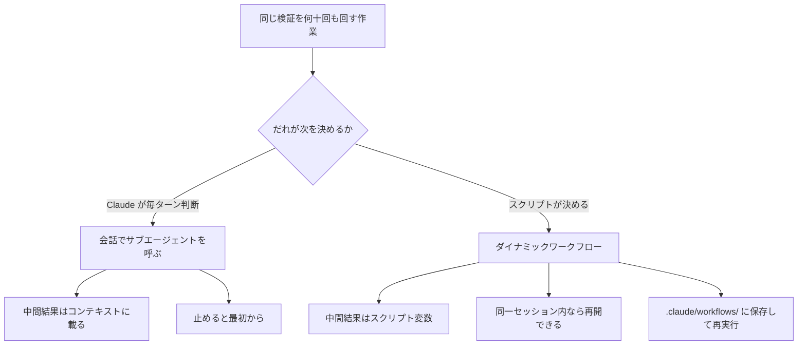
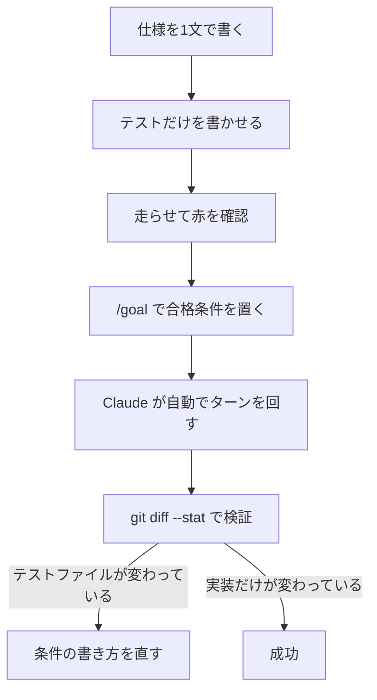

# Claude Daily — 2026-09-15（第024号）

## きょうの3行

- 同じ検証を何度も回す作業は、会話ではなく**スクリプト**に置けます。ダイナミックワークフローは中間結果をコンテキストではなく変数に持つので、何十回転しても会話が埋まりません。
- 連載第18回はテスト駆動。Claude は放っておくと実装を先に書きます。順序は「お願い」ではなく**仕組み**で縛るのが確実です。
- Claude Code v2.1.271 が出ました。項目数の多い回で、サブエージェントの `omitClaudeMd`、auto mode のサンドボックスにコマンド単位の `allowed_domains`、Bash 権限検査の抜け穴修正が複数入っています。

## ① ベストプラクティス — 検証つきの反復をスクリプトに固定する

「型エラーが消えるまで直す」「全ルートハンドラを監査して、各指摘を別のエージェントに反証させる」。この種の作業は、手順そのものは単純なのに回数が多い、という形をしています。会話でやると3つの問題が出ます。中間結果がすべてコンテキストに載ること、途中で止めると最初からやり直しになること、そして「次に何を回すか」の判断を毎ターン Claude に任せているので再現しないことです。

ダイナミックワークフロー（Claude が書く JavaScript のスクリプトを、会話とは別のランタイムが背景で実行する仕組み）は、この3つをまとめて外します。ループと分岐と中間結果をスクリプトが持つので、Claude のコンテキストには最終結果だけが返ります。



図1: 「次に何を回すか」を誰が持つかで、コンテキストの使われ方と再現性が変わります。

### 使い方は3手

1. プロンプトに `ultracode` と書くか、素直に「ワークフローで」と書く。その1回だけワークフローになります（セッション全体をワークフロー前提にしたいときは `/effort ultracode`）。
2. `/workflows` で進行を見る。`p` で一時停止、`x` で停止、`s` でそのスクリプトをコマンドとして保存。
3. 保存先は `.claude/workflows/`（リポジトリ共有）か `~/.claude/workflows/`（自分だけ）。保存すると `/<名前>` で呼べるようになります。

### 保存されるスクリプトの形

`s` で保存すると、次のようなファイルが `.claude/workflows/` に置かれます。中身は素の JavaScript で、トップレベル `await` が使えます。以下は「型チェックが通るまで直す、ただし進捗が止まったら諦める」を書き下ろしたものです。

`.claude/workflows/typecheck-fix.js`

```javascript
export const meta = {
  name: 'typecheck-fix',
  description: 'Run tsc --noEmit and fix reported errors until the type check is clean',
}

const MAX_ROUNDS = 3
let lastErrorCount = null

for (let round = 1; round <= MAX_ROUNDS; round++) {
  const check = await agent(
    'Run `npx tsc --noEmit` at the repository root. Report the total error count and the list of files that have errors. Do not edit any file.',
    {
      label: `tsc-round-${round}`,
      schema: {
        type: 'object',
        required: ['errorCount', 'files'],
        properties: {
          errorCount: { type: 'integer' },
          files: { type: 'array', items: { type: 'string' } },
        },
      },
    },
  )

  if (check === null) return { status: 'stopped', round }
  if (check.errorCount === 0) return { status: 'clean', round }
  if (lastErrorCount !== null && check.errorCount >= lastErrorCount) {
    return { status: 'no-progress', round, errorCount: check.errorCount }
  }
  lastErrorCount = check.errorCount

  const fixes = await parallel(
    check.files.map((file) => () =>
      agent(
        `Fix the TypeScript errors that \`npx tsc --noEmit\` reports for ${file}. Edit only ${file}. Do not add any, @ts-ignore or @ts-expect-error.`,
        { label: `fix ${file}` },
      ),
    ),
  )
  if (fixes.every((r) => r === null)) return { status: 'all-blocked', round }
}

return { status: 'exhausted', rounds: MAX_ROUNDS, errorCount: lastErrorCount }
```

読みどころは3つです。`agent()` に `schema` を渡すとそのエージェントは散文ではなく JSON を返すので、`check.errorCount` という形で条件分岐に使えます。`parallel()` は関数の配列を受け取り、全部の完了を待ちます。そして `agent()` は停止されたときや auto mode の分類器にブロックされたときに `null` を返すので、`null` の扱いを書かないとそこで壊れます。

規模の上限も決めておきます。`.claude/settings.json` に書けます。

```json
{
  "$schema": "https://json.schemastore.org/claude-code-settings.json",
  "workflowSizeGuideline": "small"
}
```

`workflowSizeGuideline` は「Claude が何体を目安に設計するか」の助言で、上限ではありません。`small` は5体未満、`large` は50体未満です。ランタイム側には別に、同時16体・1回1,000体・`parallel()` / `pipeline()` の1リストあたり4,096件という固い上限があります。

なお v2.1.271 で、既定が Pro プランでは `small` に変わり、`medium` の目安が15体から10体に下がりました。ドキュメントの表はまだ `medium` を「15体未満」と書いており、CHANGELOG と食い違っています。数を気にする場面では `/config` の表示を見てください。

### やりがちな失敗

**その1: スクリプトに時刻や乱数を書く。** `Date.now()`、`Math.random()`、引数なしの `new Date()` は、ワークフローのランタイムでは**例外を投げるようになっています**。止めたワークフローを再開したとき、同じ `agent()` 呼び出しが同じ内容で再生されないと結果をキャッシュから返せないからです。時刻が要るなら `args` 経由で外から渡します。同じ理由で `import()` を含むスクリプトは実行前に落ちます。ライブラリが要る処理はエージェント側の仕事にします。

**その2: 途中で人の承認を挟む設計にする。** ワークフローは走り出したら人の入力を受け取りません（止まるのはエージェントの権限プロンプトだけです）。「調査 → 人が確認 → 実行」をやりたいなら、調査と実行を**別々のワークフロー**にします。1本にまとめると、承認待ちのつもりで書いた箇所を Claude が勝手に判断して進みます。

**その3: ファンアウトの途中で1体が失敗したときのコストを見ていない。** 再開時、失敗したエージェントとその**後に開始した全エージェント**が、完了済みでも走り直します。A・B・C・D の順で始めて B が落ちると、A はキャッシュから返りますが B・C・D は再実行です。だから `MAX_ROUNDS` のような打ち切りと、小さいスライス（1ディレクトリだけ）での試し打ちを先にやります。

出典: [Orchestrate subagents at scale with dynamic workflows](https://code.claude.com/docs/en/workflows) / [Best practices for Claude Code](https://code.claude.com/docs/en/best-practices) / [CHANGELOG](https://github.com/anthropics/claude-code/blob/main/CHANGELOG.md)

## ② 深掘り連載 第18回 — テスト駆動で Claude に書かせる

公式のベストプラクティスは、よくある失敗のひとつを **The trust-then-verify gap**（それらしく見えるが端のケースを踏んでいない実装が出てくる）と名指しし、処方箋を「常に検証手段（テスト・スクリプト・スクリーンショット）を与えること。検証できないものは出荷しないこと」と書いています。テスト駆動は、この検証手段を**実装より先に**用意しておく、というだけの話です。

なぜ順序が効くのかというと、Claude は「作業が終わったように見えた時点で止まる」からです。走らせられるチェックがなければ「終わったように見える」以外の信号がなく、検証ループは人間が担当することになります。逆に合否を返すものを1つ渡すと、Claude 自身が回して読んで直す、というループが閉じます。


図2: 点線は「テストを書く側」と「実装する側」を分ける線です。同じ文脈で続けると、テストが実装の都合に寄ります。

### 縛りの強さを4段から選ぶ

チェックを用意したあと、それを「どれくらい強く終了条件にするか」を決めます。公式は4段挙げています。

| 段 | 何で縛るか | 効く範囲 | 用意する手間 |
|---|---|---|---|
| 1 | プロンプト内で「実装後にテストを走らせて」と書く | その1プロンプト | なし |
| 2 | `/goal` に合格条件を置く | そのセッション | 1行 |
| 3 | Stop フックでスクリプトを走らせ、通るまでターンを終わらせない | 設定の及ぶ全セッション | 設定ファイル |
| 4 | 検証サブエージェント／ワークフローに別の文脈で反証させる | 任意 | プロンプトかスクリプト |

TDD で日常的に使うのは1と2です。1は「検証条件を先に渡す」形で書きます。公式の対比例でいうと、`implement a function that validates email addresses` ではなく、`write a validateEmail function. example test cases: user@example.com is true, invalid is false, user@.com is false. run the tests after implementing` です。判定基準を先に渡すと、確認の往復が減ります。

2の `/goal` は、ターンが終わるたびに小さく速いモデルが条件の成否を判定し、満たされていなければ Claude が勝手に次のターンを始める仕組みです。TDD の GREEN フェーズにそのまま当てはまります。

```
/goal npm test -- --run src/lib/__tests__/price.test.ts が exit 0 になること。src/lib/price.ts だけを編集し、テストファイルは一切変更しない。20ターン経っても通らなければそこで止める
```

条件の書き方には型があります。**測れる終状態**（テストの結果・ビルドの終了コード）、**証明のしかた**（`npm test` が exit 0）、**変えてはいけないもの**（テストファイルを変更しない）の3つです。条件は4,000文字まで。長く回りすぎないよう、ターン数か時間の節を入れておきます。

### 評価役はツールを呼ばない

`/goal` でいちばん誤解されるのはここです。評価役のモデルは**コマンドを実行せず、ファイルも読みません**。判定材料は「Claude がその会話に出したもの」だけです。だから「テストが通っている」は、Claude が実際にテストを走らせて出力が会話に載って初めて成立します。「実装しました」と書いただけでは、評価役は通ったと判断できません。逆に言えば、条件は必ず**会話に現れる形**で書く必要があります。

止め方は `/goal clear`（`stop` / `off` / `cancel` などの別名も可）。`/clear` で会話を切り替えても消えます。`/goal` を引数なしで打つと、条件・経過時間・評価されたターン数・トークン消費・直近の判定理由が出ます。無人で回すなら `claude -p "/goal ..."` で1回の起動の中でループを回しきれますが、既定のテキスト出力だと終わるまで何も出ないので `--output-format stream-json --verbose` を足します。

### 書く側と実装する側を分ける

公式はセッションを2本立てる Writer/Reviewer パターンを挙げ、その応用として「片方の Claude にテストを書かせ、もう片方にそれを通すコードを書かせる」を明示しています。分ける理由は単純で、同じ文脈でテストを書いた側が実装すると、自分が書けるコードに通るテストを書いてしまうからです。

分け方はセッション2本でもいいですし、サブエージェント2体でも成立します。後者なら `.claude/agents/` にテスト作成役を定義し、v2.1.271 で入った `omitClaudeMd: true` を付けて、プロジェクトの CLAUDE.md（＝実装の方針が書いてある場所）を読ませないようにできます。

### 使うべき時 / 使うべきでない時

**使うべき**: 仕様が文で言える機能（入力と期待出力が決まる）、バグ修正（再現するテストを先に書く）、リファクタ（振る舞いを固定してから動かす）。特にバグ修正は公式も `write a failing test that reproduces the issue, then fix it` という形を推しています。

**使わなくていい**: 期待する振る舞いがまだ決まっていない探索フェーズ、見た目の調整（ここはスクリーンショット比較の領分です）、1文で差分を説明できる小さな変更。テストを先に書くコストが、得られる確実さを上回ります。

出典: [Best practices for Claude Code](https://code.claude.com/docs/en/best-practices) / [Keep Claude working toward a goal](https://code.claude.com/docs/en/goal) / [Common workflows](https://code.claude.com/docs/en/common-workflows)

## ③ すぐ効くTIPS

### 1. サブエージェントに CLAUDE.md を読ませない

v2.1.271 で、サブエージェントのフロントマターと `--agents` の JSON に `omitClaudeMd` が入りました。立てると、ユーザー・プロジェクト・ローカルの CLAUDE.md を読まずに起動します（管理ポリシーのファイルは今まで通り読み込まれます）。効くのは「先入観を持たせたくない役」です。テストを書く役に実装方針を読ませない、レビュー役にコーディング規約の言い訳を読ませない、といった使い分けができます。

`.claude/agents/test-writer.md`

```markdown
---
name: test-writer
description: 仕様から失敗するテストだけを書く。実装はしない
tools: Read, Glob, Grep, Write
omitClaudeMd: true
---
与えられた仕様から、まだ存在しない実装に対する失敗するテストだけを書いてください。
実装ファイルは作らず、編集もしないこと。
正常系1件・異常系1件・境界1件を最低限含めてください。
```

### 2. 長いセッションで dev server が二重に立つ問題が直った

v2.1.271 で、「コンパクションのあと、まだ走っている背景コマンド（watch タスクや dev server）を Claude がもう1つ起動してしまう」不具合が修正されました。`npm run dev` を背景で走らせたまま長時間セッションを続けると、ポートが埋まったり HMR が二重に動いたりしていた原因がこれです。心当たりがあるなら更新するだけで消えます。

### 3. Monitor のウォッチに必ず期限が付くようになった

同じく v2.1.271 で、Monitor（ログやファイルの変化を待つツール）のウォッチが**必ず期限付き**になりました。最長30分、`-p` の単発実行では10分で、期限が来ると Claude に「張り直すかどうか」の通知が行きます。無期限の `persistent` オプションは置き換えられました。「監視を仕掛けたまま忘れて、セッションが終わらない」という事故が構造的に起きなくなります。

## ④ 事例

### TDD を CLAUDE.md とサブエージェントの二段で縛った報告

LLM は学習データの大半が「実装 → テスト」の順で書かれているため、実装先行が既定の振る舞いになる、という診断から出発した記事です（Zenn / 井本賢、2026-02-24、二次情報）。実装後にテストを書かせると「自分のコードに合格するテストを生成しているだけ」になり、正常系しか埋まらないと指摘しています。

対策は二段構えだと報告されています。第一段は CLAUDE.md に RED / GREEN / REFACTOR の順序と、テストコマンドの正確な打ち方（`npm test -- --run` のように）を書くこと。第二段が文脈の分離で、`.claude/agents/` にテスト作成役・実装役・リファクタ役の3体を置き、それぞれ別コンテキストで走らせることで、テスト設計の段階で実装の都合が混ざるのを防ぐ、という構成です。テストの質の下限も CLAUDE.md 側で決めており、正常系・異常系・境界の各1件以上と、`should [期待する振る舞い] when [条件]` という命名規則を挙げています。

効果の定量データは記事にはありません。著者自身も実践ベースであると断っています。

出典: [Claude CodeにTDDを強制する — CLAUDE.mdでテストファーストをAIに叩き込む方法](https://zenn.dev/kenimo49/articles/claude-code-tdd-force-test-first)

### 全社導入までの意思決定を時系列で公開した報告（チーム展開）

Web・ネイティブアプリ開発の Gemcook が、AI コーディングツールの採用判断を年表で振り返った記事です（Zenn / soso、2026-03-12、二次情報）。2023年2月に GitHub Copilot for Business を全エンジニアに配布、2024〜2025年は Cline・Cursor・Windsurf を並行検証、2025年1月に Devin の Team プラン、2025年2月から Claude Code と Cursor の試験導入、2026年2月に Claude Code の全社導入、という流れです。

選定理由として3点を挙げています。実装の品質と速度のバランス、開発者コミュニティでの普及度、そして Team プランの運用しやすさです。導入後は数日で数万行規模のコードを生成したエンジニアが出たと報告されていますが、行数以外の指標は示されていません。

読みどころは成功譚ではなく**反省**のほうです。2024〜2025年の並行検証期間を「最初の判断の遅れ」と位置づけ、1〜2か月試したら全面採用の可否を決めるべきだった、と書いています。ためらいの原因は技術的な障壁ではなく意思決定プロセスの不備だった、という整理です。チーム展開の検討材料としては、この「いつ決めるかを先に決める」という部分が移植できます。

出典: [Claude Code 全社導入までの意思決定と歴史](https://zenn.dev/gemcook/articles/claude-code-company-wide)

## ⑤ 速報 — 新機能・変更点

前回チェック（v2.1.270）以降、v2.1.271 が公開されました。項目数が非常に多い回です。読者に効くものを抜きます。

| いつ | 何が | どう効くか |
|---|---|---|
| v2.1.271 | サブエージェントのフロントマターと `--agents` JSON に `omitClaudeMd` | 先入観を持たせたくない役（テスト作成・レビュー）を CLAUDE.md なしで走らせられる。管理ポリシーのファイルは読み込まれたまま |
| v2.1.271 | auto mode ＋ サンドボックスで、Bash / PowerShell / Monitor にコマンド単位の `allowed_domains` | そのコマンドが必要とするホストだけがそのコマンドのために開き、他は拒否される。全体を開けずに済む |
| v2.1.271 | `claude plugin install` / `update` に `--accept-command <sha256>` | `-y` で何でも通すのではなく、直前の `--json` 実行が表示したコマンドそのものだけを承認できる |
| v2.1.271 | Bash 権限検査の抜け穴を複数修正 | ワイルドカードの展開先、`fmt` / `column` が読むファイル、変数宣言フラグによる偽装、二重 `cd` やサブシェル経由の迂回が塞がれた |
| v2.1.271 | Claude Code Remote セッションで fast mode が使えるように | クラウド／セルフホストのセッションでも、ホスト側の設定か `/fast` で切り替えられる（組織が許可している場合） |
| v2.1.271 | コンパクション後に背景コマンドを二重起動する不具合を修正 | dev server や watch タスクを背景で走らせたまま長時間セッションを続けても、もう1つ立ち上がらない |
| v2.1.271 | Monitor のウォッチが必ず期限付きに（最長30分、`-p` では10分） | 無期限の `persistent` は廃止。期限が来ると Claude に張り直しの通知が行く |
| v2.1.271 | ダイナミックワークフローが使用量上限で一時停止し、リセット後に自動継続 | 上限に当たったエージェントが捨てられていたのが、待って続きから走るようになった |
| v2.1.271 | ワークフローの既定サイズを Pro では `small` に、`medium` の目安を15体から10体に変更 | 意図せず大規模な run が走りにくくなる。ドキュメントの表は15体のままで未追随 |
| v2.1.271 | `--resume` の不具合を複数修正 | 1Mコンテキスト（`[1m]`）が落ちる問題、`/artifacts` で添付したアーティファクトが消える問題、前の会話のファイル読み取り追跡を持ち越す問題 |

Platform リリースノートは 9/10 の Managed Agents の `auto` と `ant beta:sessions connect` のままで新規なし、anthropic.com/news は 9/1 の「Developing Enterprise Frontier Safeguards with our customers」が最新、anthropic.com/engineering は 4/23 から更新なし、claude.com/customers も 9/4 の Carvana が最新で既報です。

出典: [Claude Code CHANGELOG](https://github.com/anthropics/claude-code/blob/main/CHANGELOG.md) / [Claude Platform release notes](https://platform.claude.com/docs/en/release-notes/overview)

## ⑥ コマンド早見

| コマンド | 何をするか |
|---|---|
| `/workflows` | 走っている／終わったワークフローを一覧し、進行を見る・止める・保存する |
| `/deep-research <質問>` | 同梱のワークフロー。複数の角度で調べ、相互に突き合わせた上で出典つきの報告を返す |
| `/effort ultracode` | そのセッションの実質的な作業すべてでワークフローを組ませる |
| `/workflow-authoring` | 保存済みワークフローを編集する前に読む、スクリプト記法のリファレンス |
| `/reload-skills` | 編集したワークフローやスキルをいまのセッションに読み直させる |
| `/goal <条件>` | 条件が満たされるまでターンを自動で続けさせる |
| `/goal clear` | 走っている `/goal` を解除する |
| `/config` | ワークフローの規模や有効・無効などの設定を画面から変える |
| `/fast` | そのセッションの fast mode を切り替える |
| `claude --effort ultracode` | 最初からワークフロー前提でセッションを起動する |
| `claude -p "/goal ..."` | 条件を満たすまでのループを、1回の非対話実行で回しきる |
| `npx tsc --noEmit` | 型チェックだけを走らせる（成果物は出さない） |

## ⑦ きょうの課題

所要 15分。Next.js のプロジェクトで、**テストを先に書かせてから `/goal` で通させる**までを1周します。ポイントは「テストファイルを触らせない」条件を入れることです。



図3: 赤を確認してから `/goal` を置くのが順序です。逆にすると、通っているテストを条件にしてしまいます。

**前提**: Vitest か Jest が動く Next.js プロジェクト。なければ空の関数1つでも構いません。

**手順**

1. 新しいセッションを開き、仕様を1文で渡してテストだけを書かせます。`src/lib/price.ts` に `applyCoupon(price, code)` を作りたい。まず src/lib/__tests__/price.test.ts に失敗するテストだけを書いて。実装ファイルは作らないこと。正常系・異常系・境界を1件ずつ入れて。
2. テストを走らせて、**赤で落ちること**を自分の目で確認します。ここを飛ばすと、次の条件が最初から満たされてしまいます。
3. 合格条件を置きます。`/goal npm test -- --run src/lib/__tests__/price.test.ts が exit 0 になること。src/lib/price.ts だけを編集し、テストファイルは一切変更しない。15ターンで止める`
4. 放置します。`/goal` は引数なしで打つと、経過ターン数と直近の判定理由が見られます。
5. 終わったら `git diff --stat` を見ます。

**確認方法**: `git diff --stat` に `src/lib/price.ts` だけが出ていれば成功です。`price.test.ts` が変わっていたら失敗です。

── 模範解答 ──

**解答**: `git diff --stat` の出力が実装ファイル1行だけになり、`/goal` の状態表示が achieved になっていれば1周できています。手順3の条件文には、前述の3要素がすべて入っています。測れる終状態が「exit 0」、証明のしかたが「`npm test -- --run <path>`」、変えてはいけないものが「テストファイルを変更しない」です。

**なぜそうなるのか**: `/goal` は中身としては、そのセッションだけに効くプロンプト型の Stop フックです。ターンが終わるたびに、条件と会話の内容が小さく速いモデルに渡り、「未達 / 達成 / 不可能」の3つのうち1つが返ります。未達ならその理由が次のターンの指示として Claude に渡り、勝手に作業が続きます。達成なら自動で解除され、不可能と判断されても解除されます。手順2で赤を確認するのは、この評価役が最初のターンで「もう通っている」と判定してしまうのを防ぐためです。

**よくある詰まりどころ**

- **評価役はコマンドを実行しません。** ファイルも読みません。判定材料は会話に出ているものだけなので、Claude がテストを実際に走らせて出力を会話に載せない限り、いつまでも未達のままです。条件文に「テストを実行して結果を示すこと」を含めておくと確実です。
- **Manual モードだと毎ターン承認を求められます。** 放置して回すつもりなら auto mode で `/goal` を打つか、`npm test` を許可リストに入れておきます。
- **進まないのに止まらないことがあります。** 数ターン続けてツールを1つも呼ばない状態になると、Claude Code 側がループを打ち切って警告を出し、条件は残したまま制御を返します。次にこちらが何か送ると評価が再開します。
- **条件は4,000文字までです。** 長い仕様を丸ごと貼るのではなく、SPEC.md に書いて「SPEC.md の受け入れ条件がすべて満たされること」と参照させるほうが安定します。
- **`/clear` を打つと `/goal` も消えます。** セッションを切り替えるときは、条件を手元に控えておいてください。

あすは「大規模リファクタの進め方（分割と検証）」を扱います。
