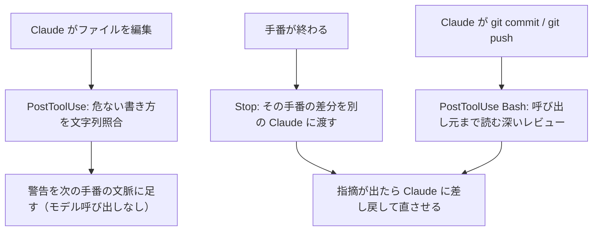
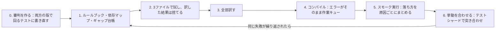
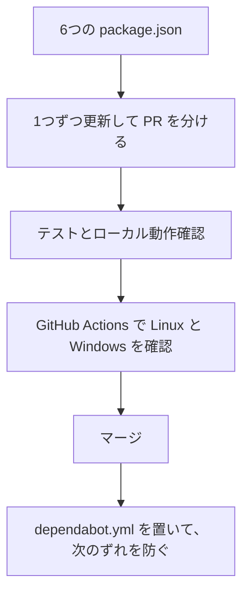

# Claude Daily — 2026-09-16（第025号）

## きょうの3行

- Claude が書いた差分を、同じセッションの中で別の Claude にセキュリティ観点で読ませられます。
- 連載第19回は大規模リファクタ。最初に作るのはコードではなく**審判**です。
- Claude Code v2.1.273 が出ました。長いセッションの重さと、キャッシュを壊す操作の修正が中心です。

## ① ベストプラクティス — 書いた直後に、別の Claude へ差分を読ませる

> 実装した本人には採点させません。
> 発火は3か所。編集ごと・ターン末・commit / push。
> どれもブロックはしません。その場で直すための層です。

「動くか」はテストで閉じられます。「危なくないか」は閉じません。
脆弱性は失敗しないコードとして残るので、誰も気づかないまま PR に乗ります。

security-guidance プラグインは、その穴を埋めるために作られた公式プラグインです。
入れると自動で走ります。呼び出すコマンドはありません。



図1: 3層とも別のレビューで、書いた本人が自分を採点しません。

### 入れる

```text
/plugin install security-guidance@claude-plugins-official
```

`Marketplace "claude-plugins-official" not found` と出たら、先に `/plugin marketplace add anthropics/claude-plugins-official` を打ちます。
リポジトリ全員に配るなら、ユーザースコープではなく設定ファイルに書きます。クラウドセッションにも届きます。

`.claude/settings.json`

```json
{
  "enabledPlugins": {
    "security-guidance@claude-plugins-official": true
  }
}
```

### 自分のリポジトリの決まりを足す

拡張点は2つです。文字列照合のパターンと、モデルが読むレビュー方針。どちらも足す方向にしか効かず、組み込みの検査は消せません。

`.claude/security-patterns.yaml`

```yaml
patterns:
  - rule_name: next_dangerous_html
    substrings: ["dangerouslySetInnerHTML", ".innerHTML ="]
    paths: ["**/app/**", "**/components/**"]
    reminder: "サニタイズ済みの文字列か確認してください。素の入力を渡さないこと。"
  - rule_name: secret_in_client_component
    regex: "process\\.env\\.(?!NEXT_PUBLIC_)[A-Z0-9_]+"
    paths: ["**/components/**"]
    reminder: "クライアント側から参照するとバンドルに載ります。Server Component かルートハンドラへ寄せてください。"
```

`.claude/claude-security-guidance.md`

```markdown
# Security guidance for this repo

- `app/api/**` のルートハンドラは、DB を読む前に `requireSession()` を呼ぶこと。
- `email` と `stripeCustomerId` を `console.log` に出さないこと。
- トークンの比較は `===` ではなく `crypto.timingSafeEqual` を使うこと。
```

#### ❌ 禁止事項を guidance ファイルに書いて、止まると思い込む

```markdown
- XSS の指摘は誤検知が多いので報告しないこと。
- `.github/workflows/` は触ってよい。
```

これは効きません。guidance ファイルは加算だけで、組み込みの検査を黙らせる書き方がないからです。
3層のどれも書き込みや commit をブロックせず、指摘は次の手番への指示として届くだけです。

#### ✅ 見つける層と、止める層を分ける

`.claude/settings.json`

```json
{
  "enabledPlugins": {
    "security-guidance@claude-plugins-official": true
  },
  "permissions": {
    "deny": [
      "Edit(./.github/workflows/**)",
      "Read(./.env*)"
    ]
  }
}
```

プラグインは早く見つけて同じセッションで直すための層です。
絶対に触らせない場所は、権限ルールかフックで締めます。役割を混ぜると、どちらも中途半端になります。

- 出典: [Catch security issues as Claude writes code](https://code.claude.com/docs/en/security-guidance)
- 出典: [Best practices for Claude Code](https://code.claude.com/docs/en/best-practices)

## ② 深掘り連載 第19回 — 大規模リファクタの進め方（分割と検証）

> 最初に作るのは審判です。コードではありません。
> 直すのはルールブック。個々のファイルではありません。
> 失敗はキューになります。キューは再開できる形にします。

大規模リファクタが AI で現実的になった理由は、速さではありません。
何千という独立したファイルに割れること、元のコードが仕様書そのものであること、
そしてコンパイラとテストが「次にやること」を勝手に並べてくれることです。



図2: 手番を戻す先は個々のファイルではなく、ルールブックです。

| 手順 | やること | 審判になるもの |
|---|---|---|
| 0 | テストを分類し、両方の版から呼べる外部アサーションに書き直す | 壊した版で落ちるかを先に確かめる |
| 1 | 翻訳ルール・依存マップ・「訳せない箇所」の台帳を作る | 人間のレビュー |
| 2 | 3ファイルだけ別々のやり方で訳し、ルールの穴を探す | 出力の差分（訳した結果は捨てる） |
| 3 | 全体を訳す。迷った箇所は TODO コメントで残す | 後続のコンパイラ |
| 4 | ワークスペース全体をコンパイルする | コンパイルエラーの一覧 |
| 5 | 起動して落ちる場所を集める | クラッシュの原因分類 |
| 6 | テストを分割して流し、挙動を合わせる | 既存テストとパリティ用の台本 |

### 人間の時間は前半に使う

- 人間が時間を使うのは手順1と2までです。そこから先はキューを減らす作業になります。
- 実装は小さいモデルで数をこなし、レビューとルールの記述に大きいモデルを充てます。
- 作業単位は「出力ファイルがあれば完了」にします。途中で止めても、そこから再開できます。
- コードを直す前に、そのコードを作ったループを直します。個別修正はルールの穴を隠します。

### Claude Code 側の段取り

- 横断する変更は1つのセッションにまとめて渡します。パッケージごとに分けると、同じ判断をやり直します。
- 長いセッションでは途中でコンパクションが起きます。プランモードで計画をファイルに書かせておくと、そのたびに入れ直されます。
- 会話が消えても計画は残ります。手順の順番を持つのは会話ではなくファイルです。

作業ツリーを軽くする設定も効きます。

`.claude/settings.json`

```json
{
  "worktree": {
    "sparsePaths": [".claude", "apps/web", "packages/ui"]
  },
  "permissions": {
    "deny": [
      "Read(./**/dist/**/*)",
      "Read(./**/*.generated.*)"
    ]
  }
}
```

| 使うべき時 | 使うべきでない時 |
|---|---|
| 既存のテストが審判として使える（または書き直せる） | 正しさの基準が人の目視しかない |
| 変更が何百ファイルにも機械的に割れる | 1ファイルの設計判断が全体を決める |
| コンパイラや型検査が失敗を列挙してくれる | 失敗が実行時にしか出ず、再現手順もない |
| 元のコードが仕様として信用できる | 元のコードの挙動自体が疑わしい |
| 途中で止めても再開できる単位に割れる | 全部そろって初めて動く一括置換 |

- 出典: [How Anthropic runs large-scale code migrations with Claude Code](https://claude.com/blog/ai-code-migration)
- 出典: [Set up Claude Code in a monorepo or large codebase](https://code.claude.com/docs/en/large-codebases)
- 出典: [Common workflows](https://code.claude.com/docs/en/common-workflows)

## ③ すぐ効くTIPS

### 1. worktree ごとに node_modules を作らない

作業ツリーを増やすと `node_modules` も増えます。`symlinkDirectories` に書いたディレクトリは、本体のものを指すシンボリックリンクになります。ディスクも `npm install` の時間も増えません。

`.claude/settings.json`

```json
{
  "worktree": {
    "sparsePaths": [".claude", "apps/web", "packages/ui"],
    "symlinkDirectories": ["node_modules"]
  }
}
```

### 2. 足したディレクトリの CLAUDE.md まで読ませる

`additionalDirectories` が許すのはファイルの読み書きだけで、その場所の CLAUDE.md もスキルも読み込まれません。`--add-dir` ならスキルは読み込まれます。CLAUDE.md まで読ませるには、次の環境変数が要ります。

```bash
CLAUDE_CODE_ADDITIONAL_DIRECTORIES_CLAUDE_MD=1 claude --add-dir ../shared
```

### 3. PR から、そのとき書いていたセッションを開く

レビューが来てから「どのセッションだったか」を探すのは手間です。Claude が `gh pr create` で作った PR は、セッションと紐づいています。

```bash
claude --from-pr 1234
```

- 出典: [Set up Claude Code in a monorepo or large codebase](https://code.claude.com/docs/en/large-codebases)
- 出典: [Common workflows](https://code.claude.com/docs/en/common-workflows)

## ④ 事例

### Anthropic 自身の大規模移行（一次情報・2026-07-16）

| 値 | 何の数字か |
|---|---|
| 100万行 | Bun の Zig → Rust 移植で2週間弱に出たコード量 |
| 約59億トークン | 同移行の未キャッシュ入力（API 価格で約16.5万ドル相当） |
| 19件 | マージ後に見つかった回帰。マージ前は既存テストが全通過 |
| 16.5万行 | Python → TypeScript 移植の規模。週末で完了、2,700万トークン |
| 約2秒 | 同移植後のビルド時間。移植前は30分 |

手番の速さを決めたのは、コンパイラをループのどこに置くかでした。
コンパイルに数分かかる言語では、最後の工程まで遅らせています。数秒で終わる言語では毎回かけて、失敗をすぐ返しています。

### zenn-editor の依存一括更新（Zenn 開発チーム、二次情報・2025-12-08）

6つの `package.json` に分け、1つずつ PR にした、という報告があります。
先に root と1パッケージで試してから全体に広げ、DevContainer とルールファイルで自律作業の安全側を作っています。



図3: 分割の単位が、そのまま検証とレビューの単位になっています。

| 値 | 何の数字か |
|---|---|
| 63件 → 9件 | `pnpm audit` が出した脆弱性の件数 |
| 12.43秒 → 2.56秒 | Rspack へ移したあとのビルド時間 |

- 出典: [How Anthropic runs large-scale code migrations with Claude Code](https://claude.com/blog/ai-code-migration)
- 出典: [Claude Codeを使ってzenn-editorの依存パッケージをすべて最新化しました](https://zenn.dev/team_zenn/articles/zenn-editor-dependencies-update)

## ⑤ 速報 — 新機能・変更点

| いつ | 何が | どう効くか |
|---|---|---|
| v2.1.273 | MCP サーバーが途中で切れ、再接続にも失敗したときに通知が出る | 気づかないままツールが消えている状態が減る |
| v2.1.273 | 長いセッションで会話全体を再処理しなくなった | 続けるほど重くなる感覚が軽くなる |
| v2.1.273 | コンテキストメーターが advisor の手番を約2倍に数えていた不具合を修正 | 残量表示と自動コンパクションの発火が正しくなる |
| v2.1.273 | `/login` `/upgrade` `/extra-usage` がプロンプトキャッシュを全書き直しさせていた不具合を修正 | 途中のサインイン操作が高くつかなくなる |
| v2.1.273 | `claude --remote-control` で始めたセッションをフォークできる | 枝分かれは背景セッションとして走る |
| v2.1.273 | `REVIEW.md` が @メンションや行をまたぐコードスパンで無視されていた不具合を修正 | 書いたレビュー観点が実際に効く |
| v2.1.273 | `OTEL_LOG_TOOL_DETAILS=1` がエージェント・スキル・プラグイン・MCP の実名を出す | 使われていない資産の棚卸しが実測でできる |
| v2.1.272 | バグ修正と信頼性改善のみ | 個別項目の記載なし |
| Platform 9/14 | Messages API に `compaction` パラメータ（ベータ、`compact-2026-09-04`） | 自作エージェントで圧縮の時機と残す範囲を自分で決められる |

v2.1.273 は項目数が多い回ですが、新機能より修正が主です。
`permissions.blockReadsOutsideWorkingDirectories` の周辺が3件直り、2.1.268 の deny 判定の変更が差し戻されています。

- 出典: [Claude Code CHANGELOG](https://github.com/anthropics/claude-code/blob/main/CHANGELOG.md)
- 出典: [Claude Platform release notes](https://platform.claude.com/docs/en/release-notes/overview)

## ⑥ コマンド早見

| コマンド | 何をするか |
|---|---|
| `/plugin install security-guidance@claude-plugins-official` | 書いた直後に差分を見るセキュリティプラグインを入れる |
| `/plugin marketplace add anthropics/claude-plugins-official` | マーケットプレイスが見つからないときに足す |
| `/reload-plugins` | 入れたプラグインを今のセッションで有効にする |
| `/plugin disable security-guidance@claude-plugins-official` | 自分のスコープで一時的に止める |
| `claude --add-dir ../shared` | 兄弟ディレクトリを読み書きの対象に足す |
| `claude --from-pr 1234` | その PR に紐づいたセッションを選んで開く |
| `claude --worktree api-migration` | 隔離した作業ツリーでセッションを始める |
| `/context` | 読み込まれた CLAUDE.md とコンテキストの内訳を見る |

## ⑦ きょうの課題

自作のセキュリティパターンが本当に発火するか、Next.js のリポジトリで確かめます。所要 10〜15分。

**前提**: git 管理下の Next.js リポジトリ。`PATH` に Python 3.10 以降。初回はネットワークと `pip` が要ります。

**手順**

1. `/plugin install security-guidance@claude-plugins-official` を打ち、ユーザースコープを選びます。`Run /reload-plugins to activate.` と出たら実行します。
2. ①の `.claude/security-patterns.yaml` をそのまま置きます。
3. Claude に頼みます: `components/Notice.tsx を作って。props の html をそのまま本文として描画して。`
4. 編集が終わった直後の出力を見ます。
5. その手番が終わったあとの会話を見ます。

**確認方法**

- 手順4で `next_dangerous_html` と `reminder` の文面が出れば、文字列照合の層が動いています。
- 手順5で Claude が `dangerouslySetInnerHTML` を外すかサニタイズを足せば、差分レビューの層も動いています。

── 模範解答 ──

**解答**: 警告は編集が終わった直後に出ます。ブロックはされないので、危ないコードはいったんファイルに書かれます。そのあと Claude 自身が直せば成功です。

**なぜそうなるのか**: 手順4の層は `PostToolUse` のフックで、モデルを呼ばない文字列照合です。速いかわりに文脈は読みません。手順5の層は `Stop` のフックで、その手番の差分を別の Claude に渡し、認可の抜けなど文字列では見えない問題を探します。

**よくある詰まりどころ**

- 警告は1セッション中、同じパターン・同じファイルにつき1回だけです。2回目の編集で出なくても壊れてはいません。
- `security-patterns.yaml` は PyYAML が読めないと黙って無視されます。入っていない環境では `security-patterns.json` に同じ構造で書きます。
- git リポジトリの外では、手番末と commit のレビューは何も言わずに飛びます。動く層は文字列照合だけになります。
- 手番末のレビューは1手番あたり30ファイルまで、連続3回までです。大きな変更は分けて出すほうが確実に見てもらえます。
- 反応がないときは `~/.claude/security/log.txt` を見ます。Python の版やネットワークの失敗はここに出ます。

あすは「コードレビューをさせる（`/code-review` の実務運用）」を扱います。
