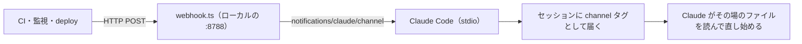
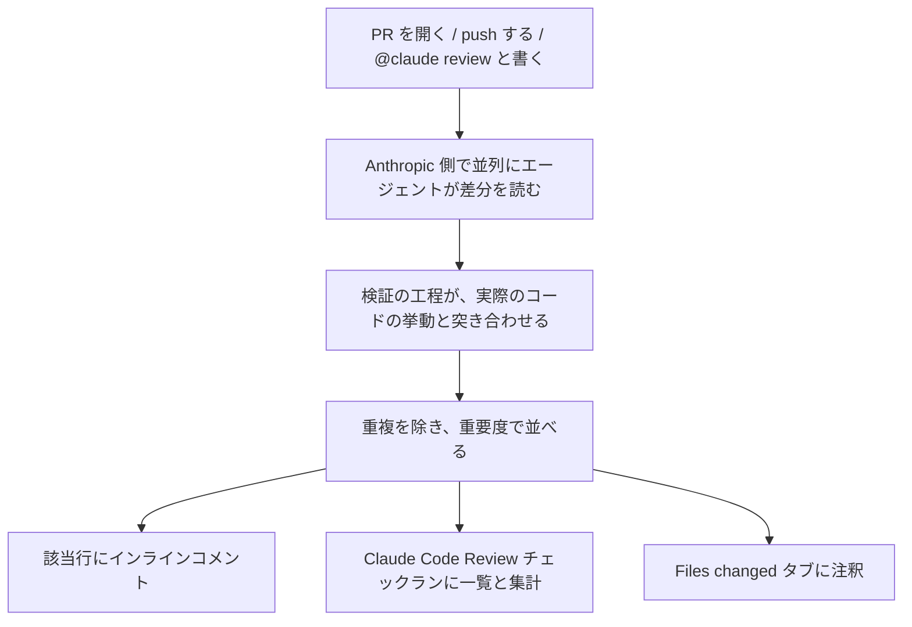

# Claude Daily — 2026-09-17（第026号）

## きょうの3行

- 離席中の CI の失敗を、通知ではなく走っているセッションに直接流し込めます。
- 連載第20回は PR レビュー。ローカルの `/code-review` とマネージドの Code Review は別物です。
- 本日は特筆すべき発表がありません。CHANGELOG は v2.1.273 のままです。

## ① ベストプラクティス — 外で起きたことを、開いているセッションに押し込む

> チャンネルは、イベントを押し込む MCP サーバーです。
> CI の失敗も監視のアラートも、開いた文脈のまま届きます。
> ゲートのないチャンネルは、プロンプトの投入口になります。

離席中に CI が落ちても、Claude は知りません。戻った自分がログを貼り直すまで、セッションは止まったままです。

チャンネルを使うと、その貼り直しが要りません。Claude Code が子プロセスとして起動し、標準入出力でイベントを受け取ります。



図1: 新しいセッションは立ちません。いま開いている文脈にイベントが入ります。

### 受け口を1ファイルで作る

`webhook.ts`

```ts
#!/usr/bin/env bun
import { Server } from '@modelcontextprotocol/sdk/server/index.js'
import { StdioServerTransport } from '@modelcontextprotocol/sdk/server/stdio.js'

const mcp = new Server(
  { name: 'webhook', version: '0.0.1' },
  {
    // このキーがチャンネルの宣言。Claude Code が受信側を登録する
    capabilities: { experimental: { 'claude/channel': {} } },
    instructions:
      'Events from the webhook channel arrive as <channel source="webhook" ...>. They are one-way: read them and act, no reply expected.',
  },
)

await mcp.connect(new StdioServerTransport())

Bun.serve({
  port: 8788,
  hostname: '127.0.0.1', // 外からは届かない
  async fetch(req) {
    const body = await req.text()
    await mcp.notification({
      method: 'notifications/claude/channel',
      params: {
        content: body,
        meta: { path: new URL(req.url).pathname, method: req.method },
      },
    })
    return new Response('ok')
  },
})
```

`.mcp.json`

```json
{
  "mcpServers": {
    "webhook": { "command": "bun", "args": ["./webhook.ts"] }
  }
}
```

研究プレビュー中、自作のチャンネルは許可リストに載っていません。開発用のフラグで起動します。

```bash
bun add @modelcontextprotocol/sdk zod
claude --dangerously-load-development-channels server:webhook
```

別のターミナルから投げると、そのまま届きます。

```bash
curl -X POST localhost:8788 -d "build failed on main: https://ci.example.com/run/1234"
```

| パラメータ | 何を渡すか | セッションでの見え方 |
|---|---|---|
| `content` | イベント本文の文字列 | `<channel>` タグの中身になる |
| `meta` | 文字列の辞書。キーは英数字と `_` のみ | タグの属性になる。ハイフン入りのキーは黙って落ちる |
| （自動） | サーバー名 | `source` 属性に入る |

端末には `← webhook: build failed on main: ...` の1行だけが出ます。Claude 側には次の形で入ります。

```text
<channel source="webhook" path="/" method="POST">build failed on main: https://ci.example.com/run/1234</channel>
```

#### ❌ 届いたものをそのまま押し込む

```ts
// 送信者を見ないまま Claude の前に文章を置いている
await mcp.notification({
  method: 'notifications/claude/channel',
  params: { content: body },
})
```

エンドポイントに届く人は、誰でも Claude への指示を書けます。チャットを繋いだときに部屋の ID でゲートするのも同じで、その部屋にいる全員が通ります。

#### ✅ 送信者で落としてから押し込む

```ts
const allowed = new Set(loadAllowlist()) // access.json などから読む

// 部屋ではなく送信者を見る。グループチャットでは両者が別物になる
if (!allowed.has(message.from.id)) {
  return // 黙って捨てる
}
await mcp.notification({ /* ... */ })
```

受け口を `127.0.0.1` に縛るのも同じ考えです。公式の Telegram と Discord のプラグインも、ペアリングで作った送信者の許可リストで落としています。

Claude Code は通知に応答を返しません。組織のポリシーで止まっている場合も、エラーは出ずに捨てられます。

- 出典: [Push events into a running session with channels](https://code.claude.com/docs/en/channels)
- 出典: [Channels reference](https://code.claude.com/docs/en/channels-reference)

## ② 深掘り連載 第20回 — コードレビューをさせる（`/code-review` の実務運用）

> ローカルの `/code-review` と、PR に付くマネージドの Code Review は別物です。
> `REVIEW.md` が効くのはマネージド側だけです。
> 指摘は3段の重要度で付き、マージはブロックしません。

コマンドの使い方は第6回（2026-09-02 の号）で扱いました。今日は「チームの PR にどう載せるか」です。

同じ名前でも、動く場所と読む設定ファイルが違います。ここを混ぜると、書いたレビュー観点が効かない理由が分からなくなります。



図2: 指摘は3か所に出ます。インラインが GitHub に弾かれても、チェックランには残ります。

| 見るところ | ローカル `/code-review` | マネージドの Code Review |
|---|---|---|
| 走る場所 | 自分のマシンのサブエージェント | Anthropic 側のインフラ |
| 対象 | 上流との差分と作業ツリー。引数で PR も指定できる | GitHub の PR |
| 読む設定 | `CLAUDE.md` のみ | `CLAUDE.md` と `REVIEW.md` |
| 出る場所 | 会話の中（`--comment` で PR にも） | インラインコメント・チェックラン・注釈 |
| 費用 | プランに含まれる | 1回あたり平均 15〜25ドル。利用クレジットから引かれる |
| 必要なプラン | 制限なし | Team / Enterprise（研究プレビュー） |

### いつ走らせるか

リポジトリごとに3択です。コメントによる手動起動は、どの設定でも上書きして走ります。

| 設定 | 走る条件 | 向いている場面 |
|---|---|---|
| Once after PR creation | PR を開いた時とレビュー可にした時の1回 | 既定で置く。1 PR につき1回で済む |
| After every push | push のたび | 重要な PR。直した指摘のスレッドは自動で閉じる |
| Manual | `@claude review` と書いた時だけ | PR の多いリポジトリ。かける相手を選ぶ |

| コメント | 何が起きるか |
|---|---|
| `@claude review` | 1回だけ走る。以後の push は追わない |
| `@claude review always` | 走ったうえで、以後の push でも走るようにする |
| `@claude review once` | `@claude review` と同じ |

フォークからの PR は、どの設定でも自動では走りません。コメントで明示的に頼んだ時だけです。

### 何を指摘させるか

`REVIEW.md` はリポジトリ直下に置きます。指摘を探す側と、重要度を決める側の両方に渡ります。

`REVIEW.md`

```markdown
# Review instructions

## Important の定義

挙動を壊す・データを漏らす・ロールバックを塞ぐものだけを Important にする。
命名・整形・リファクタの提案は Nit 止まり。

## Nit の上限

1回のレビューで Nit は5件まで。超えた分は要約に「ほか N件」とだけ書く。

## 報告しないもの

- CI が見ているもの（lint・整形・型エラー）
- `src/gen/` 以下と `*.lock`

## 毎回見るもの

- 新しい API ルートに結合テストがあるか
- ログにメールアドレスと userId が出ていないか
```

| 印 | 重要度 | 意味 |
|---|---|---|
| 🔴 | Important | マージ前に直すべきバグ |
| 🟡 | Nit | 直す価値はあるが、止めるほどではない |
| 🟣 | Pre-existing | もとからあるバグ。この PR が入れたものではない |

チェックランの結論は常に neutral です。ブランチ保護でマージを止めたいなら、集計を自分の CI で読みます。

```bash
gh api repos/OWNER/REPO/check-runs/CHECK_RUN_ID \
  --jq '.output.text | split("bughunter-severity: ")[1] | split(" -->")[0] | fromjson'
```

`{"normal": 2, "nit": 1, "pre_existing": 0}` が返ります。`normal` が Important の件数です。

### 使うべき時 / 使うべきでない時

| 状況 | 選ぶもの | 理由 |
|---|---|---|
| push する前の自己点検 | ローカルの `/code-review` | 速く、追加の費用がかからない |
| チーム全員の PR に同じ基準を当てたい | マネージド | 個人の設定に依存しない。観点は `REVIEW.md` に集約する |
| 費用を抑えたい | Manual ＋ `@claude review` | かける PR を人が選ぶ |
| Zero Data Retention の組織 | ローカルのみ | マネージドは対象外 |
| 生成物や lockfile だけの PR | どちらも不要 | `REVIEW.md` の「報告しないもの」で先に除く |

インラインコメントへの返信では Claude は動きません。直して push するか、トップレベルに `@claude review` と書きます。

- 出典: [Code Review](https://code.claude.com/docs/en/code-review)
- 出典: [Commands](https://code.claude.com/docs/en/commands)

## ③ すぐ効くTIPS

### 1. 背景レビューの `--fix` は `/rewind` で戻らない

`/code-review` は既定で背景のサブエージェントとして走ります。その編集はチェックポイントの外なので、`/rewind` では戻せません。git で戻します。

```bash
git diff            # 何が変わったかを見てから
git restore .       # レビューが入れた変更を捨てる
```

### 2. レビューを会話の中で走らせたいとき

前景で走らせると、自分の手番の中で編集が入るので `/rewind` が効きます。背景のタスク機能をまとめて切る環境変数です。

```bash
CLAUDE_CODE_DISABLE_BACKGROUND_TASKS=1 claude
```

### 3. 定期タスクのレビューに `ultra` を付けない

定期タスクからクラウドのレビューは起動しません。付けても無駄になるので、素の形で登録します。

```text
/code-review high
```

- 出典: [Code Review](https://code.claude.com/docs/en/code-review)
- 出典: [Run prompts on a schedule](https://code.claude.com/docs/en/scheduled-tasks)

## ④ 事例

### Impel — 500人規模の会社で、業務の課題からエージェントを選ぶ（一次情報・2026-09-16）

自動車ディーラー向けのサービスを作る会社です。事業課題を順位付けし、投資として資金を付ける形で進めています。


図3: 作れるものから選ばず、課題のまとまりに対応付けてから作っています。

| 値 | 何の数字か |
|---|---|
| 400席以上 | Claude Enterprise の展開規模。全社は約500人 |
| 3〜6か月 → 1か月 | 営業担当が立ち上がるまでの平均期間 |
| 3〜4時間 → 30分 | 月次の事業レビューの準備時間 |
| 15万件超 | 通話記録の分析件数。週に約1,000件のレビューを返した |
| 最大20% | 導入から2か月で減ったエスカレーションの割合 |

モデルは用途で分けています。複雑な多段の処理は Opus、設計と推論の重い作業は Fable、確立した軽い実行は Sonnet です。

### マネージド版とローカル版のコストを実測した報告（二次情報・2026-03-10）

Canly の CTO が、公開直後のマネージド Code Review を実測した報告があります。数字は公開当時のものです。

| 値 | 何の数字か |
|---|---|
| 31.54ドル / 30分2秒 | 70行の Markdown の PR をマネージドでレビューしたとき |
| 77.96ドル / 47分14秒 | Go のコードベースの大きい PR のとき |
| 0ドル / 4分23秒 | 同じ小さい PR をローカルの `/code-review` で見たとき |
| 約15,000ドル | 月200 PR に当てた場合の見積もり |

現在のドキュメントは平均 15〜25ドルと書いており、当時の実測とは開きがあります。桁を見誤らないために、自分のリポジトリでは管理画面の平均コストの列で確かめてください。

同じ筆者が7月に出した比較では、`/code-review high` が仕込んだ9件の欠陥をすべて検出し、所要は約4分だったとしています。効き目は high で頭打ちになった、という報告です。

- 出典: [How Impel is building an agent for every job with Claude](https://claude.com/customers/impel)
- 出典: [【2026/3/9最新】Claude Code新機能『Code Review』](https://zenn.dev/canly/articles/1535fde47ca866)
- 出典: [Claude Codeレビュー系コマンドの使い分け【2026/7最新】](https://zenn.dev/rf_p/articles/6514b0c69dc4bc)

## ⑤ 速報 — 新機能・変更点

本日は特筆すべき発表がありませんでした。確認先と最終更新は次のとおりです。

| いつ | 何が | どう効くか |
|---|---|---|
| v2.1.273 のまま | Claude Code の CHANGELOG に新しい版なし | 前号（第025号）の内容が最新 |
| 9/14 のまま | Platform リリースノートは Messages API の `compaction` が最新 | 第025号で既報 |
| 9/10 のまま | Anthropic ニュースは脅威レポートが最新 | 既報 |
| 9/16 | 導入事例に Impel が追加 | ④で扱った |

- 出典: [Claude Code CHANGELOG](https://github.com/anthropics/claude-code/blob/main/CHANGELOG.md)
- 出典: [Claude Platform release notes](https://platform.claude.com/docs/en/release-notes/overview)

## ⑥ コマンド早見

| コマンド | 何をするか |
|---|---|
| `claude --dangerously-load-development-channels server:webhook` | 自作のチャンネルを開発用に読み込んで起動する |
| `claude --channels plugin:fakechat@claude-plugins-official` | 許可リスト入りのチャンネルプラグインを有効にして起動する |
| `curl -X POST localhost:8788 -d "build failed"` | 受け口にイベントを投げてセッションに届ける |
| `/mcp` | チャンネルのサーバーが繋がっているかを確認する |
| `/code-review high` | 差分をローカルでレビューする |
| `/code-review high 1234 --comment` | PR 1234 をレビューして指摘をインラインで投稿する |
| `git restore .` | 背景レビューの `--fix` が入れた変更を捨てる |
| `lsof -i :8788` | 受け口のポートを掴んでいるプロセスを調べる |

## ⑦ きょうの課題

ビルドの失敗を、走っている Claude Code のセッションに届けます。所要 10〜15分。

**前提**: Next.js のリポジトリ。`bun --version` が通ること。ターミナルを2つ使います。

**手順**

1. リポジトリ直下で `bun add @modelcontextprotocol/sdk zod` を実行します。
2. ①の `webhook.ts` と `.mcp.json` をそのまま置きます。
3. `claude --dangerously-load-development-channels server:webhook` で起動します。警告の画面では開発用に使うほうを選びます。
4. `.mcp.json` の確認を聞かれたら、このサーバーを使うほうを選びます。
5. `app/page.tsx` の型をわざと壊します。
6. もう一方のターミナルで次を実行します。

```bash
npm run build 2>&1 | tail -20 | curl -X POST localhost:8788 --data-binary @-
```

**確認方法**

- セッションの側に `← webhook:` で始まる1行が出れば、届いています。
- Claude がそのまま `app/page.tsx` を読み始めれば、文脈が繋がっています。

── 模範解答 ──

**解答**: 起動画面の下に、`server:webhook` からのメッセージがこのセッションに直接入る、という通知が出ます。POST した本文は `<channel source="webhook">` の中身として届き、Claude はビルドログを読んだ状態で修正に入ります。

**なぜそうなるのか**: 新しいセッションを立てる連携と違い、チャンネルは開いているセッションに割り込みます。直前まで見ていたファイルの記憶が残っているので、ログだけで話が通じます。

**よくある詰まりどころ**

- `--channels` だけでは自作のサーバーは登録されません。研究プレビュー中は開発用のフラグが要ります。
- `curl` が connection refused を返すときは、前の実行が残ってポートを掴んでいます。`lsof -i :8788` で調べて落とします。
- `curl` は通るのにセッションに何も来ないときは、`/mcp` でサーバーの状態を見ます。`failed` なら import か依存の問題です。
- 詳しく見るときは `claude --debug` を付けて起動し、`~/.claude/debug/<session-id>.txt` を読みます。
- `meta` のキーにハイフンを入れると黙って落ちます。`run_id` のように `_` を使います。
- 複数の通知が続けて届くと、次の手番でまとめて渡されます。1件ずつ処理させたいなら、セッションを分けます。

あすは「Git 運用 — ブランチ・コミット・PR の任せ方」を扱います。
