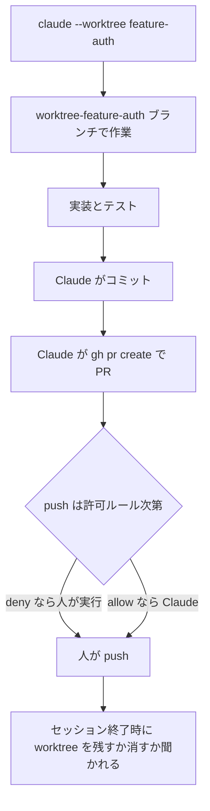
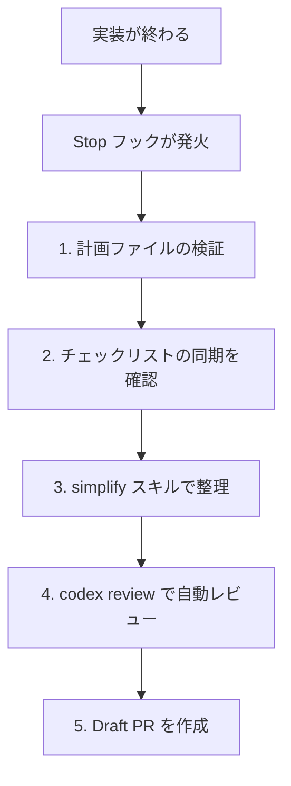

# Claude Daily — 2026-09-18（第027号）

## きょうの3行

- ランブックの手順を `claude-cli://` のリンクにすると、押すだけで正しいクローンが開きます。
- 連載第21回は Git 運用。コミットと PR は任せ、push は手前で止めます。
- CHANGELOG に v2.1.274 と v2.1.275 が追加されました。中身は修正が主体です。

## ① ベストプラクティス — 作業の入口をリンクにして配る

> ランブックの1行を、押せば開くリンクにします。
> `claude-cli://open?repo=...&q=...` の2つで足ります。
> リンクは実行しません。入力欄を埋めて止まります。

障害対応の最初の3分は、だいたい同じ作業で消えます。どのリポジトリだったかを思い出し、ターミナルを開き、状況を打ち直す。この3つは人がやる必要がありません。

ディープリンクは `claude-cli://` で始まる URL です。クリックすると、指定したディレクトリで Claude Code が開き、プロンプトが入力欄に入った状態になります。


図1: Enter の前に人の関門が1つ残ります。リンクだけでは何も走りません。

### パラメータは3つだけ

| パラメータ | 中身 | 制限 |
|---|---|---|
| `q` | 入力欄に入れる文字列。URL エンコードする | 最大5,000字。改行は `%0A` |
| `cwd` | 作業ディレクトリの絶対パス | ネットワークパスと `..` は拒否される |
| `repo` | GitHub の `owner/name` スラッグ | 過去に `claude` を起動したクローンに解決する |

`cwd` と `repo` を両方書くと `cwd` が勝ち、`repo` は無視されます。

### リンクを作る

`node` の1行で、エンコード済みの URL をそのまま出せます。

```bash
node -e 'console.log("claude-cli://open?repo=acme/web-gateway&q=" + encodeURIComponent(process.argv[1]))' \
  "npm run build が落ちています。直近のコミットと CI のログを読んで、原因を1つに絞ってください。"
```

出力をランブックに貼ります。`acme/web-gateway` は自分のリポジトリのスラッグに置き換えます。

```markdown
## web-gateway の 5xx が増えたとき

1. PagerDuty でアラートを受け取る。
2. 下のリンクを開く（Claude Code がクローンで起動し、プロンプトが入る）。

   claude-cli://open?repo=acme/web-gateway&q=npm%20run%20build%20%E3%81%8C%E8%90%BD%E3%81%A1%E3%81%A6%E3%81%84%E3%81%BE%E3%81%99%E3%80%82

3. 所見を #incident に書く。
```

シェルからも開けます。macOS は `open`、Linux は `xdg-open` です。

```bash
open "claude-cli://open?repo=acme/web-gateway&q=review%20open%20PRs"
```

配布したくない端末では、`settings.json` で登録そのものを止められます。組織で固定するなら managed settings 側に書きます。

`.claude/settings.json`

```json
{
  "disableDeepLinkRegistration": "disable"
}
```

#### ❌ 共有ランブックに `cwd` を書く

```text
claude-cli://open?cwd=/Users/umi/dev/web-gateway&q=...
```

クローン先は人によって違います。自分の絶対パスを書いたリンクは、自分以外の全員でホームディレクトリが開きます。開いた本人は気づかないまま、別の場所でコマンドを走らせます。

#### ✅ `repo` でスラッグを書く

```text
claude-cli://open?repo=acme/web-gateway&q=...
```

Claude Code は `claude` を起動したディレクトリをスラッグごとに記録しています。各自のクローンに解決されるので、リンクは1本で済みます。起動履歴がなければホームディレクトリに落ちるだけで、壊れません。

| 用語 | 意味 |
|---|---|
| ハンドラ登録 | 対話セッションで最初のプロンプトを送った時点で OS に登録される |
| 登録先 | macOS は `~/Applications`、Linux は `~/.local/share/applications`、Windows は `HKEY_CURRENT_USER` 配下 |

GitHub の Markdown は `claude-cli://` を剥がします。README や Issue に置くときは、リンクではなくコードブロックで URL を見せます。

- 出典: [Launch sessions from links — Claude Code Docs](https://code.claude.com/docs/en/deep-links)

## ② 深掘り連載 第21回 — Git 運用（ブランチ・コミット・PR の任せ方）

> コミットと PR は任せられます。push は手前で止めます。
> ブランチは worktree が作ります。名前は `worktree-<名前>`。
> `/rewind` は git の代わりになりません。



図2: ブランチの生成と後片付けは worktree に任せ、外に出る操作だけ人が持ちます。

### ブランチは自分で切らせない

`--worktree` は隔離された作業ディレクトリを作り、同時に新しいブランチを切ります。既定の置き場は `.claude/worktrees/<名前>/`、ブランチ名は `worktree-<名前>` です。

```bash
claude --worktree feature-auth
```

分岐元はリポジトリの既定ブランチです。手元の未 push コミットから分岐させたいときだけ設定を変えます。

`.claude/settings.json`

```json
{
  "worktree": {
    "baseRef": "head"
  }
}
```

| 状態 | 終了時の挙動 |
|---|---|
| 変更なし・名前なしセッション | worktree とブランチを自動で削除 |
| 変更なし・名前つきセッション | 残すか消すかを確認される |
| 変更やコミットが残っている | 残すか消すかを確認される。消すと中身ごと消える |
| `-p` の非対話実行 | 終了時の確認がないので残る。`git worktree remove` で消す |

同じ名前で開き直したとき、既定ブランチにリセットされる条件は3つです。

| 条件 | 中身 |
|---|---|
| 汚れていない | 未コミットの変更も未追跡ファイルもない |
| ブランチが元のまま | Claude Code が作ったブランチから移っていない |
| 履歴が進んでいない | 自分のコミットがない、または PR がマージ済みでリモートのブランチが消えている |

### コミットは任せ、push は線を引く

権限ルールで操作ごとに扱いを変えます。次の設定は、npm スクリプトとコミットを確認なしで通し、`git push` で始まるコマンドを拒否します。

`.claude/settings.json`

```json
{
  "permissions": {
    "allow": [
      "Bash(npm run *)",
      "Bash(git commit *)"
    ],
    "deny": [
      "Bash(git push *)"
    ]
  }
}
```

ルールはコマンドの文字列に当たります。書き方が変わると当たりません。

| ルール | 止まるもの | 止まらないもの |
|---|---|---|
| `Bash(git push *)` | `git push origin main` | `git -C . push origin main`、`git 'push' origin main` |
| `Bash(git log * main)` | `git log --oneline main` | `git log main` |
| `Bash(git * main)` | `git merge main`、`git push origin main` | `git log` |

`*` はサブコマンドの後ろに置きます。`Bash(git *)` は git の全サブコマンドを通すので、allow には書かないでください。

deny ルールは事故を減らす柵であって、セキュリティ境界ではありません。文字列に依存しない封じ込めが要るときは、サンドボックスか `PreToolUse` フックを使います。

### PR とセッションを紐づける

PR は `create a pr` の一言で作れます。`gh` CLI を入れておくと、Claude はそれを使います。

```bash
gh pr create
```

`gh pr create` か `glab mr create` で作られた PR は、そのセッションと紐づきます。あとから番号で呼び戻せます。

```bash
claude --from-pr 1234
```

### 任せる操作・任せない操作

| 操作 | 任せてよいか | 理由 |
|---|---|---|
| コミットの分割とメッセージ | 任せる | 差分を読める側が書いたほうが正確 |
| ブランチの作成 | 任せる | worktree が名前も後片付けも持つ |
| PR の起票と本文 | 任せる | 差分の要約はそのまま本文になる |
| push とマージ | 任せない | 外に出る操作。人の関門を1つ残す |
| 履歴の書き換え | 任せない | 他人のチェックアウトを壊す |

### チェックポイントは git の代わりではない

| 変更の出どころ | `/rewind` で戻るか |
|---|---|
| Claude のファイル編集ツール | 戻る |
| Bash コマンド（`rm`・`mv` など） | 戻らない |
| 背景で動くサブエージェントの編集 | 戻らない。git で捨てる |
| 前面で動く `context: fork` のスキル | 戻る |

スナップショットは直近100チェックポイント分、既定でおよそ30日で掃除されます。長く残したいなら `cleanupPeriodDays` を伸ばします。公式ドキュメントも「永続的な履歴と共同作業には git を使い続けること」と書いています。

- 出典: [Run parallel sessions with worktrees](https://code.claude.com/docs/en/worktrees)
- 出典: [Configure permissions](https://code.claude.com/docs/en/permissions)
- 出典: [Common workflows](https://code.claude.com/docs/en/common-workflows)
- 出典: [Checkpointing](https://code.claude.com/docs/en/checkpointing)
- 出典: [Best practices for Claude Code](https://code.claude.com/docs/en/best-practices)

## ③ すぐ効くTIPS

### 1. コミット履歴はパイプで渡す

`@` で読ませるとファイル全体が文脈に入ります。git の出力は標準入力で渡すほうが安く済みます。

```bash
git log --oneline -20 | claude -p "summarize these recent commits"
```

### 2. 溜めたメッセージをまとめて送る

Claude の作業中に打った指示は、順番待ちのまま灰色で表示されます。ctrl+enter を押すと、いまのターンを中断して溜まった分を一度に送れます。v2.1.275 で追加されました。

```text
ctrl+enter   （または ctrl+x ctrl+s）
```

### 3. claude.ai のスキル同期を切る

v2.1.275 から、claude.ai で有効にしたスキルとプラグインがターミナルのセッションにも同期されます。リポジトリの構成だけで動かしたいときは切ります。

`~/.claude/settings.json`

```json
{
  "syncClaudeAiSkills": false,
  "syncClaudeAiPlugins": false
}
```

- 出典: [Common workflows](https://code.claude.com/docs/en/common-workflows)
- 出典: [Claude Code CHANGELOG](https://github.com/anthropics/claude-code/blob/main/CHANGELOG.md)

## ④ 事例

### チームで「フローそのもの」を配る

フィッツプラスの梅津さんが、7段階の開発フローを記事にしています（Zenn / ARMテックブログ、2026-06-16、二次情報）。個人設定だった `~/.claude` をチームの共有資産にした、という報告です。

| 段階 | 担当している仕組み |
|---|---|
| worktree 作成 | `git gtr new <ブランチ名>` とフック（設定コピーと依存インストール） |
| 計画 | `defaultMode: "plan"` で既定をプランモードに固定 |
| 計画の検証 | codex プラグインのレビューゲート |
| コミット | `/commit` スキルが Conventional Commits 形式で粒度を分割 |
| PR | `/pr` スキルが Draft PR を作成または本文を再生成 |
| 品質ゲート | Stop フックで5フェーズを自動実行し、最後に Draft PR |



図3: ターンを終わらせない仕組みに、PR 作成までを載せた形です。

コミットと PR をスキルとして固定すると、粒度とメッセージの書式がレビューのたびに揺れなくなります。プランモードを既定にする判断も、チーム配布では効きます。

### コミットメッセージをシェルエイリアスに落とす

とんとんぼさんは `git aicommit` と `gh pr aicreate` というエイリアスを作っています（Qiita、2026-03-06、二次情報）。PR 生成時は `git log` で概要、`git diff` で詳細を渡す、という使い分けをしている、という報告です。

対話セッションを開かずに済むぶん、手癖のコマンドとして定着させやすい形です。

- 出典: [2026年6月現在の Claude Code 開発フロー](https://zenn.dev/arm_techblog/articles/7712cde19988c8)
- 出典: [Claude Code でgit/ghのコミット・PRを自動化する](https://qiita.com/KaitoMuraoka/items/6957933ef27d12d3fa3f)

## ⑤ 速報 — 新機能・変更点

| いつ | 何が | どう効くか |
|---|---|---|
| v2.1.275 | 送信キー ctrl+enter（`ctrl+x ctrl+s`） | 溜めたメッセージを中断して一度に送れる |
| v2.1.275 | `syncClaudeAiSkills` / `syncClaudeAiPlugins` | claude.ai のスキルとプラグインがターミナルに同期。`false` で停止 |
| v2.1.275 | `/plugin install <plugin> --marketplace <source>` | マーケットプレイスの追加を尋ねてからインストールする |
| v2.1.275 | npm 由来プラグインの取得が `npm pack --ignore-scripts` に | パッケージのインストールスクリプトが走らなくなる |
| v2.1.275 | `/update-config` が `Edit(path)` を書くよう修正 | `Write(path)` では権限検査に当たらず無効だった |
| v2.1.274 | `CLAUDE_CODE_MCP_STARTUP_WAIT_MS` | 非対話の初回ターンが MCP 接続を待つ時間の上限。`0` で待たない |
| v2.1.274 | `/code-review` が軽いインラインレビューに | 専用設定のないモデルでサブエージェントを多数立てなくなる |
| v2.1.274 | クラウドの差分表示に比較ブランチの選択 | ベースブランチ以外との差分も見られる |
| v2.1.274 | `/goal` の修正2件 | 再開で goal が消える問題と、再コンパクション後の「Prompt is too long」 |
| 2026-09-18 | Compliance API が Claude in Chrome の記録を返す | Enterprise 向けベータ（`claude_in_chrome`） |

v2.1.274 と v2.1.275 はどちらも項目数が多い回ですが、新機能より修正が中心です。

- 出典: [Claude Code CHANGELOG](https://github.com/anthropics/claude-code/blob/main/CHANGELOG.md)
- 出典: [Claude Platform release notes](https://platform.claude.com/docs/en/release-notes/overview)

## ⑥ コマンド早見

| コマンド | 何をするか |
|---|---|
| `open "claude-cli://open?repo=..."` | macOS でディープリンクを開く |
| `xdg-open "claude-cli://open?repo=..."` | Linux でディープリンクを開く |
| `claude --worktree feature-auth` | 隔離した worktree で新しいセッションを開く |
| `claude --from-pr 1234` | その PR に紐づくセッションに絞って選ぶ |
| `gh pr create` | PR を作る。セッションと PR が紐づく |
| `git worktree list` | worktree の一覧を出す |
| `git worktree remove .claude/worktrees/feature-auth` | 残った worktree を消す |
| `git log --oneline -20 \| claude -p "summarize these recent commits"` | 直近20件のコミットを要約させる |

## ⑦ きょうの課題

Next.js のリポジトリに、ビルド失敗を調べ始めるディープリンクを1本置きます。10分の課題です。

**前提**: そのリポジトリで一度 `claude` を起動し、プロンプトを1回送っておきます。ハンドラの登録と `repo` の解決に両方必要です。

**手順**

1. リポジトリの `owner/name` スラッグを確認する。
2. 次のコマンドでリンクを作る（スラッグは自分のものに置き換える）。

```bash
node -e 'console.log("claude-cli://open?repo=acme/next-app&q=" + encodeURIComponent(process.argv[1]))' \
  "npm run build が失敗しています。エラーの出ているファイルを読んで、原因を1つに絞ってください。"
```

3. 出力を `open` か `xdg-open` の引数に渡して開く。

**確認方法**: 新しいターミナルで Claude Code が起動し、ヘッダに自分のクローンのパスが出ること。入力欄の下に `Prompt from an external link` が出ていること。Enter を押すまで何も走らないこと。

── 模範解答 ──

3手目は macOS なら次のようになります。Linux は `open` を `xdg-open` に置き換えます。

```bash
open "$(node -e 'console.log("claude-cli://open?repo=acme/next-app&q=" + encodeURIComponent(process.argv[1]))' \
  "npm run build が失敗しています。エラーの出ているファイルを読んで、原因を1つに絞ってください。")"
```

`encodeURIComponent` を通すのは、日本語と空白と記号がそのままでは URL として壊れるからです。改行を入れたいときは `%0A` になります。

**よくある詰まりどころ**

| 症状 | 原因 |
|---|---|
| 押しても何も起きない | ハンドラ未登録。対話セッションでプロンプトを1回送る |
| ホームディレクトリが開く | そのクローンで `claude` を起動した記録がない |
| GitHub でリンクが消える | `claude-cli://` が剥がされる。コードブロックで見せる |
| `xdg-open` が無い | `xdg-utils` が入っていない |

長いプロンプトを入れると、1,000字を超えた時点で文字数つきの警告が出ます。画面外に指示が押し出されるためで、上限は5,000字です。

あすは第22回、デバッグの詰め方（再現手順を先に固定する）を扱います。
