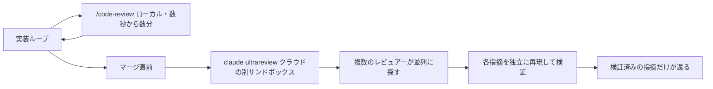
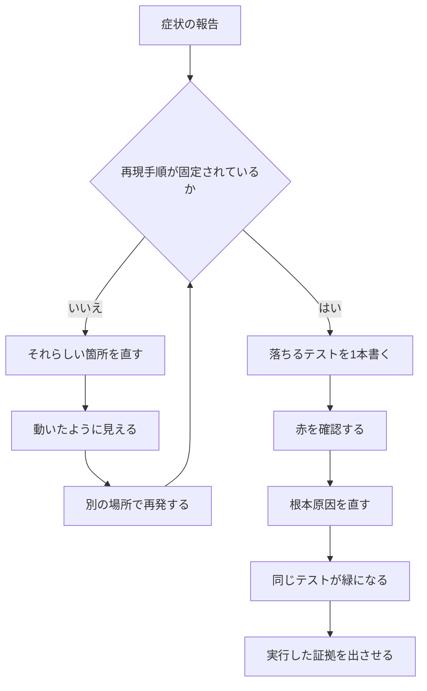
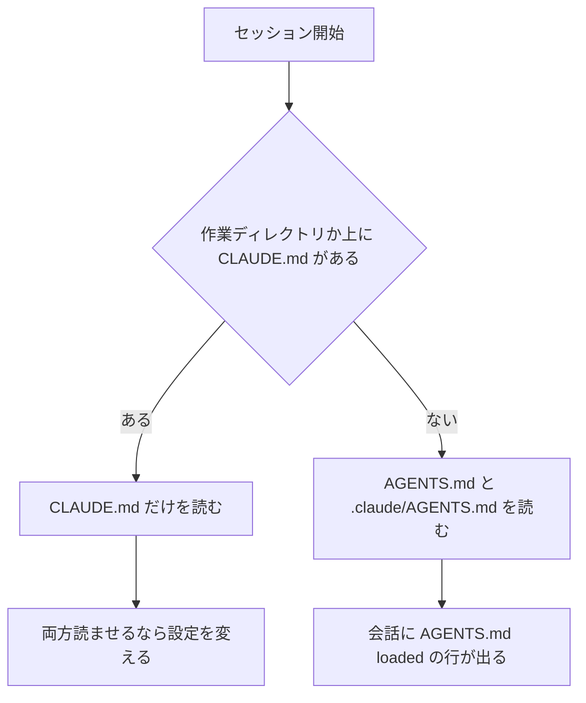

# Claude Daily — 2026-09-19（第028号）

## きょうの3行

- マージ直前の1本は、実装したセッション以外に採点させます。
- デバッグは、直す前に落ちる再現を1本作ると収束します。
- v2.1.277 から `AGENTS.md` を直接読みます。`CLAUDE.md` があれば従来どおりです。

## ① ベストプラクティス — マージ前の1本を、別の場所の敵対的レビューに通す

> - 実装したセッションは、自分が書いた差分を甘く見ます。
> - `/code-review ultra` はクラウドで検証つきのレビューを回します。
> - CI やスクリプトからは `claude ultrareview` を呼びます。

公式のベストプラクティスは「終わったことにする前に、新しい文脈のレビュアーに差分を見せる」と書いています。
その最大版がクラウドで動く ultrareview です。指摘は1件ずつ独立に再現・検証されてから返ります。



図1: ローカルの `/code-review` は反復用、ultrareview はマージ前の一発用

| 値 | 何の数字か |
|---|---|
| 5〜10分 | レビュー1回のおおよその所要時間 |
| 約5〜25ドル | 無料枠のあと、1回あたりの使用クレジット |
| 500ファイル / 8,000行 | ブランチレビューの既定の上限 |
| 45分 | `claude ultrareview` の `--timeout` の既定値 |

| プラン | 無料枠 | 使い切ったあと |
|---|---|---|
| Pro | 3回（アカウントに1度きり・補充なし） | 使用クレジットで課金 |
| Max | 3回（アカウントに1度きり・補充なし） | 使用クレジットで課金 |
| Team / Enterprise | なし | 使用クレジットで課金 |

途中で止めたレビューも、クラウドセッションが始まった時点で無料枠を1回使います。
有料分は走った範囲だけが請求されます。

```bash
#!/usr/bin/env bash
# scripts/pre-merge-review.sh
# マージ前に、クラウドの敵対的レビューを1本だけ通す。
#   scripts/pre-merge-review.sh          … 現在のブランチを既定ブランチと比べる
#   scripts/pre-merge-review.sh develop  … 比較先のブランチを指定する
#   scripts/pre-merge-review.sh 1234     … PR 番号を指定する
set -uo pipefail

findings="$(mktemp)"
trap 'rm -f "$findings"' EXIT

if [ $# -gt 0 ]; then
  claude ultrareview "$1" --timeout 20 >"$findings"
else
  claude ultrareview --timeout 20 >"$findings"
fi
status=$?

case "$status" in
  0)   echo "レビュー完了。指摘は次のとおりです。"; cat "$findings" ;;
  1)   echo "完走しませんでした。起動失敗・エラー・タイムアウトのどれかです。" >&2 ;;
  130) echo "中断しました。リモートのレビューは動き続けています。" >&2 ;;
esac

exit "$status"
```

```json
{
  "name": "my-next-app",
  "private": true,
  "scripts": {
    "dev": "next dev",
    "build": "next build",
    "review:pre-merge": "bash scripts/pre-merge-review.sh"
  }
}
```

上が `scripts/pre-merge-review.sh`、下が `package.json` です。
`npm run review:pre-merge` で呼べます。

#### ❌ `claude -p '/code-review ultra' && npm run deploy`

- `claude -p` はレビューを起動し、追跡リンクを出した時点で終了します。
- 指摘が届く前に抜けるので、この終了コードはレビュー結果ではありません。
- 課金確認は対話セッションが要るため、有料になる回は起動前に止まります。

#### ✅ `claude ultrareview --timeout 20`

- 指摘が届くまでブロックし、終了コード 0 / 1 / 130 を返します。
- 指摘は stdout、進捗とセッションURLは stderr に出ます。
- `--json` を足すと `bugs.json` をそのまま受け取れます。

`--post` を付けない限り PR にコメントは出ません。既定は `--no-post` です。

- 出典: [Find bugs with ultrareview](https://code.claude.com/docs/en/ultrareview)
- 出典: [Best practices for Claude Code](https://code.claude.com/docs/en/best-practices)

## ② 深掘り連載 第22回 — デバッグの詰め方（再現手順を先に固定する）

> - 直す前に、落ちる再現を1本作ります。
> - 渡すのは症状・場所・直った状態の3点です。
> - 同じ訂正を2回したら `/clear` します。



図2: 再現が固定されるまで、ループは閉じない

Claude は「終わったように見えた時点」で止まります。合図が無ければ、止める役は人間の目だけです。
落ちるテストが1本あれば、止まる条件が会話の外側に移ります。

渡す4行はいつも同じ形です。症状・再現・場所・直った状態を、推測を混ぜずに書きます。

```text
症状: /api/cart に同じ商品を2回追加すると、合計金額が1回分になる。
再現: npm run test -- cart で毎回落ちる。断続ではない。
場所: src/lib/cart.ts の数量マージ処理が怪しい。
直った状態: 上のテストが緑になり、既存のテストも全部通る。

まず失敗する最小のテストを追加して、赤になることを確認してください。
そのあとで原因を直し、テストを変えずに緑にしてください。
最後に、実行したコマンドとその出力を貼ってください。
```

「怪しい」と書いた場所は当たりでなくても構いません。探索の出発点を渡すだけで、読む範囲が絞れます。

断続的か常時かも必ず添えます。ここが違うと、再現の作り方が変わります。

| 状況 | 先に再現を固定する | そのまま直しにいく |
|---|---|---|
| 断続的に落ちる | ◯ 再現条件の特定が仕事の本体 | × 直ったかどうか判定できない |
| 本番だけ落ちる | ◯ 環境差をテストに落とし込む | × 手元では一度も落ちない |
| 型エラー・ビルドエラー | △ エラー文がすでに再現手順 | ◯ 出力を貼って根本原因を直させる |
| 画面の見た目のズレ | ◯ スクリーンショットが再現になる | × 「よくして」では止まらない |
| 依存を上げた直後の失敗 | ◯ 版を戻す手順まで書く | × 当たりを引くまで繰り返す |

直ったことの報告は文章で受け取りません。実行したコマンドと出力そのものを貼らせます。
読み返すほうが、自分で再実行するより速く済みます。

同じ訂正を2回したら、文脈は失敗した試行で埋まっています。`/clear` して、学んだことを最初の1通に畳み込みます。

| 用語 | 意味 |
|---|---|
| 再現手順 | 同じ結果を毎回出すための、最短のコマンドと入力 |
| 証拠 | 実行したコマンドと、その出力そのもの |
| 根本原因 | エラーを消す場所ではなく、エラーを生んでいる場所 |

- 出典: [Common workflows — Fix bugs efficiently](https://code.claude.com/docs/en/common-workflows)
- 出典: [Best practices for Claude Code](https://code.claude.com/docs/en/best-practices)

## ③ すぐ効くTIPS

### 1. `AGENTS.md` がそのまま読まれるようになった

他のエージェント向けに書いた指示を、橋渡しなしで使えます。v2.1.277 以降が条件です。
既定では、作業ディレクトリか上に `CLAUDE.md` か `CLAUDE.local.md` があると `AGENTS.md` は読まれません。



図3: `CLAUDE.local.md` も判定に数えられる点に注意

両方読ませる設定です。パスは `~/.claude/settings.json` で、プロジェクト設定では無視されます。

```json
{
  "pluginConfigs": {
    "agents-md@builtin": {
      "options": { "instructionFiles": "claude-md-and-agents-md" }
    }
  }
}
```

### 2. `claude --safe-mode` で切り分ける

CLAUDE.md・スキル・プラグイン・フック・MCP・自作コマンドを全部外して起動します。
認証・モデル・権限はそのまま効くので、症状が消えたら原因はそのどれかです。

```bash
claude --safe-mode
```

それでも直らないときは、設定ディレクトリごと空にして比べます。

```bash
cd /tmp && CLAUDE_CONFIG_DIR=/tmp/claude-clean claude
```

### 3. `/debug` でログを出させてから聞く

セッションのデバッグログを有効にし、その出力と設定のパスを使って Claude 自身に診断させます。

```text
/debug フックが発火しない
```

- 出典: [How Claude remembers your project](https://code.claude.com/docs/en/memory)
- 出典: [Debug your configuration](https://code.claude.com/docs/en/debug-your-config)

## ④ 事例

### 1. デバッグを5段階の手順に落とした報告

Zenn の記事（kuma8088、2026-01-25、二次情報）は、手順のないデバッグを「推測の無限連鎖」と呼んでいます。
症状から解決策へ飛ぶため、失敗が積み上がって元の状態が分からなくなる、という指摘です。

| 値 | 何の数字か |
|---|---|
| 約30分 | 手順なしで進めたときの所要。原因は特定できなかったという報告 |
| 約15分 | 5段階に沿ったときの所要。原因を特定できたという報告 |
| 5段階 | 発見 → 再現 → 根本原因 → 修正 → 検証 |

画面の問題では Playwright の MCP を使い、クリック・コンソール・通信・画面の4点を確認させたとあります。

### 2. チームで運用を揃えるプレイブック

別の Zenn 記事（Shu Hirouchi、2026-03-23、二次情報）は、同じ道具でも運用が揃わないと差が出ると書いています。
数値の実績は示されていません。仕組みの作り方だけが具体的です。

| 値 | 何の数字か |
|---|---|
| 7つ | 全員で揃えるルールの数 |
| 200行 | CLAUDE.md テンプレートの上限 |
| 月15分 | CLAUDE.md の棚卸しにあてる時間 |
| 2人以上 | 共有コマンドに昇格させる利用者の下限 |
| 50% | `/clear` の目安になるコンテキスト使用率 |

効果は「Claude 由来の PR の差し戻し率が3か月で下がるか」で見る、という提案です。

- 出典: [AIにデバッグを丸投げしていませんか？](https://zenn.dev/kuma8088/articles/ai-debugging-systematic-approach)
- 出典: [チームの Claude Code 運用を揃えるプレイブック](https://zenn.dev/bookamasedo/articles/a0160f7c0132da)

## ⑤ 速報 — 新機能・変更点

前回チェックは v2.1.275 でした。v2.1.276 と v2.1.277 が追加されています。

| いつ | 何が | どう効くか |
|---|---|---|
| v2.1.277 | `CLAUDE.md` の無いプロジェクトで `AGENTS.md` を読む | 他ツール用の指示をそのまま使える（設定は③） |
| v2.1.277 | `--worktree` セッションでプロジェクトのスキルが読まれない不具合を修正 | 並行セッションでも `/skills` が揃う |
| v2.1.277 | 作業中に打ったメッセージが無視される不具合を修正 | 割り込みの追記が消えない |
| v2.1.277 | `CLAUDE_GATEWAY_PROXY_IS_EGRESS_BOUNDARY=1` と upstream の `headers:` を追加 | 社内ゲートウェイ運用の調整幅が広がる |
| v2.1.277 | `TaskOutput` ツールと、`claude -p` の Haiku 自動タイトル取得を削除 | 余計な往復が減る |
| v2.1.277 | クラウドの環境が Personal と Organization に分離、組織側は読み取り専用 | 管理画面の「Web」は「Cloud sessions」に改称 |
| v2.1.276 | `ANTHROPIC_BASE_URL` がプロキシやゲートウェイを指すと全リクエストが 400 になる不具合を修正 | 該当者はこの版まで上げる |
| 9/18 | Anthropic が Accenture との提携を発表（embedded evaluation） | 開発者向けの機能変更ではない |

Platform のリリースノートは 9/18 の Compliance API が最新で、前号で扱った分から動いていません。

- 出典: [Claude Code CHANGELOG](https://github.com/anthropics/claude-code/blob/main/CHANGELOG.md)
- 出典: [Anthropic News](https://www.anthropic.com/news)

## ⑥ コマンド早見

| コマンド | 何をするか |
|---|---|
| `/code-review ultra` | クラウドで検証つきの深いレビューを起動する |
| `claude ultrareview --timeout 20` | 同じレビューを非対話で走らせ、指摘が届くまで待つ |
| `claude ultrareview 1234 --json` | PR 1234 をレビューし、`bugs.json` をそのまま出す |
| `npm run review:pre-merge` | 上のスクリプトでマージ前レビューを1本通す |
| `claude --safe-mode` | すべてのカスタマイズを外して起動する |
| `CLAUDE_CONFIG_DIR=/tmp/claude-clean claude` | 設定ディレクトリごと空にして起動する |
| `/debug` | デバッグログを出して Claude 自身に原因を調べさせる |
| `/skills` | 読み込まれているスキルの一覧を出す |
| `/clear` | 文脈を捨てて最初から組み直す |
| `git diff --stat` | どのファイルが何行変わったかだけを見る |

## ⑦ きょうの課題

**所要**: 10〜15分

**前提**: Next.js のプロジェクトと、動くテストランナー（Vitest でも Jest でも可）。

**手順**

1. `src/lib/cart.ts` を下のコードにする。合計金額が静かに間違う。
2. Claude に②の4行を渡す。落ちるテストを先に書かせ、赤を確認させる。
3. 直させたあと、`git diff --stat` を見る。テストファイルが変わっていなければ成功。

```ts
// src/lib/cart.ts
export type Item = { id: string; price: number; qty: number }

export function total(items: Item[]): number {
  const merged = new Map<string, Item>()
  for (const item of items) merged.set(item.id, item)
  return [...merged.values()].reduce((sum, i) => sum + i.price * i.qty, 0)
}
```

── 模範解答 ──

同じ `id` を2回入れると、`Map` が後勝ちで上書きします。数量が合算されず、最後の1件だけが数えられます。
正しくは数量を足し合わせます。

```ts
// src/lib/cart.ts
export type Item = { id: string; price: number; qty: number }

export function total(items: Item[]): number {
  const qtyById = new Map<string, Item>()
  for (const item of items) {
    const found = qtyById.get(item.id)
    qtyById.set(item.id, found ? { ...found, qty: found.qty + item.qty } : item)
  }
  return [...qtyById.values()].reduce((sum, i) => sum + i.price * i.qty, 0)
}
```

**なぜそうなるのか**

このバグは例外を出しません。合計が小さいだけなので、赤いテストが1本無いと「直った」の判定ができません。
再現を先に固定すると、判定が会話の外に出ます。

**よくある詰まりどころ**

- 再現を書かせる前に直し始める → 「まず失敗するテストを追加して赤を確認」と1文で縛る。
- テストのほうを緩めて緑にする → `git diff --stat` にテストファイルが出ていたら疑う。
- `/rewind` で戻したのに変更が残る → Bash 由来の変更と、バックグラウンドで走るサブエージェントの編集は対象外（第21回）。

あすの予告: 第23回は「長時間タスクの分割とバックグラウンド実行」です。
