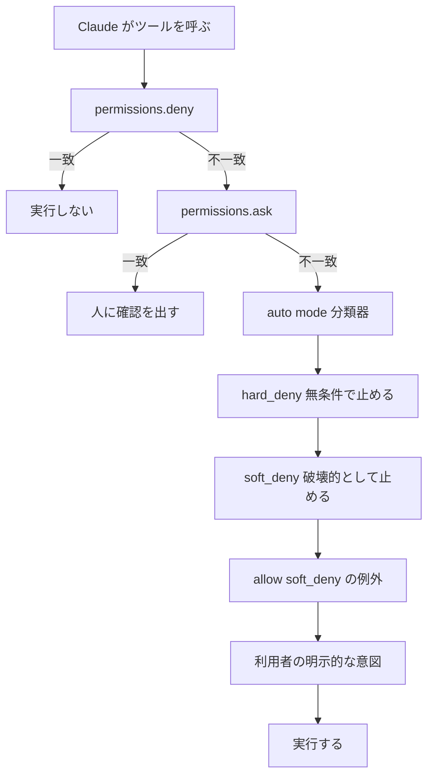
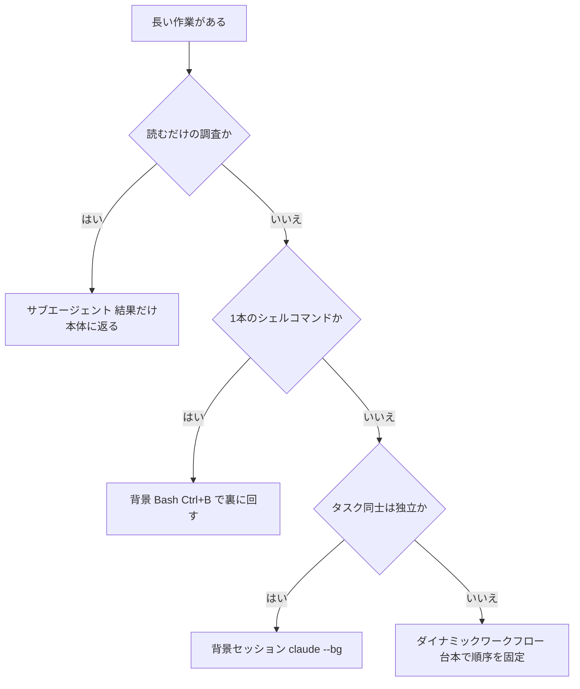
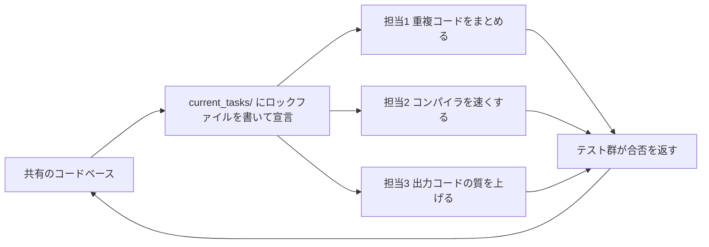

# Claude Daily — 2026-09-20（第029号）

## きょうの3行

- auto mode の分類器に、自社の宛先を `~/.claude/settings.json` で教えます。
- 長い作業は「背景 Bash・背景セッション・クラウド」の3段に逃がします。
- v2.1.278 で、auto mode の分類器がサーバー側で動く既定に変わりました。

## ① ベストプラクティス — 分類器に「うちの中と外」を教える

> - auto mode の既定は、作業ディレクトリと現在のリポジトリのリモートだけを信頼します。
> - 社内レジストリや共有バケットは、名前を書くまで「外部」と見なされます。
> - 書き先は `~/.claude/settings.json` です。プロジェクト設定からは読まれません。

auto mode は権限システムの後ろに立つ2枚目の門です。
`deny` と `ask` のルールは分類器より先に評価され、auto mode でも止まります。



図1: 分類器は権限ルールの後ろ。分類器の中でも4段の優先順位がある

| 境界の強さ | 書くもの | auto mode での挙動 |
|---|---|---|
| 必ず人に聞かせたい | `permissions.ask` | 分類器は自動承認できない。毎回プロンプトが出る |
| 絶対に走らせたくない | `permissions.deny` | 分類器に届く前に止まる。意図でも覆せない |
| 今回だけ止めたい | 会話で「push する前に見せて」と言う | 分類器は従うが、コンパクションで消えることがある |

分類器が既定で信頼するのは、いま開いているリポジトリとそのリモートだけです。
社内の GitHub Enterprise や npm レジストリは、名前を書くまで送信先として疑われます。

```json
{
  "autoMode": {
    "environment": [
      "$defaults",
      "Organization: Acme Inc. Primary use: software development",
      "Source control: github.example.com/acme-corp and all repos under it",
      "Internal package registry: npm installs route through npm.example.com",
      "Trusted internal domains: *.corp.example.com, api.internal.example.com",
      "Trusted cloud buckets: s3://acme-build-artifacts",
      "Key internal services: Jenkins at ci.example.com",
      "Sensitive remote targets: the prod-* Kubernetes namespaces"
    ]
  },
  "permissions": {
    "ask": ["Bash(git push *)", "Bash(gh pr create *)"]
  }
}
```

配置先は `~/.claude/settings.json` です。保存したら、次の2つで効き目を確かめます。

```bash
# 分類器が実際に使うルールを、$defaults を展開した形で表示する
claude auto-mode config

# 自分で書いた allow / soft_deny / hard_deny に AI のダメ出しをもらう
claude auto-mode critique
```

`environment` の中身は正規表現でもツールのパターンでもありません。
新人に自社インフラを説明する文章として読まれます。散文で書いてください。

#### ❌ `$defaults` を書かずに配列を置き換える

```json
{
  "autoMode": {
    "soft_deny": ["Never touch infra/terraform/prod/"]
  }
}
```

この1行で、組み込みの soft_deny が丸ごと消えます。
force push も `curl | bash` も本番デプロイも、止める側のルールが無くなります。

#### ✅ `$defaults` を先頭に置いて足す

```json
{
  "autoMode": {
    "soft_deny": ["$defaults", "Never touch infra/terraform/prod/"]
  }
}
```

`"$defaults"` の位置に組み込みルールが差し込まれます。
版が上がるたびに増える組み込みルールも、そのまま受け取れます。

もう1つの外し方は、置き場所の間違いです。
分類器は `.claude/settings.json` と `.claude/settings.local.json` を読みません。
リポジトリに入ったファイルが自分で allow を足せてしまうからです。

出典: [Configure auto mode](https://code.claude.com/docs/en/auto-mode-config)

## ② 深掘り連載 第23回 — 長時間タスクの分割とバックグラウンド実行

> - 分ける判断は「文脈を汚すか」「同じファイルを触るか」の2つで決まります。
> - 背景 Bash はコマンドを裏に回すだけで、エージェントは増えません。
> - 背景セッションは編集の前に自動で worktree へ移り、衝突を避けます。



図2: 4つの逃がし先。判断は「読むだけか」「1コマンドか」「独立か」の順

| 手段 | 何をくれるか | 選ぶとき |
|---|---|---|
| サブエージェント | 別文脈で調べ、要約だけ返す子 | 検索結果やログで本体の文脈が埋まるとき |
| エージェントビュー | 背景セッションを1画面で並べる（研究プレビュー） | 独立したタスクを投げ、必要なときだけ入りたい |
| エージェントチーム | 共有タスクリストと相互メッセージ（実験・既定オフ） | Claude 自身に分割と割り当てまでさせたい |
| ダイナミックワークフロー | 多数のサブエージェントを台本で回し、結果を突き合わせる | 1ターンでは収まらない規模や、検証つきの反復 |
| プロジェクト | クラウドの並列スレッドと共有メモリ（Pro / Max のパブリックベータ） | 数日から数週間続き、自分の機械が落ちていても進めたい |

背景セッションは `claude --bg` で投げ、`claude agents` で眺めます。
投げたセッションはファイルを編集する前に `.claude/worktrees/` の下へ移ります。

```bash
# 名前とモデルを付けて背景セッションを投げる
claude --bg --name "flaky-test-fix" --model opus "investigate the flaky settings test"

# シェルコマンドだけを背景ジョブとして走らせる
claude --bg --exec 'pytest -x'

# 一覧・出力・停止・再起動をシェルから操作する
claude agents
claude logs <id>
claude stop <id>
claude respawn <id>
```

`<id>` は `claude agents --json` に出るセッション ID です。
いま開いているセッションごと裏に回すなら `/background`、複製を裏で走らせるなら `/fork` を使います。

背景 Bash はこれとは別の仕組みです。
`Ctrl+B` で走行中の Bash を裏に送り、出力はファイルに書かれます。
tmux では prefix キーと重なるので、`Ctrl+B` を2回押します。

| 止まる条件 | 内容 |
|---|---|
| 出力が 5GB を超えた | 強制終了し、理由が stderr に出る |
| メモリ逼迫の通知が来た | セッションが30分以上アイドルで、手番もサブエージェントも動いていないときだけ止まる |
| Claude Code を終了した | 背景タスクも片付く。`setsid` などで離れたプロセスも巻き込む |
| セッションを裏に回した | 止まらない。背景セッションの中で走り続ける |

メモリ逼迫での停止は `CLAUDE_CODE_DISABLE_BG_SHELL_PRESSURE_REAP=1` で切れます。
サブエージェントが持つ背景コマンドには時間制限がありません。

| 使うべき時 | 使うべきでない時 |
|---|---|
| dev サーバーやビルドを走らせたまま会話を続けたい | 出力を今すぐ読んで次の1手を決めたい |
| 独立した3件の改修を同時に進めたい | 同じファイルを触る改修を同時に投げたい |
| 調査で本体の文脈を埋めたくない | 調査の途中経過を自分で見て舵を切りたい |
| 自分の機械を閉じても進めたい | 手元の未コミット変更に依存する作業 |

走っているものの確認先は手段ごとに違います。

| 対象 | 確認するコマンド |
|---|---|
| 背景セッション | `claude agents` |
| いまのセッションの背景タスク | `/tasks` |
| ダイナミックワークフロー | `/workflows` |

- 出典: [Run agents in parallel](https://code.claude.com/docs/en/agents)
- 出典: [Manage multiple agents with agent view](https://code.claude.com/docs/en/agent-view)
- 出典: [Interactive mode](https://code.claude.com/docs/en/interactive-mode)

## ③ すぐ効くTIPS

### 1. `!` で打ったコマンドへの自動返答を止める

シェルモードの出力が届くと、Claude は何も言わなくても解説を返します。
この返答は通常のプロンプト1回と同じ料金がかかります。ビルドを流すだけの時は無駄です。

```json
{
  "respondToBashCommands": false
}
```

### 2. 夜通しの背景タスクが勝手に死ぬのを防ぐ

背景タスクは、OS のメモリ逼迫の通知を受けると止まります。
ただし条件があり、セッションが30分以上アイドルで、手番もサブエージェントも動いていないときだけです。

```bash
CLAUDE_CODE_DISABLE_BG_SHELL_PRESSURE_REAP=1 claude
```

### 3. 組み込みルールを1本だけ全文で読む

`claude auto-mode defaults` は4つのリストを全部吐くので長すぎます。
`--label` を付けると、ラベルの先頭一致で1本だけ読めます。

```bash
claude auto-mode defaults --label 'Git Destructive'
```

## ④ 事例

### 1. 16体のエージェントで C コンパイラを書いた（Anthropic）

| 値 | 何の数字か |
|---|---|
| 16体 | 並列で走らせたエージェントの数 |
| 約2,000 | 2週間で消費した Claude Code セッションの数 |
| 20億 / 1.4億 | 入力トークン / 出力トークン |
| 約20,000ドル | かかった費用 |
| 10万行 | できあがった Rust 製コンパイラの行数 |

成果物は Linux 6.9 を x86・ARM・RISC-V で起動可能な形にビルドできます。
QEMU・FFmpeg・SQLite も通り、主要なコンパイラテスト群で99%の合格率だったと報告されています。

分割の仕組みは単純です。
各エージェントは `current_tasks/` にロックファイルを書いて作業を宣言し、重複を避けました。
中央の指揮役は置かず、ほとんどは「次にいちばん明らかな問題」を自分で取ります。



図3: 指揮役を置かず、ロックファイルで担当を宣言して重複を避ける

そのうえで役割の専門化が現れました。
重複コードをまとめる担当、コンパイラ自体を速くする担当、出力コードの質を上げる担当に分かれています。

Linux カーネルのビルドで詰まったときの打開策が、この号のテーマと重なります。
大きな1本のタスクは、ほとんどを GCC に通し、残りだけを自作コンパイラに通す形へ割りました。
並列にデバッグできる小さな単位に戻したわけです。

出典: [Building a C compiler with a team of parallel Claudes](https://www.anthropic.com/engineering/building-c-compiler)

### 2. 5社の配り方から見た2026年の指針（二次情報）

5社の社内展開を比べた記事があります（2026-07-30）。
筆者が各社の公開情報をまとめたもので、一次情報ではありません。

| 共通の判断軸 | 決めること |
|---|---|
| 配る範囲 | エンジニアだけか、非エンジニアも含めるか |
| 自律実行の許容度 | 承認フローか、MDM で強制か、auto mode か |
| 文脈の作り方 | CLAUDE.md / MCP / プラグイン / スキルの分担 |

記事では、並列セッションと Managed Agents を Slack に繋いだ企業が挙がっています。
そこでは機能の納期が24日から5日になったと紹介されています。

出典: [Claude Codeを会社で配るとき何が正解か — 5社事例から見えた2026年の指針](https://zenn.dev/yukibjj/articles/claude-code-enterprise-rollout-5-companies-2026)

## ⑤ 速報 — 新機能・変更点

| いつ | 何が | どう効くか |
|---|---|---|
| v2.1.278 | Claude API と Enterprise の Bedrock / Vertex / Foundry / ゲートウェイで、auto mode の分類器が既定でサーバー側実行に | 分類器のオーバーヘッドが手元から離れる。戻すなら `CLAUDE_CODE_AUTO_MODE_SERVER=0` |
| v2.1.278 | `/status` に「Auto mode server」の行が増えた | いまのセッションの分類器がどちら側で走っているか読める |
| v2.1.278 | 分類器のオーバーヘッドが課金されるフォールバック時に警告が出る | 請求が増える状況に気づける |

Platform リリースノートは 9/18 の Compliance API が最新で、前号から動きはありません。
`anthropic.com/news` と `anthropic.com/engineering` にも新規の追加はありませんでした。

出典: [Claude Code CHANGELOG](https://github.com/anthropics/claude-code/blob/main/CHANGELOG.md)

## ⑥ コマンド早見

| コマンド | 何をするか |
|---|---|
| `claude auto-mode config` | 分類器が実際に使うルールを表示する |
| `claude auto-mode critique` | 自作の allow / soft_deny / hard_deny にダメ出しをもらう |
| `claude auto-mode defaults --label 'Git Destructive'` | 組み込みルールをラベルの先頭一致で1本だけ読む |
| `claude --bg --name "<名前>" "<指示>"` | 名前付きの背景セッションを投げる |
| `claude --bg --exec '<コマンド>'` | シェルコマンドだけを背景ジョブにする |
| `claude agents` | 背景セッションを1画面に並べる |
| `claude agents --json` | セッション一覧を JSON で出す |
| `claude logs <id>` | 背景セッションの直近の出力を見る |
| `claude stop <id>` | 背景セッションを止める |
| `claude respawn <id>` | 止まった背景セッションを起動し直す |
| `/tasks` | いまのセッションの背景タスクを一覧・停止する |
| `/background` | いま開いている会話を背景に回す |
| `/fork` | 会話を複製して背景セッションにする |
| `/workflows` | ダイナミックワークフローの進行を見る |
| `/permissions` | 権限と auto mode のルールを画面から編集する |

## ⑦ きょうの課題

| 項目 | 内容 |
|---|---|
| 所要 | 10〜15分 |
| 前提 | Next.js のリポジトリ。Claude Code は v2.1.198 以降で `claude agents` が使える版 |

**やること**: 重いコマンドを背景に逃がし、空いた手で別のタスクを背景セッションに投げます。

**手順**

1. セッションを開き、`! npm run build` を実行する。走り始めたら `Ctrl+B` を押す（tmux なら2回）。
2. `/tasks` を開き、ビルドが背景タスクとして並んでいることを確かめる。
3. 待たずに、別ターミナルで独立したタスクを背景セッションへ投げる。

```bash
claude --bg --name "readme-audit" "README.md の手順を実際に実行し、動かない行だけを一覧にして"
```

4. `claude agents` を開く。行を選んで `Space` で覗き、`Enter` で中に入る。`←` で戻る。
5. `claude agents --json` でセッション ID を取り、`claude logs <id>` が同じ出力を返すか見る。

**確認方法**: `.claude/worktrees/` に背景セッション用のディレクトリができていれば、編集の隔離が効いています。

── 模範解答 ──

3つの逃がし方が、それぞれ別の仕組みであることを体で確かめる課題です。

| やったこと | 実体 |
|---|---|
| `Ctrl+B` | Bash ツールの呼び出しを非同期にした。エージェントは増えていない |
| `claude --bg` | 独立した1セッションを立てた。編集の前に worktree へ移る |
| `claude agents` | 走っている背景セッションを1画面に集めた |

**なぜそうなるのか**: 背景 Bash の出力はファイルに書かれ、Claude は Read ツールで取りに行きます。
つまり出力を待つあいだ、会話の手番は空いたままです。
ビルドとテストを裏に回すだけで、待ち時間がそのまま作業時間に変わります。

背景セッションを worktree に隔離するのは、同時編集の衝突を避けるためです。
隔離は `worktree.bgIsolation` を `"none"` にすると切れますが、公式には推奨されていません。

**よくある詰まりどころ**

- tmux で `Ctrl+B` が効かない → prefix キーと重なるので2回押す。
- 背景タスクが朝には消えている → メモリ逼迫での自動停止。③の2を設定する。
- `claude agents` がサブエージェントの一覧を出す → 版が古い。`claude update` を実行する。
- 背景セッションが「失敗」と出ている → シャットダウンで止まった場合、48時間以内なら再接続で再開する。

あすの予告: 第24回は「既存の大きなコードベースへの入り方」です。
