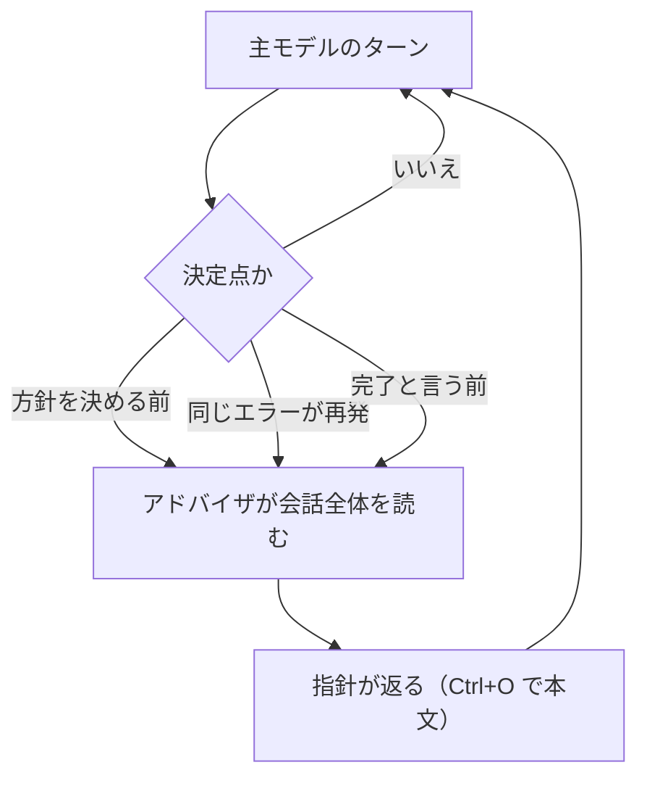
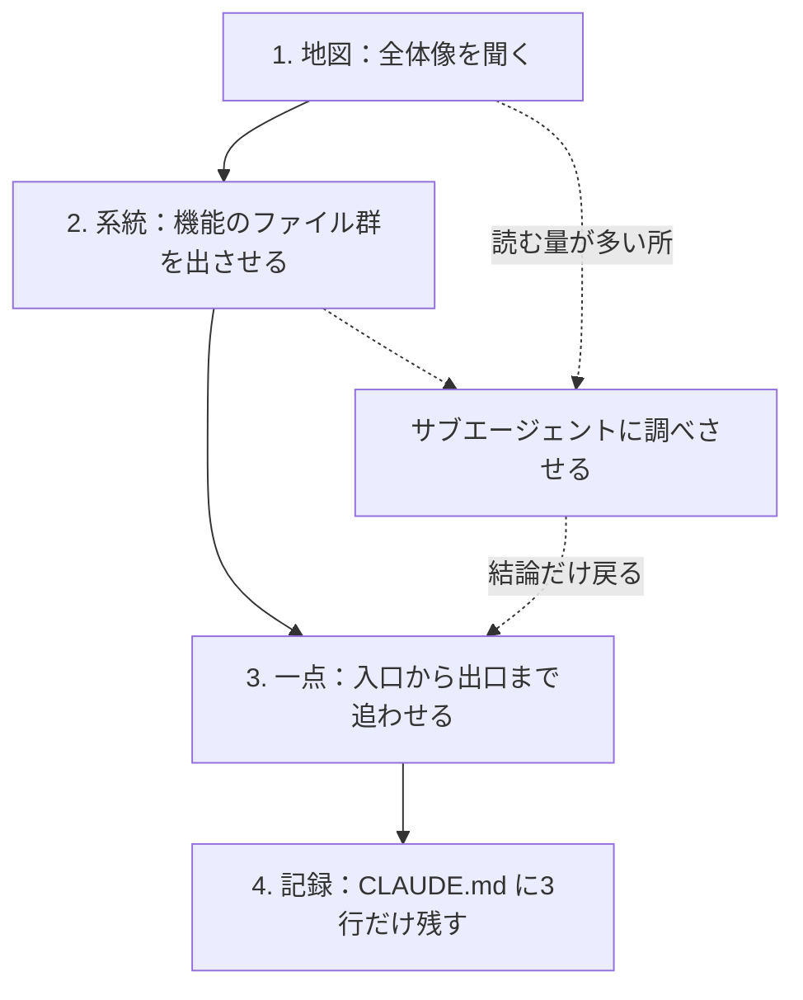

# Claude Daily — 2026-09-21（第030号）

## きょうの3行

- 主モデルは速いまま、要所だけ強いモデルに相談させます（アドバイザ）。
- 大きなコードベースには「地図 → 系統 → 一点 → 記録」の順で入ります。
- 本日は特筆すべき新機能の発表はありませんでした。

## ① ベストプラクティス — 要所だけ強いモデルに上げる

> - アドバイザは、主モデルが決定点で相談する2つ目のモデルです。
> - 有効にするのは `advisorModel` の1行か `/advisor` の1コマンドです。
> - 組み合わせには制限があり、外すと毎回 API エラーになります。

速いモデルで1日回すと、方針の分かれ目で選択を誤ります。
かといって全ターンを最上位モデルにすると、待ち時間も利用量も増えます。
アドバイザは、その分かれ目だけを強いモデルに投げる仕組みです。



図1: 呼ぶかどうかは Claude が決める。呼ぶ回数の上限を設定する項目はない

設定は次の3通りです。どれを使っても、主モデルの手番はそのままです。

```json
{
  "advisorModel": "opus"
}
```

上は `~/.claude/settings.json`（ユーザー設定）に置く形です。
セッション単位で試すなら、起動フラグか会話中のコマンドを使います。

```bash
# このセッションだけアドバイザを付ける（保存された設定は変えない）
claude --model sonnet --advisor opus
```

```text
/advisor opus     ← 会話中に設定し、ユーザー設定に保存する
/advisor off      ← このセッションから外す
```

| 主モデル | 受け付けるアドバイザ | 外したときの出方 |
|---|---|---|
| Haiku 4.5 | Fable / Opus / Sonnet | Haiku はアドバイザになれない |
| Sonnet 5 | Fable / Opus 4.7 以降 / Sonnet 5 | Sonnet 4.6 は拒否、Opus 4.6 は API エラー |
| Opus 5 | Fable / Opus 5 | Opus 4.7・4.8 は API エラー |
| Fable 5.1 | Fable 5.1 | Opus・Sonnet は拒否、Fable 5 は API エラー |

#### ❌ 安いからと Haiku をアドバイザにする

```bash
claude --advisor haiku
```

Haiku は呼ぶ側になれますが、アドバイザにはなれません。
起動時にエラーで終了します。背景セッションだけは、アドバイザ無しで起動します。

#### ✅ 主モデルと同等以上から選ぶ

```bash
claude --model sonnet --advisor opus
```

拒否と API エラーは別物です。前者は付けずに走り、後者は毎リクエストが落ちます。
Opus 4.6 をアドバイザにした Sonnet 5 の session は、後者に当たります。

| 項目 | 内容 |
|---|---|
| 提供 | 実験的。Anthropic API のみ（Bedrock・AWS・Google Cloud・Foundry は不可） |
| 課金 | アドバイザのトークンも利用量に加算。`/usage` の合計に含まれる |
| キャッシュ | 途中で入れても主モデルのプロンプトキャッシュは壊れない |
| 全面停止 | `CLAUDE_CODE_DISABLE_ADVISOR_TOOL=1` で `/advisor` ごと無効 |

サブエージェントは設定されたアドバイザを引き継ぎ、自分のモデルで同じ検査を受けます。
`DISABLE_TELEMETRY` のようにフラグ取得を止める変数があると、アドバイザは無効のままです。

出典: [Escalate hard decisions with the advisor tool](https://code.claude.com/docs/en/advisor)
出典: [Commands（/advisor）](https://code.claude.com/docs/en/commands)

## ② 深掘り連載 第24回 — 既存の大きなコードベースへの入り方

> - 入る順番は「地図 → 系統 → 一点 → 記録」の4段です。
> - 探索はサブエージェントに逃がし、本体には結論だけ戻します。
> - どこで `claude` を起動したかで、読み込まれる規約が変わります。

初日にやることは、コードを直すことではありません。
その日のうちに質問できる状態を作ることです。



図2: 1〜3は読むだけ。plan モードで起動すると、この間は書き込みが起きない

```text
give me an overview of this codebase
explain the main architecture patterns used here
find the files that handle user authentication
trace the login process from front-end to database
```

上の4行は公式ドキュメントの例です。広く聞いてから、狭く聞きます。
シニアの同僚に聞く質問と同じもの（ログの仕組み、API の足し方、この分岐の理由）が、そのまま使えます。

読む量が増えそうなときは、最初から別のコンテキストへ逃がします。

```text
use a subagent to investigate how our auth system handles token refresh
```

| 起動する場所 | 触れるファイル | 起動時に読む CLAUDE.md | 向く場面 |
|---|---|---|---|
| リポジトリのルート | 全部 | ルートのみ。下位は読んだ時に随時 | 変更が複数パッケージにまたがる |
| サブディレクトリ | その配下だけ | そこと親すべて | 作業が1パッケージに収まる |

`/context` の **Memory files** に、実際に読まれた規約が出ます。ここを最初に確認します。

| 手段 | 使うべき時 | 使うべきでない時 |
|---|---|---|
| 質問だけで済ます | 構造や用語を知りたい。まだ直さない | 直す対象がもう決まっている |
| plan モードで起動 | 不慣れな領域。複数ファイルに及ぶ | 差分を1文で説明できる小さな修正 |
| サブエージェント | 調査でファイルを大量に読む | 読む先が2〜3ファイルと分かっている |
| `/init` で CLAUDE.md | 質問の答えが安定してきた時 | 初日のまだ間違いを含む理解 |

最後の「記録」は、分かったことを次のセッションへ渡す作業です。

```bash
# 現在のプロジェクト構成から CLAUDE.md の初版を作る
claude
> /init
```

書き足す基準は4つです。同じ間違いが2度出た時、レビューで指摘された時、前回と同じ訂正を打った時、新しい同僚にも要る文脈の時。
手順や一部の領域だけの話は、CLAUDE.md ではなくスキルかパス指定のルールに置きます。

| 用語 | 意味 |
|---|---|
| 地図 | ディレクトリ構成ではなく、責務の分かれ方の理解 |
| 系統 | 1つの機能に関わるファイルの集まり |
| 自動メモリ | Claude が自分で書き足す覚え書き。毎回先頭200行（25KB まで）が読まれる |

出典: [Common workflows（Understand new codebases）](https://code.claude.com/docs/en/common-workflows)
出典: [Best practices（Ask codebase questions）](https://code.claude.com/docs/en/best-practices)
出典: [Set up Claude Code in a monorepo or large codebase](https://code.claude.com/docs/en/large-codebases)
出典: [How Claude remembers your project](https://code.claude.com/docs/en/memory)

## ③ すぐ効くTIPS

**1. `@` でディレクトリを指すと、中身ではなく一覧が入る**

読ませたいのが中身なら、ファイルまで指定します。ディレクトリ参照は構成の確認用です。

```text
Explain the logic in @src/lib/auth.ts
What's the structure of @src/components
```

**2. `@` で参照すると、その親の CLAUDE.md も一緒に入る**

参照したファイルのディレクトリと、その上位の CLAUDE.md が文脈に足されます。
モノレポで別パッケージのファイルを指すと、そのパッケージの規約まで載ります。

```text
Explain @packages/web/src/app/page.tsx
```

**3. CI から呼ぶときは履歴を残さない**

`claude -p` の実行は既定で再開可能なセッションとして保存されます。
共有ランナーでは、次のフラグで保存自体を止められます（print モード専用）。

```bash
claude -p "list all API endpoints" --output-format json --no-session-persistence
```

**4. `/insights` で自分の使い方をレポートにする**

このマシンの直近セッションを解析し、どのプロジェクトで何に詰まったかを HTML で出します。

```text
/insights
```

出典: [Common workflows（Reference files and directories）](https://code.claude.com/docs/en/common-workflows)
出典: [CLI reference](https://code.claude.com/docs/en/cli-reference)

## ④ 事例

**1. 4人のチームで1か月だけ回して数字を出した（二次情報）**

全社展開の前に、自分のチームだけで試した記録です。

| 値 | 何の数字か |
|---|---|
| 8 → 27件 | 4週間でのイシュー消化数（3.4倍） |
| 14.9 → 4.9日 | PR がマージされるまでの日数（67%短縮） |
| 11 → 111個 | テスト関数の数（10.1倍） |
| 2,136 → 987行 | PR 1本あたりの行数（54%減） |
| 約3% | 配ったテンプレート PR がマージされた割合 |


図3: 報告されている2段レビュー。人の手番を仕様の確認だけに寄せている

仕様を先に書く進め方を入れた結果、テストが先に増えたという報告があります。
AI が1次、人が仕様との整合を見る2段レビューで、マージまでの日数が縮んだとしています。
一方で GitHub Actions によるテンプレート一斉配布はほぼ使われず、理由を「なぜ要るのかの説明が無かったこと」と振り返っています。

出典: [Claude Code活用を社内で1ヶ月推進した際の備忘録（Zenn / monokaai、2026-03-17）](https://zenn.dev/spectee/articles/claude-code-internal-promotion-1month)

**2. 大きなコードベースで先行しているチームの共通点（一次情報）**

Anthropic が、大規模なリポジトリで運用中のチームから型を3つ挙げています。

| 型 | 中身 |
|---|---|
| 辿れるようにする | CLAUDE.md を薄く階層化し、ルートではなくサブディレクトリから起動する |
| 設定を保つ | 3〜6か月ごとに見直す。今のモデル向けの指示が次のモデルの邪魔になる |
| 持ち主を決める | 専任チームか DRI を1人置き、設定・権限・プラグインを管理する |

エージェント管理者という職務（PM と開発者の中間）が現れている、とも書かれています。
導入効果の数値は記事にありません。

出典: [How Claude Code works in large codebases（Anthropic、2026-05-14）](https://claude.com/blog/how-claude-code-works-in-large-codebases-best-practices-and-where-to-start)

## ⑤ 速報 — 新機能・変更点

本日は特筆すべき発表はありませんでした。前回チェック以降、巡回先のいずれにも新規の更新がありません。

| 確認先 | 最終更新 | 前号からの差分 |
|---|---|---|
| Claude Code CHANGELOG | v2.1.278 | なし（第029号で既報） |
| Platform リリースノート | 2026-09-18 | なし（Compliance API、既報） |
| anthropic.com/news | 2026-09-18 | なし（Accenture との提携、既報） |
| anthropic.com/engineering | 2026-04-23 | なし |
| claude.com/customers | 2026-09-16 | なし（Impel、第026号で既報） |

## ⑥ コマンド早見

| コマンド | 何をするか |
|---|---|
| `/advisor opus` | アドバイザを Opus に設定し、ユーザー設定に保存する |
| `/advisor off` | アドバイザを外す |
| `claude --model sonnet --advisor opus` | このセッションだけ主モデルとアドバイザを指定して起動 |
| `claude --permission-mode plan` | 書き込みを止めたまま読み・計画だけさせる |
| `/init` | プロジェクト構成から `CLAUDE.md` の初版を作る |
| `/context` | 読み込まれた規約とコンテキストの内訳を見る |
| `/insights` | 直近セッションを解析した HTML レポートを出す |
| `claude -p "…" --no-session-persistence` | print モードで実行し、セッションを保存しない |

## ⑦ きょうの課題

**前提**: 自分が書いていない Next.js のリポジトリを1つ用意します。業務のものでも、GitHub から clone した OSS でも構いません。

**手順**

1. リポジトリの直下で `claude --permission-mode plan` を起動する。
2. `give me an overview of this codebase` と聞き、返答を読む。
3. 次に `find the files that handle routing` と聞く。
4. `use a subagent to investigate how data fetching is done in this app` を投げる。
5. `/context` を開き、**Memory files** に何が載っているかを見る。
6. 分かったことを3行だけ `CLAUDE.md` に書く（無ければ `/init` で作る）。

**確認方法**: 手順4の前後で `/context` の使用量を比べます。サブエージェントが読んだファイルが本体に載っていなければ成功です。

── 模範解答 ──

**答え**: 3と4の違いが要点です。

| 手順 | 読む場所 | 本体に残るもの |
|---|---|---|
| 3. `find the files ...` | 本体のコンテキスト | 読んだファイルの中身そのもの |
| 4. `use a subagent ...` | 別のコンテキスト | 返ってきた要約だけ |

**なぜそうなるのか**: 調査は読むファイル数が読めません。
本体で読むと、実装に使うはずの領域が調査ログで埋まります。
サブエージェントは自分のコンテキストで読み、要約だけを本体に返します。

**よくある詰まりどころ**

| 症状 | 原因 | 対処 |
|---|---|---|
| plan モードなのに編集された | 承認時にモードから出ている | 状態表示の `⏸ plan mode on` を確認する |
| Memory files が空 | CLAUDE.md がまだ無い | `/init` で初版を作る |
| 手順4でも使用量が増える | 本体が先に同じファイルを読んでいる | `/clear` してから投げ直す |
| 書いた3行が効かない | 内容がコードから分かる事実 | 「コマンド」「落とし穴」に絞る |

あすの予告: 第25回は「CI との連携 — GitHub Actions で Claude を動かす」です。
