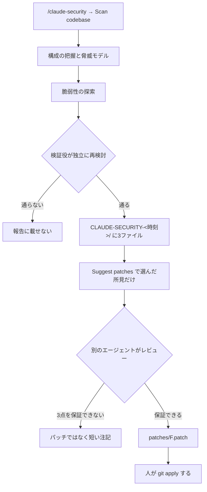
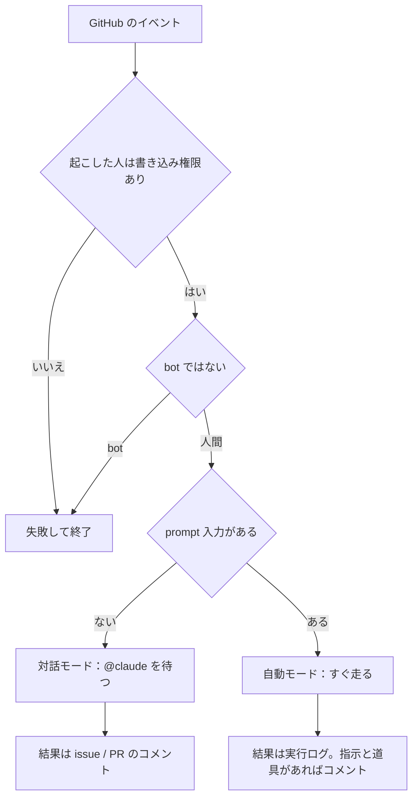
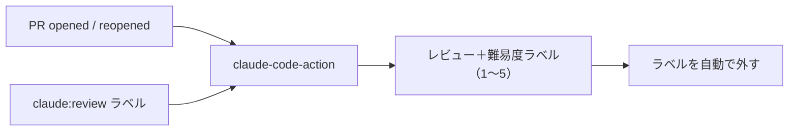

# Claude Daily — 2026-09-22（第031号）

## きょうの3行

- 脆弱性は「読める報告」と「適用前のパッチ」にして受け取ります。
- GitHub Actions は `prompt` の1行だけで挙動が変わります。
- 本日は特筆すべき新機能の発表はありませんでした。

## ① ベストプラクティス — 脆弱性を「レビューできる差分」で受け取る

> - claude-security は、複数のエージェントで走査するプラグインです。
> - 所見は別の検証役を通ったものだけが報告に残ります。
> - パッチは書き出されるだけで、適用は必ず人の手です。

「セキュリティを見て」と1回頼む形には限界があります。
指摘が多すぎて読まれず、直す段になって根拠を追えないからです。
このプラグインは、走査と検証と修正案の作成を別の役に分けます。



図1: 書く役と通す役が別。最後の適用だけは自動化されない

導入は1コマンドです。市場が見つからないと言われたら、先に登録します。

```text
/plugin install claude-security@claude-plugins-official
/plugin marketplace add anthropics/claude-plugins-official
```

チームに配るなら、リポジトリの設定に書いて共有します。

```json
{
  "enabledPlugins": {
    "claude-security@claude-plugins-official": true
  }
}
```

上は `.claude/settings.json` です。前提は次の3つで、どれか欠けると走りません。

| 前提 | 条件 |
|---|---|
| プラン | 有料プラン。Pro は `/config` の Dynamic workflows を先にオンにする |
| Python | `python3` が 3.9 以上で `PATH` にある（標準ライブラリだけを使う） |
| Git | 差分スキャンとパッチ作成に必要。全体スキャンは未管理のディレクトリでも動く |

結果はリポジトリ直下のタイムスタンプ付きディレクトリに出ます。

| ファイル | 中身 |
|---|---|
| `CLAUDE-SECURITY-RESULTS.md` | 所見の報告。ID・影響・悪用の筋道・深刻度・確信度・推奨 |
| `CLAUDE-SECURITY-RESULTS.jsonl` | 同じ所見を1行1オブジェクトで機械可読に |
| `CLAUDE-SECURITY-RESULTS.sarif` | SARIF 2.1.0。GitHub code scanning などが読める。分類は CWE |
| `CLAUDE-SECURITY-REVISION-<commit>.json` | どのコミットを、どの労力で、どこまで検証したかの刻印 |

このディレクトリは自前の `.gitignore` を持ちます。
監査のために履歴へ残すなら、その `.gitignore` だけを消してコミットします。

#### ❌ 作業中の編集を残したまま差分スキャンする

```bash
git status --short   # 未コミットの変更が残っている
# → /claude-security でブランチの差分をスキャン → 「指摘なし」
```

差分スキャンが読むのはコミット済みの変更だけです。
いま書いた危ない一行はスキャンの対象外なので、安心してはいけません。

#### ✅ 先にコミットするか、作業ツリーを読む全体スキャンにする

```bash
git commit -am "wip: レビュー前のスナップショット"
# → /claude-security で差分スキャン。全体スキャンなら作業ツリーも読む
```

スキャンは非決定的で、同じコードでも回ごとに出る所見が変わります。
だから刻印ファイルで「いつのコードの報告か」を必ず紐づけます。
古い報告からパッチを作ろうとすると、コードが変わった所見は注記付きで飛ばされます。

| 段階 | 道具 | 守る範囲 |
|---|---|---|
| 書いている最中 | security-guidance プラグイン | Claude が書いた分を同じセッションで直す |
| 1回だけ見る | `/security-review` | 現在のブランチを1パスで点検 |
| 深く掘る | claude-security プラグイン | リポジトリか差分を多エージェントで走査し、パッチまで |
| PR の時 | Code Review（Team・Enterprise） | PR を全体文脈つきでレビュー |
| CI | 既存の静的解析・依存スキャナ | 言語固有の規則と供給網の検査 |

このプラグインは既存のスキャナを置き換えるものではありません。
静的解析や依存スキャンは、決まった規則で機械的に検査します。
claude-security はその横に、筋道を立てて考える検査を1つ足します。

出典: [Scan your codebase for vulnerabilities](https://code.claude.com/docs/en/claude-security)
出典: [Settings reference（enabledPlugins）](https://code.claude.com/docs/en/settings-reference)

## ② 深掘り連載 第25回 — CI との連携（GitHub Actions で Claude を動かす）

> - `prompt` を書くかどうかだけで、待つ側と走る側が切り替わります。
> - 起動前に「書き込み権限」と「人間か」の2つが検査されます。
> - `github_token` を自分で渡すと、Claude のコミットで CI が走りません。

同じアクションが2つの顔を持ちます。設定で選ぶのではなく、入力から判定されます。



図2: 2つの検査は両モード共通。`schedule` は書き込み権限の検査だけ飛ばす

| | 対話モード | 自動モード |
|---|---|---|
| 判定 | `prompt` 入力なし | `prompt` 入力あり |
| 起動 | `@claude` を含むコメント・レビュー・新規 issue の本文か題名 | イベントが起きた時点で即 |
| 結果の出口 | 対象の issue / PR のコメント | 既定は実行ログ |
| 変えるには | `trigger_phrase` で合図の語を変える | プロンプトで投稿を指示し、道具を許可する |

まず対話モードの1本です。公式の例をそのまま置けます。

```yaml
name: Claude Code
on:
  issue_comment:
    types: [created]
  pull_request_review_comment:
    types: [created]
jobs:
  claude:
    if: contains(github.event.comment.body, '@claude')
    runs-on: ubuntu-latest
    permissions:
      contents: write
      pull-requests: write
      issues: write
      id-token: write
      actions: read
    steps:
      - uses: actions/checkout@v6
        with:
          fetch-depth: 1
      - uses: anthropics/claude-code-action@v1
        with:
          anthropic_api_key: ${{ secrets.ANTHROPIC_API_KEY }}
```

定型でない行は4つだけです。`id-token: write` は既定の GitHub App 認証に要ります。
`actions: read` は PR の CI 結果を読ませるため、`if:` はランナーの無駄打ちを止めるためです。

サブスクリプションで認証するなら、鍵の行を `claude_code_oauth_token` に差し替えます。

次は自動モードで、スキルを呼ぶ形です。PR が開いた時にレビューさせます。

```yaml
name: Code Review
on:
  pull_request:
    types: [opened, synchronize, ready_for_review, reopened]
jobs:
  review:
    runs-on: ubuntu-latest
    permissions:
      contents: read
      pull-requests: read
      issues: read
      id-token: write
    steps:
      - uses: actions/checkout@v6
        with:
          fetch-depth: 1
      - uses: anthropics/claude-code-action@v1
        with:
          anthropic_api_key: ${{ secrets.ANTHROPIC_API_KEY }}
          plugin_marketplaces: "https://github.com/anthropics/claude-code.git"
          plugins: "code-review@claude-code-plugins"
          prompt: "/code-review:code-review --comment ${{ github.repository }}/pull/${{ github.event.pull_request.number }}"
          claude_args: '--allowedTools "mcp__github_inline_comment__create_inline_comment"'
```

行き先を決めるのは2行です。`--comment` が無いと所見は実行ログにしか出ません。
`claude_args` の `--allowedTools` も外せません。

ここに名前が無いと、インラインコメント用の MCP サーバーが起動しないからです。

| 入力 | 役割 |
|---|---|
| `prompt` | 指示。平文でもスキル呼び出しでもよい。省略で対話モードになる |
| `claude_args` | CLI 引数をそのまま渡す（`--max-turns` `--model` `--allowedTools` など） |
| `plugin_marketplaces` / `plugins` | 実行前に入れるプラグイン。改行区切り |
| `settings` | 設定の JSON 文字列か、設定ファイルのパス |
| `allowed_bots` / `allowed_non_write_users` | 2つの検査の例外。後者は自前の `github_token` が要る |

`@beta` のままなら、`@v1` に上げるときに `mode` を消し、`direct_prompt` を `prompt` に直します。
`max_turns` や `model` は `claude_args` の中に移します。

| 手段 | 使うべき時 | 使うべきでない時 |
|---|---|---|
| 対話モード | 人が読んで「ここを直して」と頼む場面 | 全 PR に必ず掛けたい検査 |
| 自動モード | PR ごと・定時に必ず走らせたい検査 | 依頼内容が毎回違う調べもの |
| `schedule` トリガ | 日次レポートなど、誰も起こさない仕事 | 既定ブランチ以外で回したい処理 |
| Code Review | ワークフローを持ちたくないチーム | プロンプトとモデルを自分で決めたい時 |

費用は実行時間とトークンの2つです。`--max-turns`、ジョブの `timeout-minutes`、`concurrency` で上限を作ります。
公開リポジトリでは、フォークからの PR に秘密情報が渡らないので、同じリポジトリのブランチでだけ走ります。

#### ❌ `github_token` に既定のトークンを渡す

```yaml
with:
  github_token: ${{ secrets.GITHUB_TOKEN }}
```

既定のトークンで作られたコミットでは、GitHub がワークフローを起こしません。
Claude が push した瞬間に、そのブランチの CI が沈黙します。

#### ✅ 渡さずに、Claude GitHub App として認証させる

```yaml
with:
  anthropic_api_key: ${{ secrets.ANTHROPIC_API_KEY }}
```

`schedule` で回すときは、起こした人の扱いに気をつけます。
GitHub は定時実行をリポジトリの利用者（多くは `cron` を最後に触った人）に帰属させます。
それが bot なら `allowed_bots` に並べない限り弾かれます。

| 用語 | 意味 |
|---|---|
| 合図の語 | 対話モードで反応する語。既定は `@claude`、変更は `trigger_phrase` |
| 2つの検査 | 書き込み権限の確認と、bot でないことの確認 |
| 身元連携 | OIDC トークンを Claude の認証と交換する方式。長期の秘密を置かずに済む |

出典: [Claude Code GitHub Actions](https://code.claude.com/docs/en/github-actions)
出典: [Commands（/install-github-app）](https://code.claude.com/docs/en/commands)

## ③ すぐ効くTIPS

**1. `.claude/loop.md` に「見回り」の既定手順を置く**

引数なしの `/loop` は組み込みの保守プロンプトで走ります。中身をチームの手順に差し替えられます。

```markdown
Check the `release/next` PR. If CI is red, pull the failing job log,
diagnose, and push a minimal fix. If new review comments have arrived,
address each one and resolve the thread. If everything is green and
quiet, say so in one line.
```

`.claude/loop.md` が `~/.claude/loop.md` より優先されます。25,000バイトを超えた分は切り捨てです。

**2. 定時ジョブの分を `:00` と `:30` から外す**

スケジューラは同時刻の集中を避けるため、発火に固定のずれを足します。繰り返しは最大30分遅れます。

```text
0 9 * * *   ← 9:00〜9:30 のどこかで発火する
3 9 * * *   ← 単発のずれ（最大90秒の前倒し）が掛からない
```

時刻が意味を持つ仕事では、分を `3` のような半端な値にします。なお繰り返しは作成から7日で期限切れです。

**3. `/config` は画面を開かずに1行で書き換えられる**

`key=value` を渡すと設定画面を開かずに反映します。`-p` でもモバイルからも使えます。

```text
/config thinking=false
/config model=sonnet
/config --help
```

確認が要る設定はこの形でオンにできませんが、オフにはできます。

出典: [Run prompts on a schedule](https://code.claude.com/docs/en/scheduled-tasks)
出典: [Commands（/config）](https://code.claude.com/docs/en/commands)

## ④ 事例

**1. トリガを絞ってから定着した PR レビュー（二次情報）**

最初は push のたびに走らせ、チームの反対で止めた記録です。

| 決めたこと | 理由として挙げられているもの |
|---|---|
| `synchronize` を外す | 毎 push の実行がうるさいという声が出た |
| `opened` / `reopened` とラベル付与で起動 | 掛けたい PR だけに掛ける |
| 実行後にラベルを自動で外す | 同じ PR で何度も回せる |
| `ubuntu-slim` ランナーを指定 | 費用と無料枠の消費が3分の1（実行は15分まで） |
| プロンプトを `.claude/commands/pr-review.md` に置く | ワークフローと指示を分けて手入れしやすくする |



図3: 報告されている起動条件。難易度2以下の PR に人の手を寄せている

レビューに加えて、変更から機能テストの観点表も出させているという報告があります。
長い1本のプロンプトはサブエージェントに分け、文脈の消費を抑えたとしています。
最終判断は人が持つ前提は変えていません。

出典: [Claude Code Actionで GitHubのプルリクエスト運用を効率化する（Zenn / ST.、2026-02-27）](https://zenn.dev/morisawa/articles/claude-code-action)

**2. 「速くなった気がする」を Hooks で実測に変える（二次情報）**

感覚と実測がずれるという前提から、計測基盤を先に作った例です。

| 値 | 何の数字か |
|---|---|
| 6種類 | Hooks で拾っているイベントの種類（開始・投入・サブエージェント・完了・終了など） |
| 9ページ | 作ったダッシュボードの画面数（チーム概況・個人分析・セッション詳細など） |
| 3〜8ターン | 熟練者のセッションで観測された往復数の目安 |
| 70%以上 | 一発で通る割合の目標値 |
| 19% / 24% | 外部研究での生産性の実測（低下）と自己申告（向上）の差 |

Hooks はトークン量・道具の使用・ファイル変更・エラーを自動で集めます。
投資判断の材料を、印象ではなくデータで持つのが狙いだとしています。

出典: [AI駆動開発の生産性を計測する方法｜Claude Code Hooks APIで可視化（ClassLab、2026-04-20）](https://classlab.co.jp/engineer/blog/ai-dev-productivity/)

## ⑤ 速報 — 新機能・変更点

本日は特筆すべき発表はありませんでした。前回チェック以降、巡回先のいずれにも新規の更新がありません。

| 確認先 | 最終更新 | 前号からの差分 |
|---|---|---|
| Claude Code CHANGELOG | v2.1.278 | なし（第029号で既報） |
| Platform リリースノート | 2026-09-18 | なし（Compliance API、既報） |
| anthropic.com/news | 2026-09-18 | なし（Accenture との提携、既報） |
| anthropic.com/engineering | 2026-04-23 | なし |
| claude.com/customers | 2026-09-16 | なし（Impel、第026号で既報） |

## ⑥ コマンド早見

| コマンド | 何をするか |
|---|---|
| `/plugin install claude-security@claude-plugins-official` | 脆弱性スキャンのプラグインを入れる |
| `/plugin marketplace add anthropics/claude-plugins-official` | 公式マーケットプレイスを登録する |
| `/claude-security` | 全体スキャン・差分スキャン・パッチ作成の menu を開く |
| `/security-review` | 現在のブランチを1パスで点検する |
| `git apply CLAUDE-SECURITY-<時刻>/patches/F1.patch` | 作られたパッチを自分の手で当てる |
| `/install-github-app` | GitHub App とワークフロー・秘密情報の設定をまとめて用意する |
| `/loop` | 組み込みの保守プロンプト（または `loop.md`）を繰り返す |
| `/config thinking=false` | 設定画面を開かずに設定を書き換える |

## ⑦ きょうの課題

**前提**: 手元の Next.js リポジトリを1つ用意します。GitHub の管理者権限は要りません。ファイルを置いて読み返すだけの課題です。

**手順**

1. `.github/workflows/claude.yml` を作り、②の対話モードのひな型を貼る。
2. `.github/workflows/claude-review.yml` を作り、②の自動モードのひな型を貼る。
3. わざと `claude.yml` の `with:` に `github_token: ${{ secrets.GITHUB_TOKEN }}` を1行足す。
4. 下の3本を順に実行し、出力を読む。
5. 3で足した1行を消し、4をもう一度実行する。

```bash
grep -n "id-token: write" .github/workflows/claude*.yml
grep -c "prompt:" .github/workflows/claude.yml
grep -n "secrets.GITHUB_TOKEN" .github/workflows/claude*.yml
```

**確認方法**: 1本目が2件、2本目が `0`、3本目が無出力（終了コード1）になれば正解です。

── 模範解答 ──

**答え**: 3本の grep は、それぞれ別の失敗を捕まえています。

| 見ているもの | 正解 | 外すと何が起きるか |
|---|---|---|
| `id-token: write` | 両方にある | 既定の GitHub App 認証が通らない |
| `prompt:` の件数 | `claude.yml` は `0` | 1以上なら自動モードになり `@claude` を待たない |
| `secrets.GITHUB_TOKEN` | 1件も無い | Claude の push で CI が起動しなくなる |

**なぜそうなるのか**: モードは設定項目ではなく、`prompt` の有無から判定されます。
対話モードのつもりで `prompt` を書くと、コメントを待たずに毎回走ります。
既定のトークンで作ったコミットに GitHub がワークフローを起こさないのは、無限ループを防ぐための仕様です。

**よくある詰まりどころ**

| 症状 | 原因 | 対処 |
|---|---|---|
| `@claude` に無反応 | コメント者に書き込み権限が無い | `allowed_non_write_users` と自前の `github_token` を使う |
| bot のコメントで動かない | bot は既定で弾かれる | `allowed_bots` に並べる |
| 定時実行が始まらない | 既定ブランチ以外に置いている | 既定ブランチへマージする |
| レビュー結果が PR に出ない | `--comment` と `--allowedTools` のどちらかが無い | 2行とも書く |
| `@beta` のまま動かない | `mode` と `direct_prompt` が残っている | `@v1` にして `prompt` と `claude_args` へ移す |

あすの予告: 第26回は「フロントエンド開発特有のコツ（Next.js / UI の確認ループ）」です。
