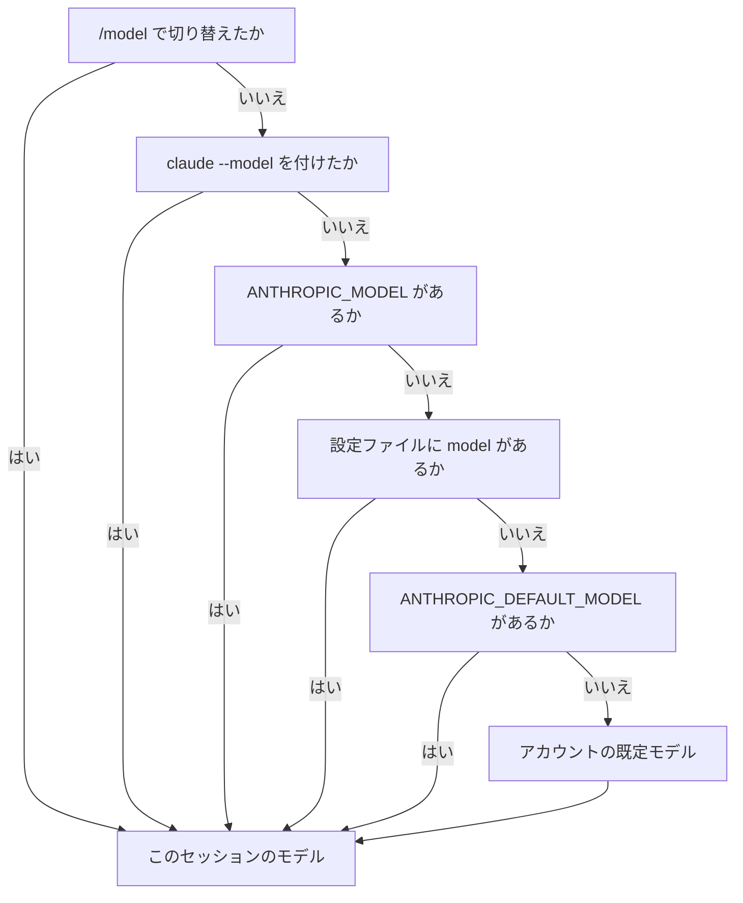
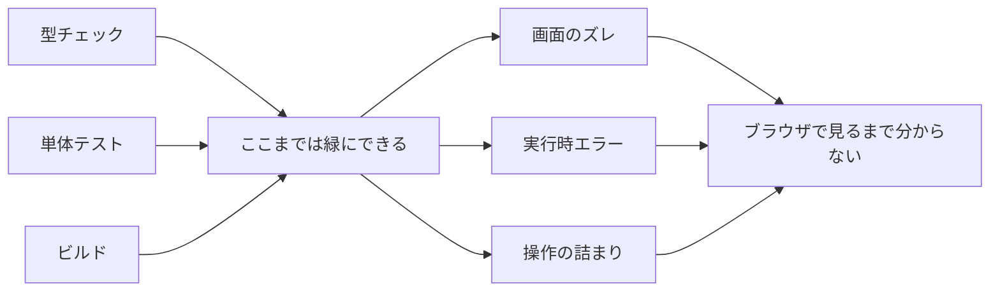
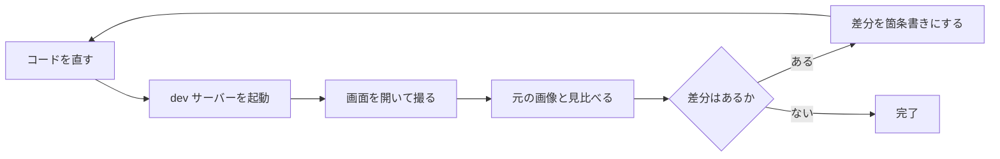

# Claude Daily — 2026-09-23（第032号）

## きょうの3行

- Claude Opus 5.5 が出ました。既定の Opus モデルが入れ替わります。
- Opus 5.5 の既定の労力は `medium` です。他の多くのモデルは `high` です。
- 画面の確認は4手段あります。前提が違うので選び分けます。

---

## ① ベストプラクティス — モデルと労力をリポジトリに固定する

> - Opus 5.5 が既定の Opus モデルになりました
> - 既定の労力は `medium`。多くのモデルの `high` とは違います
> - `modelSettings` でモデルごとに決め、`maxEffortLevel` で上限を縛ります

### 何を解決するのか

モデルが入れ替わると、同じ指示でも結果がばらつきます。労力の既定値がモデルごとに違うからです。設定ファイルに書いておけば、誰が起動しても同じ条件で走ります。

v2.1.280 では、`/effort` で保存した段階が新しいモデルに引き継がれなくなりました。Opus 5.5 は自分の既定値から始まります。



図1: モデルが決まる順序。上にあるものが勝つ

| モデル | 既定の労力 | 選べる段階 |
|---|---|---|
| Opus 5.5 | `medium` | low / medium / high / xhigh / max |
| Opus 5・Sonnet 5・Fable 5.1・Fable 5・Opus 4.8 | `high` | low / medium / high / xhigh / max |
| Opus 4.7 | `xhigh` | low / medium / high / xhigh / max |
| Opus 4.6・Sonnet 4.6 | `high` | low / medium / high / max |

| 段階 | 使う場面 |
|---|---|
| `low` | 短く、速さが要る作業。賢さが要らないもの |
| `medium` | 費用を抑えたい作業。Opus 5.5 の既定 |
| `high` | トークンと賢さの釣り合いが取れた段階 |
| `xhigh` | 深く考えさせたいとき。トークンは増える |
| `max` | 難しい作業。考えすぎる傾向があるので先に試す |

### そのまま置ける設定

`.claude/settings.json`

```json
{
  "model": "opus",
  "modelSettings": {
    "claude-opus-5-5": { "effort": "high" },
    "claude-sonnet-5": { "effort": "medium" }
  },
  "maxEffortLevel": "xhigh",
  "fallbackModel": ["claude-sonnet-5", "claude-haiku-4-5"]
}
```

| キー | 役割 |
|---|---|
| `modelSettings` | モデルごとの労力。モデル名をキーにして `effort` を書く |
| `maxEffortLevel` | 労力の上限。複数の設定にあるときは、いちばん低い値が採用される |
| `fallbackModel` | 使えないときに試すモデル。最大3件まで並べられる |

設定ファイルの優先順位そのものは 2026-09-13 の号（第022号）で扱いました。

### アンチパターン

#### ❌ 全員に `max` を配る

```json
{
  "effortLevel": "max"
}
```

`max` は難しい作業のための段階です。ドキュメントは「考えすぎる傾向がある」と注意し、広く配る前に試すよう書いています。簡単な修正でも長く考えるので、待ち時間とトークンだけが増えます。

#### ✅ モデルごとに決め、上限だけ縛る

```json
{
  "modelSettings": {
    "claude-opus-5-5": { "effort": "high" }
  },
  "maxEffortLevel": "xhigh"
}
```

普段は `high` で走り、深く考えさせたいときだけ手元で上げられます。上限は `xhigh` なので、`/effort max` と打っても `xhigh` で止まります。上げ下げの自由と、上限の保証を両立させる形です。

出典: [Model configuration](https://code.claude.com/docs/en/model-config)
出典: [Claude Code CHANGELOG](https://github.com/anthropics/claude-code/blob/main/CHANGELOG.md)

---

## ② 深掘り連載 第26回 — フロントエンド開発特有のコツ（Next.js / UI の確認ループ）

> - 型もテストも緑なのに画面が壊れることがあります
> - 起動の手順をレシピに固定すると、毎回同じ確認ができます
> - 確認の手段は4つ。前提が違うので選び分けます

### なぜフロントだけ別扱いになるのか

テストとビルドが見ているのは、コードの内側です。画面のズレ、実行時に初めて出るエラー、操作の途中で詰まる導線は、そこには現れません。



図2: 緑になる範囲と、その外側

### ループの形

公式のベストプラクティスは、UI の変更を「画像を渡す → 実装する → 結果を撮る → 見比べる → 差分を列挙して直す」と書いています。差分の列挙を挟むのが要点です。並べさせると、直す対象が言葉になります。



図3: 画面の確認ループ

### 4つの手段の選び分け

| 手段 | 前提 | 使うべき時 | 使うべきでない時 |
|---|---|---|---|
| 画像を貼る | なし | デザイン画像に寄せる。静止した見た目の比較 | 操作した結果を見たいとき |
| Claude in Chrome | 拡張 1.0.36 以降・`/login` 済み・直接契約 | 実画面とコンソールと通信をまとめて見る | WSL、第三者プロバイダ経由のみの利用 |
| Desktop のブラウザペイン | Desktop アプリ | サーバーのログと画面を並べて追う | CLI だけで完結させたいとき |
| `/run`・`/verify` | v2.1.200 以降 | 起動して動くところまでを確かめる | 見た目のズレを判定したいとき |

### 起動をレシピに固定する

Desktop アプリは dev サーバーの設定を `.claude/launch.json` に持ちます。ここに書いておけば、毎回同じ起動になります。

`.claude/launch.json`

```json
{
  "version": "0.0.1",
  "configurations": [
    {
      "name": "web",
      "runtimeExecutable": "npm",
      "runtimeArgs": ["run", "dev"],
      "port": 3000,
      "autoPort": true
    }
  ]
}
```

| フィールド | 何を書くか |
|---|---|
| `name` | この設定の名前 |
| `runtimeExecutable` | 実行するコマンド。`npm`・`yarn`・`node` など |
| `runtimeArgs` | 引数。`["run", "dev"]` など |
| `port` | 待ち受けるポート。既定は 3000 |
| `cwd` | プロジェクト直下からの相対パス |
| `env` | 追加の環境変数。コミットされるので秘密は書かない |
| `autoPort` | `true` なら空きポートを探す。`false` なら失敗させる |
| `url` | `http://localhost:<port>` 以外を開くとき |

`autoPort` を書かないと、ポートが埋まっていたときに「このポートでなければ駄目か」と聞かれ、答えが保存されます。別ポートで起動したときは、`PORT` 環境変数でサーバーに渡ります。

編集のたびの自動確認は `autoVerify` です。既定は有効で、`"autoVerify": false` を同じファイルに足すと止まります。止めてもプレビューの道具は残り、頼めばいつでも確認します。

CLI だけで使うなら `/run-skill-generator` です。まっさらな環境から起動できるところまでを一度試し、`.claude/skills/run-<name>/` にレシピを書き残します。`<name>` はプロジェクトの名前です。

| 用語 | 意味 |
|---|---|
| `/run` | アプリを起動して、変更が動くところを見せる |
| `/verify` | ビルドして走らせ、変更が意図どおりかを確かめる |
| `/run-skill-generator` | 起動の手順を記録して、以後の実行を揃える |

出典: [Best practices for Claude Code](https://code.claude.com/docs/en/best-practices)
出典: [Desktop application](https://code.claude.com/docs/en/desktop)
出典: [Skills](https://code.claude.com/docs/en/skills)
出典: [Use Claude Code with Chrome](https://code.claude.com/docs/en/chrome)

---

## ③ すぐ効くTIPS

### 1. `/effort auto` で保存した労力を消す

v2.1.280 から、以前に保存した段階は新しいモデルに効きません。Opus 5.5 は自分の既定の `medium` から始まります。いま何で走っているか分からなくなったら、いったん消すのが早道です。

```
/effort auto
```

### 2. `autoCompactWindow` で自動コンパクションの基準を決める

1M のモデルでは、既定のままだと文脈が長く伸びます。基準を狭めると、早めに要約が入ります。

`.claude/settings.json`

```json
{
  "autoCompactWindow": "500k"
}
```

`100k`・`500k`・`1M`・`200000`・`500` の形で書けます。最後の `500` は千単位の意味です。

### 3. MCP の説明文の上限を下げて文脈を空ける

MCP サーバーを何本も繋ぐと、ツールの説明だけで文脈が埋まります。上限は既定で2,048字、セッション内の全サーバーに効きます。v2.1.280 で変えられるようになりました。

`.claude/settings.json`

```json
{
  "env": {
    "CLAUDE_CODE_MAX_MCP_DESCRIPTION_LENGTH": "600"
  }
}
```

出典: [Model configuration](https://code.claude.com/docs/en/model-config)
出典: [Claude Code CHANGELOG](https://github.com/anthropics/claude-code/blob/main/CHANGELOG.md)

---

## ④ 事例

### フロントエンド5人で8か月使った境界線（SmartHR）

| 値 | 何の数字か |
|---|---|
| 5人 | リアーキテクチャを進めたフロントエンドチームの人数 |
| 215本 | 2アプリ合計の PR 数 |
| 月1,000ドル | 5人分の購読料。1人あたり200ドル |
| 86〜77% | 400行未満に収まった PR の割合 |
| 25〜29% | Claude の co-author が付いた PR の割合 |

人が握ったのは全体設計・機能分割・トレードオフのある判断で、Claude に渡したのは詳細実装とリファクタだったという報告があります。毎日30〜60分、画面を共有して実装者が説明する同期レビューを「マージの儀」と呼んでいます。

co-author の割合は25〜29%ですが、実際の利用は9割を超えると筆者は見ています。前後比較の厳密な測定はしていないと断っています。

出典: [リアーキテクチャでClaude Codeを8ヶ月使い込んで分かった「任せること」と「握ること」の境界線（Zenn / yusuke_shiya、2026-02-16）](https://zenn.dev/yusuke_shiya/articles/claude-code-team-adoption)

### 文脈の使い方で道具を選んだ（ENECHANGE）

| 観点 | MCP | CLI |
|---|---|---|
| 最初に載る量 | 55,000〜143,000トークン | なし |
| ツール1本あたり | 550〜1,400トークン | 数十〜数百 |

React と Next.js のリアーキテクチャで、道具を「文脈をどれだけ使うか」で選んだという報告があります。上の数値は記事が挙げたもので、公式の計測ではありません。

フックは4種でした。push 前のレビュー、`.ts`／`.tsx` 編集後の型チェック、`console.log` の検出、セッション終了時の消し残し確認です。

出典: [【2026年版】Claude Code フロントエンド特化の設定・ツールまとめ（Zenn / ENECHANGE、2026-03-23）](https://zenn.dev/enechange_blog/articles/9288d67beed7b4)

---

## ⑤ 速報 — 新機能・変更点

| いつ | 何が | どう効くか |
|---|---|---|
| 2026-09-22 | Claude Opus 5.5（`claude-opus-5-5`）の公開 | 1M コンテキスト、出力上限128k。$4／$20 per MTok（Opus 5 は $5／$25）。思考は常時オンで切れない |
| 2026-09-22 | v2.1.280 で Opus 5.5 が既定の Opus に | 既定の労力は `medium`。`/effort` の保存値は新モデルに引き継がれない |
| 2026-09-22 | Pro と Team Standard の既定モデルが Sonnet から Opus に | Max・Team Premium・Enterprise と揃う |
| 2026-09-22 | `CLAUDE_CODE_MAX_MCP_DESCRIPTION_LENGTH` の追加 | MCP ツール説明の2,048字上限を変えられる |
| 2026-09-22 | シンボリックリンク経由の書き込みの判定を修正 | `acceptEdits`・allow ルール・auto mode がツリー外への書き込みを承認しなくなった |
| 2026-09-22 | Platform: 会話途中のツール定義（ベータ） | `inline-tools-2026-09-15` ヘッダで、ツールを足してもプロンプトキャッシュが壊れない |

Opus 5.5 の発表は「多くの作業で Fable 5.1 と同水準、実行費用は Opus 5 より40%安い」と説明しています。API では思考を止める指定がエラーになります。深さは `effort` の値で決めます。

出典: [Introducing Claude Opus 5.5](https://www.anthropic.com/news)
出典: [Claude Platform release notes](https://platform.claude.com/docs/en/release-notes/overview)
出典: [Claude Code CHANGELOG](https://github.com/anthropics/claude-code/blob/main/CHANGELOG.md)

---

## ⑥ コマンド早見

| コマンド | 何をするか |
|---|---|
| `/model` | モデルの一覧を開く。`Enter` で既定に保存、`s` はこのセッションだけ |
| `/model opus` | モデルを切り替えて既定に保存する |
| `/effort` | 労力のスライダーを開く |
| `/effort auto` | 保存した労力を消し、モデルの既定に戻す |
| `/status` | いまのモデル・アカウント・接続状態を出す |
| `/run` | アプリを起動して、変更が動くところを見せる |
| `/verify` | ビルドして走らせ、変更が意図どおりかを確かめる |
| `/run-skill-generator` | 起動の手順を記録し、`.claude/skills/run-<name>/` に置く |
| `/chrome` | Chrome 連携の状態と権限を見る |
| `claude --model opus` | このセッションのモデルを指定して起動する |
| `claude --effort high` | このセッションの労力を指定して起動する |
| `claude --chrome` | Chrome 連携を有効にして起動する |

---

## ⑦ きょうの課題

Next.js のリポジトリに、モデルと労力の設定を1本置きます。10分ほどで終わります。

**前提**: Claude Code v2.1.280 以降。Next.js のリポジトリを1つ用意します。

**手順**

1. リポジトリ直下に `.claude/settings.json` を作り、①のコードを貼る
2. `python3 -m json.tool .claude/settings.json` で JSON として妥当か見る
3. そのディレクトリで `claude` を起動する
4. `/status` を開き、モデルの行を見る
5. `/effort` を開き、スライダーの位置と上限を見る

**確認方法**: `/status` のモデルが `model` に書いたものと一致し、`/effort` のスライダーが `xhigh` より上へ動かなければ成功です。

── 模範解答 ──

| 見たもの | なぜそうなるのか |
|---|---|
| `/status` のモデル | 設定ファイルの `model` が反映される。図1のとおり `/model` と `--model` はこれより強い |
| スライダーが `xhigh` で止まる | `maxEffortLevel` が効いている。複数あればいちばん低い値になる |
| 労力の初期位置 | `modelSettings` のモデル別の値。書いていなければモデルの既定 |

**よくある詰まりどころ**

| 症状 | 原因 |
|---|---|
| `/status` のモデルが違う | 過去に `/model` で切り替えて保存した値が残っている。`/model default` で戻す |
| スライダーが `max` まで動く | `maxEffortLevel` の綴りが違う。JSON の妥当性は通るので気づきにくい |
| 労力が `medium` のまま | Opus 5.5 の既定値。`modelSettings` のモデル名が `claude-opus-5-5` か確かめる |
| 設定が効かない | 起動したディレクトリがリポジトリ直下ではない |

あすは第27回、依存関係・移行作業（バージョンアップ）の任せ方です。
