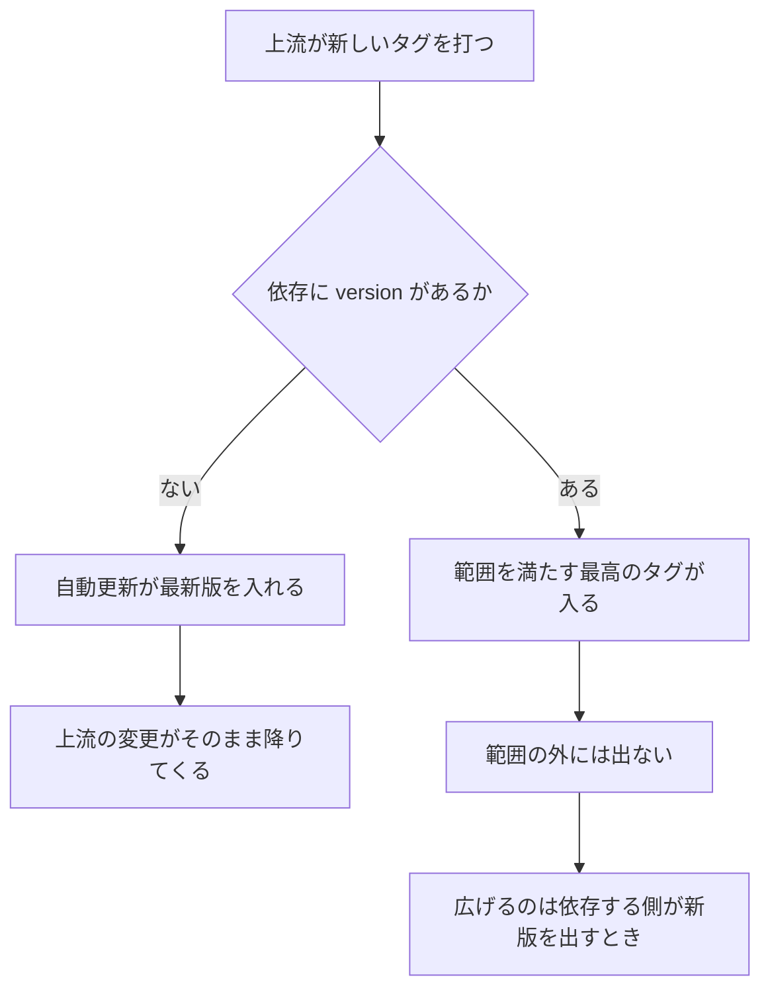
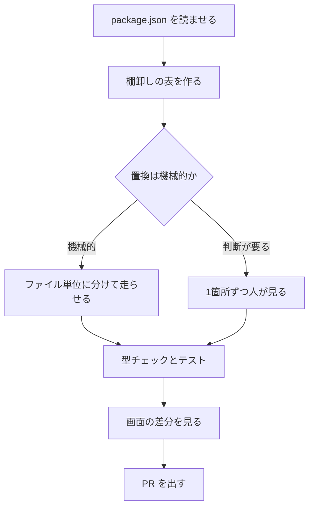
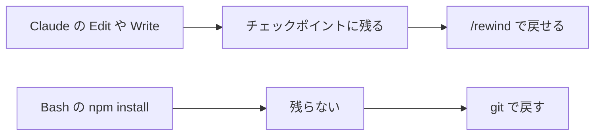

# Claude Daily — 2026-09-24（第033号）

## きょうの3行

- 配るプラグインの依存は、`~2.1.0` のような範囲で固定できます。
- 依存の更新は、棚卸しの表を先に作ってから1本ずつ上げます。
- v2.1.281 が出ました。セッション再開まわりの修正が中心です。

---

## ① ベストプラクティス — 配る道具の依存をバージョンで固定する

> - プラグインの依存は、既定で上流の最新を追います
> - `version` に semver の範囲を書くと、その範囲で止まります
> - `dependencies` だけのプラグインは、チームの標準セットになります

### 何を解決するのか

プラグインは他のプラグインに依存できます。制約を書かないと、上流が新しいタグを打った瞬間に全員の手元が動きます。上流がツール名を変えれば、依存する側は壊れます。



図1: 依存が更新される流れ

### そのまま置ける設定

`.claude-plugin/plugin.json`

```json
{
  "name": "deploy-kit",
  "version": "3.1.0",
  "dependencies": [
    "audit-logger",
    { "name": "secrets-vault", "version": "~2.1.0" }
  ]
}
```

| 書き方 | 意味 |
|---|---|
| `"audit-logger"` | 名前だけ。そのプラグインの市場が出す版を追う |
| `{ "name": "...", "version": "~2.1.0" }` | `2.1.x` の最高版で止まる |
| `"^2.0"` | `2.x` の最高版 |
| `">=1.4"` | 1.4 以上 |
| `"=2.1.0"` | その版に釘づけ |

`2.0.0-beta.1` のような事前公開版は範囲に入りません。入れたいときは `^2.0.0-0` のように書きます。

### チームの標準セットを1本にまとめる

`.claude-plugin/plugin.json`

```json
{
  "name": "backend-standard",
  "version": "1.0.0",
  "description": "Standard plugin set for backend engineers",
  "dependencies": [
    "secrets-vault",
    "deploy-kit",
    { "name": "db-migrate", "version": "^3.0" },
    "oncall-runbook"
  ]
}
```

`backend-standard` を入れると4本がまとめて入ります。管理設定の `enabledPlugins` に置けば、組織へ配れます。

### 版を解決させるにはタグが要る

範囲は git のタグで解決します。タグの形は `プラグイン名--v版` です。プラグインのディレクトリで次を打ちます。

```bash
claude plugin tag --push
```

| 制約A | 制約B | 結果 |
|---|---|---|
| `^2.0` | `>=2.1` | `2.1.0` 以上で `2.x` の最高版。両方が読み込まれる |
| `~2.1` | `~3.0` | Bの導入が `range-conflict` で失敗。Aと依存はそのまま |
| `=2.1.0` | なし | `2.1.0` に固定。自動更新は新しい版を飛ばす |

### アンチパターン

#### ❌ 名前だけ書いて配る

```json
{ "dependencies": ["secrets-vault"] }
```

上流が MCP ツールの名前を変えた版を出すと、自動更新でそれが全員に入ります。依存する側は何も変えていないのに動かなくなります。壊れた時刻と、変更した人が一致しません。

#### ✅ 試した範囲だけを許す

```json
{ "dependencies": [{ "name": "secrets-vault", "version": "~2.1.0" }] }
```

`2.1.x` の修正版は受け取り、`2.2.0` は受け取りません。上げるときは、依存する側の新しい版を出して範囲を広げます。上げる時期を自分たちで決められます。

| エラー | 意味 | 直し方 |
|---|---|---|
| `dependency-unsatisfied` | 依存が未導入、または無効 | 表示された導入コマンドを打つ。無効なら有効にする |
| `range-conflict` | 制約どうしが噛み合わない | 片方を更新するか外す。上流に範囲を広げてもらう |
| `dependency-version-unsatisfied` | 入っている版が範囲の外 | `claude plugin install <名前>@<市場>` で解決し直す |
| `no-matching-tag` | 範囲を満たすタグが無い | 上流のタグ運用を確かめる。範囲をゆるめる |

異常は `claude plugin list --json` の `errors` にも出ます。使わなくなった依存は `claude plugin prune` で消します。

出典: [Constrain plugin dependency versions](https://code.claude.com/docs/en/plugin-dependencies)

---

## ② 深掘り連載 第27回 — 依存関係・移行作業（バージョンアップ）の任せ方

> - 上げる前に、棚卸しの表を作らせます
> - 機械的な置換と、判断の要る置換を分けます
> - 検証の手段を先に決めてから走らせます

### なぜ「まとめて上げて」が失敗するのか

作業量は破壊的変更の数では決まりません。判断が要る箇所の数で決まります。表を先に作らせると、その数が見えます。



図2: 棚卸しから PR までの流れ

### 何を任せ、何を握るか

| 作業 | 任せるか | 理由 |
|---|---|---|
| 依存の互換性の棚卸し | 任せる | 網羅と比較。件数が多いほど効く |
| import 文の置換 | 任せる | 対応が1対1。結果を型チェックで見られる |
| 非推奨APIの洗い出し | 任せる | 検索と分類。判断は後段に回せる |
| 状態管理の載せ替え | 半分 | 対応は付くが、使い方ごとに確認が要る |
| 見た目の差分の採否 | 握る | 直すか受け入れるかは意図の判断 |
| メジャー更新の順序 | 握る | 影響範囲と納期の兼ね合い |

### 分け方の3手段

| 手段 | 何をするか | 使うべき時 | 使うべきでない時 |
|---|---|---|---|
| 1セッション | 会話の中で順に直す | 対象が数ファイル | 数百ファイルの置換 |
| `/batch <指示>` | 5〜30体に分け、各自の worktree で PR を出す | 同じ置換を大量に | 相互に影響する変更 |
| `claude -p` のループ | 一覧を作り、1ファイルずつ呼ぶ | 手順を自分で制御したい | 対象の切り出しが曖昧 |

一覧を先に作らせ、ループで回します。

```bash
for file in $(cat files.txt); do
  claude -p "Update $file for React 19. Return OK or FAIL." \
    --allowedTools "Edit,Bash(npm run typecheck)"
done
```

ドキュメントは、まず2〜3ファイルで試して指示を直すよう書いています。`--allowedTools` は無人で走らせるときの歯止めです。

### 検証を先に決める

| 何を見るか | 手段 | 落ちたときに分かること |
|---|---|---|
| 型 | `npm run typecheck` | 署名の変更を追えていない |
| 振る舞い | テスト | 既定値や副作用が変わった |
| 画面 | 起動して見比べる | CSS の前提が消えた |

条件を会話全体に効かせるなら `/goal` に置きます。実装とは別の評価役が毎ターン見直し、満たすまで続きます。

### 戻せる形を保つ



図3: 戻せる範囲の違い

ロックファイルと `node_modules` は git の担当です。定期の棚卸しは routine に寄せられます。ドキュメントは週次の依存監査を例に挙げています。

言語ごと載せ替えるような大規模移行は、2026-09-16 の号（第025号）で扱いました。

出典: [Best practices for Claude Code](https://code.claude.com/docs/en/best-practices)
出典: [Common workflows](https://code.claude.com/docs/en/common-workflows)
出典: [Large-scale code migrations with Claude Code](https://claude.com/blog/ai-code-migration)

---

## ③ すぐ効くTIPS

### 1. コミットと PR の署名を消す

社内の規約で AI の署名を載せない現場があります。`commit` と `pr` を空文字にし、`sessionUrl` を `false` にすると全部消えます。

`.claude/settings.json`

```json
{
  "attribution": {
    "commit": "",
    "pr": "",
    "sessionUrl": false
  }
}
```

v2.1.281 では `"attribution": false` という短い書き方も増えました。古い CLI はこれを含む設定ファイルを読み飛ばすので、共有するファイルでは上の形が安全です。

### 2. `/insights` に auto mode の効き目を見積もらせる

v2.1.281 から、最近のセッションで auto mode が肩代わりできた確認の回数を出します。切り替えの判断材料になります。

```
/insights
```

クラウドのセッションでは使えません。手元の端末で打ちます。

### 3. `claude plugin validate` で `.mcp.json` の取りこぼしを見る

v2.1.281 から、読み込み時に黙って捨てられる `.mcp.json` の項目を報告します。宣言していない `${user_config.*}` と、安全でない URL も出ます。

```bash
claude plugin validate
```

出典: [All settings](https://code.claude.com/docs/en/settings-reference)
出典: [Claude Code CHANGELOG](https://github.com/anthropics/claude-code/blob/main/CHANGELOG.md)

---

## ④ 事例

### React 18→19 を分解して委譲した（RevComm）

| 値 | 何の数字か |
|---|---|
| 30本以上 | React 19 対応のために更新した依存 |
| 60個以上 | Recoil から Jotai へ移した atom |
| 36ファイル | 最初の全自動で見た目が崩れた範囲 |
| 42コミット・12日 | その手戻りにかかった量 |

MiiTel Call Center のフロントエンドでの報告です。React 18→19 に合わせ、Semantic UI の撤去と Recoil→Jotai を同時に進めています。最初に Button の置換を全自動で任せて崩れ、機械的な一括置換では済まないと判断したそうです。

立て直しでは `package.json` を読ませて互換・非互換の表を作らせ、そこから1本ずつ進めています。見た目の差分は `getComputedStyle` を main と PR で比べ、直す・トークンを変える・受け入れるの3つに分けたと書かれています。

出典: [React 19 アップグレードに伴う大規模フロントエンド移行を、Claude Code で加速させた話（RevComm Tech Blog、2026-04-28）](https://tech.revcomm.co.jp/speeding-up-react-19-migration-with-claude-code)

### 社内で先に試してから顧客に出した（Supermetrics）

| 値 | 何の数字か |
|---|---|
| 20万社以上 | 利用している企業数 |
| 250% | 2月の公開以降の利用者の月次成長 |
| 10時間 → 20分 | 代理店1社での顧客向けレポート作成 |

Claude Code を技術チームの既定の道具にし、複雑なモノリスで先に試してから顧客向けの連携を公開したと書かれています。広告の配信は停止状態で作られ、人の承認を経てから動き出す作りです。

出典: [Supermetrics（claude.com/customers）](https://claude.com/customers/supermetrics)

---

## ⑤ 速報 — 新機能・変更点

| いつ | 何が | どう効くか |
|---|---|---|
| v2.1.281 | セッション再開まわりの修正が多数 | 再開時に過去のターンが別の形で送られ、推論が落ちる問題などを修正 |
| v2.1.281 | auto mode の判定が読み取り専用にも及ぶ | サーバー側で判定する構成では、読み取りや sandbox のコマンドも待たされ、危なければ止まる |
| v2.1.281 | `CLAUDE_CODE_AUTO_MODE_SERVER` が直接接続にも効く | `0` でサーバー側の判定を外す。外すと手元の判定が使用量に載る |
| v2.1.281 | 危険な `rm` の確認が2分で自動的に拒否へ | 無人のセッションが確認待ちで止まらない。`CLAUDE_CODE_DISABLE_DANGEROUS_RM_TIMEOUT=1` で従来どおり |
| v2.1.281 | `rm -rf "$(pwd)"` の形が必ず確認を出す | Bash の allow ルールがあっても、auto mode でも確認する |
| v2.1.281 | 送信キーが実行中のツールを背景に回す | `ctrl+enter` でターンを打ち切らずに次の指示を送れる |
| 2026-09-23 | Anthropic のニュースに研究成果が1件 | 開発者向けの機能変更ではありません |

Platform のリリースノートは 9/22 のままで、新しい項目はありません。

出典: [Claude Code CHANGELOG](https://github.com/anthropics/claude-code/blob/main/CHANGELOG.md)
出典: [Anthropic News](https://www.anthropic.com/news)

---

## ⑥ コマンド早見

| コマンド | 何をするか |
|---|---|
| `claude plugin tag --push` | 版に `プラグイン名--v版` のタグを打ち、`origin` へ送る |
| `claude plugin tag --dry-run` | 打つ予定のタグだけを見る |
| `claude plugin prune` | どのプラグインからも要らなくなった依存を消す |
| `claude plugin uninstall <名前> --prune` | 削除と取り残された依存の掃除をまとめて。`<名前>` はプラグイン名 |
| `claude plugin list --json` | 依存の異常を `errors` に載せて出す |
| `claude plugin validate` | プラグインの定義と `.mcp.json` の問題を報告する |
| `claude plugin install <名前>@<市場>` | 依存をいまの制約で解決し直す |
| `claude --plugin-dir ./a --plugin-dir ./b` | 手元の2本を同時に読み込む |
| `/batch <指示>` | 変更を5〜30体に分け、各自の worktree で PR を出す |
| `/goal` | 満たすまで続ける条件を置く |
| `/insights` | 最近のセッションを分析した HTML を作る |
| `/rewind` | チェックポイントまで会話とコードを戻す |
| `claude -p "<指示>"` | 対話なしで1回だけ走らせる |

---

## ⑦ きょうの課題

Next.js のリポジトリで依存の棚卸し表を作らせ、1本だけ上げます。15分ほどです。

**前提**: Next.js のリポジトリを1つ。始める前に `git status` が空であること。

**手順**

1. `git switch -c deps-audit` で作業用のブランチを切る
2. `claude` を起動し、`Shift+Tab` でプランモードに入る
3. 「@package.json の依存を読み、最新版・破壊的変更の有無・使用箇所の数を表にして。上げる順番の提案も」と頼む
4. 破壊的変更がなく、使用箇所の少ないものを表から1つ選ぶ
5. プランモードを抜け、「その1本だけ上げて、型チェックとテストを通して」と頼む
6. `git diff` でロックファイル以外の差分を見る

**確認方法**: 差分が選んだ1本に閉じていて、型チェックとテストが緑なら成功です。

── 模範解答 ──

| 見たもの | なぜそうなるのか |
|---|---|
| 表に使用箇所の数が入る | 作業量は破壊的変更の数ではなく、触る箇所の数で決まる |
| プランモードで表だけが出る | 探索と計画を実装から切り離すと、順番を決めてから走れる |
| 差分が1本に閉じる | 範囲を1本に絞ると、失敗しても戻す単位が小さい |

**よくある詰まりどころ**

| 症状 | 原因 |
|---|---|
| 表に推測の版が並ぶ | 一次情報を見ていない。レジストリを見るよう頼む |
| 複数の依存が同時に上がった | ロックファイルの再生成でまとめて動いた。1本に絞って戻す |
| `/rewind` で戻らない | `npm install` は Bash の変更。チェックポイントの外なので git で戻す |
| テストが落ちたまま進む | 検証の条件を渡していない。`/goal` に置くと毎ターン見直される |

あすは第28回、ドキュメント生成とその維持です。
