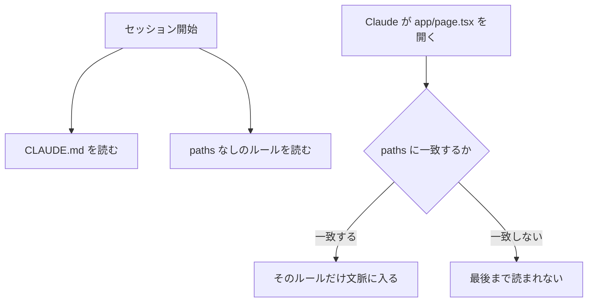
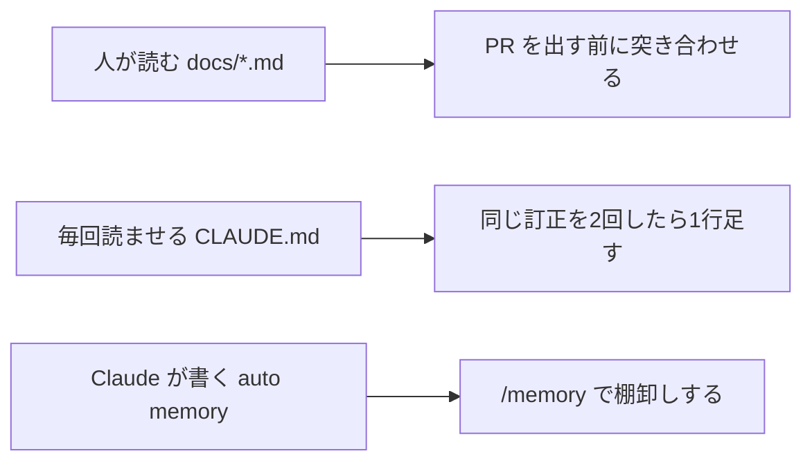
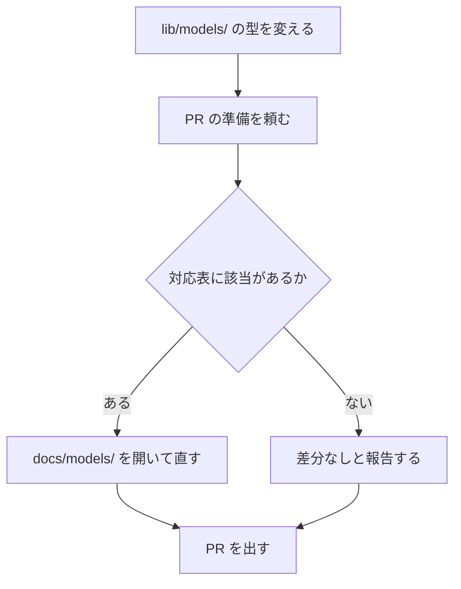

# Claude Daily — 2026-09-25（第034号）

## きょうの3行

- 指示は全部 CLAUDE.md に書かず、パスで絞ったルールに分けられます。
- ドキュメントは作るより、更新する契機を決めるほうが効きます。
- v2.1.282 が出ました。表示の設定追加とセッション再開の修正です。

---

## ① ベストプラクティス — ルールはパスで絞って読ませる

> - CLAUDE.md は毎セッション全文が文脈に入ります
> - `.claude/rules/` は1ファイル1話題に分けられます
> - `paths:` を書くと、一致するファイルを読んだ時だけ入ります

### 何を解決するのか

CLAUDE.md は起動時に全文が読まれます。行が増えるほど、守られない行が出ます。ドキュメントは1ファイル200行以内を目安に挙げています。



図1: ルールが読み込まれる時機

### そのまま置けるルール

まず置き場所を作ります。

```bash
mkdir -p .claude/rules
```

`.claude/rules/app-router.md`

```markdown
---
paths:
  - "app/**/*.{ts,tsx}"
---

# App Router の約束

- サーバーコンポーネントを既定にする。`"use client"` は入力を扱う末端だけに置く
- データ取得は `page.tsx` と `layout.tsx` から呼ぶ。表示用の部品の中で fetch しない
- 再検証の秒数は直接書かず、`lib/cache.ts` の定数を使う
```

`.claude/rules/testing.md`

```markdown
# テストの約束

- テストは `npm run test -- <path>` で1ファイルずつ走らせる。`<path>` はテストファイルのパス
- 新しい振る舞いは、失敗するテストを先に書く
```

2つ目には `paths:` がありません。`paths:` の無いルールは `.claude/CLAUDE.md` と同じ優先度で、起動時に読まれます。

| 置き場所 | いつ読まれるか | 共有範囲 |
|---|---|---|
| `./CLAUDE.md` | 起動時に毎回 | git 経由でチーム |
| `.claude/rules/*.md`（`paths` なし） | 起動時に毎回 | git 経由でチーム |
| `.claude/rules/*.md`（`paths` あり） | 一致するファイルを読んだ時 | git 経由でチーム |
| `~/.claude/rules/*.md` | 起動時に毎回・全プロジェクト | 自分だけ |
| `./CLAUDE.local.md` | 起動時に毎回 | 自分だけ（`.gitignore` 送り） |

### パターンの書き方

| パターン | 一致するもの |
|---|---|
| `**/*.ts` | どの階層の TypeScript ファイルも |
| `src/**/*` | `src/` の下のすべて |
| `*.md` | リポジトリ直下の Markdown |
| `src/components/*.tsx` | そのディレクトリの React コンポーネント |

波括弧は展開されます。`src/**/*.{ts,tsx}` は2本、`{a,b}/{c,d}/*.{ts,tsx}` は8本です。1つの `paths` は展開後1,000本・4MiB が上限で、超えたパターンは展開されずに使われ、波括弧は文字として扱われます。

### アンチパターン

#### ❌ 1本の CLAUDE.md に全部足す

```markdown
# プロジェクト規約

## App Router
- サーバーコンポーネントを既定にする
## テスト
- 1ファイルずつ走らせる
## API ルート
- 入力は zod で検証する
## Storybook
- 追加したら story も足す
```

足すたびに文脈が増え、どの行が効いていないのかが分からなくなります。Storybook を触らない日でも、その行は毎回読まれます。同じ指示を守らないときは、書き方ではなく長さが原因のことがあります。

#### ✅ 話題ごとに分け、パスで絞る

```markdown
---
paths:
  - "app/api/**/*.ts"
---

# API ルートの約束

- 入力は `zod` のスキーマで検証してから使う
- 失敗時は `lib/http.ts` の `errorResponse()` で返す
```

App Router を触る日は App Router の約束だけが入ります。読まれたかどうかは `/context` の **Memory files** で確かめられます。

出典: [How Claude remembers your project](https://code.claude.com/docs/en/memory)
出典: [Best practices for Claude Code](https://code.claude.com/docs/en/best-practices)

---

## ② 深掘り連載 第28回 — ドキュメント生成とその維持

> - 生成は `/init` と1行の依頼でほぼ足ります
> - 難しいのは、いつ更新するかを決めることです
> - 契機は「PR を出す前」のように具体で書きます

### 生成の道具は揃っている

| やること | 打つもの | 何が起きるか |
|---|---|---|
| 指示書を作る | `/init` | コードを読み、ビルド・テスト・規約を書いた CLAUDE.md を作る。既存があれば上書きせず改善案を出す |
| 対話しながら作る | `CLAUDE_CODE_NEW_INIT=1 claude` のあと `/init` | CLAUDE.md・skill・hook のどれを作るか聞き、サブエージェントで調べ、書き出す前に案を見せる |
| 他ツールの設定を引き継ぐ | `/import` | `AGENTS.md` などを対応する CLAUDE.md に1回だけ足し、MCP・コマンド・サブエージェント・skill も移す（v2.1.213 以降） |
| コードのコメントを足す | 依頼文 | 「auth モジュールで JSDoc の無い関数を探して」のあと「足して」の順で頼む |

`/init` は他ツールの規約も読みます。`.cursor/rules/`・`.cursorrules`・`.github/copilot-instructions.md` が対象です。`CLAUDE_CODE_NEW_INIT=1` を立てると `AGENTS.md`・`.windsurfrules`・`.clinerules` も加わります。

### 腐るのはドキュメントではなく契機



図2: 3種類のドキュメントと、それぞれの更新の契機

契機は動詞で書きます。「PR のときに更新する」では、PR をまだ作っていない段階で何もしません。何を見て、どの条件で直し、直さないときは何と報告するかまで書きます。

`CLAUDE.md`

```markdown
# ドキュメントの更新

- `lib/models/` の型を変えたら、同じ名前の `docs/models/<名前>.md` を必ず開く
- 「PR の準備をして」と言われた時点で、変更したモデルと上の対応表を突き合わせる
- 差分があれば直し、無ければ「ドキュメント差分なし」と報告する
```



図3: 契機を書き下ろした時に起きること

### 維持の道具

| 症状 | 使うもの | 何をするか |
|---|---|---|
| CLAUDE.md が長い | `/doctor` | コードから分かる記述（構成・依存一覧・全体像）を削る案を出す。落とし穴と規約は残す（v2.1.206 以降） |
| どれが読まれたか不明 | `/context` | **Memory files** に読み込まれたファイルが並ぶ |
| Claude の記録を見たい | `/memory` | auto memory のフォルダを開き、中を読む・消す |
| 記録が全部は入らない | — | `MEMORY.md` は先頭200行または25KB まで。超えた分は起動時に読まれない |

auto memory は Claude が自分で書く記録です。保存先は `~/.claude/projects/<project>/memory/` で、`MEMORY.md` が索引、話題ごとのファイルが本体です。索引だけが起動時に入り、本体は必要になった時に読まれます。

| 用語 | 意味 |
|---|---|
| auto memory | Claude が訂正や好みから自分で書く記録。端末の中だけに残る |
| `type` | 記録の種類。`user` / `feedback` / `project` / `reference` の4つ |
| `autoMemoryEnabled` | auto memory の入切。`false` で止まる |
| `autoMemoryDirectory` | 保存先を変える設定。絶対パスか `~/` 始まり |

### どこに置くかの判断

| 置き場所 | 使うべき時 | 使うべきでない時 |
|---|---|---|
| `CLAUDE.md` | どのセッションでも要る事実（ビルド・規約・配置） | 手順が長いもの、一部の階層だけの話 |
| `.claude/rules/`（`paths` 付き） | 特定のファイル群だけの約束 | 全体に効かせたい約束 |
| skill | 呼ばれた時だけ要る手順 | 毎回守らせたい規約 |
| auto memory | 自分の好み、訂正の履歴 | チームで共有したい規約 |
| `docs/*.md` | 人が読む説明、設計の記録 | Claude に毎回守らせたい規約 |

auto memory は端末の中だけに残ります。同じリポジトリの worktree は1つのフォルダを共有しますが、別の端末やクラウドには渡りません。チームに配りたい内容は git に乗る場所へ書きます。

ルールをパスで絞る書き方は ① のとおりです。強制したい約束は文脈ではなく `PreToolUse` フックにします。

出典: [How Claude remembers your project](https://code.claude.com/docs/en/memory)
出典: [Common workflows](https://code.claude.com/docs/en/common-workflows)
出典: [Hooks reference](https://code.claude.com/docs/en/hooks)

---

## ③ すぐ効くTIPS

### 1. 保守メモは HTML コメントに書く

ブロックレベルの HTML コメントは、文脈に入る前に取り除かれます。人向けの但し書きをトークンを使わずに残せます。

`CLAUDE.md`

```markdown
<!-- 2026-09: Storybook の行は .claude/rules/storybook.md へ移した -->
# コード規約

- インデントは2スペース
```

コードブロックの中のコメントは残ります。Read ツールで開いた時も全部見えます。

### 2. 読み込みをフックで記録する

ルールが効かない時、読まれなかったのか守られなかったのかが切り分けられます。

`.claude/settings.json`

```json
{
  "hooks": {
    "InstructionsLoaded": [
      {
        "matcher": "path_glob_match|nested_traversal",
        "hooks": [
          {
            "type": "command",
            "command": "jq -r '[.load_reason, .file_path, .trigger_file_path] | @tsv' >> /tmp/instructions.log"
          }
        ]
      }
    ]
  }
}
```

`load_reason` は `session_start` / `nested_traversal` / `path_glob_match` / `include` / `compact` の5つです。

### 3. テレメトリの変数はプロジェクト設定に置かない

v2.1.282 から、プロジェクトとローカルの設定ファイルにある一部の OpenTelemetry 変数は無視されます。`CLAUDE_CODE_ENABLE_TELEMETRY` や `OTEL_LOG_*` が該当します。無視された変数は起動時の通知と次のコマンドに出ます。

```bash
claude doctor
```

出典: [Hooks reference](https://code.claude.com/docs/en/hooks)
出典: [Claude Code CHANGELOG](https://github.com/anthropics/claude-code/blob/main/CHANGELOG.md)

---

## ④ 事例

### 生成より「更新の仕組み」だった（Qiita）

| 値 | 何の数字か |
|---|---|
| 6項目 | ドキュメントに載せると決めた見出しの数 |
| 1行 | 初回生成に使った指示の長さ |
| PR 作成前 | 更新の契機として最後に選んだ地点 |

Flutter のモデルクラスの説明を Claude Code に書かせた報告です（二次情報、2026-09-15）。概要・フィールド・拡張・注意点・関連モデル・使用箇所の6項目を先に決め、「カテゴリのモデルの説明を作って」の一言で `docs/models/` を作らせています。

変更のたびに更新させる案は、確定していない変更にトークンを使うので捨てたと書かれています。「PR 作成時に更新する」と書いても、PR をまだ作っていない段階では動かなかったそうです。最後は確認の時点と条件を CLAUDE.md に書き下ろして動いたとしています。

出典: [Claude Codeでドキュメントを作ってみた。大事なのはその先だった（Qiita、2026-09-15）](https://qiita.com/chara-gida/items/5abb70bcecd2f2f0d596)

### 3部門に広げた（HubSpot）

| 値 | 何の数字か |
|---|---|
| 最大40% | Web 開発とコンテンツ制作の生産性の伸び |
| 3〜5日 → 1時間未満 | 技術的な切り分けにかかる時間 |
| 数百 | 組織全体で作られた project の数 |

エンジニアリング・マーケティング・カスタマーサクセスの3部門に配った事例です。エンジニアリングは分散したコードベースに Claude Code を入れ、社内システムへは MCP で繋いでいます。用途として、移行・保守のほか、新メンバーの立ち上がりと大きなコードの読解を挙げています。

マーケティングとカスタマーサクセスは、施策の文脈と定石を1か所に集めた project から入ったと書かれています。道具の配布ではなく、文脈の置き場所を先に作った順序です。

出典: [HubSpot（claude.com/customers）](https://claude.com/customers/hubspot)

---

## ⑤ 速報 — 新機能・変更点

| いつ | 何が | どう効くか |
|---|---|---|
| v2.1.282 | `maxProseWidth` 設定の追加 | 広いターミナルで地の文の幅を抑える。表とコードは全幅のまま |
| v2.1.282 | 無視されたテレメトリ変数の通知 | 起動時の通知・`/status`・`claude doctor` に、効いていない変数が並ぶ |
| v2.1.282 | プロジェクト設定の OTEL 変数を無視 | `CLAUDE_CODE_ENABLE_TELEMETRY` や `OTEL_LOG_*` はユーザー設定へ移す |
| v2.1.282 | 再開・継続の修正がさらに | `--continue` / `--resume` で過去のメッセージが形を変えて再送される問題を追加で修正 |
| v2.1.282 | 400 エラーの修正 | 復号できない Web 検索結果を含む会話が、毎回失敗する問題を修正 |
| v2.1.282 | Bash の allow ルールの修正 | 途中に `:*` を含むルールが設定ファイル側だけ無視されていた。起動時に照合の説明が出る |
| v2.1.282 | auto mode の既定の変更 | 直接 API 接続でテレメトリが切れている時もサーバー側判定に。`CLAUDE_CODE_AUTO_MODE_SERVER=0` で外す |
| v2.1.282 | `anthropic-skills` / `claude-ai` 名の扱い | その名前の skill フォルダ・コマンド・MCP サーバーは一覧に出なくなる。MCP のツール自体は動く |

Anthropic のニュースと Platform のリリースノートに新しい項目はありません。

出典: [Claude Code CHANGELOG](https://github.com/anthropics/claude-code/blob/main/CHANGELOG.md)
出典: [Anthropic News](https://www.anthropic.com/news)

---

## ⑥ コマンド早見

| コマンド | 何をするか |
|---|---|
| `mkdir -p .claude/rules` | パス別ルールの置き場所を作る |
| `/init` | コードを読み、CLAUDE.md の草案を作る |
| `CLAUDE_CODE_NEW_INIT=1 claude` | `/init` を対話フローで走らせる |
| `/import` | 他のコーディングエージェントの設定を取り込む |
| `/doctor` | CLAUDE.md の削れる記述を含め、設定の健診をする |
| `/context` | 読み込まれた指示ファイルと文脈の内訳を見る |
| `/memory` | 指示ファイルと auto memory を一覧し、開く |
| `claude doctor` | 設定の健診を対話の外から走らせる |
| `/status` | いまのセッションの設定と接続先を見る |
| `claude --debug` | ルールの YAML 解析エラーなどを表示する |
| `npm run test -- <path>` | テストを1ファイルずつ走らせる。`<path>` はテストファイルのパス |

---

## ⑦ きょうの課題

Next.js のリポジトリで、パスで絞ったルールが本当に遅れて読まれることを確かめます。15分ほどです。

**前提**: `app/` を持つ Next.js のリポジトリを1つ。`jq` が入っていること。

**手順**

1. `mkdir -p .claude/rules` で置き場所を作る
2. `.claude/rules/app-router.md` を作り、先頭に `paths:` で `"app/**/*.{ts,tsx}"` を書く
3. 本文に「`app/` の下のファイルを説明する時は、最初の行に `[app-router]` と書く」と入れる
4. `.claude/settings.json` に ③ の `InstructionsLoaded` フックを貼る
5. `claude` を起動し、すぐ `/context` を打って **Memory files** を見る
6. 「@app/page.tsx を説明して」と頼む
7. 別の端末で `cat /tmp/instructions.log` を見る

**確認方法**: 返答の1行目に `[app-router]` が付き、ログに `path_glob_match` の行が増えていれば成功です。

── 模範解答 ──

| 見たもの | なぜそうなるのか |
|---|---|
| 起動直後は Memory files に出ない | `paths` 付きのルールは、一致するファイルを読むまで文脈に入らない |
| `load_reason` が `path_glob_match` | 一致で読み込まれたことを表す。きっかけのファイルは `trigger_file_path` に入る |
| `paths:` を消すと起動時に読まれる | `paths` の無いルールは `.claude/CLAUDE.md` と同じ優先度で起動時に読まれる |
| 2回目以降はログが増えない | 同じセッションで一度読み込まれたファイルは、読み直されない |

**よくある詰まりどころ**

| 症状 | 原因 |
|---|---|
| ルールが一度も読まれない | `paths` の書き方が合っていない。`claude --debug` で YAML の解析エラーを見る |
| 波括弧が効かない | 展開が上限を超えると、そのパターンは展開されず文字として扱われる |
| `[` を含むパスが一致しない | `[` は文字クラスの開始として読まれる。`\[` と書いて逃がす |
| ログが空のまま | `matcher` が `load_reason` に当たっていない。フックは非同期なので少し待つ |
| 読まれたのに守らない | ルールは文脈であって強制ではない。必ず止めたいなら `PreToolUse` フックにする |

あすは第29回、CLAUDE.md をチームで標準化する、です。
