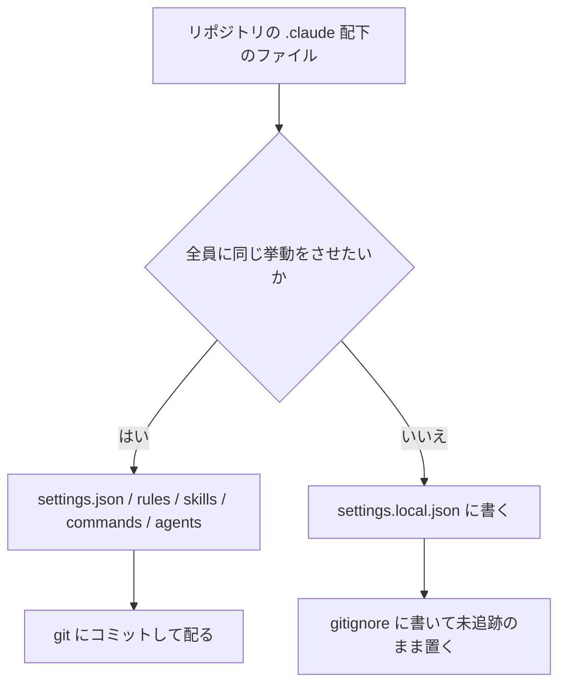
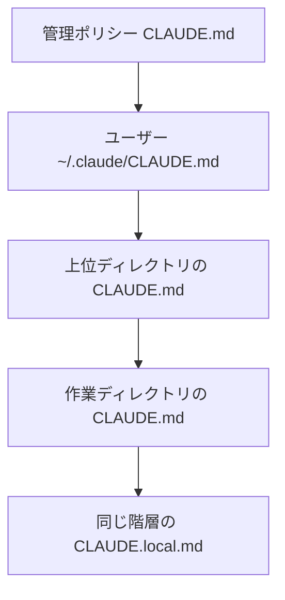
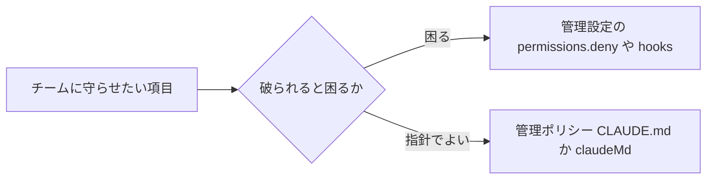

# Claude Daily — 2026-09-26（第035号）

## きょうの3行

- `.claude/` は共有と個人が同居します。境界は git で引きます。
- 第29回はチームの CLAUDE.md。配れるのは4層のうち2層だけです。
- v2.1.283 が出ました。`/doctor prompt-audit` が古い指示を洗い出します。

## ① ベストプラクティス — 共有する設定と個人の設定を分ける

> - `.claude/` には、配るものと個人のものが混ざっています
> - 個人の上書きは `.claude/settings.local.json` に置きます
> - 無視ルールは自分の手元にしか入りません



図1: `.claude/` のファイルを2つに仕分ける

| パス | 誰のもの | コミット | 中身 |
|---|---|---|---|
| `.claude/settings.json` | チーム | する | 権限・フック・`env`・モデル |
| `.claude/settings.local.json` | 自分だけ | しない | 個人の上書き。共有前の試し置き |
| `.mcp.json` | チーム | する | チームで共有する MCP サーバー |
| `.claude/rules/*.md` | チーム | する | 話題ごと・パスで絞る指示 |
| `.claude/skills/<name>/SKILL.md` | チーム | する | `/name` で呼ぶ手順 |
| `.claude/agents/*.md` | チーム | する | サブエージェントの定義 |
| `.worktreeinclude` | チーム | する | worktree に複写する無視ファイル |
| `~/.claude/` の中身すべて | 自分だけ | しない | 全プロジェクトに効く個人設定 |

同じキーが複数に書かれたときは、上の行が勝ちます。

| 順位 | 層 | ファイル |
|---|---|---|
| 1 | 管理設定 | `managed-settings.json` ／ MDM ／ claude.ai コンソール |
| 2 | コマンドライン | `claude --settings` |
| 3 | プロジェクト個人 | `.claude/settings.local.json` |
| 4 | プロジェクト共有 | `.claude/settings.json` |
| 5 | ユーザー | `~/.claude/settings.json` |

チームの既定はコミットし、自分だけの例外は個人ファイルで上書きします。
この順序のおかげで、個人の都合をコミットしなくて済みます。

リポジトリ直下の `.gitignore` に、次の2行を足します。

```gitignore
# Claude Code の個人設定
**/.claude/settings.local.json
**/.claude/agent-memory-local/
```

チームに配る `.claude/settings.json` はこの形です。

```json
{
  "permissions": {
    "allow": ["Bash(npm run lint)", "Bash(npm run test:*)", "Bash(npx tsc --noEmit)"],
    "deny": ["Read(./.env)", "Read(./.env.*)"]
  },
  "hooks": {
    "PostToolUse": [
      {
        "matcher": "Edit|Write",
        "hooks": [{ "type": "command", "command": "npx prettier --write \"$CLAUDE_FILE_PATHS\"" }]
      }
    ]
  }
}
```

自分だけの上書きは、隣に置く別ファイルに書きます。

```json
{
  "model": "claude-opus-5-5",
  "permissions": {
    "allow": ["Bash(gh pr view:*)"]
  }
}
```

上は `.claude/settings.local.json` です。チームの `model` を自分だけ変えられます。

#### ❌ 個人の設定を追跡させたまま置く

```bash
git add .claude/settings.local.json
git commit -m "add my claude settings"
```

Claude Code は、このファイルを最初に書いたときだけ無視ルールを追加します。
書き込み先は自分のグローバル除外（`core.excludesFile`）で、リポジトリではありません。
同僚の手元には無視ルールが無いので、うっかり追跡されます。

追跡されると、もう1つ変わります。
未追跡のうち、個人ファイルの `allow` は信頼の手順を待たずに効きます。
git が追跡すると、この `allow` にもワークスペースの信頼が要ります。

#### ✅ `.gitignore` に書いて、未追跡のまま置く

```bash
git check-ignore -v .claude/settings.local.json
```

無視されていれば、どのルールが効いたかが1行で出ます。
何も出なければ無視されていないので、上の2行を `.gitignore` に足します。

- 出典: [Explore the .claude directory](https://code.claude.com/docs/en/claude-directory)
- 出典: [Settings files and precedence](https://code.claude.com/docs/en/settings)

## ② 深掘り連載 第29回 — CLAUDE.md をチームで標準化する

> - CLAUDE.md は4層。配れるのはプロジェクトと管理ポリシーです
> - 全台に効かせるなら管理ポリシーの1枚か `claudeMd` キーです
> - 強制は設定、振る舞いは CLAUDE.md と分けます



図2: 起動時に読まれる順。後ろほど近い指示になる

| 層 | 置き場所 | 届く範囲 | 何を書くか |
|---|---|---|---|
| 管理ポリシー | OS ごとの固定パス | その端末の全セッション | 全社の規約・順守事項 |
| ユーザー | `~/.claude/CLAUDE.md` | 自分の全プロジェクト | 個人の好み |
| プロジェクト | `./CLAUDE.md` または `./.claude/CLAUDE.md` | クローンした全員 | 構成・コマンド・規約 |
| ローカル | `./CLAUDE.local.md` | 自分のこのリポジトリだけ | 個人の検証用の値 |

全ファイルは上書きではなく連結されます。
根に近いものから順に並び、同じ階層では `CLAUDE.local.md` が後に付きます。

配れるのはプロジェクトと管理ポリシーの2層だけです。
ユーザーとローカルは共有されないので、チームの規約を置いても届きません。

### 全台に配る

| OS | 置き場所 |
|---|---|
| macOS | `/Library/Application Support/ClaudeCode/CLAUDE.md` |
| Linux・WSL | `/etc/claude-code/CLAUDE.md` |
| Windows | `C:\Program Files\ClaudeCode\CLAUDE.md` |

配布は MDM・グループポリシー・Ansible などの構成管理に任せます。
このファイルは `claudeMdExcludes` で除外できません。全員に必ず効きます。

ファイルを置く代わりに、管理設定へ直接書けます。

```json
{
  "claudeMd": "Always run `make lint` before committing.\nNever push directly to main."
}
```

上は `managed-settings.json` です。`claudeMd` は管理設定とポリシー設定でだけ読まれます。
ユーザー・プロジェクト・ローカルの設定に書いても効きません。

### 強制と指針を分ける



図3: 同じ「規約」でも置き場所が分かれる

| 決めたいこと | 置き場所 |
|---|---|
| ツール・コマンド・パスの禁止 | 管理設定の `permissions.deny` |
| サンドボックスの強制 | 管理設定の `sandbox.enabled` |
| 環境変数と接続先の固定 | 管理設定の `env` |
| ログイン方法と組織の限定 | 管理設定の `forceLoginMethod`・`forceLoginOrgUUID` |
| コードの書き方・品質の指針 | 管理ポリシーの CLAUDE.md |
| データの扱いと順守事項の念押し | 管理ポリシーの CLAUDE.md |

設定はクライアントが強制します。CLAUDE.md は文脈であって、強制ではありません。

### モノレポで他チームの分を切る

```json
{
  "claudeMdExcludes": [
    "**/monorepo/CLAUDE.md",
    "/home/user/monorepo/other-team/.claude/rules/**"
  ]
}
```

上は `.claude/settings.local.json` です。絶対パスに対して glob で照合します。
配列はどの層に書いても合成されるので、チーム共通の除外はコミットできます。

### 使うべき時／使うべきでない時

| 手段 | 使うべき時 | 使うべきでない時 |
|---|---|---|
| プロジェクト CLAUDE.md | リポジトリ固有の構成・コマンド・規約 | 個人の好み。全社の規約 |
| 管理ポリシー CLAUDE.md | 全リポジトリに効かせたい振る舞いの指針 | リポジトリ固有の話。破られると困る禁止 |
| `claudeMd` キー | 配るのが数行で、ファイル配布を増やしたくない | 長い規約。改版履歴を残したいとき |
| `claudeMdExcludes` | モノレポで無関係な祖先の指示を切る | 管理ポリシーを避けたいとき。効きません |
| `.claude/rules/` | 話題ごとに分け、パスで読み込みを絞る | 常時は不要な手順。skill にする |

- 出典: [How Claude remembers your project](https://code.claude.com/docs/en/memory)

## ③ すぐ効くTIPS

### 1. `/doctor prompt-audit` で指示の腐りを洗い出す

v2.1.283 で追加されました。CLAUDE.md とプロンプトを読み、古いモデルを前提にした書き方を報告します。

消えたパスと、互いに矛盾する指示を先に出します。腐りは人が読んでも気づきにくい場所です。

```text
/doctor prompt-audit
```

- 出典: [Claude Code CHANGELOG](https://github.com/anthropics/claude-code/blob/main/CHANGELOG.md)

### 2. 共有設定リポジトリの CLAUDE.md も読ませる

`--add-dir` で足したディレクトリの CLAUDE.md は、既定では読まれません。
環境変数を立てると、そのディレクトリの `CLAUDE.md`・`.claude/CLAUDE.md`・`.claude/rules/*.md`・`CLAUDE.local.md` が読まれます。

```bash
CLAUDE_CODE_ADDITIONAL_DIRECTORIES_CLAUDE_MD=1 claude --add-dir ../shared-config
```

### 3. 共有ルールは `~/.claude/rules/` に置く

`.claude/rules/` へのシンボリックリンクでも共有できますが、承認が要ります。

| 置き方 | 承認 | `paths` 付きのルール |
|---|---|---|
| `.claude/rules/` にリンク（リンク先が作業ディレクトリの外） | 外部インポートの承認が要る | 承認後も読まれない |
| `~/.claude/rules/` に直接置く | 不要 | 読まれる |

```bash
ln -s ~/company-standards/security.md .claude/rules/security.md
```

- 出典: [How Claude remembers your project](https://code.claude.com/docs/en/memory)

## ④ 事例

### 5人チームが3か月で決めた11のルール

| 値 | 何の数字か |
|---|---|
| 5人 | チームの人数（バックエンド3・フロント2） |
| 2.1日 → 0.9日 | PR 作成までの日数 |
| 0.8件 → 0.5件 | PR あたりの重大な指摘 |
| 月2件 → 月1件 | 本番障害 |
| 月およそ800ドル | チーム全体の費用 |

新メンバーは最初の2週間を読み取り専用で始め、`--allowedTools` で破壊的なコマンドを落としたという報告があります。
CLAUDE.md はチーム共通のひな形を配り、編集後のフックで整形とテストを回したとのことです。

2週間で捨てたルールが3つありました。二重承認、セッションログの Slack 自動投稿、1日4時間の利用上限です。
捨てた理由は、5人では承認が詰まること、通知が多すぎること、費用の管理で足りることでした。

- 出典: [Claude Codeをチーム導入して3ヶ月──権限管理・コスト管理・レビュー体制で決めた11のルール（Qiita、二次情報、2026-07-31）](https://qiita.com/hikariclaude01/items/439383d09f63458981f2)

### CLAUDE.md を3層に分けて育てる

| 層 | 書くもの |
|---|---|
| `~/.claude/` | 個人の好み。「日本語で答える」など |
| リポジトリ直下 | 変わらない全体の規約。構成の原則・禁じる依存 |
| サブディレクトリ | その場所だけの制約。`frontend/` の状態管理の約束など |

コードを読めば分かる事実は書かない、というのが筆者の原則です。
レビューで摩擦が起きた非自明な制約だけを残すと報告されています。

失敗として挙がるのは、規約の詰め込み、エージェントの作りすぎ、止めるフックの多用、個人設定の共有リポジトリへの混入です。
守らせたいならフックにする、という切り分けを勧めています。数値の記載はありません。

- 出典: [Claude Codeをチームで運用するためのCLAUDE.md設計とカスタムエージェント分担（Zenn、二次情報、2026-06-03）](https://zenn.dev/siromiya/articles/2026-06-03-01-claudecode-team-agents)

## ⑤ 速報 — 新機能・変更点

| いつ | 何が | どう効くか |
|---|---|---|
| v2.1.283 | `/doctor prompt-audit` 追加 | CLAUDE.md とプロンプトを古いモデル前提の書き方で点検。消えたパスと矛盾する指示を優先して出す |
| v2.1.283 | `availableModelsMatch`（`"exact"`）と `deniedModels` を管理設定に追加 | 組織でモデルの版を限定し、特定のモデルを塞げる |
| v2.1.283 | `--system-prompt`・`--append-system-prompt` がファイルも受け付ける | 共通の system プロンプトをリポジトリのファイルで渡せる |
| v2.1.283 | v2.1.282 の `claude-ai` 名前空間の予約を撤回 | 一覧から消えていたスキル・コマンド・MCP が戻る |
| v2.1.283 | `OTEL_LOG_TOOL_CONTENT=1` に MCP・WebFetch・WebSearch の出力を追加 | ツールの中身までスパンイベントに残る |
| v2.1.283 | スキルの deny ルールがプラグイン由来のスキルにも効く | 配ったプラグインの中のスキルを止められる |
| Platform 9/23 | キャッシュ診断が正式版 | `cache-diagnosis-2026-04-07` ヘッダが不要に。`diagnostics` は常に応答に載る |
| Platform 9/24 | 拒否応答の課金を再開（`bio`・`frontier_llm`・`reasoning_extraction`） | 出力前に返る拒否も課金対象。Compliance API のフィードからファイル名などが消える |

anthropic.com/news は 9/23 の研究成果が最新で、開発者向けの新規はありません。

- 出典: [Claude Code CHANGELOG](https://github.com/anthropics/claude-code/blob/main/CHANGELOG.md)
- 出典: [Claude Platform release notes](https://platform.claude.com/docs/en/release-notes/overview)

## ⑥ コマンド早見

| コマンド | 何をするか |
|---|---|
| `git ls-files .claude` | `.claude/` で git が追跡しているファイルを並べる |
| `git check-ignore -v .claude/settings.local.json` | そのパスを無視しているルールと出どころを出す |
| `git config --get core.excludesFile` | グローバル除外ファイルの場所を出す |
| `/doctor prompt-audit` | CLAUDE.md とプロンプトの古い記述・矛盾を報告する |
| `/context` | 読み込まれた Memory files と文脈の内訳を出す |
| `/init` | 既存のコードから CLAUDE.md の下書きを作る |
| `CLAUDE_CODE_ADDITIONAL_DIRECTORIES_CLAUDE_MD=1 claude --add-dir ../shared-config` | 足したディレクトリの CLAUDE.md とルールも読ませて起動する |
| `ln -s ~/company-standards/security.md .claude/rules/security.md` | 共有ルールをリポジトリのルールに繋ぐ |

## ⑦ きょうの課題

**所要**: 10分

**前提**: Claude Code を使っている Next.js のリポジトリを1つ開きます。`.claude/` があること。

**手順**

1. `git ls-files .claude` で、いま追跡されているファイルを出します。
2. `git check-ignore -v .claude/settings.local.json` を打ちます。
3. 何も出なければ、`.gitignore` に `**/.claude/settings.local.json` を足します。
4. 手順1に `settings.local.json` が出ていたら、`git rm --cached .claude/settings.local.json` で追跡を外します。
5. `.claude/settings.json` を開き、自分しか使わない `allow` を `.claude/settings.local.json` へ移します。

**確認方法**: `git status --porcelain .claude` を打ちます。個人ファイルが出てこなければ成功です。

── 模範解答 ──

| 手順 | なぜそうなるのか |
|---|---|
| 2 で何も出ない | 無視ルールが自分のグローバル除外にしかない。Claude Code が初めて書いたときに、そこへ1行足しているため |
| 3 で `.gitignore` に書く | 同僚のクローンにはその除外が無い。リポジトリに書いて初めて全員で無視できる |
| 4 で追跡を外す | 一度追跡されると無視ルールは効かない。`git rm --cached` は作業ツリーを残して索引からだけ外す |
| 5 で個人ファイルへ移す | プロジェクト個人の設定は共有設定より優先される。自分の分だけを上書きできる |

追跡されると、そのファイルの `allow` はワークスペースの信頼を待つようになります。
未追跡のうちは待たずに効くので、外すと挙動が戻ります。

**よくある詰まりどころ**

| 症状 | 原因 |
|---|---|
| `git check-ignore` が何も出さない | 無視ルールがグローバル除外にしか無い |
| `.gitignore` に書いたのに無視されない | すでに追跡されている。`git rm --cached` で外す |
| 個人ファイルの `allow` が効かなくなった | 追跡されたので信頼の手順が要るようになった |
| `settings.json` を直したのに変わらない | 同じキーが `settings.local.json` にある |

あすの予告: 第30回「settings.json / 権限をチームで共有する」を扱います。
