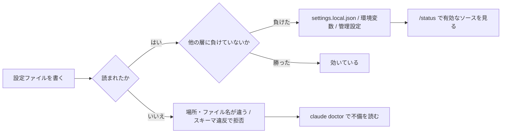
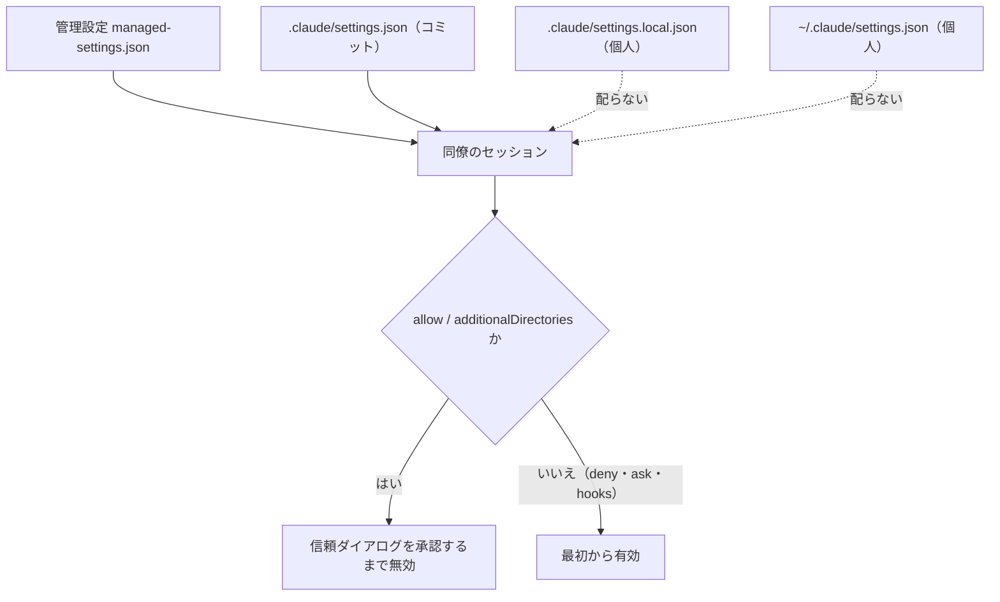
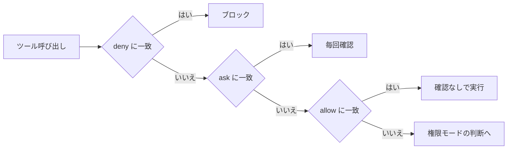

# Claude Daily — 2026-09-27（第036号）

## きょうの3行

- 設定は書いた時点では効いていません。着弾を `/context` と `/status` で確かめます。
- `matcher` を配列で書くと、その設定ファイルが丸ごと拒否されます。
- チームに配れるのは `.claude/settings.json` だけ。allow は各自の信頼を待ちます。

## ① ベストプラクティス — 設定は「着弾を確かめる」までが1セット

> 効かない設定の原因は、ほぼ「読まれていない」か「別の層に上書きされた」。
> 書いた直後に `/context` → `/status` → `/hooks` の順で着弾を見る。
> JSON として正しくても、スキーマが違えばファイルごと捨てられる。

Claude が指示を無視したとき、まず疑うのは書き方ではなく読み込みです。
ファイルが読まれていないのか、別の層に負けているのかで、打つ手が変わります。



図1: 設定が効くまでの2つの関門と、それぞれの確認先

| 症状 | 最初に打つもの | そこで見るもの |
|---|---|---|
| CLAUDE.md やルールが無視される | `/context` | メモリファイルの行に出ているか |
| フックが発火しない | `/hooks` | イベント別の一覧に出ているか |
| 権限ルールが効かない | `/permissions` | 解決後の allow / deny と出どころ |
| 値がどこかで上書きされる | `/status` | 有効な設定ソースと管理設定の有無 |
| 原因がまったく読めない | `claude doctor` | 不正な設定ファイルと落とされたキー |

`/context` は、いま文脈に載っているものをすべて出します。
`claude doctor` はセッションを起動せずに読み取り専用の診断だけを出します。
直す提案まで欲しいときは、セッションの中で `/doctor` を使います。

次の設定は、Bash の実行前にリポジトリ内のスクリプトを通す形です。
そのまま保存して `/hooks` に出れば着弾しています。

```json
{
  "permissions": {
    "allow": ["Bash(npm run *)"],
    "ask": ["Bash(git push *)"],
    "deny": ["Read(./.env)", "Read(./.env.*)"]
  },
  "hooks": {
    "PreToolUse": [
      {
        "matcher": "Edit|Write",
        "hooks": [
          {
            "type": "command",
            "command": "${CLAUDE_PROJECT_DIR}/.claude/hooks/guard.sh"
          }
        ]
      }
    ]
  }
}
```

保存先は `.claude/settings.json` です。
編集はファイルが安定してから現在のセッションに反映されるので、再起動は要りません。

#### ❌ `matcher` を配列で書く

```json
{ "hooks": { "PreToolUse": [ { "matcher": ["Edit", "Write"] } ] } }
```

配列はスキーマ違反です。
Claude Code は設定エラーを出し、ユーザー・プロジェクト・ローカルのその**ファイル全体**を拒否します。
同じファイルに書いた権限ルールも道連れになり、`/hooks` には何も出ません。

#### ✅ 1本の文字列に `|` を並べる

```json
{ "hooks": { "PreToolUse": [ { "matcher": "Edit|Write" } ] } }
```

`|` と `,` はどちらも区切りとして扱われます（`,` は v2.1.191 以降）。
一致は大文字小文字を区別するので、`bash` ではなく `Bash` と書きます。
管理設定では挙動が変わり、配列を含むファイルは `hooks` キーだけが捨てられ、他のキーは生き残ります。

出典: [Debug your configuration](https://code.claude.com/docs/en/debug-your-config)
出典: [Example settings files](https://code.claude.com/docs/en/settings-example)

## ② 深掘り連載 第30回 — settings.json / 権限をチームで共有する

> 配れるのは `.claude/settings.json` と管理設定の2つだけ。
> deny と ask は即座に効き、allow は各自がフォルダを信頼するまで待つ。
> パスの先頭1本の `/` は、そのルールを書いたファイルの場所を指す。

設定の優先順位そのものは第16回（2026-09-13）、コミット境界は第035号（2026-09-26）で扱いました。
今回は「同僚の手元で実際に何が効くか」に絞ります。



図2: 4つの置き場所のうち、他人の手元に届くのは上2つだけ

| キー | 共有ファイルに置く | 理由 |
|---|---|---|
| `permissions.deny` / `ask` | 置く | 信頼を待たずに全員で即座に効く |
| `permissions.allow` | 置く | 各自が信頼した後に効く。承認の手間を減らす |
| `hooks` | 置く | リポジトリ内のスクリプトを指せる |
| `extraKnownMarketplaces` / `enabledPlugins` | 置く | クローンした全員に同じ道具が届く |
| `sandbox` | 置く | 読み取り禁止パスをコマンド側にも広げられる |
| `OTEL_*` などのテレメトリ変数 | 置かない | リポジトリの設定からは無視される |
| `permissions.defaultMode` の `"auto"` | 置かない | プロジェクト設定からは効かない |

次のファイルがチーム共有の最小形です。
リポジトリ直下の `.claude/settings.json` に置いてコミットします。

```json
{
  "permissions": {
    "allow": ["Bash(npm run *)"],
    "ask": ["Bash(git push *)"],
    "deny": ["Read(./.env)", "Read(./.env.*)", "Read(./secrets/**)"]
  },
  "extraKnownMarketplaces": {
    "acme-tools": {
      "source": { "source": "github", "repo": "acme-corp/claude-plugins" }
    }
  },
  "enabledPlugins": { "code-formatter@acme-tools": true },
  "sandbox": {
    "enabled": true,
    "filesystem": { "allowWrite": ["/tmp/build"] },
    "network": { "allowedDomains": ["registry.npmjs.org"] }
  },
  "plansDirectory": "./plans"
}
```

ルールの評価は deny → ask → allow の順で、最初に当たったものが結果になります。
`Bash(aws *)` の deny は、より細かい `Bash(aws s3 ls)` の allow を打ち消します。
allow で deny の例外は作れません。



図3: 最初に当たった1つが結果になる。細かさは順序を変えない

| ルールの種類 | 信頼の承認 | 効き方 |
|---|---|---|
| `deny` | 不要 | 全セッションで即座にブロック |
| `ask` | 不要 | 毎回確認を出す。allow より強い |
| `allow` | 必要 | 承認後に確認なしで通る |
| `additionalDirectories` | 必要 | 承認後にファイルアクセスを広げる |

信頼はリポジトリのルートに紐づきます。
ダイアログには、そのフォルダが与える allow ルールと追加ディレクトリが並びます。
`claude -p` と SDK はダイアログを出さないため、allow ルールは使われず警告が stderr に出ます。

パス指定の基準は、ルールを書いたファイルの場所で変わります。
同じ文字列でも、共有ファイルとユーザー設定で別の場所を指します。

| ルールを書いた場所 | `Edit(/src/**)` が指す先 |
|---|---|
| `.claude/settings.json`（共有） | 主作業ディレクトリの `src/` |
| `.claude/settings.local.json`（個人） | 主作業ディレクトリの `src/` |
| `~/.claude/settings.json`（ユーザー） | `~/.claude/src/` |
| `--settings <file>` で渡したファイル | そのファイルのあるディレクトリの `src/` |

ファイルシステムの絶対パスは、先頭を `//` にします。
`/Users/alice/file` は絶対パスではなく、設定ファイルの場所からの相対です。

| 共有設定でやること | 管理設定に回すこと |
|---|---|
| プロジェクト固有の allow / ask / deny | 組織全体の禁止（`Bash(curl *)` など） |
| リポジトリ内スクリプトを呼ぶフック | `disableBypassPermissionsMode` |
| 市場とプラグインの配布 | `strictKnownMarketplaces` で市場を1つに絞る |
| サンドボックスの既定オン | `allowUnsandboxedCommands: false` |
| — | `requiredMinimumVersion` と `forceLoginOrgUUID` |

共有設定は「この repo ではこうする」という合意です。
管理設定は「誰も外せない」境界です。
外されては困るものは、リポジトリではなく管理設定に置きます。

出典: [Configure permissions](https://code.claude.com/docs/en/permissions)
出典: [Example settings files](https://code.claude.com/docs/en/settings-example)

## ③ すぐ効くTIPS

### 1. `permissions` と `hooks` は `~/.claude.json` に書いても効かない

`~/.claude.json` はアプリの状態と UI のトグルを持つファイルです。
`permissions`・`hooks`・`env` の置き場所は `~/.claude/settings.json` で、別物です。

```bash
grep -l '"hooks"' ~/.claude.json && echo "置き場所が違います"
```

### 2. 入力パラメータ単位で止める `Tool(param:value)`

deny と ask のルールは、組み込みツールのトップレベル入力に一致させられます。
「Opus を指名したサブエージェントだけ確認する」のような絞り方ができます。

```json
{ "permissions": { "ask": ["Agent(model:opus)", "Bash(run_in_background:true)"] } }
```

ツールの主内容フィールドは対象外です。
`Bash(command:rm *)` は無視され、起動時に警告が出ます。`Bash(rm *)` と書きます。

### 3. `Write(...)` と `Glob(...)` のパスルールは参照されない

ファイルの権限検査が見るのは `Edit(path)` と `Read(path)` だけです。
`Write(docs/**)` はルールとして受理されますが照合されず、起動時に警告が出ます。

```json
{ "permissions": { "deny": ["Edit(./migrations/**)", "Read(./secrets/**)"] } }
```

`Read` の deny は同じパスへの Edit と Write も止めます。
ただし NotebookEdit は含まれないので、変更させたくないパスには `Edit` も並べます。

出典: [Debug your configuration](https://code.claude.com/docs/en/debug-your-config)
出典: [Configure permissions](https://code.claude.com/docs/en/permissions)

## ④ 事例

### 1. 全社導入の判断を「意思決定の歴史」として残す（チーム展開）

Gemcook が全社導入に至るまでの経緯を公開しています（二次情報）。
道具を一本化した理由は、実装の質と速度の釣り合い、開発者コミュニティでの普及、Team プランの運用しやすさだったという報告です。

| 時期 | 出来事 |
|---|---|
| 2023-02 | GitHub Copilot を全社導入 |
| 2024〜2025 | 複数のエージェント型ツールを試行 |
| 2025-01 | Devin の Team プランを導入 |
| 2026-02 | Claude Code を全社導入（Team プラン） |

記事は「配布した後の測定値」ではなく「決め方」を残す形です。
導入直後に数万行を生成したメンバーがいた一方、生産性の数値化は公開時点では未了と書かれています。

出典: [Claude Code 全社導入までの意思決定と歴史（Zenn / Gemcook、2026-03-12）](https://zenn.dev/gemcook/articles/claude-code-company-wide)

### 2. 3か月後のアンケートは「速くなった」と「疲れた」が同居する

導入3か月後にエンジニア12名へ22項目のアンケートを取った報告があります（二次情報）。

| 値 | 何の数字か |
|---|---|
| 83% | 生産性が上がったと感じた割合 |
| 66% | 1日あたり1〜2時間の短縮を実感した割合 |
| 83% | 並行作業による負荷が増したと答えた割合 |
| 67% | チーム内での経験・課題共有の場を求めた割合 |
| 3.8 / 5.0 | 全体の満足度 |

求められた支援の筆頭が「共有の場」だった点は、配布物より運用の話です。
設定を配っただけでは、詰まりどころの共有までは配れません。

出典: [Claude Code導入3ヶ月後の社内アンケートから分かったこと（Zenn / READYFOR、2025-10-23）](https://zenn.dev/readyfor_blog/articles/a1cfd81a562e07)

## ⑤ 速報 — 新機能・変更点

| いつ | 何が | どう効くか |
|---|---|---|
| v2.1.283 以降 | auto mode が対話セッションの組み込み既定になった | ターミナルと VS Code の新規セッションが、プランに関係なく auto で始まる。以前は Pro・Max・Team だけ |
| 同上 | 既定が auto になる条件の表が更新 | `disableAutoMode` が `"disable"` なら `default`、`claude -p` と SDK も `default` |
| 9/27 時点 | Claude Code の CHANGELOG は v2.1.283 のまま | 新しい版の追加はなし |
| 9/27 時点 | Platform リリースノートは 9/24 が最新 | 第035号で既報。新規なし |

anthropic.com/news は 9/23 の研究成果、engineering は 4/23 の記事が最新のままです。
claude.com/customers の先頭も前回と同じで、本日は特筆すべき新しい発表はありませんでした。

出典: [Choose a permission mode](https://code.claude.com/docs/en/permission-modes)
出典: [Claude Code CHANGELOG](https://github.com/anthropics/claude-code/blob/main/CHANGELOG.md)

## ⑥ コマンド早見

| コマンド | 何をするか |
|---|---|
| `/context` | いま文脈に載っているものを分類して出す |
| `/status` | 有効な設定ソースと管理設定の有無を出す |
| `/hooks` | いまのセッションで登録されているフックを出す |
| `/permissions` | 解決後の allow / deny とその出どころを出す |
| `/memory` | メモリファイルの場所を出して編集する |
| `/doctor` | 設定の不備を検査し、直す提案まで出す |
| `claude doctor` | セッションを起動せずに読み取り専用の診断を出す |
| `claude --safe-mode` | カスタマイズをすべて外して起動する |

## ⑦ きょうの課題

**目標**: Next.js のリポジトリにチーム用の `.claude/settings.json` を1本置き、着弾を3つのコマンドで確かめます。所要 10〜15分。

**前提**: 対象は自分が書いたリポジトリで、`git` が使えること。

**手順**

1. リポジトリ直下に `.claude/settings.json` を作り、①のコードをそのまま貼る。
2. `.claude/hooks/guard.sh` を作り、`#!/bin/sh` と `exit 0` の2行だけ書いて `chmod +x` する。
3. `claude` を起動し、`/hooks` に `PreToolUse` が出るか見る。
4. `/permissions` で deny の3行が出るか、`/status` で設定ソースが出るかを見る。
5. `matcher` を `["Edit", "Write"]` に書き換えて保存し、`claude doctor` を打つ。

**確認**: 手順5で不正な設定ファイルとして報告され、`/hooks` から消えれば成功です。

── 模範解答 ──

| 手順 | 期待される結果 |
|---|---|
| 3 | `PreToolUse` の下に `Edit\|Write` と `guard.sh` のパスが並ぶ |
| 4 | deny の3行が「プロジェクト設定」由来として出る |
| 5 | `claude doctor` が検証エラーを報告し、`/hooks` には何も出ない |

手順5でフックが消えるのは、スキーマ違反のファイルが丸ごと拒否されるからです。
同じファイルの `permissions` も一緒に消えるので、`/permissions` からも deny が減ります。
これが「JSON として正しいこと」と「設定として妥当なこと」の差です。

| 詰まりどころ | 見るところ |
|---|---|
| `/hooks` に出ない | ファイルが `.claude/settings.json` か。`hooks` キーの直下に置いたか |
| allow だけ効かない | 信頼ダイアログを承認したか。`claude -p` では allow は使われない |
| deny が効かない | `Read` ではなく `Write` や `Glob` に書いていないか |
| フックが発火しない | `matcher` が `bash` のような小文字になっていないか |

あすの予告: 第31回「セキュリティ境界の設計 — 何を触らせないか」。
