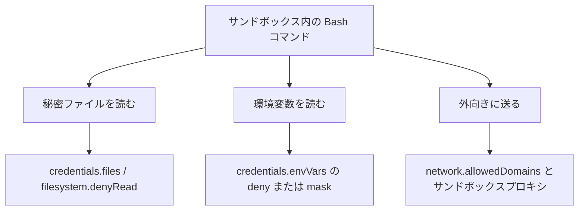
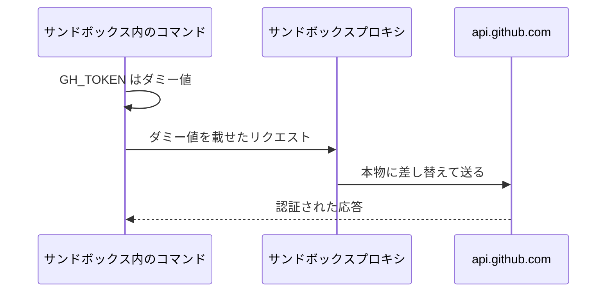
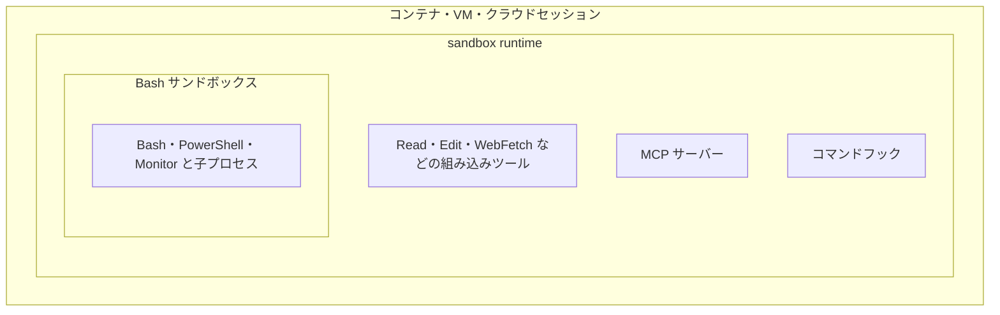

# Claude Daily — 2026-09-28（第037号）

## きょうの3行

- サンドボックスを入れても秘密は既定で読めます。守るのは自分で並べた分だけです。
- 環境変数は消すより隠す。`deny` は `gh` を壊し、`mask` は動かしたまま守ります。
- 境界は「聞くかどうか」ではなく「届く範囲」。無人で走らせる前に箱を選びます。

## ① ベストプラクティス — 秘密は「宣言した分」しか守られない

> サンドボックスの既定は、書き込みが狭く読み取りが広いです。
> `~/.aws/credentials` も `~/.ssh` も既定のまま読めます。
> 組み込みの秘密リストはありません。書いた分だけが守られます。

`/sandbox` を有効にすると、書き込みは作業ディレクトリとその配下、追加ディレクトリ、ユーザー専用の一時ディレクトリに絞られます。
一方、読み取りは「一部の拒否ディレクトリを除くマシン全体」が既定です。
公式ドキュメントも、この既定では `~/.aws/credentials` や `~/.ssh/` を読めると明記しています。



図1: 秘密に触る3つの経路と、それぞれを塞ぐ設定キー

次の設定を `~/.claude/settings.json` に置きます。ファイルは `deny` で読めなくし、トークンは `mask` で隠したまま通します。

```json
{
  "sandbox": {
    "enabled": true,
    "network": {
      "tlsTerminate": {},
      "allowedDomains": ["*.github.com", "registry.npmjs.org"]
    },
    "credentials": {
      "files": [
        { "path": "~/.aws/credentials", "mode": "deny" },
        { "path": "~/.ssh", "mode": "deny" }
      ],
      "envVars": [
        { "name": "GH_TOKEN", "mode": "mask", "injectHosts": ["api.github.com"] },
        { "name": "NPM_TOKEN", "mode": "deny" }
      ]
    }
  }
}
```

| | `deny` | `mask` |
|---|---|---|
| 環境変数の扱い | コマンド実行前に消す | 1セッション限りのダミー値に置き換える |
| コマンドが見る値 | 存在しない | ダミー値 |
| 通信するとき | 認証できない | プロキシが本物に差し替えて送る |
| 書ける設定ソース | どの層でもよい（合流する） | ユーザー設定・管理設定・`--settings` のみ |
| 必要な版 | — | v2.1.199 以降 |

`mask` はリポジトリの `.claude/settings.json` では無視されます。`network.tlsTerminate` も同じ扱いです。
プロキシが本物に差し替えるには中身を見る必要があるため、`tlsTerminate` を置かないと認証が失敗します。

失敗しても秘密は漏れません。ダミー値がそのまま宛先に届くだけです。起動時に設定の不備として報告されます。

#### ❌ トークンを `deny` で消す

```json
{ "name": "GH_TOKEN", "mode": "deny" }
```

`deny` は変数ごと消します。`gh` や `npm` のように、その変数で認証する道具はここで動かなくなります。
すると「サンドボックスを切る」方向に手が動き、境界そのものが外れます。

#### ✅ トークンは `mask` にして宛先を限る

```json
{ "name": "GH_TOKEN", "mode": "mask", "injectHosts": ["api.github.com"] }
```

コマンドとログにはダミー値しか残らず、`api.github.com` への通信だけが本物で認証されます。
`injectHosts` の宛先は `network.allowedDomains` でも通しておく必要があります。
綴りが宛先と一致しない `injectHosts` は `claude doctor` が警告します。



図2: `mask` は秘密をコマンドに渡さず、宛先の手前で差し替えます

| 設定 | `filesystem.disabled: true` のとき |
|---|---|
| `credentials.files` の `deny` | 効かない（ファイル層の機能のため） |
| `filesystem.denyRead` | 効かない |
| `credentials.envVars` の `deny` と `mask` | 効く（ファイル層とは独立） |
| `credentials.files` の `mask` | 効く（`deny` に落ちた項目は効かない） |

- 出典: [Configure the sandboxed Bash tool](https://code.claude.com/docs/en/sandboxing)
- 出典: [Security](https://code.claude.com/docs/en/security)

## ② 深掘り連載 第31回 — セキュリティ境界の設計（何を触らせないか）

> 境界が決めるのは「聞くかどうか」ではなく「届く範囲」です。
> Bash サンドボックスの内側は Bash だけ。MCP とフックは外です。
> 無人で走らせるときの安全は、選んだ箱の強さで決まります。



図3: どこまでが箱の内側か。外側の箱ほど、同じセッションの多くを含む

| 方式 | 隔離されるもの | Docker | 手間 |
|---|---|---|---|
| Bash サンドボックス | Bash・PowerShell・Monitor と子プロセス | 不要 | macOS は最小、Linux と WSL2 は小 |
| sandbox runtime | Claude Code のプロセス全体（ツール・MCP・フック） | 不要 | 小 |
| Dev Container | 開発環境まるごと | 必要 | 中 |
| 自前コンテナ | 開発環境まるごと | 必要 | 中〜大 |
| 仮想マシン | OS まるごと | 不要 | 大 |
| クラウドセッション | OS まるごと（Anthropic が用意） | 不要 | なし（サブスクリプションが必要） |

権限モードと境界は別の仕事をします。前者が決めるのは、そのツール呼び出しを走らせるか、先に人に聞くかです。
後者は、走り出したあとに届く範囲を OS の側で押さえます。

モデルが何を選んだかに関係なく効くのは、後者だけです。

| やりたいこと | 選ぶもの |
|---|---|
| 日常の作業で確認の回数を減らす | Bash サンドボックス（`/sandbox`） |
| MCP とフックまで同じ境界に入れたい | sandbox runtime |
| `--dangerously-skip-permissions` で放置する | コンテナ・VM・sandbox runtime のいずれか |
| 信頼していないリポジトリを開く | 専用の仮想マシン、またはクラウドセッション |
| チームで同じ箱を配る | Dev Container をリポジトリに入れる |
| 組織全体に強制する | 管理設定で `sandbox` キーを配る |

`--dangerously-skip-permissions` は確認を全部飛ばすので、そのときの防壁は箱だけになります。
Linux と macOS では root のままだと起動を拒否されます。箱の中でも非 root で動かします。

auto mode の分類器は行為ごとの判定で、境界ではありません。多層のうちの1枚として数えます。

| 用語 | 意味 |
|---|---|
| sandbox runtime | Claude Code のプロセス全体を Seatbelt や bubblewrap で包む beta の別パッケージ |
| 保護パス | サンドボックス内のコマンドが書き込めない設定ファイル群。`allowWrite` でも例外にできない |

sandbox runtime は、設定が読めなくても止まらずに起動します。そのときネットワークは全部遮断されます。書き込み先も組み込みのわずかなパスだけに縮みます。

起動しただけでは、設定が効いた証拠になりません。

`--settings` で渡したときだけは、読めなければ起動を拒否します。
Linux と WSL2 では拒否リストを起動時に1回作るので、セッション中に `git clone` で増えたリポジトリは対象外です。

- 出典: [Choose a sandbox environment](https://code.claude.com/docs/en/sandbox-environments)
- 出典: [Configure the sandboxed Bash tool](https://code.claude.com/docs/en/sandboxing)

## ③ すぐ効くTIPS

### 1. 子プロセス全体から秘密を剥がす

サンドボックスの `credentials` はサンドボックス内の Bash にしか効きません。フックと stdio の MCP サーバーは対象外です。
環境変数を1か所で剥がすなら、この変数を立てます。

```json
{
  "env": {
    "CLAUDE_CODE_SUBPROCESS_ENV_SCRUB": "1"
  }
}
```

Bash・フック・MCP の子プロセスから、Anthropic とクラウド事業者の資格情報が消えます。親の Claude Code は保持したまま API を呼びます。
Linux では Bash の子プロセスが別の PID 名前空間に入るため、`ps` や `kill` がホスト側のプロセスを見られなくなります。

### 2. 許可外のドメインは聞かずに落とす

既定では、新しいドメインに出ようとするたびに確認が出ます。留守番させる間は、確認ではなく拒否が正解です。

```json
{
  "sandbox": {
    "enabled": true,
    "network": {
      "strictAllowlist": true,
      "allowedDomains": ["registry.npmjs.org", "*.github.com"]
    }
  }
}
```

`strictAllowlist` はユーザー設定・管理設定・`--settings` でだけ効きます。リポジトリの `.claude/settings.json` に書いても無視されます。v2.1.219 以降で使えます。

### 3. ホームディレクトリ直下では起動しない

ホームで起動したときの信頼の承認は、そのセッション限りでディスクに残りません。起動のたびに聞かれます。永続化する設定はありません。

```bash
cd ~/projects/my-next-app && claude
```

プロジェクトのディレクトリから起動すれば、承認はそのディレクトリごとに保存されます。

## ④ 事例

### Anthropic 自身が3製品で使い分けている隔離（一次情報）

| 値 | 何の数字か |
|---|---|
| 93% | 利用者が承認した権限プロンプトの割合。時間とともに注意が薄れたと報告 |
| 83% | 分類器が実行前に捕まえた「やりすぎ」の割合 |
| 84% | OS レベルの封じ込めを入れたあとの権限プロンプト削減率 |

| 製品 | 隔離のかたち |
|---|---|
| claude.ai | 使い捨てコンテナ（gVisor・セッションごとのファイルシステム） |
| Claude Code | 人が輪の中にいるサンドボックス（Seatbelt / bubblewrap ＋ 権限ダイアログ） |
| Cowork | ローカル VM（プラットフォームのハイパーバイザ） |

同社は「エージェントが何をしたかを見張るのではなく、何ができるかを制限する」と書いています。
まず環境の層で封じ込め、そのうえでモデルの層で振る舞いを整える、という順番です。
自作の防御より、枯れた道具を使うほうがよいとも述べています。

出典: [How we contain Claude across products](https://www.anthropic.com/engineering/how-we-contain-claude)（2026-05-25）

### 配り方は「対象・自動実行・文脈」の3軸で決まっていた（二次情報）

5社の導入をまとめた記事では、配り方の判断が3つの軸に整理できたという報告があります。
軸は、配る相手の範囲・自動実行をどこまで許すか・文脈をどう配るか、の3つです。
MDM で `managed-settings.json` を配り、個人が上書きできないようにした例も挙げられています。

出典: [Claude Codeを会社で配るとき何が正解か — 5社事例から見えた2026年の指針](https://zenn.dev/yukibjj/articles/claude-code-enterprise-rollout-5-companies-2026)（Zenn / 濱田優貴、2026-07-30、二次情報）

## ⑤ 速報 — 新機能・変更点

本日は特筆すべき新機能の発表はありませんでした。確認した先と、その最終更新は次のとおりです。

| いつ | 何が | どう効くか |
|---|---|---|
| 変化なし | Claude Code CHANGELOG は v2.1.283 のまま | 前号から新しい版なし |
| 2026-09-24 | Platform リリースノート（拒否応答の課金再開ほか） | 第035号で既報 |
| 2026-09-23 | anthropic.com/news の最新は研究成果 | 開発者向けの変更なし |
| 2026-04-23 | anthropic.com/engineering の日付つき最新 | 変化なし |

出典: [Claude Code CHANGELOG](https://github.com/anthropics/claude-code/blob/main/CHANGELOG.md)

## ⑥ コマンド早見

| コマンド | 何をするか |
|---|---|
| `/sandbox` | サンドボックスのパネルを開き、モードと境界を確認する |
| `claude doctor` | 設定の不備を検査する。`injectHosts` の綴り違いもここで出る |
| `/permissions` | 権限ルールの現在値を確認する |
| `npx @anthropic-ai/sandbox-runtime claude` | Claude Code のプロセス全体を sandbox runtime で包んで起動する |
| `cd ~/projects/my-next-app && claude` | プロジェクトのディレクトリから起動し、信頼の承認を保存させる |

## ⑦ きょうの課題

> Next.js プロジェクトで、秘密ファイルが本当に読めなくなるかを確かめます。所要 10 分。

**前提**: Claude Code v2.1.199 以降、macOS か Linux か WSL2。サンドボックスは macOS 以外で `bubblewrap` と `socat` が必要です。

**手順**

1. ダミーの秘密を作る。`mkdir -p ~/.demo-secrets && echo 'token=dummy' > ~/.demo-secrets/token`
2. プロジェクトの `.claude/settings.json` に `sandbox.enabled` と `credentials.files` の `deny` を1件書く。パスは `~/.demo-secrets`
3. `/sandbox` を開き、Config タブの「Denied within allowed」に出るかを見る
4. Claude に `cat ~/.demo-secrets/token` を実行させる
5. 同じ設定から `credentials` を消し、もう一度4を実行して違いを見る

**確認方法**: 4で拒否され、5で中身が出れば、境界は設定の分だけ効いていると分かります。

── 模範解答 ──

```json
{
  "sandbox": {
    "enabled": true,
    "credentials": {
      "files": [
        { "path": "~/.demo-secrets", "mode": "deny" }
      ]
    }
  }
}
```

`deny` はどの設定層からでも足せます。層をまたいで合流し、他の層が外すことはできません。だからリポジトリ側の設定にも書けます。

| 詰まりどころ | 理由 |
|---|---|
| 設定なしでも読めなかった | サンドボックスが無効。`/sandbox` で状態を見る |
| 設定を足しても読めてしまう | `mask` で書いた。ファイルの `mask` は macOS では拒否に落ちるが、記法違いに注意 |
| `~` が効かない | サンドボックスのパスは `~/` がホーム、`/` が絶対。権限ルールの `//` とは別の規則 |
| 変更が効かない | 別の層に `filesystem.disabled` がある。ファイル層ごと切れている |

あすの予告: 第32回 コスト管理とモデル選択の指針。
