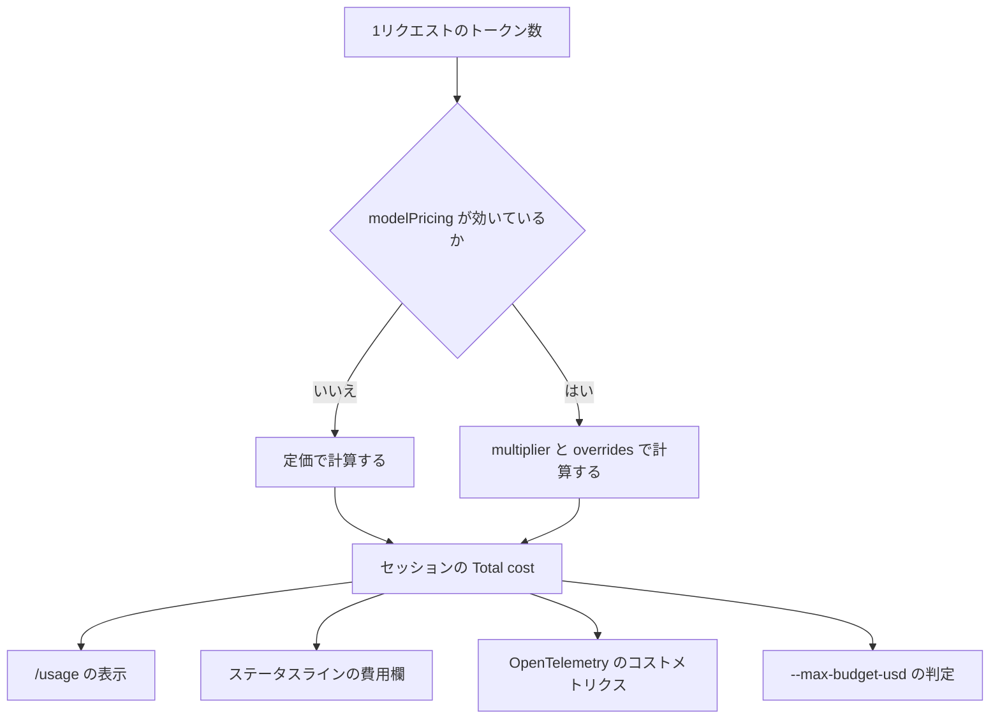
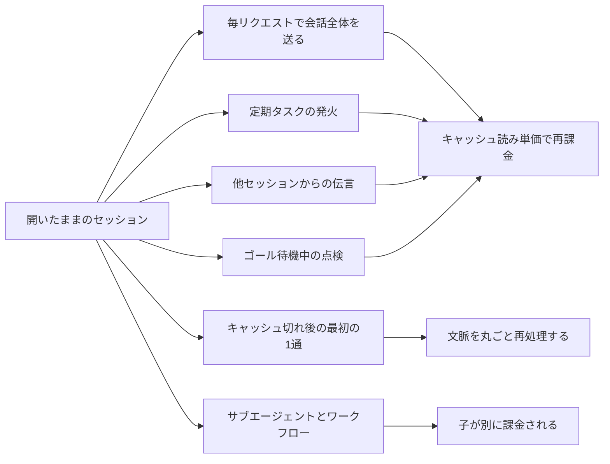
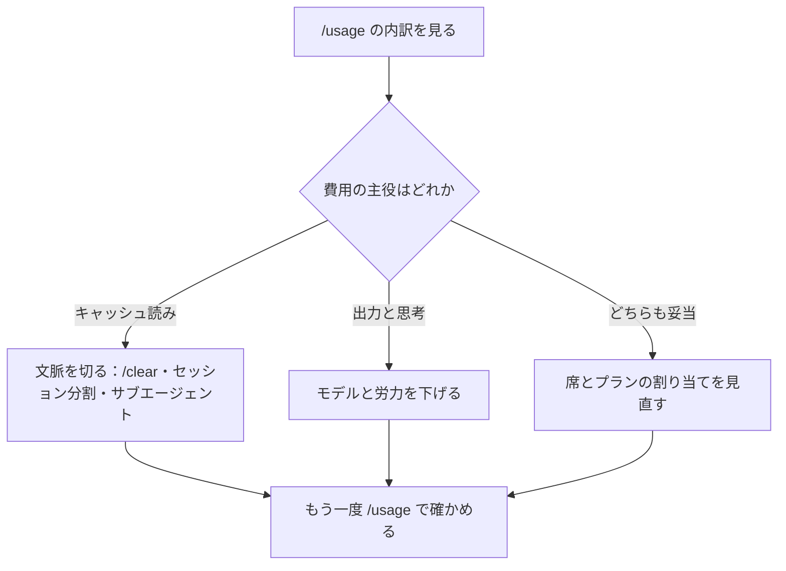

# Claude Daily — 2026-09-29（第038号）

## きょうの3行

- Sonnet 5.5 が出ました。1M文脈で $2／$10、既定の Sonnet になります。
- 費用は作業量ではなく会話の長さで伸びます。40億トークンの77.5%は再読でした。
- 金額の目盛りは既定で定価です。契約レートがあるなら管理設定で直します。

## ① ベストプラクティス — 金額の目盛りを請求に合わせてから、金額で栓をする

> Claude Code が見せる金額は、既定ではすべて定価計算です。
> 契約レートがあるなら `modelPricing` で目盛りを直します。
> 同じ目盛りが `--max-budget-usd` の判定にも使われます。

無人実行に金額の上限を付けても、目盛りが請求とずれていれば上限もずれます。
定価で数えた $5 は、85%の契約なら請求ベースの $4.25 で止まります。
割増契約なら逆に、上限を超えてから止まります。



図1: トークン数から金額が決まる経路と、その金額が出ていく4つの先

次を管理設定のファイルとして置きます。パスは macOS が `/Library/Application Support/ClaudeCode/managed-settings.json`、Linux と WSL が `/etc/claude-code/managed-settings.json` です。

```json
{
  "modelPricing": {
    "overrides": {
      "claude-sonnet-5-5": {
        "input": 1.7,
        "output": 8.5,
        "cacheRead": 0.17,
        "cacheWrite": 2.125
      }
    }
  }
}
```

上の数字は定価の85%で計算した例です。契約書の単価をそのまま書いてください。

| フィールド | 型 | 何をするか |
|---|---|---|
| `multiplier` | 0より大きく10以下の数 | 計算したすべての費用に掛かる。1未満が割引、1超が割増（割増は v2.1.271 以降） |
| `overrides` | モデルIDごとの4項目 | `input`・`output`・`cacheRead`・`cacheWrite` を100万トークンあたりのドルで書く。4つすべて必須 |

`multiplier` は `overrides` の単価にも重ねて掛かります。両方に割引を書くと二重に割り引かれます。

| 設定の層 | `modelPricing` の扱い |
|---|---|
| サーバー管理設定 / MDM / `managed-settings.json` / ポリシーヘルパー | 効く |
| ユーザー設定 / プロジェクト設定 / ローカル設定 / `--settings` | 黙って無視される |

目盛りが合ったら、無人実行に金額で栓をします。上限はサブエージェントの分も合算します。

```bash
claude -p --max-budget-usd 0.50 "app/page.tsx の型エラーだけ直して、npm run typecheck で確認して"
```

#### ❌ プロジェクト設定に書いてチームに配る

```json
{ "modelPricing": { "multiplier": 0.85 } }
```

この層では読まれません。警告もエラーも出ないので、定価のままだと気づけません。
`--max-budget-usd 5` は請求ベースの $4.25 で止まり、ずれの手がかりが残りません。

#### ✅ 管理設定に置き、注記で効いたことを確かめる

```bash
claude -p --settings ./ignored.json "ping"   # ← modelPricing はここでは効かない
claude                                        # 管理設定を読ませて /usage を開く
```

`/usage` の `Total cost` 行に `at your organization's configured rates` が付けば効いています。
`/status` で管理設定が読まれたことも合わせて確認してください。

- 出典: [Manage costs effectively — Report spend at your contracted rates](https://code.claude.com/docs/en/costs#report-spend-at-your-contracted-rates)
- 出典: [Settings reference — modelPricing](https://code.claude.com/docs/en/settings-reference#modelpricing)
- 出典: [CLI reference — CLI flags](https://code.claude.com/docs/en/cli-reference#cli-flags)
- 出典: [Deploy managed settings](https://code.claude.com/docs/en/managed-settings)

## ② 深掘り連載 第32回 — コスト管理とモデル選択の指針

> 費用は作業量ではなく「文脈の大きさ × 手番の数」で伸びます。
> 単価は4段あります。仕事の大きさでモデルを割り当てます。
> 見る場所と止める場所は、契約形態ごとに別です。

まず、公式ドキュメントが出している目安を置きます。自分のチームの実測と比べる基準線です。

| 値 | 何の数字か |
|---|---|
| 約13ドル | 開発者1人・稼働1日あたりの平均（企業導入の平均） |
| 150〜250ドル | 開発者1人あたりの月額 |
| 90% | 稼働1日あたり30ドル未満に収まる利用者の割合 |
| 約7倍 | エージェントチームがプランモードで使うトークン（通常セッション比） |
| 0.04ドル未満 | 待機中の背景処理が1セッションで使う額 |

ドキュメントは「小さな試験導入で自分たちの基準線を作ってから広げる」ことを勧めています。



図2: 手を動かしていなくても使用量が伸びる6つの経路

キャッシュの寿命は契約で変わります。サブスクは1時間、利用クレジットに乗ると5分です。
APIキーとクラウド事業者では既定で5分です。

一晩空けた翌朝の1通目は、この寿命を越えているので必ず外れます。

| モデル | 入力／出力（$/MTok） | 文脈 | 速さ | 既定の労力（API） |
|---|---|---|---|---|
| Fable 5.1 | 10 / 50 | 1M | 遅い | `high` |
| Opus 5.5 | 4 / 20 | 1M | 中くらい | `medium` |
| Sonnet 5.5 | 2 / 10 | 1M | 速い | `high` |
| Haiku 4.5 | 1 / 5 | 200K | 最速 | 労力の指定なし |

バッチAPIは入出力が50%引き、キャッシュ読みは基本入力単価の10%です（Opus 5.5 は5%）。



図3: 打つ手の順序。内訳を見ないままモデルを下げても効かないことがある

| 手 | 使うべき時 | 使うべきでない時 |
|---|---|---|
| モデルを下げる | 出力と思考が費用の主役のとき | 費用の大半がキャッシュ読みのとき。下げても効きません |
| 労力を下げる | 範囲がはっきりした日常の実装 | バグ修正や移行。やり直しの往復で結局増えます |
| `/clear` で切る | 話題が変わったとき | 同じ問題を深追いしていて、履歴に価値があるとき |
| サブエージェントに出す | 出力が多い調査・テスト・ログ処理 | 1コマンドで済む確認。子の分だけ増えます |
| エージェントチームを使う | 独立した作業が本当に並ぶとき | 調整が必要な作業。約7倍のトークンを払います |

見る場所と止める場所は、契約形態ごとに別の画面です。混在している組織では、各人がサインインした方法で計測されます。

| 契約 | 見る場所 | 止める場所 | 1人あたりの数字 |
|---|---|---|---|
| Team / Enterprise | 組織分析のスペンドレポート | 管理設定の支出上限（席の割当が既定の天井） | スペンドレポートCSV / Enterprise Analytics API |
| Console（API） | Console の使用状況ページ | ワークスペースの支出上限 | Console ダッシュボード / Claude Code Analytics API |
| Bedrock / Google Cloud / Foundry | 各クラウドの請求コンソール | クラウド側の予算管理 | OpenTelemetry または自前ゲートウェイ |

OpenTelemetry はどの形態でも使えます。1人あたりのトークンと費用をほぼ即時で自前の監視基盤に流せる唯一の手です。

| チーム規模 | 1人あたり TPM | 1人あたり RPM |
|---|---|---|
| 1〜5人 | 200k〜300k | 5〜7 |
| 5〜20人 | 100k〜150k | 2.5〜3.5 |
| 20〜50人 | 50k〜75k | 1.25〜1.75 |
| 50〜100人 | 25k〜35k | 0.62〜0.87 |
| 100〜500人 | 15k〜20k | 0.37〜0.47 |
| 500人以上 | 10k〜15k | 0.25〜0.35 |

規模が大きいほど1人あたりを下げてよいのは、同時に使う人の割合が下がるからです。
上限は組織単位で効くので、他の人が使っていない時間帯は各人が一時的に超えて使えます。

- 出典: [Manage costs effectively](https://code.claude.com/docs/en/costs)
- 出典: [Claude Sonnet 5.5 — How it compares](https://platform.claude.com/docs/en/models/sonnet-5-5/overview)
- 出典: [Reduce token usage](https://code.claude.com/docs/en/costs#reduce-token-usage)

## ③ すぐ効くTIPS

### 1 手番ごとの追い1通を止める

Claude が返したあと、次のプロンプトを予測する短いリクエストが1本出ます。
会話のキャッシュを使い回すので安いのですが、手番ごとに必ず1本増えます。

```json
{ "promptSuggestionEnabled": false }
```

環境変数 `CLAUDE_CODE_ENABLE_PROMPT_SUGGESTION=false` は、この設定より優先されます。

### 2 思考の予算は、モデルによって効き方が違う

思考トークンは出力として課金されます。固定予算のモデルは環境変数で下げられます。
適応推論のモデルは0以外の予算を無視するので、そちらは `/effort` で調整します。

```bash
MAX_THINKING_TOKENS=8000 claude
```

### 3 使用上限に当たったら、開いたまま待たせる

サブスクの使用上限で止まったとき、開いたセッションは自動で待って続きを進めます。
連続して2回まで待ち直し、そのあとは `/rate-limit-options` の案内で止まります。

```json
{ "autoContinueAtUsageLimit": false }
```

無人で回す用途では、待たせずに落としたいこともあります。そのときは上のように切ります。

- 出典: [Turn prompt suggestions off](https://code.claude.com/docs/en/interactive-mode#turn-prompt-suggestions-off)
- 出典: [Adjust extended thinking](https://code.claude.com/docs/en/costs#adjust-extended-thinking)
- 出典: [Wait for a usage limit to reset](https://code.claude.com/docs/en/interactive-mode#wait-for-a-usage-limit-to-reset)

## ④ 事例

### 1 40億トークンを分解したら、77.5%が「会話の再読」だった

筆者が Claude Code の記録ファイルの使用量フィールドを集計した、という報告があります。

| 値 | 何の数字か |
|---|---|
| 40.03億トークン | 48時間・64セッション・12,898手番の合計 |
| 77.5% | キャッシュ読み（過去の会話の読み直し）の割合 |
| 13.2% | キャッシュ書きの割合 |
| 9.3% | 出力（実際の生成）の割合 |
| 87% | 長い4セッションだけが占めた費用の割合 |
| 36.4時間 / 2,441手番 | 最長セッション。単独で全体の30% |

結論は「費用は作業量ではなく会話の長さで決まる」でした。
20万トークンでセッションを割れば71%下げられる、という見積もりも出しています。
重複作業は0〜1%で、同じコマンドの打ち直しはほとんど無かったとも書いています。

- 出典: [Claude Code の 40 億トークンを分解したら、77.5% が「会話の再読」で重複作業は 0% だった（Qiita、2026-09-10）](https://qiita.com/yumma08824/items/592ee994cf9c876799f5)

### 2 チーム展開では、流通している単価が古いことがある

プラン選定の枠組みを整理した Zenn の記事があります。各所の報告値を集めた内容です。

| 出どころ | 1人あたりの目安 |
|---|---|
| 公式ドキュメント（現行） | 稼働1日 約13ドル / 月 150〜250ドル |
| 上記の記事が引く値 | 1日 6ドル / 月 100〜200ドル |

同じ「1人あたり」でも2倍の開きがあります。予算は公式値で立てるのが安全です。

筆者は、費用を可視化する ccusage がローカルの記録しか見ないと書いています。
チーム横断の集計には、スペンドレポートか OpenTelemetry を別に用意します。

- 出典: [Claude Code のコスト管理ガイド（Zenn、2026-05-24、二次情報）](https://zenn.dev/miyan/articles/claude-code-cost-real-data-guide-2026)
- 出典: [Manage costs for your organization](https://code.claude.com/docs/en/costs#manage-costs-for-your-organization)

## ⑤ 速報 — 新機能・変更点

| いつ | 何が | どう効くか |
|---|---|---|
| 9/28 | Claude Sonnet 5.5（`claude-sonnet-5-5`）公開 | 1M文脈・出力上限128k・$2／$10 per MTok。キャッシュ読み $0.20、1時間キャッシュ書き $4 |
| 9/28 | Sonnet 5 からの破壊的変更5件 | 上流思考を切るのは `between_tools`、強制ツール使用は400、思考ブロックはモデルと会話に紐づく、`computer_20251124` 不可、アドバイザの組み合わせ制限 |
| 9/28 | 思考ブロックがアカウントに紐づく | 別アカウントが送ると、APIがブロックを落としてから通す |
| v2.1.284 | Sonnet 5.5 が既定の Sonnet に | `sonnet` エイリアスの指す先が変わる |
| v2.1.284 | `/usage` にゲートウェイ支出上限の金額表示 | 自前ゲートウェイの残り枠がドルで見える |
| v2.1.284 | 労力スライダーのキーバインド3種 | `effortSlider:decreaseEffort`／`increaseEffort`／`toggleUltracode` |
| v2.1.284 | `/mcp reconnect all` | 失敗した MCP 接続をまとめて再試行する |
| v2.1.284 | auto mode に「はい、次回も確認」 | 作業ディレクトリ外の読み取りを1回だけ通せる |
| v2.1.284 | 修正6件 | 生エラーが出る応答ストリーム、思考後の過負荷エラーの再試行、コンパクション後も残る「プロンプトが長すぎます」、SDK の不正な画像ソース、再開セッションでの MCP ツール欠落、プラン使用量エンドポイントの連続呼び出し |

- 出典: [Claude Code CHANGELOG](https://github.com/anthropics/claude-code/blob/main/CHANGELOG.md)
- 出典: [Claude Platform リリースノート](https://platform.claude.com/docs/en/release-notes/overview)

## ⑥ コマンド早見

| コマンド | 何をするか |
|---|---|
| `claude -p --max-budget-usd 0.50 "..."` | print モードで、この額に達したら止める |
| `claude -p --settings ./x.json "..."` | このセッションだけ設定を差し替えて走らせる |
| `MAX_THINKING_TOKENS=8000 claude` | 固定予算のモデルの思考予算を下げて起動する |
| `/usage` | セッションのトークンと費用、プラン使用量の内訳を見る |
| `/status` | 管理設定が読まれたかを確認する |
| `/effort medium` | 適応推論のモデルで思考の深さを変える |
| `/clear` | 文脈を捨てて新しいセッションにする |
| `/rate-limit-options` | 使用上限で止まったときの待ち方を選ぶ |

## ⑦ きょうの課題

金額の目盛りと栓を、10分で1度ずつ確かめます。Next.js のリポジトリで試してください。

**前提**: Claude Code v2.1.242 以降と、管理設定のパスに書ける権限。

**手順**

1. `{ "modelPricing": { "multiplier": 0.5 } }` を `pricing.json` としてリポジトリ直下に置く。
2. `claude --settings ./pricing.json` で起動し、短い依頼を1つ出して `/usage` を開く。
3. 同じ内容を管理設定のパスに置き、素の `claude` で同じ依頼をして `/usage` を開く。
4. `claude -p --max-budget-usd 0.01 "app/ 以下を全部読んで構成を要約して"` を走らせる。

**確認方法**: 手順2と3で `Total cost` 行の注記が変わります。手順4は途中で止まります。

── 模範解答 ──

| 手順 | 出る結果 | なぜそうなるのか |
|---|---|---|
| 2 | 注記は出ず、金額は定価のまま | `modelPricing` は管理設定だけが読む層。警告もエラーも出ない |
| 3 | `at your organization's configured rates` が付き、金額が半分になる | `multiplier` が計算したすべての費用に掛かる |
| 4 | `Budget limit reached` で止まる | `--max-budget-usd` は print モード専用。上限に達すると新しいサブエージェントが失敗し、背景サブエージェントも止まる（v2.1.217 以降） |

手順2で何も言われないのが、この設定でいちばん危ないところです。
定価のまま数か月運用しても、誰も気づけません。

**よくある詰まりどころ**

- 対話セッションで `--max-budget-usd` を渡しても効きません。栓は `-p` のときだけです。
- `--continue` や `--resume` で戻ると、前回までの合計は上限に数えられません。
- `overrides` は4項目すべて必須です。1つ欠けた分は黙って捨てられ、残りだけが効きます。
- 既存の管理設定があるなら、上書きせずそのファイルに `modelPricing` を足してください。

あすの予告: 第33回は「オンボーディング — 新メンバーに最初に教える3つ」です。
