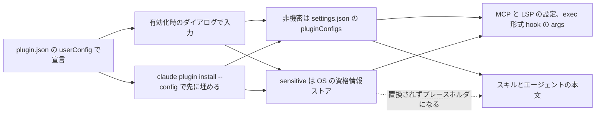
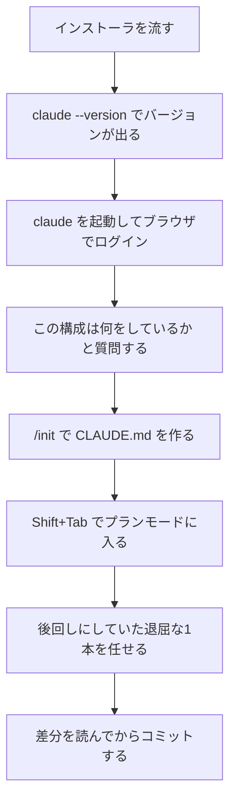
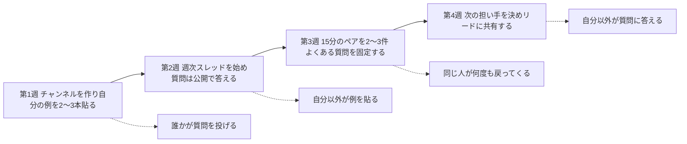

# Claude Daily — 2026-09-30（第039号）

## きょうの3行

- 配る道具の設定は、穴を宣言してから配ります。受け皿が `userConfig` です。
- 新メンバーに最初に教えるのは3つ。`@`・プランモード・`/init` です。
- v2.1.285 が出ました。WebFetch を切る環境変数と `claude --desktop` が追加。

## ① ベストプラクティス — 設定の穴は宣言して配る

> 配る道具の設定は `plugin.json` の `userConfig` で宣言します。
> 値は `${user_config.KEY}` で参照します。
> 目的は、受け取る側に `settings.json` を触らせないことです。

チームにプラグインを配ると、必ず環境ごとに違う値が出てきます。
エンドポイント、トークン、社内のホスト名です。
これを手で `settings.json` に書かせると、新メンバーの初日が設定作業で終わります。



図1: 宣言から参照までの経路。機密値はスキル本文には届かない

宣言はプラグイン直下の `.claude-plugin/plugin.json` に書きます。

```json
{
  "name": "team-tools",
  "version": "1.0.0",
  "description": "社内 API とつなぐ MCP サーバーを配る",
  "author": { "name": "Platform Team" },
  "mcpServers": {
    "internal-api": {
      "command": "node",
      "args": ["${CLAUDE_PLUGIN_ROOT}/server.js"],
      "env": {
        "API_ENDPOINT": "${user_config.api_endpoint}",
        "API_TOKEN": "${user_config.api_token}"
      }
    }
  },
  "userConfig": {
    "api_endpoint": {
      "type": "string",
      "title": "API endpoint",
      "description": "チームの API エンドポイント",
      "options": ["https://api.stg.example.com", "https://api.example.com"],
      "default": "https://api.stg.example.com"
    },
    "api_token": {
      "type": "string",
      "title": "API token",
      "description": "API の認証トークン",
      "sensitive": true,
      "required": true
    }
  }
}
```

| フィールド | 必須 | 何をするか |
|---|---|---|
| `type` | はい | `string` / `number` / `boolean` / `directory` / `file` のどれか |
| `title` | はい | 設定ダイアログのラベル |
| `description` | はい | 欄の下に出る説明 |
| `required` | いいえ | `true` なら空欄を受け付けない |
| `default` | いいえ | 未入力のときに使う値 |
| `options` | いいえ | `string` を固定の選択肢に絞る（v2.1.271 以降） |
| `sensitive` | いいえ | 入力を隠し、`settings.json` ではなく資格情報ストアに保存する |
| `multiple` | いいえ | `string` で文字列の配列を許す |
| `min` / `max` | いいえ | `number` の下限と上限 |

`options` を1つでも書くと、v2.1.271 より前の版ではプラグインごと読み込めません。
古い版が混じるチームでは、まだ使わないほうが安全です。

配る前に検証し、プロジェクト単位で入れます。

```bash
claude plugin validate ./team-tools --strict
claude plugin install team-tools@our-marketplace --scope project --config api_endpoint=https://api.example.com
```

`--strict` は警告も失敗として扱うので、CI に置く形はこちらです。

| 書き方 | 届く場所 | 制限 |
|---|---|---|
| `${user_config.KEY}` | MCP・LSP の設定、exec 形式 hook の `args`、スキルとエージェントの本文 | 本文では非機密の値だけが置換される |
| `CLAUDE_PLUGIN_OPTION_<KEY>` | hook のプロセスの環境変数。`<KEY>` は大文字 | シェル形式の hook はこちらを読む |

#### ❌ `.mcp.json` にトークンを直書きして配る

```json
{
  "mcpServers": {
    "internal-api": {
      "command": "node",
      "args": ["${CLAUDE_PLUGIN_ROOT}/server.js"],
      "env": { "API_TOKEN": "sk-internal-9f3a..." }
    }
  }
}
```

秘密がリポジトリに残り、全員が同じ値を使うことになります。
`claude plugin validate` は資格情報に見える**ヘッダ値**を警告しますが、`env` の直書きは通します。
気づけるのは漏れたあとです。

#### ✅ 宣言しておき、シェル形式の hook では環境変数で受ける

```json
{
  "hooks": {
    "PostToolUse": [
      {
        "matcher": "Write|Edit",
        "hooks": [
          { "type": "command", "command": "\"${CLAUDE_PLUGIN_ROOT}\"/scripts/notify.sh" }
        ]
      }
    ]
  }
}
```

`notify.sh` の中では `$CLAUDE_PLUGIN_OPTION_API_TOKEN` を読みます。
シェル形式の `command` に `${user_config.*}` を書くと、そのコンポーネントはエラーで走りません。
置換後の値をシェルがもう一度解釈してしまうからです。

monitor の `command` と MCP の `headersHelper` も同じ扱いです。
こちらは環境変数も渡らないので、スクリプト側で値を取りに行きます。

- 出典: [Plugin manifest reference — User configuration](https://code.claude.com/docs/en/plugins/manifest-reference#user-configuration)
- 出典: [Plugin manifest reference — Fields that run through a shell](https://code.claude.com/docs/en/plugins/manifest-reference#fields-that-run-through-a-shell)
- 出典: [Plugin commands reference — plugin install](https://code.claude.com/docs/en/plugins/cli-reference#plugin-install)
- 出典: [Plugin commands reference — plugin validate](https://code.claude.com/docs/en/plugins/cli-reference#plugin-validate)

## ② 深掘り連載 第33回 — オンボーディング：新メンバーに最初に教える3つ

> 最初に教えるのは `@`・プランモード・`/init` の3つです。
> `/team-onboarding` が自分の履歴から手順書を作ります。
> 教える側の仕事は、週40分ほどに収まります。



図2: 初日にたどる順番。質問から入り、ファイルの変更は後ろに回す

公式ドキュメントが「最初に効く技術」として並べているうち、上の3つが土台です。

| 教えること | 打ち方 | なぜ最初か |
|---|---|---|
| 文脈を渡す | `@src/components/` のようにファイルやディレクトリを指す。エラー出力はそのまま貼る | 「でたらめを返す」の多くは文脈不足。凝ったプロンプトより効きます |
| 変更の前に計画を見る | `Shift+Tab` を押してプランモードに入る | どのファイルを触るかが先に出る。共有コードでも任せられます |
| リポジトリを教える | `/init` で `CLAUDE.md` を作り、規約とテストコマンドを足す | 同じ質問が消えます。チェックインすれば全員に効きます |

手順書は、自分の使い方から生成できます。

```text
/team-onboarding
```

直近30日のセッション、コマンド、MCP サーバーの使用状況を読み、Markdown の手順書を出します。
新しく入った人は、それを最初のメッセージとして貼るだけで設定が揃います。
Pro・Max・Team・Enterprise では、Claude Code で直接開ける共有リンクも返ります。

| 場面 | 使うべきか | 理由 |
|---|---|---|
| そのリポジトリで自分が1か月まともに使った | 使う | 直近30日の実際の使い方が材料になります |
| 今日入ったばかりで履歴がない | 使わない | 材料がないので手順書も薄くなります |
| チームの標準にしたい | 複数人で出して統合する | 1人分の出力は1人の癖です |
| 口で説明する時間が惜しい | 共有リンクを配る | 説明の代わりに、貼れる状態で渡せます |

質問は必ず来ます。返し方は公式ドキュメントが型を出しています。

| 質問 | 返し方 |
|---|---|
| 「最初に何で試せばいい？」 | 難しくはないが面倒で後回しにしている作業を1つ選ばせる |
| 「自分のコードを任せて大丈夫？」 | プランモードを見せる。承認するまで何も変わりません |
| 「間違った答えが返ってきた」 | 言い直させず、エラー文か落ちたテストをそのまま貼り直させる |
| 「うちの規約を知らない」 | `/init` で `CLAUDE.md` を作り、規約・テストコマンド・触らせない場所を足す |
| 「セキュリティとデータの扱いは？」 | 管理者に回す。ここは各自で答えない |

答えは公開の場に1回書き、次からはその投稿にリンクします。



図3: 30日の並びと、各週で見る「効いている合図」（点線の先）

| 活動 | 週あたりの時間 |
|---|---|
| 勝ち筋とプロンプトを貼る | 約15分 |
| 共有チャンネルで質問に答える | 約20分 |
| 週次の見せ合いスレッドを立てる | 約5分 |
| 詰まった人とのペア作業 | 0〜30分 |

この役目は、自分の仕事の倍率を上げるものです。
サポート業務に変わったら配分が崩れているので、リードと時間を再交渉します。

- 出典: [Champion kit](https://code.claude.com/docs/en/champion-kit)
- 出典: [Commands — /team-onboarding](https://code.claude.com/docs/en/commands)
- 出典: [Quickstart](https://code.claude.com/docs/en/quickstart)

## ③ すぐ効くTIPS

### 1 WebFetch をツールごと落とす

外部取得を止めたいリポジトリでは、deny ルールではなくツール自体を消せます。
一覧に現れないので、Claude が試して断られる往復も消えます。

```json
{ "env": { "CLAUDE_CODE_DISABLE_WEB_FETCH": "1" } }
```

`.claude/settings.json` に置きます（v2.1.285 以降）。

### 2 ターミナルの続きをデスクトップアプリで開く

長い作業の続きを、画面の広い場所に移せます。セッションIDを渡せば途中から開きます。

```bash
claude --desktop --resume <session-id>
```

`<session-id>` は `claude --resume` の一覧に出るIDです（v2.1.285 以降）。

### 3 プラグインの未設定の穴を数える

配ったあとに、どのオプションが埋まっていないかを1コマンドで見られます。

```bash
claude plugin configure team-tools
```

`--values-stdin` を付けると標準入力から読んだ値を保存します。
入力の形は `claude plugin configure --help` で確かめてください（v2.1.285 以降）。

- 出典: [Claude Code CHANGELOG](https://github.com/anthropics/claude-code/blob/main/CHANGELOG.md)

## ④ 事例

### 1 PRが4倍になったチームは、読む対象を入れ替えた

プレイドの技術ブログの報告です。5人のチームの数字です。

| 値 | 何の数字か |
|---|---|
| 約150PR/月 → 約600PR/月 | 2025年9月比。約4倍 |
| 450件以上 | 記事時点でマージ済みのPR |
| 約36k / 200k | セッション開始時の文脈使用量（約18%） |

`.claude/` の中身を役割で分けている、と書かれています。

| 置き場所 | 何を入れているか |
|---|---|
| `.claude/hooks/` | secretlint と整形の自動実行 |
| `.claude/rules/` | ファイル単位の規則 |
| `.claude/skills/` | 手順の定義 |
| `.claude/plans/` | 価値のあった計画をコミットして残す |
| `AGENTS.md` と `docs/` | 前提知識と、人向けの文書 |

結論は「読むものが消えるのではなく、読む対象が入れ替わる」でした。
実装の細部より、設計の意図・制約の境界・手順の再現性を見る、という整理です。
レビューの追いつかなさと、設計レベルの判断が人に残る点も課題として挙げています。

- 出典: [PR数4倍でも破綻しない、Claude Codeをチーム運用する仕組み（PLAID、2026-02-18、二次情報）](https://tech.plaid.co.jp/claude-code-scalable-team-operation)

### 2 `/team-onboarding` の出力を試した報告

Qiita の記事です。コマンドが追加された直後の記録です。

| 値 | 何の数字か |
|---|---|
| 1ファイル | 生成物は `ONBOARDING.md` |
| 3節 | How We Use Claude / Your Setup Checklist / Team Tips |
| 30日 | 読み取る履歴の範囲 |
| v2.1.101 | 追加された版（2026-04-10） |

履歴が薄いと手順書も薄くなる、という報告があります。
実行したマシンのローカル履歴しか見ないので、クラウドのセッションは入りません。
筆者は月1回の作り直しと、複数人の出力の統合を勧めています。

- 出典: [Claude Codeの新コマンド /team-onboarding でチームのオンボーディングガイドを自動生成してみた（Qiita、2026-04-12、二次情報）](https://qiita.com/leomarokun/items/602fd5308bd68c830235)

## ⑤ 速報 — 新機能・変更点

| いつ | 何が | どう効くか |
|---|---|---|
| v2.1.285 | `allowedProviders` 管理設定 | マシンが使える API プロバイダを組織側で絞れる |
| v2.1.285 | `claude plugin install --config` に `<server>.<key>=<value>` | 同梱の `.mcpb` サーバー自身の設定をインストール時に入れられる。`/plugin` の Configure を開かずに起動する |
| v2.1.285 | 背景のシェルコマンドに時間の上限 | 既定30分・最長2時間で停止し、停止したことが通知される |
| v2.1.285 | `claude -p` と Python SDK が auto mode で始まる | 第三者プロバイダやテレメトリ無効でも同じ。`--permission-mode` が優先 |
| v2.1.285 | 独自 `ANTHROPIC_BASE_URL` でも1M文脈を使う | ゲートウェイが200Kで止まるなら `/autocompact 200k` |
| v2.1.285 | 同梱 MCP サーバーの設定漏れを黙って飛ばさない | `/plugin` とインストール時の表示が Configure を促す |
| v2.1.285 | cloud セッションの修正2件 | コンパクション後の再起動で Artifact 更新が拒否される問題、`/artifacts` の行を閉じるとファイルの紐づけが外れる問題 |

Platform のリリースノートは 9/28 の Sonnet 5.5 が最新のままです。
`anthropic.com/news` も 9/23 から動いていません。どちらも第038号から新規はありません。

- 出典: [Claude Code CHANGELOG](https://github.com/anthropics/claude-code/blob/main/CHANGELOG.md)
- 出典: [Claude Platform リリースノート](https://platform.claude.com/docs/en/release-notes/overview)

## ⑥ コマンド早見

| コマンド | 何をするか |
|---|---|
| `claude --version` | インストールできたかを確かめる |
| `claude plugin validate ./team-tools --strict` | マニフェストを検証し、警告も失敗として扱う |
| `claude plugin install <plugin> --scope project --config k=v` | プロジェクト単位で入れ、設定の値も同時に渡す |
| `claude plugin configure <plugin>` | 宣言されたオプションと、未設定のものを見る |
| `claude --plugin-dir ./hello-plugin` | ディスク上のプラグインをこのセッションだけ読み込む |
| `claude --desktop --resume <session-id>` | そのセッションをデスクトップアプリで開く |
| `/team-onboarding` | 直近30日の使い方から手順書を生成する |
| `/init` | リポジトリから `CLAUDE.md` の下書きを作る |
| `/config` | プラグインのオプションを含む設定行を開く |
| `/plugin` | プラグインの一覧・有効化・設定を開く |

## ⑦ きょうの課題

`userConfig` の宣言が本当に置換まで届くかを、10分で確かめます。

**前提**: Claude Code v2.1.271 以降。Next.js のリポジトリ直下で作業します。

**手順**

1. `mkdir -p hello-plugin/.claude-plugin hello-plugin/skills/greet` を実行する。
2. `.claude-plugin/plugin.json` に `name` と `userConfig` を1つ書く。型は `string`、`options` を2つ。
3. `skills/greet/SKILL.md` の本文に `${user_config.env_name}` を1回入れる。
4. `claude plugin validate ./hello-plugin --strict` を通す。
5. `claude --plugin-dir ./hello-plugin` で起動し、`/config` に行が出るか見る。値を選んで `/greet` を呼ぶ。

**確認方法**: `/greet` の応答に、`options` で選んだ値がそのまま現れます。

── 模範解答 ──

`hello-plugin/.claude-plugin/plugin.json`:

```json
{
  "name": "hello-plugin",
  "version": "0.1.0",
  "description": "userConfig の置換を確かめる最小プラグイン",
  "author": { "name": "you" },
  "userConfig": {
    "env_name": {
      "type": "string",
      "title": "Environment",
      "description": "どの環境向けの挨拶にするか",
      "options": ["staging", "production"],
      "default": "staging"
    }
  }
}
```

`hello-plugin/skills/greet/SKILL.md`:

```markdown
---
name: greet
description: 環境名を添えて挨拶する
---
環境は ${user_config.env_name} です。この環境名を必ず本文に含めて挨拶してください。
```

`skills/` は既定で走査されるので、マニフェストに `skills` キーは要りません。

| 詰まりどころ | なぜそうなるのか |
|---|---|
| `skills` を `"skills/"` と書いて検証が落ちる | マニフェストのパスは `./` で始める規則。`"./skills/"` なら通ります |
| 1語書き間違えると読み込みごと落ちる | `userConfig` の項目は厳格オブジェクト。未知のキーはエラーになります |
| `/config` に行が出ない | `sensitive` と `multiple` の項目は出ません。行の表示自体は v2.1.269 以降です |
| 本文の `${user_config.*}` が置換されない | スキル本文では非機密の値だけが置換されます。`sensitive: true` だとプレースホルダになります |
| シェル形式の hook で使うとエラーになる | 置換後の値をシェルが再解釈するため拒否されます。exec 形式の `args` か `CLAUDE_PLUGIN_OPTION_ENV_NAME` を使います |

置換が効いていれば、配る側は値を持たずに配れます。受け取る側も `settings.json` を開きません。

あすの予告: 第34回は「効果測定 — 何をもって『効いている』とするか」です。
