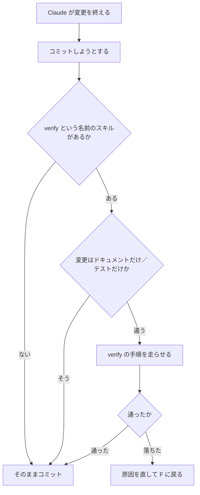
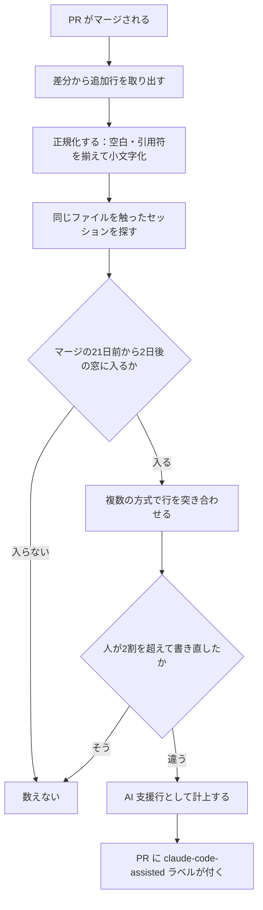
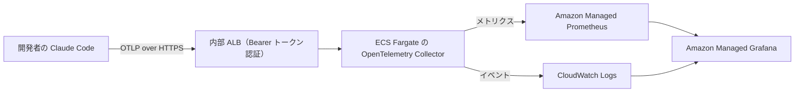

# Claude Daily — 2026-10-01（第040号）

## きょうの3行

- コミット前に必ず通したい検査は、`verify` という名前のスキルに置きます。
- ダッシュボードの数字は意図的な過小評価です。帰属の窓は21日前から2日後。
- v2.1.286 が出ました。API の再試行が1呼び出しで最大14リクエストに。

## ① ベストプラクティス — 検査に `verify` という名前を付ける

> コミット直前に走らせたい検査は `verify` という名前のスキルに置きます。
> 置き場は `.claude/skills/verify/SKILL.md` です。
> CLAUDE.md の「コミット前にビルドを通す」は助言なので飛ばされます。

検査を書く場所は4つあります。同じ内容でも、走る時点と効き方が違います。

| 置き場 | 走る時点 | 効き方 |
|---|---|---|
| CLAUDE.md の一文 | Claude が思い出したとき | 助言。ファイルが長くなると埋もれる |
| `.claude/skills/verify/SKILL.md` | コミットの直前（v2.1.286 以降） | 指示として入る。手順ごと渡せる |
| Stop フック | ターンが終わろうとするたび | 決定的。通るまでターンを終わらせない |
| `/goal` の条件 | 毎ターンのあと | 別の評価役が判定し、解決するまで続く |

v2.1.286 で、この2行目が増えました。



図1: コミット直前の分岐。ドキュメントだけ・テストだけの変更では走らない

置き場はプロジェクトかユーザーのスキルです。
リポジトリ直下に置いたものは、同梱の `/verify` を置き換えます（v2.1.200 以降）。

```markdown
---
name: verify
description: Next.js アプリをビルドして起動し、変更した画面に出ているところまで確かめる
allowed-tools: Bash
---

# このリポジトリの検証手順

**前提**: `.env.local` があること。無ければ `cp .env.example .env.local` を先に実行する。

1. 本番ビルドを通す。

       npm ci && npm run build

2. 別ポートで起動し、応答するまで待つ。

       npx next start -p 3100 &
       for i in $(seq 30); do curl -sf http://127.0.0.1:3100 >/dev/null && break; sleep 1; done

3. 変更した画面に当てて、期待する文字列が出ているか見る。

       curl -sS http://127.0.0.1:3100/dashboard > /tmp/verify.html
       grep -q '今月の利用状況' /tmp/verify.html && echo VERIFY_OK

4. 後片付けする。

       kill %1

`VERIFY_OK` が出なければ失敗として扱い、直してから 1 に戻る。
テストや型チェックの結果で代えないこと。
```

このファイルはコミットして構いません。
Claude が書き換えるのは、手順が実行を誤らせたときだけです（v2.1.205 以降）。
セッションごとの差分が出ないので、チームで共有できます。

#### ❌ 中身がテストと型チェックだけ

```markdown
---
name: verify
description: 変更を検証する
---

1. `npm test`
2. `npx tsc --noEmit`
```

これは緑でもアプリが起動しない変更を通します。
Next.js ではサーバーコンポーネントでのクライアント API 呼び出し、環境変数の読み落とし、ビルド時の動的インポート解決が典型です。
同梱の `/verify` も「テストや型チェックに逃げずにビルドして動かす」と定義されています。

#### ✅ ビルドして起動し、画面に当たるまで書く

```bash
npm run build
npx next start -p 3100 &
for i in $(seq 30); do curl -sf http://127.0.0.1:3100 >/dev/null && break; sleep 1; done
curl -sS http://127.0.0.1:3100/dashboard | grep -q '今月の利用状況' && echo VERIFY_OK
kill %1
```

判定が `VERIFY_OK` の1行に落ちているので、Claude が結果を読み違えません。
落ちた行と、そのとき出た出力が証拠として会話に残ります。
手順を思い出す必要がないので、記録がないときの探索も消えます。

手順の記録は自分で書かなくても構いません。
`/run-skill-generator` を1回走らせると、起動の手順を `.claude/skills/run-<name>/` に記録します。
`<name>` はプロジェクトの名前です。

- 出典: [Claude Code CHANGELOG](https://github.com/anthropics/claude-code/blob/main/CHANGELOG.md)
- 出典: [Skills — Run and verify your app](https://code.claude.com/docs/en/skills)
- 出典: [Best practices — Give Claude a way to verify its work](https://code.claude.com/docs/en/best-practices)

## ② 深掘り連載 第34回 — 効果測定：何をもって「効いている」とするか

> ダッシュボードの数字は、意図的に低く出る設計です。
> 帰属の窓は、PR マージの21日前から2日後まで。
> 2割を超えて人が書き直した行は、Claude の分に数えません。

計測の入口は2つです。プランで置き場が違います。

| プラン | 開く場所 | 出るもの |
|---|---|---|
| Team / Enterprise | `claude.ai/analytics/claude-code` | 使用状況、貢献の指標、Leaderboard、CSV 出力 |
| API（Console） | `platform.claude.com/claude-code` | 使用状況、支出、ユーザー別の内訳 |

貢献の指標は GitHub 連携が要ります。設定は Owner、GitHub App の導入は GitHub の管理者です。



図2: 帰属の流れ。一致しなかった行は黙って落ちる

指標の定義は、名前から受ける印象とずれています。

| 指標 | 何を数えるか |
|---|---|
| PRs with CC | Claude Code で書かれた行を1行以上含む、マージ済み PR の数 |
| Lines of code with CC | その行数。正規化後4文字を超える「実効行」だけで、空行と括弧だけの行は除く |
| PRs with Claude Code (%) | マージ済み PR 全体に対する割合 |
| Suggestion accept rate | Edit・Write・NotebookEdit の提案を受け入れた割合 |
| Lines of code accepted | セッション内で受け入れた行数。そのあとの削除は追わない |
| PRs per user | その日のマージ PR 数 ÷ その日のアクティブユーザー数 |

落ちるものも決まっています。ここを知らないと、低い数字を導入の失敗と読んでしまいます。

| 落ちるもの | 中身 |
|---|---|
| 自動生成ファイル | ロックファイル、Protobuf 出力、ビルド成果物、minify 済みファイル |
| ディレクトリ | `dist/` `build/` `node_modules/` `target/` |
| テスト用の固定データ | スナップショット、カセット、モックデータ |
| 長い行 | 1,000文字を超える行 |
| 書き直された行 | 人が2割を超えて直した行 |
| 窓の外のセッション | マージの21日より前、2日より後 |

公式ドキュメントは、この数字を「実際の影響の過小評価」と明言しています。
確度が高い行と PR だけを数える設計だからです。
だから経営に出すときは、下限として出すのが正しい使い方です。

このダッシュボードで答えられる問いは限られています。

| 問い | 答えられるか |
|---|---|
| 導入が広がっているか | 答えられる。日次アクティブユーザーとセッション数を見る |
| 誰に聞けば型が学べるか | 答えられる。Leaderboard の上位が候補 |
| 個人の評価に使えるか | 使わない。過小評価で、正規化の癖も乗る |
| 品質が上がったか | 答えられない。DORA の指標やバグ件数と並べる |
| 1人あたりいくら使ったか | 答えられない。OTEL か spend report に回す |
| 停滞の原因は何か | 答えられない。落ち込みの検知までが役目 |
| Zero Data Retention の組織で使えるか | 使えない。使用状況の指標だけが出る |

ユーザー別のトークン数と金額は、OTEL で自分の観測基盤に出します。

```json
{
  "env": {
    "CLAUDE_CODE_ENABLE_TELEMETRY": "1",
    "OTEL_METRICS_EXPORTER": "otlp",
    "OTEL_LOGS_EXPORTER": "otlp",
    "OTEL_EXPORTER_OTLP_PROTOCOL": "grpc",
    "OTEL_EXPORTER_OTLP_ENDPOINT": "http://collector.example.com:4317"
  }
}
```

これは管理設定に置きます。プロジェクト設定の `OTEL_*` は無視されます（2026-09-25 の号）。
チーム別に割るときは `OTEL_RESOURCE_ATTRIBUTES` に属性を足します。

```bash
export OTEL_RESOURCE_ATTRIBUTES="department=engineering,team_id=platform,cost_center=eng-123"
```

空白は使えません。空白が必要なら `_` か camelCase にするか、`%20` で符号化します。

プログラムから取るときは、プランで別の API になります。

| プラン | 使う API | 鍵 |
|---|---|---|
| Enterprise | Claude Enterprise Analytics API | Primary Owner が `read:analytics` スコープで発行。Teams では使えない |
| API（Console） | Claude Code Analytics API | Admin API キー |

GitHub 側から数えるなら、`claude-code-assisted` ラベルで PR を検索する方法もあります。

- 出典: [Track team usage with analytics](https://code.claude.com/docs/en/analytics)
- 出典: [Monitoring — OpenTelemetry](https://code.claude.com/docs/en/monitoring-usage)

## ③ すぐ効くTIPS

### 1 フックの棚卸しが1画面で終わる

効かないフックの多くは、そもそも登録されていません。
v2.1.286 から、設定済みのフックがイベント別の1つのリストで開きます。

```text
/hooks
```

中身を見るのが Enter 1回で済むので、イベントの付け間違いがすぐ見つかります。

### 2 検査用の1発実行から余計な文脈を外す

```bash
claude --bare -p "src/app 以下で 'use client' が無いのに useState を使うファイルを列挙して"
```

`--bare` は、コマンドラインで挙げた MCP サーバーだけに繋ぎます。
system reminder を送らず、バックグラウンドタスクも立てません（v2.1.286 の変更）。
判定だけ返させる実行では、載る文脈が少ないほど答えがぶれません。

### 3 どの資格情報で課金されているか確かめる

```bash
claude auth status
```

v2.1.286 から、Console でサインインして保存した API キーを `api_key` と報告します。
以前は `claude.ai` と出ていました。課金先を見間違えると、②の数字も合いません。

- 出典: [Claude Code CHANGELOG](https://github.com/anthropics/claude-code/blob/main/CHANGELOG.md)

## ④ 事例

### 1 Anthropic 自身が出している数字

| 値 | 何の数字か |
|---|---|
| 67%増 | エンジニア1人あたり・1日あたりのマージ済み PR 数（社内、採用が進んだ後） |
| 70〜90% | Claude Code の支援で書かれているコードの割合（社内のチーム） |
| 2026-01-29 | contribution metrics の発表日 |

同じ記事が、帰属を控えめに計算すると書いています。
確度の高い行だけを数えるので、下限として読む数字です。
自社の数字を並べるときも、母数と期間を添えないと比較になりません。

- 出典: [Measure Claude Code's impact with contribution metrics](https://claude.com/blog/contribution-metrics)

### 2 計測基盤を自分で建てたチームの内訳

SRE ホールディングスの記事です。AWS に載せた構成の報告があります。

| 値 | 何の数字か |
|---|---|
| 月 約85ドル | 内部 ALB 約20／Fargate 約35／AMP 約10／CloudWatch Logs 約20 |
| 9ドル / 5ドル | Grafana の editor / viewer の1人あたり月額 |
| 11枚 | ダッシュボードのパネル数 |
| 7個 | Terraform モジュールの数 |



図3: 報告された構成。社外に出さないために内部 ALB と VPN で閉じている

editor は1〜2人に絞り、チームリーダーは viewer にする運用を勧めています。

詰まりどころも書かれています。
ADOT Collector に `bearertokenauth` が無く、OpenTelemetry Collector Contrib v0.121.0 に差し替えたという報告です。
テレメトリの値は数値ではなく文字列で来るので、クエリを書く前に実データで形を確かめること、とあります。

- 出典: [Claude Codeの利用状況をAWS上のGrafanaで可視化する（Zenn / tkoiso、SRE ホールディングス、2026-05-07、二次情報）](https://zenn.dev/sre_holdings/articles/50663e16cfb36d)

## ⑤ 速報 — 新機能・変更点

| いつ | 何が | どう効くか |
|---|---|---|
| v2.1.286 | 権限プロンプトに「2 of 5」の件数表示 | 承認待ちが積んでいるとき、残りが何件か分かる |
| v2.1.286 | API の再試行の数え方を変更 | 1回のモデル呼び出し全体で1つの上限になり、既定では最大14リクエスト |
| v2.1.286 | モデルを拒否されたときに1回だけ再試行 | 既定やエイリアスの解決先が拒まれても、同じ段の1つ前のモデルで再試行する |
| v2.1.286 | フォールバックの通知に文脈長を明記 | 1M から 200K に落ちたことが通知に出る |
| v2.1.286 | `--bare` の範囲を縮小 | 挙げた MCP サーバーだけに繋ぎ、system reminder とバックグラウンドタスクを送らない |
| v2.1.286 | プラグインの npm ソースを制限 | git リポジトリとフォルダを拒否し、依存はレジストリのパッケージからだけ入れる |
| v2.1.286 | `/hooks` が1つのリストに | イベント別にまとまり、中身を見るのが Enter 1回で済む |
| 2026-09-30 | Claude Sonnet 4.5 の提供終了予告 | `claude-sonnet-4-5-20250929` は 2026-11-30 に Claude API から退役。Sonnet 5.5 への移行が案内されている |

`anthropic.com/news` は 9/28 の Sonnet 5.5 から更新されていません。第039号から新規はありません。

- 出典: [Claude Code CHANGELOG](https://github.com/anthropics/claude-code/blob/main/CHANGELOG.md)
- 出典: [Claude Platform リリースノート](https://platform.claude.com/docs/en/release-notes/overview)

## ⑥ コマンド早見

| コマンド | 何をするか |
|---|---|
| `/verify` | ビルドして起動し、変更が動くところまで確かめる |
| `/run-skill-generator` | 起動と検証の手順を `.claude/skills/run-<name>/` に記録する |
| `/hooks` | 設定済みのフックをイベント別の1リストで見る |
| `/status` | 認証とプロファイルの現在値を見る |
| `claude auth status` | いまどの資格情報で動いているかを出す |
| `claude --bare -p "<prompt>"` | 余計な文脈を載せずに1発だけ実行する |
| `npm run build` | Next.js の本番ビルドを通す |
| `npx next start -p 3100` | ビルド済みの Next.js を別ポートで起動する |

## ⑦ きょうの課題

`verify` という名前のスキルが、本当にコミットの直前に走るかを10分で確かめます。

**前提**: Claude Code v2.1.286 以降。Next.js のリポジトリ直下で作業します。

**手順**

1. `.claude/skills/verify/SKILL.md` を作り、模範解答の中身を貼る。
2. `app/page.tsx` の見出しの文字を1つ変える。
3. `/verify` と打ち、手順どおりに走るか見る。
4. 「変更をコミットして」と頼み、コミットの前に検証が走るか見る。
5. `grep` の文字列を存在しないものに変えて、失敗として扱われるか見る。

**確認方法**: 3 で `VERIFY_OK` が出ること。4 で `npm run build` がコミットより先に走ること。5 で Claude がコミットを止めること。

── 模範解答 ──

```markdown
---
name: verify
description: Next.js をビルドして起動し、変更した画面に文字が出ているところまで確かめる
allowed-tools: Bash
---

1. `npm run build` を通す。
2. `npx next start -p 3100 &` で起動する。
3. `for i in $(seq 30); do curl -sf http://127.0.0.1:3100 >/dev/null && break; sleep 1; done` で待つ。
4. `curl -sS http://127.0.0.1:3100 | grep -q 'ダッシュボード' && echo VERIFY_OK` で確かめる。
5. `kill %1` で止める。

`VERIFY_OK` が出なければ失敗。テストや型チェックの結果で代えないこと。
```

**なぜそうなるのか**

v2.1.286 から、プロジェクトかユーザーのスキルに `verify` という名前のものがあると、コミットの直前にそれを走らせるよう指示が入ります。
ドキュメントだけの変更と、テストだけの変更では走りません。
リポジトリ直下に置いたものは、同梱の `/verify` を置き換えます。

**よくある詰まりどころ**

| 症状 | 原因 |
|---|---|
| 走らない | ディレクトリ名が `verify` でない。`name` の既定値はディレクトリ名なので、名前も揃える |
| 走らない | `README.md` だけ直して試している。ドキュメントだけの変更は対象外 |
| 止まったまま進まない | 2 の起動に `&` を付けていない。前景で起動すると次の手順に進めない |
| ポートが埋まる | 3100 を掴んだプロセスが残っている。`kill %1` を手順から落とさない |

（あすの予告）あすは第35回「レビュー文化との折り合い（AI生成コードの扱い）」です。
