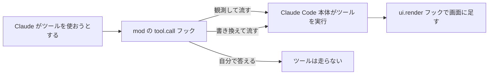
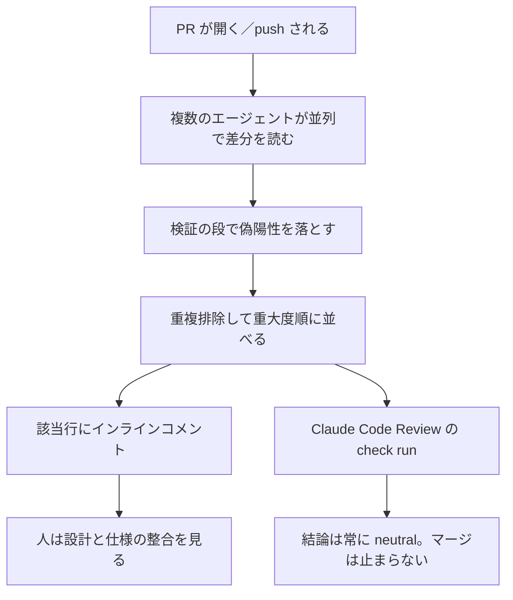
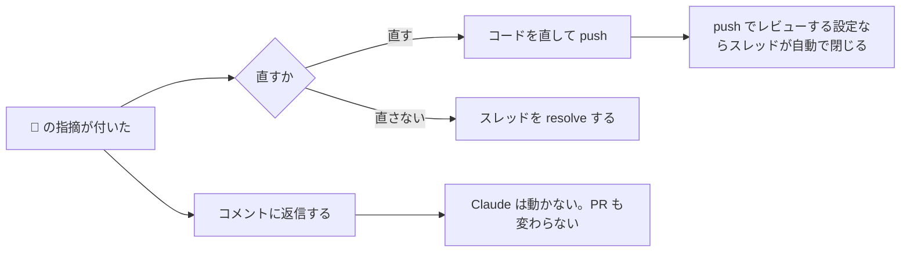

# Claude Daily — 2026-10-02（第041号）

## きょうの3行

- Mods が来ました。プラグインが Claude Code の中で動き、画面まで描きます。
- Code Review の調整は `REVIEW.md` です。ローカルの `/code-review` は読みません。
- v2.1.287 公開。Bedrock と Vertex の Opus 4.7 以降が既定で1M文脈になりました。

## ① ベストプラクティス — 横から見る役を常駐させる

> 「毎回これを見て」は助言なので飛ばされます。
> mod は Claude Code の中で動き、画面に描けます。
> 組み込みの見張り役は1行で有効にできます。

公式のベストプラクティスは「作った本人に採点させるな」と書いています。
別の目を置く手は3つあり、v2.1.287 で3つめが増えました。

| 置き場 | 走る場所 | 画面に出せるか |
|---|---|---|
| CLAUDE.md の一文 | Claude の文脈の中（助言） | 出せない |
| settings hook | 外部プロセス（スクリプト） | 出せない |
| mod | Claude Code の中（関数） | 出せる |

まず試すなら、組み込みの見張り役を有効にするのが早いです。
長めの作業の横で副エージェントが走り、見落としそうなことをプロンプトの上に出します。
既定では無効で、有効化はセッション内の1行だけです。

```text
/plugin enable cc-plugin-you-should-know@builtin
```

### 仕組み

mod は JavaScript か TypeScript の関数の束です。
Claude Code がイベントのたびに呼び、関数は3つのうち1つを選びます。



図1: mod はイベントの通り道に入る。`next` を呼べば通常どおり進む

### そのまま動く最小の mod

変更したファイルの数をスピナーの横に出します。ファイルは3つです。

```json
{
  "name": "watch-mod",
  "version": "0.1.0",
  "description": "Claude が変更したファイルの数をスピナーの横に出す",
  "author": { "name": "Your Name" }
}
```

上を `watch-mod/.claude-plugin/plugin.json` に保存します。
次の `modules` が「このプラグインは mod だ」という印です。

```json
{
  "description": "watch-mod hooks module",
  "modules": ["./register.js"]
}
```

上を `watch-mod/hooks/hooks.json` に、下を `watch-mod/hooks/register.js` に保存します。

```javascript
// 変更したファイルのパス。2つのフックで共有する
const touched = new Set()

// mod を読み込んだとき、Claude Code が1度だけ呼ぶ
export function register(on) {
  // Claude がツールを使う直前に毎回走る
  on('tool.call', async ($, e, next) => {
    const writes = e.tool === 'Edit' || e.tool === 'Write' || e.tool === 'NotebookEdit'
    if (writes && e.file_path) {
      touched.add(e.file_path)
      // 画面を描き直させて、新しい数を見せる
      $.ui.invalidate('ui.render')
    }
    // ツールはそのまま走らせる
    return next(e)
  })

  // Claude Code がスピナーを描くたびに走る
  on('ui.render', { component: 'Spinner' }, async ($, e, next) => {
    const mark = touched.size ? ' · 変更 ' + touched.size + ' ファイル' : ''
    return next({ ...e, props: { ...e.props, suffix: mark } })
  })
}
```

ツール入力のフィールド名は、読み込み時に mod の中へ書かれる型定義で確かめます。
置き場は `.claude-plugin/types/claude-code-tools/index.d.ts` です。

```bash
claude plugin validate ./watch-mod   # 読み取られるフックと API 呼び出しを出す
claude --plugin-dir ./watch-mod      # インストールせず1セッションだけ読み込む
```

`validate` の出力に次の2行が出れば、Claude Code は意図どおり読めています。

```text
  ❯ ./register.js hooks: tool.call, ui.render{component=Spinner}
  ❯ ./register.js calls: $.ui.invalidate
```

### アンチパターン

#### ❌ CLAUDE.md に「触ったファイルを毎回報告して」と書く

CLAUDE.md は助言です。ファイルが長くなると、この1行は他の指示に埋もれます。
報告が来たかどうかも目で追う必要があり、来なかったことには気づけません。

#### ✅ mod にして画面に出す

mod は関数なので、イベントが起きれば必ず走ります。
数がスピナーの横に出ているので、報告を待たずに視界に入ります。

#### ❌ 知らないマーケットプレイスの mod をそのまま入れる

mod はあなたの権限で、Claude Code の中で動きます。届く範囲は次のとおりです。

- ファイルの読み書き・プロセスの起動・ネットワークへの接続
- 環境変数と設定ファイル。そこに置いた API キーも読める
- 送ったプロンプトと、Claude のツール呼び出しのすべて
- ツール呼び出しの承認。`ask` ルールが聞くはずのものを黙って通せる

#### ✅ 入れる前に `claude plugin validate` で中身を読む

`hooks:` 行と `calls:` 行が、扱うイベントと呼ぶ API を列挙します。
コードを走らせずに出るので、信頼の判断材料になります。

出典: [Mods overview](https://code.claude.com/docs/en/plugins/mods/overview)
出典: [Create a mod](https://code.claude.com/docs/en/plugins/mods/create)
出典: [Best practices for Claude Code](https://code.claude.com/docs/en/best-practices)

## ② 深掘り連載 第35回 — レビュー文化との折り合い（AI生成コードの扱い）

> Code Review は approve も block もしません。
> 調整は `REVIEW.md`。ローカルの `/code-review` は読みません。
> マージを止めたいなら、自分の CI で重大度を読みます。

量が増えると、人が全行読む前提が先に壊れます。
Anthropic の managed な Code Review は、その穴を「人を置き換えない形」で埋めます。



図2: レビューの流れ。止める判断は人と自分の CI に残る

### 重大度は3段

| 印 | 重大度 | 意味 |
|---|---|---|
| 🔴 | Important | マージ前に直すべきバグ |
| 🟡 | Nit | 直す価値はあるが、止めるほどではない |
| 🟣 | Pre-existing | もとからあるバグ。この PR が入れたものではない |

各コメントには 👍 と 👎 が最初から付いています。
反応はマージ後に集計され、レビューの調整に使われます。
反応では再レビューも PR の変更も起きません。

### 調整する2つのファイル

| ファイル | 届く先 | 効き方 |
|---|---|---|
| `CLAUDE.md` | 全セッション共通の文脈 | 新しく入った違反を Nit として出す |
| `REVIEW.md` | 発見・検証・採点の各エージェント | レビュー専用の指示として直接届く |

`CLAUDE.md` は双方向です。PR が記述を古くしたときは「docs も直せ」と出ます。
`REVIEW.md` はリポジトリ直下に置く自由形式の Markdown です。

| `REVIEW.md` に書くこと | 変わること |
|---|---|
| Important の定義 | 既定の本番向け基準を、自分のリポジトリの基準に置き換える |
| Nit の上限 | 「5件まで、残りは件数だけ」でコメントが読める量に収まる |
| 指摘しない対象 | 生成物・lockfile・CI が既に見ているものを黙らせる |
| 毎回見る項目 | 長い `CLAUDE.md` に書くより確実に届く |
| 検証のバー | 「`file:line` を引用しないなら出すな」で偽陽性を削る |
| 再レビューの収束 | 「2回目以降は Important だけ」で指摘が7周しない |

```markdown
# Review instructions

## Important の基準

Important は、挙動が壊れる・データが漏れる・ロールバックできなくなる指摘だけに使う。
命名・整形・リファクタの提案は Nit までとする。

## Nit の上限

1回のレビューで Nit は5件まで。超えた分はサマリーに「ほか N 件」と書く。
Nit だけだったときは、サマリーの先頭に「ブロッキングな指摘なし」と書く。

## 指摘しない

- lint・整形・型エラー。CI が見ている
- `*.lock` と `src/gen/` 以下の生成物
- 本番の規約をわざと破っているテスト専用コード

## 毎回見る

- 新しい API ルートに結合テストがある
- ログにメールアドレス・ユーザーID・リクエストボディが出ていない
- 2回目以降のレビューでは Nit を出さず、Important だけを出す
```

上を `REVIEW.md` としてリポジトリ直下に置きます。
長くすると大事なルールが薄まるので、一般的な前提は `CLAUDE.md` に残します。

### 指摘への返し方



図3: 返信は合図にならない。動かすのは push と resolve だけ

### 使うべき時／使うべきでない時

| 場面 | どうするか |
|---|---|
| PR が1日に何本も出て人が追えない | After every push にし、`REVIEW.md` で Nit を上限つきにする |
| 高トラフィックで費用が気になる | Manual にし、`@claude review` で入れる PR を選ぶ |
| 🔴 が残る PR をマージさせたくない | check run の重大度カウントを自分の CI で読む |
| Zero Data Retention の組織 | managed な Code Review は使えない。ローカルの `/code-review` にする |
| docs やプロトタイプのリポジトリ | `REVIEW.md` で Important の範囲を絞る |

check run の最後の行に、機械が読める重大度の内訳が入っています。

```bash
gh api repos/OWNER/REPO/check-runs/CHECK_RUN_ID \
  --jq '.output.text | split("bughunter-severity: ")[1] | split(" -->")[0] | fromjson'
```

`{"normal": 2, "nit": 1, "pre_existing": 0}` のように返り、`normal` が 🔴 の件数です。
`CHECK_RUN_ID` は `Claude Code Review` の check run の id を指します。

| 用語 | 意味 |
|---|---|
| managed な Code Review | Anthropic 側で走る GitHub App。Team と Enterprise の research preview |
| `/code-review` | 手元のセッションで差分を見るコマンド。`REVIEW.md` は読まない |

料金は1回あたり 15〜25 ドル、平均20分です。push ごとに走らせると回数分かかります。

出典: [Code Review](https://code.claude.com/docs/en/code-review)

## ③ すぐ効くTIPS

### 1. MCP サーバーのツールを丸ごとツール検索の後ろへ回す

v2.1.287 から、`alwaysLoad: false` はそのサーバーの**すべての**ツールを遅延させます。
使う回数が少ないサーバーを1行で文脈から外せます。

```json
{
  "mcpServers": {
    "notion": {
      "type": "http",
      "url": "https://mcp.notion.com/mcp",
      "alwaysLoad": false
    }
  }
}
```

### 2. 既定が1M文脈になった環境を200Kに戻す

v2.1.287 から、Opus 4.7 以降と Fable の既定が1M文脈になりました。
対象は Bedrock・Vertex・Foundry・Claude アプリのゲートウェイで、`[1m]` の接尾辞は要りません。
長い文脈はその分だけ課金されるので、戻したいなら環境変数で止めます。

```json
{
  "env": { "CLAUDE_CODE_DISABLE_1M_CONTEXT": "1" }
}
```

### 3. テレメトリの `prompt_text` を `prompt` と同じ扱いにする

v2.1.287 で、OpenTelemetry の `user_prompt` イベントに `prompt_text` が増えました。
`prompt` の写しなので、落としているバックエンドでは同じ指定を足さないと素通りします。

```text
prompt を落としている／マスクしている設定に prompt_text も並べる
```

## ④ 事例

### Barclays が Claude Code を開発者の半数へ（一次情報）

Barclays が Claude の社内展開を広げたと発表しました。
対象は開発・レガシー刷新・業務効率で、Claude Code は段階的に広げる計画です。

| 値 | 何の数字か |
|---|---|
| 16,000人超 | 社内の Knowledge Assistant を使う従業員 |
| 100万件超 | その Knowledge Assistant が処理した検索 |
| 約12万通／日 | Global Markets のメール分類基盤が処理する通数 |
| 50% | 2026年末に Claude Code が届く見込みの開発者の割合 |
| 過半 | 2027年に Claude Code を使う見込みのソフトウェアエンジニア |

出典: [Barclays scales Claude to upgrade operations and improve client experience](https://www.anthropic.com/news/barclays-scales-claude)

### レビュー指摘を毎週ルールへ還した報告（二次情報）

ZOZO が、同じ指摘を繰り返す問題への対処を公開しています（2026-04-23）。
直近7日の PR から指摘を集め、`.claude/rules/` に足りないものがあれば PR を出す仕組みです。
生成されたルールの PR は人が読む前提だと書かれており、効果の数値はありません。

| 段 | やっていること |
|---|---|
| 収集 | PR ごとにサブエージェントを立て、`gh pr view --json reviewThreads` で並列に集める |
| 突き合わせ | 現在の `.claude/rules/` の Markdown と読み比べ、抜けを探す |
| 提案 | 抜けがあるときだけルール更新の PR を作り、元コメントの URL を添える |

出典: [Claude Codeのルールを育て続ける——Routinesでレビュー指摘を.claude/rulesに自動反映する](https://zenn.dev/zozotech/articles/20260423_pr_review_claude_rules)

## ⑤ 速報 — 新機能・変更点

v2.1.287 が出ました。Platform リリースノートは 9/30 が最新で、前号で既報です。

| いつ | 何が | どう効くか |
|---|---|---|
| v2.1.287 | Claude Mods | プラグインが Claude Code の中で動き、画面も描ける（①） |
| v2.1.287 | `cc-plugin-you-should-know` | 見張り役の副エージェント。既定は無効で、`/plugin enable` で入れる |
| v2.1.287 | MCP の URL プロンプト | 更新後に繋がらないサーバーには `"bareElicitationCapability": true` を足す |
| v2.1.287 | `alwaysLoad: false` の範囲拡大 | そのサーバーのツールが丸ごとツール検索の後ろへ回る（③1） |
| v2.1.287 | 1M文脈が既定に | Bedrock・Vertex・Foundry・アプリのゲートウェイの Opus 4.7 以降と Fable（③2） |
| v2.1.287 | OTel の `prompt_text` | `prompt` の写し。マスクの指定を足さないと素通りする（③3） |
| v2.1.287 | `claude agents` の `n:` フィルタ | セッション名とタスクで絞り、Enter で先頭を開く |
| v2.1.287 | Windows の起動警告 | Bash を deny すると PowerShell も止まり、シェルが無くなると警告が出る |

出典: [Claude Code CHANGELOG](https://github.com/anthropics/claude-code/blob/main/CHANGELOG.md)

## ⑥ コマンド早見

| コマンド | 何をするか |
|---|---|
| `/plugin` | 入っているプラグインと mod を見る。有効・無効も切り替える |
| `/plugin enable cc-plugin-you-should-know@builtin` | 組み込みの見張り役を有効にする |
| `/reload-plugins` | シェルで入れた mod を、開いているセッションに読み込む |
| `claude --plugin-dir ./watch-mod` | インストールせず、そのディレクトリの mod を1セッションだけ読み込む |
| `claude plugin validate ./watch-mod` | 扱うイベントと呼ぶ API を、走らせずに列挙する |
| `claude plugin test` | mod の自動テストを走らせる。セッションもサインインも要らない |
| `claude --version` | mod が動く v2.1.287 以降かを確かめる |
| `claude -p "/touched" --plugin-dir ./watch-mod` | 対話セッションを開かずにコマンドの出力だけ見る |
| `/code-review` | 手元の差分をレビューする。`REVIEW.md` は読まない |
| `@claude review` | PR のコメントとして書き、managed なレビューを1回走らせる |

## ⑦ きょうの課題

所要10分。①の `watch-mod` に `/touched` コマンドを足し、触ったファイル名を並べます。

**前提**: `claude --version` が v2.1.287 以降であること。①の3ファイルを作り終えていること。

**手順**

1. `register.js` に `session.start` のフックを足し、`$.command.register` で `touched` という名のコマンドを登録する。
2. `command.run` のフックを足し、マッチャでそのコマンドだけに絞る。集めたパスを改行で繋いで返す。
3. `claude plugin validate ./watch-mod` を走らせ、`hooks:` 行に4つ、`calls:` 行に2つ出るか見る。
4. `claude -p "/touched" --plugin-dir ./watch-mod` で出力を見る。
5. `claude --plugin-dir ./watch-mod` で開き、Next.js のページを1つ直させてから `/touched` を打つ。

**確認方法**: `validate` が `command.run{command=touched}` を出し、手順5でファイル名が並べば成功です。

── 模範解答 ──

`register` の中に、次の2つのフックを足します。

```javascript
  // セッションが始まるとき、最初のプロンプトの前に走る
  on('session.start', async ($, e, next) => {
    await $.command.register({
      name: 'touched',
      description: '変更したファイルを並べる',
    })
    return next(e)
  })

  // /touched を打ったときだけ走る
  on('command.run', { command: 'touched' }, async () => {
    const list = [...touched]
    return { text: list.length ? list.join('\n') : 'まだ変更はありません' }
  })
```

`session.start` はコマンドを登録する場所です。
`command.run` は `next` を呼ばず、自分で答えて終わります。
マッチャの `{ command: 'touched' }` がないと、他のコマンドまで奪います。

**よくある詰まりどころ**

| 症状 | 原因 |
|---|---|
| `"tool.calls" is not an event` で落ちる | イベント名の綴り違い。文字列リテラルで正確に書く |
| `$.ui is used as a value` で落ちる | `const ui = $.ui` のような分割代入。毎回 `$` から書く |
| `/touched` が候補に出ない | `--plugin-dir` を付け忘れている。または `modules` のパスが違う |
| 数が0に戻る | ファイルを保存するとホットリロードが走り、`register` がやり直される |
| `claude -p` で 0 件になる | 正しい挙動。その run ではまだ編集が起きていない |

あすは「第36回 社内ナレッジを Skills / プラグインに落とす」を扱います。
