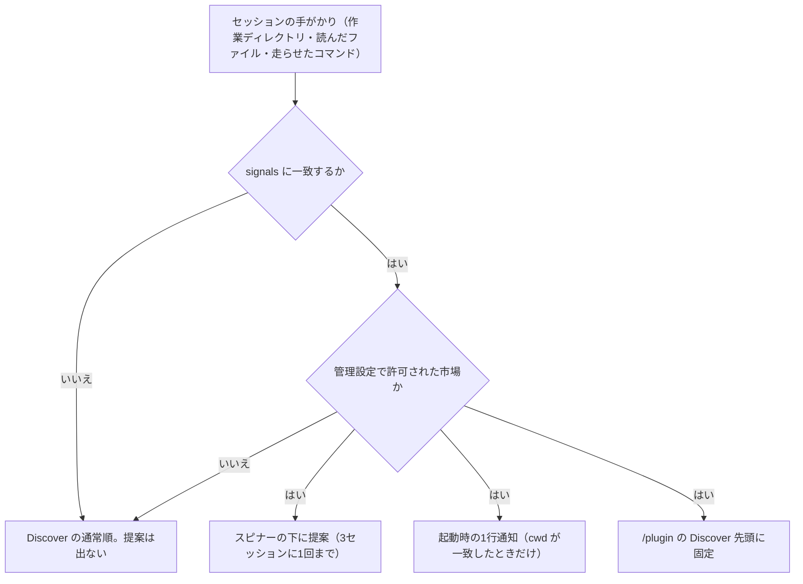
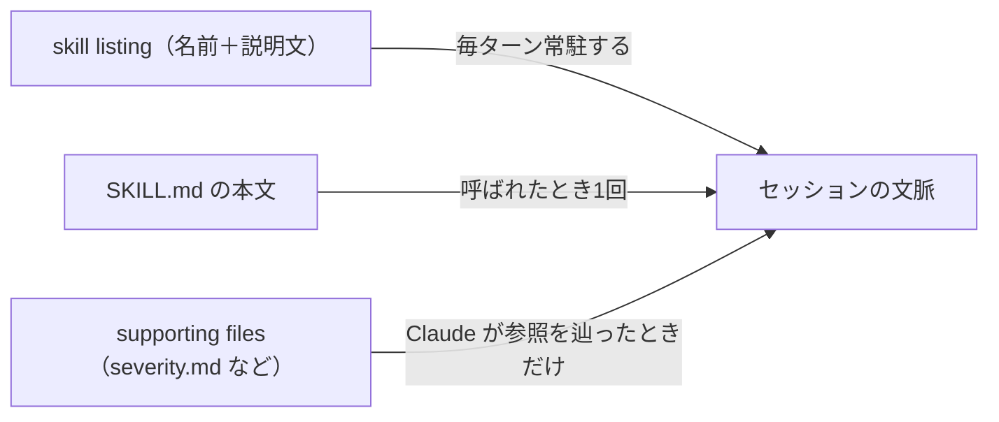
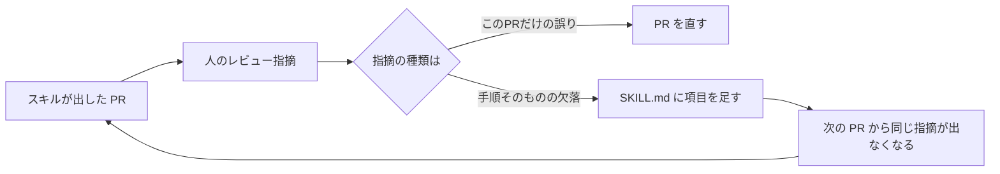

# Claude Daily — 2026-10-03（第042号）

## きょうの3行

- 社内プラグインは `relevance` で、合う作業をしている人の画面に自分から名乗れます。
- 連載36回。ナレッジは常駐する分と呼ばれて載る分に分かれます。測ってから配ります。
- v2.1.288 が出ました。`/code-review --max-findings` と、編集時にも rules が読まれる修正。

## ① ベストプラクティス — 配った道具に名乗らせる（marketplace の `relevance`）

> 社内プラグインは、合う作業をしている人に自分から名乗れます。
> 一致の判定は手元だけで走り、Anthropic にも市場の運営者にも送られません。
> 出るのは管理設定で許可した市場の分だけです。

社内プラグインが使われない理由は、質ではなく存在を知られていないことです。
`marketplace.json` に `relevance` を書くと、合う手がかりを持つセッションに提案が出ます。



図1: `relevance` の判定と、提案が出る3か所

市場の側に書くのは次の1ファイルです。`.claude-plugin/marketplace.json` に置きます。

```json
{
  "name": "acme-internal",
  "owner": { "name": "Acme Web Platform" },
  "plugins": [
    {
      "name": "nextjs-conventions",
      "source": "./plugins/nextjs-conventions",
      "description": "Acme の Next.js 規約とレビュー観点",
      "relevance": {
        "topic": "Next.js",
        "signals": {
          "cwd": ["apps/web"],
          "filesRead": ["**/app/**/page.tsx", "**/next.config.*"],
          "manifestDeps": [
            { "file": "[/\\\\]package\\.json$", "pattern": "\"next\"\\s*:" }
          ]
        }
      }
    }
  ]
}
```

書いただけでは出ません。管理者が `managed-settings.json` でその市場を許可します。

```json
{
  "extraKnownMarketplaces": {
    "acme-internal": {
      "source": { "source": "github", "repo": "acme/claude-marketplace" }
    }
  },
  "pluginSuggestionMarketplaces": ["acme-internal"]
}
```

| フィールド | 照合先 | 上限 |
|---|---|---|
| `cwd` | 作業ディレクトリ。絶対パスとリポジトリ相対の両方に当たる。起動時に効く唯一の手がかり | 10件・各256字 |
| `cli` | Claude が走らせたコマンド名。完全一致 | 10件・各64字 |
| `hosts` | Bash のコマンドに出た URL のホスト名。裸の小文字だけ | 20件・各128字 |
| `filesRead` | 読んだ・書いた・編集したファイルのパス。自動で載る `CLAUDE.md` も含む | 10件・各256字 |
| `manifestDeps` | 読んだ依存マニフェストの中身。`file` と `pattern` はどちらも正規表現 | 10件・各256字 |

#### ❌ `cli` でコマンド名を待つ

```json
{ "signals": { "cli": ["prisma"] } }
```

- `cd apps/web && npx prisma migrate dev` が記録するのは `cd` だけです。
- 記録されるのは先頭の1語で、`&&` の後ろは数えません。だから一生一致しません。

#### ✅ 読んだものから判定する

```json
{ "signals": { "filesRead": ["**/prisma/schema.prisma"] } }
```

- スキーマを開いた時点で一致します。コマンドの書き方に左右されません。
- `hosts` に `https://` やポートを書くと、そのプラグインのエントリ全体が無効になります。無効な間は市場からインストールできません。
- 公開前に `claude plugin validate ./acme-marketplace` で検査します。

- 出典: [Recommend plugins for your org](https://code.claude.com/docs/en/plugins/relevance)
- 出典: [Best practices for Claude Code](https://code.claude.com/docs/en/best-practices)

## ② 深掘り連載 第36回 — 社内ナレッジを Skills / プラグインに落とす

> ナレッジは常駐する分と、呼ばれてから載る分に分かれます。
> 常駐するのは名前と説明文だけで、本文は呼ばれたときに載ります。
> 常駐分は `claude plugin details` でトークン数として測れます。

口伝を文書にするだけなら手間は1回で終わります。
ただし配った先では、使われない日も毎ターン分の文脈を食います。



図2: ナレッジの3層と、それぞれが文脈に載る時点

| 置くもの | 何が載るか | 載る時点 |
|---|---|---|
| frontmatter の `description` と `when_to_use` | 名前と説明文 | 毎ターン。呼ばれなくても載る |
| `SKILL.md` の本文 | 本文の全文 | Claude か人が呼んだとき |
| 同じディレクトリの別ファイル | そのファイルの中身 | 本文の参照リンクを辿ったとき |

| 数値 | 何の数字か |
|---|---|
| 500行 | `SKILL.md` の本文の目安の上限 |
| 1,536字 | `description` と `when_to_use` を合わせた listing の表示上限 |
| 2,000トークン | `/plugin` の Context cost が「毎ターン」を強調表示に切り替える境目 |
| 25,000トークン | 自動圧縮のあとスキル全体に残る枠 |
| 5,000トークン | そのうち1スキルの直近の呼び出しから残る分 |

分量のある判定基準は本文から追い出し、参照リンクにします。
AppBrew の例（④）のような調査手順なら、次の形に落ちます。

```markdown
---
name: bugsnag-triage
description: Bugsnag のエラーを調査し、原因と再現手順と修正案をまとめる
when_to_use: Bugsnag の通知が来たとき、エラーの切り分けや再現手順を頼まれたとき
allowed-tools: Bash(gh *)
---

# Bugsnag の切り分け

1. スタックトレースから該当コードを特定する
2. 既存のテストと関連コードを読む
3. 原因・再現手順・対応内容・根本対応の要否を書く
4. 修正とテストを足して PR を出す

## 参照

- 重大度の判定は [severity.md](severity.md)
- ドメイン固有の規約は [domain-rules.md](domain-rules.md)
```

置き場所は次のとおりです。`severity.md` と `domain-rules.md` は常駐しません。

```
.claude/skills/bugsnag-triage/
├── SKILL.md
├── severity.md
└── domain-rules.md
```

| 置き場所 | 使うべき時 | 使うべきでない時 |
|---|---|---|
| `CLAUDE.md` | 毎セッション必ず要る短い規約 | ときどきしか要らない手順。長くすると他の指示が埋もれます |
| `SKILL.md` の本文 | 呼ばれたら全部読ませたい手順 | 500行を超える参照資料 |
| 同じディレクトリの別ファイル | 分量のある仕様・判定基準・スクリプト | 毎回必ず読ませたい前提 |
| プラグイン | 複数リポジトリに配る。版を切って更新する | 1つのリポジトリでしか使わないもの |

常駐分を削る近道は説明文を短くすることですが、ここに罠があります。
説明文は発火の判定にも使われるため、削ると呼ばれなくなります。
短くしたら `tool_used: Skill` の grader で発火を確かめてください。

- 出典: [Skills](https://code.claude.com/docs/en/skills)
- 出典: [Measure plugin cost and usage](https://code.claude.com/docs/en/plugins/measure)

## ③ すぐ効くTIPS

### 1. プラグインの提案が邪魔なときは黙らせる

スピナーの下の提案と起動時の通知は、同じ設定で両方止まります。`/plugin` の固定表示だけは残ります。

```json
{
  "spinnerTipsEnabled": false
}
```

### 2. セッション中に作ったスキルを拾わせる

スキルのディレクトリを作った直後は、再起動せずに `/reload-skills` で読み込めます。

```text
/reload-skills
```

プラグインの `hooks/`・`.mcp.json`・`agents/`・`output-styles/` を触ったときは `/reload-plugins` です。

### 3. ゲートウェイ越しで題名や記憶が落ちるとき

構造化出力を拒むゲートウェイでは、セッション題名・記憶の呼び出し・プロンプトフックが落ちます。v2.1.288 で逃げ道が入りました。

```json
{
  "env": { "CLAUDE_CODE_DISABLE_STRUCTURED_OUTPUTS": "1" }
}
```

- 出典: [spinnerTipsEnabled](https://code.claude.com/docs/en/settings-reference)
- 出典: [Skills](https://code.claude.com/docs/en/skills)
- 出典: [CHANGELOG](https://github.com/anthropics/claude-code/blob/main/CHANGELOG.md)

## ④ 事例

### レビューの指摘を「スキルのバグ」として SKILL.md に還す

AppBrew のインターンが、Bugsnag のエラー対応をスキルにした報告があります（2026-06-29、二次情報）。
最初は手順を3行書いただけで、エラーを黙らせる浅い修正が出たとのことです。
指摘をスキルの不具合とみなし、PR に書く項目を `SKILL.md` に埋め込んだと報告されています。



図3: 指摘を「スキルのバグ」として戻すループ

| 値 | 何の数字か |
|---|---|
| 約9回 → 約2回 | 1 PR あたりの修正コミット数 |
| 18本 | 1日に出せた PR の本数 |

効かない領域も明示されています。Next.js とネイティブアプリをまたぐ問題と、深いドメイン知識が要る判断です。
タスクの振り分けは人が持つ、という結論でした。

### 1,000セッションを測ってから組織の設定を直す

グロービスが、CLI のセッションを集計して組織共通の設定に反映した報告があります（2026-05-15、二次情報）。
Stop フックでトランスクリプトを暗号化して集約し、復号鍵を持つ担当だけが分析したとのことです。

| 値 | 何の数字か |
|---|---|
| 月 約100時間 | 削減できたとする開発時間 |
| 約10% | 開発セッションのリードタイムの短縮 |
| 40% | 約1,000件の確認のうち、承認が不要だったもの |
| 146件 / 65件 | 1か月の自己訂正／ブランチ作成の催促の回数 |

直したのは、低リスクな確認を省くフック、`master` への直接コミットを止める `PreToolUse` フック、共通の `CLAUDE.md` です。
筆者自身が試験運用の段階だと書いており、続けるか絞るか外すかはデータ次第としています。

- 出典: [素朴なClaude Code Skillを、コードレビューで育ててみた話](https://zenn.dev/appbrew/articles/claude-code-skill-grow-with-review)
- 出典: [Claude Codeの1000セッションを分析して、一週間目でリードタイムを10%縮めた話](https://zenn.dev/globis/articles/94762dc8ec7914)

## ⑤ 速報 — 新機能・変更点

| いつ | 何が | どう効くか |
|---|---|---|
| v2.1.288 | `/code-review --max-findings <n>|all` | 既定の件数上限を超えて指摘を出せる。`--max-findings default` を渡すまで選択が残る |
| v2.1.288 | `paths` 付きの `.claude/rules` と入れ子の `CLAUDE.md` が、Write・Edit でも読まれるように | 以前は Read のときだけ。そのパスを新規作成・変更する流れで規約が抜けていた |
| v2.1.288 | 背景コマンドの時間上限が無人セッション限定に | ターミナル・デスクトップ・VS Code では上限なし。`-p`・SDK・CI・cloud だけ従来どおり |
| v2.1.288 | auto mode の会話が長すぎるときは圧縮する | 以前はツール呼び出しごとに確認を出すか失敗していた |
| v2.1.288 | `claude project purge` が `claude purge` に | 旧名も通り、通知が出る。消えるのは記録・タスク・ログなどローカルの状態 |
| v2.1.288 | `bash -c` の中の危険な `rm` が確認を求めるように | `bypassPermissions` やシェルの allow ルールでも素通りしなくなった |
| 2026-10-02 | Anthropic が1億ドルで技術者1万人の育成を発表 | 企業側の人材不足を埋める枠組み。社内展開の後ろ盾に使える |

- 出典: [CHANGELOG](https://github.com/anthropics/claude-code/blob/main/CHANGELOG.md)
- 出典: [Anthropic News](https://www.anthropic.com/news)

## ⑥ コマンド早見

| コマンド | 何をするか |
|---|---|
| `claude plugin validate ./acme-marketplace` | `relevance` を含む市場の定義を検査する |
| `claude plugin details nextjs-conventions` | プラグインの常駐トークンと内訳を出す |
| `/plugin install nextjs-conventions@acme-internal` | 市場からプラグインを入れる |
| `/plugin` | 入っているものと Discover を見る |
| `/skill-doctor` | 一度も呼ばれていないスキルと費用を出す |
| `/reload-skills` | セッション中に作ったスキルを読み込む |
| `/reload-plugins` | プラグインのフック・MCP・エージェントを読み直す |
| `/code-review --max-findings all` | 件数上限を外してレビューする |
| `claude purge` | プロジェクトのローカル状態を消す |

## ⑦ きょうの課題

社内マーケットプレイスに `relevance` を付け、壊れ方まで確かめます。10分で終わります。

**前提**: Claude Code v2.1.288 以降。Next.js のリポジトリは不要です。

**手順**

1. 作業用のディレクトリを作ります。

```bash
mkdir -p /tmp/acme-marketplace/.claude-plugin
mkdir -p /tmp/acme-marketplace/plugins/nextjs-conventions/skills/next-review
```

2. `①` の `marketplace.json` を `/tmp/acme-marketplace/.claude-plugin/marketplace.json` に保存します。
3. プラグイン本体の最小構成を置きます。

```bash
cat > /tmp/acme-marketplace/plugins/nextjs-conventions/.claude-plugin/plugin.json <<'EOF'
{ "name": "nextjs-conventions", "version": "0.1.0" }
EOF
```

4. 検査します。`Validation passed` が出れば成功です。

```bash
claude plugin validate /tmp/acme-marketplace
```

5. `hosts` をわざと壊して、もう一度検査します。

**確認方法**: 4で `Validation passed`、5で `hosts` を指すエラーが出ること。

── 模範解答 ──

3の `plugin.json` は `.claude-plugin/` の中に置きます。手順の `mkdir` では作られないので、1行足します。

```bash
mkdir -p /tmp/acme-marketplace/plugins/nextjs-conventions/.claude-plugin
```

5で壊すのは `signals` の中の1行です。スキームを付けると、裸のホスト名という条件から外れます。

```json
{ "signals": { "hosts": ["https://registry.npmjs.org:443/"] } }
```

| 詰まりどころ | なぜそうなるのか |
|---|---|
| `Validation passed with warnings` で終わる | `relevance` の下に綴り違いのキーがある。未知のキーは警告で、無効にはならない |
| 検査は通るのにインストールできない | 上限超えは警告ではなく無効。そのプラグインのエントリ全体が落ちる |
| 提案が1つも出ない | `pluginSuggestionMarketplaces` に名前が無いか、許可した名前と別の出所から登録されている |
| `cwd` 以外が起動時に効かない | `cwd` だけが最初のメッセージより前に判定される。ほかは履歴がたまってから |

あすは連載第37回「非エンジニア業務への展開」です。
