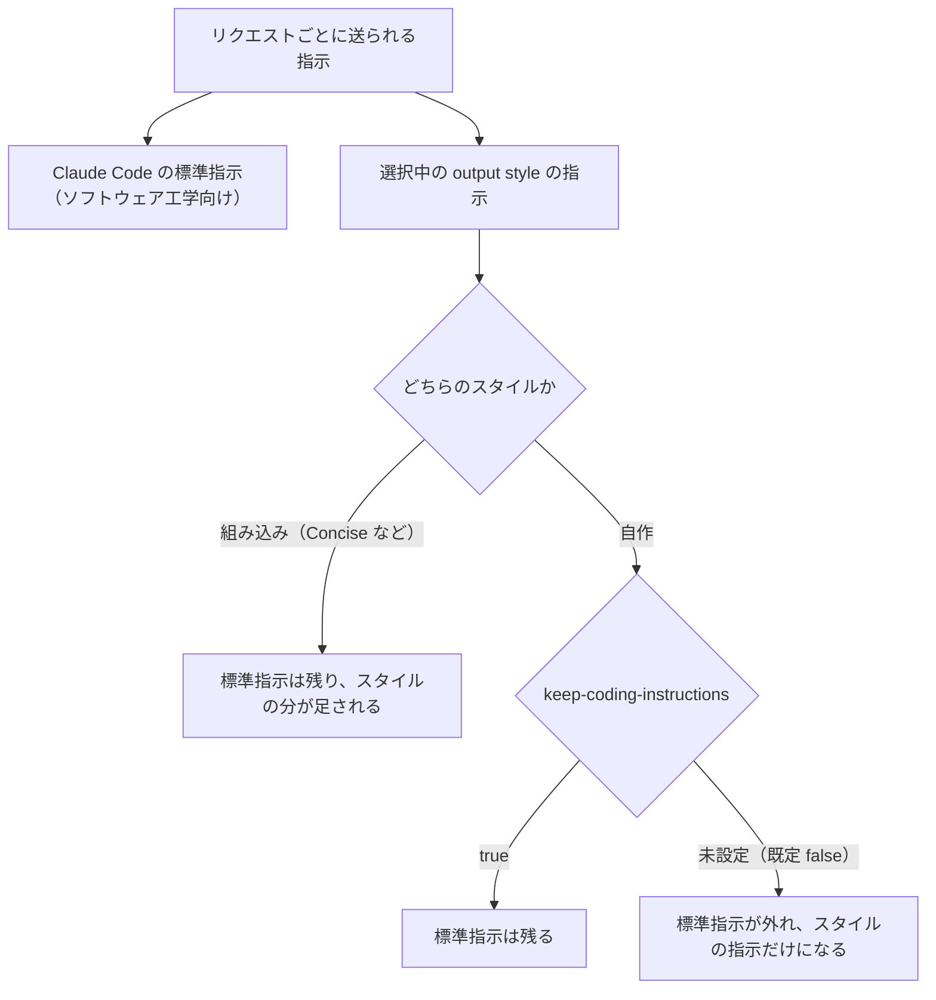
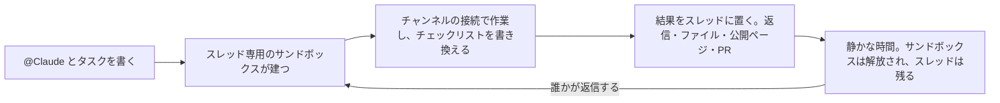
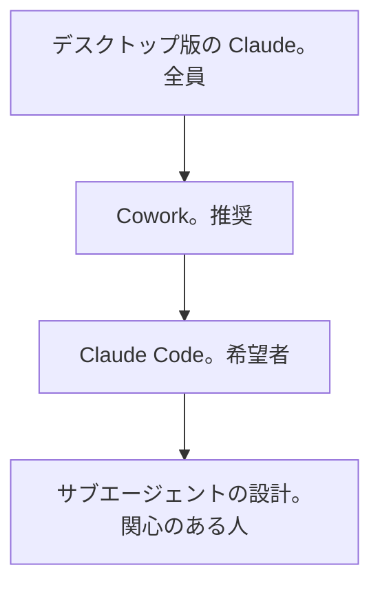

# Claude Daily — 2026-10-04（第043号）

## きょうの3行

- 応答の役と口調は設定ファイルで固定できます。置き場は `.claude/output-styles/`。
- 連載37回。非エンジニアに渡す入口は、端末ではなく Slack の `@Claude` です。
- CHANGELOG に新しい版はありません。Claude Tag の文書が別サイトへ移りました。

## ① ベストプラクティス — 役と口調を設定ファイルに固定する（output style）

> - 応答の役・口調・形式は、セッション全体に効かせられます。
> - 自作スタイルは既定で、標準のコーディング指示を落とします。
> - `settings.json` の `outputStyle` は大文字小文字を区別します。

同じ注意を毎回プロンプトに書き足しているなら、それはスタイルに切り出す合図です。
output style はセッション中のすべての応答に効くので、1回選べば書き足しが要りません。



図1: output style の指示が組み立てられる経路

まず組み込みの4種を試してください。自作が要るのは、この4つで足りないときだけです。

| スタイル | 変わること | 向く場面 |
|---|---|---|
| Proactive | 定型の判断を聞かずに着手する | 後から直す前提で走らせたい |
| Concise | 1文目に結果を置き、前置き・実況・締めを省く | 既定の応答が長い（v2.1.237 以降） |
| Explanatory | `Insight` ブロックで選択の理由を添える | コードベースを覚えたい |
| Learning | `Insight` に加え `TODO(human)` を残して書かせる | 手を動かして覚えたい |

自作は Markdown 1枚です。次のファイルを `.claude/output-styles/diff-first.md` に置きます。

```markdown
---
name: diff-first
description: 実装の前に、触る範囲と検証手順を出す
keep-coding-instructions: true
---

実装に入る前に、次の3点をこの順で出します。

1. 触るファイルの一覧。追加・変更・削除を分ける
2. 想定する副作用。Server Component と Client Component の境界、`revalidate` の扱い
3. 検証コマンド。`npx tsc --noEmit` で足りるか、`npm run build` まで要るか

## 応答の形

- 結論を1文目に置く。前置きと締めの要約は書かない
- 差分は変更した関数の単位で貼る。ファイル全体は貼らない
```

リポジトリの既定にするなら、`.claude/settings.json` に1行書きます。

```json
{
  "outputStyle": "diff-first"
}
```

#### ❌ `name` を書かず、値を見た目で決める

```markdown
---
description: レビュー向けの出力
---

結論を先に書いてください。
```

```json
{
  "outputStyle": "Diff First"
}
```

2つの理由で無音のまま効きません。
`name` が無いとスタイル名はファイル名になるので、`outputStyle` の値と一致しません。
一致しない値は Default に落ち、エラーも警告も出ません。

さらに `keep-coding-instructions` が無いので、標準指示が丸ごと外れます。
外れるのは変更範囲の決め方・コメントの書き方・検証のしかたで、どれも応答の形とは無関係です。

#### ✅ `name` を明示し、設定の値と文字どおり揃える

上の `diff-first.md` と `settings.json` の組み合わせが正解です。
`name: diff-first` でスタイル名が確定し、`"outputStyle": "diff-first"` が文字どおり一致します。
コードを書かせ続けるなら `keep-coding-instructions: true` を必ず添えてください。

| 用語 | 意味 |
|---|---|
| output style | 役・口調・形式をセッション全体に効かせる指示の束 |
| `keep-coding-instructions` | 標準のソフトウェア工学向け指示を残すフラグ。既定は `false` |
| `force-for-plugin` | プラグイン同梱のスタイルを、選択なしで効かせるフラグ |

- 出典: [Output styles](https://code.claude.com/docs/en/output-styles)

## ② 深掘り連載 第37回 — 非エンジニア業務への展開

> - 非エンジニアに渡す入口は、端末ではなく Slack です。
> - 権限は人ではなくチャンネルに付きます。だから本人に聞かせます。
> - 席は増えません。チャンネルの作業は組織の残高から引かれます。

非エンジニアに Claude Code を配ると、最初の壁は端末です。
Claude Tag はその壁を外し、Slack のチャンネルで `@Claude` と書く形にします。
いまは公開ベータで、Team と Enterprise のみ、かつ Anthropic 直接提供のみです。

| | Claude Tag | Cowork | Claude Code |
|---|---|---|---|
| 場所 | Slack のチャンネル | claude.ai のチャット | 端末か IDE |
| 誰の権限で動くか | チームの。管理者がチャンネルごとに置くサービスアカウント | 自分の OAuth コネクタ | 自分の資格情報とファイル |
| 誰に見えるか | チャンネルの全員 | 自分だけ | 自分だけ |
| 向く仕事 | チームで見て直したい仕事 | 個人の調査と下書き | 自分の手元のコード |

公式の言い方は「チームの仕事は Claude Tag、個人の仕事は Cowork か Claude Code」です。



図2: Claude Tag の1周。スレッドは残り、サンドボックスは作り直される

ここが運用の勘所です。スレッドは残り続け、サンドボックスは使い捨てです。

長い作業では、途中でブランチを push させ、下書きを投稿させてください。
サンドボックスの中だけにあるファイルは、1ターンが終われば消えます。

セットアップは Owner が1度だけ済ませます。Slack で `@Claude connect` を送り、
返ったペアリングコードを `claude.ai/admin-settings/claude-tag` に入れて公開します。
以降は、チャンネルにいる全員が個別の設定なしで使えます。

| 場面 | 向くか | 理由 |
|---|---|---|
| 問い合わせの一次受けと振り分け | 向く | Slack の中身だけで足りる。外部の接続は要らない |
| 規程・手順書への質問 | 向く | Drive・Notion・Confluence の接続が1つあれば出典つきで返る |
| 数字の問い合わせ | 条件つき | データウェアハウスの接続が前提になる |
| 決まったスレッドを文書・チケットにする | 向く | 投稿された内容がそのまま材料になる |
| 個人のファイルを使う作業 | 向かない | チャンネルは管理者が置いた権限で動く。1対1の DM か Cowork へ回す |
| 承認そのもの | 向かない | 催促は任せられる。承認を出すのは人のままです |

権限がチャンネルに付く以上、自分の Slack の権限から推測はできません。
`@Claude what can you access from this channel?` と聞くのが唯一の確かめ方です。
届かないものがあれば、そのチャンネルに許可が無いという意味になります。

記憶も場所に付きます。置き場は2つあり、書き足せる向きが違います。

| メモの置き場 | 読まれる範囲 | 書き足せるのは |
|---|---|---|
| チャンネルのメモ | そのチャンネルで働くときだけ | 公開・私用のどちらからでも |
| ワークスペース共通のメモ | ワークスペースの全チャンネル | 公開チャンネルからだけ |

セッションの寿命は既定値で、変わる前提の数字です。

| 値 | 何の数字か |
|---|---|
| 数分 | 1ターンが終わってからサンドボックスが解放されるまで |
| 約1時間 | 動きが無いとき、チャンネル直下のセッションが入れ替わるまで |
| 約1日 | 同じセッションが寿命で入れ替わるまで。静かになるのを待つ |
| 約100件 | 最後に投稿してから、チャンネル直下を読むのをやめるまでの件数 |

言い直しは新しい返信で伝えます。編集は注記として届くだけで、依頼の宛先にはなりません。

削除した返信は通知されず、読み終えた版がそのまま残ります。
スレッドの最初のメッセージを消すと、そのスレッドのセッションは閉じます。

- 出典: [Work with Claude Tag](https://claude.com/docs/claude-tag)
- 出典: [How Claude Tag works](https://claude.com/docs/claude-tag/concepts/how-it-works)

## ③ すぐ効くTIPS

### 1. スタイルが効かないときは `claude --debug` で読み込みを見る

綴り違いのフィールドはエラーなく捨てられます。
YAML 自体が壊れていると、フィールドが何も設定されないままファイル名のスタイルとして読まれます。
どちらも無音なので、起動時の診断を見るのが最短です。

```bash
claude --debug
```

### 2. 詰まったスレッドは `!restart` で入れ替える

Claude Tag のスレッドは、返信があるたび同じセッションが起きます。
文脈が壊れたときは作り直しが要ります。チャンネル直下に送ると、チャンネルのセッションが入れ替わります。

```text
@Claude !restart
```

### 3. プラグインのスタイルは `force-for-plugin` で選ばせない

プラグイン同梱の output style は、既定では利用者が選ばないと効きません。
`true` にすると有効なあいだ自動で適用され、利用者の `outputStyle` も上書きします。
複数のプラグインが指定したときは、最初に読まれた1つが勝ちます。

```markdown
---
name: acme-house-style
force-for-plugin: true
---
```

## ④ 事例

### 1. ビジネス職24名に全6回の研修を回す（チーム展開）

| 値 | 何の数字か |
|---|---|
| 24名 | 受講したビジネス職・デザイナー職 |
| 全6回 | 第0回の環境構築から第5回の認定試験まで |
| 20問・80点 | 認定試験の問題数と合格点 |
| 13件超 | 受講後1か月で非エンジニアから出た PR |

WinTicket のエンジニアが2026年4月に研修を設計して回した、という報告があります。
順番は端末と Git から始め、権限ダイアログの読み方、GitHub の流れ、脅威と防御、認定試験でした。
環境はスクリプトで揃え、管理設定を組織全体に配ったとされています。

受講後にスキルを自作して共有した人や、レポート生成を自動化したマーケターが出たと書かれています。
記事自体が「講座で扱えたのは必要な知識のごく一部」と留保を置いています。

- 出典: [Claude Codeをビジネス職が安全に使うためのエンジニア主導研修](https://developers.cyberagent.co.jp/blog/archives/64022/)

### 2. 非エンジニアが2か月でスキル22本を積む

| 値 | 何の数字か |
|---|---|
| 22本 | 2か月で作った自作スキル |
| 5体 | 役割を分けたサブエージェント |
| 60分 → 3分 | 朝の情報収集。1コマンドにまとめた後 |

漫画関連企業の開発マネージャーが、2か月の記録を公開しています（二次情報）。
手順は日本語の箇条書きで書き、役割ごとにサブエージェントを分けたとのことです。
展開は段階を踏んだとのことです。



図3: 報告されている段階的な広げ方。下に行くほど対象を絞る

詰まった点も4つ挙げています。自分のミスだと思い込む、`CLAUDE.md` を作り込みすぎて始められない、
1セッションに詰め込みすぎる、そして自分だけが使う状態が残ることです。

- 出典: [非エンジニアが久々に「黒い画面」に飛び込んで2ヶ月。Claude Code で業務が変わった話](https://zenn.dev/no9_dev/articles/9fdeb8b6db585b)

## ⑤ 速報 — 新機能・変更点

本日は Claude Code の新しい版の発表はありませんでした。拾えた差分は文書側の1件だけです。

| いつ | 何が | どう効くか |
|---|---|---|
| 2026-10-04 時点 | CHANGELOG は v2.1.288 のまま | 前回チェック以降、新しい版は出ていません |
| 2026-10-04 時点 | Claude Tag の文書が `claude.com/docs/claude-tag` へ | 旧 URL は 308 で転送。管理者向け・利用者向け・概念に分かれた独立の文書群になりました |
| 2026-09-30 | Claude Sonnet 4.5 の退役予告（既報） | Claude API での退役は 2026-11-30。Sonnet 5.5 への移行が案内されています |

- 出典: [CHANGELOG](https://github.com/anthropics/claude-code/blob/main/CHANGELOG.md)
- 出典: [Platform リリースノート](https://platform.claude.com/docs/en/release-notes/overview)

## ⑥ コマンド早見

| コマンド | 何をするか |
|---|---|
| `/output-style` | 選べるスタイルを並べ、いま効いているものに印を付ける |
| `/output-style diff-first` | 自作スタイルに切り替える |
| `/config` | メニューから Output style を選ぶ |
| `claude --debug` | スタイルの YAML パースエラーを含む起動時の診断を出す |
| `/context` | 読み込まれた設定とコンテキストの内訳を見る |
| `@Claude what can you access from this channel?` | そのチャンネルで届く範囲を答えさせる |
| `@Claude !restart` | スレッドのセッションをアーカイブし、読み直させる |
| `@Claude what do you remember about this channel?` | チャンネルのメモの中身を出させる |
| `/invite @Claude` | 投稿させたいチャンネルに Claude を入れる |

## ⑦ きょうの課題

自作の output style を置き、効かない壊れ方まで確かめます。10分で終わります。

**前提**: Next.js のリポジトリ1つと、Claude Code v2.1.269 以降。

**手順**

1. 置き場を作ります。

```bash
mkdir -p .claude/output-styles
```

2. ①の `diff-first.md` を `.claude/output-styles/diff-first.md` に保存します。
3. `/output-style` を実行し、一覧に `diff-first` が出るか見ます。
4. `.claude/settings.json` に、わざと大文字で書いた値を置きます。

```bash
cat > .claude/settings.json <<'EOF'
{
  "outputStyle": "Diff-First"
}
EOF
```

5. Claude Code を再起動し、`/output-style` でどれに印が付くか見ます。
6. 値を `diff-first` に直し、もう一度再起動して印を確かめます。

**確認方法**: 5で Default に印が付き、6で `diff-first` に移ること。

── 模範解答 ──

3で一覧に出なければ再起動します。ターミナルはスタイルのファイルを起動時に読みます。

5が Default になるのは、`outputStyle` が完全一致を要るからです。
`Diff-First` はどのスタイル名とも一致しないので、既定に落ちます。
`/output-style` は大文字小文字を無視するので、「コマンドでは切り替わるのに設定では効かない」が起きます。

| 詰まりどころ | なぜそうなるのか |
|---|---|
| 一覧に `diff-first` が出ない | ターミナルは起動時にスタイルを読む。作った直後は再起動が必要 |
| フィールドを書いたのに無視される | 綴り違いのフィールドはエラーなく捨てられる。`claude --debug` で読み込みを見る |
| 急にコードの扱いが雑になった | `keep-coding-instructions` が未設定。標準の指示が外れている |
| サブエージェントの応答だけ変わらない | サブエージェントは自分のシステムプロンプトで動く。fork だけが親の分を継ぐ |
| スタイルを守らない返答が混じる | スタイルは指示であって強制ではない。必ず守らせたいならフックへ移す |

あすは連載第38回「導入が失敗するパターンと処方箋」です。
