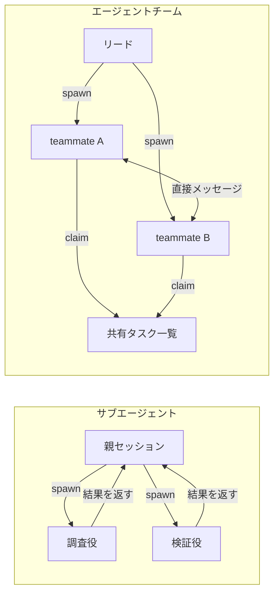
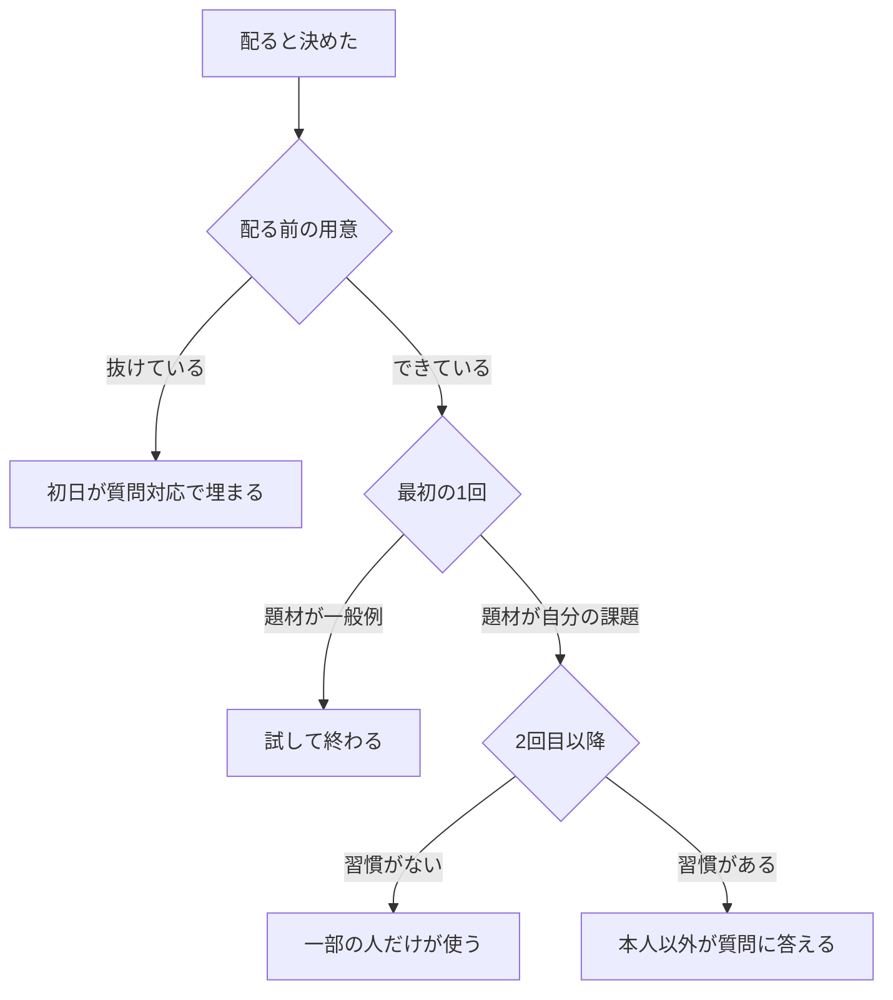
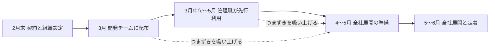

# Claude Daily — 2026-10-05（第044号）

## きょうの3行

- エージェントチームの役は `.claude/agents/` に書けば使い回せます。
- 導入が止まるのは道具ではなく段取りです。止まる地点は3つしかありません。
- v2.1.289 が出ました。mod に `agent.spawn` が入りました。

## ① ベストプラクティス — 役を定義してから並列に当てる

> エージェントチームの teammate は、サブエージェント定義をそのまま役として使えます。
> 有効化は環境変数1本です。既定は無効で、入れると名前つきサブエージェントが teammate になります。
> 品質の門は `TeammateIdle` / `TaskCreated` / `TaskCompleted` の3フックで締めます。

サブエージェントとエージェントチームは、どちらも並列に走らせる仕組みです。
違うのは結果の返り方です。サブエージェントは親に返し、teammate は共有タスクと直接会話で動きます。



図1: サブエージェントは親に結果を返す。teammate は互いに話し、共有タスクを自分で取る

### 何を解決するのか

役の定義が spawn プロンプトの中にしかないと、毎回書き直すことになります。
`.claude/agents/<role>.md` に置けば、サブエージェントとしても teammate としても同じ定義で呼べます。

有効化は `settings.json` の `env` に1本書くだけです。

```json
{
  "env": {
    "CLAUDE_CODE_EXPERIMENTAL_AGENT_TEAMS": "1"
  },
  "teammateMode": "in-process"
}
```

`teammateMode` は表示のしかたです。`in-process` が既定で、どの端末でも動きます。

| 値 | 挙動 |
|---|---|
| `in-process` | 既定。全員を同じ端末で動かす。追加の用意は不要 |
| `auto` | すでに tmux の中にいるか、iTerm2 ＋ `it2` があれば分割ペイン。なければ `in-process` |
| `tmux` | 分割ペイン。tmux と iTerm2 のどちらを使うかは端末から判定 |
| `iterm2` | iTerm2 のネイティブ分割ペイン。`it2` CLI が必須 |

役の定義は普通のサブエージェント定義です。これを `.claude/agents/` に置きます。

```markdown
---
name: route-reviewer
description: Next.js の App Router の変更をレビューする
tools: Read, Grep, Glob, Bash
model: sonnet
effort: high
---
あなたは Next.js の App Router に詳しいレビュー担当です。
`app/` 配下の差分だけを見て、次の観点で指摘してください。

- `"use client"` の位置が必要最小限か
- `generateMetadata` と `generateStaticParams` の戻り値の型が合っているか
- サーバー専用のモジュールがクライアント境界を越えていないか

指摘には必ずファイル名と行番号を添えてください。
スタイルの好みは書かないでください。
```

呼ぶときは型の名前を指定します。

```text
route-reviewer エージェント型で teammate を1体 spawn して、
app/ 配下の差分をレビューさせてください。
```

### 定義のどこが効くのか

同じ定義でも、teammate のときは効くフィールドが変わります。
`skills` はどちらの表示モードでも適用されません。

| フィールド | in-process の teammate | 分割ペインの teammate |
|---|---|---|
| `tools` | 適用。`SendMessage` とタスク系ツールが足される | 適用 |
| `model` | spawn プロンプトでモデルを指定しなければ適用 | 同じ |
| `disallowedTools` | 適用。ただし足された `SendMessage` とタスク系は残る | 適用されない |
| `effort` | 適用 | 適用されない |
| 本文 | 既定のシステムプロンプトに追記される | 既定のシステムプロンプトを置き換える |
| `skills` | 適用されない（プロジェクトとユーザー設定から読む） | 適用されない |
| `mcpServers` | 適用されない（プロジェクトとユーザー設定から読む） | 適用 |

モデルは次の順で決まります。上から当たったものが勝ちます。

| 順 | 決め手 |
|---|---|
| 1 | spawn プロンプトがその teammate のモデルを名指ししたとき |
| 2 | サブエージェント定義の `model`（`inherit` はリードのモデル） |
| 3 | `CLAUDE_CODE_SUBAGENT_MODEL`（`inherit` 以外のとき） |
| 4 | リードの現在のモデル |

### 門をフックで締める

teammate が「終わったつもり」で止まるのを防ぐには、フックを使います。
終了コード2で差し戻すと、teammate は作業を続けます。

```json
{
  "hooks": {
    "TeammateIdle": [
      {
        "hooks": [
          {
            "type": "command",
            "command": "npm run -s typecheck && npm run -s test -- --run"
          }
        ]
      }
    ],
    "TaskCompleted": [
      {
        "hooks": [
          {
            "type": "command",
            "command": "git diff --quiet && echo '差分がありません' >&2 && exit 2 || exit 0"
          }
        ]
      }
    ]
  }
}
```

`TeammateIdle` は teammate が待機に入る直前に走ります。
`TaskCompleted` はタスクを完了にする直前に走ります。
どちらも終了コード2でフィードバックを返し、完了を止めます。

#### ❌ `teammateDefaultModel` でモデルを決める

```json
{
  "teammateDefaultModel": "sonnet"
}
```

このキーは v2.1.234 で削除されました。残っていても無視されます。
エラーは出ないので、リードのモデルで全員が走り続けます。

#### ✅ 定義の `model` か spawn プロンプトで指定する

```markdown
---
name: route-reviewer
model: sonnet
---
```

定義に書けば、spawn プロンプトでモデルを言わなかったときに効きます。
`CLAUDE_CODE_SUBAGENT_MODEL_FORCE=1` を立てた場合だけ、この2つは無視されます。

#### ❌ チームの構成ファイルを先に書く

```bash
# どちらも効かない
vi ~/.claude/teams/session-ab12cd34/config.json
vi .claude/teams/teams.json
```

`~/.claude/teams/<team>/config.json` はセッション ID やペイン ID を持つ実行時の状態です。
手で書いても次の状態更新で上書きされます。
プロジェクト直下の `.claude/teams/teams.json` は設定として読まれず、ただのファイル扱いになります。

#### ✅ 役はサブエージェント定義に書く

```bash
mkdir -p .claude/agents
$EDITOR .claude/agents/route-reviewer.md
```

再利用できる単位はこちらだけです。プロジェクト・ユーザー・管理・プラグインのどのスコープでも参照できます。

| 用語 | 意味 |
|---|---|
| リード | teammate を spawn して調整する本体のセッション |
| teammate | リードが起こす独立した Claude Code セッション |
| 共有タスク一覧 | teammate が自分で取って完了にする作業の一覧 |

出典: [Orchestrate teams of Claude Code sessions](https://code.claude.com/docs/en/agent-teams)
出典: [Best practices for Claude Code](https://code.claude.com/docs/en/best-practices)

## ② 深掘り連載 第38回 — 導入が失敗するパターンと処方箋

> 導入が止まる地点は3つです。配る前・最初の1回・2回目以降。
> 処方のほとんどは配る前に決まります。あとから足しても効きが落ちます。
> 反対意見は議論で畳まず、本人のコードで1回成功させて畳みます。



図2: 導入が止まる3地点。どこで止まったかで処方が変わる

### 地点1 — 配る前

公式の「送る前のチェックリスト」は、各項目が「放っておくと初日のサポートスレッドになる穴」として書かれています。
ここを埋めずに送ると、初日の質問が全部こちらに来ます。

| 失敗パターン | なぜ止まるのか | 処方 |
|---|---|---|
| 置き場所を決めずに告知した | 質問の着地点がない | `#claude-code` を作り、告知文にリンクを置く |
| インストールを自社環境で試していない | プロキシやファイアウォールで全員が同時に詰まる | 社内の1台で先に通す |
| セキュリティの資料を用意していない | 「コードはどこへ行くのか」が最初の返信になる | データ取り扱いのリンクを告知文に入れる |
| 最初の題材が一般例 | 自分の問題に見えないので試して終わる | 実在するバグかファイルを1つ名指しする |
| 最初の48時間の担当者がいない | 初日の未回答が勢いを殺す | 名前つきで1人決める |
| 管理部門の名前で送った | 任意の実験に見える | 経営層の名前で送るか連署にする |

公式は、経営層の名前で出た告知のほうが初週の立ち上がりが一貫して高いと書いています。

### 地点2 — 最初の1回

最初の1回で成功しないと、2回目は来ません。
題材は「難しい仕事」ではなく「面倒で後回しにしていた仕事」を選びます。

反対意見は、一般論で畳もうとすると長引きます。
公式が勧めるのは、認めてから言い換え、本人のコードで1回見せる順です。

| 反対意見 | 返し方 | 見せるもの |
|---|---|---|
| 自分で書いたほうが速い | 日常的に書くコードはそのとおり。避けている仕事に当てる | 面倒な作業を両方のやり方で計る |
| 本番のコードを触らせたくない | 読まずに入れる変更は作らない。計画モードで先に見る | 実ファイルで計画モードを見せる |
| 若手が育たなくなる | 説明役として使う。変える前に読ませる | `@file` とその呼び出し元を一緒に読む |
| 一度試したら嘘を書いた | 多くはモデルではなく文脈の問題 | 同じ依頼を `@` 付きでやり直す |
| 新しい道具を覚える時間がない | 基盤ではなく端末のコマンド1つ | 2分の導入と実在のバグ1件 |

### 地点3 — 2回目以降

ここで必要なのは個人の熱意ではなく習慣です。
公式は「自分以外が質問に答えている状態」を到達点として書いています。

| 習慣 | 回し方 | かかる手間 |
|---|---|---|
| 専用チャンネル | 入口と良い例を1つピン留めし、質問は公開の場で答える | 用意に5分、あとは常時 |
| 週1の持ち寄りスレッド | 金曜に「今週どこを助けてもらったか」と投げるだけ | 週2分 |
| スキルの共有 | `.claude/skills/<name>/SKILL.md` を1行の説明つきで貼る | 1本5分 |
| 次の担当者を見つける | いちばん質問してくる人に引き継ぐ | ほぼ0 |

### この処方が効くとき・効かないとき

| 状況 | 効く | 効かない |
|---|---|---|
| 配る範囲 | 段階的に広げる | 全員に一斉に配る |
| 題材の選び方 | 実在のバグ・ファイルを名指し | 一般的なサンプル |
| 反対意見 | 本人のコードで1回見せる | 一般論で議論する |
| 定着の担保 | 習慣として仕組みに置く | 推進担当者1人の熱意 |
| セキュリティの質問 | 管理者に回す | 推進担当者がその場で答える |

公式は、セキュリティとデータ取り扱いの回答を推進担当者が即興で作らないよう明記しています。
ここだけは管理者に回すのが処方です。

出典: [Communications kit](https://code.claude.com/docs/en/communications-kit)
出典: [Champion kit](https://code.claude.com/docs/en/champion-kit)
出典: [Best practices for Claude Code](https://code.claude.com/docs/en/best-practices)

## ③ すぐ効くTIPS

### 1. `Bash(rm *)` の deny は実行ファイルを見ない

Bash のルールはコマンド文字列に一致します。実行ファイルの実体までは追いません。
つまり `/bin/rm` や `find . -delete` は `Bash(rm *)` の deny をすり抜けます。

```json
{
  "hooks": {
    "PreToolUse": [
      {
        "matcher": "Bash",
        "hooks": [
          {
            "type": "command",
            "command": "jq -re '.tool_input.command | test(\"(^|[ /])rm([ ]|$)|-delete|-exec[ ]+rm\")' >/dev/null && { echo '削除系のコマンドは止めています' >&2; exit 2; } || exit 0"
          }
        ]
      }
    ]
  }
}
```

保証が必要なら、ルールではなく `PreToolUse` フックかサンドボックスを使います。

出典: [Debug your configuration](https://code.claude.com/docs/en/debug-your-config)

### 2. `mcpServers` を `settings.json` に書いても読まれない

`settings.json` は `mcpServers` キーを読みません。書いても無言で無視されます。
プロジェクトの MCP サーバーはリポジトリ直下の `.mcp.json` に置きます。

```bash
# ❌ 読まれない場所
.claude/.mcp.json
.claude/settings.json の "mcpServers"

# ✅ 読まれる場所
./.mcp.json            # リポジトリ直下。サーバーは "mcpServers" キーの下
claude mcp add --scope user <name> <command>
```

`.mcp.json` のサーバーは初回だけ承認が必要です。承認の表示を閉じてしまったら `/mcp` から承認します。

出典: [Debug your configuration](https://code.claude.com/docs/en/debug-your-config)

### 3. 分割ペインは `tmux` の有無を先に確かめる

分割ペインは tmux か iTerm2 ＋ `it2` が前提です。
VS Code の内蔵ターミナル・Windows Terminal・Ghostty では動きません。

```bash
which tmux                      # 先に確認する
claude --teammate-mode auto     # この1回だけ分割ペインを試す
tmux ls                         # 終了後に残っていないか見る
tmux kill-session -t <name>     # 残骸を消す。<name> は tmux ls の名前
```

`--teammate-mode` は実験的なフラグで `claude --help` には出ません。

出典: [Orchestrate teams of Claude Code sessions](https://code.claude.com/docs/en/agent-teams)

## ④ 事例

### 開発チームから全社へ、4か月を5段に割った

アトラスの CTO が、2026年2月末から6月までの全社導入を段ごとに書いています（Atlas Developers Blog、二次情報、2026-07-31）。
個人プランを避けた理由として、設定のばらつきと管理の手間を挙げたという報告があります。



図3: 先に配った層のつまずきを、次の層の準備に戻す

| 時期 | やったこと |
|---|---|
| 2026年2月末 | Team プランを契約し、組織設定を確認 |
| 2026年3月 | 開発チームに配布。利用手順とセキュリティのルールを整備 |
| 2026年3月中旬〜5月 | 各グループの管理職・リーダーが先行利用 |
| 2026年4月〜5月 | 全社展開の準備。共通ルール・手引き・組織側のガードレール |
| 2026年5月〜6月 | 全社展開。セキュリティ確認とスキル共有の定着 |

つまずきと直し方も同じ記事に表の形で載っています。

| つまずき | 直し方 |
|---|---|
| コミットの自動化が緩すぎた | 承認を必須に戻した |
| 個人ごとの設定がばらついた | 組織設定に吸い上げた |
| 参照系コマンドで制限を抜けられた | ルールを組織設定側で締めた |
| Windows の開発者モードが必要だった | 手順書に追記した |
| PowerShell の実行ポリシーで止まった | 回避手順を文書化した |

スキル名は `[チーム接頭辞]-[動詞]-[対象]` の形に決め、コーディング規約はスキルに複製せず文書だけに置いたと書かれています。

出典: [開発チームから全社へ。アトラスがClaudeを4ヶ月で全社導入するまでにやったこと](https://devlog.atlas.jp/2026/07/31/6142)

### 動くのに理由が残らない「理解負債」

クラシルのバックエンド担当者が、生成されたコードの説明責任をどう取り戻したか書いています（Zenn / dely、二次情報、2026-04-09）。
レビューで「外部サービスが落ちたらどうなるのか」と聞かれて答えられなかったのが出発点だという報告があります。

| 値 | 何の数字か |
|---|---|
| 23 | 依存の順に割り直した PR の本数（マイグレーション→モデル→API→非同期ジョブ） |
| 154% | AI 導入で PR のサイズが増えた割合（記事が別の調査を引用した数値） |
| 91% | 同じ調査でレビュー時間が増えた割合 |

直し方は3つです。PR を依存順に割る、設計テンプレートに復旧経路と監視条件の欄を足す、機械的な確認だけ AI に回す。

記事は性能の数値は出していません。
手戻りが減り、レビューで設計の話ができるようになったと書いています。

出典: [Claude Codeが書いたコードを、チームのコードにするためにやったこと — 理解負債とどう向き合ったか](https://zenn.dev/dely_jp/articles/b8b41a4202efda)

## ⑤ 速報 — 新機能・変更点

前回チェックは v2.1.288 でした。以降に v2.1.289 が出ています。

| いつ | 何が | どう効くか |
|---|---|---|
| v2.1.289 | mod に `agent.spawn` を追加。プラグインのフックイベント全体で agent id が1つになり、`$.agent.list()` に idle と waiting が入った | mod から teammate を起こし、誰が待機中かを見分けられる |
| v2.1.289 | 環境変数の接頭辞つきコマンド（`TZ="$HOME" rm -rf build`）で Bash の deny・ask を取りこぼしていた不具合を修正。裸の変数代入が先に来る場合も同じ | サンドボックスの自動許可下でも削除系のルールが効く |
| v2.1.289 | `Read` の deny ルールが、シンボリックリンク経由で `@` 参照・変更・IDE 選択されたファイルに効いていなかった不具合を修正 | 読ませない指定がリンク越しでも守られる |
| v2.1.289 | アップグレード直後の最初のセッションで mod が読み込まれない不具合を修正 | 更新後に入れ直す手間がなくなる |
| v2.1.289 | VS Code で、2.1.288 の `claude auth status` の変更を差し戻し | サインアウトが増える症状が戻る |

Platform リリースノートと `anthropic.com/news` には前回以降の追加がありません。

出典: [Claude Code CHANGELOG](https://github.com/anthropics/claude-code/blob/main/CHANGELOG.md)

## ⑥ コマンド早見

| コマンド | 何をするか |
|---|---|
| `claude --teammate-mode auto` | その1回だけ分割ペインを試す（`--help` には出ない） |
| `which tmux` | 分割ペインの前提が入っているか確認する |
| `tmux ls` | 残っている tmux セッションを一覧する |
| `tmux kill-session -t <name>` | 残骸の tmux セッションを消す |
| `claude mcp add --scope user <name> <command>` | ユーザースコープで MCP サーバーを登録する |
| `/mcp` | MCP サーバーの状態を見て、未承認のものを承認する |
| `/hooks` | いま登録されているフックをイベントごとに見る |
| `/context` | 文脈に何が入っているかを種類ごとに見る |
| `/doctor` | 設定の不備と不要な拡張を点検し、直し方を提案させる |
| `npm run -s typecheck` | `TeammateIdle` フックから呼ぶ検査の例 |

## ⑦ きょうの課題

Next.js のリポジトリで、役を1つ定義して teammate として呼び、門を1つ置きます。
15分で終わります。

**前提**: Claude Code v2.1.234 以降、`app/` を持つ Next.js リポジトリ、`npm run typecheck` が通ること。

**手順**

1. `.claude/settings.json` に `env.CLAUDE_CODE_EXPERIMENTAL_AGENT_TEAMS` を `"1"` で置く。
2. `.claude/agents/route-reviewer.md` を作り、`name` と `model` と観点3つを書く。
3. 同じ `settings.json` に `TeammateIdle` フックを置き、`npm run -s typecheck` を走らせる。
4. `claude` を起動し、`route-reviewer エージェント型で teammate を1体 spawn して app/ 配下の差分をレビューさせてください` と頼む。
5. わざと型エラーを1つ入れ、teammate が待機に入らずに直すか見る。

**確認方法**: `/hooks` に `TeammateIdle` が出ること。エージェントパネルに teammate の行が出ること。

── 模範解答 ──

```bash
mkdir -p .claude/agents
cat > .claude/settings.json <<'JSON'
{
  "env": {
    "CLAUDE_CODE_EXPERIMENTAL_AGENT_TEAMS": "1"
  },
  "hooks": {
    "TeammateIdle": [
      {
        "hooks": [
          { "type": "command", "command": "npm run -s typecheck" }
        ]
      }
    ]
  }
}
JSON
cat > .claude/agents/route-reviewer.md <<'MD'
---
name: route-reviewer
description: Next.js の App Router の変更をレビューする
tools: Read, Grep, Glob, Bash
model: sonnet
---
`app/` 配下の差分だけを見て、次の3点を指摘してください。

- `"use client"` の位置が必要最小限か
- `generateMetadata` の戻り値の型が合っているか
- サーバー専用のモジュールがクライアント境界を越えていないか

ファイル名と行番号を必ず添えてください。
MD
```

**なぜそうなるのか**

`TeammateIdle` は teammate が待機に入る直前に走ります。
終了コード2で返すと、teammate は作業を続けます。
型エラーが残っている間は待機に入れないので、人が気づくより先に直ります。

**よくある詰まりどころ**

| 症状 | 原因 | 直し方 |
|---|---|---|
| teammate ではなくサブエージェントが動く | 環境変数が入っていない | `/status` で設定の出どころを確認する |
| パネルから行が消えた | 全体がアイドルになって30秒で隠れた | 名前を呼んで話しかければ戻る。4体以上は1行にまとまる |
| フックが `/hooks` に出ない | `matcher` を配列で書いた | 1本の文字列にする。`TeammateIdle` は `matcher` なしでよい |
| 再開したら teammate がいない | `/resume` と `/rewind` は in-process の teammate を戻さない | リードに spawn し直させる |

あすは第39回「Claude API の要点（開発者が最低限知るべきこと）」です。
