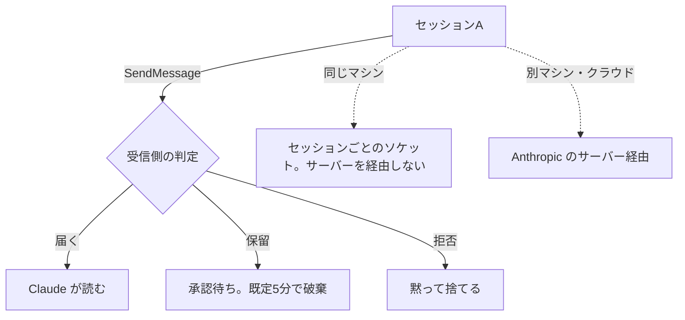
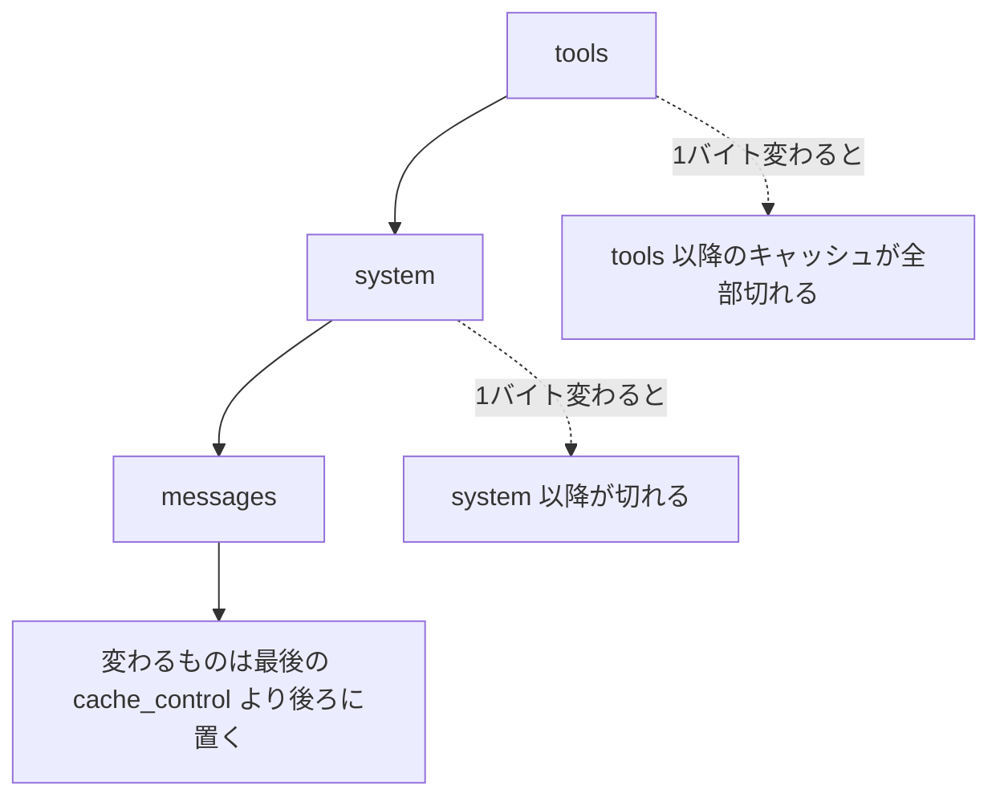
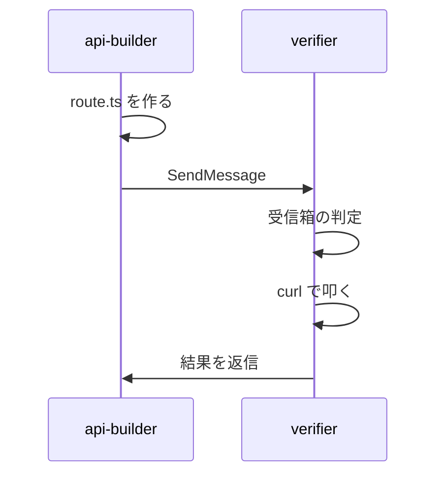

# Claude Daily — 2026-10-06（第045号）

## きょうの3行

- 並列セッションの引き継ぎは、Claude 同士に任せられます。
- Claude API の窓口は `POST /v1/messages` の1つだけです。
- Models API に `line` が増えました。世代をIDから推測せずに済みます。

## ① ベストプラクティス — 名前を付けて、引き継ぎはセッション同士に渡させる

> 並列セッションで分かったことを、人がコピペで運ぶのをやめます。
> 名前を付けたセッションは `@名前` で指名でき、Claude が渡します。
> `-p` のワーカーに受け取らせるには `crossSessionInbound` を `accept` にします。

### 何を解決するのか

セッションを2つ以上並べると、引き継ぎが人の仕事になります。
片方が見つけたことを、もう片方の端末に貼り直す作業です。
Claude Code はこの受け渡しを Claude 同士に任せます。

渡るのは本文だけです。会話履歴もファイルも送られません。
会話ごと移したいときは、そのセッションを再開します。



図1: 送った先で3つに分かれる。経路は相手がどこで動いているかで決まる

### 名前を付ける

指名するには名前が必要です。`--name` で付け、`/rename` で途中から変えます。

```bash
claude --name reviewer
```

相手を名指しするときは、プロンプトの中に `@` 付きで書きます。

```text
Let @reviewer know the schema migration finished
```

同じ名前が先にいると、Claude Code は後から来た側を別名に変えます。
`/list-agents` の一覧には作業ディレクトリも出るので、同名のセッションを見分けられます。

### `-p` のワーカーに受け取らせる

`-p` のセッションも受信箱を持ちます。ただし承認ダイアログを出せません。

| 保留のされ方 | そのあと |
|---|---|
| 既定の判定による保留 | `dialogExpiry` の期限で捨てられる。期限は既定5分 |
| `hold` を書いたことによる保留 | 期限切れにならない。`accept` が効いたときだけ渡る |

受け取りを明示するには、設定ファイルを渡します。

`.claude/worker-settings.json`:

```json
{
  "crossSessionInbound": "accept",
  "dialogExpiry": "never"
}
```

```bash
claude --settings .claude/worker-settings.json --name migration-worker \
  -p "Run the pending migrations, then report what changed"
```

`--settings` はファイルパスでもインライン JSON でも受け取ります。

| 値 | 挙動 |
|---|---|
| `accept` | 1件ずつ Claude に渡す |
| `hold` | 通知だけ出して渡さない。あとで `accept` が効けば解放される |
| `refuse` | 渡さずに捨てる |

### アンチパターン

#### ❌ `bypassPermissions` のワーカーに送って、届いた前提で進める

```bash
claude --dangerously-skip-permissions -p "Watch the test suite"
```

値を書かないと、Claude Code は両者の権限モードから1件ずつ判定します。
受信側が権限確認を飛ばす側なら、送信側も飛ばす側でなければ保留になります。
`-p` ではダイアログが出せないので、期限切れで捨てられて誰にも届きません。

#### ✅ 受け側に値を書いて、保留の余地を消す

```bash
claude --settings '{"crossSessionInbound":"accept"}' \
  --dangerously-skip-permissions -p "Watch the test suite"
```

既定の判定が動くのは、どの階層にも値がないときだけです。書いた値はその判定より先に効きます。
捨てられたメッセージは期限切れとして送信側に報告されるので、`SendMessage` の結果を見ます。

| 用語 | 意味 |
|---|---|
| 受信箱ソケット | セッションごとに作られる受け口。`/status` の `Peer address` 行に出る |
| 保留 | 届かずに取り置かれた状態。承認か設定変更で解放される |
| `isolatePeerMachines` | `true` にすると、マシンの外へ出る送信に毎回承認を求める |

出典: [Message your other Claude Code sessions](https://code.claude.com/docs/en/cross-session-messaging)

出典: [Best practices for Claude Code](https://code.claude.com/docs/en/best-practices)

出典: [CLI reference](https://code.claude.com/docs/en/cli-reference)

## ② 深掘り連載 第39回 — Claude API の要点

> 窓口は `POST /v1/messages` の1つです。ツールも構造化出力もその中の項目です。
> 思考は `{"type": "adaptive"}`、深さは `output_config.effort` で決めます。
> モデルの能力は決め打ちせず、Models API の `capabilities` を引きます。

### 窓口は1つ

Claude API のエンドポイントは `POST /v1/messages` です。
ツール使用・構造化出力・思考は別の API ではなく、このリクエストの項目です。
補助の口は Batches・Files・Token Counting・Models の4つだけです。

API はステートレスです。会話を続けるには、毎回すべての履歴を送り直します。



図2: キャッシュは前方一致。動くものを前に置くと、その後ろ全部が切れる

### Next.js から呼ぶ

ストリーミングを使います。出力が長いと、非ストリーミングでは HTTP タイムアウトに当たります。

```ts
// app/api/chat/route.ts
import Anthropic from "@anthropic-ai/sdk";

const client = new Anthropic(); // ANTHROPIC_API_KEY を環境から読む

export async function POST(req: Request) {
  const { prompt } = (await req.json()) as { prompt: string };

  const stream = client.messages.stream({
    model: "claude-opus-5-5",
    max_tokens: 64000,
    thinking: { type: "adaptive", display: "summarized" },
    output_config: { effort: "medium" },
    system: [
      {
        type: "text",
        text: "You are a helpful coding assistant.",
        cache_control: { type: "ephemeral" },
      },
    ],
    messages: [{ role: "user", content: prompt }],
  });

  const body = new ReadableStream<Uint8Array>({
    async start(controller) {
      const encoder = new TextEncoder();
      try {
        for await (const event of stream) {
          if (
            event.type === "content_block_delta" &&
            event.delta.type === "text_delta"
          ) {
            controller.enqueue(encoder.encode(event.delta.text));
          }
        }
        const final = await stream.finalMessage();
        console.log("cache_read", final.usage.cache_read_input_tokens);
        controller.close();
      } catch (error) {
        if (error instanceof Anthropic.APIError) {
          controller.enqueue(encoder.encode(`\n[api error ${error.status}]`));
          controller.close();
        } else {
          controller.error(error);
        }
      }
    },
  });

  return new Response(body, {
    headers: { "Content-Type": "text/plain; charset=utf-8" },
  });
}
```

`effort` は `output_config` の中に入れます。トップレベルに置くと効きません。
Opus 5.5 の既定は `medium` で、Sonnet 5.5 の既定は `high` です。

### エージェントの作り方は4つ

ハーネスを誰が書くか、置き場を誰が持つかの2軸で分かれます。

| 作り方 | ハーネスと置き場 | 使うべき時 | 使うべきでない時 |
|---|---|---|---|
| 手書きのループ | 自分で書き、自分で置く | 制御の流れを完全に握りたい | 普通のツール呼び出しで足りるとき |
| Tool Runner | SDK がループ、置き場は自分 | 自作ツールのエージェント。大半はここ | 組み込みのファイル操作や Bash が欲しいとき |
| Managed Agents | Anthropic がループと実行環境を持つ | 版つきの設定、長時間セッション、定期実行 | Bedrock・Vertex・Foundry で動かすとき |
| Claude Agent SDK | Claude Code のハーネス、置き場は自分 | ファイル操作つきのコーディングエージェント | 自作ツールだけで足りるとき |

Tool Runner は `client.beta.messages.tool_runner` で、Anthropic SDK の中にあります。
Claude Agent SDK は別パッケージです。名前が似ているだけで中身は違います。

### 400 で落ちる5つの書き方

古いコードをそのまま現行モデルに向けると、ここで止まります。

| 古い書き方 | 今の書き方 | エラー |
|---|---|---|
| `thinking: {"type": "enabled", "budget_tokens": N}` | `thinking: {"type": "adaptive"}` | 400 |
| `tool_choice: {"type": "any"}` か `{"type": "tool"}` | `{"type": "auto"}` ＋ `strict: true` ＋ 指示文 | `tool_choice: type "tool" and "any" are not supported for this model.` |
| 最後の assistant ターンに前置きを入れる | `output_config.format` か system の指示 | `This model does not support assistant message prefill.` |
| `temperature` / `top_p` / `top_k` | 既定値のまま送らない | 400 |
| `output_format` | `output_config: {"format": ...}` | 400（非推奨） |

Sonnet 5.5 で思考を切るときは `{"type": "between_tools"}` です。`disabled` は 400 になります。
受け付ける段は `low`・`medium`・`high` までで、`xhigh` と `max` では 400 です。

### 能力は Models API に聞く

モデルIDの文字列から世代や能力を判定しないでください。公式が「`id` から `line` を推測するな」と書いています。

```bash
curl https://api.anthropic.com/v1/models \
    -H 'anthropic-version: 2023-06-01' \
    -H "X-Api-Key: $ANTHROPIC_API_KEY"
```

| フィールド | 中身 |
|---|---|
| `line` | `haiku` / `sonnet` / `opus` / `fable` / `mythos` のいずれか。所属なしは `null` |
| `max_input_tokens` | 入力のコンテキスト上限 |
| `max_tokens` | `max_tokens` に渡せる上限 |
| `capabilities.effort` | `low` から `max` のどの段を持つか |
| `capabilities.thinking.types` | `adaptive` と `enabled` のどちらを受けるか |

出典: [Migrating to Claude Sonnet 5.5](https://platform.claude.com/docs/en/models/sonnet-5-5/migration-guide)

出典: [List Models](https://platform.claude.com/docs/en/api/models/list)

出典: [Claude API skill](https://platform.claude.com/docs/en/agents-and-tools/agent-skills/claude-api-skill)

## ③ すぐ効くTIPS

### 1. `/list-agents` で、いま誰に届くかを見る

到達できる相手と、自分の名前が1画面に出ます。別名の `/peers` でも開きます。
認識されないときは、そのセッションに機能自体がないので、先に `claude --version` を見ます。

```text
/list-agents
```

### 2. 「終わったら教えて」と頼む

長いタスクを別セッションで走らせているなら、終了を知らせてもらいます。
Claude が `notify_when_idle` で購読します。12時間で通知が来なければ購読は外れます。

```text
Tell me when the migration session finishes what it's working on
```

### 3. `cache_read_input_tokens` が 0 ならキャッシュは効いていない

同じプレフィックスで繰り返し投げているのに 0 なら、前方一致を壊すものが混ざっています。
`Date.now()`、UUID、キー順が揃っていない JSON、回ごとに変わるツール一覧が定番です。

```ts
console.log(final.usage.cache_read_input_tokens); // 0 なら効いていない
```

出典: [Message your other Claude Code sessions](https://code.claude.com/docs/en/cross-session-messaging)

## ④ 事例

### 国際救援委員会（IRC）— HTML 1枚のダッシュボードを現場に配る

> 40か国・2,700超の保健施設のデータを、現場の職員が自分で可視化します。
> 出力は外部に保存しない HTML 1枚で、通信がなくても開けます。
> 丸1日かかっていた分析が30分未満になりました。

| 値 | 何の数字か |
|---|---|
| 1営業日 → 30分未満 | 管理分析にかかっていた時間 |
| 月4時間超 | パイロット利用者の半数が削減した時間 |
| 15指標 | Claude が可視化する中核の保健指標 |
| 約2,000施設 | 対象となるサブサハラ・アフリカの保健施設 |

ブルキナファソの現場職員と測定担当に Claude Enterprise を配りました。
職員は施設の集計データを HTML ファイルにドラッグして読み込ませます。
担当者は自然言語でダッシュボードを更新します。

出典: [IRC — Turning fragmented health data into faster decisions](https://claude.com/customers/irc)

### カンリー — 60名の組織で勉強会の中身を揃えた（二次情報）

> エンジニア60名の組織が、社内勉強会の資料を公開したという報告があります。
> 設定の層・コンテキスト管理・拡張機能・並列化を8部構成で扱っています。
> `rules/` は `paths` 指定で、関係するファイルを触ったときだけ読ませるとのことです。

| 値 | 何の数字か |
|---|---|
| 60名 | 組織のエンジニア数 |
| 2025年6月 → 2026年2月 | 導入から勉強会の開催まで |
| 約90分 | 勉強会の所要時間 |
| 8部 | 資料の構成 |

導入から8か月後に、使い方を揃える場を作ったという順番です。
道具を配る仕事と、型を揃える仕事は別だと分かります。

出典: [カンリー社内Claude Code勉強会の資料を公開します](https://zenn.dev/canly/articles/cc0891517e45cc)

## ⑤ 速報 — 新機能・変更点

| いつ | 何が | どう効くか |
|---|---|---|
| 10/1 | Models API に `line` フィールドが追加 | `GET /v1/models` と `GET /v1/models/{model_id}` が `haiku`・`sonnet`・`opus`・`fable`・`mythos` のどれかを返す。所属なしは `null`。IDを文字列解析して世代を判定するコードを捨てられる |
| — | Claude Code の CHANGELOG | v2.1.289 のままで、新しい版は出ていません |

`anthropic.com/news` は 10/2 の発表が最新で、Engineering も 4/23 から変わりません。

出典: [Claude Platform release notes](https://platform.claude.com/docs/en/release-notes/overview)

出典: [Claude Code CHANGELOG](https://github.com/anthropics/claude-code/blob/main/CHANGELOG.md)

## ⑥ コマンド早見

| コマンド | 何をするか |
|---|---|
| `claude --name reviewer` | 名前を付けてセッションを起動する |
| `/rename verifier` | セッションの名前を途中で変える |
| `/list-agents` | 到達できるセッションと自分の名前を並べる。別名は `/peers` |
| `/status` | `Peer address` 行で自分の受信箱の場所を見る |
| `claude --settings .claude/worker-settings.json -p "run the migrations"` | 設定を差し替えて `-p` のワーカーを起動する |
| `claude --version` | 版を確認する |
| `curl -H 'anthropic-version: 2023-06-01' -H "X-Api-Key: $ANTHROPIC_API_KEY" https://api.anthropic.com/v1/models` | モデルの一覧と `capabilities` を取る |

## ⑦ きょうの課題

**前提**: Claude Code v2.1.232 以降、macOS か Linux、ターミナル2つ、Next.js のリポジトリ1つ。

セッションを2つ立てて、片方の成果をもう片方に伝えさせます。人はコピペしません。

**手順**

1. ターミナルAで `claude --name api-builder` を起動する。
2. Aに「`app/api/health/route.ts` を作って `{ ok: true }` を返して」と頼む。
3. ターミナルBで、同じリポジトリで `claude --name verifier` を起動する。
4. Bで `/list-agents` を打ち、`api-builder` が並ぶのを確かめる。
5. Aに `Let @verifier know the health route is ready and ask it to curl it` と頼む。
6. Bの画面に `Message from @api-builder:` で始まる行が出るのを確かめる。

**確認方法**: Bで `Ctrl+O` を押すと、届いた本文が送信元のセッション名の下に全文で出ます。



図3: 人を経由しない引き継ぎ。宛先は `--name` で付けた表示名

── 模範解答 ──

**解答**: 上の手順のとおりです。Aが `SendMessage` を呼び、Bが受信箱で受けます。

**なぜそうなるのか**

- 同じマシンの2つのセッションは、セッションごとのソケットで直接つながります。Anthropic のサーバーを経由しません。
- 宛先は `--name` で付けた表示名です。名前がなければ指名できません。
- 受け取った側は、届いたものを指示ではなく他セッションからの連絡として扱います。権限設定や `CLAUDE.md` の書き換えには従いません。

**よくある詰まりどころ**

| 症状 | 原因と対処 |
|---|---|
| `/list-agents` が認識されない | そのセッションに機能がない。`claude --version` で v2.1.224 以降かを見る |
| 相手が一覧に出ない | 受信箱ソケットを持っていない。`--bare` で起動したセッションは一覧に出ない |
| 届かない | 受信側で保留になっている。`crossSessionInbound` を `accept` にする |
| 同名が2つある | 後から来た側が別名になる。`/list-agents` の作業ディレクトリで見分ける |
| コンテナをまたぐ | 中と外は互いに届かない。WSL 2 とネイティブ Windows の組み合わせも届かない |

あすの予告: 第40回「Agent SDK — 自作エージェントを組む」。
