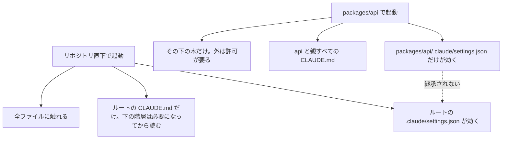
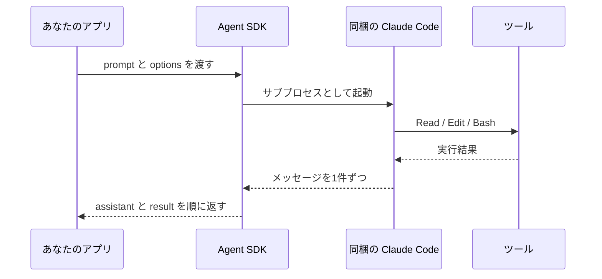
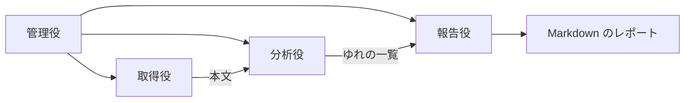

# Claude Daily — 2026-10-07（第046号）

## きょうの3行

- どこで `claude` を起動したかが、読まれる規約と設定を決めます。
- `CLAUDE.md` は親まで遡って読まれ、プロジェクト設定は遡りません。
- 連載は第40回 Agent SDK。入口は `query()` の1本だけです。

## ① ベストプラクティス — 起動ディレクトリを決めてから、設定を自己完結させる

> 起動ディレクトリが、読まれる `CLAUDE.md` と設定を決めます。
> `CLAUDE.md` は親まで遡って連結されます。
> プロジェクト設定は遡りません。置き場所を間違えると黙って無視されます。

### 何を解決するのか

モノレポで無関係なパッケージの規約まで読まれると、その分だけ文脈が埋まります。
起動位置をパッケージ直下に下げると、読まれる範囲も下がります。
ただし下げた先で設定が効かなくなる落とし穴があります。



図1: 起動位置で読まれるものが変わる。設定だけが親まで遡らない

| 起動位置 | 触れるファイル | 起動時に読む `CLAUDE.md` | 向く作業 |
|---|---|---|---|
| リポジトリ直下 | 全ファイル | ルートのみ。下の階層は必要時 | 複数パッケージをまたぐ変更 |
| パッケージ直下 | その下の木だけ | そのディレクトリと親すべて | 1パッケージに閉じた変更 |

### 設定を1枚で完結させる

パッケージ直下の設定は、ルートに書いたものを引き継ぎません。
だから必要なキーはすべてこの1枚に書きます。

`packages/api/.claude/settings.json`:

```json
{
  "permissions": {
    "additionalDirectories": ["../shared"],
    "deny": [
      "Read(./**/dist/**/*)",
      "Read(./**/build/**/*)",
      "Read(./**/*.generated.*)"
    ]
  },
  "worktree": {
    "sparsePaths": [".claude", "packages/api", "packages/shared"],
    "symlinkDirectories": ["node_modules"]
  }
}
```

ディレクトリの拒否は `/**/*` で閉じます。
`/**` で閉じるとディレクトリ自身も対象になり、`ls dist` すら通らなくなります。

worktree を作ると作業ディレクトリは worktree のルートに移ります。
パッケージ直下の設定はそこで読まれないので、拒否はルートにも1枚置きます。

`.claude/settings.json`:

```json
{
  "permissions": {
    "deny": [
      "Read(./**/dist/**/*)",
      "Read(./**/build/**/*)"
    ]
  }
}
```

### 着弾を確かめる

```bash
cd packages/api && claude
```

`/context` の Memory files 欄で読まれた `CLAUDE.md` を、`/permissions` で効いている拒否を見ます。

### アンチパターン

#### ❌ ルートにだけ拒否を書き、パッケージから起動する

```json
{
  "permissions": {
    "deny": ["Read(./**/dist/**/*)"]
  }
}
```

`cd packages/api && claude` では、このファイルは読まれません。
プロジェクト設定は親から継承されないので、エラーも警告も出ずに無視されます。
`CLAUDE.md` は遡って読まれるため、「規約は効いているのに拒否だけ効かない」という形で現れます。

#### ✅ 自分用はリポジトリ直下の `settings.local.json` に絶対パスで書く

```json
{
  "permissions": {
    "deny": ["Read(//home/you/monorepo/**/vendor/**/*)"]
  }
}
```

リポジトリ直下の `.claude/settings.local.json` は、どこから起動しても読まれます（v2.1.211 以降）。
ただし `./` 始まりの相対パターンはセッションの作業ディレクトリを基準に解決されます。
リポジトリを基準にしたいなら、`//` で始まる絶対パスで書きます。

- 出典: [Set up Claude Code in a monorepo or large codebase](https://code.claude.com/docs/en/large-codebases)
- 出典: [Configure permissions](https://code.claude.com/docs/en/permissions)

## ② 深掘り連載 第40回 — Agent SDK で自作エージェントを組む

> Agent SDK は Claude Code を library として呼ぶ道具です。
> 入口は `query()` の1本。`options` で道具と権限を決めます。
> Claude Code のバイナリは同梱。鍵は環境変数で渡します。

### 何が手に入るのか

Claude Code の agent loop・組み込みツール・権限・セッションが、そのままライブラリになります。
`.claude/` のスキルやフックも Claude Code と同じように読まれます。
言語は Python と TypeScript の2つです。



図2: アプリは待たずに受け取る。`query()` は async iterator を返す

### 4つの口の使い分け

| やりたいこと | 使うもの | 手に入るもの |
|---|---|---|
| 自分のプロセスで Claude Code のエージェントを動かす | Agent SDK | ツール・権限・セッション・フック込みのライブラリ |
| 端末で対話しながら進める | Claude Code CLI | 日常の対話向けの端末インターフェース |
| Claude API を自分のコードから叩く | Client SDK | ループは自作。beta の tool runner に任せる選択もある |
| 実行基盤を Anthropic に持たせる | Managed Agents | ホストされた agent harness とサンドボックス |

Python と TypeScript 以外から同じループを回すなら、CLI を `-p` と `--output-format json` で叩きます。

### 最小の形

```bash
npm install @anthropic-ai/claude-agent-sdk
npm install --save-dev tsx
export ANTHROPIC_API_KEY=your-api-key
```

`agent.ts`:

```typescript
import { query } from "@anthropic-ai/claude-agent-sdk";

for await (const message of query({
  prompt: "Review src/lib/format.ts for bugs that would cause crashes. Fix any issues you find.",
  options: {
    allowedTools: ["Read", "Edit", "Glob"],
    permissionMode: "acceptEdits"
  }
})) {
  if (message.type === "assistant" && message.message?.content) {
    for (const block of message.message.content) {
      if ("text" in block) {
        console.log(block.text);
      } else if ("name" in block) {
        console.log(`Tool: ${block.name}`);
      }
    }
  } else if (message.type === "result") {
    console.log(`Done: ${message.subtype}`);
  }
}
```

```bash
npx tsx agent.ts
```

既存プロジェクトが CommonJS なら、ファイル名を `agent.mts` にします。
拡張子が `.mts` なら tsx が ES モジュールとして扱うので、トップレベルの `await` が通ります。

### 社内 API を道具として渡す

`tool()` で関数を1つ定義し、`createSdkMcpServer()` でまとめます。
別プロセスの MCP サーバーを立てずに、同じプロセスの中で動きます。

```typescript
import { tool, createSdkMcpServer } from "@anthropic-ai/claude-agent-sdk";
import { z } from "zod";

const search = tool(
  "search",
  "Search the web",
  { query: z.string() },
  async ({ query }) => {
    return { content: [{ type: "text", text: `Results for: ${query}` }] };
  },
  { annotations: { readOnlyHint: true, openWorldHint: true } }
);

const server = createSdkMcpServer({
  name: "my-server",
  version: "1.0.0",
  tools: [search]
});
```

`options.mcpServers` に `{ "my-server": server }` を渡すと、Claude がこの道具を選べます。

### 使うべき時／使うべきでない時

| 使うべき時 | 使うべきでない時 |
|---|---|
| 自分が運用するプロセスにエージェントを埋める | 端末で対話したい。CLI を使う |
| `.claude/` のスキル・権限・フックをそのまま効かせる | ツールを1〜2個呼ぶだけ。Client SDK で足りる |
| 権限モードや許可ツールを自分のコードで決める | 実行環境を持ちたくない。Managed Agents に寄せる |
| 言語が Python か TypeScript | それ以外の言語。CLI を `-p` で叩く |

claude.ai のログインや利用枠を自社製品の利用者に提供する使い方は、事前承認がなければ認められていません。
認証は API キーの方式を使います。

- 出典: [Agent SDK overview](https://code.claude.com/docs/en/agent-sdk/overview)
- 出典: [Agent SDK Quickstart](https://code.claude.com/docs/en/agent-sdk/quickstart)
- 出典: [Agent SDK reference - TypeScript](https://code.claude.com/docs/en/agent-sdk/typescript)

## ③ すぐ効くTIPS

### 1. Agent SDK は `.env` を読まない

鍵を読むのは、エージェントを走らせたプロセスの環境変数だけです。
`.env` を置いただけでは `ANTHROPIC_API_KEY` は渡らず、`Not logged in` で止まります。

```typescript
import "dotenv/config";
import { query } from "@anthropic-ai/claude-agent-sdk";
```

### 2. `npm ci --omit=optional` でバイナリが落ちる

TypeScript SDK は Claude Code のバイナリを npm の optional dependencies で入れます。
optional を外した CI では、同梱バイナリなしでインストールされます。

```typescript
const options = {
  allowedTools: ["Read", "Glob"],
  pathToClaudeCodeExecutable: "/usr/local/bin/claude"
};
```

optional を外さず入れ直すか、ネイティブ版を入れて上のようにパスを指します。

### 3. スキルの説明は「依頼に出る語」を先頭に置く

Claude は全スキルの `name` と `description` を読んで1つ選びます。
数が増えると、説明が表示されなくなるスキルが出ます。
そうなると、Claude が選ぶ手がかりが消えます。

```markdown
---
name: api-testing
description: Testing patterns for the API package. Use when writing or modifying tests in packages/api/.
---
```

- 出典: [Agent SDK Quickstart](https://code.claude.com/docs/en/agent-sdk/quickstart)
- 出典: [Set up Claude Code in a monorepo or large codebase](https://code.claude.com/docs/en/large-codebases)

## ④ 事例

### 1. 12名に配って3か月、効果と同時に負荷も出た（チーム展開）

Readyfor の技術ブログが、全エンジニアへ配って3か月後の社内アンケートを公開しているという報告があります。

| 項目 | 値 |
|---|---|
| 対象 | エンジニア12名 |
| 毎日使う | 67% |
| 満足度 | 5点中3.8 |
| 生産性が上がった | 83%（10名） |
| 1日1〜2時間の削減 | 66%（8名） |
| 並行タスクが増えた | 66.7%（8名） |
| 疲労が増した | 42%（5名） |
| コード品質のばらつき | 66.7%（8名） |
| プロジェクト規約との不一致 | 50%（6名） |
| 勉強会を望む | 67%（8名） |

生産性の数字と並んで、認知負荷・疲労・品質のばらつきが同じ調査に出ている点が読みどころです。
打ち手として挙がったのは、勉強会・事例集・負荷を見た割り当て・四半期ごとの再調査の4つでした。

出典: [Claude Code導入3ヶ月後の社内アンケートから分かったこと](https://zenn.dev/readyfor_blog/articles/a1cfd81a562e07)（Zenn / Readyfor、2025-10-23、二次情報）

### 2. 用語ゆれの検査を4つの役に割った（Agent SDK）

KIYO Learning が、記事間の用語ゆれの検査を Agent SDK で自動化したという報告があります。



図3: 役を4つに割り、管理役が順番を決める

| 役 | 担当 | モデル |
|---|---|---|
| 管理役 | 全体の流れと子エージェントの調整 | Sonnet 4.5 |
| 取得役 | 指定 URL から本文を取り出す | Haiku 4.5 |
| 分析役 | 複数文書を比べて表記の違いを分類 | 記載なし |
| 報告役 | Markdown のレポートに整える | 記載なし |

Python 版の SDK、`AgentDefinition`、`ClaudeSDKClient`、`@tool` デコレータ、Amazon Bedrock を使った構成です。
削減時間や処理件数などの数値は示されていません。

出典: [Agentic Workflowの設計と実践：Claude Agent SDKで社内のコンテンツチェックを自動化する](https://qiita.com/Kumacchiino/items/a7ac8c3526b1ab872b4b)（Qiita / KIYO Learning、2025-12-16、二次情報）

## ⑤ 速報 — 新機能・変更点

前回チェックは v2.1.289 と Platform の 10/1 まででした。差分は次のとおりです。

| いつ | 何が | どう効くか |
|---|---|---|
| v2.1.292 | `claude plugin install` に `--marketplace <source>`（`<source>` は取得元）、Agent ツールに `effort`、`CLAUDE_CODE_OVERLOADED_RETRY_BASE_DELAY_MS`、mod の `prompt.autocomplete` | 配布が1コマンドで済む。サブエージェントの労力を呼ぶ側で決められる |
| v2.1.291 | v2.1.290 と v2.1.288 の退行修正 | クラウドセッションの許可応答の取りこぼしと、終了時の末尾メッセージの消失が直った |
| v2.1.290 | mod の `turn.step` の結果に `serverToolUses`、フックの `tool.check` に `agentId` | サブエージェントごとに判定を分けられる |
| 2026-10-05 | Models API に `capabilities.thinking.types.disabled` | 思考を切れるモデルかを、ID から推測せず問い合わせで判別できる |

- 出典: [Claude Code CHANGELOG](https://github.com/anthropics/claude-code/blob/main/CHANGELOG.md)
- 出典: [Claude Platform release notes](https://platform.claude.com/docs/en/release-notes/overview)

## ⑥ コマンド早見

| コマンド | 何をするか |
|---|---|
| `cd packages/api && claude` | パッケージ直下から起動し、その階層の設定と規約を読ませる |
| `/context` | 読み込まれた `CLAUDE.md` とルールの一覧を見る |
| `/permissions` | いま効いている許可・拒否ルールを見る |
| `claude --add-dir ../shared` | 起動時に別ディレクトリへの読み書きを足す |
| `npm install @anthropic-ai/claude-agent-sdk` | Agent SDK を入れる |
| `npx tsx agent.ts` | TypeScript で書いたエージェントを走らせる |
| `claude plugin install <plugin> --marketplace <source>` | マーケットプレイスの追加と導入を1コマンドで済ませる |

## ⑦ きょうの課題

**前提**: Next.js のリポジトリを1つ用意します。手元になければ `npx create-next-app@latest daily-046` で作ります。

**狙い**: プロジェクト設定が親から継承されないことを、自分の目で確かめます。

**手順**

1. リポジトリ直下に `mkdir -p packages/web/.claude` でディレクトリを作ります。
2. リポジトリ直下の `.claude/settings.json` に拒否を1本だけ書きます。

```json
{
  "permissions": {
    "deny": ["Read(./**/dist/**/*)"]
  }
}
```

3. `cd packages/web && claude` で起動し、`/permissions` の拒否一覧を見ます。
4. 同じ内容を `packages/web/.claude/settings.json` にも書き、セッションを開き直して `/permissions` をもう一度見ます。

**確認方法**: 3 と 4 で `Read(./**/dist/**/*)` が一覧に出るかどうかを比べます。

── 模範解答 ──

3 では出ません。4 では出ます。

| 手順 | `/permissions` の拒否一覧 | 理由 |
|---|---|---|
| 3 | 出ない | 起動したのは `packages/web`。親の設定は読まれない |
| 4 | 出る | 起動した階層の `.claude/settings.json` だから読まれる |

`CLAUDE.md` は親まで遡って連結されるので、規約だけは 3 でも効いています。
「規約は効くのに拒否が効かない」という形で現れるのが、この落とし穴の見分け方です。

**よくある詰まりどころ**

- 出ない原因をパターンの書き方だと考えて、`Read(**/dist/**)` などを試し続ける。原因は置き場所です。
- リポジトリ直下の `.claude/settings.local.json` はどこから起動しても読まれる（v2.1.211 以降）ので、ルートの `settings.json` と挙動を混同する。
- `./` 始まりの相対パターンは作業ディレクトリ基準。リポジトリ基準にしたいなら `//` 始まりの絶対パスで書く。
- `--worktree` を付けると作業ディレクトリが worktree のルートへ移るので、パッケージ直下の設定はそこで読まれない。

あすは第41回「エージェント設計パターン（単一 vs マルチ）」です。
