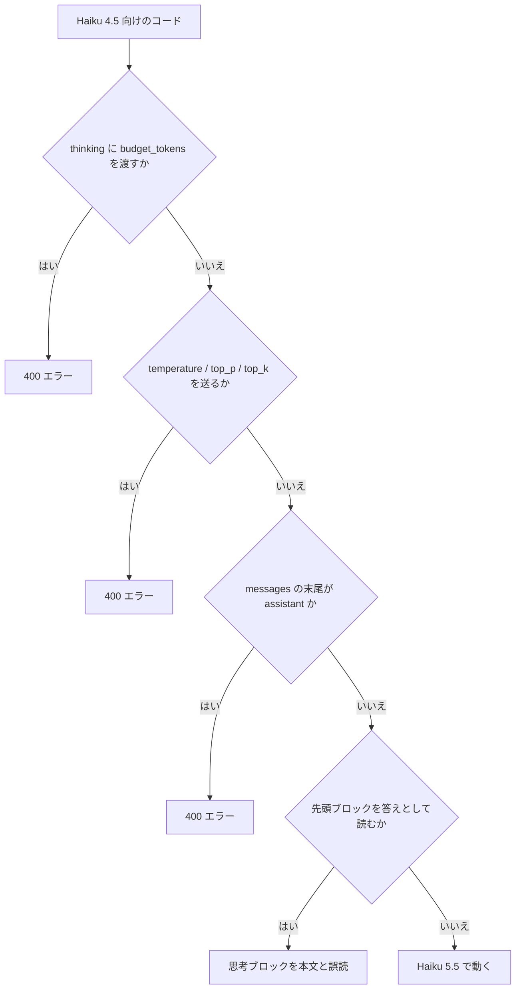
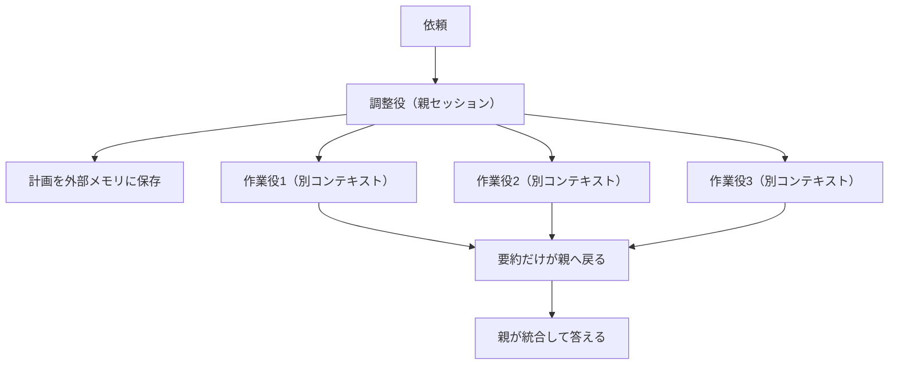
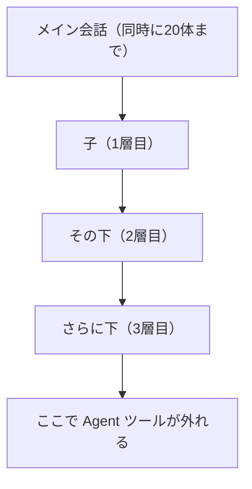

# Claude Daily — 2026-10-08（第047号）

## きょうの3行

- Claude Haiku 5.5 が公開。モデル名の差し替えだけだと API が 400 を返します
- 連載第41回。並列が効くのは「独立・大量・高価値」が揃うときだけです
- Sonnet 5.5 のキャッシュ読みが $0.20 から $0.10 per MTok に下がりました

## ① ベストプラクティス — モデルを上げる前に、返り値の読み方を直す

> - モデル ID の差し替えだけでは 400 が返ります
> - 壊れるのは思考指定・先頭ブロック・サンプリング・プレフィル
> - 棚卸しは `/claude-api migrate` に任せ、確認は手でします

Haiku 5.5 が 10月7日に公開されました。安くて速いので、分類や抽出を Next.js の route handler から呼んでいるなら乗り換えどきです。ただしモデル ID だけ替えると、動いていたリクエストが 400 で落ちます。



図1: Haiku 4.5 のコードが Haiku 5.5 で引っかかる4つの関門

| 旧（Haiku 4.5） | 新（Haiku 5.5） | 直さないと |
|---|---|---|
| `thinking: {"type":"enabled","budget_tokens":8000}` | `thinking: {"type":"adaptive"}` ＋ `output_config.effort` | 400 エラー |
| `temperature` / `top_p` / `top_k` を送る | 3つとも外す | 400 エラー |
| `messages` の末尾を assistant で止める | 末尾を user にし、構造化出力かツールで形を決める | 400 エラー |
| 先頭ブロックを答えとして読む | `type` が `text` のブロックを選ぶ | 思考ブロックを本文と誤読 |

リクエスト本文の差は次の2つです。`effort` が思考の深さのつまみになり、`budget_tokens` の代わりをします。

```json
{
  "model": "claude-haiku-4-5",
  "max_tokens": 16000,
  "thinking": { "type": "enabled", "budget_tokens": 8000 },
  "messages": [{ "role": "user", "content": "..." }]
}
```

```json
{
  "model": "claude-haiku-5-5",
  "max_tokens": 16000,
  "thinking": { "type": "adaptive" },
  "output_config": { "effort": "medium" },
  "messages": [{ "role": "user", "content": "..." }]
}
```

Next.js 側は、返ってきたブロックを `type` で選び直します。そのまま貼れる route handler は次の形です。

```ts
// app/api/classify/route.ts
import Anthropic from "@anthropic-ai/sdk";

const client = new Anthropic();

export async function POST(req: Request) {
  const { text } = await req.json();

  const res = await client.messages.create({
    model: "claude-haiku-5-5",
    max_tokens: 4096,
    messages: [
      { role: "user", content: `次の問い合わせを1語で分類してください。\n\n${text}` },
    ],
  });

  const answer = res.content
    .filter((block) => block.type === "text")
    .map((block) => block.text)
    .join("");

  if (res.stop_reason === "refusal") {
    return Response.json({ error: "refused" }, { status: 422 });
  }

  return Response.json({ answer, usage: res.usage });
}
```

#### ❌ 先頭ブロックを答えとして読む

```ts
const answer = res.content[0].text;
```

適応思考は既定でオンです。`thinking` を一言も書かなくても、レスポンスの先頭に思考ブロックが並びます。先頭を本文として読むコードは、空文字か署名だけを拾って静かに壊れます。

#### ✅ `type` でブロックを選ぶ

```ts
const answer = res.content
  .filter((block) => block.type === "text")
  .map((block) => block.text)
  .join("");
```

位置ではなく種類で選べば、Claude が考えたときも考えなかったときも同じコードで読めます。思考トークンは `max_tokens` に含まれます。上限が小さいと思考だけで打ち切られ、`stop_reason` は `max_tokens` になります。

棚卸しは手でやらなくてよく、`/claude-api migrate this project to claude-haiku-5-5` が同梱スキルを呼びます。スキルは編集前に対象範囲を確認し、終わったら手で確かめる項目の一覧を出します。

| 項目 | Haiku 4.5 | Haiku 5.5 |
|---|---|---|
| コンテキストの上限 | 200k | 1M |
| 出力の上限 | 64k | 128k |
| 同じ文のトークン数 | 基準 | 約30%増 |
| 既定の `effort` | 非対応 | `medium` |
| 入力／出力（10万トークン以下） | — | $0.10 / $0.50 per MTok |

トークンの数え方が変わった点は見落としやすいところです。同じプロンプトが約30%増えるので、`max_tokens` と見積りは数え直します。

出典: [Claude Haiku 5.5 migration guide](https://platform.claude.com/docs/en/models/haiku-5-5/migration-guide)
出典: [What's new in Claude Haiku 5.5](https://platform.claude.com/docs/en/models/haiku-5-5/whats-new-haiku-5-5)
出典: [Claude Haiku 5.5 overview](https://platform.claude.com/docs/en/models/haiku-5-5/overview)

## ② 深掘り連載 第41回 — エージェント設計パターン（単一 vs マルチ）

> - 分けるかは「独立・容量・価値」の3つで決めます
> - マルチはチャットの約15倍のトークンを使います
> - コーディングは直列が多く、既定は単一です

マルチエージェントの基本形は、調整役と作業役に分ける形です。調整役が計画を立てて作業役に配ります。作業役は別のコンテキストで動き、要約だけを調整役に返します。



図2: 調整役と作業役に分けた形。境界で情報が要約に絞られる

作業役は調整役の会話履歴を見ません。読んだファイルも、呼んだスキルも引き継ぎません。指示文に書き忘れた前提は、作業役には届きません。

| 方式 | 向く仕事 | 向かない仕事 |
|---|---|---|
| 単一（メイン会話だけ） | 往復が多い／工程間で文脈を共有する／小さく狙った修正 | 出力が大量で文脈を汚す調査 |
| サブエージェント | 自己完結して要約で返せる／ツールを絞りたい／安いモデルに流したい | 会話履歴を前提にする作業（フォークは例外） |
| 別セッション | 1つのコンテキストに収まらない量／長時間の並列 | 短い調査。立ち上げの手間のほうが大きい |

分量の目安も公開されています。何体使うかを指示に書かないと、単純な依頼にも大量のサブエージェントが呼ばれます。

| 仕事の型 | エージェント数 | 1体あたりのツール呼び出し |
|---|---|---|
| 単純な事実調べ | 1体 | 3〜10回 |
| 2〜3案の直接比較 | 2〜4体 | 各10〜15回 |
| 広く浅い調査 | 10体超（担当を明示する） | 担当ごとに決める |

| 値 | 何の数字か |
|---|---|
| 約4倍 | 単一エージェントが使うトークン（チャット比） |
| 約15倍 | マルチエージェントが使うトークン（チャット比） |
| 90.2% | 社内の調査評価で単一 Opus 4 を上回った差 |
| 80% | BrowseComp の成績差のうちトークン使用量で説明できる割合 |

数字の読み方には注意が必要です。90.2% は調査タスクの結果で、コーディングには直接当てはまりません。コーディングは前の工程の結果を待つ場面が多く、同時に進められる作業が調査より少ないと整理されています。

| 症状 | 原因 | 手当て |
|---|---|---|
| 単純な依頼に大量のサブエージェントが立つ | 何体使うかの目安が指示にない | 依頼文に体数と打ち切り条件を書く |
| 2体が同じ範囲を調べる | 担当の境界が曖昧 | 目的・出力形式・範囲外を1体ごとに書く |
| 作業役の報告が調整役のコンテキストを埋める | 進捗の報告が多すぎる | 返すのは結論と根拠だけに絞る |
| 結果が戻った瞬間に調整役が詰まる | 並列数が多く、要約が一度に届く | 同時実行数を下げ、返す分量を指定する |

Claude Code 側の既定も押さえておきます。サブエージェントは、さらに下のサブエージェントを呼べます。深さはメイン会話から3層下まで、同時実行は20体までが既定です。

| 用語 | 意味 |
|---|---|
| 調整役 | 依頼を分解して作業役に配り、戻ってきた要約をまとめる側 |
| フォーク | 会話履歴・モデル・キャッシュを引き継ぐサブエージェント。`/subtask` で呼ぶ |
| 入れ子の上限 | サブエージェントがさらに下を呼べる深さ。既定は3層 |

判断は3つを順に見ます。まず作業どうしが独立しているか。次に1つのコンテキストに収まるか。

最後に、増えるトークンに見合う価値があるか。3つ揃わなければ単一のままが安全です。

出典: [Custom subagents in Claude Code](https://code.claude.com/docs/en/sub-agents)
出典: [How we built our multi-agent research system](https://www.anthropic.com/engineering/multi-agent-research-system)

## ③ すぐ効くTIPS

### 1. 思考の中身を戻してもらう

Haiku 5.5 は既定で思考ブロックの本文を返しません。入っているのは署名だけです。挙動を追うときは表示を明示します。

```json
{ "thinking": { "type": "adaptive", "display": "summarized" } }
```

出典: [Claude Haiku 5.5 migration guide](https://platform.claude.com/docs/en/models/haiku-5-5/migration-guide)

### 2. 子の増えすぎを環境変数で止める

既定では3層下まで呼べて、同時に20体まで動きます。暴走の芽を先に摘むなら、深さと同時数を settings.json で下げます。



図3: 入れ子は既定で3層まで。深さと同時数は別々の環境変数で絞る

```json
{
  "env": {
    "CLAUDE_CODE_MAX_SUBAGENT_SPAWN_DEPTH": "1",
    "CLAUDE_CODE_MAX_CONCURRENT_SUBAGENTS": "4"
  }
}
```

パスは `.claude/settings.json` です。深さ `1` で入れ子が切れます。

### 3. 調整役が呼べる子を名前で限定する

`tools` に `Agent(...)` と書くと、呼び出せるサブエージェントを名前で絞れます。役を増やしたときの誤爆が減ります。

```markdown
---
name: coordinator
description: 調査を分割して作業役に割り当てる調整役
tools: Agent(worker, researcher), Read, Bash
model: sonnet
---

依頼を独立した単位に割り、worker と researcher にだけ配ってください。
各担当には目的・出力形式・範囲外を明記します。
```

パスは `.claude/agents/coordinator.md` です。

出典: [Custom subagents in Claude Code](https://code.claude.com/docs/en/sub-agents)

## ④ 事例

### 1. 5人で4か月、7週間で100万回動いた（チーム／業務展開）

Zendesk は顧客が自分でサービス用エージェントを組める仕組みを作りました。土台は Claude Sonnet 4.6 で、作るのに Claude Code と Agent SDK を使っています。

| 値 | 何の数字か |
|---|---|
| 100万回 | 早期アクセス7週間でのカスタムエージェント実行回数 |
| 最大80% | 顧客側の人手による処理時間の削減幅 |
| 最大10% | 自動解決率の上昇幅 |
| 5人／4か月 | 概念実証から早期アクセスまでの体制と期間 |
| 15指標 | 新モデルが出るたびに回す社内評価の指標数 |
| 約30分 | 顧客がエージェントを1つ用意する時間（以前は数か月） |

モデル選定の基準が目を引きます。トークン単価ではなく、1タスクあたりの費用で見ていると述べられています。結論までの手数が少なく済む点も、選定理由に挙がっています。

出典: [Zendesk — Claude customer story](https://claude.com/customers/zendesk)

### 2. 「定義」と「実行」は別物だった

10体を tmux で並べた構成を読み解いた記事があります。内訳は調整役1・管理役1・作業役8で、状態は YAML、合図は `tmux send-keys` です。

| 値 | 何の数字か |
|---|---|
| 10体 | 並べたセッション数（調整役1・管理役1・作業役8） |
| 毎分約108回 | 9体を5秒ごとに巡回させた場合のリクエスト数の試算 |
| 月100〜200ドル | 10体を動かす費用として挙げられた額 |

要点は「スキルを呼ぶだけでは単一エージェントのままだ」という指摘だと報告されています。巡回の試算が重いため、常時の巡回をやめ、必要なときだけ合図を送る形にしたとのことです。

出典: [Claude Code のマルチエージェント実行を理解する（Zenn、2026-02-18、二次情報）](https://zenn.dev/imudak/articles/claude-code-multi-agent-shogun)

## ⑤ 速報 — 新機能・変更点

前回チェックは v2.1.292 と Platform の10月5日分でした。差分は次のとおりです。

| いつ | 何が | どう効くか |
|---|---|---|
| 10-07 | Claude Haiku 5.5（`claude-haiku-5-5`）公開 | 1M 文脈・出力128k・適応思考。既定 `effort` は `medium`。退役は2027-10-07 以降 |
| v2.1.293 | Haiku 5.5 が API 既定の Haiku モデルに | Claude Code から Haiku を指定したときの実体が変わる |
| v2.1.293 | `subagentStatusLine` に `agentType`、mod の `$.tool.register` に `isDeferred` | ステータス行で役を出し分けられる |
| v2.1.293 | 待機中のスキル同期の巡回が約10分から約40分へ | 待機セッションの無駄な通信が減る |
| v2.1.293 | 退行の差し戻し2件（v2.1.281 の auto mode 拒否文、v2.1.290 のクラウド起床） | 挙動が一時的に以前へ戻る |
| 10-07 | Sonnet 5.5 のキャッシュ読みが $0.20 から $0.10 per MTok へ | 基本入力単価の 0.05 倍。書き込みと他の単価は据え置き |
| 10-07 | Max と Team に毎月の API クレジット | 購読者が API を試すときの元手になる |
| 10-07 | Python / TypeScript SDK に browser use と computer use のクラス（ベータ） | 1メソッド書けば、ツールのループと承認処理は SDK 側が回す |
| 10-07 | Managed Agents の `limited` で `allowed_hosts` が `web_search` と `web_fetch` にも効く | 許可外のホストは `url_not_allowed` が返る |
| 10-06 | Models API に `capabilities.server_tools` | web search とコード実行を使えるモデルかを問い合わせで判別できる |
| 10-08 | Compliance API のチャット取得が統合版 Claude の会話も返す（Enterprise 向けベータ） | 既存の Compliance Access Key のまま対象が広がる |

出典: [Claude Code CHANGELOG](https://github.com/anthropics/claude-code/blob/main/CHANGELOG.md)
出典: [Claude Platform release notes](https://platform.claude.com/docs/en/release-notes/overview)
出典: [Introducing Claude Haiku 5.5](https://www.anthropic.com/claude-haiku-5-5)

## ⑥ コマンド早見

| コマンド | 何をするか |
|---|---|
| `/claude-api migrate this project to claude-haiku-5-5` | 同梱スキルがモデル移行の書き換えと確認項目の一覧を出す |
| `/subtask <task>` | 会話履歴を引き継ぐフォークを呼ぶ。`<task>` は任せる作業 |
| `claude --agent coordinator` | セッション全体を `coordinator` の定義で動かす |
| `rg -n 'budget_tokens\|temperature\|top_p\|top_k' --glob '!node_modules' .` | 移行で 400 になる引数の在処を洗い出す |
| `npx tsc --noEmit` | 書き換えたあとの型だけを確かめる |

## ⑦ きょうの課題

> - 自分のリポジトリで「400 になる4点」を洗い出します
> - 直すのは1箇所だけ。残りは一覧にして置きます
> - 所要は10〜15分です

**前提**: Next.js のリポジトリで `@anthropic-ai/sdk` を呼んでいる箇所が1つ以上あること。無ければ ① の route handler を `app/api/classify/route.ts` に置いてから始めます。

**手順**

1. `rg -n 'budget_tokens|temperature|top_p|top_k' --glob '!node_modules' .` を実行する
2. `rg -n 'content\[0\]' --glob '!node_modules' .` を実行する
3. `rg -n '"role": *"assistant"' --glob '!node_modules' .` で末尾のプレフィルを探す
4. ヒットのうち1箇所だけを ① の表のとおりに直す
5. `npx tsc --noEmit` を通す

**確認方法**: 手順1〜3のヒットが一覧になっていること。直した1箇所で型チェックが通ること。

── 模範解答 ──

| 手順 | 直し方 | なぜ |
|---|---|---|
| 1 | `temperature`・`top_p`・`top_k` は消す。`budget_tokens` は `thinking: {"type":"adaptive"}` と `output_config.effort` に替える | Haiku 5.5 はこの4つを受け取らず 400 を返す |
| 2 | `filter((block) => block.type === "text")` に置き換える | 位置で選ぶと、思考ブロックが付いたときだけ空文字になる |
| 3 | `messages` の末尾が assistant のときだけ直す | 会話の途中の assistant は正常。末尾のプレフィルだけが対象 |

手順2の壊れ方がいちばん厄介です。Claude が考えずに答えたときは正しく動くので、症状が出たり出なかったりします。

**よくある詰まりどころ**

| つまずき | 実際のところ |
|---|---|
| `temperature: 1` を消して直ったと考える | `1` は許される値。`top_p: 1` は既定と違うので 400 |
| `thinking` を書かなければ考えないと思う | 適応思考は既定でオン。書かなくても思考ブロックが付く |
| 出力が途中で切れる | 思考トークンが `max_tokens` を食っている。上限を上げるか `effort` を下げる |
| 400 の原因を1つだけ直して再試行する | 4点は独立。1つ直しても次の1つで落ちる |

あすの予告: 第42回はプロンプトキャッシュとトークンの経済学です。
