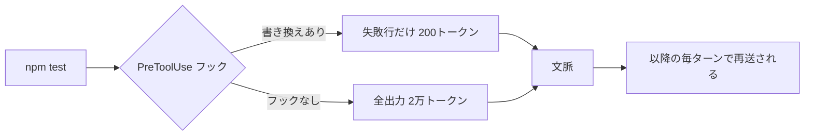
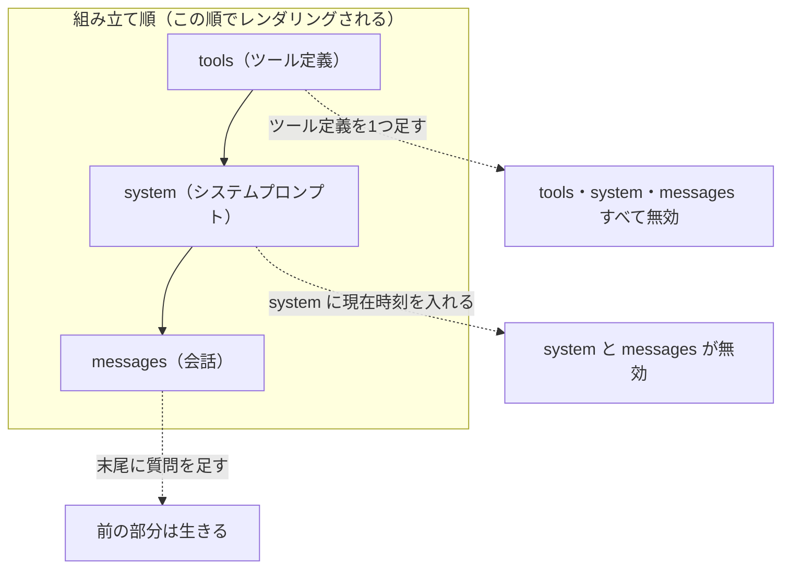
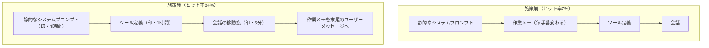

# Claude Daily — 2026-10-09（第048号）

## きょうの3行

- キャッシュ読みは入力の1割。5分書き込みは1.25倍で、2回使えば元が取れます。
- 文脈に入る前に削る。フックは1回書けば毎ターン効きます。
- 動的な文を前置きから外してヒット率7%→84%、という報告があります。

## ① ベストプラクティス — 文脈に入る前に削る

> テストの出力は、一度文脈に入ると毎ターン再送されます。
> CLAUDE.md の「失敗だけ見て」は助言で、守られる保証がありません。
> PreToolUse フックの `updatedInput` は、コマンド自体を書き換えます。



### 何を解決するのか

Claude は毎リクエストで会話全体を送り直します。
つまり1回入った2万トークンは、その後の手番すべてに乗り続けます。
削る場所は、読んだ後ではなく入る前です。

### そのまま動く設定

`.claude/settings.json` に置きます。

```json
{
  "hooks": {
    "PreToolUse": [
      {
        "matcher": "Bash",
        "hooks": [
          {
            "type": "command",
            "command": "~/.claude/hooks/filter-test-output.sh"
          }
        ]
      }
    ]
  }
}
```

スクリプトは `~/.claude/hooks/filter-test-output.sh` に置き、実行権限を付けます。

```bash
mkdir -p ~/.claude/hooks
chmod +x ~/.claude/hooks/filter-test-output.sh
```

```bash
#!/bin/bash
input=$(cat)
cmd=$(echo "$input" | jq -r '.tool_input.command')

# テスト実行なら、失敗部分だけを出すコマンドに差し替える
if [[ "$cmd" =~ ^(npm test|pytest|go test) ]]; then
  filtered_cmd="$cmd 2>&1 | grep -A 5 -E '(FAIL|ERROR|error:)' | head -100"
  echo "$input" | jq --arg filtered "$filtered_cmd" \
    '{hookSpecificOutput: {hookEventName: "PreToolUse", permissionDecision: "allow", updatedInput: (.tool_input + {command: $filtered})}}'
else
  echo "{}"
fi
```

確認は2手です。

```bash
claude --debug-file ./claude-debug.txt
```

`/hooks` を開き、PreToolUse の下にスクリプトが並んでいるか確かめます。
そのうえで `npm test` を頼みます。

書き換えが効いていれば、ログに `modified tool input keys` の行が出ます。
その行に `command` が並びます。

### アンチパターン

#### ❌ CLAUDE.md に「テストは失敗だけ見ること」と書く

```markdown
# Workflow
- テスト結果は失敗したケースだけ読むこと
```

CLAUDE.md の指示は助言です。
Claude が `npm test` を素で打った時点で、全出力が文脈に入ります。
入った後に「読まない」と決めても、トークンはもう乗っています。

#### ✅ 入口のフックで、コマンド自体を書き換える

```json
{ "type": "command", "command": "~/.claude/hooks/filter-test-output.sh" }
```

フックは決定的に走ります。
Claude がどう打っても、文脈に入るのは絞られた後の出力です。

| 置き場所 | 効き方 | 守られるか |
|---|---|---|
| CLAUDE.md の文 | 助言。Claude の判断に委ねる | 保証なし |
| PreToolUse フック | 実行前にコマンドを差し替える | 決定的 |

出典: [Manage costs effectively — Offload processing to hooks and skills](https://code.claude.com/docs/en/costs#reduce-token-usage)

出典: [Hooks reference](https://code.claude.com/docs/en/hooks)

## ② 深掘り連載 第42回 — プロンプトキャッシュとトークンの経済学

> キャッシュは前方一致です。前置きが1バイト変われば以降は全部死にます。
> 読みは基本入力の0.1倍。書き込みは5分で1.25倍、1時間で2倍です。
> 5分なら2回、1時間なら3回使って元が取れます。



### 単価の倍率

基本入力トークンの価格に対する倍率です。

| 項目 | 倍率 | 備考 |
|---|---|---|
| 5分キャッシュの書き込み | 1.25倍 | 既定のTTL |
| 1時間キャッシュの書き込み | 2倍 | `ttl` を明示したとき |
| キャッシュの読み | 0.1倍 | 下の例外を除く |
| 読みの例外（Opus 5.5・Sonnet 5.5） | 0.05倍 | — |
| 読みの例外（Fable 5.1・Mythos 5.1） | 0.025倍 | — |

損益分岐は2つあります。
5分では、書き1.25倍と読み0.1倍の合計1.35倍が、素のまま2回送る2倍より安くなります。
1時間は書きが2倍なので、3回使ってようやく素の3回分より安くなります。

### 書き方

TypeScript で、固定部分に印を付けます。

```typescript
import Anthropic from "@anthropic-ai/sdk";

const client = new Anthropic();

const res = await client.messages.create({
  model: "claude-opus-5-5",
  max_tokens: 4096,
  system: [
    {
      type: "text",
      text: FROZEN_INSTRUCTIONS, // 起動時に1回読む。日付やUUIDを混ぜない
      cache_control: { type: "ephemeral", ttl: "1h" },
    },
  ],
  messages: [{ role: "user", content: question }], // 変わるものは最後
});

console.log(res.usage.cache_read_input_tokens); // 2回目以降 0 なら効いていない
console.log(res.usage.cache_creation);          // 5分/1時間の内訳
```

`usage` の3つを足すと総入力になります。

| フィールド | 中身 |
|---|---|
| `cache_read_input_tokens` | キャッシュから読まれた入力 |
| `cache_creation_input_tokens` | キャッシュに書かれた入力 |
| `input_tokens` | 最後の印より後ろ。キャッシュ対象外 |
| `cache_creation.ephemeral_5m_input_tokens` | うち5分TTLで書いた分 |
| `cache_creation.ephemeral_1h_input_tokens` | うち1時間TTLで書いた分 |

### TTL の選び方

寿命は、書いた／読んだリクエストの**開始**から数えます。
生成に4分かかれば、次は応答後の約1分以内に始めないと5分では切れます。
読みはTTLを無料で延ばすので、間隔が短いほど5分が有利です。

| プレフィックスを共有するリクエストの開始間隔 | 選ぶTTL |
|---|---|
| 5分未満（連続した対話、短い手番のループ） | 5分。毎回延びるので常に安い |
| 5〜60分（20分後に返信が来る、生成が5分を超える） | 1時間。2倍の書き込みが報われるのはこの範囲だけ |
| 1時間超 | どちらも効かない。温め直すか、冷えたまま払う |

### 使うべき時／使うべきでない時

| 状況 | 判断 | 理由 |
|---|---|---|
| 長いシステムプロンプトを何度も送る | 使う | 読みが0.1倍、節約がそのまま効く |
| 512トークン未満の前置き | 効かない | 最小長に届かず無言で素通し。エラーも出ない |
| 1日1回しか呼ばれない処理 | 使わない | 書き込みの割増だけ払って終わる |
| 前置きに現在時刻やUUIDが入る | 先に直す | 印を付けても毎回ミスする |

印は1リクエストに**4つ**まで置けます。
最小長はモデル次第で、Opus 5.5・Sonnet 5.5・Haiku 5.5・Fable 5.1 は512トークンです。
Opus 4.6・Opus 4.5・Haiku 4.5 は4,096トークンなので、世代が新しいほど小さいとは限りません。

用語の整理です。

| 用語 | 意味 |
|---|---|
| 前方一致 | 先頭から印までのバイト列が完全一致したときだけヒットする |
| TTL | キャッシュの寿命。既定5分、`ttl: "1h"` で1時間 |
| 印（ブレークポイント） | `cache_control` を付けた位置。1リクエスト4つまで |

出典: [Prompt caching — Claude Docs](https://platform.claude.com/docs/en/build-with-claude/prompt-caching)

## ③ すぐ効くTIPS

### 1. 圧縮で何を残すかを CLAUDE.md に書いておく

自動圧縮でテストコマンドが消えると、Claude は直後に調べ直します。
読み直した内容は、次の手番の入力にそのまま加わります。

```markdown
# Compact instructions

When you are using compact, please focus on test output and code changes
```

その場で指定するなら `/compact Focus on the API changes` です。

出典: [Manage costs effectively — Manage context proactively](https://code.claude.com/docs/en/costs#reduce-token-usage)

### 2. CLAUDE.md の重さは `count-tokens` で測る

CLAUDE.md は毎セッション先頭に乗ります。
`tiktoken` は OpenAI 用なので、Claude の実際のトークン数より1〜2割少なく数えます。

```bash
ant messages count-tokens --model claude-opus-5-5 \
  --message '{role: user, content: "@./CLAUDE.md"}' \
  --transform input_tokens -r
```

200行を超えていたら、常駐させる必要のない節を skills へ移します。

出典: [Token counting — Claude Docs](https://platform.claude.com/docs/en/build-with-claude/token-counting)

### 3. 一晩おいた大きいセッションは「要約から再開」を選ぶ

Pro と Max では、1時間以上空いた10万トークン超のセッションを再開すると、選択の画面が出ます。
キャッシュはもう切れているので、どれを選んでも全履歴の処理が1回だけ発生します。
差が出るのはその後で、要約を選べば以降の各リクエストが軽くなります。

```bash
claude --resume oauth-migration
```

出典: [Manage sessions — Resume from a summary](https://code.claude.com/docs/en/sessions#resume-from-a-summary)

## ④ 事例

### 動的な文を前置きから外したら、ヒット率が7%から84%になった

| 値 | 何の数字か |
|---|---|
| 7% → 84% | キャッシュヒット率（施策前 → 施策後） |
| 59% | 素の入力単価で払った場合に対する節約率 |
| 70% | 直近10日の節約率 |
| 98億 | キャッシュから返した累計トークン |
| 35.5% / 74.0% | 1手番のタスク / 20手番超のタスクのヒット率 |

ProjectDiscovery のセキュリティ検証基盤 Neo の報告です。
作業メモが静的なシステムプロンプトとツール定義の間に挟まっていて、ほぼ毎手番で前置きが壊れていた、としています。
動的な部分を末尾のユーザーメッセージへ移した翌日に、8%未満から74%へ上がったという報告があります。

印は3つ置いたとしています。
システムプロンプトとツール定義には1時間、会話の直近部分には5分を指定したそうです。
規模は平均26手番・40ツール呼び出しで、エージェントごとのシステムプロンプトは2万トークンを超えます。



出典: [How We Cut LLM Costs by 59% With Prompt Caching（ProjectDiscovery、2026-04-10、二次情報）](https://projectdiscovery.io/blog/how-we-cut-llm-cost-with-prompt-caching)

### チーム展開 — 計測の設定を組織設定で配って、本人には触らせない

CARTA HOLDINGS の fluct チームの報告です。
各自が `settings.json` に OTel を書く運用は続かないとしています。
設定の書き忘れが起き、送信用トークンの管理も個人任せになるためです。

Claude Team の管理画面から全員へ `settings.json` を配っているそうです。
集めた値は Splunk に送り、モデル別のコストを見ていると報告しています。

利用量の上位者を社内で公開したところ、「使ってみよう」が自然に増えたそうです。
使うように促すより効果があった、と報告者は書いています。

| 落とし穴 | 言っておくこと |
|---|---|
| 組織設定の変更は動いているセッションに効かない | `/login` でも反映しない。再起動が必要 |
| 個人アカウントへ切り替えてもその利用が組織へ送られる | 切り替える前に Claude Code を終了する |

配っていた環境変数は `CLAUDE_CODE_ENABLE_TELEMETRY` と OTLP の送信先です。
プロンプト本文の記録は `OTEL_LOG_USER_PROMPTS` を `0` にして止めていました。

出典: [OpenTelemetry 設定を組織設定で配布して、Claude Team に所属するユーザー全員の Claude Code 利用状況をSplunkで可視化した（CARTA TECH BLOG、2026-05-22、二次情報）](https://techblog.cartaholdings.co.jp/entry/otel-claude-team)

## ⑤ 速報 — 新機能・変更点

> Claude Code は v2.1.294 と v2.1.295 の2版。
> Platform のリリースノートは 10/8 以降に新しい項目なし。

| いつ | 何が | どう効くか |
|---|---|---|
| v2.1.295 | コマンドとHTTPフックに `onFailure: "block"` | 起動できず・時間切れ・想定外の終了コードのフックが、素通しではなく中断になる |
| v2.1.295 | MCPツールの説明の打ち切りが2,048→16,384文字 | ツール検索経由で読む説明が切れにくくなる |
| v2.1.295 | サブエージェントの `skills` の事前読み込みが最大32個 | 各1回まで。残りは Skill ツールで呼べる |
| v2.1.295 | `CLAUDE_CODE_RETRY_WATCHDOG_MAX_WAIT_MS` | 無人の再試行モードが429・529を待つ上限を決める |
| v2.1.295 | `[1m]` モデルの修正 | 接続先が文脈1Mベータを受け付けないとき、ベータを外して再送するようになった |
| v2.1.295 | `xhigh`・`max` での遅さの修正 | Web検索と `agent` フックの評価が長くかかる問題 |
| v2.1.294 | 指示文として書いたフックの判定の修正 | 「〜を禁止」と書いた `prompt`・`agent` フックが通してしまう問題 |

出典: [Claude Code CHANGELOG](https://github.com/anthropics/claude-code/blob/main/CHANGELOG.md)

出典: [Claude Platform リリースノート](https://platform.claude.com/docs/en/release-notes/overview)

## ⑥ コマンド早見

| コマンド | 何をするか |
|---|---|
| `claude --debug-file ./claude-debug.txt` | デバッグログをファイルに出す。フックの書き換えを確認する |
| `/hooks` | 設定されているフックを一覧する |
| `claude --resume oauth-migration` | 名前でセッションを再開する |
| `/compact Focus on the API changes` | 何を残すか指定して圧縮する |
| `/clear` | 文脈を捨てる。要約のリクエストが走らない |
| `ant messages count-tokens --model claude-opus-5-5 --message '{role: user, content: "@./CLAUDE.md"}' --transform input_tokens -r` | ファイルのトークン数を Claude のトークナイザで数える |
| `mkdir -p ~/.claude/hooks` | フック用のディレクトリを作る |
| `chmod +x ~/.claude/hooks/filter-test-output.sh` | フックのスクリプトに実行権限を付ける |

## ⑦ きょうの課題

Next.js のプロジェクトで、テスト出力を文脈に入る前に絞ります。所要10〜15分。

**前提**: `jq` が入っていること。`npm test` が1本でも失敗する状態を作っておくこと。

**手順**

1. `mkdir -p ~/.claude/hooks` で置き場を作る。
2. ①のスクリプトを `~/.claude/hooks/filter-test-output.sh` に保存し、`chmod +x` する。
3. ①の設定を `.claude/settings.json` の `hooks` に入れる。
4. `claude --debug-file ./claude-debug.txt` で起動する。
5. `/hooks` を開き、PreToolUse の下にスクリプトが出ることを見る。
6. 「`npm test` を実行して失敗を直して」と頼む。
7. `grep "modified tool input keys" ./claude-debug.txt` を打つ。

**確認方法**: 手順7の行に `command` が含まれていれば、書き換えが効いています。

── 模範解答 ──

手順7で次が出ます。

```bash
grep "modified tool input keys" ./claude-debug.txt
```

`command` を含む行が1件以上あれば成功です。
出ないときは `/hooks` に戻り、スクリプトのパスと実行権限を見ます。

**なぜそうなるのか**

- フックの標準出力の `updatedInput` が、Bash ツールへ渡る入力を差し替えます。
- `permissionDecision: "allow"` を付けているので、許可の確認も挟まりません。
- Claude が読むのは差し替わった後のコマンドの出力だけです。

**よくある詰まりどころ**

| 症状 | 原因 |
|---|---|
| 何も起きない | スクリプトに実行権限がない。終了コードは127で、非ブロックのまま素通しになる |
| `/hooks` に出ない | `matcher` が `Bash` になっていない |
| 全出力が入る | Claude が `npm test` ではなく `npm run test` を使っている。正規表現を直す |
| JSON が壊れる | `jq` が未インストール。`cmd` が空になる |

フックの発火順とハンドラーの種類は 2026-09-08 の号（第11回）にあります。

---

あすの予告: 第43回 評価（eval）の考え方。
