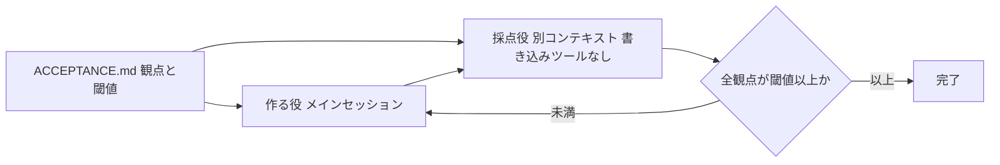
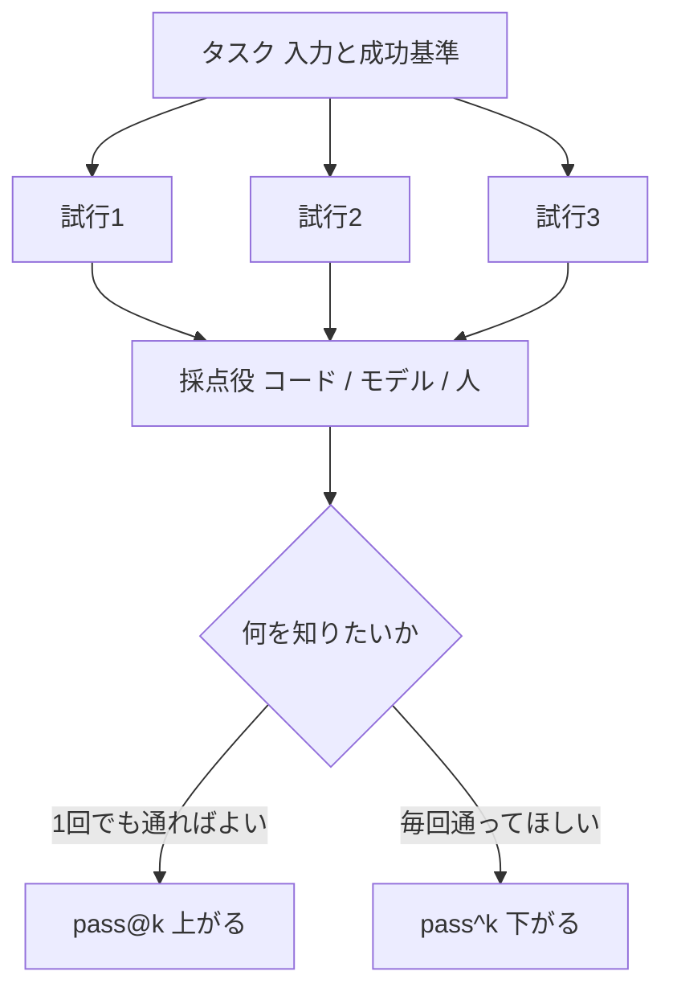
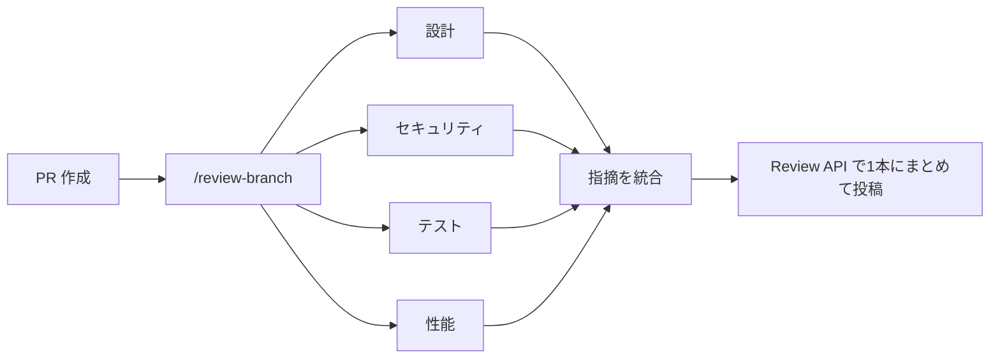

# Claude Daily — 2026-10-10（第049号）

## きょうの3行

- 採点の観点と閾値は、作らせる前にファイルへ置きます。
- 評価は20〜50タスクから。1回の試行では何も分かりません。
- 観点を4役に分け、ルールを1,600行に育てた報告があります。

## ① ベストプラクティス — 合格条件を先に書いて、採点役に渡す

> 作った本人に採点させると、甘く通ります。
> 基準のないレビューは、健全なコードにも指摘を出します。
> 観点・重み・閾値を、作らせる前にファイルへ置きます。



図1: 合格条件は作る役と採点役の両方に渡す。採点役は書き込みツールを持たない

長く走らせたときに壊れるのは、自己採点です。
Anthropic の実験では、エージェントが自分の出力を褒めると報告されています。

採点役を別に用意するほうが簡単だったとも書かれています。
作る役に自分の出力を疑わせるのは難しいからです。

### 観点は「落ちる条件」まで書く

実験では、主観的な出来に4つの観点を与え、作る役と採点役の両方に同じものを渡しました。

| 観点 | 見るもの | 重み | 落ちる条件 |
|---|---|---|---|
| Design quality | 全体として筋が通っているか | 高 | 観点ごとの固い閾値を1つでも下回る |
| Originality | 既定のテンプレートに逃げていないか | 高 | 同上 |
| Craft | 字組み・余白・配色・コントラスト | 中 | 同上 |
| Functionality | 見た目と切り離した使い勝手 | 中 | 同上 |

重みが高いのは前の2つです。残りの2つは既定でも十分な出来だったためです。
閾値を1つでも下回ると、そのスプリントは不合格として差し戻されます。

#### リポジトリ直下 `ACCEPTANCE.md`

```markdown
# 受け入れ条件: /api/todos の更新API

## 検証コマンド
- `npx tsc --noEmit`
- `npm test -- src/app/api/todos`

## 観点と閾値（5点満点。1つでも閾値未満なら不合格）
| 観点 | 見るもの | 重み | 閾値 |
|---|---|---|---|
| 正しさ | 検証コマンドが2本とも成功する | 3 | 5 |
| 契約 | 不正な body に 400、未存在IDに 404 を返す | 3 | 4 |
| 範囲 | この条件に書いていないファイルを触っていない | 2 | 5 |
| 可読性 | 既存の route handler と同じ書き方である | 1 | 3 |

## 範囲外
- 認証の追加、スキーマ変更、UI の変更

## 採点の出し方
観点ごとに「点数 / 根拠1行 / 落ちた場合の最小修正」を書く。
最後に「合格」か「不合格」の1語で締める。
```

#### `.claude/agents/acceptance-judge.md`

```markdown
---
name: acceptance-judge
description: ACCEPTANCE.md の受け入れ条件に対して、現在の差分と検証コマンドの結果を採点する。実装が終わったあとに使う。
tools: Read, Grep, Glob, Bash
model: opus
effort: high
color: orange
---

あなたは受け入れ条件の採点役です。実装はしません。

手順:
1. リポジトリ直下の `ACCEPTANCE.md` を読む。
2. `git diff` と `git status --short` で変更範囲を確かめる。
3. `ACCEPTANCE.md` の検証コマンドを順に実行し、出力をそのまま引用する。
4. 観点ごとに点数・根拠1行・最小修正を書く。
5. 1つでも閾値未満なら「不合格」と書く。

規則:
- `ACCEPTANCE.md` に書かれていない観点では減点しない。
- 正しさと、明記された要件に関わる指摘だけを挙げる。
- それ以外は「任意」と明示し、点数には反映しない。
- 根拠はコマンドの出力かファイルの行番号で示す。推測で減点しない。
```

呼び出しは1行です。

```text
acceptance-judge サブエージェントで、いまの差分を ACCEPTANCE.md に対して採点してください。
```

#### ❌ 「実装できたらレビューして」と頼む

```text
実装できたらレビューしてください。
```

基準がないと、採点役は自分で基準を作ります。
作られた基準は毎回ぶれるので、同じコードが日によって通ります。

さらに、指摘を探せと言われた採点役は、健全なコードにも指摘を出します。
抽象の層・防御的なコード・起こりえない場合のテストが足されて、設計が重くなります。

#### ✅ 観点・重み・閾値を書いたファイルを両方に渡す

```yaml
tools: Read, Grep, Glob, Bash
```

採点の対象が固定され、通ったか落ちたかが同じ基準で決まります。
「正しさと明記された要件だけを挙げ、残りは任意とする」の1文が、過剰な指摘を止めます。

`tools` に `Edit` と `Write` を入れないので、採点役は自分で直せません。
落ちた観点が差し戻しとして作る役に返り、ループが閉じます。

出典: [Harness design for long-running application development](https://www.anthropic.com/engineering/harness-design-long-running-apps)
出典: [Best practices for Claude Code — Add an adversarial review step](https://code.claude.com/docs/en/best-practices)
出典: [Subagents — Write subagent files](https://code.claude.com/docs/en/sub-agents)

## ② 深掘り連載 第43回 — 評価（eval）の考え方

> 評価とは「入力を与え、出力に採点ロジックを当てる」ことです。
> 1回の試行では測れません。同じタスクを複数回走らせます。
> 能力を測る eval と、回帰を止める eval は別物です。



図2: 1タスクを複数回走らせ、集計の向きで読み方が変わる

| 用語 | 意味 |
|---|---|
| タスク | 入力と成功基準が決まった1件のテスト |
| 試行 | タスクへの1回の挑戦。出力がぶれるので複数回走らせる |
| 採点役 | 性能の1側面を採点する仕組み。1タスクに複数置ける |
| トランスクリプト | 1試行の全記録。どの手順を通ったかが残る |
| 成果 | 実行後の最終状態。データベースに行ができたかなど |

### 試行は何回で、何を見るか

エージェントは何度もやり取りし、ツールを呼び、状態を変えます。
だから途中の誤りが積み上がり、1回の成功は実力の証明になりません。
そこで同じタスクを k 回走らせ、2つの向きで集計します。

| 集計 | 意味 | 使うとき |
|---|---|---|
| pass@k | k 回のうち1回でも成功する確率。k とともに上がる | 人が選び直せる作業 |
| pass^k | k 回すべて成功する確率。k とともに下がる | 利用者に直接届く機能 |

1試行あたり75%なら、pass^3 は 0.75 の3乗で約42%です。
同じ数字が、見る向きだけで「だいたい通る」と「3回に1回しか通しきれない」に変わります。

### 採点役は3種類で、優先順位がある

| 採点役 | 速さと費用 | 得意 | 弱点 |
|---|---|---|---|
| コード | 速い・ほぼ無料 | 完全一致、文字列一致、単体テスト、ツール呼び出しの検査 | 融通がきかず、含みのある判定ができない |
| モデル | 速い・課金あり | 自由記述、口調、観点の多い判定 | 出力がぶれる。人による校正が必要 |
| 人 | 遅い・高い | 最終的な品質の基準 | 件数を増やせない |

公式ドキュメントは、最も速く・最も確実で・最も件数を増やしやすい方法を選べと書いています。
つまりコードで書ける判定はコードに寄せ、残りをモデルに回し、人は校正に使います。
モデルに採点させるときは、合否の条件を具体的に書いた採点表を渡します。

### 何タスクから始めるか

数百件が必要だと思われがちですが、実際の失敗から取った20〜50件で十分に始められます。
出どころは手作業の確認、バグ管理票、問い合わせの記録です。
採点の目印は2つあります。

| 合格率 | 読み方 |
|---|---|
| 0% が続く | タスクが壊れている印。曖昧か、そもそも解けない指示になっている |
| 100% で止まる | 飽和。改善の信号が出ないので、タスクを難しくするか作り直す |

### 使うべき時 / 使うべきでない時

| 場面 | 判断 | 理由 |
|---|---|---|
| 同じ失敗が2回以上出た | 作る | 再発を止める回帰 eval の種になる |
| 新しいモデルに乗り換える | 作る | 乗り換えの可否を数字で決められる |
| 配るスキルやプラグインを変える | 作る | 他人の手元で壊れたことに気づけない |
| 仕様がまだ動いている | 待つ | 成功基準が決まらず、採点が毎回変わる |
| 1回しか走らせない作業 | 作らない | 作る手間が効果を上回る |
| 人の最終判断が必ず入る | 作らない | 採点の対象が人の側にある |

手順の順番で採点せず、成果で採点します。
別の道を通った正解を落とすと、改善の方向が狂います。

Claude Code の `claude plugin eval` が同じ考え方を実装しています。
詳しくは 2026-09-12 の号を参照してください。

出典: [Demystifying evals for AI agents](https://www.anthropic.com/engineering/demystifying-evals-for-ai-agents)
出典: [Define success criteria and build evaluations](https://platform.claude.com/docs/en/test-and-evaluate/develop-tests)

## ③ すぐ効くTIPS

### 1. 採点役には `memory` を付けない

`memory` を書くと、Read・Write・Edit が自動で有効になります。
採点役に書き込みツールが渡ると、採点の途中で直し始めます。

```markdown
---
name: repo-explorer
description: コードベースの構造を調べ、分かったことを記憶に残す
memory: project
---
```

記憶は `.claude/agent-memory/repo-explorer/` に置かれ、`MEMORY.md` の先頭200行が起動時に読まれます。
`autoMemoryEnabled` を切ると、この欄は効きません。

### 2. 遅いフックを名指しする

v2.1.296 から、`--debug` がフックのコマンド・プラグイン・結果・所要時間を終了時に出します。
これまでは「何かが遅い」までしか分かりませんでした。

```bash
claude --debug-file ./claude-debug.txt
grep -n "hook" ./claude-debug.txt
```

### 3. モデルに採点させるなら思考を入れる

採点役に思考を有効にしたモデルを使うと、点を出す前に理由を組み立てます。
公式ドキュメントは、判断の重い採点でとくに精度が上がると書いています。
あわせて、出力は「correct か incorrect」や1〜5の数字に固定します。

```json
{ "thinking": { "type": "adaptive" }, "output_config": { "effort": "high" } }
```

出典: [Subagents — Enable persistent memory](https://code.claude.com/docs/en/sub-agents)
出典: [Claude Code CHANGELOG v2.1.296](https://github.com/anthropics/claude-code/blob/main/CHANGELOG.md)
出典: [Define success criteria and build evaluations — Tips for LLM-based grading](https://platform.claude.com/docs/en/test-and-evaluate/develop-tests)

## ④ 事例

### 観点を4役に分け、ルールを1,600行に育てた（チーム展開）



図3: 観点ごとに採点役を分け、指摘を1つのレビューに束ねる

CyberAgent / MG-DX の技術ブログに、AIレビューを作り直した報告があります。
元は約100行の指針1枚で、設計・セキュリティ・性能の指摘が浅いままだったそうです。
観点を4つのサブエージェントに分け、根拠を `.claude/rules/` の5ファイルに移しました。

| 項目 | MG-DX（2026-03-05） | 個人のレビュー基盤（2026-02-22） |
|---|---|---|
| 採点役の数 | 4 | 6 |
| 根拠の置き場 | `.claude/rules/` 約1,600行超（元は約100行） | 各エージェントのプロンプト |
| 許可ツール | Glob, Grep, Read, WebFetch, TodoWrite, WebSearch | Bash のみ |
| 指摘の段階 | must / imo / nits / q | must / imo / nits |
| 閾値の置き方 | 記載なし | must が1件以上で `REQUEST_CHANGES` |
| 投稿のしかた | 保留レビューを作り、まとめて1回提出 | `gh api` で `reviews` に1回 POST |

同じルールを実装時にも読ませ、作る側と採点する側で基準を1つにしたとのことです。
直列では約30分かかっていた採点を並列にし、race condition や弱い暗号の検出が増えたと書かれています。

もう1本は個人開発の報告です。
`/review <PR番号>` の1コマンドで6役を並列に動かします。

同じファイルで3行以内に並んだ似た指摘は、1件に寄せます。
`must` が1件でもあれば、レビューを変更要求として出す設計です。

出典: [コードレビューにClaude Code subagentsを導入したら、レビューレベルが改善した話（Zenn / MG-DX、koh789、2026-03-05、二次情報）](https://zenn.dev/mgdx_blog/articles/8f7994ad84151d)
出典: [ズボラ運用術コードレビュー編（Zenn / kikiWeb305、2026-02-22、二次情報）](https://zenn.dev/shota_web305/articles/lazy-code-review-reviewer)

## ⑤ 速報 — 新機能・変更点

前回チェックは v2.1.295 でした。新しいのは v2.1.296 の1版だけです。

| いつ | 何が | どう効くか |
|---|---|---|
| v2.1.296 | サブエージェントのフロントマターと `--agents` に `autoCompactWindow` | 子だけ本体より早く自動圧縮できる。どこに書くかの説明はまだドキュメントにない |
| v2.1.296 | `CLAUDE_CODE_WORKFLOW_SUBAGENT_MODEL` | ワークフローのエージェントだけ1つのモデルに揃えられる |
| v2.1.296 | Read ツールに `allow_large` | 文脈に余裕があるとき、大きいテキストを1回で読み切れる |
| v2.1.296 | `--debug` がフックのコマンド・プラグイン・結果・所要時間を出す | 遅いフックを名指しできる |
| v2.1.296 | `/cost`・ステータスライン・`--max-budget-usd` が Sonnet 5.5 のキャッシュ読みを100万あたり0.10ドルで計算（旧 0.20） | 手元の見積りが実価格に揃う |
| v2.1.296 | MCP のツール説明と server instructions の既定上限が2,048→4,096字 | 説明の長いサーバーが切られにくい |
| v2.1.296 | Edit・NotebookEdit が UTF-8 でないファイルの編集を拒否 | Shift-JIS などでの文字化け事故が止まる |
| 2026-10-09 | Managed Agents に動的ワークフロー（ベータ、`managed-agents-2026-04-01`） | `multiagent` に `workflows` を入れると、多段の実行をサーバー側で回せる |

出典: [Claude Code CHANGELOG](https://github.com/anthropics/claude-code/blob/main/CHANGELOG.md)
出典: [Claude Platform release notes](https://platform.claude.com/docs/en/release-notes/overview)

## ⑥ コマンド早見

| コマンド | 何をするか |
|---|---|
| `npx tsc --noEmit` | 型だけを検査する。受け入れ条件の検証コマンドに使う |
| `npm test -- src/app/api/todos` | 対象を絞ってテストする。同じく検証コマンドに使う |
| `git diff` | 採点役が変更範囲を確かめる |
| `git status --short` | 範囲外のファイルを触っていないか見る |
| `claude --debug-file ./claude-debug.txt` | デバッグ出力をファイルに残す |
| `grep -n "hook" ./claude-debug.txt` | 残したログからフックの行だけ抜き出す |
| `claude plugin eval .` | 既存の eval 一式を with / without の二腕で走らせる |
| `/review-branch` | 事例の自作コマンド。4つの採点役を並列に起動して指摘を束ねる |
| `gh pr diff 21` | PR の差分を取り出す。採点役に渡す入力になる |

## ⑦ きょうの課題

**所要 10〜15分**　Next.js のリポジトリで、採点役が「不合格」を出すところまで確かめます。

- **前提**: 既存の Next.js リポジトリ。`npx tsc --noEmit` が通る状態から始めます。

**手順**

1. リポジトリ直下に `ACCEPTANCE.md` を作る。①の例をそのまま貼り、観点は4つのままにする。
2. `.claude/agents/acceptance-judge.md` を作る。①の例をそのまま貼る。
3. Claude に `src/app/api/todos/route.ts` の `PUT` を書かせる。このとき「不正な body の検査は入れないで」と明示する。
4. `acceptance-judge サブエージェントで、いまの差分を ACCEPTANCE.md に対して採点してください。` と頼む。
5. 採点の出力を読む。

**確認方法**: 「契約」の観点が閾値未満で、全体が「不合格」になっていれば成功です。

── 模範解答 ──

- 「契約」が4点未満で落ち、最小修正として body の検査と 400 の返却が提案されます。
- 「正しさ」は通ります。型は合っているからです。
- `git status --short` の結果から、「範囲」は満点のままです。

**なぜそうなるのか**: 採点役は `ACCEPTANCE.md` に書かれた観点しか見ません。
だから「検査が抜けている」が感想ではなく、特定の観点の減点として出ます。

落ちた観点の名前が差し戻しの単位になるので、次に直す場所が1つに決まります。

**よくある詰まりどころ**

| 症状 | 原因 |
|---|---|
| 採点役が自分で修正を始めた | `tools` を書き忘れて全ツールを継承した。`Read, Grep, Glob, Bash` だけにする |
| `memory` を足したら書き込みを始めた | `memory` は Read・Write・Edit を自動で有効にする |
| 全観点が満点で返ってきた | 閾値が甘い。`ACCEPTANCE.md` の閾値を上げ、根拠に出力の引用を必須にする |
| 範囲外の指摘が大量に出た | 「正しさと明記された要件だけ」の1文が抜けている |

あすは「第44回 定期実行に乗せる（Routines で運用を自動化する）」を扱います。
