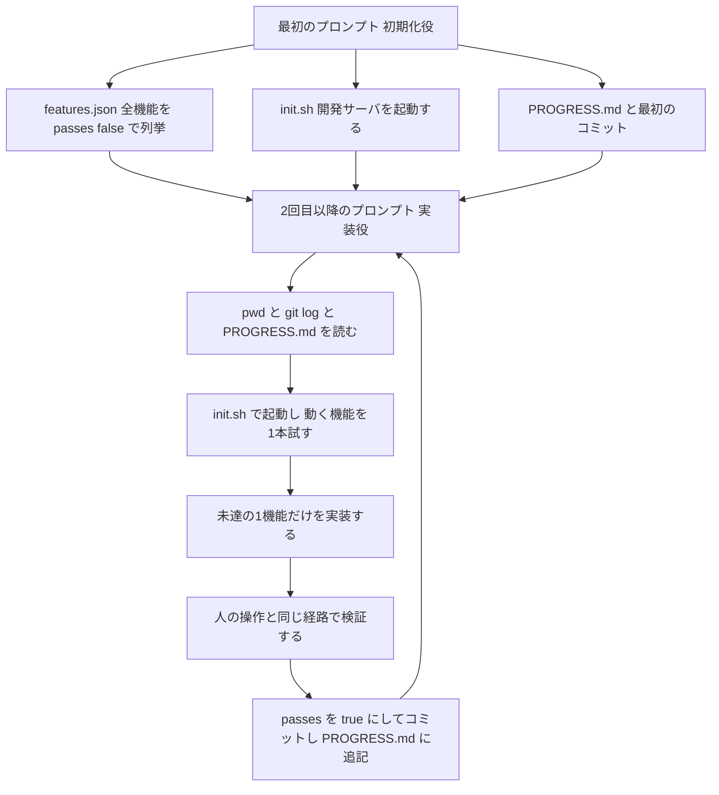
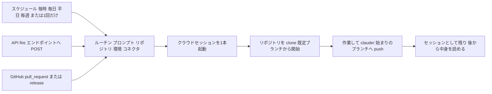
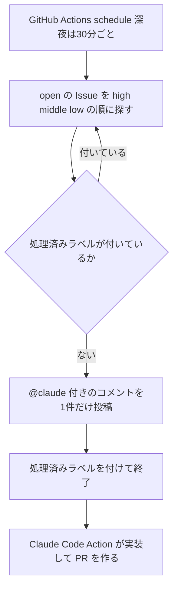

# Claude Daily — 2026-10-11（第050号）

## きょうの3行

- 新しいセッションは、前回の記憶を持たずに始まります。
- 進捗の正本を JSON に置くと、引き継ぎが成果物になります。
- Routines はクラウドで動くので、PC を閉じても走ります。

## ① ベストプラクティス — 進捗の正本を JSON に置き、初回だけ別のプロンプトで土台を作る

> セッションをまたぐ作業は、記憶ではなく成果物で繋ぎます。
> 機能リスト JSON の `passes` を唯一の正本にします。
> 最初の1セッションだけ、別のプロンプトで土台を作ります。



図1: 初期化役が土台を作り、実装役は毎回ファイルから状況を読み直す

長く走るエージェントが壊れる形は2つだと報告されています。
1つめは、一度に作りきろうとする形です。
途中で文脈が尽き、中途半端な実装が残ります。

2つめは、ある程度できた段階で「完成した」と宣言する形です。

どちらも、次のセッションが状況を読めないことから来ます。
だから土台づくりと実装を別のプロンプトに分け、状況をファイルとして残します。

#### 初期化役のプロンプト（最初の1セッションだけ）

```text
これはこのプロジェクトの最初のセッションです。機能の実装はまだしません。
次の4つを作って、最初のコミットを残してください。

1. features.json — 要件を端から端まで分解し、1機能を1要素として列挙する。
   各要素は category / description / steps / passes の4キーを持つ。passes は全件 false。
2. init.sh — 依存を入れ、開発サーバを起動するスクリプト。chmod +x まで済ませる。
3. PROGRESS.md — 「直近にやったこと」と「次にやること」の2節だけの空ファイル。
4. 上の3つを git add して、1回コミットする。

features.json は、後続のセッションが passes だけを書き換える正本です。
機能を削る・まとめることはしないでください。
```

#### `features.json`（1要素だけ抜粋。実装役は `passes` だけを書き換える）

```json
{
  "category": "functional",
  "description": "新規チャットボタンで空の会話が1件できる",
  "steps": [
    "トップ画面を開く",
    "「新規チャット」ボタンを押す",
    "会話が1件増えたことを確かめる",
    "本文側が初期状態の表示になっていることを確かめる",
    "サイドバーに新しい会話が並ぶことを確かめる"
  ],
  "passes": false
}
```

#### `init.sh`

```bash
#!/usr/bin/env bash
set -euo pipefail
npm ci
npm run dev -- --port 3000 &
for _ in $(seq 1 30); do
  if curl -sf http://localhost:3000 >/dev/null; then
    echo "dev server ready"
    exit 0
  fi
  sleep 1
done
echo "dev server did not come up" >&2
exit 1
```

#### `CLAUDE.md` に置く実装役の手順

```markdown
# セッションの始め方

1. `pwd` を打ち、作業ディレクトリを確かめる。
2. `git log --oneline -20` と `PROGRESS.md` を読み、直近の作業を把握する。
3. `bash init.sh` で開発サーバを起動し、`passes` が `true` の機能を1つ選んで動作を確かめる。
4. `features.json` から `passes` が `false` の機能を1つだけ選ぶ。

# セッションの終わり方

1. 実装した機能を、人の操作と同じ経路で検証する。画面はブラウザで確かめる。
2. 検証が通ったものだけ `passes` を `true` にする。
3. `PROGRESS.md` に「やったこと」と「次にやること」を追記する。
4. 変更をコミットする。メッセージには機能の `description` を入れる。

# features.json の扱い

- 書き換えてよいのは `passes` の値だけ。
- 機能の削除・統合・文面の変更はしない。通らない機能が隠れる。
```

| 壊れる形 | 初期化役がやること | 実装役がやること |
|---|---|---|
| 全体を「完成」と宣言してしまう | 機能リストを JSON で作り、全件 `passes` を `false` にする | 冒頭でリストを読み、未達の1機能だけを選ぶ |
| バグや未記録の進捗を残して終わる | git リポジトリと `PROGRESS.md` を用意する | 冒頭で履歴と記録を読み、基本動作を1本試す。終わりにコミットと追記 |
| 検証せずに「できた」と印を付ける | 機能ごとに `steps` を書いておく | `steps` のとおり確かめてから `passes` を変える |
| 起動のしかたを毎回探す | `init.sh` を書く | 冒頭で `init.sh` を読む |

セッション内での引き継ぎファイルは 2026-09-03 の号で扱いました。
ここでの違いは、正本を JSON に置き、書き換えてよい欄を1つに絞る点です。

#### ❌ 機能リストを Markdown のチェックリストで持つ

```markdown
- [x] 新規チャットボタン
- [ ] 会話の削除
```

Markdown は自由に書き換えられるので、モデルが行ごと消したり文面を変えたりします。
消えた行は「通らない機能」ではなく「存在しない機能」になり、残りの作業量が見えなくなります。

#### ✅ JSON にして、書き換えてよい欄を1つに限る

```json
{
  "category": "functional",
  "description": "会話を削除すると一覧から消える",
  "steps": ["会話を1件開く", "削除を押す", "一覧から消えたことを確かめる"],
  "passes": false
}
```

Markdown より JSON のほうが不適切な書き換えが起きにくい、と報告されています。
正本が1ファイルに決まるので、残りの作業量が `passes` の `false` の件数として数えられます。

「テストを消す・直すことは認めない」のような強い1文を添えると、書き換えが止まります。
公式ドキュメントは、「できた」の一言で済ませず、テストの出力や画面を添えるよう求めています。

出典: [Effective harnesses for long-running agents](https://www.anthropic.com/engineering/effective-harnesses-for-long-running-agents)
出典: [Best practices for Claude Code — Give Claude a way to verify its work](https://code.claude.com/docs/en/best-practices)

## ② 深掘り連載 第44回 — 定期実行に乗せる（Routines で運用を自動化する）

> Routines は、プロンプトと接続先をまとめて保存した設定です。
> 起動のしかたは、スケジュール・API・GitHub の3つです。
> 承認なしで進むので、使わせるリポジトリとコネクタは最小限に。



図2: トリガーが何であれ、起動されるのは毎回新しいクラウドセッション

ルーチンは1回の実行ごとに新しいセッションを立てます。
前回のやり取りは残らないので、プロンプトは単体で読めるように書きます。
公式ドキュメントは、やることと完了の条件まで書き切るよう求めています。

### 3つの実行場所を使い分ける

| 項目 | クラウド（Routines） | Desktop のローカルタスク | `/loop` |
|---|---|---|---|
| 動く場所 | Anthropic 管理のクラウド | 自分のマシン | 自分のマシン |
| マシンの電源 | 不要 | 必要 | 必要 |
| セッションを開いておく | 不要 | 不要 | 必要 |
| ローカルのファイル | 触れない。毎回クローン | 触れる | 触れる |
| 許可プロンプト | 出ない。自律実行 | タスクごとに設定 | セッションを継承 |
| 最小の間隔 | 1時間 | 1分 | 1分 |

選び方はマシンの状態で決まります。
閉じていても走らせたいならクラウド、手元のファイルや道具が要るなら Desktop です。
開いているセッションでの短い見張りには `/loop` を使います。

### トリガーは3つ。作れる場所が違う

| トリガー | 起動のしかた | 作れる場所 |
|---|---|---|
| スケジュール | 毎時・毎日・平日・毎週の既定、または将来の1点 | Web・Desktop・CLI の `/schedule` |
| API | 専用 URL への POST。`Authorization: Bearer` でトークンを送る | Web のみ。CLI はトークンを作れない |
| GitHub | `pull_request` と `release` の各アクション | Web、または CLI（v2.1.225 以降） |

1つのルーチンに複数のトリガーを付けられます。
夜間の定期実行と、PR が開いたときの起動を、同じルーチンに束ねられます。

### PR フィルタは全体一致で評価される

| フィルタ | 合わせるもの |
|---|---|
| Author | PR を出した人の GitHub ユーザー名 |
| Title / Body | PR の題名・説明の文字列 |
| Base branch / Head branch | 向き先のブランチ・持ち込み元のブランチ |
| Labels | PR に付いたラベル |
| Is draft / Is merged | 下書きかどうか・マージ済みかどうか |

条件は、等しい・含む・前方一致・いずれか・いずれでもない・正規表現から選びます。
並べた条件は全部そろって初めて起動します。

`matches regex` は欄の値を丸ごと見ます。
題名に `hotfix` を含むものを拾うなら `.*hotfix.*` と書きます。
部分一致だけが目的なら、正規表現ではなく `contains` を選びます。

### 走ったあとに何が残るか

| 見えるもの | 意味 |
|---|---|
| 実行一覧の緑 | セッションが起動して、途中で落ちずに終わったという意味だけ |
| プロンプトの成否 | 一覧では分からない。実行を開いて記録を読む |
| ブランチ | 書き込みは `claude/` で始まるブランチへの push |

リポジトリは毎回クローンされ、既定ブランチから始まります。

例外は PR イベントで起動したときです。
起動元の PR のリポジトリが、ルーチンの1つ目に並んでいる場合だけです。
このときは、既定ブランチではなく PR の先頭コミットから始まります。

通信のブロックやコネクタの不足も、一覧には出ません。
実行を開いて記録を読めば分かります。

### GitHub の接続が切れたときの挙動

| 経過 | ルーチンの状態 |
|---|---|
| 接続が切れてから72時間まで | 実行を飛ばして待つ。繋ぎ直せば自分で再開する |
| 72時間を越えたあと | ルーチンが止まる。繋ぎ直したうえで、自分で入れ直す |

ルーチンはリポジトリをクローンするため、GitHub の接続が前提です。
止まった場合に通知は来ないので、朝の成果物が来ない日は接続から疑います。

### 時間あたりの上限

| 起動のしかた | 上限 | 数え方 | 超えたとき |
|---|---|---|---|
| スケジュール実行（1回だけの実行を含む） | 1時間に100回 | アカウント単位 | 上限が戻るまで待つ |
| Run now・API 発火・1回実行の再設定 | 1時間に30回 | ルーチン単位。3つで共有 | その操作が失敗する |
| API 発火 | 1時間に100回 | アカウント単位。Run now とは別勘定 | その操作が失敗する |

どれも超過課金はありません。
利用量そのものは、対話セッションと同じ枠から引かれます。

### 使うべき時 / 使うべきでない時

| 場面 | 判断 | 理由 |
|---|---|---|
| 毎朝の PR 棚卸しやログ点検 | 使う | 入力が定型で、結果が1つの成果物に収まる |
| 監視の通知を受けて初動を作る | 使う | API トリガーで通知の本文を渡せる |
| PR が開いたら自前の観点でレビューする | 使う | GitHub トリガーと PR フィルタで対象を絞れる |
| 1時間より短い間隔で回したい | 使わない | 最小間隔は1時間。短い見張りは `/loop` |
| 手元の未コミットの状態を見たい | 使わない | 毎回クローンするので、手元の変更は入らない |
| 途中で人の判断を挟みたい | 使わない | 許可プロンプトが出ず、止まらずに進む |
| チームで同じ設定を共有したい | 使わない | ルーチンは個人アカウントのもの。共有されない |

| 用語 | 意味 |
|---|---|
| ルーチン | プロンプト・リポジトリ・環境・コネクタをまとめて保存した設定 |
| トリガー | ルーチンを起動する条件。1つのルーチンに複数付けられる |
| 発火テキスト | API や Run now で1回分だけ渡す文字列 |
| コネクタ | claude.ai 側に繋いだ MCP 連携。手元の `claude mcp add` は入らない |

出典: [Automate work with routines](https://code.claude.com/docs/en/routines)
出典: [Schedule recurring tasks in Claude Code Desktop](https://code.claude.com/docs/en/desktop-scheduled-tasks)

## ③ すぐ効くTIPS

### 1. 定期実行の時刻は正時を外す

毎時0分に置いた実行は、数分遅れて始まることがあります。
9時台に確実に動かしたいなら、9時07分のように少しずらします。

```text
/schedule update 平日のPRレビューを 9:07 に変えて
```

既定の選択肢にない間隔は、この `/schedule update` で cron 式として指定します。
最小の間隔は1時間で、それより短い式は拒否されます。

### 2. 発火テキストはプロンプトから名指しする

API や Run now で渡した文字列は、`<routine-fire-payload>` に包まれて届きます。
包まれた文字列は、未検証データとして扱われます。
プロンプトで名指ししなければ、ただの背景情報のままです。

```bash
curl -X POST https://api.anthropic.com/v1/claude_code/routines/trig_01ABCDEFGHJKLMNOPQRSTUVW/fire \
  -H "Authorization: Bearer sk-ant-oat01-xxxxx" \
  -H "anthropic-beta: experimental-cc-routine-2026-04-01" \
  -H "anthropic-version: 2023-06-01" \
  -H "Content-Type: application/json" \
  -d '{"text": "Sentry の SEN-4521 が本番で発火しました。"}'
```

`trig_01ABCDEFGHJKLMNOPQRSTUVW` はルーチンID、`sk-ant-oat01-xxxxx` は発行したトークンです。
プロンプト側には「routine-fire-payload のアラートを調べる」と書いておきます。

### 3. 空振りの理由は CLI で聞く

実行一覧の緑は、プロンプトが成功したことを意味しません。
v2.1.227 以降は、CLI でそのまま理由を聞けます。
Claude が実行の履歴とログを読み、何が起きたかを答えます。

```text
/schedule why did my nightly review do nothing this morning?
```

出典: [Automate work with routines — Trigger a routine](https://code.claude.com/docs/en/routines)
出典: [Automate work with routines — Manage routines from the CLI](https://code.claude.com/docs/en/routines)

## ④ 事例

### 月間コミットが11件から128件になった（Rocket Money、一次情報、チーム／業務展開）

| 値 | 何の数字か |
|---|---|
| 11件 → 128件 | 月間コミット数。2025-12 から 2026-07 で約11倍 |
| 76人中9位 | 担当プロダクトマネージャーの、リポジトリ全体での PR 作成者順位 |
| 3か月 | 初コミットから、その順位に入るまでの期間 |
| 約23人 | チームの人数。うちエンジニアは10人 |

家計管理アプリの Rocket Money が、金融エージェント Rowan を作った事例です。
コードはおもに Claude Code で書き、モデルは Opus を中心に使ったと書かれています。

入口の分類器がリクエストを読み、役割を1つに絞ったサブエージェントへ振り分けます。
分類器は Haiku 4.5、多くの作業役は Sonnet 5、金融の深い推論は Opus 5 を割り当てています。

チーム展開として読めるのは、担当者の広がりです。
エンジニア以外も書き手に回り、サブエージェントごとに複数人が並行して手を入れています。

出典: [Rocket Money builds a financial agent with near-zero hallucinations](https://claude.com/customers/rocket-money)

### 夜間に Issue を1件だけ拾わせる（Zenn / いもふけ、2025-08-05、二次情報）



図3: 1回の実行で扱うのは1件。残りは次の起動に回る

| 設定 | 値 |
|---|---|
| 実行の間隔 | JST 23:00〜05:30 は30分ごと、06:00 に1回 |
| 1回の実行で扱う件数 | 1件 |
| 優先度ラベル | `high` → `middle` → `low` の順に探す |
| 二重起動の防止 | `claude-code-requested` ラベルを付けて次回から除外する |

GitHub Actions の `schedule` で夜間に動かした例が報告されています。
未処理の Issue を1件選び、`@claude` を含むコメントを投稿する仕組みです。
cron は UTC なので、JST との変換を間違えやすいと書かれています。

効果の数値はありません。「朝に PR を確認するだけで済む」と書かれているだけです。
PR が実際にできたかを確かめる処理も、記事のスクリプトには入っていません。

出典: [夜間に AI が Issue を自動実装する GitHub Actions ＋ Claude Code 活用法](https://zenn.dev/imohuke/articles/ai-auto-issue-resolver-github-actions-claude)

## ⑤ 速報 — 新機能・変更点

前回チェックは v2.1.296 でした。きょうは新しい版も新しい発表もありません。

| いつ | 何が | どう効くか |
|---|---|---|
| 10/10 以降 | Claude Code の CHANGELOG は v2.1.296 が最新のまま | 入れ替えは不要。中身は 2026-10-10 の号 |
| 10/10 以降 | Platform リリースノートは 10/9 が最新 | 既報。Managed Agents の動的ワークフロー |
| 10/10 以降 | anthropic.com/news は 10/8 が最新 | 既報。Usage Policy の更新など |

出典: [Claude Code CHANGELOG](https://github.com/anthropics/claude-code/blob/main/CHANGELOG.md)
出典: [Claude Platform release notes](https://platform.claude.com/docs/en/release-notes/overview)

## ⑥ コマンド早見

| コマンド | 何をするか |
|---|---|
| `/schedule` | 対話でクラウドのルーチンを作る。別名は `/routines` |
| `/schedule list` | 保存したルーチンを一覧する |
| `/schedule update` | ルーチンの内容や cron 式を変える |
| `/schedule run` | ルーチンをその場で起動する |
| `/loop 5m /verify` | 開いているセッションで、5分おきに同じ指示を繰り返す |
| `bash init.sh` | 依存を入れて開発サーバを起動する |
| `chmod +x init.sh` | 起動スクリプトに実行権を付ける |
| `pwd` | 作業ディレクトリを確かめる。セッションの1手目 |
| `git log --oneline -20` | 直近20件の履歴から前回の作業を読む |
| `git add -A` | 初期化役が作った土台をまとめてコミットに載せる |

## ⑦ きょうの課題

**所要 10〜15分**　Next.js のリポジトリで、2つのセッションの継ぎ目を確かめます。

- **前提**: 既存の Next.js リポジトリ。`npm run dev` が動く状態から始めます。

**手順**

1. リポジトリ直下に `features.json` を作る。①の形で3件並べ、`passes` は全件 `false` にする。
2. `init.sh` を①のまま置き、`chmod +x init.sh` を打つ。
3. 空の `PROGRESS.md` を作り、3つを `git add -A` してコミットする。
4. `CLAUDE.md` に、①の「セッションの始め方」「セッションの終わり方」「features.json の扱い」を貼る。
5. Claude に「`features.json` の未達の機能を1つだけ実装してください」と頼む。
6. `/clear` して、同じ頼み方をもう1回する。

**確認方法**: 2回目が1回目と違う機能を選べば成功です。件数は次の1行で数えます。

```bash
python3 -c "import json;print(sum(f['passes'] for f in json.load(open('features.json'))))"
```

── 模範解答 ──

- 1回目のあと、`passes` の `true` は1件です。2回目のあとに2件になります。
- 2回目は `PROGRESS.md` の「次にやること」から再開します。
- `git log --oneline` に、`description` を含むコミットが2本並びます。

**なぜそうなるのか**: 残りの作業量が、`passes` が `false` の件数としてファイルに書かれているからです。
2回目のセッションは、会話の記憶ではなくファイルから状況を読み取ります。

**よくある詰まりどころ**

| 症状 | 原因 |
|---|---|
| 2回目が1回目と同じ機能を選んだ | `passes` を `true` にせずに終わった。終わり方の手順が抜けている |
| `features.json` の件数が減った | 書き換えてよい欄を限っていない。「`passes` の値だけ」を明記する |
| 一度に3件とも実装した | 「1つだけ選ぶ」が手順に入っていない |
| 検証なしで `true` になった | `steps` を書いていない。機能ごとに確認手順を持たせる |

あすは「第45回 記憶の設計 — auto memory とサブエージェントの記憶」を扱います。
